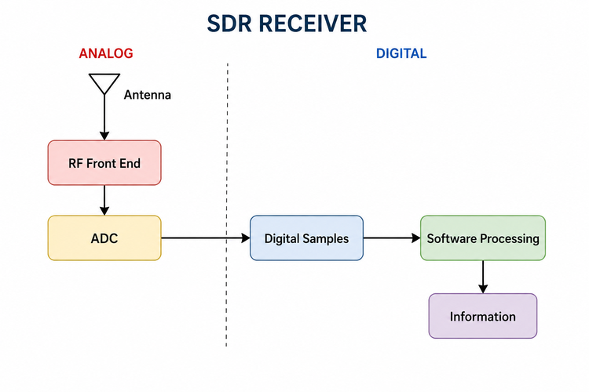
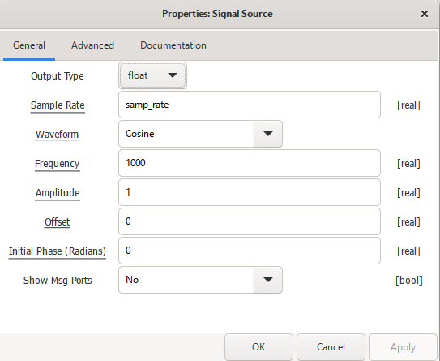
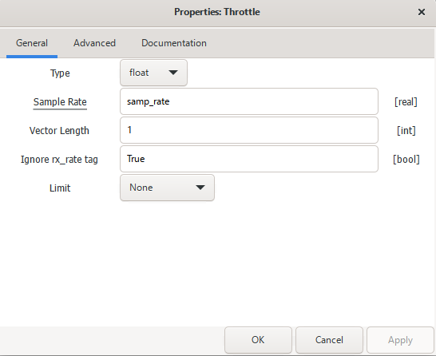
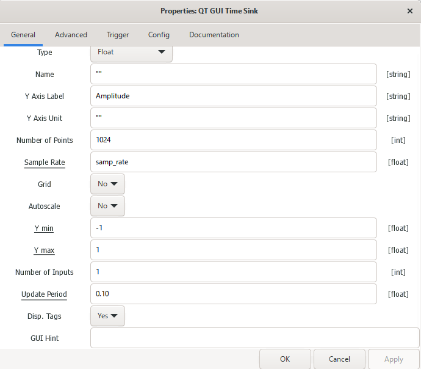
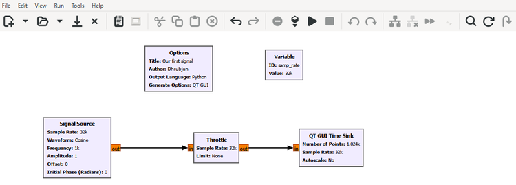
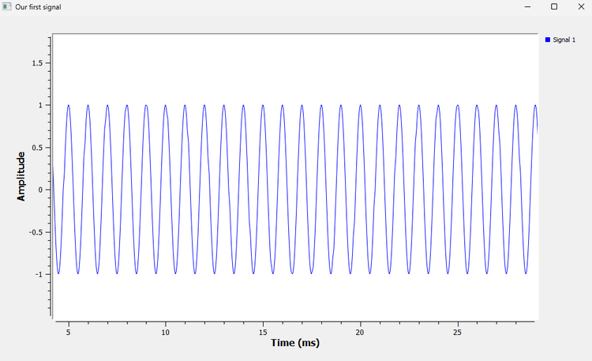

# Chapter 1: What Is Software Defined Radio?

## 1.1 What Does a Radio Actually Do?

Before talking about Software Defined Radio, let's forget the word **software** for a moment and start with a simpler question:

> What does a radio actually do?

Suppose you want to listen to an FM radio station. The antenna on your radio is not receiving only that station. Many electromagnetic signals may be reaching it at the same time: other FM stations, mobile networks, Wi-Fi, Bluetooth, satellite signals and much more.

Yet when you tune the radio, you hear the station you selected.

Somewhere inside the receiver, a sequence of operations is separating the signal you want from everything else and recovering the information carried by it.

At a very high level, we can picture the process like this:

```text
Signal in the air

        ↓

Receive the signal

        ↓

Select the signal we want

        ↓

Remove what we do not want

        ↓

Recover the information

        ↓

Audio / Data / Image / Something useful
```

Of course, a real receiver is more complicated than this. But this simple picture already tells us something useful: a radio is essentially a chain of operations performed on a signal.

What changes with Software Defined Radio is not necessarily **what** we need to do to the signal. The interesting change is **where and how we perform those operations**.

---

## 1.2 The Traditional Way of Building a Radio

Traditionally, many radio operations have been carried out using dedicated electronic circuits.

A receiver might contain amplifiers, filters, mixers, oscillators and demodulators, with each part designed to perform a particular job.

A very simplified receiver could look something like this:

```text
Antenna

   ↓

RF Amplifier

   ↓

Analog Filter

   ↓

Mixer

   ↓

Another Filter

   ↓

Demodulator

   ↓

Audio
```

There is nothing inherently wrong with this approach. In fact, as we will soon see, SDR does not make analog hardware disappear.

The difference is flexibility.

Imagine that a particular part of a radio has been built specifically to process one kind of signal. If we later want the radio to behave differently, we may need to modify or replace some of that hardware.

Now imagine moving some of those operations into software.

Instead of changing a circuit, we could change an algorithm.

That is the idea that makes Software Defined Radio so interesting.

---

## 1.3 So What Is Software Defined Radio?

A **Software Defined Radio**, usually shortened to **SDR**, is a radio in which many of the signal-processing operations are performed digitally in software rather than being fixed entirely in dedicated hardware.

A simplified SDR receiver can be thought of as:

```text
Antenna

   ↓

RF Front End

   ↓

ADC

   ↓

Digital Samples

   ↓

Software Processing

   ↓

Information
```

The **ADC**, or **Analog-to-Digital Converter**, marks an important boundary.

Before the ADC, we are dealing with an analog electrical signal.

After the ADC, the signal is represented by a sequence of numbers called **samples**.

Once we have numbers, we can process them digitally.

That digital processing can eventually include things such as filtering, frequency translation, demodulation, synchronization, decoding and signal detection.

We are going to encounter all of these later in the book. For now, the important idea is much simpler:

> In SDR, much of what the radio does to a signal can be controlled through digital processing and software.

---

## 1.4 Does "Software Defined" Mean There Is No Hardware?

No. An SDR is still a physical radio system, and it still needs hardware.

We cannot connect an antenna directly to a Python program and expect the computer to receive a 2.4 GHz Wi-Fi signal.

The signal arriving at an antenna is a physical electromagnetic signal. Before our software can do anything useful with it, some hardware has to receive it, condition it and convert it into digital samples.

The basic idea is shown below.



Notice the boundary between the analog and digital sides.

The antenna and RF front end are on the analog side. The **RF front end** may contain amplifiers, filters, mixers, oscillators and gain-control circuits, depending on the radio.

The ADC then converts the received analog signal into digital samples. From that point onward, a large amount of processing can be done digitally.

Later in the book, we will connect actual SDR hardware and see this boundary for ourselves.

For now, however, we don't need an antenna or an SDR device at all. GNU Radio can generate signals directly inside the computer, which gives us a controlled environment in which to learn what happens to them.

---

## 1.5 What About a Transmitter?

So far we have looked at a receiver, but the same idea works in the other direction.

A simplified SDR transmitter might look like this:

```text
Information

    ↓

Digital Signal Processing

    ↓

Digital Samples

    ↓

DAC

    ↓

RF Front End

    ↓

Antenna
```

Here, **DAC** means **Digital-to-Analog Converter**.

The DAC takes digitally generated samples and converts them into an analog electrical signal. The RF hardware can then condition that signal and prepare it for transmission.

A useful way to remember the two directions is:

```text
RECEIVER

Analog Signal → ADC → Digital Samples → Software


TRANSMITTER

Software → Digital Samples → DAC → Analog Signal
```

We will spend a large part of this book working on the digital portion in the middle. But it is worth remembering that those numbers ultimately represent real signals entering or leaving real hardware.

---

## 1.6 Why Is SDR So Useful?

The attraction of SDR becomes clearer when we think about flexibility.

Suppose we want to experiment with FM today, a digital modulation scheme tomorrow and a packet receiver next week. If every signal-processing operation were permanently fixed in hardware, making those changes could be difficult.

With SDR, much of the behaviour of the radio can be changed in software.

The same general SDR platform can therefore be used for many different purposes, including:

- broadcast radio experiments
- digital communication
- satellite reception
- spectrum monitoring
- packet communication
- radar experiments
- wireless research

This does not mean that software can do absolutely anything. The hardware still determines practical limits such as the frequencies we can receive or transmit, the available bandwidth and the achievable dynamic range.

But within those limits, SDR gives us an enormous amount of flexibility.

For learning, there is another advantage that is just as important. We don't have to read about a filter and simply trust that it behaves a certain way. We can build one, send a signal through it, change its settings and immediately see what happens.

That is how we are going to approach SDR throughout this book.

---

## 1.7 Where Does GNU Radio Fit?

This is where **GNU Radio** enters the picture.

GNU Radio is a signal-processing framework that lets us build systems by connecting processing blocks together.

Using **GNU Radio Companion**, or **GRC**, we can build these systems graphically. The result is called a **flowgraph**.

For our first experiment, the entire flowgraph will contain only three processing blocks:

```text
Signal Source → Throttle → QT GUI Time Sink
```

The Signal Source will create a signal.

Throttle will control how quickly the software processes the samples.

The QT GUI Time Sink will let us see those samples plotted against time.

The connections between the blocks show the direction in which the data travels.

One habit will help us throughout the book. Whenever you see a GNU Radio block, ask yourself two questions:

> What does the signal look like before this block?

and

> What has this block changed?

If you can answer those two questions, a complicated flowgraph starts to become much easier to understand.

Let's build our first one.

---

## 1.8 Our First Signal

We need a signal to experiment with, so we will begin with one of the simplest and most useful signals in signal processing: a sinusoid.

A sinusoidal signal can be written as:

$$
x(t)=A\cos(2\pi ft+\phi)
$$

If that equation looks unfamiliar, don't worry. We are not going to derive anything from it yet.

For the moment, there are only a few things worth noticing:

- **amplitude** tells us how large the signal is,
- **frequency** tells us how quickly it repeats,
- **phase** tells us where the signal is within its cycle.

Here, **t represents time**. We will unpack the rest of the equation properly in the next chapter.

For our first experiment, we will use:

```text
Amplitude = 1

Frequency = 1 kHz
```

Our goal is simple: ask GNU Radio to generate this signal and then display it.

---

## 1.9 Experiment 1: Build Your First GNU Radio Flowgraph

Open **GNU Radio Companion** and create a new flowgraph.

Before adding the signal-processing blocks, we need one variable.

### Create the Sample-Rate Variable

Search for a **Variable** block and add it to the flowgraph.

Set:

```text
ID: samp_rate

Value: 32000
```

You will see `32000` displayed as `32k` on the flowgraph. GNU Radio is simply using a shorter engineering-style notation.

You may be wondering why we chose 32,000, or even what a sample rate really means.

For now, just use the value.

We will spend an entire chapter answering those questions when we study sampling.

### Add the Signal Source

Search for **Signal Source** and add it to the flowgraph.

Open its properties and configure it as shown below.



We have asked the block to generate a cosine with a frequency of `1000` Hz and an amplitude of `1`.

Notice that we haven't typed `32000` into the Sample Rate field. Instead, we use:

```text
samp_rate
```

That refers to the variable we created earlier. If we later change the value of `samp_rate`, every block using that variable can follow the same change.

There are other settings in the window, such as Offset, Initial Phase and Show Msg Ports. We don't need to explore all of them now. We will introduce those options when they become useful.

### Add the Throttle

Next, search for **Throttle** and add it to the flowgraph.

Set its type to `Float` and its sample rate to `samp_rate`, as shown below.



Leave the remaining settings as shown.

At first, the purpose of Throttle may not be obvious. Why do we need to control the rate of a signal that exists entirely inside the computer?

We will answer that after we get the experiment running.

### Add the QT GUI Time Sink

Finally, add a **QT GUI Time Sink**.

Configure it as shown below.



For this experiment, the settings we care about most are:

```text
Type: Float

Number of Points: 1024

Sample Rate: samp_rate
```

The Time Sink contains many other options: Grid, Autoscale, Trigger, Update Period, GUI Hint and several more.

Ignore them for now.

There is no advantage in learning a property before we have a reason to use it. We will return to these settings gradually as our experiments become more interesting.

### Connect the Blocks

Now connect the three processing blocks:

```text
Signal Source → Throttle → QT GUI Time Sink
```

The completed flowgraph should look like this:



Take a moment to look at the flowgraph before running it.

The Signal Source shows `Frequency: 1k`.

The Variable shows `Value: 32k`.

The Time Sink shows `Number of Points: 1.024k`.

GNU Radio often uses prefixes such as `k` to keep values compact. So `1k` means 1000 and `32k` means 32000.

More importantly, try to read the flowgraph from left to right:

```text
Generate a cosine

        ↓

Control the processing rate

        ↓

Display the samples
```

That is the beginning of learning to read GNU Radio flowgraphs as signal-processing systems rather than collections of blocks.

---

## 1.10 Before You Press Run

Before running the flowgraph, make a prediction.

We told GNU Radio to generate a cosine.

We set its amplitude to 1.

We set its frequency to 1 kHz.

What do you expect the Time Sink to show?

You don't need to calculate anything. Just form a picture in your mind.

Now run the flowgraph.

---

## 1.11 Observing the Result

You should see something like this:



There is our first signal.

The waveform moves between approximately +1 and -1, which agrees with the amplitude we entered in the Signal Source. It also repeats regularly across the time axis.

We could already ask several interesting questions about this plot.

How long does one cycle take?

How many cycles occur in one second?

Why does the curve look smooth if GNU Radio is actually processing individual samples?

How many samples are being used to represent each cycle?

Don't try to answer all of these questions yet. Just notice that a simple-looking cosine has already given us several things to investigate.

For now, notice what we have actually done. We started with the mathematical description

$$
x(t)=A\cos(2\pi ft+\phi)
$$

then asked GNU Radio to generate numerical samples representing that signal, and finally displayed those samples in the time domain.

This simple experiment is going to become the starting point for much more complicated systems.

---

## 1.12 GNU Radio Toolbox

Throughout this book, we will keep a running **GNU Radio Toolbox**.

The idea is not to list every property of every GNU Radio block. Instead, whenever we meet a useful block or feature, we will learn the part of it that matters for the experiment we are doing.

As the same blocks appear again, we will gradually learn more about them.

### Signal Source

The **Signal Source** generates a known signal inside GNU Radio.

For our first experiment, it generates a 1 kHz cosine. Later, we will change its frequency, amplitude, phase and waveform, and we will also use it with complex signals.

It is especially useful when learning because we know exactly what signal we are putting into the flowgraph.

One distinction is worth making immediately:

> Signal Source is generating digital samples inside GNU Radio. It is not producing a physical RF signal at an antenna connector.

That difference will become much clearer when we study sampling and SDR hardware.

### Throttle

Throttle is a little unusual because it does not perform the kind of signal-processing operation we normally associate with a radio.

Our current flowgraph exists entirely inside the computer. There is no SDR hardware, sound card or other device forcing samples to arrive or leave at a particular real-world rate.

Without something controlling the rate, GNU Radio could process the generated samples as quickly as the computer and the rest of the flowgraph allow.

Throttle prevents that by limiting the rate at which samples move through this software-only flowgraph.

A useful rule for now is:

> In a simulation made only from software-generated sources and processing blocks, you will often need a Throttle block.

Later, when real hardware provides the timing, the situation changes.

Also remember that Throttle is **not** an ADC and it is not performing sampling. The signal inside GNU Radio is already represented by samples.

### QT GUI Time Sink

The **QT GUI Time Sink** lets us look at samples in the time domain.

In this experiment it immediately showed us the shape and amplitude of our cosine.

Later we will use it to compare signals, observe delays, inspect distortion and watch what happens when we change different parts of a flowgraph.

But time is only one way of looking at a signal.

Soon we will look at exactly the same signal from a completely different point of view: frequency.

---

## 1.13 A Small Detail That Will Matter Later: Data Types

Look again at the ports connecting the blocks in the flowgraph.

You may have noticed that GNU Radio uses colours for them.

Those colours are not just decoration. They help indicate the type of data travelling through a connection.

In our first experiment, we selected:

```text
Float
```

for the Signal Source, Throttle and Time Sink.

We are not going to study GNU Radio data types in detail yet, but remember this simple rule:

> Blocks connected together must agree on the type of data being exchanged.

This gives us a perfect opportunity to deliberately break our first flowgraph.

---

## 1.14 Experiment 2: Break the Flowgraph on Purpose

Getting a flowgraph to work is useful.

Breaking it on purpose can teach us even more.

### Create a Type Mismatch

Stop the flowgraph and open the Signal Source properties.

Change:

```text
Output Type: Float
```

to:

```text
Output Type: Complex
```

Leave the Throttle set to `Float`.

Now look at the connection between the two blocks and try to run or reconnect the flowgraph.

GNU Radio should indicate that the two ports are not compatible.

We have not learned what complex samples are yet, so don't worry about **why** Float and Complex are different. That comes later.

The lesson for now is simply that the data leaving one block must be compatible with the data expected by the next block.

When you are finished, change the Signal Source back to `Float`.

### Remove Throttle

Restore the working flowgraph.

Now remove the Throttle block and connect:

```text
Signal Source → QT GUI Time Sink
```

Run the flowgraph again.

Something interesting may happen: the flowgraph can still run.

Without Throttle, GNU Radio is free to process the samples as quickly as the computer and the rest of the flowgraph allow. You may notice increased CPU usage or unusual GUI behaviour.

This tells us something important about Throttle.

It is not there because our cosine mathematically requires it. It is there because our experiment has no real hardware controlling the processing rate.

Stop the flowgraph and put Throttle back.

We will investigate this much more carefully when we study sampling.

---

## 1.15 A Flowgraph Can Be Wrong Without Crashing

There is one more idea worth taking from our first experiment.

Sometimes GNU Radio makes a problem obvious. Two ports may be incompatible, a parameter may be invalid, or the flowgraph may refuse to start.

Those are relatively easy problems because the software tells us that something is wrong.

But later we will meet a more interesting kind of mistake.

A flowgraph can run perfectly and still produce the wrong result.

GNU Radio cannot always know what signal-processing result we intended. The program may run without any error message even though we have chosen a poor parameter or designed the processing chain incorrectly.

This is one reason we will keep using the same habit throughout the book:

```text
Predict

   ↓

Run

   ↓

Observe

   ↓

Explain
```

And quite often:

```text
Break it

   ↓

Observe what changed

   ↓

Work out why
```

That is much more useful than simply memorizing which blocks should be connected together.

---

## 1.16 Try It Yourself

Before closing the flowgraph, experiment with it for a few minutes.

Start by changing the Signal Source frequency from:

```text
1000
```

to:

```text
2000
```

Run the flowgraph again.

What changed in the Time Sink?

Now return the frequency to `1000` and change the amplitude:

```text
Amplitude = 0.5
```

What changed this time?

Try:

```text
Amplitude = 2
```

Then try changing the Offset.

Finally, return the other settings to their original values and change:

```text
Waveform: Cosine
```

to:

```text
Waveform: Square
```

Run the flowgraph again.

What changed?

Which settings stayed exactly the same?

Don't worry if you cannot yet explain every detail mathematically. In particular, there is much more to say about why a square wave looks and behaves differently from a cosine. We will get there later.

For now, the point is to start developing a habit that we will use throughout the book:

> Change one thing at a time, predict what should happen, and then compare your prediction with what GNU Radio actually shows you.

If something surprises you, that is usually where the interesting learning begins.

---

## 1.17 What We Learned

We started this chapter with a simple question: what does a radio actually do?

At its heart, a receiver takes a signal, selects and processes what we are interested in, and recovers useful information from it.

Software Defined Radio changes how much of that processing can be carried out digitally and controlled through software.

We also saw that **software defined** does not mean **hardware free**. A practical SDR still has an analog side containing the antenna and RF front end. The ADC provides the bridge into the digital world, where the signal can be represented as samples and processed numerically.

Most importantly, we built our first working GNU Radio flowgraph:

```text
Signal Source → Throttle → QT GUI Time Sink
```

Along the way, we learned how to create a variable, configure and connect GNU Radio blocks, generate a known signal, and view it in the time domain. We also saw that GNU Radio connections carry particular data types, learned the basic purpose of Throttle in a software-only experiment, and deliberately broke a working flowgraph to see what we could learn from it.

We have not gone very deep into the mathematics yet, and that is intentional.

We first need to become comfortable looking at signals, changing them and asking sensible questions about what we see.

---

## 1.18 Connecting to the Next Chapter

Our first GNU Radio experiment generated a 1 kHz cosine.

We could see it on the screen, but we used several words without really exploring them:

**amplitude**, **frequency**, **phase**, **period** and **offset**.

What do they actually mean when we look at a waveform?

What changes when we double the frequency?

What does a phase shift look like?

What does adding an offset physically do to the signal?

Instead of starting with definitions and equations, we will answer those questions by changing the signal and watching what happens.

That question leads naturally into Chapter 2:

> **What exactly is a signal?**
