# Chapter 11: Correlation, Matched Filtering and Signal Detection

## Main Question

**How can a receiver find a known signal hidden inside another signal?**

In Chapter 10, we looked at an LTI system from a useful point of view. We treated a signal as a collection of shifted and scaled impulses, then built the output by adding shifted and scaled copies of the system's impulse response.

That gave us convolution.

In this chapter, we reuse the same machinery for a different purpose.

Instead of asking what a system does to a signal, we ask whether a known waveform appears somewhere inside the received samples.

That question appears throughout receiver design. A radar receiver may search for a delayed copy of a transmitted pulse. A digital receiver may search for a preamble marking the start of a packet. GNSS receivers search for known spreading codes. Sonar systems search for echoes of known acoustic waveforms.

The received waveform may be noisy, delayed, or difficult to recognise by eye. The receiver still needs a reliable way to find it.

The main tool is **correlation**. From correlation, we will move naturally to the **matched filter**, and then to a simple detection rule based on a **threshold**.

## 11.1 From Convolution to Detection

Suppose the short sequence

$$
p[n]=(1,\;1,\;-1,\;1)
$$

may appear somewhere inside a longer received sequence.

For example,

$$
x[n]=(0,\;0,\;0,\;1,\;1,\;-1,\;1,\;0,\;0,\;0).
$$

In this small example, the pattern is easy to see. A real receiver may process thousands or millions of samples, and the samples may contain noise.

We therefore need a numerical way to ask:

> How well do the received samples match the known pattern at this position?

Then we shift the comparison and ask the same question again.

That is the basic idea of correlation.

## 11.2 Correlation as a Sliding Similarity Test

Consider the known pattern

$$
p[n]=(1,\;1,\;-1,\;1).
$$

If it lines up perfectly with the same four samples in the received signal, the comparison gives

$$
R=1(1)+1(1)+(-1)(-1)+1(1)=4.
$$

Every sample agrees, so every product contributes positively.

At a poor alignment, some products may be positive, some negative, and some may involve zeros. The sum is then smaller.

This gives us a useful first interpretation:

> **Correlation measures similarity as one signal is shifted relative to another.**

For the simple real-valued sequences used here, a large positive value means the received samples strongly resemble the known pattern at that alignment.

### Correlation and Convolution

Correlation is closely related to the convolution we studied in Chapter 10.

For a real known sequence of length \(N\), we can reverse the sequence and use it as the impulse response of an FIR filter:

$$
h[n]=p[N-1-n].
$$

For our four-sample pattern,

$$
p[n]=(1,\;1,\;-1,\;1),
$$

the reversed sequence is

$$
h[n]=(1,\;-1,\;1,\;1).
$$

An FIR filter with these taps performs convolution, but because the taps contain the reversed known pattern, the output acts as the correlation sequence for this experiment.

For complex signals, the corresponding matched sequence is both reversed and conjugated:

$$
h[n]=p^*[N-1-n].
$$

We will return to the conjugation when we introduce the matched filter.

## 11.3 Experiment 11.1: Basic Correlation

Our first experiment asks whether GNU Radio can locate the four-sample pattern inside a longer sequence.

We create a 100-sample frame with the pattern beginning after 20 zeros:

```python
(0,)*20 + (1, 1, -1, 1) + (0,)*76
```

The frame contains

$$
20+4+76=100
$$

samples.

Use the Vector Source settings:

| Setting | Value |
|---|---|
| Output Type | Float |
| Vector | `(0,)*20 + (1, 1, -1, 1) + (0,)*76` |
| Repeat | Yes |
| Vector Length | 1 |

The FIR filter uses the reversed pattern:

```python
(1, -1, 1, 1)
```

Use the Decimating FIR Filter with:

| Setting | Value |
|---|---|
| Decimation | `1` |
| Taps | `(1, -1, 1, 1)` |

The Vector Source is connected directly to one input of the QT GUI Time Sink and through the FIR filter to the other input.

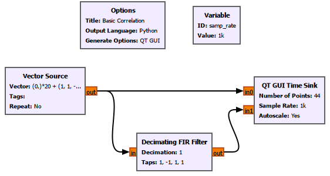

For the saved display, we use 44 points so that the pattern and its correlation response are easy to inspect.

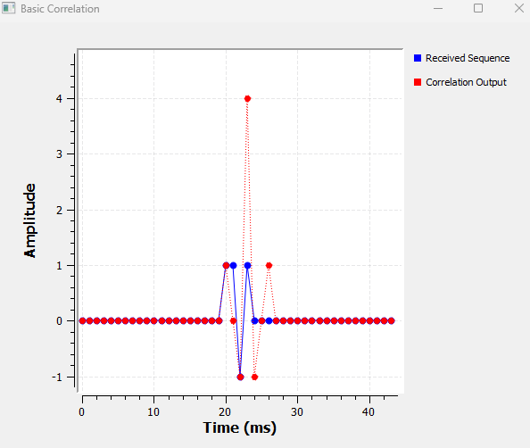

The blue samples are the received sequence. The red samples are the correlation output.

The important feature is the peak:

$$
R_{\max}=4.
$$

That is exactly the value expected from a perfect four-sample match.

### Why Does the Peak Appear Later Than the Start of the Pattern?

The pattern begins at sample 20, but the full correlation peak appears three samples later.

The correlator needs all four samples before the complete four-sample comparison is available. If a pattern of length \(N\) begins at sample \(n_0\), then for this FIR implementation the full-alignment peak occurs at

$$
n_{\text{peak}}=n_0+N-1.
$$

Here,

$$
n_{\text{peak}}=20+4-1=23.
$$

The peak therefore tells us not only that a match occurred, but also when the full pattern became aligned with the filter.

## 11.4 Peak Height and Peak Location

The correlation output contains two different kinds of information.

The **height of the peak** tells us how strongly the received samples resemble the known pattern.

The **location of the peak** tells us where the pattern occurred.

We can demonstrate both ideas by changing the experiment.

### Experiment 11.2: Shift the Pattern

Move the same pattern ten samples later:

```python
(0,)*30 + (1, 1, -1, 1) + (0,)*66
```

Nothing else changes.

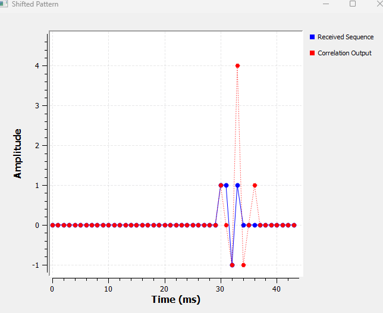

The correlation peak still reaches approximately

$$
4,
$$

because the waveform itself is unchanged.

But the pattern now begins at sample 30, so the full-alignment peak occurs at

$$
n_{\text{peak}}=30+4-1=33.
$$

The peak has moved by exactly ten samples.

This is why correlation is so useful for timing and synchronization. The receiver may not know exactly when a known event will arrive, but the location of the correlation peak reveals its timing.

### Experiment 11.3: A Mismatched Pattern

Now keep the correlator unchanged but alter the received pattern to

$$
(1,\;-1,\;-1,\;1).
$$

The Vector Source becomes:

```python
(0,)*20 + (1, -1, -1, 1) + (0,)*76
```

The FIR taps remain:

```python
(1, -1, 1, 1)
```

The receiver is still searching for the original pattern

$$
(1,\;1,\;-1,\;1).
$$

At the intended alignment,

$$
R=1(1)+1(-1)+(-1)(-1)+1(1)=2.
$$


The perfect-match value of 4 is gone. The intended alignment now gives only 2.

Negative correlation values can also appear at other alignments. A negative value does not simply mean that something has failed. It indicates that, at that alignment, the received samples have a stronger opposite or inverted relationship to the known pattern.

For our present detector, the main lesson is simple:

> **A better match produces a stronger positive correlation response at the intended alignment.**

## 11.5 Experiment 11.4: Correlation in Noise

Clean sequences are useful for learning, but real receivers usually work with noise.

Let the received signal be

$$
r[n]=s[n]+w[n],
$$

where \(s[n]\) is the signal of interest and \(w[n]\) is noise.

At the correct alignment, the known signal contributes in an organised way. Matching samples reinforce one another.

Noise is not deliberately arranged to match the known pattern. Some noise samples increase the correlation while others decrease it. Noise does not disappear, but the known waveform can still produce a recognisable peak.

For this experiment, use a 44-sample frame:

```python
(0,)*20 + (1, 1, -1, 1) + (0,)*20
```

Add Gaussian noise using:

| Setting | Value |
|---|---|
| Noise Type | Gaussian |
| Amplitude | `0.5` |
| Seed | `0` |
| Output Type | Float |

With `Seed = 0`, GNU Radio chooses a seed from the system clock, so each run can produce a different noise sequence. A non-zero seed is preferable when an exactly repeatable noise realization is required.

The noisy signal is sent both to the display and to the FIR correlator.

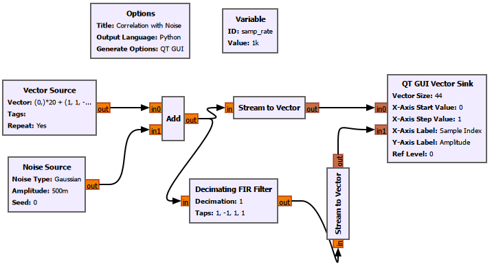

### Displaying One Frame at a Time

With Gaussian noise running continuously, a QT GUI Time Sink behaves like a live oscilloscope and keeps refreshing. For this controlled experiment, it is more useful to display one fixed frame at a time.

Each Stream to Vector block uses:

| Setting | Value |
|---|---|
| IO Type | Float |
| Num Items | `44` |
| Vector Length | `1` |

The QT GUI Vector Sink then displays those 44 values against fixed sample indices.

Use:

| Setting | Value |
|---|---|
| Vector Size | `44` |
| X-Axis Start Value | `0` |
| X-Axis Step Value | `1` |
| X-Axis Label | `Sample Index` |
| Y-Axis Label | `Amplitude` |
| Grid | Yes |
| Autoscale | Yes |
| Average | None |
| Number of Inputs | `2` |
| Update Period | `2` s |

Label the two traces:

- `Noisy Received Signal`
- `Correlation Output`

The two-second update period changes only the GUI refresh rate. It does not change the DSP.

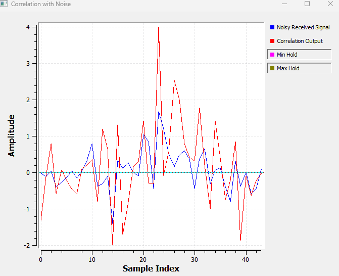

The received waveform is now much harder to interpret directly.

The correlation output still produces a strong response near the expected pattern location, but the peak is no longer guaranteed to be exactly 4. Noise can push it upward or downward.

Correlation fluctuations also appear elsewhere because a random noise realization can accidentally resemble part of the known pattern.

The limitation is now clear:

> **Four samples do not give the receiver much evidence.**

A longer known pattern should help.

## 11.6 Experiment 11.5: A Longer Known Pattern

Increase the pattern from 4 samples to 16 samples:

```python
(1, 1, -1, 1, -1, -1, 1, -1,
 1, -1, -1, -1, 1, 1, 1, -1)
```

Place it after 20 zeros in a 64-sample frame:

```python
(0,)*20 + (1, 1, -1, 1, -1, -1, 1, -1,
           1, -1, -1, -1, 1, 1, 1, -1) + (0,)*28
```

The FIR taps are the reversed pattern:

```python
(-1, 1, 1, 1, -1, -1, -1, 1,
 -1, 1, -1, -1, 1, -1, 1, 1)
```

Because the frame is now 64 samples long, use `Num Items = 64` in both Stream to Vector blocks and `Vector Size = 64` in the Vector Sink.

Keep the noise amplitude at `0.5`.

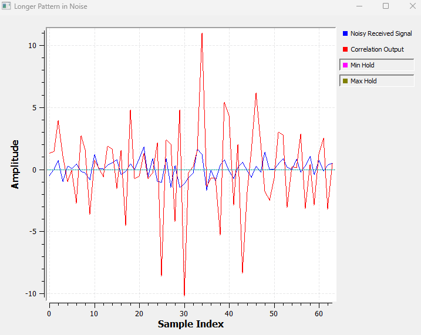

The strongest useful response appears around sample 35.

The pattern begins at sample 20 and contains 16 samples, so

$$
n_{\text{peak}}=20+16-1=35.
$$

Without noise, a perfect match would give

$$
R_{\max}=16,
$$

because every one of the sixteen \(\pm1\) samples contributes \(+1\) at full alignment.

With noise present, the peak is perturbed, but it stands out much more clearly than the four-sample case.

The reason is important. At the correct alignment, the desired signal contributes coherently across many samples. The noise contributions do not all reinforce in the same structured way.

A longer known sequence therefore gives the receiver more evidence to accumulate.

This is one reason practical communication and ranging systems use preambles, training sequences, spreading codes, or coded pulses rather than trying to detect an event from only a few samples.

## 11.7 From Correlation to the Matched Filter

We now know the waveform we want to detect, and we know that reversing it and using it as FIR taps produces a strong response when the waveform arrives.

That leads to the matched filter.

For a known discrete-time waveform \(p[n]\) of length \(N\), the matched-filter impulse response is

$$
h[n]=p^*[N-1-n].
$$

The star denotes complex conjugation.

For our real-valued \(\pm1\) sequence,

$$
p^*[n]=p[n],
$$

so the matched-filter taps are simply the reversed pattern:

$$
h[n]=p[N-1-n].
$$

For the real-valued experiments in this chapter, correlation with the known pattern and filtering with this matched filter lead to the same FIR output.

The two viewpoints answer slightly different questions.

**Correlation viewpoint:** How similar is the received signal to the known waveform at each alignment?

**Matched-filter viewpoint:** What FIR filter should we use to produce a strong response when that known waveform arrives?

For additive white Gaussian noise, the matched filter has an important theoretical property: it maximises the output signal-to-noise ratio at the chosen sampling instant for the known waveform.

We do not need the full proof here. The experiments make the practical effect visible.

### Experiment 11.6: Correlation vs. Matched Filter

Send the same noisy received signal into two Decimating FIR Filters.

Both use exactly the same taps:

```python
(-1, 1, 1, 1, -1, -1, -1, 1,
 -1, 1, -1, -1, 1, -1, 1, 1)
```

Label one branch `Correlation Output` and the other `Matched Filter Output`.

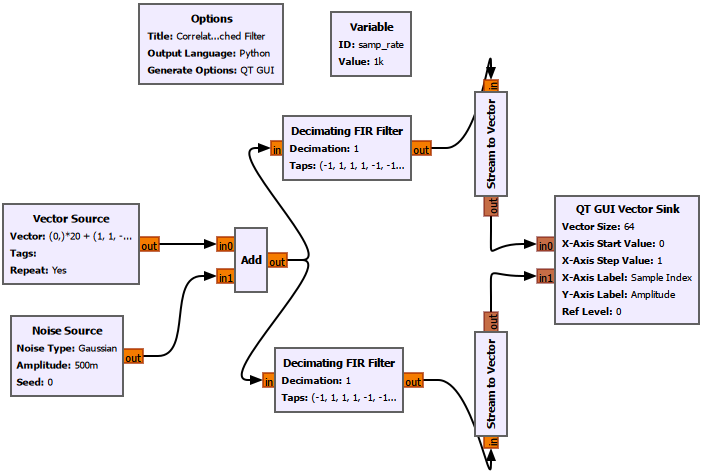

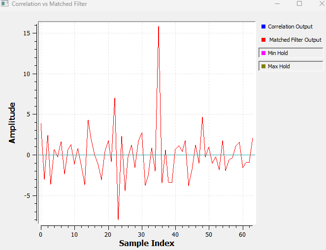

The two curves lie on top of one another because both filters receive the same input and use the same taps.

Therefore,

$$
y_{\text{corr}}[n]=y_{\text{MF}}[n].
$$

For this real-valued sequence and this implementation, our correlator is the matched filter.

This connects directly back to Chapter 10. An ordinary FIR filter can become a detector for a known waveform simply by choosing its impulse response appropriately.

## 11.8 Experiment 11.7: Matched vs. Mismatched Filter

The word *matched* matters because the filter is designed for a particular waveform.

Keep the first FIR filter correctly matched to the transmitted 16-sample pattern:

```python
(-1, 1, 1, 1, -1, -1, -1, 1,
 -1, 1, -1, -1, 1, -1, 1, 1)
```

For the second filter, deliberately use a different 16-sample sequence:

```python
(1, -1, 1, -1, 1, -1, 1, -1,
 1, -1, 1, -1, 1, -1, 1, -1)
```

Both filters receive exactly the same noisy samples.

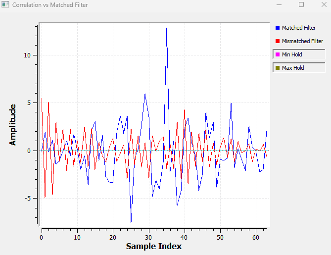

Near the expected full-alignment position around sample 35, the matched filter produces a strong positive peak.

The mismatched filter does not.

For the correctly matched filter, the signal contributions reinforce. In the ideal noise-free case,

$$
1^2+1^2+(-1)^2+\cdots+(-1)^2=16.
$$

With the mismatched filter, some terms reinforce and others oppose one another, so much more cancellation occurs.

A matched filter does not necessarily make the whole output waveform look clean. Its job is more specific:

> **It produces a strong response at the detection instant for the waveform it was designed to match.**

## 11.9 Experiment 11.8: Threshold-Based Detection

So far, we have looked at the graph and recognised a large peak.

A practical receiver needs a rule that can be applied automatically.

The simplest rule is a threshold.

For this experiment, choose

$$
T=8.
$$

This is an experimental value for the signal and noise levels used here. It is not a universal or optimal threshold.

We want to declare a detection when the matched-filter output is greater than the threshold:

$$
y[n]>T.
$$

In this GNU Radio flowgraph, the comparison is built from basic blocks:

`Matched Filter → Add Const (-8) → Binary Slicer → Char to Float → Detection Output`

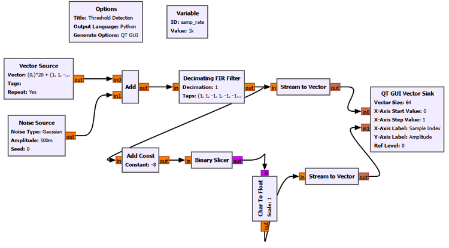

### Moving the Threshold to Zero

The Binary Slicer makes its decision around zero, so we first subtract 8:

$$
z[n]=y[n]-8.
$$

The Add Const block adds a constant. To subtract 8, use:

```text
Constant = -8
```

If

$$
y[n]=11,
$$

then

$$
z[n]=11-8=3,
$$

which is positive.

If

$$
y[n]=5,
$$

then

$$
z[n]=5-8=-3,
$$

which is negative.

The Binary Slicer converts positive input to binary `1` and negative input to binary `0`.

The exact case \(y[n]=8\), which produces zero after subtraction, lies exactly on the decision boundary and is not important for this experiment. Our intended detection rule is based on crossing above the threshold.

### Converting the Detector Output for Display

The Binary Slicer produces byte/char samples. The Char to Float block converts those values to floating-point samples so that they can be displayed alongside the matched-filter output.

With the default scale,

```text
0 -> 0.0
1 -> 1.0
```

This conversion does not change the detection logic.

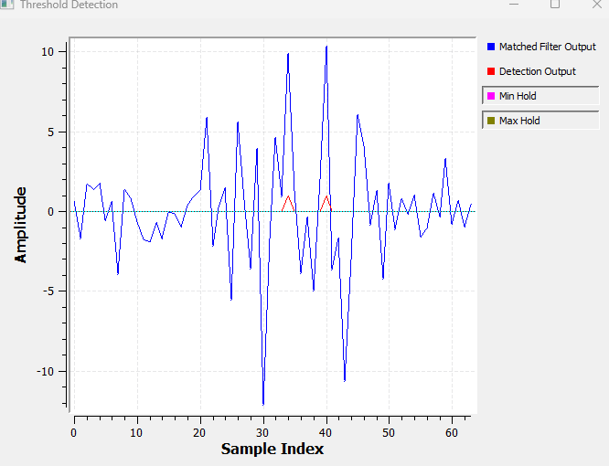

The blue curve is the matched-filter output.

The red curve is the binary detection output.

When the matched-filter response rises above the chosen threshold, the detector produces a `1`.

We have now moved from a visual judgement to a rule that the receiver can apply sample by sample.

## 11.10 False Alarms and Missed Detections

Choosing a threshold introduces a trade-off.

Suppose we lower the threshold from

$$
T=8
$$

to

$$
T=4.
$$

The detector becomes more sensitive. A weaker signal has a better chance of crossing the threshold, but noise fluctuations also have a better chance of crossing it.

If the receiver declares a signal when no desired signal is actually present, that is a **false alarm**.

Now suppose we raise the threshold to

$$
T=12.
$$

Noise is less likely to trigger a detection, but a real signal weakened by noise, fading, or other channel effects may also fail to cross the threshold.

If the signal is present but the receiver does not detect it, that is a **missed detection**.

| Threshold Choice | Typical Effect |
|---|---|
| Lower threshold | Greater sensitivity, but more false alarms |
| Higher threshold | Fewer false alarms, but greater risk of missed detections |

There is no threshold that is automatically correct for every receiver.

Practical systems choose thresholds using the noise environment, expected signal strength, desired probability of detection, acceptable false-alarm probability, and the cost of making the wrong decision.

A full statistical treatment belongs to detection theory. For now, the key relationship is enough:

> **Correlation or matched filtering creates a detection statistic. The threshold turns that statistic into a decision.**

## 11.11 Complex SDR Signals

The experiments in this chapter deliberately use real-valued \(\pm1\) sequences so that the underlying idea remains easy to see.

SDR systems often work with complex I/Q samples.

For a complex known waveform, simply reversing the samples is not enough. We also take the complex conjugate:

$$
h[n]=p^*[N-1-n].
$$

The intuition remains the same. The receiver asks how strongly the current part of the received complex signal matches the complex waveform it expects.

The conjugation ensures that the complex phases combine correctly during the comparison.

This is why complex signals, I/Q representation, correlation, and matched filtering fit together naturally in SDR.

It is also worth keeping one distinction clear. In these experiments, the matched-filter output is real because the known sequence and received test sequence are real. In a general complex receiver, the matched-filter output can be complex, and a detector may work with its magnitude or magnitude squared rather than comparing the raw complex value directly with a real threshold.

## 11.12 GNU Radio Toolbox

Several familiar GNU Radio blocks take on new roles in this chapter.

| GNU Radio Block | Role in This Chapter |
|---|---|
| Vector Source | Generates known sample sequences and places the test pattern at controlled positions |
| Decimating FIR Filter | Implements the correlator or matched filter with `Decimation = 1` |
| Noise Source | Adds Gaussian noise to the received sequence |
| Add | Forms \(r[n]=s[n]+w[n]\) |
| Stream to Vector | Groups a fixed number of scalar samples into one vector for frame-based display |
| QT GUI Vector Sink | Displays fixed sample indices for the received frame and detector outputs |
| Add Const | Subtracts the chosen threshold by adding a negative constant |
| Binary Slicer | Converts the sign of the threshold-shifted value into a binary decision |
| Char to Float | Converts the binary byte/char stream into floating-point values for display |

The Vector Source and FIR filter are especially important conceptually. We know exactly what samples enter the experiment, and the FIR taps let us turn convolution into correlation or matched filtering.

For noisy experiments, the distinction between signal processing and display processing also matters. Stream to Vector and QT GUI Vector Sink make the frame easier to inspect, but they do not create the correlation peak. The peak is produced by the FIR operation itself.

## 11.13 Explore Further

The experiments become more useful when we deliberately change one thing at a time and predict the result before running the flowgraph.

1. Move the four-sample pattern to a new location. Predict the new peak position using \(n_{\text{peak}}=n_0+N-1\).

2. Change one or two signs in the received pattern while keeping the correlator taps unchanged. Predict how the intended-match correlation value should change.

3. Increase the Gaussian noise amplitude. Observe how both the desired peak and the off-peak fluctuations change.

4. Replace the 16-sample pattern with another known \(\pm1\) sequence. Reverse the new sequence for the FIR taps and verify the new full-alignment peak.

5. Change the threshold from 8 to 4 and then to 12. Compare the number of detections and consider the false-alarm versus missed-detection trade-off.

6. Use a non-zero Noise Source seed and repeat the experiment. The same seed should reproduce the same noise sequence, which makes controlled comparisons easier.

7. Deliberately use the unreversed pattern as the FIR taps. Compare the result with the correctly reversed matched sequence and identify how the useful peak changes.

## 11.14 What We Learned

We began with a simple question: how can a receiver find a known waveform inside received samples?

Correlation gave us a sliding similarity measurement.

For the four-sample pattern

$$
(1,\;1,\;-1,\;1),
$$

a perfect match produced

$$
R_{\max}=4.
$$

Moving the pattern moved the correlation peak by the same amount. Changing one sample reduced the intended-match response.

When Gaussian noise was added, the received waveform became harder to recognise directly, but the correlation output could still show a useful peak near the correct location.

Increasing the known pattern from 4 samples to 16 gave the receiver more coherent evidence to accumulate. In the noise-free case, the full match would produce

$$
R_{\max}=16.
$$

For a real known waveform, correlation can be implemented using an FIR filter whose taps are the reversed waveform.

For a general complex waveform, the matched-filter taps are

$$
h[n]=p^*[N-1-n].
$$

A correctly matched filter produces a much stronger useful response than a deliberately mismatched filter.

Finally, a threshold converts the matched-filter output into a detection decision.

The full receiver idea is therefore:

`Received Samples → Correlation / Matched Filter → Detection Statistic → Threshold → Detection Decision`

The most important lesson is not the particular threshold or pattern used in these experiments.

It is the idea that prior knowledge of a waveform can be turned into a practical signal-processing operation that helps the receiver find that waveform in noisy data.

## 11.15 Connecting to the Next Chapter

So far, the known patterns in this chapter have been abstract baseband sample sequences.

We have deliberately avoided asking how information is placed onto a carrier for transmission.

That is the next major step.

In Chapter 12, **Why Modulation Exists**, we will ask why practical radio systems move information away from its original low-frequency form and place it onto a carrier.

That will take us from baseband DSP toward analog communication and modulation.

Correlation and matched filtering will return later. Once a receiver has tuned, sampled, and demodulated a signal, it still needs to find timing, synchronization sequences, packet boundaries, symbols, pulses, and other known structures.

The central idea from this chapter will remain useful throughout the rest of the book:

> **Knowing what waveform to look for can make a weak or delayed signal much easier to find.**