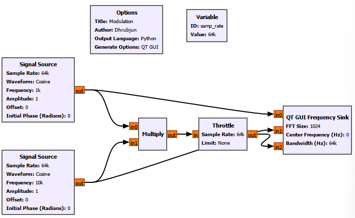
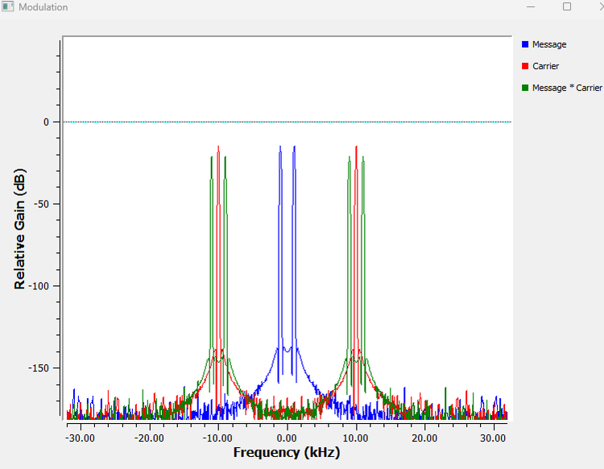
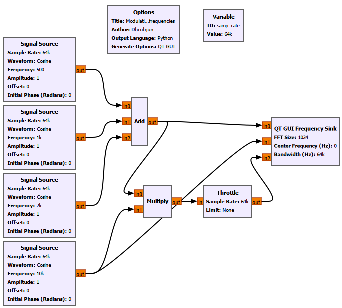
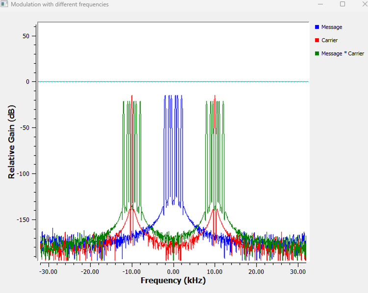
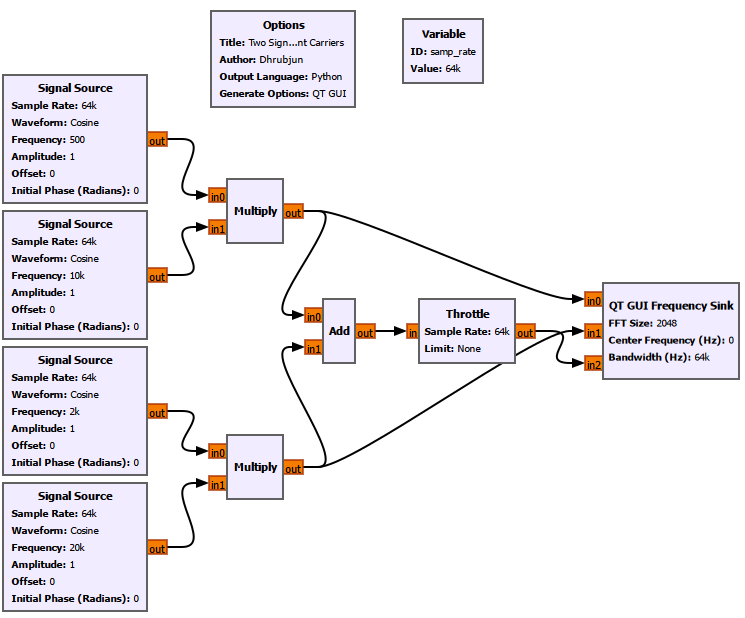
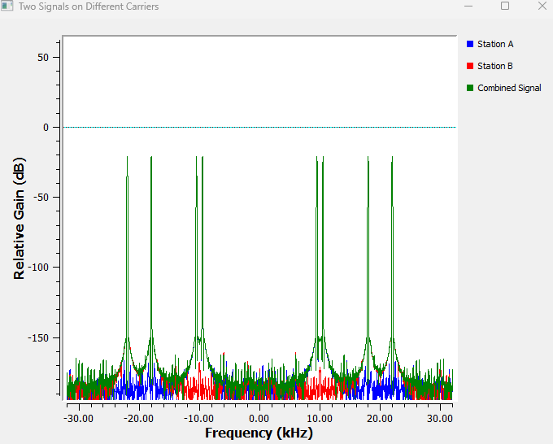
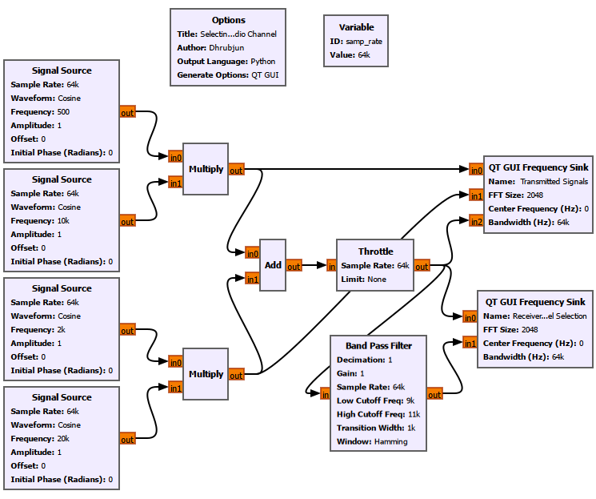
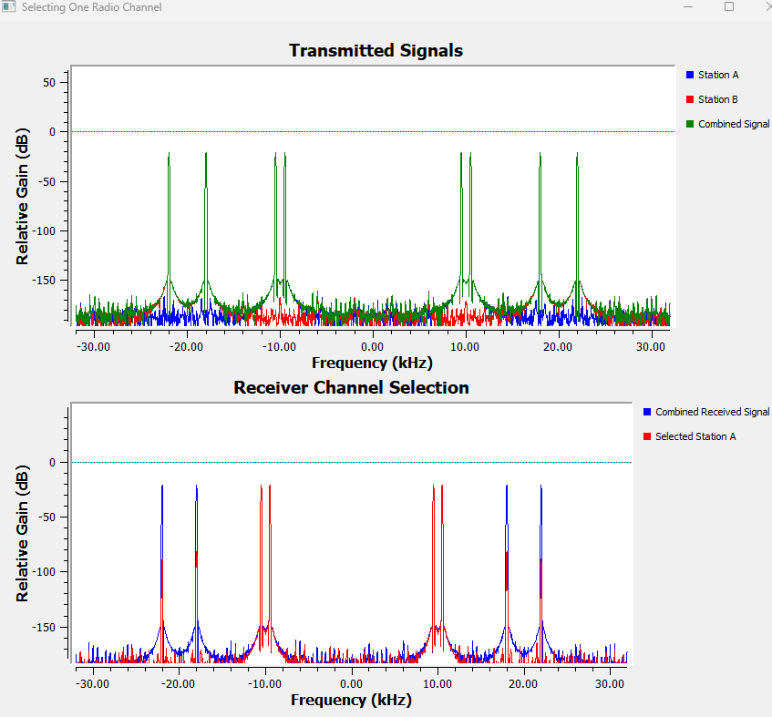
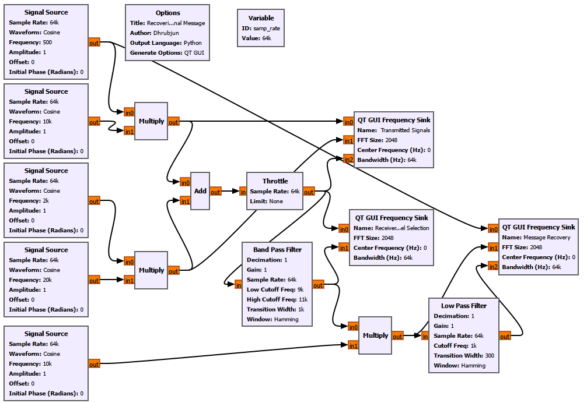
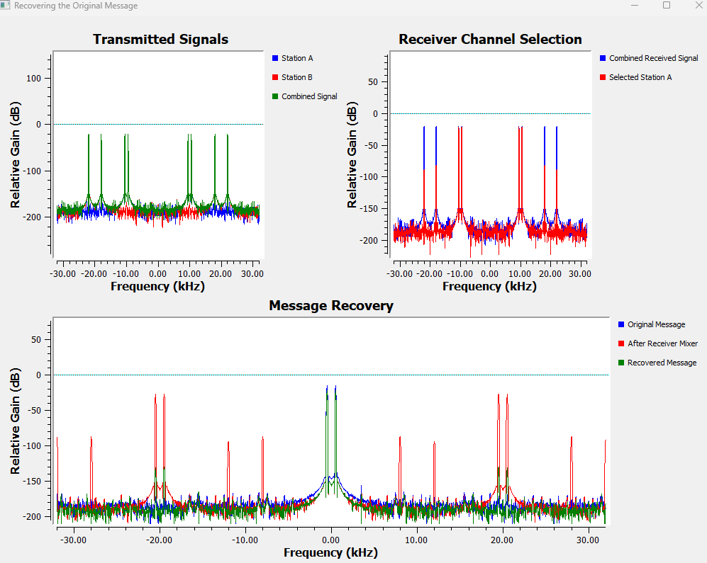

# Chapter 12: Why Modulation Exists

## Main Question

**Why cannot we simply transmit our original low-frequency information signal directly?**

Until now, most of our signals have lived comfortably inside GNU Radio.

We have generated and sampled waveforms, studied spectra, worked with real and complex signals, filtered unwanted frequencies, explored convolution, and used correlation and matched filtering to find known signals in noise.

But a radio system has another problem.

Suppose the information we want to send is speech, music, or a slowly varying sensor signal. Those signals naturally occupy relatively low frequencies. Why do radio systems not simply connect them to an antenna and transmit them as they are?

Why do we need a carrier?

This chapter builds the answer experimentally.

We will begin with the physical difficulty of radiating very low-frequency signals. Then we will use multiplication to move a message to a different frequency region. After that, we will place two messages around different carrier frequencies, combine them, select one channel at the receiver, and recover its original message.

The goal is not yet to catalogue modulation schemes. It is to understand why modulation exists in the first place.

## 12.1 Why Low-Frequency Information Is Awkward for Radio Transmission

Suppose our information is a 1 kHz audio tone:

$$
m(t)=\cos(2\pi1000t).
$$

There is nothing wrong with this signal as information. A 1 kHz electrical signal can travel through a wire, and audio circuits handle such frequencies routinely.

The difficulty appears when we want to radiate the signal efficiently through space.

The wavelength of an electromagnetic wave is

$$
\lambda=\frac{c}{f},
$$

where \(c\) is the speed of light and \(f\) is frequency.

Using

$$
c\approx3\times10^8\text{ m/s},
$$

a 1 kHz electromagnetic wave has wavelength

$$
\lambda=\frac{3\times10^8}{1000}=300\,000\text{ m}=300\text{ km}.
$$

That is an enormous wavelength.

Antenna dimensions are strongly related to wavelength. Not every antenna must be exactly one quarter wavelength long, and electrically small antennas certainly exist, but \(\lambda/4\) is a useful reference for understanding physical scale.

A quarter-wave monopole at 1 kHz would have a length of roughly

$$
L\approx\frac{\lambda}{4}=75\text{ km}.
$$

This does not mean that radiation at 1 kHz is impossible without a 75 km antenna. It means that an antenna that is extremely small compared with the wavelength becomes difficult to use efficiently and usually brings serious matching, bandwidth, and loss challenges.

Now compare that with 100 MHz:

$$
\lambda=\frac{3\times10^8}{100\times10^6}=3\text{ m}.
$$

A quarter wavelength is then

$$
L\approx0.75\text{ m}.
$$

The physical scale has changed completely.

| Frequency | Wavelength | Approx. quarter wavelength |
|---:|---:|---:|
| 1 kHz | 300 km | 75 km |
| 100 kHz | 3 km | 750 m |
| 1 MHz | 300 m | 75 m |
| 10 MHz | 30 m | 7.5 m |
| 100 MHz | 3 m | 0.75 m |
| 1 GHz | 0.3 m | 7.5 cm |

This gives us one important reason for modulation: moving information to a much higher carrier frequency can make practical radio radiation far more manageable.

But the information itself is still at 1 kHz.

We therefore need a way to move its spectral content without losing the information.

That is where modulation begins.

## 12.2 Experiment 12.1: Moving Information Away from Baseband

Let the message be

$$
m(t)=\cos(2\pi f_m t)
$$

with

$$
f_m=1\text{ kHz}.
$$

Now create a second sinusoid at

$$
f_c=10\text{ kHz}.
$$

We call it the carrier:

$$
c(t)=\cos(2\pi f_c t).
$$

The carrier by itself contains none of the 1 kHz message variation. It simply provides a higher-frequency waveform.

Now multiply the two signals:

$$
s(t)=m(t)c(t).
$$

Use

```text
samp_rate = 64k
```

so that the Nyquist frequency is

$$
f_N=\frac{64\text{ kHz}}{2}=32\text{ kHz}.
$$

### GNU Radio Settings

For the message Signal Source:

| Setting | Value |
|---|---|
| Output Type | Float |
| Waveform | Cosine |
| Frequency | `1k` |
| Amplitude | `1` |
| Offset | `0` |
| Initial Phase | `0` |
| Sample Rate | `samp_rate` |

For the carrier Signal Source:

| Setting | Value |
|---|---|
| Output Type | Float |
| Waveform | Cosine |
| Frequency | `10k` |
| Amplitude | `1` |
| Offset | `0` |
| Initial Phase | `0` |
| Sample Rate | `samp_rate` |

Connect both sources to a Multiply block. Because the flowgraph is software-only, use a Throttle at `samp_rate`.

Use a QT GUI Frequency Sink with three inputs:

- `Message`
- `Carrier`
- `Message * Carrier`

A useful FFT size is `2048`, with center frequency `0` and bandwidth `samp_rate`.





The message appears at

$$
f=\pm1\text{ kHz},
$$

and the carrier appears at

$$
f=\pm10\text{ kHz}.
$$

Both are real-valued cosines, so their spectra have conjugate-symmetric positive- and negative-frequency components.

The product signal is more interesting. Its positive-frequency components appear at approximately 9 kHz and 11 kHz.

The trigonometric identity

$$
\cos A\cos B=\frac{1}{2}\cos(A-B)+\frac{1}{2}\cos(A+B)
$$

explains why.

Substituting the message and carrier gives

$$
s(t)=\frac{1}{2}\cos\left[2\pi(f_c-f_m)t\right]+\frac{1}{2}\cos\left[2\pi(f_c+f_m)t\right].
$$

With \(f_m=1\) kHz and \(f_c=10\) kHz,

$$
f_c-f_m=9\text{ kHz}
$$

and

$$
f_c+f_m=11\text{ kHz}.
$$

Therefore,

$$
s(t)=\frac{1}{2}\cos(2\pi9000t)+\frac{1}{2}\cos(2\pi11000t).
$$

The component below the carrier frequency is the **lower sideband**:

$$
\text{LSB}=f_c-f_m=9\text{ kHz}.
$$

The component above the carrier frequency is the **upper sideband**:

$$
\text{USB}=f_c+f_m=11\text{ kHz}.
$$

The original information has not vanished. Its spectral structure has moved from baseband to a region around 10 kHz.

There is another detail worth noticing. The product spectrum contains no line exactly at 10 kHz. We will later give this modulation method a name.

### Negative Frequencies Are Not Extra Transmissions

The modulated waveform is real, so

$$
S(-f)=S^*(f).
$$

The components at \(-9\) kHz and \(-11\) kHz are the conjugate mirror of the positive-frequency components. They are part of the Fourier representation of the same real waveform.

That is different from the terms *lower sideband* and *upper sideband*. On the positive-frequency side, 9 kHz is the lower sideband and 11 kHz is the upper sideband. Their negative-frequency counterparts are mirror components of the same real signal.

## 12.3 Experiment 12.2: Translating a Complete Message Spectrum

A real message is rarely a single sinusoid. Speech, music, and sensor signals usually contain many frequency components.

So the more useful question is whether modulation moves an entire message spectrum.

Create three message components:

$$
f_1=500\text{ Hz},\qquad f_2=1\text{ kHz},\qquad f_3=2\text{ kHz}.
$$

Add them:

$$
m(t)=\cos(2\pi500t)+\cos(2\pi1000t)+\cos(2\pi2000t).
$$

Then multiply the complete message by the same 10 kHz carrier.

Use `samp_rate = 64k`.

The three Float Signal Sources are:

| Source | Frequency | Amplitude | Waveform |
|---|---:|---:|---|
| Message component 1 | `500` | `1` | Cosine |
| Message component 2 | `1k` | `1` | Cosine |
| Message component 3 | `2k` | `1` | Cosine |

All use `Sample Rate = samp_rate`, `Offset = 0`, and `Initial Phase = 0`.

The carrier remains a 10 kHz cosine of amplitude 1.





Before modulation, the positive-frequency message components are at

$$
0.5,\quad1,\quad2\text{ kHz}.
$$

After multiplication, each component appears on both sides of the 10 kHz carrier region:

| Original Message Component | Lower Sideband Component | Upper Sideband Component |
|---:|---:|---:|
| 0.5 kHz | 9.5 kHz | 10.5 kHz |
| 1 kHz | 9 kHz | 11 kHz |
| 2 kHz | 8 kHz | 12 kHz |

The product spectrum now occupies a band around 10 kHz.

This is the better mental model for modulation:

> **Modulation moves the structure of a spectrum, not just one isolated tone.**

If a real baseband message contains positive-frequency content from 0 to \(B\), real multiplication by a carrier at \(f_c\) creates a positive-frequency DSB spectrum extending approximately from

$$
f_c-B
$$

to

$$
f_c+B.
$$

The occupied positive-frequency bandwidth is therefore approximately

$$
2B
$$

for this double-sideband case.

The message has not become different information. Its location in frequency has changed.

When we say that a radio station transmits around 100 MHz, we do not mean that speech has become a 100 MHz audio tone. The low-frequency information has been placed onto an RF waveform whose spectrum occupies a region around that carrier frequency.

## 12.4 Experiment 12.3: Two Messages on Different Carriers

Modulation solves another major radio problem: several transmitters may need to share the same physical medium.

Two stations can carry speech or music whose original baseband spectra overlap heavily. If both were transmitted in the same frequency region, separating them by frequency would be impossible.

Instead, we can place them around different carrier frequencies.

Create two simplified stations.

Station A uses

$$
f_{mA}=500\text{ Hz}
$$

and

$$
f_{cA}=10\text{ kHz}.
$$

Station B uses

$$
f_{mB}=2\text{ kHz}
$$

and

$$
f_{cB}=20\text{ kHz}.
$$

Their transmitted signals are

$$
s_A(t)=m_A(t)\cos(2\pi f_{cA}t)
$$

and

$$
s_B(t)=m_B(t)\cos(2\pi f_{cB}t).
$$

Add them:

$$
s(t)=s_A(t)+s_B(t).
$$

Use `samp_rate = 64k`.

| Station | Message Frequency | Carrier Frequency |
|---|---:|---:|
| A | `500` Hz | `10k` Hz |
| B | `2k` Hz | `20k` Hz |

All four Signal Sources are Float cosine sources with amplitude 1.



For Station A,

$$
f_{cA}-f_{mA}=9.5\text{ kHz}
$$

and

$$
f_{cA}+f_{mA}=10.5\text{ kHz}.
$$

For Station B,

$$
f_{cB}-f_{mB}=18\text{ kHz}
$$

and

$$
f_{cB}+f_{mB}=22\text{ kHz}.
$$



The combined signal contains both transmissions at the same time, but they occupy different spectral regions.

This is the basic idea behind **frequency-division multiplexing**: multiple signals can share the same medium while occupying different frequency bands.

The carrier therefore does more than help with radiation. It also gives us a way to place different transmissions in different parts of the spectrum.

## 12.5 Experiment 12.4: Selecting One Radio Channel

An antenna can receive several transmissions at once. Tuning does not mean that only the desired station reaches the antenna. It means the receiver selects the frequency region containing the desired channel.

Continue from Experiment 12.3.

The combined signal contains Station A around 10 kHz and Station B around 20 kHz. Suppose we want Station A.

Its two positive-frequency sideband components are at 9.5 kHz and 10.5 kHz.

Use a Band-Pass Filter with:

| Setting | Value |
|---|---|
| Decimation | `1` |
| Gain | `1` |
| Sample Rate | `samp_rate` |
| Low Cutoff Frequency | `9k` |
| High Cutoff Frequency | `11k` |
| Transition Width | `1k` |
| Window | Hamming |

Use one Frequency Sink to show the transmitted signals and another to compare the combined received signal with the selected channel.





Before filtering, the receiver sees both channels.

After the Band-Pass Filter, the components around 9.5 kHz and 10.5 kHz remain, while Station B around 18 kHz and 22 kHz is strongly attenuated.

This is a simplified model of channel selection.

A practical receiver may use RF filters, mixers, local oscillators, complex downconversion, and digital filters. The experiment is not trying to reproduce every part of an RF front end. It isolates the central idea:

> **Different transmissions occupy different frequency regions, and the receiver can select the region containing the channel it wants.**

But channel selection is not yet demodulation.

The selected signal is still around 10 kHz. The original Station A message was at 500 Hz.

We have found the right station, but we have not recovered its information.

## 12.6 Experiment 12.5: Recovering the Original Message

Station A began as

$$
m_A(t)=\cos(2\pi500t).
$$

After modulation by the 10 kHz carrier, its positive-frequency components moved to 9.5 kHz and 10.5 kHz.

Now multiply the selected channel by a 10 kHz receiver oscillator. This oscillator is the **local oscillator**, or LO.

The 9.5 kHz component produces difference and sum terms at

$$
10-9.5=0.5\text{ kHz}
$$

and

$$
10+9.5=19.5\text{ kHz}.
$$

The 10.5 kHz component produces

$$
10.5-10=0.5\text{ kHz}
$$

and

$$
10.5+10=20.5\text{ kHz}.
$$

The original 500 Hz frequency has returned, accompanied by high-frequency mixer products.

A Low-Pass Filter can separate them.

Use a 10 kHz Float cosine Signal Source as the receiver LO:

| Setting | Value |
|---|---|
| Output Type | Float |
| Waveform | Cosine |
| Frequency | `10k` |
| Amplitude | `1` |
| Offset | `0` |
| Initial Phase | `0` |
| Sample Rate | `samp_rate` |

After the receiver mixer, use:

| Low-Pass Filter Setting | Value |
|---|---|
| Decimation | `1` |
| Gain | `1` |
| Sample Rate | `samp_rate` |
| Cutoff Frequency | `1k` |
| Transition Width | `300` |
| Window | Hamming |

The desired 500 Hz message lies safely inside the low-pass region, while the components around 19.5 kHz and 20.5 kHz lie far outside it.





The three views now tell the whole communication story.

The transmitted spectrum contains both stations.

The receiver channel-selection stage isolates Station A.

The receiver mixer then brings the 500 Hz message back toward baseband while also creating high-frequency products.

Finally, the Low-Pass Filter removes those unwanted products, leaving the recovered message at

$$
\boxed{\pm500\text{ Hz}}.
$$

### Why Is the Recovered Amplitude Smaller?

The recovered frequency is correct, but the recovered amplitude is lower than the original. That is expected.

At the transmitter,

$$
s(t)=m(t)\cos(2\pi f_ct).
$$

At the receiver, multiplying by the same carrier gives

$$
s(t)\cos(2\pi f_ct)=m(t)\cos^2(2\pi f_ct).
$$

Using

$$
\cos^2\theta=\frac{1}{2}+\frac{1}{2}\cos(2\theta),
$$

we obtain

$$
m(t)\cos^2(2\pi f_ct)=\frac{1}{2}m(t)+\frac{1}{2}m(t)\cos(4\pi f_ct).
$$

The Low-Pass Filter removes the high-frequency term, leaving ideally

$$
y(t)=\frac{1}{2}m(t).
$$

So the reduced amplitude is not an error in the experiment. A later gain stage could compensate for it if required.

What matters here is that the message has returned to the correct baseband frequency.

## 12.7 What Kind of Modulation Did We Build?

The transmitter used

$$
s(t)=m(t)\cos(2\pi f_ct).
$$

For a sinusoidal message, the spectrum contains two sidebands but no separate spectral line at the carrier frequency \(f_c\).

This modulation is called **double-sideband suppressed-carrier**, or **DSB-SC**.

The name now has a physical meaning:

- **double-sideband** because both lower and upper sidebands are transmitted;
- **suppressed-carrier** because the product signal does not contain a separate carrier component at \(f_c\).

The receiver recovered the message by multiplying the selected DSB-SC signal by an oscillator at the same carrier frequency and phase, then low-pass filtering.

This is **coherent demodulation**.

In our simulation, the transmitter carrier and receiver LO are perfectly synchronized. A practical receiver may have carrier-frequency and phase errors, so coherent demodulation requires synchronization. We will encounter that problem later in the book.

This also explains why the 10 kHz carrier line was visible in Experiment 12.1 only because we plotted the original carrier as a separate trace. It was not present as a distinct line in the transmitted DSB-SC product itself.

## 12.8 Tuning and Demodulation Are Different Jobs

The experiments have separated two ideas that are often mixed together in casual descriptions of radio reception.

**Tuning** selects the desired frequency region.

**Demodulation** recovers the information carried by the selected waveform.

A receiver tuned to a station around 100 MHz is not choosing a 100 MHz sound. Human hearing is nowhere near that frequency.

The transmitter has placed low-frequency information into an RF channel around 100 MHz. The receiver selects that RF channel, then demodulates it to recover the audio.

Our GNU Radio experiments followed the same logic at much lower frequencies:

`Combined Spectrum → Channel Selection → Selected Modulated Signal → Demodulation → Recovered Baseband Message`

The 10 kHz and 20 kHz carriers were chosen only because they fit comfortably inside a 64 kS/s simulation and are easy to observe.

The signal-processing principle is the same at MHz or GHz carrier frequencies.

## 12.9 Real RF Waveforms and Complex I/Q Representations

The signals in these experiments are real-valued.

A physical voltage applied to an antenna is real, and the physical electromagnetic fields are real quantities. A real sinusoidal RF waveform can be written as

$$
s(t)=A\cos(2\pi f_ct+\phi).
$$

Its two-sided Fourier spectrum has conjugate symmetry.

Inside an SDR, however, we often represent a band of RF spectrum using complex I/Q samples:

$$
x[n]=I[n]+jQ[n].
$$

A general complex signal does not need conjugate symmetry between positive and negative frequencies.

This is extremely useful around a tuned center frequency.

If an SDR is centered at 100 MHz, then under the usual complex-baseband convention, a component at

$$
+1\text{ MHz}
$$

represents RF content around

$$
101\text{ MHz},
$$

while a component at

$$
-1\text{ MHz}
$$

represents RF content around

$$
99\text{ MHz}.
$$

So both of the following are true:

> **Physical RF waveforms are real-valued.**

> **SDRs commonly use complex I/Q representations internally.**

A complex signal also does not automatically have a one-sided spectrum. It may contain positive frequencies, negative frequencies, or both. The important difference is that the two sides are no longer forced to be mirror images.

### Why We Do Not Remove the Negative Half of a Real Spectrum

For a real signal,

$$
\cos(2\pi ft)=\frac{1}{2}e^{j2\pi ft}+\frac{1}{2}e^{-j2\pi ft}.
$$

Both terms are required to represent the real cosine.

The Low-Pass Filter in Experiment 12.5 therefore was not removing the negative-frequency half of the signal.

Its job was completely different: it kept the recovered low-frequency message and rejected the high-frequency products created by the receiver mixer.

This distinction will matter even more when we later work with single-sideband and complex modulation.

## 12.10 Modulation, Bandwidth, and Shared Spectrum

Experiment 12.2 showed that modulation moves an entire spectrum.

If the message contains frequencies up to \(B\), a DSB-SC signal occupies approximately \(2B\) of positive-frequency RF bandwidth around the carrier.

That means channels cannot be placed arbitrarily close together.

Real communication systems must consider:

- occupied bandwidth;
- channel bandwidth;
- channel spacing;
- filtering;
- adjacent-channel interference;
- frequency allocation.

This is why spectrum is treated as a limited resource.

Carrier frequency also affects more than antenna size. Radio waves at different frequencies can differ in propagation, penetration, diffraction, interaction with terrain or the atmosphere, available bandwidth, and practical hardware.

We do not need a propagation theory detour here. The useful connection is simpler:

> **Modulation lets us place information in a frequency range that suits the communication system.**

## 12.11 So Why Does Modulation Exist?

We can now answer the question that opened the chapter.

There is no single reason.

First, very low-frequency information corresponds to extremely long electromagnetic wavelengths. Moving the information to a higher RF carrier can make practical antennas, matching, and usable bandwidth much more manageable.

Second, different transmitters often carry baseband information occupying similar frequency ranges. Modulation lets us place those signals in different spectral regions so that they can share the same medium.

Third, once signals occupy different channels, a receiver can tune to the desired region and reject the others.

Finally, different frequency ranges have different propagation, bandwidth, hardware, and regulatory characteristics. A carrier lets us choose a part of the spectrum appropriate for the application.

The central idea is:

> **Modulation takes information from the frequency region where it naturally exists and places it in a frequency region that is useful for transmission.**

Demodulation brings it back.

## 12.12 GNU Radio Toolbox

The chapter mostly reuses familiar blocks, but their roles are now part of a complete communication system.

| GNU Radio Block | Role in This Chapter |
|---|---|
| Signal Source | Generates messages, carriers, and the receiver local oscillator |
| Multiply | Performs DSB-SC modulation and coherent demodulation |
| Add | Combines message components and combines multiple transmitted channels |
| Throttle | Controls the rate of the software-only simulation |
| QT GUI Frequency Sink | Shows baseband, carrier, modulated, combined, selected, and recovered spectra |
| Band-Pass Filter | Selects one modulated channel from the combined received spectrum |
| Low-Pass Filter | Removes high-frequency mixer products after coherent demodulation |

The Multiply block is especially important.

At the transmitter, it moves the message spectrum to a carrier region.

At the receiver, the same mathematical operation moves the selected signal back toward baseband.

The filters then decide which translated components we keep.

## 12.13 Explore Further

The experiments in this chapter are simple enough that we can predict many changes before running them.

1. Change the 1 kHz message in Experiment 12.1 to 2 kHz while keeping the carrier at 10 kHz. Predict the new sideband locations before running.

2. Keep the message fixed and move the carrier. Observe that the spacing between the sidebands remains determined by the message frequency while the whole pair shifts with the carrier.

3. Add another message component to Experiment 12.2. Predict the new translated components around 10 kHz.

4. Move Station B closer to Station A. Observe what happens when the two occupied spectral regions begin to approach one another.

5. Change the receiver Band-Pass Filter limits so that one sideband of Station A is partially attenuated. Compare the selected spectrum with the original channel.

6. Mistune the receiver LO in Experiment 12.5 from 10 kHz to 9.8 kHz. Predict where the recovered tone will appear after low-pass filtering.

7. Change the receiver LO phase while keeping the frequency correct. The recovered DSB-SC amplitude will change, which gives an early preview of why coherent receivers need carrier-phase synchronization.

## 12.14 What We Learned

We began with a low-frequency information signal and asked why radio systems do not simply transmit it directly.

The wavelength relationship

$$
\lambda=\frac{c}{f}
$$

showed why very low electromagnetic frequencies correspond to enormous wavelengths and awkward antenna scales.

Then we multiplied a message by a carrier.

A 1 kHz message and a 10 kHz carrier produced sidebands at

$$
9\text{ kHz}
$$

and

$$
11\text{ kHz}.
$$

A multi-frequency message showed that modulation translates the structure of an entire spectrum.

Next, we placed two messages around different carrier frequencies and combined them. The two transmissions shared the same signal path while remaining separable in frequency.

At the receiver, a Band-Pass Filter selected one channel.

A receiver mixer then translated that selected DSB-SC signal back toward baseband, and a Low-Pass Filter removed the high-frequency mixing products.

The recovered message returned at its original frequency.

We also learned that the simple modulation used here is DSB-SC and that its receiver uses coherent demodulation.

The chapter therefore connected several earlier topics into one communication chain:

`Information → Modulation → Shared Spectrum → Channel Selection → Demodulation → Recovered Information`

Most importantly, modulation is no longer just a definition.

We have seen what it does in the spectrum and why a radio system needs it.

## 12.15 Connecting to the Next Chapter

Our first modulation method was deliberately simple:

$$
s(t)=m(t)\cos(2\pi f_ct).
$$

It produced two sidebands but no separate carrier component at \(f_c\).

That made DSB-SC ideal for understanding frequency translation, but it is not the only way to place information onto a carrier.

The next question is a natural one:

> **What happens if the message changes the amplitude of a carrier that is transmitted along with the sidebands?**

That takes us to Chapter 13, **Amplitude Modulation**.

There we will compare conventional AM with the DSB-SC signal built here, introduce modulation index, examine overmodulation, and see why transmitting the carrier makes envelope detection possible.
