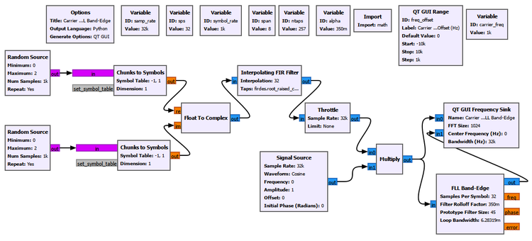

# Chapter 21: PLL and Carrier Synchronization

## Main Question

**If the transmitter and receiver do not share exactly the same carrier reference, how can the receiver recover the correct carrier phase and frequency?**

The previous chapters made the communication link progressively more realistic.

We introduced pulse shaping, channel impairments, multipath, timing mismatch, and equalization. Equalization solves an important receiver problem, but it does not correct every synchronization error.

A receiver may still have the wrong carrier phase. Its oscillator may run at a slightly different frequency from the transmitter. Even after those errors are corrected, the receiver may still be sampling at the wrong instant.

These are different problems.

| Receiver problem | Physical effect | Main correction |
|---|---|---|
| Carrier phase offset | constellation has a fixed rotation | phase estimation, PLL, Costas Loop |
| Carrier frequency offset | phase changes continuously with time | CFO estimation, FLL |
| Symbol timing offset | receiver samples at the wrong instant | timing recovery |

This chapter concentrates on the first two: **carrier phase synchronization** and **carrier frequency synchronization**.

We will begin with a fixed phase error, use a conjugate product to measure relative phase, and exploit QPSK symmetry to remove unknown data. We will then introduce feedback through the PLL and Costas Loop. After that, we will return to carrier-frequency offset, estimate it in both time and frequency, and finally recover it with GNU Radio's FLL Band-Edge block.

The approach remains the same as in the previous receiver chapters: observe the impairment first, understand what it means physically, and then introduce the correction.

## 21.1 A Fixed Carrier Phase Error

Suppose the transmitter and receiver oscillators have the same frequency but do not share the same phase.

At complex baseband, a fixed carrier phase error rotates every received symbol by the same angle.

If the transmitted symbol is $s$ and the phase error is $\phi$, then

$$
r=se^{j\phi}
$$

The word **fixed** is important.

A 30° phase offset does not make the constellation continuously spin. It rotates the entire constellation by 30° and leaves it there.

For QPSK, the four constellation points remain four points with the same relative geometry. Only their orientation changes.

That still matters because the receiver's decision regions were designed for the expected constellation orientation. A sufficiently large rotation can move received symbols across those boundaries.

## 21.2 Experiment 21.1: Observing Carrier Phase Offset

We begin with a controlled QPSK signal and deliberately rotate it by a known phase.


The QPSK symbols remain unchanged while the carrier phase offset is varied.


At 0°, the constellation appears at its usual positions around $(\pm1,\pm1)$.

As the phase offset increases, the entire constellation rotates around the origin.

### A Numerical Example

Take the QPSK symbol

$$
s=1+j
$$

Its magnitude is $\sqrt{2}$ and its phase is 45°, so

$$
s=\sqrt{2}e^{j45^\circ}
$$

Now apply a 30° carrier phase offset.

The new phase is

$$
45^\circ+30^\circ=75^\circ
$$

so

$$
r=\sqrt{2}e^{j75^\circ}
$$

The new coordinates are approximately

$$
I=\sqrt{2}\cos75^\circ\approx0.366
$$

and

$$
Q=\sqrt{2}\sin75^\circ\approx1.366
$$

The point $(1,1)$ therefore moves to approximately $(0.366,1.366)$.

The information symbol has not changed. The receiver's carrier reference is simply rotated relative to the transmitter.

This distinction becomes important when we compare a fixed phase offset with a frequency offset.

## 21.3 Measuring Relative Phase

A constellation plot makes the rotation visible, but a receiver needs a numerical phase-error measurement.

Suppose, for the moment, that the receiver knows which symbol was transmitted.

If

$$
r=se^{j\phi}
$$

we would like an operation that removes the known symbol phase and leaves only $\phi$.

A conjugate product does exactly that:

$$
rs^*=se^{j\phi}s^*=|s|^2e^{j\phi}
$$

The phase of $s$ disappears, leaving only the relative phase.

Therefore,

$$
\angle(rs^*)=\phi
$$

For two complex values $a$ and $b$,

$$
\angle(ab)=\angle a+\angle b
$$

while conjugating $b$ reverses its phase:

$$
\angle(ab^*)=\angle a-\angle b
$$

This makes the conjugate product a natural way to measure phase difference.

## 21.4 Experiment 21.2: Conjugate-Product Phase Estimation

We now compare a phase-rotated QPSK symbol with its known reference in GNU Radio.


The received symbol and reference are combined with Multiply Conjugate, and Complex to Arg extracts the phase of the result.

For our QPSK constellation,

$$
|s|^2=1^2+1^2=2
$$

At a 30° phase offset,

$$
rs^*=2e^{j30^\circ}
$$

so the expected coordinates are

$$
I=2\cos30^\circ\approx1.732
$$

and

$$
Q=2\sin30^\circ=1
$$

The experiment produces the expected complex point and phase estimate.


The important result is that a complex multiplication has converted a geometric phase difference into a directly measurable quantity.

### The Limitation

This experiment assumes that the receiver knows the transmitted reference symbol.

That is possible during a known preamble, pilot, or training interval, but ordinary payload symbols are not known in advance.

The next step is therefore to remove the unknown QPSK data phase without first knowing which QPSK symbol was transmitted.

## 21.5 Using QPSK Symmetry Instead of a Known Symbol

QPSK has four possible symbol phases separated by 90°.

For the constellation used here,

$$
45^\circ,\;135^\circ,\;225^\circ,\;315^\circ
$$

Multiplying each phase by four gives

| QPSK phase | Four times the phase | Equivalent phase |
|---:|---:|---:|
| 45° | 180° | 180° |
| 135° | 540° | 180° |
| 225° | 900° | 180° |
| 315° | 1260° | 180° |

All four data phases collapse to the same direction.

Raising the QPSK symbol to the fourth power performs this phase multiplication.

For example,

$$
(1+j)^4=-4
$$

The same result occurs for all four QPSK symbols in this mapping.

If the received symbol contains a carrier phase error,

$$
r=se^{j\phi}
$$

then

$$
r^4=s^4e^{j4\phi}=-4e^{j4\phi}
$$

The data dependence has disappeared, while the carrier phase remains multiplied by four.

There is also a useful magnitude result. Since

$$
|s|=\sqrt{2}
$$

we obtain

$$
|s^4|=(\sqrt{2})^4=4
$$

so the fourth-power result appears at radius 4.

The fourth-power method works because of QPSK's fourfold rotational symmetry. It is not a generic operation for every modulation.

## 21.6 Experiment 21.3: M-th Power Phase Recovery

For QPSK, $M=4$, so we raise the received signal to the fourth power.


The fourth-power QPSK symbols collapse toward $-4$, which has phase 180°. We remove that known orientation before extracting the phase, then divide the remaining phase by four.

The estimate is

$$
\hat{\phi}=\frac{1}{4}\angle(-r^4)
$$

The order of operations matters.

We rotate the complex phasor first and then calculate its principal phase. Subtracting 180° after `Complex to Arg` has already wrapped the phase is not always equivalent.


The method works while the multiplied phase remains within the unambiguous principal-angle region.

| Applied carrier phase | M-th power result | Interpretation |
|---:|---:|---|
| 0° | ≈ 0° | correct |
| 40° | ≈ 40° | correct |
| 45° | boundary | ambiguous boundary |
| 50° | ≈ -40° | wrapped equivalent |

For the 50° case,

$$
4(50^\circ)=200^\circ
$$

but the principal phase wraps 200° to -160°:

$$
200^\circ\equiv-160^\circ
$$

Dividing by four gives

$$
-160^\circ/4=-40^\circ
$$

which is exactly what the experiment shows.

### The Price of Removing the Data

QPSK repeats after a 90° rotation.

The fourth-power method therefore recovers carrier phase only modulo 90°.

The same symmetry that removes the QPSK data also creates the ambiguity.

Practical systems can resolve this remaining ambiguity using preambles, pilots, differential encoding, framing information, or another known reference.

## 21.7 Why a One-Time Estimate Is Not Always Enough

The previous experiments were feedforward measurements.

We observed the signal, calculated an estimate, and obtained a phase value.

A real receiver oscillator, however, does not necessarily remain fixed. Temperature, oscillator drift, motion, Doppler, and residual frequency mismatch can make the phase error change over time.

A receiver may therefore need to keep measuring the error and updating its local reference.

This is the basic idea behind a **phase-locked loop**, or PLL.

## 21.8 PLL Intuition: Measure, Correct, Repeat

A PLL is a feedback system.

Its essential parts are a phase detector, a loop filter, and a local oscillator or numerically controlled oscillator.

The phase detector measures whether the local reference is ahead or behind the received carrier. The loop filter controls how strongly the receiver responds. The local oscillator changes its phase or frequency accordingly.

This repeated correction gives us three useful terms.

**Acquisition** is the process of moving from an initially incorrect carrier state toward lock.

**Lock** means the loop has converged closely enough that the local reference follows the received carrier.

**Tracking** is the continued adjustment after lock, when the loop follows smaller ongoing changes.

We first study the PLL with a clean complex carrier rather than QPSK. Removing the modulation makes the feedback behaviour easier to see.

## 21.9 Experiment 21.4: PLL Acquisition and Lock

For the controlled carrier experiment, we use

| Parameter | Value |
|---|---:|
| Sample rate | `32000` samples/s |
| Carrier frequency | `1000` Hz |
| Initial carrier phase offset | `60°` |
| Minimum PLL frequency | `800` Hz equivalent |
| Maximum PLL frequency | `1200` Hz equivalent |

At 32 ksample/s, a 1 kHz carrier has

$$
32000/1000=32
$$

samples per cycle.

The carrier phase therefore advances by

$$
360^\circ/32=11.25^\circ
$$

per sample.

Its normalized angular frequency is

$$
\omega_0=2\pi\frac{1000}{32000}\approx0.19635\text{ rad/sample}
$$

The PLL frequency limits are

$$
\omega_{\min}=2\pi\frac{800}{32000}\approx0.15708\text{ rad/sample}
$$

and

$$
\omega_{\max}=2\pi\frac{1200}{32000}\approx0.23562\text{ rad/sample}
$$

These limits place the actual carrier comfortably inside the allowed range. They are experiment-specific, not universal PLL settings.

### Observing the Locked Carrier

For the locked-state display, we use GNU Radio's PLL Carrier Regeneration block so that the regenerated local carrier itself can be observed.


After acquisition, the regenerated carrier follows the input carrier closely.


The steady-state result shows lock, but not how the loop reached it.

### Capturing Acquisition

To observe startup, we use a second flowgraph and measure the relative phase between the received carrier and the regenerated PLL carrier with a conjugate product.


The measured phase error is

$$
e_\phi[n]=\angle\{x[n]y_{\text{PLL}}^*[n]\}
$$

A Head block captures 2000 samples and a File Sink stores them.

At 32 ksample/s,

$$
2000/32000=0.0625\text{ s}=62.5\text{ ms}
$$

The measured acquisition transient is shown below.


The first error sample is close to the imposed 60° offset, but the loop does not simply move smoothly from 60° to zero.

The error initially grows, reaches roughly 168°, reverses direction, crosses toward zero, overshoots slightly, and then settles. By the end of the captured record, the phase error is approximately 0.024°.

PLL acquisition is therefore a dynamic feedback process. It can overshoot and oscillate before settling.

### About the Python Plot

GNU Radio performs the PLL processing and generates the phase-error samples.

The Python script only reads the recorded `float32` values, converts radians to degrees, constructs the time axis, and plots the measured transient.

It does not simulate or smooth the PLL response.

## 21.10 Loop Bandwidth

One of the most important PLL parameters is **loop bandwidth**.

At this stage, its physical meaning is more useful than a full control-system derivation.

A wider loop bandwidth lets the PLL react more aggressively to phase and frequency error. This usually improves acquisition and tracking speed.

A narrower loop bandwidth gives a slower response but reduces how strongly the loop follows rapid fluctuations and noise.

Loop bandwidth therefore creates a tradeoff between responsiveness and noise sensitivity.

## 21.11 Experiment 21.5: Effect of PLL Loop Bandwidth

We reuse the acquisition flowgraph from Experiment 21.4 and change only the loop bandwidth.

The three values are

$$
B_{\text{narrow}}=\pi/3000
$$

$$
B_{\text{baseline}}=\pi/1000
$$

and

$$
B_{\text{wide}}=\pi/300
$$

For this comparison, Head records 6000 samples.

At 32 ksample/s,

$$
6000/32000=0.1875\text{ s}=187.5\text{ ms}
$$


The difference is substantial.

| Loop bandwidth | Observed behaviour | Approximate measured settling |
|---|---|---|
| $\pi/3000$ | very slow acquisition | did not settle during the 187.5 ms record |
| $\pi/1000$ | moderate acquisition | within about ±1° after 38.9 ms |
| $\pi/300$ | fast acquisition | within about ±1° after 17.8 ms |

For the baseline case, the error remained within about ±5° after 31.6 ms and within about ±1° after 38.9 ms.

For the wide-loop case, the corresponding times were about 8.8 ms and 17.8 ms.

The narrow-loop curve also reaches the ±180° principal-phase boundary. The apparent jump is phase wrapping, not a physical discontinuity in the oscillator.

In this clean experiment, the wider loop acquires faster. With noise present, the same stronger response can also make the loop more sensitive to noisy phase measurements.

## 21.12 Why an Ordinary PLL Is Not Enough for Random QPSK

The clean-carrier PLL taught us feedback, acquisition, lock, and loop bandwidth.

Random QPSK adds another difficulty.

The observed phase contains both carrier phase and data phase:

$$
\theta_{\text{observed}}=\theta_{\text{data}}+\theta_{\text{carrier}}
$$

For an unmodulated carrier, $\theta_{\text{data}}$ is absent.

For QPSK, it changes as the transmitted data symbol changes.

A simple carrier phase detector can therefore mistake legitimate data-dependent phase changes for carrier error.

## 21.13 Experiment 21.6: Applying an Ordinary PLL to QPSK

We feed random QPSK directly into the ordinary PLL carrier-regeneration approach.


Changing the imposed carrier phase rotates the QPSK constellation, but the ordinary PLL output does not become a clean QPSK carrier reference. It produces a similar arc-like response even as the imposed phase offset changes.

The important lesson is that a simple clean-carrier PLL is not directly suited to random suppressed-carrier QPSK.

The feedback principle is still useful, but the phase detector must account for the modulation structure.

That leads to the Costas Loop.

## 21.14 The Costas Loop

A Costas Loop is a feedback carrier-recovery loop with a phase-error detector designed for suitable modulated signals such as PSK.

For the QPSK experiment, the important settings are

```text
Order: 4
Loop Bandwidth: pi/100
Use SNR: No
```

`Order = 4` tells the block that the input has QPSK-like fourfold rotational symmetry. It does not mean that the receiver is using a fourth-order PLL.

`Loop Bandwidth = pi/100` controls the loop response in the same broad sense explored with the ordinary PLL.

`Use SNR = No` is appropriate for the first controlled experiment because we initially want to isolate carrier recovery from noise.

## 21.15 Experiment 21.7: QPSK Carrier Recovery with a Costas Loop

We apply a controlled phase rotation to QPSK and place a Costas Loop in the receiver.


At a 30° phase offset, the original QPSK point $(1,1)$ has phase 45°.

After rotation,

$$
45^\circ+30^\circ=75^\circ
$$

so the expected coordinates are approximately

$$
(\sqrt{2}\cos75^\circ,\sqrt{2}\sin75^\circ)\approx(0.366,1.366)
$$

That is what we observe before recovery.

After the Costas Loop, the constellation returns close to the normal QPSK geometry around $(\pm1,\pm1)$.


We also tested a much larger phase rotation such as 120°, and the recovered constellation again looks geometrically correct.

### A Correct-Looking Constellation Can Still Be Ambiguous

QPSK has fourfold rotational symmetry.

A Costas Loop can therefore recover a stable QPSK constellation while leaving a multiple-of-90° ambiguity:

$$
\phi_{\text{ambiguity}}=k\frac{\pi}{2},\qquad k=0,1,2,3
$$

The constellation can look correct even though the original symbol-to-bit labeling is rotated.

This is the same basic symmetry seen in the M-th power experiment.

Two different questions therefore have to be separated:

1. Has the receiver recovered a stable QPSK geometry?
2. Has it recovered the original absolute symbol labeling?

Known preambles, pilots, differential encoding, or framing information can resolve the remaining ambiguity when necessary.

## 21.16 Experiment 21.8: Costas Loop in Noise

We now keep the 30° carrier phase offset and add noise.

Two noise amplitudes are compared:

$$
A_n=0.1
$$

and

$$
A_n=0.5
$$


At noise amplitude 0.1, the recovered constellation still forms relatively compact clusters around the expected QPSK points.

At noise amplitude 0.5, the clusters are much broader.

It would be too simple to call all of that spreading phase jitter.

Complex additive noise directly perturbs the I and Q samples even if the carrier estimate were perfect.

The noisy samples also perturb the Costas Loop phase detector, which can introduce additional tracking variation.

The recovered constellation therefore contains both direct sample noise and carrier-tracking effects.

This distinction is important because not every cloud around a constellation point should be blamed on the synchronization loop.

## 21.17 Phase Offset and Frequency Offset Are Different Problems

A fixed carrier phase offset is

$$
\phi(t)=\phi_0
$$

A carrier-frequency offset causes the phase to change continuously:

$$
\phi(t)=2\pi\Delta f t+\phi_0
$$

where $\Delta f$ is the difference between transmitter and receiver carrier frequencies.

| Property | Carrier phase offset | Carrier frequency offset |
|---|---|---|
| phase error | constant | changes continuously |
| constellation | fixed rotation | continuous rotation |
| static constellation display | rotated clusters | arcs or ring |
| receiver task | correct phase | estimate and correct frequency mismatch |

A frequency error is therefore a **phase slope**.

Even a small frequency mismatch eventually accumulates a large phase error if it persists long enough.

## 21.18 Experiment 21.9: Observing Carrier Frequency Offset

We return to pulse-shaped QPSK and apply a controlled frequency offset.


At zero frequency offset, the QPSK clusters remain stationary.

At 5 Hz, the constellation rotates continuously.


For

$$
\Delta f=5\text{ Hz}
$$

one complete phase revolution takes

$$
T_{\text{rotation}}=\frac{1}{5}=0.2\text{ s}
$$

The Constellation Sink displays samples from different times, so those samples contain different accumulated carrier phases. Over time, the four rotating QPSK points fill a ring-like trace.

A static ring does not reveal the direction of rotation. Clockwise and counterclockwise trajectories can produce essentially the same accumulated display.

To determine the sign of the CFO, we need a measurement that retains the direction of phase change.

## 21.19 Frequency Is Phase Change per Unit Time

For a complex sinusoid,

$$
x[n]=Ae^{j(2\pi\Delta f n/f_s+\phi_0)}
$$

the phase advance between adjacent samples is

$$
\Delta\phi=2\pi\frac{\Delta f}{f_s}
$$

so

$$
\Delta f=\frac{f_s}{2\pi}\Delta\phi
$$

Frequency therefore tells us how quickly phase changes.

Raw QPSK also changes phase when the data symbols change, so the fourth-power operation is useful again. It removes the fourfold QPSK data phase while multiplying the carrier phase by four.

## 21.20 Experiment 21.10: M-th Power CFO Estimation in Time and Frequency

We raise the CFO-impaired QPSK signal to the fourth power, then examine the result in both time and frequency.


### Time-Domain Phase-Increment Estimator

Let the fourth-power output be $y[n]$.

We compare adjacent samples using

$$
z[n]=y[n]y^*[n-1]
$$

After the fourth-power operation, the carrier phase advance has been multiplied by four.

Therefore,

$$
\angle z[n]=\frac{8\pi\Delta f}{f_s}
$$

and the CFO estimate is

$$
\hat{\Delta f}=\angle z[n]\frac{f_s}{8\pi}
$$

The one-sample delay has a direct physical meaning. We measure how much phase advanced during one sample interval, $1/f_s$.

With $f_s=32000$ samples/s and an applied CFO of +100 Hz, the experiment reports approximately

$$
\hat{\Delta f}=99.999794\text{ Hz}
$$

For -100 Hz, it reports approximately

$$
\hat{\Delta f}=-100.000084\text{ Hz}
$$

The sign therefore reveals the direction of phase rotation.

### Frequency-Domain View

The same fourth-power signal can also be examined with a DFT.

If the original CFO is $\Delta f$, the fourth-power operation moves the carrier-like component to approximately

$$
f_{\text{peak}}=4\Delta f
$$

so

$$
\hat{\Delta f}=\frac{f_{\text{peak}}}{4}
$$

For +100 Hz, the relevant feature should appear near +400 Hz.

For -100 Hz, it should appear near -400 Hz.

The Frequency Sink uses an FFT size of 4096. At 32 ksample/s, the nominal bin spacing is

$$
\Delta f_{\text{bin}}=\frac{32000}{4096}=7.8125\text{ Hz}
$$


### Why Does the Original QPSK Spectrum Look Broad?

Before the fourth-power operation, the random QPSK data is still present.

The signal is therefore not a single sinusoid, and its energy is spread over frequency.

CFO shifts that modulated spectrum, but it does not create one isolated carrier line.

The fourth-power operation removes the QPSK data phase and exposes a carrier-like frequency feature whose displacement follows $4\Delta f$.

Other spectral components can still be present. The relevant feature is the one that follows the expected four-times-CFO relationship.

### Two Views of the Same Quantity

The time-domain method measures adjacent-sample phase advance.

The frequency-domain method measures spectral displacement.

Both describe the same carrier-frequency offset.

## 21.21 Estimation, Acquisition, and Tracking

Experiment 21.20 produced a CFO estimate.

That is useful, but a receiver may also need to follow changes continuously because oscillator drift or Doppler can vary during reception.

A **frequency-locked loop**, or FLL, uses feedback to drive frequency error toward zero.

A PLL is fundamentally concerned with phase error.

An FLL is fundamentally concerned with frequency error.

There are several ways to construct a frequency-error detector. In the GNU Radio experiment, we use information near the spectral band edges.

This distinction is useful:

- **FLL** describes the feedback architecture.
- **Band-edge detection** is one way to generate the frequency-error signal.
- **FLL Band-Edge** is GNU Radio's block that combines these ideas for pulse-shaped signals.

## 21.22 Band-Edge Frequency Detection

A pulse-shaped QPSK signal has structured spectral edges determined partly by its RRC roll-off factor.

If the spectrum is correctly centered, energy measurements around the lower and upper edges should be approximately balanced:

$$
E_{\text{lower}}\approx E_{\text{upper}}
$$

A frequency shift changes that balance:

$$
E_{\text{lower}}\neq E_{\text{upper}}
$$

The direction and amount of imbalance can be used as a frequency-error signal for the feedback loop.

This is why a band-edge FLL needs to know properties of the pulse-shaped waveform, including samples per symbol and roll-off factor.

## 21.23 Experiment 21.11: Carrier Frequency Recovery with FLL Band-Edge

For the final frequency-recovery experiment, we observe the signal in the frequency domain.



The two Frequency Sink traces are

```text
Before FLL
After FLL
```

The FLL settings are

| Parameter | Value | Why it matters |
|---|---:|---|
| Samples per Symbol | `32` | matches the actual oversampling of the pulse-shaped waveform |
| Filter Rolloff Factor | `0.35` | matches the RRC excess bandwidth |
| Prototype Filter Size | `45` | controls the internal band-edge filter structure |
| Loop Bandwidth | `2*pi/1000` | controls feedback responsiveness |

The loop bandwidth is

$$
2\pi/1000\approx0.006283
$$

### Why Must SPS and Roll-Off Match the Signal?

The FLL is measuring the signal's spectral edges.

If the samples-per-symbol value is wrong, the block has the wrong relationship between sample rate, symbol rate, and spectral structure.

If the roll-off factor is wrong, the block has an incorrect description of the excess-bandwidth region used by the detector.

These parameters therefore describe the input waveform. They are not merely arbitrary tuning controls.

### Positive and Negative CFO

We test

$$
\Delta f=+2\text{ kHz}
$$

and

$$
\Delta f=-2\text{ kHz}
$$


For +2 kHz CFO, the spectrum before the FLL is shifted to approximately +2 kHz. The output moves back close to 0 Hz.

For -2 kHz CFO, the spectrum shifts in the opposite direction, and the FLL again moves it close to 0 Hz.

The before- and after-FLL spectral shapes are not perfectly identical because the block includes internal filtering.

The important observation is that the center-frequency error is driven toward zero.

## 21.24 Acquisition Is Not Unlimited

A synchronization loop cannot necessarily acquire an arbitrarily large initial error.

We keep the same waveform and FLL configuration from Experiment 21.11 and increase only the initial CFO.

At ±2 kHz, the loop successfully brings the spectrum close to zero.

At larger offsets such as +4 kHz, +6 kHz, and +8 kHz, the loop still responds in the correct direction but does not completely remove the CFO.


This does not imply that every FLL Band-Edge block has a universal 2 kHz acquisition range.

The acquisition behaviour depends on the waveform and complete loop configuration, including sample rate, symbol rate, roll-off factor, internal filtering, loop parameters, and initial error.

The conclusion from this experiment is narrower:

> **With this signal and FLL configuration, ±2 kHz offsets were recovered successfully. Substantially larger initial offsets produced only partial correction.**

This illustrates the difference between acquisition and tracking.

**Acquisition** brings the receiver from a substantially incorrect initial carrier state toward lock.

**Tracking** follows smaller changes after the receiver is already near lock.

A practical receiver may therefore use coarse frequency estimation or acquisition before a narrower tracking loop.

## 21.25 Putting Carrier Synchronization Together

The chapter began with a fixed constellation rotation.

A conjugate product showed how a known reference can reveal relative phase.

QPSK symmetry then allowed us to remove unknown data using the fourth-power method, although the same symmetry introduced a 90° ambiguity.

The PLL introduced continuous feedback, acquisition, lock, and tracking.

The loop-bandwidth experiment showed how strongly that feedback responds.

Random QPSK then showed why an ordinary clean-carrier PLL needs a modulation-aware phase detector, leading to the Costas Loop.

When we moved from phase offset to frequency offset, the key quantity changed from phase itself to phase change over time.

The M-th power CFO experiment gave two views of that same error: adjacent-sample phase increment in time and spectral displacement in the DFT.

Finally, the FLL Band-Edge used a frequency-error measurement inside a feedback loop.

| Method | Type | Main purpose | Important limitation or condition |
|---|---|---|---|
| Conjugate product | feedforward measurement | relative phase with known reference | requires a suitable reference |
| M-th power phase estimator | feedforward | remove QPSK data phase and estimate carrier phase | 90° QPSK ambiguity |
| PLL | feedback | acquire and track a clean carrier | simple detector is not modulation-aware |
| Costas Loop | feedback | QPSK carrier recovery | can retain rotational ambiguity |
| M-th power phase-increment estimator | feedforward | signed CFO estimate from phase change | requires unambiguous phase increment |
| DFT after M-th power | feedforward | observe CFO as spectral displacement | resolution depends on observation length |
| FLL Band-Edge | feedback | continuous frequency recovery | acquisition range is finite and configuration-dependent |

Not every receiver uses this exact sequence, and some algorithms combine roles that we have separated for teaching.

The separation is useful because it shows what each stage is trying to correct.

## 21.26 Practical SDR Interpretation

Carrier synchronization is not a GNU Radio-specific problem.

Independent oscillators are never perfectly identical.

A transmitter and receiver can differ because of component tolerance, temperature, aging, clock-reference error, and Doppler from relative motion.

Even after coarse tuning, residual phase and frequency error can remain in complex baseband.

The constellation makes these errors visible:

| Effect | Typical constellation behaviour |
|---|---|
| fixed carrier phase error | fixed rotation |
| carrier-frequency error | continuous rotation |
| additive noise | spreading around symbol locations |
| successful carrier recovery | stable constellation geometry |

The constellation is useful, but it should not be interpreted in isolation.

A static ring does not show the sign of the CFO. A correct-looking QPSK constellation may still have a 90° labeling ambiguity. A noisy cloud contains direct sample noise as well as possible tracking variation.

The eye diagram also answers a different question.

An eye diagram describes the oversampled waveform around possible sampling instants, especially timing margin and ISI. A constellation shows the complex samples actually selected at symbol instants and is especially sensitive to carrier phase, carrier frequency, noise, and residual symbol-domain distortion.

A receiver can therefore have a reasonably open eye while its constellation is rotating because of carrier-frequency error. An open eye does not imply a clean constellation.

## 21.27 GNU Radio Toolbox

Several GNU Radio blocks take on important synchronization roles in this chapter.

| GNU Radio Block | Role in This Chapter |
|---|---|
| Multiply Conjugate | measures relative phase between two complex signals |
| Complex to Arg | converts a complex sample to principal phase |
| Exponentiate Const Int | applies the fourth-power QPSK symmetry operation |
| PLL Carrier Regeneration | tracks and regenerates a clean complex carrier |
| Head | limits a transient measurement to a fixed number of samples |
| File Sink | records measured phase-error data for later plotting |
| Costas Loop | performs modulation-aware carrier recovery for QPSK |
| Delay | provides a previous-sample reference for phase-increment CFO estimation |
| FLL Band-Edge | performs feedback carrier-frequency recovery from spectral-edge information |

### Multiply Conjugate

Multiply Conjugate forms a product with one input conjugated.

Its important phase property is

$$
\angle(ab^*)=\angle a-\angle b
$$

We use it first for relative phase measurement and later for adjacent-sample phase-increment measurement.

### Complex to Arg

Complex to Arg returns the principal phase of a complex sample, normally in the interval $[-\pi,\pi]$.

Because the output is wrapped to a principal interval, phase wrapping must be considered when interpreting M-th power estimates or PLL error traces.

### Exponentiate Const Int

Exponentiate Const Int raises each input sample to an integer power.

We use power 4 because QPSK has fourfold rotational symmetry.

### PLL Carrier Regeneration

PLL Carrier Regeneration generates a local carrier that follows an incoming clean carrier.

Important parameters include loop bandwidth and allowed minimum and maximum normalized angular frequencies.

The frequency limits should be chosen from the actual sample rate and expected carrier-frequency range.

### Costas Loop

The Costas Loop is a feedback carrier-recovery block designed for suitable PSK-like signals.

Its phase detector accounts for modulation symmetry, which makes it appropriate for random QPSK where the simple carrier PLL is not.

### FLL Band-Edge

FLL Band-Edge uses the spectral edges of a pulse-shaped signal to generate a frequency-error signal.

Its samples-per-symbol and roll-off settings must describe the waveform entering the block, while loop bandwidth controls the feedback response.

## 21.28 Explore Further

The experiments in this chapter support several useful extensions.

1. In Experiment 21.1, compare fixed phase rotations of 30°, 45°, and 90° and predict where the original QPSK points should move.

2. In Experiment 21.3, test phase offsets just below and just above 45° and observe the M-th power ambiguity.

3. In the PLL acquisition experiment, change the initial phase offset while keeping the loop parameters fixed and compare the transient.

4. Repeat the loop-bandwidth comparison with added noise and observe the tradeoff between acquisition speed and noisy tracking.

5. In the Costas Loop experiment, test several large phase rotations and verify that the recovered geometry can still retain a 90° symbol-label ambiguity.

6. Increase the noise amplitude in the Costas Loop experiment and compare direct constellation spreading with changes in loop behaviour.

7. In the CFO experiment, compare +5 Hz and -5 Hz. The constellation ring alone cannot reveal the sign, but the phase-increment estimator can.

8. Change the FFT size in the M-th power DFT experiment and relate the nominal bin spacing to the observed frequency estimate.

9. Keep the FLL configuration fixed and increase the initial CFO gradually to explore the useful acquisition region for this particular setup.

## 21.29 What We Learned

A fixed carrier phase offset rotates the complete constellation by a fixed angle.

A carrier-frequency offset is different because it causes phase to accumulate continuously with time.

A conjugate product converts phase addition into phase subtraction, making it a natural way to measure relative phase.

With a known reference $s$, the phase of $rs^*$ reveals the relative carrier phase.

For QPSK, raising the signal to the fourth power removes the four possible data phases because of the modulation's fourfold rotational symmetry.

The same symmetry creates a 90° phase ambiguity.

Principal-angle wrapping explains why a true phase such as +50° can appear as the equivalent -40° estimate after fourth-power processing.

A PLL is a feedback system that repeatedly measures error and corrects a local reference.

PLL acquisition is dynamic. It can overshoot and oscillate before reaching lock.

Loop bandwidth controls how aggressively the loop responds. In the clean experiment, a wider loop acquired faster, while a narrower loop responded much more slowly.

A simple clean-carrier PLL is not directly suited to random QPSK because the data itself changes the observed phase.

A Costas Loop uses a modulation-aware error detector and can recover stable QPSK carrier geometry, although a 90° rotational ambiguity may remain.

With noise present, constellation spreading comes from direct additive sample noise as well as possible loop-tracking variation.

Frequency can be estimated from phase advance over a known time interval.

After fourth-power QPSK processing, an adjacent-sample conjugate product provides a signed CFO estimate through the $f_s/(8\pi)$ scale factor.

The same CFO can be viewed in frequency because the fourth-power carrier-like feature appears near four times the original offset.

Raw random QPSK does not generally produce one isolated carrier line. Removing the modulation makes the carrier-frequency information easier to observe.

An FLL is a feedback architecture for frequency tracking. Band-edge detection is one way to generate its error signal.

GNU Radio's FLL Band-Edge recovered the ±2 kHz offsets used in the retained experiment, while substantially larger initial offsets were only partially corrected with the same configuration.

Acquisition, lock, estimation, and tracking are related but distinct synchronization concepts.

The central idea is simple: measure how the received carrier differs from the receiver's reference, then use that information to bring the two into alignment.

## 21.30 Connecting to the Next Chapter

Carrier frequency and phase are now under control.

One synchronization problem remains.

The received waveform contains several samples per symbol, and the receiver still needs to determine which sample corresponds to the best decision instant.

Even with perfect carrier synchronization, sampling too early or too late moves the observation away from the center of the eye. If the transmitter and receiver sampling clocks run at slightly different rates, the correct sampling instant also drifts over time.

That is a **symbol timing synchronization** problem.

Chapter 22 develops this next stage of the receiver.

We will deliberately sample QPSK at the wrong instant, examine timing error in the oversampled waveform, and then use GNU Radio's Symbol Sync block to recover and track the correct symbol timing.

That leads to **Chapter 22: Symbol Timing Synchronization**.