# Chapter 2: Understanding Signals

In Chapter 1, we generated our first signal in GNU Radio.

It was a simple cosine wave, but even that simple waveform had several properties: amplitude, frequency, period, phase, offset, and waveform shape.

These words appear everywhere in signal processing and communication systems. Before going deeper into SDR, we need to develop a good feel for what they actually mean.

We will not start by memorising equations. Instead, we will change one property at a time, watch what happens, and use GNU Radio as our signal laboratory.

By the end of this chapter, we will go one step further. We will combine signals and see how surprisingly interesting behaviour can emerge from very simple waveforms.

---

## 2.1 A Signal Is Something That Changes

Think about a microphone. As you speak, the voltage produced by the microphone changes with time.

A temperature sensor may produce a slowly changing voltage. A radio antenna receives rapidly changing electromagnetic signals.

In all of these cases, some quantity is changing with time.

A signal is a way of representing that change.

For much of this chapter, we will use a cosine wave because it is simple, predictable, and extremely important in communication systems.

A cosine signal can be written as

$$
x(t)=A\cos(2\pi ft+\phi)+C
$$

At first sight, this equation may look like it contains a lot of information. But each part controls something we can actually see.

Here:

- $A$ controls the amplitude
- $f$ controls the frequency
- $\phi$ controls the phase
- $C$ controls the DC offset

Instead of trying to understand all of them at once, we will change them one by one.

---

## 2.2 Amplitude: How Large Is the Signal?

Imagine turning the volume knob on a speaker. The sound becomes louder or quieter, but the song does not suddenly play faster.

That is a useful way to think about amplitude.

Amplitude describes how far a signal moves away from its centre value.

For a cosine wave centred around zero,

$$
x(t)=A\cos(2\pi ft)
$$

the value $A$ is its amplitude.

If

$$
A=1
$$

the signal reaches approximately +1 and -1.

If

$$
A=2
$$

it reaches approximately +2 and -2.

The waveform becomes taller, but it does not oscillate any faster.

### GNU Radio Experiment: Comparing Amplitudes

Let's see this directly.

We will generate three cosine waves with the same frequency, phase, and offset, but different amplitudes.

| Signal | Frequency | Amplitude | Phase | Offset |
|---|---:|---:|---:|---:|
| Signal 1 | 1 kHz | 0.5 | 0 | 0 |
| Signal 2 | 1 kHz | 1 | 0 | 0 |
| Signal 3 | 1 kHz | 2 | 0 | 0 |

Our sample rate remains

$$
f_s=32\,000\text{ samples/s}
$$

There is one important rule in this experiment:

> Change only one property at a time.

Because frequency, phase, and offset are identical, any difference we see must come from amplitude.

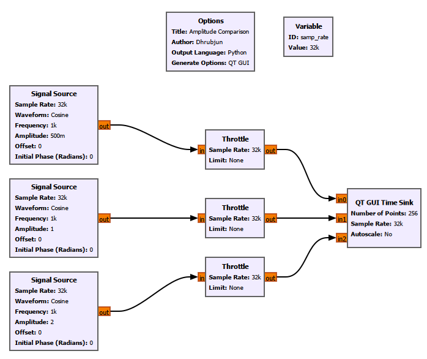

The three signals can be connected to the same QT GUI Time Sink by setting **Number of Inputs** to `3`.

The result is:

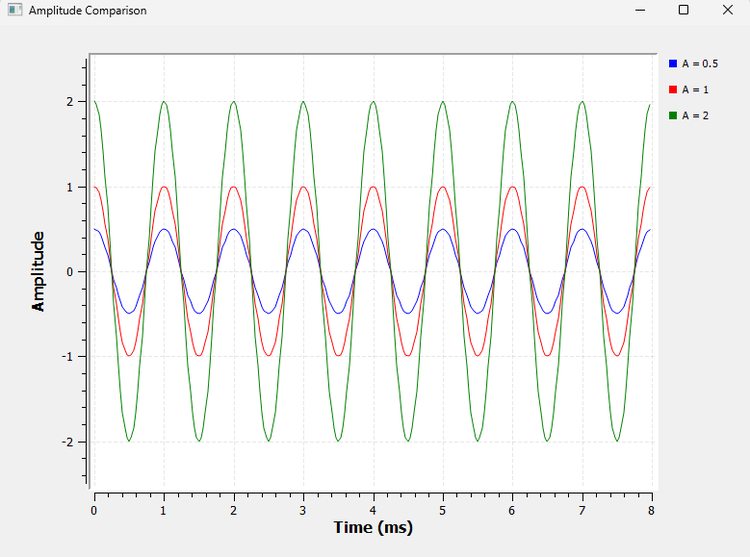

Notice that the peaks and zero crossings occur at the same times. The signals are therefore oscillating at the same rate.

Only their vertical size changes.

That vertical size is the amplitude.

### A Small GNU Radio Detail

You may notice that GNU Radio displays an amplitude of `0.5` as:

```text
500m
```

Here, `m` means *milli*.

So:

$$
500m=500\times10^{-3}=0.5
$$

GNU Radio frequently uses engineering notation such as `k`, `M`, and `m`. You will see this notation often as our flowgraphs become more complicated.

---

## 2.3 Frequency: How Fast Does the Signal Repeat?

Imagine two blinking lights.

One flashes once every second. Another flashes ten times every second.

Both repeat, but the second one repeats much faster.

Frequency tells us how many complete cycles occur every second. Its unit is hertz (Hz).

A frequency of

$$
f=1\text{ Hz}
$$

means one cycle per second.

Similarly,

$$
f=1000\text{ Hz}
$$

means 1000 cycles per second.

We often write:

$$
1000\text{ Hz}=1\text{ kHz}
$$

The higher the frequency, the more cycles the signal completes in the same amount of time.

---

## 2.4 Period: How Long Does One Cycle Take?

Frequency asks:

> How many cycles happen in one second?

Period asks the opposite question:

> How long does one cycle take?

The period is represented by $T$.

Frequency and period are related by

$$
T=\frac{1}{f}
$$

and therefore

$$
f=\frac{1}{T}
$$

For a 1 kHz signal,

$$
T=\frac{1}{1000}
$$

$$
T=0.001\text{ s}=1\text{ ms}
$$

So every cycle takes 1 ms.

### GNU Radio Experiment: Frequency and Period

We can reuse the same three-signal flowgraph from the amplitude experiment.

This time, set all amplitudes to `1` and change only the frequencies:

| Signal | Frequency | Amplitude |
|---|---:|---:|
| Signal 1 | 500 Hz | 1 |
| Signal 2 | 1000 Hz | 1 |
| Signal 3 | 2000 Hz | 1 |

Keep the phase and offset at zero.

The result is:

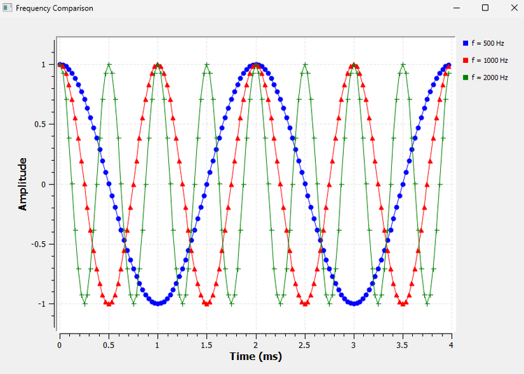

Look at the horizontal axis.

In 4 ms:

- the 500 Hz signal completes 2 cycles
- the 1 kHz signal completes 4 cycles
- the 2 kHz signal completes 8 cycles

Their periods are:

| Frequency | Period |
|---:|---:|
| 500 Hz | 2 ms |
| 1000 Hz | 1 ms |
| 2000 Hz | 0.5 ms |

Notice what happens when frequency doubles: the period becomes half as large.

This is exactly what

$$
T=\frac{1}{f}
$$

tells us.

### GNU Radio Toolbox: Number of Points

There is another useful lesson hidden inside this experiment.

In Chapter 1, our QT GUI Time Sink used:

```text
Number of Points = 1024
Sample Rate = 32000
```

That means the Time Sink displayed

$$
\frac{1024}{32000}=0.032\text{ s}
$$

or

$$
32\text{ ms}
$$

of data.

For some of our Chapter 2 experiments, that was unnecessarily long. We wanted to look more closely at just a few cycles.

For example, with

```text
Number of Points = 128
```

the displayed duration becomes

$$
\frac{128}{32000}=0.004\text{ s}
$$

or

$$
4\text{ ms}
$$

So the horizontal time window of the Time Sink is determined by both the number of samples being displayed and the sample rate.

A useful relationship is

$$
\text{Displayed time}
=
\frac{\text{Number of Points}}
{\text{Sample Rate}}
$$

We will use this relationship repeatedly.

---

## 2.5 Phase: Where Is the Signal in Its Cycle?

Two signals can have exactly the same amplitude and frequency and still not line up.

One may reach its peak slightly earlier than the other.

This difference is described by **phase**.

Think of two people running around the same circular track at exactly the same speed. If they start side by side, they remain together. If one starts a quarter of the track ahead, they still run at the same speed, but their positions around the track are different.

That is similar to phase.

A complete cycle corresponds to

$$
360^\circ=2\pi\text{ radians}
$$

Some useful phase values are:

| Degrees | Radians |
|---:|---:|
| 0° | $0$ |
| 90° | $\pi/2$ |
| 180° | $\pi$ |
| 270° | $3\pi/2$ |
| 360° | $2\pi$ |

GNU Radio's Signal Source specifies its initial phase in **radians**.

One point is worth remembering: phase becomes especially useful when we compare one signal with another. Saying that two signals are 90° apart tells us how their cycles are positioned relative to each other.

### GNU Radio Experiment: Comparing Phase

For this experiment, keep:

```text
Frequency = 1 kHz
Amplitude = 1
Offset = 0
```

and use three initial phases:

```text
Signal 1: 0
Signal 2: pi/2
Signal 3: pi
```

To make `pi` available in our flowgraph, we used a Variable block:

```text
ID: pi
Value: 3.14159
```

GNU Radio can then evaluate expressions such as:

```text
pi/2
```

This is useful because block properties do not always have to contain fixed numbers. They can also use variables and expressions.

The result is:

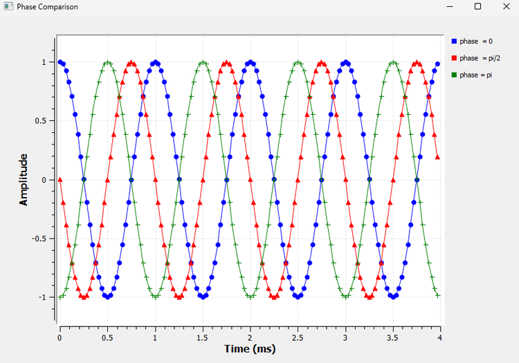

At $t=0$:

- the 0° cosine starts at +1
- the 90° cosine starts at 0
- the 180° cosine starts at -1

Their amplitudes are the same. Their frequencies are the same.

Only their positions within the cycle are different.

That is the effect of phase.

---

## 2.6 DC Offset: Moving the Whole Signal Up or Down

Until now, our signals have been centred around zero.

For example, a cosine wave with amplitude 1 moves between

$$
-1\text{ and }+1
$$

But a signal does not have to be centred at zero.

Suppose we add 1 to every point:

$$
x(t)=\cos(2\pi ft)+1
$$

Now the waveform moves between

$$
0\text{ and }2
$$

The shape has not changed. The frequency has not changed. The amplitude is still 1.

The entire waveform has simply moved upward.

That shift is called a **DC offset**.

### GNU Radio Experiment: Comparing Offset

Again, reuse the same three-signal structure.

Keep:

```text
Frequency = 1 kHz
Amplitude = 1
Phase = 0
```

and use:

```text
Signal 1: Offset = 0
Signal 2: Offset = +1
Signal 3: Offset = -1
```

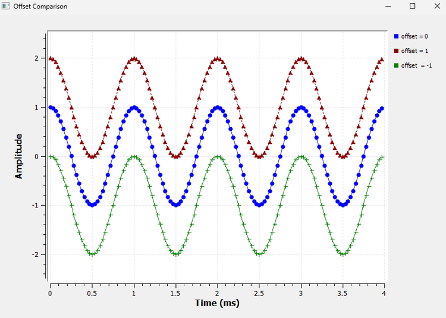

The first waveform is centred at 0.

The second is centred at +1.

The third is centred at -1.

There is an important detail here.

The signal with offset +1 reaches a maximum value of +2, but its amplitude is **not 2**. It oscillates between 0 and 2, so its centre is +1 and its amplitude is still 1.

Amplitude describes the distance from the centre of the waveform, not necessarily the distance from zero.

---

## 2.7 Waveform Shape

Frequency tells us how often a signal repeats.

But frequency alone does not tell us what happens during one cycle.

Consider three signals that all repeat 1000 times per second. One can be smooth. Another can switch abruptly between two levels. Another can rise and fall in straight lines.

They all have the same repetition rate, but they do not have the same shape.

### GNU Radio Experiment: Comparing Waveforms

Generate:

- a cosine wave
- a square wave
- a triangle wave

with a repetition frequency of 1 kHz.

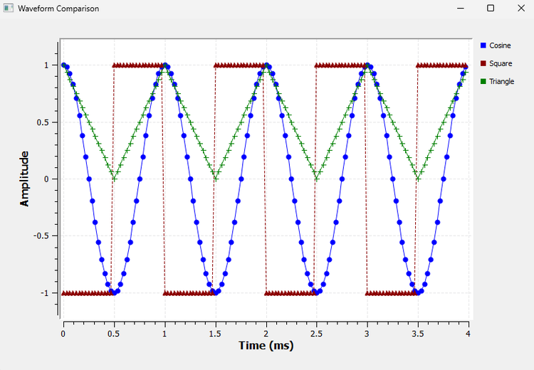

The cosine changes smoothly.

The square wave switches abruptly between its two levels.

The triangle wave changes linearly between its minimum and maximum.

You may wonder why we did not include both sine and cosine. A sine and cosine have the same basic shape; one can be obtained from the other by a phase shift. We have already seen what phase does.

### A Note About the Square-Wave Settings

For our comparison, we wanted the square wave to switch between approximately -1 and +1.

With the GNU Radio Signal Source used in our experiment, we set:

```text
Amplitude = 2
Offset = -1
```

to obtain the desired bipolar levels.

This keeps the vertical range comparable with the cosine and triangle signals.

### A Question for Later

All three signals repeat at 1 kHz.

Yet they clearly have different shapes.

Why?

There is a deeper reason for this, and it becomes much clearer when we start looking at signals in the **frequency domain**.

For now, keep this observation in mind. We will return to it later.

---

## 2.8 What Happens When Signals Meet?

So far, we have mostly looked at one signal at a time.

Real systems are rarely that simple.

An antenna may receive signals from several transmitters. Noise gets added to useful signals. Reflections create additional copies of transmitted signals. Interference may combine with the signal we actually want.

So we need to understand what happens when signals are added.

---

## 2.9 Adding Two Signals

Suppose we have two signals:

$$
x_1(t)
$$

and

$$
x_2(t)
$$

If they are added, the result is

$$
y(t)=x_1(t)+x_2(t)
$$

This means that at every instant, we simply add their values.

If at some instant

$$
x_1=1
$$

and

$$
x_2=0.5
$$

then

$$
y=1.5
$$

If instead

$$
x_1=-1
$$

and

$$
x_2=0.5
$$

then

$$
y=-0.5
$$

GNU Radio lets us see this directly.

### GNU Radio Experiment: The Add Block

For the first addition experiment, generate:

```text
x1:
Frequency = 1 kHz
Amplitude = 1

x2:
Frequency = 2 kHz
Amplitude = 0.5
```

Then introduce a new block:

**Add**

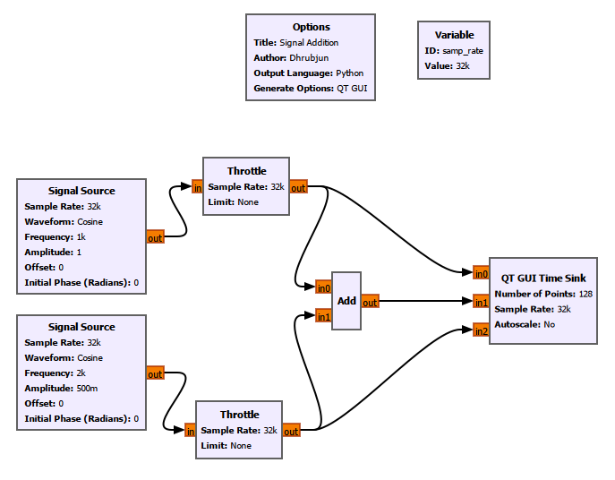

The Add block performs sample-by-sample addition:

$$
y[n]=x_1[n]+x_2[n]
$$

We also branch each original signal to the QT GUI Time Sink so that we can see:

- $x_1$
- $x_2$
- $x_1+x_2$

at the same time.

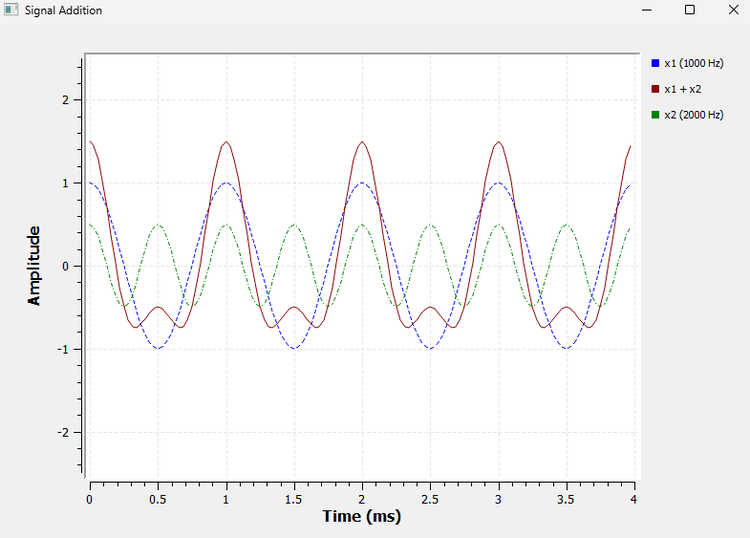

The result no longer looks like either of the original cosine waves.

A more complicated-looking signal has appeared simply by adding two simple signals together.

This simple idea will become extremely important later.

### GNU Radio Toolbox: Branching a Stream

Notice something new in the flowgraph.

The output of each Throttle is connected to two destinations. One branch goes directly to the Time Sink, while the other goes to the Add block.

GNU Radio does not require a special splitter block for this.

A stream can simply be connected to multiple downstream blocks.

Also, branching a stream does **not** divide its amplitude. Each downstream block receives the same stream.

---

## 2.10 Phase Changes the Result of Addition

Now we can connect two ideas we have already learned: **phase** and **addition**.

Suppose two cosine signals have:

- the same frequency
- the same amplitude
- different phases

What happens when we add them?

Let's find out.

Use two 1 kHz cosine signals, each with amplitude 1.

Keep the first signal at:

```text
Phase = 0
```

For the second signal, we will test three different phase values. We stop the flowgraph, change its initial phase, and run the experiment again for each case.

This gives us three controlled comparisons while keeping everything else unchanged.

### Case 1: Phase Difference = 0°

The two signals are perfectly aligned.

When one reaches +1, the other reaches +1:

$$
1+1=2
$$

When one reaches -1, the other also reaches -1:

$$
-1+(-1)=-2
$$

The signals reinforce one another.

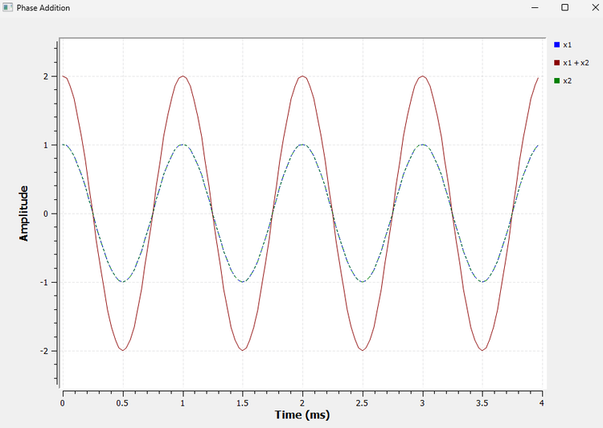

The resulting signal has an amplitude of approximately 2.

This is complete constructive addition.

### Case 2: Phase Difference = 90°

Now shift the second signal by

$$
90^\circ=\frac{\pi}{2}
$$

The signals still have the same amplitude and frequency, but their peaks no longer occur at the same time.

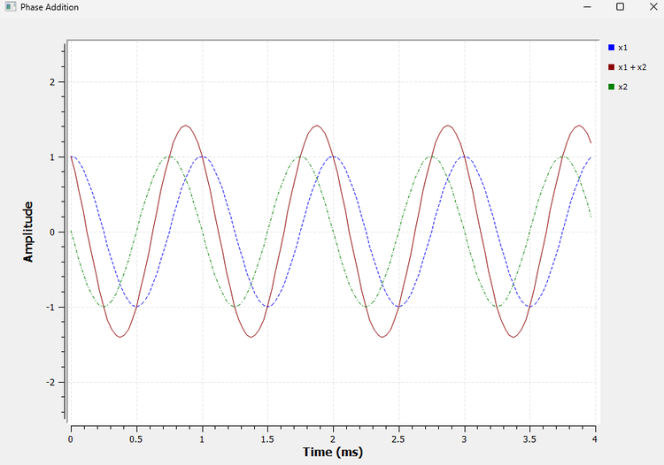

The resulting signal is still sinusoidal, but its amplitude is now approximately

$$
\sqrt{2}\approx1.414
$$

The two signals still reinforce each other, but not as strongly as they did at 0°.

Notice something else: the resulting signal is also shifted in phase. Adding equal-frequency sinusoids can therefore change both the amplitude and phase of the result.

### Case 3: Phase Difference = 180°

Finally, shift the second signal by

$$
180^\circ=\pi
$$

Now, whenever the first signal is positive, the second is equally negative.

So

$$
x_2(t)=-x_1(t)
$$

and therefore

$$
x_1(t)+x_2(t)=0
$$

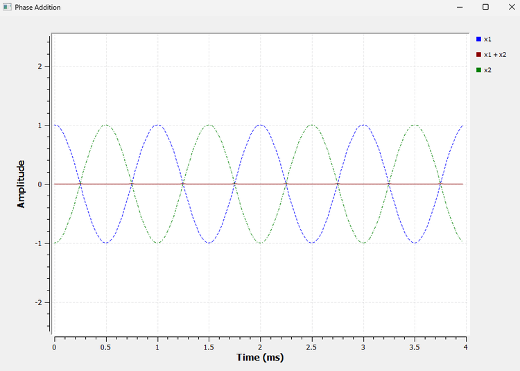

The summed signal becomes a straight line at zero.

Both input signals are still present, but their sum cancels completely.

This is complete destructive cancellation.

### The Bigger Lesson

The result of adding signals depends not only on their amplitudes and frequencies. Their **relative phase** matters too.

For two equal-amplitude sinusoids of the same frequency, the amplitude of the sum depends on their phase difference.

For equal amplitudes $A$,

$$
A_{\text{sum}}
=
2A
\left|
\cos\left(\frac{\Delta\phi}{2}\right)
\right|
$$

You do not need to memorise this equation yet.

The important idea is already visible in GNU Radio:

- 0° gives maximum reinforcement
- 90° gives partial reinforcement
- 180° gives complete cancellation

---

## 2.11 Beats: When Frequencies Are Almost the Same

Now for an interesting question.

What happens if two signals have almost the same frequency?

Consider

$$
f_1=1000\text{ Hz}
$$

and

$$
f_2=1050\text{ Hz}
$$

At the beginning, their peaks may line up. But the 1050 Hz signal completes its cycles slightly faster than the 1000 Hz signal.

So their relative phase does not stay fixed.

They gradually move out of alignment, become nearly opposite, and later line up again.

This repeated movement in and out of alignment produces **beats**.

### GNU Radio Experiment: Beats

Reuse the addition flowgraph.

Set:

```text
Signal 1:
Frequency = 1000 Hz
Amplitude = 1

Signal 2:
Frequency = 1050 Hz
Amplitude = 1
```

To see the slow variation clearly, increase the Time Sink display window to approximately 40 ms.

With

$$
f_s=32000\text{ samples/s}
$$

we need

$$
N=32000\times0.04=1280
$$

samples.

So set:

```text
Number of Points = 1280
```

The result is:

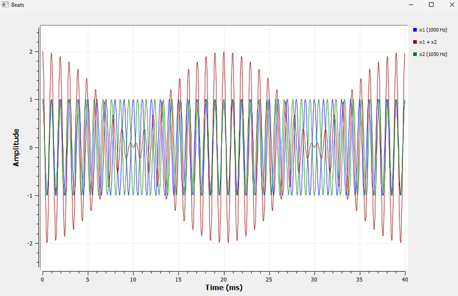

Look at the summed signal.

Its amplitude grows, becomes very small, grows again, and continues repeating.

Around 0 ms, the signals are approximately aligned and reinforce each other strongly.

Around 10 ms, they are approximately 180° apart and nearly cancel.

Around 20 ms, they are aligned again.

The pattern then repeats.

The difference between the two frequencies is

$$
\Delta f=|1050-1000|=50\text{ Hz}
$$

The beat frequency is

$$
f_{\text{beat}}=|f_2-f_1|
$$

so

$$
f_{\text{beat}}=50\text{ Hz}
$$

The corresponding beat period is

$$
T_{\text{beat}}=\frac{1}{50}
$$

$$
T_{\text{beat}}=20\text{ ms}
$$

That is exactly the repetition interval we observe in GNU Radio.

### Beats Are Really a Phase Story

Beats may initially look like a completely new phenomenon, but they are closely connected to our previous phase-addition experiment.

When the two signals are aligned, they reinforce each other.

As their relative phase changes, the amount of reinforcement decreases.

When they become approximately 180° apart, they nearly cancel.

Because their frequencies are slightly different, their relative phase keeps changing with time. Eventually they line up again, and the process repeats.

So beats connect several ideas from this chapter:

**frequency → changing relative phase → addition → reinforcement and cancellation**

That connection is more important than simply remembering the beat-frequency formula.

---

## 2.12 What We Have Learned

We started this chapter with a single cosine wave.

By changing one property at a time, we found that:

- **amplitude** controls the vertical size of a signal
- **frequency** tells us how many cycles occur per second
- **period** tells us how long one cycle takes
- **phase** describes a signal's position within its cycle relative to a reference
- **DC offset** moves the centre of a waveform up or down
- **waveform shape** describes how the signal changes during each cycle

Then we allowed signals to interact.

We saw that:

- signals can be added sample by sample
- simple signals can combine into more complicated waveforms
- phase affects whether signals reinforce or cancel
- equal signals separated by 180° can cancel completely
- slightly different frequencies produce beats

These are not isolated ideas.

They will appear again and again throughout SDR.

---

## 2.13 GNU Radio Toolbox

This chapter also introduced several useful GNU Radio concepts.

### Multiple Time Sink Inputs

A single QT GUI Time Sink can display several signals simultaneously by increasing **Number of Inputs**.

This allowed us to compare signals directly.

### Number of Points

The displayed duration of a Time Sink depends on both its sample rate and Number of Points:

$$
T_{\text{display}}
=
\frac{N}{f_s}
$$

We used this to choose suitable viewing windows for different experiments.

### Variables

We already used:

```text
samp_rate
```

and introduced another variable:

```text
pi
```

Variables make a flowgraph easier to understand and modify.

### Expressions in Block Properties

GNU Radio properties can use expressions such as:

```text
pi/2
```

rather than requiring us to calculate and type every decimal value manually.

### Multiple Inputs

The **Add** block accepts multiple input streams and produces their sample-by-sample sum.

### Branching

One output stream can feed more than one downstream block.

This allowed us to send a signal both to the Add block and directly to the Time Sink.

### Reusing a Flowgraph

Not every experiment needs a completely new flowgraph.

Many of our comparisons used the same basic structure while changing only one parameter.

This is often a better way to experiment: keep everything else fixed and change only the property you want to understand.

---

## 2.14 Experiments from This Chapter

The GNU Radio Companion files for this chapter are stored in:

```text
experiments/chapter02/
```

The experiments developed in this chapter include:

```text
amplitude-comparison.grc
frequency-period-comparison.grc
phase-comparison.grc
dc-offset-comparison.grc
waveform-shape-comparison.grc
signal-addition.grc
phase-addition.grc
beats.grc
```

Make sure these names match the actual filenames in your repository. If any of your saved `.grc` files use different names, update this list rather than renaming working experiments unnecessarily.

You can open any of these files in GNU Radio Companion and reproduce the corresponding experiment.

---

## 2.15 Try It Yourself

Before moving on, try changing a few things yourself.

1. Change the amplitude comparison from `0.5, 1, 2` to `1, 2, 3`. What changes, and what stays exactly the same?

2. Change the frequency comparison to `250 Hz, 500 Hz, 1 kHz`. Before running it, predict how many cycles of each signal you will see in the same time window.

3. Try a phase difference of 45°:

$$
45^\circ=\frac{\pi}{4}
$$

What happens when the two signals are added? Will the resulting amplitude be closer to 2, closer to 0, or somewhere in between?

4. Change the beat experiment from

```text
1000 Hz + 1050 Hz
```

to

```text
1000 Hz + 1010 Hz
```

Before running it, predict whether the beat pattern will become faster or slower.

5. Then try

```text
1000 Hz + 1100 Hz
```

and compare the result.

Do not just look at the output.

Try to predict what you expect first, and then use GNU Radio to test your prediction.

That habit will become increasingly useful as our flowgraphs become more complicated.

---

## 2.16 Where We Go Next

So far, we have treated these signals as though they already exist inside the computer.

But an SDR works with **samples**.

A real-world signal must somehow be converted into a sequence of numbers before software can process it.

That raises several important questions.

How often should we measure the signal?

What happens if we do not take enough samples?

Can two completely different analog frequencies produce the same digital samples?

And why did changing the sample rate in GNU Radio sometimes make a smooth sinusoid look triangular, distorted, or even like a straight line?

Those questions take us to one of the most important ideas in digital signal processing:

**sampling and aliasing.**