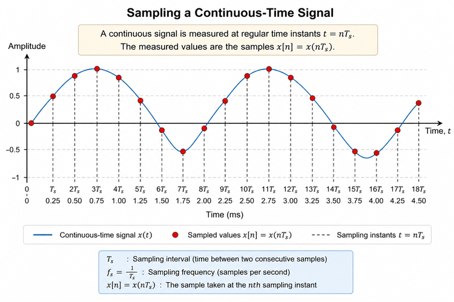
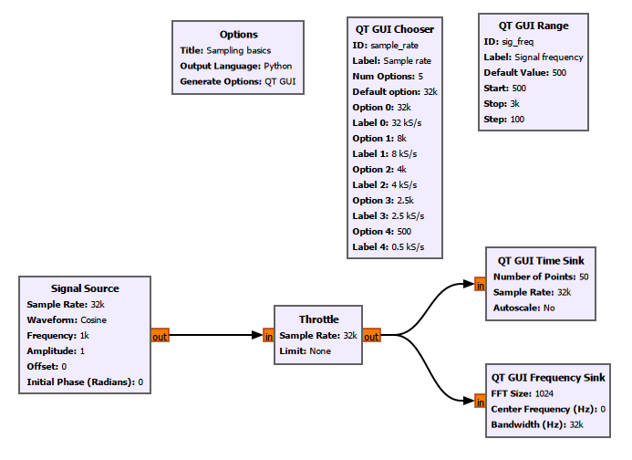
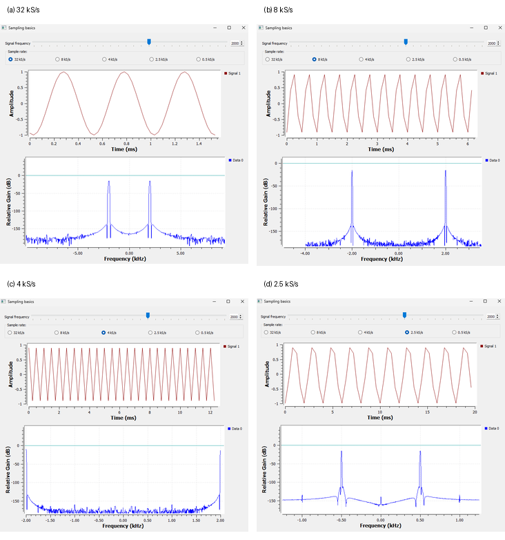

# Chapter 3: Sampling and Aliasing

In the previous chapter, we generated signals inside GNU Radio, changed their amplitude, frequency, phase, and offset, and added signals together.

But there is an important question we have not answered yet.

A real radio signal does not begin as a set of numbers inside a computer. It arrives at an antenna as a continuously changing electrical signal.

A computer, however, works with numbers.

So how do we get from one to the other?

The answer begins with **sampling**.

Sampling is one of the most important ideas in digital signal processing and software-defined radio. It determines what part of the real-world signal can be represented digitally and, just as importantly, what can go wrong when we do not sample fast enough.

In this chapter, rather than beginning with the sampling theorem, we will first see what sampling actually means, experiment with it in GNU Radio, and then discover why the Nyquist limit exists.

---

## 3.1 From a Continuous Signal to Numbers

Imagine measuring the temperature of a room.

The actual temperature changes continuously. But if we want to record it with a computer, we might measure it once every minute:

```text
10:00 → 21.2 °C
10:01 → 21.3 °C
10:02 → 21.4 °C
10:03 → 21.3 °C
```

Each measurement gives us one number.

That number is a **sample**.

A radio receiver does essentially the same thing, except much faster.

The voltage produced by an antenna changes continuously with time. An analog-to-digital converter, or **ADC**, measures that voltage repeatedly and converts the measurements into numbers.

Conceptually:

```text
Analog signal → ADC → Digital samples → Software processing
```

Once the signal has become a sequence of numbers, software such as GNU Radio can process it.

This is why sampling is so fundamental to SDR:

> **Sampling is the bridge between the analog world and the digital world.**

---

## 3.2 What Exactly Is a Sample?

Suppose we have a continuous-time signal:

$$
x(t)
$$

Instead of knowing its value at every possible instant, we measure it at regularly spaced times:

$$
t=0,\ T_s,\ 2T_s,\ 3T_s,\ldots
$$

The measured values form a sequence:

$$
x[0],\ x[1],\ x[2],\ x[3],\ldots
$$

where

$$
x[n]=x(nT_s)
$$

These values are the **samples** of the original signal.

The time between two consecutive samples is called the **sampling interval** or **sampling period**:

$$
T_s
$$

The number of samples taken every second is called the **sampling frequency** or **sample rate**:

$$
f_s
$$

The two are related by

$$
f_s=\frac{1}{T_s}
$$

or

$$
T_s=\frac{1}{f_s}.
$$

For example, if

$$
f_s=8000\text{ samples/s},
$$

then

$$
T_s=\frac{1}{8000}=125\ \mu\text{s}.
$$

So the signal is measured once every 125 microseconds.

---

## 3.3 Seeing Sampling

Figure 3.1 shows the idea visually.



**Figure 3.1: Sampling a continuous-time signal at regularly spaced time intervals.**

The smooth curve represents the continuously varying signal.

The individual points represent the values measured by the sampling system.

This distinction is important.

The computer does not receive the entire smooth curve.

It receives something like:

```text
x[0]
x[1]
x[2]
x[3]
...
```

These samples are all the digital system has available for further processing.

Naturally, this leads to a question:

> **How frequently should we take those samples?**

Let's investigate that rather than answering it immediately.

---

# 3.4 Building a Sampling Experiment in GNU Radio

We will use a simple cosine signal and gradually reduce its sample rate.

Our experiment also introduces a few useful GNU Radio blocks that we have not used before.

The completed flowgraph is shown below.



**Figure 3.2: GNU Radio flowgraph for investigating sampling and aliasing.**

Save the flowgraph as:

```text
experiments/chapter03/sampling-basics.grc
```

The important parts of the experiment are:

```text
Signal Source
      │
      ▼
   Throttle
    /    \
   /      \
  ▼        ▼
Time     Frequency
Sink       Sink
```

We also have two interactive controls:

```text
QT GUI Chooser → Sample rate
QT GUI Range   → Signal frequency
```

This allows us to change the sampling conditions while the flowgraph is running.

---

## 3.5 A New Control: QT GUI Chooser

Until now, we have mostly changed values by editing block properties or variables.

In this experiment, we want to switch quickly between several predefined sample rates.

For this, we use a **QT GUI Chooser**.

Our chooser defines:

```text
ID: sample_rate
```

with the following options:

```text
32 kS/s
8 kS/s
4 kS/s
2.5 kS/s
0.5 kS/s
```

For the main experiment, we will use the first four.

We will leave **0.5 kS/s** for the *Try It Yourself* section.

The same `sample_rate` variable is used by the relevant blocks in the flowgraph.

The important idea is:

> **Use a QT GUI Chooser when you want the user to select one value from a predefined set of choices.**

---

## 3.6 Another New Control: QT GUI Range

We also added a **QT GUI Range** with:

```text
ID: sig_freq
```

This controls the frequency of our Signal Source.

Instead of stopping the flowgraph every time we want to change the frequency, we can move the slider while the experiment is running.

The Signal Source therefore uses:

```text
Frequency: sig_freq
```

This gives us a useful distinction between three GNU Radio concepts:

```text
Variable
    ↓
Stores a value

QT GUI Chooser
    ↓
Selects one value from predefined choices

QT GUI Range
    ↓
Changes a value continuously across a specified range
```

We will use these interactive controls many more times later.

---

# 3.7 Looking at the Signal in Two Different Ways

Our experiment also uses two different displays.

The **QT GUI Time Sink** shows how the signal changes with time.

The **QT GUI Frequency Sink** shows what frequencies are present in the signal.

For now, we do not need to understand all of the mathematics behind the frequency domain. We will study that properly later.

We are simply going to use the Frequency Sink as another way of observing our sampling experiment.

Because we are using a real cosine, the Frequency Sink shows components at both positive and negative frequencies.

For a 2 kHz cosine, for example, we expect components around:

$$
+2\text{ kHz}
$$

and

$$
-2\text{ kHz}.
$$

Why a real cosine produces both positive and negative frequencies will become much clearer when we study complex signals and IQ signals later.

For now, just watch where the peaks appear.

---

# 3.8 Our Experiment: A 2 kHz Cosine

For the main experiment, set:

```text
Signal frequency = 2 kHz
Amplitude        = 1
Waveform         = Cosine
```

We will keep the signal frequency fixed at 2 kHz and change only the sample rate.

This is important.

If we change several parameters simultaneously, it becomes difficult to know which change caused what we observe.

So we follow a simple experimental rule:

> **Change one thing at a time.**

We will try:

```text
32 kS/s
8 kS/s
4 kS/s
2.5 kS/s
```

Before looking at the results, however, there is one useful quantity we should calculate.

---

# 3.9 Samples per Cycle

Suppose the signal frequency is:

$$
f=2\text{ kHz}.
$$

If the sample rate is:

$$
f_s=32\text{ kS/s},
$$

then the number of samples taken during one cycle is:

$$
N_{\text{cycle}}=\frac{f_s}{f}.
$$

Therefore:

$$
N_{\text{cycle}}
=
\frac{32000}{2000}
=
16.
$$

So every cycle of our 2 kHz cosine is represented by 16 samples.

This gives us a very intuitive way to think about sampling.

Instead of asking only:

> What is the sample rate?

we can also ask:

> **How many measurements do I get during one cycle of this signal?**

Let's start reducing that number.

---

# 3.10 Watching the Samples Disappear

Figure 3.3 shows the same 2 kHz cosine sampled at four different rates.



**Figure 3.3: A 2 kHz cosine sampled at 32, 8, 4, and 2.5 kS/s. The Time Sink shows the sampled waveform while the Frequency Sink shows its apparent frequency.**

Let's examine the four cases carefully.

---

## 3.11 Case 1: 32 kS/s

We begin with:

$$
f=2\text{ kHz}
$$

and

$$
f_s=32\text{ kS/s}.
$$

The number of samples per cycle is:

$$
\frac{32}{2}=16.
$$

So we obtain 16 samples for every cycle.

The Time Sink looks smooth because there are many samples available to represent each cycle.

The Frequency Sink shows peaks at approximately:

$$
\pm2\text{ kHz}.
$$

Everything looks as expected.

---

# 3.12 Case 2: 8 kS/s

Now reduce the sample rate to:

$$
f_s=8\text{ kS/s}.
$$

The signal frequency remains:

$$
f=2\text{ kHz}.
$$

Now we obtain:

$$
\frac{8}{2}=4
$$

samples per cycle.

The waveform in the Time Sink is noticeably less smooth.

But look at the Frequency Sink.

The signal is still correctly located at approximately:

$$
\pm2\text{ kHz}.
$$

The signal has not changed frequency.

We have simply taken fewer measurements of each cycle.

---

# 3.13 Case 3: 4 kS/s

Now set:

$$
f_s=4\text{ kS/s}.
$$

The number of samples per cycle becomes:

$$
\frac{4}{2}=2.
$$

Only two samples are now available per cycle.

The Time Sink looks extremely coarse.

At this point, we have reached a very important boundary because:

$$
f=\frac{f_s}{2}.
$$

Our 2 kHz signal is exactly half the 4 kS/s sampling frequency.

This frequency is called the **Nyquist frequency**.

We will come back to this in a moment.

---

# 3.14 Case 4: 2.5 kS/s

Now something genuinely different happens.

Set:

$$
f_s=2.5\text{ kS/s}.
$$

Our signal is still:

$$
f=2\text{ kHz}.
$$

The number of samples per cycle is:

$$
\frac{2.5}{2}=1.25.
$$

So we are taking only 1.25 samples per cycle.

But the most interesting result is not simply that the Time Sink looks strange.

Look at the Frequency Sink.

The signal is no longer appearing at:

$$
\pm2\text{ kHz}.
$$

Instead, it appears at approximately:

$$
\pm0.5\text{ kHz}.
$$

This is fundamentally different from simply having a rough-looking waveform.

Our original 2 kHz signal is now appearing to the digital system as a 0.5 kHz signal.

We have just observed **aliasing**.

---

# 3.15 The Pattern We Have Discovered

Let's summarize what happened.

| Signal Frequency | Sample Rate | Samples per Cycle | Result |
|---:|---:|---:|---|
| 2 kHz | 32 kS/s | 16 | Correctly represented |
| 2 kHz | 8 kS/s | 4 | Correctly represented |
| 2 kHz | 4 kS/s | 2 | Nyquist boundary |
| 2 kHz | 2.5 kS/s | 1.25 | Aliased to 0.5 kHz |

Something important seems to happen when the sample rate approaches twice the signal frequency.

This observation leads us naturally to the sampling theorem.

---

# 3.16 The Nyquist Sampling Theorem

For a band-limited signal whose highest frequency component is $f_{\max}$, the sampling frequency must be greater than twice the highest frequency if we want to avoid aliasing:

$$
f_s>2f_{\max}.
$$

The quantity

$$
\frac{f_s}{2}
$$

is called the **Nyquist frequency**.

We can write:

$$
f_N=\frac{f_s}{2}.
$$

The frequencies we want to represent must remain below this limit.

For example, with:

$$
f_s=8\text{ kS/s},
$$

the Nyquist frequency is:

$$
f_N=4\text{ kHz}.
$$

Our 2 kHz signal lies comfortably below that limit.

But with:

$$
f_s=2.5\text{ kS/s},
$$

the Nyquist frequency becomes:

$$
f_N=1.25\text{ kHz}.
$$

Our signal is:

$$
2\text{ kHz}>1.25\text{ kHz}.
$$

Therefore, the sampling system cannot represent that 2 kHz frequency uniquely.

Aliasing occurs.

---

# 3.17 Why "Two Samples per Cycle" Needs Some Care

You may have heard the sampling theorem summarized as:

> We need at least two samples per cycle.

That statement is useful for intuition, but it can also be misleading.

Our 4 kS/s experiment illustrates why.

For:

$$
f=2\text{ kHz}
$$

and

$$
f_s=4\text{ kS/s},
$$

we have exactly two samples per cycle.

But where those samples land depends on the phase relationship between the waveform and the sampling instants.

For one phase, the samples might alternate between positive and negative values.

For another phase, they could land at completely different points.

In an extreme case, sampling a sinusoid exactly at twice its frequency can repeatedly hit zero crossings.

So the exact Nyquist boundary is a special case.

In practical systems, we normally use some margin.

A better way to remember the idea is:

> **The Nyquist rate is a theoretical boundary, not a sample rate we should normally try to operate exactly on.**

---

# 3.18 A Rough Waveform Does Not Automatically Mean Aliasing

This is another important lesson from our experiment.

At 8 kS/s, the Time Sink already looks less smooth than at 32 kS/s.

At 4 kS/s, it looks extremely angular.

But this does not mean that the Signal Source has somehow changed from a cosine into a triangle wave.

GNU Radio is displaying discrete samples and drawing lines between them.

When there are many samples, those connecting lines give the impression of a smooth curve.

When there are only a few samples, the straight segments become obvious.

So:

> **A waveform looking rough or triangular in the Time Sink is not, by itself, proof of aliasing.**

The 2.5 kS/s case is different.

There, the frequency itself is being represented incorrectly.

That is aliasing.

---

# 3.19 What Is Aliasing?

Aliasing occurs when a sampled system cannot distinguish between different analog frequencies.

A signal above the Nyquist frequency can appear as another frequency inside the representable digital frequency range.

In simple words:

> **Aliasing can make a high-frequency signal appear as a lower-frequency signal.**

This is exactly what happened in our GNU Radio experiment.

We generated:

$$
2\text{ kHz},
$$

but after sampling at 2.5 kS/s, the digital representation appeared at:

$$
0.5\text{ kHz}.
$$

Let's see exactly where that 0.5 kHz came from.

---

# 3.20 Where Did the 0.5 kHz Come From?

Our experiment used:

$$
f=2\text{ kHz}
$$

and

$$
f_s=2.5\text{ kS/s}.
$$

First calculate the Nyquist frequency:

$$
f_N=\frac{f_s}{2}.
$$

Therefore:

$$
f_N=\frac{2.5}{2}=1.25\text{ kHz}.
$$

Our 2 kHz signal lies above this limit:

$$
2>1.25.
$$

So aliasing must occur.

For this first-fold case, the aliased frequency is:

$$
f_{\text{alias}}=|f-f_s|.
$$

Substituting our values:

$$
f_{\text{alias}}
=
|2-2.5|
$$

$$
f_{\text{alias}}
=
0.5\text{ kHz}.
$$

And that is exactly what we observed in GNU Radio.

Look again at the 2.5 kS/s panel in Figure 3.3.

The Signal Source is still configured for:

$$
2\text{ kHz},
$$

but the Frequency Sink shows peaks around:

$$
\boxed{\pm0.5\text{ kHz}}.
$$

This is not a random error in GNU Radio.

It is exactly what sampling theory predicts.

---

# 3.21 The High Frequency Did Not Physically Become Low

There is one subtle point worth making.

When we say:

> "The 2 kHz signal became 0.5 kHz,"

we are using convenient language.

The original analog signal did not physically slow down.

It was still a 2 kHz signal.

The problem is that after sampling at 2.5 kS/s, the resulting sequence of samples is consistent with a 0.5 kHz alias.

From the digital samples alone, the system cannot uniquely recover the fact that the original signal was 2 kHz.

So a more precise statement is:

> **The 2 kHz analog signal appears as a 0.5 kHz signal in the sampled data.**

That distinction becomes very important in real SDR systems.

---

# 3.22 Another Aliasing Example

Let's reinforce the idea with another example.

Suppose we have:

$$
f=7\text{ kHz}
$$

and sample it at:

$$
f_s=10\text{ kS/s}.
$$

The Nyquist frequency is:

$$
f_N=\frac{10}{2}=5\text{ kHz}.
$$

But our signal is:

$$
7\text{ kHz}.
$$

Since:

$$
7>5,
$$

the signal lies above Nyquist.

For this case:

$$
f_{\text{alias}}
=
|f-f_s|
$$

so:

$$
f_{\text{alias}}
=
|7-10|
$$

$$
f_{\text{alias}}
=
3\text{ kHz}.
$$

Therefore:

```text
Original analog frequency:  7 kHz
Sample rate:               10 kS/s
Nyquist frequency:          5 kHz
                               ↓
                       ALIASING
                               ↓
Apparent digital frequency: 3 kHz
```

A 7 kHz analog signal can therefore appear as a 3 kHz signal after sampling at 10 kS/s.

Again, the analog signal itself has not changed.

Its **digital identity** has become ambiguous.

---

# 3.23 Frequency Folding

Another way to visualize aliasing is to imagine frequencies folding back when they cross the Nyquist boundary.

Suppose:

$$
f_s=4\text{ kS/s}.
$$

Then:

$$
f_N=2\text{ kHz}.
$$

Now imagine gradually increasing the signal frequency.

We might observe:

```text
Input frequency      Observed frequency

0.5 kHz      →       0.5 kHz
1.0 kHz      →       1.0 kHz
1.5 kHz      →       1.5 kHz
2.0 kHz      →       Nyquist boundary
2.5 kHz      →       1.5 kHz
3.0 kHz      →       1.0 kHz
3.5 kHz      →       0.5 kHz
```

Notice what happens after 2 kHz.

The input frequency keeps increasing, but the observed frequency starts moving downward.

It is as though the frequency axis has folded over at the Nyquist frequency.

That is why this behaviour is often called **frequency folding**.

---

# 3.24 A More General Aliasing Relationship

For our first examples, we used:

$$
f_{\text{alias}}=|f-f_s|.
$$

That works for the particular first-fold situations we considered.

More generally, aliases occur at frequencies related by multiples of the sampling frequency.

A useful expression is:

$$
f_{\text{alias}}=|f-kf_s|,
$$

where $k$ is an integer chosen so that the resulting frequency falls inside the Nyquist interval.

Do not worry about memorizing this immediately.

The more important idea is:

> **Different analog frequencies can produce indistinguishable sampled sequences.**

That is the real meaning of aliasing.

---

# 3.25 Why Is Aliasing Dangerous?

Suppose your computer receives samples that appear to contain a 500 Hz signal.

Was the original analog signal actually 500 Hz?

Or was it our 2 kHz signal sampled at 2.5 kS/s?

Once aliasing has occurred, the samples themselves may not contain enough information to answer that question.

The information distinguishing those possibilities was lost during sampling.

This is why aliasing is not simply a cosmetic distortion.

It represents an actual loss of information.

And that leads to another important question:

> If aliasing is so destructive, how do real systems prevent it?

---

# 3.26 The Anti-Aliasing Filter

A practical sampling system normally includes an analog filter before the ADC.

Conceptually:

```text
Analog signal
     │
     ▼
Anti-aliasing
   filter
     │
     ▼
    ADC
     │
     ▼
Digital samples
     │
     ▼
Software processing
```

The purpose of the **anti-aliasing filter** is to reduce frequency components that the chosen sampling rate cannot represent safely.

Notice where the filter is placed:

**before the ADC.**

This is essential.

If an unwanted high-frequency component has already been sampled and aliased into the useful digital band, it may be impossible to distinguish it from a legitimate signal at that apparent frequency.

So we try to prevent aliasing before it happens.

---

# 3.27 Why This Matters in SDR

Now we can connect the experiment directly to software-defined radio.

A simplified SDR receiver looks something like:

```text
Antenna
   │
   ▼
RF Front End
   │
   ▼
Analog Filtering
   │
   ▼
ADC
   │
   ▼
Digital Samples
   │
   ▼
DSP / GNU Radio
```

GNU Radio can perform very powerful processing.

But it can only work with the samples it receives.

If the sampling process has already caused unwanted signals to alias into the digital band, software cannot magically determine what the original analog frequencies were.

This is why the sample rate is one of the most important parameters in an SDR.

It determines how much frequency information can be represented digitally.

---

# 3.28 Sample Rate and Signal Frequency Are Not the Same Thing

This distinction is worth making explicit because the two values appear together constantly in GNU Radio.

Consider:

```text
Signal frequency = 2 kHz
Sample rate      = 32 kS/s
```

The **signal frequency** tells us how quickly the waveform itself oscillates.

A 2 kHz signal completes:

$$
2000
$$

cycles every second.

The **sample rate** tells us how frequently we measure that signal.

A sample rate of 32 kS/s means:

$$
32000
$$

samples are taken every second.

Therefore:

$$
\frac{32000}{2000}=16
$$

samples are taken during each cycle.

So:

```text
Signal frequency
        ↓
How fast the signal oscillates

Sample rate
        ↓
How often we measure it
```

These are related, but they are not the same quantity.

---

# 3.29 A Useful GNU Radio Lesson

There is another practical lesson hidden inside this experiment.

Changing `sample_rate` affects more than the Signal Source.

Blocks such as:

```text
Signal Source
Throttle
QT GUI Time Sink
QT GUI Frequency Sink
```

need to agree about the rate at which samples are being processed or interpreted.

This is why using a common variable such as:

```text
sample_rate
```

is so useful.

Instead of manually entering the same number in several places, we let the GUI control update the shared parameter.

This reduces mistakes and makes the experiment interactive.

---

# 3.30 GNU Radio Toolbox

This chapter introduced three particularly useful GUI blocks.

### QT GUI Chooser

Use it when you want to select one value from a predefined set.

Example:

```text
32 kS/s
8 kS/s
4 kS/s
2.5 kS/s
0.5 kS/s
```

---

### QT GUI Range

Use it when you want to vary a parameter across a range while the flowgraph is running.

In our experiment, it controls:

```text
sig_freq
```

and therefore the frequency of the Signal Source.

---

### QT GUI Frequency Sink

The Frequency Sink shows the frequency content of a signal.

In this chapter, we used it to confirm that:

```text
2 kHz input
      ↓
sampled at 2.5 kS/s
      ↓
appears at 0.5 kHz
```

Later, when we study the Fourier transform and the frequency domain properly, we will understand much more about what this display is actually showing us.

---

# 3.31 Try It Yourself

The flowgraph contains several possibilities that we deliberately did not explore in the main experiment.

Now it is your turn.

## Experiment 1: Try 0.5 kS/s

Keep:

```text
Signal frequency = 2 kHz
```

and select:

```text
Sample rate = 0.5 kS/s
```

Before clicking it, make a prediction.

How many samples per cycle will you obtain?

Use:

$$
N_{\text{cycle}}=\frac{f_s}{f}.
$$

What does the Time Sink show?

What does the Frequency Sink show?

Can you explain the result?

---

## Experiment 2: Move Through the Nyquist Boundary

Select:

```text
Sample rate = 4 kS/s
```

so that:

$$
f_N=2\text{ kHz}.
$$

Now use the Signal Frequency slider.

Start below Nyquist and gradually increase the frequency.

Try:

```text
500 Hz
1 kHz
1.5 kHz
2 kHz
2.5 kHz
3 kHz
```

Watch the Frequency Sink carefully.

Before changing each value, try to predict where the frequency will appear.

Can you see the frequency begin to fold after crossing Nyquist?

---

## Experiment 3: Try Another Waveform

So far, we deliberately used a cosine.

Now change the Signal Source waveform to:

```text
Square
```

Repeat some of the sampling experiments.

Then try:

```text
Triangle
```

Do these waveforms behave exactly like the cosine?

Why might sampling a square wave be more complicated than sampling a single cosine?

Do not worry if you cannot completely explain the result yet.

This question will make much more sense after we study the frequency domain.

---

# 3.32 What We Have Learned

We started this chapter with a simple question:

> How does a continuously varying real-world signal become something a computer can process?

The answer is **sampling**.

A sampling system measures the signal at discrete time intervals:

$$
x[n]=x(nT_s).
$$

The sampling frequency and sampling interval are related by:

$$
f_s=\frac{1}{T_s}.
$$

For a sinusoid, the number of samples per cycle is:

$$
N_{\text{cycle}}=\frac{f_s}{f}.
$$

Our GNU Radio experiment used a 2 kHz cosine.

At:

$$
32\text{ kS/s},
$$

we obtained 16 samples per cycle.

At:

$$
8\text{ kS/s},
$$

we obtained 4.

At:

$$
4\text{ kS/s},
$$

we reached the Nyquist boundary with 2 samples per cycle.

And at:

$$
2.5\text{ kS/s},
$$

the 2 kHz signal exceeded the Nyquist frequency and aliased to:

$$
0.5\text{ kHz}.
$$

That experiment demonstrated one of the most important ideas in digital signal processing:

> **If the sample rate is too low, a high-frequency signal can appear as a completely different, lower-frequency signal.**

This is aliasing.

Once aliasing has occurred, the original frequency information may no longer be recoverable from the samples alone.

That is why practical systems use appropriate sampling rates and analog anti-aliasing filters before the ADC.

---

# 3.33 Where We Go Next

Something else appeared repeatedly during this experiment.

When we generated a real cosine at 2 kHz, the Frequency Sink showed components at both:

$$
+2\text{ kHz}
$$

and

$$
-2\text{ kHz}.
$$

Why?

What does a negative frequency actually mean?

And why can an SDR represent signals using two components called **I** and **Q**?

To answer those questions, we need to move beyond real-valued signals and begin thinking about complex signals, rotating vectors, and positive and negative frequencies.

That will take us one step closer to understanding what an SDR is really doing.