# Chapter 4: Complex Numbers for SDR

## 4.1 Why Are We Talking About Complex Numbers?

At the end of the previous chapter, something interesting appeared in the Frequency Sink.

When we generated a real cosine signal, GNU Radio showed two frequency components: one at a positive frequency and another at the corresponding negative frequency.

That left us with several questions.

What is a negative frequency?

Why would frequency need a sign?

And why do SDR systems so often work with **complex-valued samples** instead of ordinary real numbers?

Before we can answer those questions properly, we need to understand complex numbers.

If you have seen complex numbers before, you may remember expressions such as

$$z=a+jb$$

and perhaps equations involving magnitude and phase.

But our goal here is not to study complex numbers as an abstract mathematical topic.

Instead, we are going to **build one in GNU Radio, take it apart, look at it from several different directions, and even deliberately break it**.

By the end of the chapter, expressions such as

$$e^{j\theta}$$

should no longer look mysterious. They will represent something we can actually visualize.

---

## 4.2 From Real Numbers to Complex Numbers

So far, almost every signal we have generated has been real-valued.

For example, a cosine signal can be written as

$$x(t)=\cos(2\pi ft)$$

At any particular instant, the signal has one numerical value.

It might be

$$0.7$$

or

$$-0.3$$

or

$$1$$

A real number therefore needs only one number to describe it.

We can imagine placing it somewhere along a number line.

Complex numbers extend this idea.

Instead of using one number, we use **two related numbers together**:

$$z=a+jb$$

Here:

- \(a\) is the **real component**
- \(b\) is the **imaginary component**
- \(j\) is defined by

$$j^2=-1$$

You may have seen the symbol \(i\) used instead of \(j\) in mathematics.

In electrical and communications engineering, \(j\) is normally used because \(i\) is commonly used to represent electrical current.

---

## 4.3 Do Not Let the Word "Imaginary" Mislead You

The name *imaginary* can make complex numbers sound less physical than they really are.

For our purposes, a better first intuition is simply this:

> A complex number gives us a convenient way to keep two related quantities together.

Consider

$$z=3+j4$$

Instead of thinking of this as some strange imaginary object, think of it as containing two coordinates:

$$ (3,4) $$

The first tells us how far to move horizontally.

The second tells us how far to move vertically.

That immediately gives us another way to visualize a complex number.

---

## 4.4 The Complex Plane

A real number can be placed on a line.

A complex number can be placed on a **plane**.

The horizontal axis represents the real component, while the vertical axis represents the imaginary component.

For

$$z=a+jb$$

we therefore place the point at

$$(a,b)$$

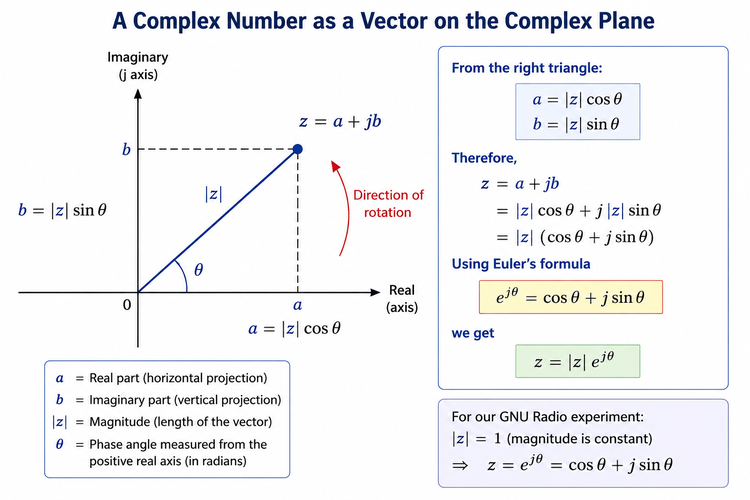

**Figure 4.1: A complex number represented by its real component, imaginary component, magnitude, and phase.**

Instead of drawing only a point, we can draw a vector from the origin to that point.

Now something useful happens.

The same complex number can be described in two different ways.

We can describe it using:

- its horizontal and vertical components,

or using:

- the length and direction of the vector.

Those two descriptions will become extremely important in SDR.

---

## 4.5 Magnitude

Suppose

$$z=a+jb$$

From the complex-plane diagram, the real component \(a\), imaginary component \(b\), and the vector itself form a right triangle.

Using the Pythagorean theorem,

$$|z|=\sqrt{a^2+b^2}$$

This is the **magnitude** of the complex number.

For example, if

$$z=3+j4$$

then

$$|z|=\sqrt{3^2+4^2}=5$$

Geometrically, magnitude tells us how far the point is from the origin.

---

## 4.6 Phase

The vector also has a direction.

We describe that direction using an angle θ, measured from the positive real axis.

The phase is

$$\theta=\mathrm{atan2}(b,a)$$

The `atan2` form is useful because it considers the signs of both components and therefore identifies the correct quadrant.

So we now have two ways to describe exactly the same complex number.

### Component form

$$z=a+jb$$

### Magnitude-phase form

$$z=|z|\angle\theta$$

This is an important idea:

> **Real and imaginary components tell us the coordinates of a complex number. Magnitude and phase tell us its length and direction.**

Nothing about the complex number has changed. We have simply changed the way we describe it.

---

## 4.7 From Geometry to Euler's Formula

Look again at the complex-plane triangle.

From basic trigonometry,

$$a=|z|\cos\theta$$

and

$$b=|z|\sin\theta$$

Since

$$z=a+jb$$

we can substitute these expressions:

$$z=|z|\cos\theta+j|z|\sin\theta$$

Factor out the magnitude:

$$z=|z|(\cos\theta+j\sin\theta)$$

Now we meet one of the most important equations in signal processing:

$$e^{j\theta}=\cos\theta+j\sin\theta$$

This is **Euler's formula**.

Therefore,

$$z=|z|e^{j\theta}$$

If the magnitude is 1, the expression becomes especially simple:

$$z=e^{j\theta}$$

We do not need to prove Euler's formula here.

What matters for SDR is understanding what it represents.

---

## 4.8 A Complex Exponential Is a Rotating Vector

Consider

$$z=e^{j\theta}$$

Using Euler's formula,

$$z=\cos\theta+j\sin\theta$$

Now imagine increasing θ.

At

$$\theta=0$$

we have

$$z=1+j0$$

The point is at

$$(1,0)$$

At

$$\theta=\frac{\pi}{2}$$

we have

$$z=0+j1$$

At

$$\theta=\pi$$

we have

$$z=-1+j0$$

And at

$$\theta=\frac{3\pi}{2}$$

we have

$$z=0-j1$$

As the angle continues changing, the point moves around the unit circle.

So instead of thinking of

$$e^{j\theta}$$

as a complicated mathematical expression, we can think of it as:

> **a vector rotating around the complex plane.**

Now let's actually build one.

---

## 4.9 GNU Radio Toolbox: Working with Complex Signals

Until now, most of our GNU Radio flowgraphs have used real-valued signals.

This chapter introduces several blocks that allow us to work with complex data.

| GNU Radio block | What it does |
|---|---|
| **Signal Source** | Generates the real-valued sine and cosine signals |
| **Float to Complex** | Combines two float streams into one complex stream |
| **Complex to Real** | Extracts the real component |
| **Complex to Imag** | Extracts the imaginary component |
| **QT GUI Time Sink** | Displays signals against time |

We will introduce more tools only when we need them.

### Watch the Port Colours

Look carefully at the ports in the flowgraph.

GNU Radio uses different port colours to help distinguish different data types.

This matters because a **float stream** and a **complex stream** are not the same thing.

For example, `Float to Complex` accepts two float streams:

$$a[n]$$

and

$$b[n]$$

and creates

$$z[n]=a[n]+jb[n]$$

Its output is therefore a complex stream.

As our flowgraphs become larger, paying attention to data types becomes increasingly important.

---

## 4.10 Experiment 1: Building a Complex Signal

Let's build our first complex signal.

Create two Signal Sources.

For the first source use:

- Waveform: Cosine
- Frequency: 1 kHz
- Amplitude: 1

For the second source use:

- Waveform: Sine
- Frequency: 1 kHz
- Amplitude: 1

Use a sample rate of:

$$f_s=32\text{ kS/s}$$

Connect the cosine to the **real** input of `Float to Complex`.

Connect the sine to the **imaginary** input.

The resulting signal is

$$z(t)=\cos(2\pi ft)+j\sin(2\pi ft)$$

Then connect the complex output to:

- `Complex to Real`
- `Complex to Imag`

and display both outputs using a QT GUI Time Sink.

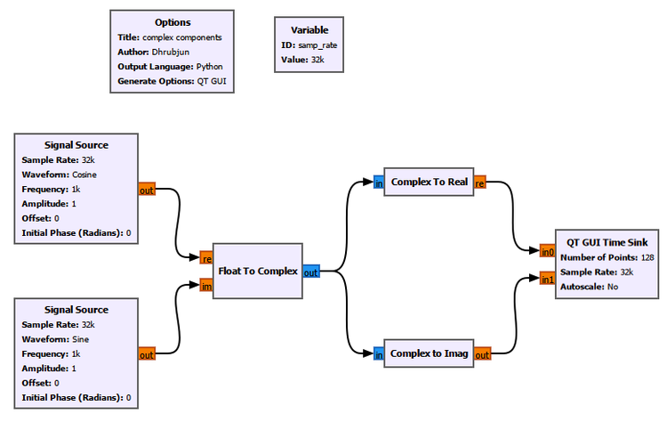

**Figure 4.2: Building a complex signal from two float streams and separating it back into its real and imaginary components.**

Run the flowgraph.

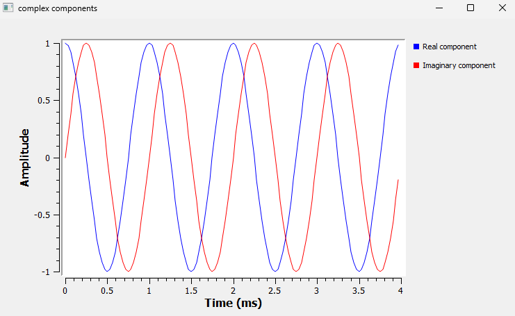

**Figure 4.3: Real and imaginary components recovered from the complex signal.**

The blue waveform is the real component:

$$\mathrm{Re}\{z(t)\}=\cos(2\pi ft)$$

while the red waveform is the imaginary component:

$$\mathrm{Im}\{z(t)\}=\sin(2\pi ft)$$

Notice that combining the two signals did not destroy either of them.

Both pieces of information are contained inside one complex stream.

That is the first important idea of this chapter.

---

## 4.11 Experiment 2: What Does the Complex Signal Look Like?

We have created

$$z(t)=\cos(2\pi ft)+j\sin(2\pi ft)$$

But what does that signal look like on the complex plane?

Instead of building another flowgraph, let's extend the one we already have.

Add one new block:

**QT GUI Constellation Sink**

Connect it directly to the complex output of `Float to Complex`.

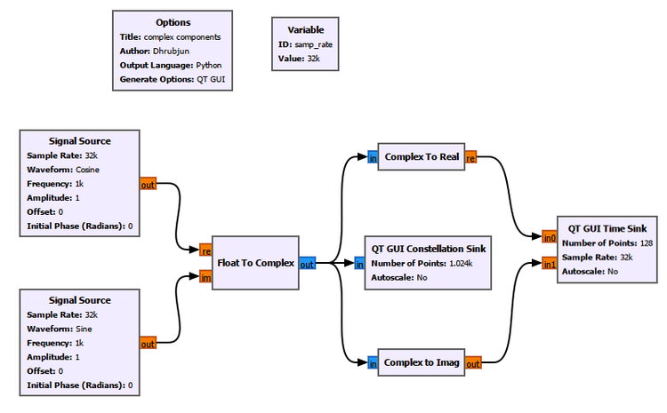

**Figure 4.4: Extending the previous flowgraph with a QT GUI Constellation Sink.**

This is exactly how we will continue using GNU Radio throughout the book: **start simple, understand the result, and then add one new idea at a time.**

---

## 4.12 GNU Radio Toolbox: QT GUI Constellation Sink

The QT GUI Constellation Sink displays complex samples on a two-dimensional plane.

For a complex sample

$$z=a+jb$$

the horizontal coordinate comes from \(a\), while the vertical coordinate comes from \(b\).

GNU Radio labels these axes **In-phase** and **Quadrature**.

You may already be wondering why.

For now, think of them simply as the real and imaginary axes.

We will return to the names **In-phase** and **Quadrature** in the next chapter.

Run the flowgraph.

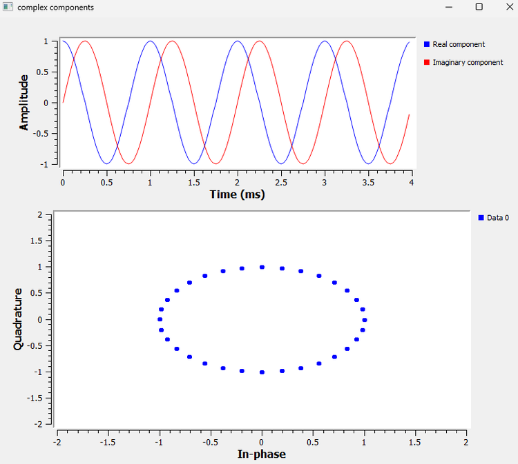

**Figure 4.5: The real and imaginary components in time and the corresponding samples on the complex plane.**

Something interesting appears.

The samples form a circle.

Why?

We have

$$a=\cos\theta$$

and

$$b=\sin\theta$$

Therefore,

$$a^2+b^2=\cos^2\theta+\sin^2\theta=1$$

So every point is exactly one unit away from the origin.

That is why GNU Radio shows a **unit circle**.

The two sinusoidal waveforms and the circle are not separate signals.

They are different ways of looking at the **same complex signal**.

---

## 4.13 Experiment 3: Magnitude and Phase

We can now extend the same flowgraph again.

This time add:

- `Complex to Mag`
- `Complex to Arg`

Connect both directly to the output of `Float to Complex`.

Display their outputs using another QT GUI Time Sink.

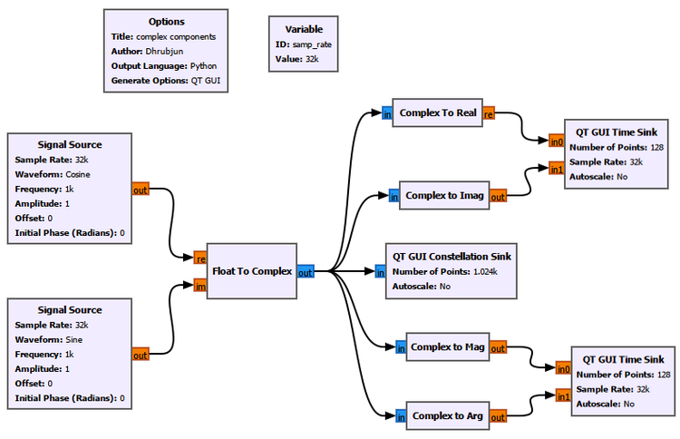

**Figure 4.6: The complex-signal flowgraph extended with magnitude and phase measurements.**

---

## 4.14 GNU Radio Toolbox: Complex to Mag and Complex to Arg

### Complex to Mag

For each complex sample

$$z=a+jb$$

`Complex to Mag` calculates

$$|z|=\sqrt{a^2+b^2}$$

### Complex to Arg

`Complex to Arg` calculates the phase:

$$\theta=\mathrm{atan2}(b,a)$$

Its output is expressed in **radians**.

Now run the flowgraph.

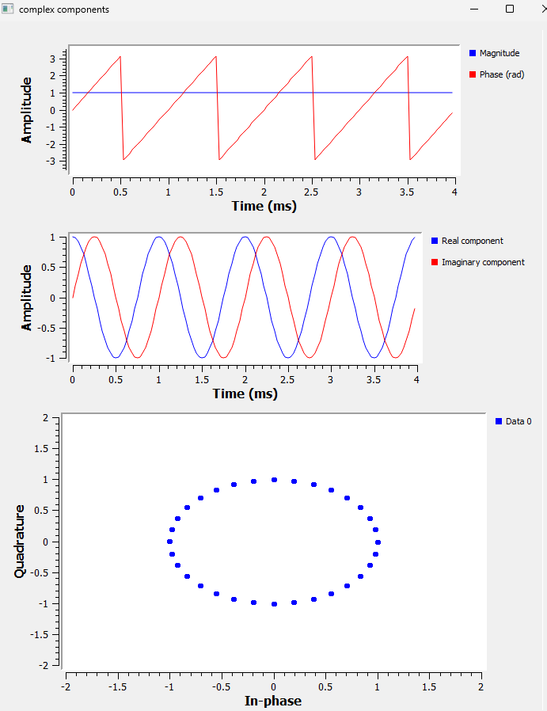

**Figure 4.7: Three different views of the same complex signal: magnitude and phase, real and imaginary components, and the complex plane.**

This figure brings almost everything we have learned together.

---

## 4.15 One Signal, Three Views

Look first at the middle plot.

We still have:

$$\mathrm{Re}\{z(t)\}=\cos(2\pi ft)$$

and

$$\mathrm{Im}\{z(t)\}=\sin(2\pi ft)$$

Now look at the constellation.

The samples form a unit circle.

Finally, look at the magnitude.

It remains at:

$$|z|=1$$

That is exactly what we predicted:

$$|z|=\sqrt{\cos^2\theta+\sin^2\theta}=1$$

Meanwhile, the phase continuously changes.

These are not three different signals.

> **They are three different views of the same complex signal.**

We can describe the signal using real and imaginary components:

$$(a,b)$$

or using magnitude and phase:

$$(|z|,\theta)$$

---

## 4.16 Why Does the Phase Look Like a Sawtooth?

The phase plot contains something that may initially look strange.

The phase increases until it reaches approximately

$$+\pi$$

then suddenly jumps to

$$-\pi$$

It then starts increasing again.

Did the complex vector suddenly jump backwards?

No.

The vector continues rotating smoothly.

The `Complex to Arg` block reports phase within a principal interval around

$$-\pi \leq \theta \leq \pi$$

So once the angle passes the positive boundary, its displayed representation wraps around to the negative boundary.

This is called **phase wrapping**.

For our 1 kHz signal,

$$T=\frac{1}{1000}=1\text{ ms}$$

Look at the phase plot again.

One complete phase cycle occurs every approximately 1 ms.

The time-domain waveform, the phase plot, and the rotating-vector interpretation all agree.

---

## 4.17 Now Let's Break the Flowgraph

So far everything has been carefully arranged:

- cosine amplitude = 1
- sine amplitude = 1
- same frequency
- correct relationship between the components

That produced a beautiful unit circle.

But is a circle something that every complex signal produces?

Let's find out.

Instead of adding more blocks, we will deliberately change the signal we already built.

---

## 4.18 Break It 1: Make the Imaginary Component Smaller

Keep the cosine amplitude at 1.

Change the sine amplitude from

$$1$$

to

$$0.5$$

Our complex signal becomes

$$z(t)=\cos(2\pi ft)+j0.5\sin(2\pi ft)$$

Run the flowgraph again.

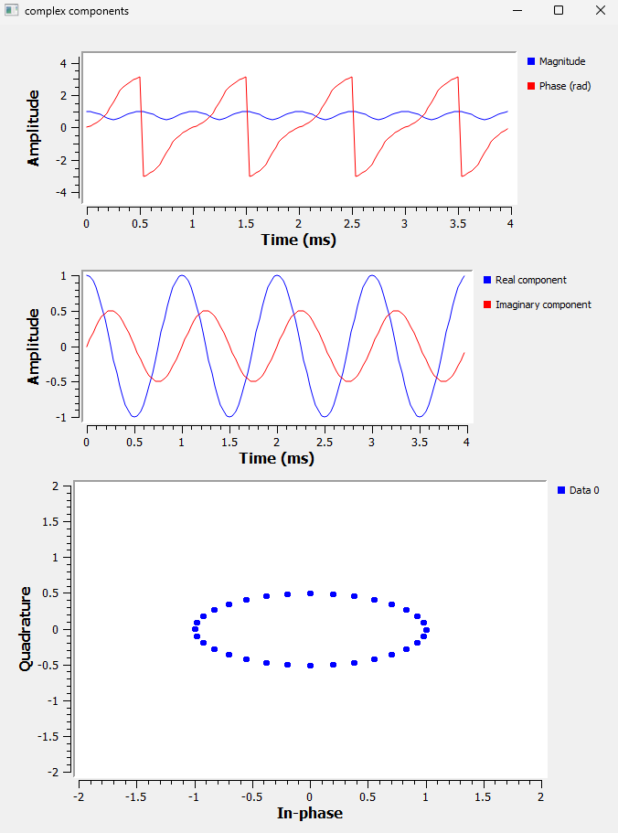

**Figure 4.8: Reducing the imaginary component from 1 to 0.5 changes the unit circle into an ellipse.**

The middle plot immediately shows what changed.

The real component still varies between approximately

$$-1\text{ and }+1$$

but the imaginary component varies only between

$$-0.5\text{ and }+0.5$$

Now look at the constellation.

The circle has become an **ellipse**.

We have

$$a=\cos\theta$$

and

$$b=0.5\sin\theta$$

Therefore,

$$a^2+\frac{b^2}{(0.5)^2}=1$$

which is the equation of an ellipse.

There is another important change.

The magnitude is no longer constant.

Now,

$$|z|=\sqrt{\cos^2\theta+0.25\sin^2\theta}$$

Depending on the angle, the magnitude varies between approximately 0.5 and 1.

So we have discovered something important:

> The circle was not produced simply because the signal was complex. It appeared because the real and imaginary components had the particular amplitudes and relationship required for constant magnitude.

---

## 4.19 Break It 2: Remove the Imaginary Component

Now let's go further.

Change the sine amplitude to:

$$0$$

Our signal becomes

$$z(t)=\cos(2\pi ft)+j0$$

Run the flowgraph.

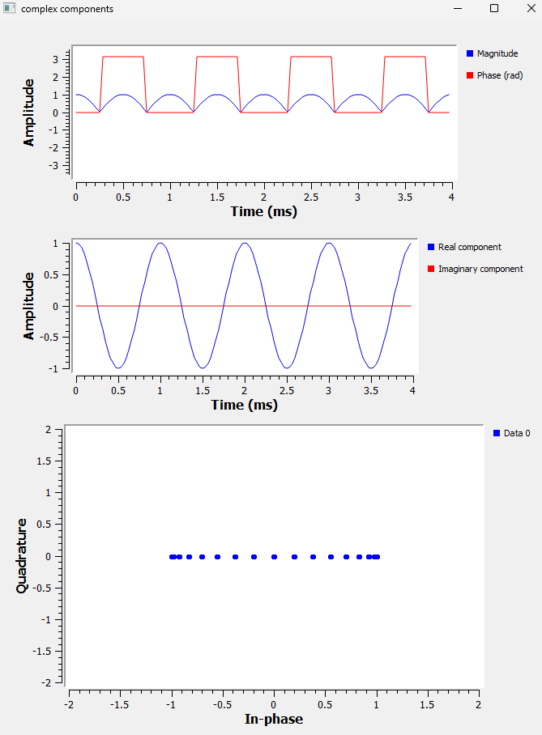

**Figure 4.9: Removing the imaginary component collapses the complex-plane trajectory onto the real axis.**

The imaginary waveform has disappeared.

Every sample now has the form

$$(a,0)$$

There is no vertical component.

So the constellation collapses onto the horizontal axis.

In other words, we have returned to a purely real signal.

This connects directly back to the signals we used in Chapter 3.

---

## 4.20 What Happened to the Magnitude?

The result at the top is also interesting.

Since

$$z(t)=\cos(2\pi ft)+j0$$

the magnitude is

$$|z|=\sqrt{\cos^2(2\pi ft)}$$

and therefore

$$|z|=|\cos(2\pi ft)|$$

That is why the magnitude looks like a rectified cosine.

Notice something important:

> **Magnitude is never negative.**

The original real waveform can have negative values.

Magnitude cannot.

---

## 4.21 Why Is the Phase Now Either 0 or π?

Look at the phase trace.

When the cosine is positive, the complex point lies on the positive real axis.

Its phase is

$$0$$

When the cosine is negative, the point lies on the negative real axis.

Its phase is

$$\pi$$

or equivalently \(-\pi\), depending on the representation used at the boundary.

So even this strange-looking phase plot has a simple geometric explanation.

The complex plane is helping us understand what GNU Radio is displaying.

---

## 4.22 Break It 3: Reverse the Imaginary Component

So far, we have changed the size of the imaginary component and even removed it completely.

Now let's try something different.

Restore the sine amplitude to 1, but then reverse its sign:

```text
Sine amplitude: -1
```

The real component remains

$$
\cos(2\pi ft)
$$

but the imaginary component becomes

$$
-\sin(2\pi ft)
$$

So our complex signal is now

$$
z(t)=\cos(2\pi ft)-j\sin(2\pi ft)
$$

Using Euler's formula,

$$
z(t)=e^{-j2\pi ft}
$$

Compare this with the signal we originally created:

$$
z(t)=\cos(2\pi ft)+j\sin(2\pi ft)
$$

or

$$
z(t)=e^{+j2\pi ft}
$$

Only one sign has changed.

But that small change has an important consequence.

Run the flowgraph again.

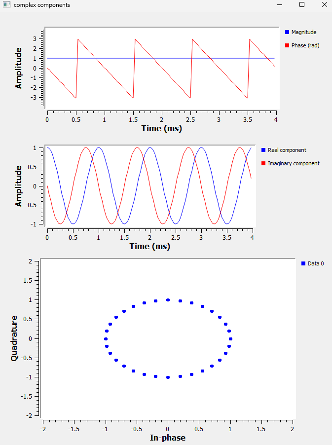

**Figure 4.10: Reversing the imaginary component leaves the magnitude and circular trajectory unchanged, but reverses the direction of phase evolution.**

The magnitude is still

$$
|z|=1
$$

and the constellation still forms a circle.

So if we looked only at the constellation, the two signals might appear to be identical.

But look at the phase.

For the original signal, the phase increased with time.

After reversing the imaginary component, the phase decreases with time.

Something has clearly changed.

---

## 4.23 Positive and Negative Frequency

We just discovered something interesting.

Our original complex signal was

$$
z(t)=\cos(2\pi ft)+j\sin(2\pi ft)
$$

which, using Euler's formula, can be written as

$$
z(t)=e^{j2\pi ft}
$$

Its phase increased with time.

When we reversed the imaginary component, the signal became

$$
z(t)=\cos(2\pi ft)-j\sin(2\pi ft)
$$

or

$$
z(t)=e^{-j2\pi ft}
$$

and its phase decreased with time.

So what does the positive or negative sign actually mean?

For

$$
e^{j2\pi ft}
$$

the phase is

$$
\theta(t)=2\pi ft
$$

As time increases, the phase increases.

For

$$
e^{-j2\pi ft}
$$

the phase is

$$
\theta(t)=-2\pi ft
$$

As time increases, the phase decreases.

The two signals therefore rotate around the complex plane in opposite directions.

This gives us a useful interpretation:

> **The magnitude of the frequency tells us how fast the complex vector rotates. The sign tells us the direction of rotation.**

For example,

$$
e^{j2\pi(1000)t}
$$

and

$$
e^{-j2\pi(1000)t}
$$

both have a frequency magnitude of 1 kHz.

They rotate at the same rate, but in opposite directions.

So negative frequency does **not** mean that a signal somehow performs a negative number of oscillations per second.

For a complex signal, it represents the opposite direction of phase rotation.

We have already seen this difference in the phase plot.

Now let's see whether we can observe the same thing in the frequency domain.

### Seeing It in GNU Radio

We already used the **QT GUI Frequency Sink** in Chapter 3, so there is no need to introduce the block again.

This time, however, we are going to feed it a **complex signal** instead of using it only to examine the real signals from the previous chapter.

Add a QT GUI Frequency Sink directly to the output of `Float to Complex`.

Use:

```text
FFT Size:         1024
Center Frequency: 0
Bandwidth:        samp_rate
```

For this experiment, we do not need the Constellation Sink. We have already used it to understand the complex plane.

Our focus now is on the relationship between **phase direction and frequency sign**.

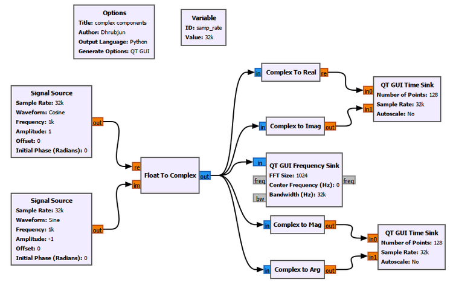

**Figure 4.11: GNU Radio flowgraph used to observe positive and negative complex frequencies.**

We will run this flowgraph twice.

Only one parameter will change.

---

### Case 1: Positive Frequency

First, use:

```text
Cosine amplitude: 1
Sine amplitude:   1
Frequency:        1 kHz
Sample rate:      32 kS/s
```

The resulting complex signal is

$$
z(t)=\cos(2\pi ft)+j\sin(2\pi ft)
$$

or

$$
z(t)=e^{j2\pi ft}
$$

For our 1 kHz example,

$$
z(t)=e^{j2\pi(1000)t}
$$

Run the flowgraph.

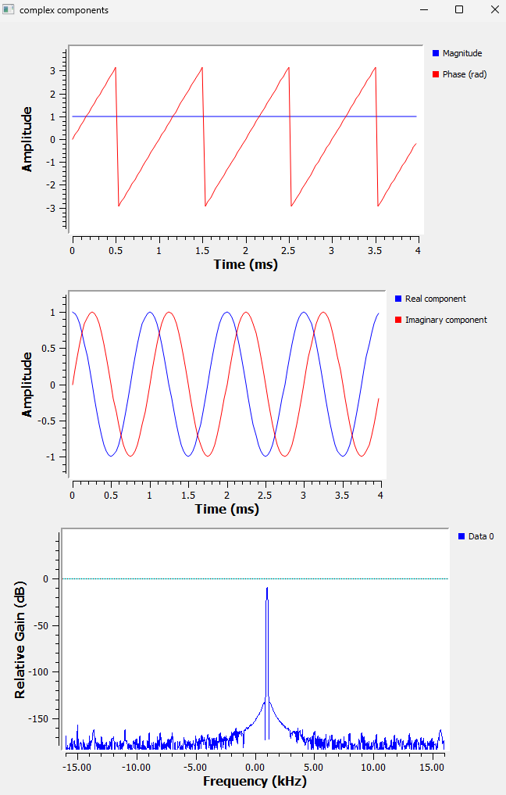

**Figure 4.12: A positive 1 kHz complex frequency. The phase increases with time and the Frequency Sink shows a peak at +1 kHz.**

Look at the displays carefully.

The magnitude remains constant at

$$
|z(t)|=1
$$

The real component is

$$
\cos(2\pi ft)
$$

and the imaginary component is

$$
\sin(2\pi ft)
$$

The phase increases with time.

When it reaches approximately +π, the displayed phase wraps back to -π and continues increasing.

Now look at the Frequency Sink.

The spectral peak appears at

$$
\boxed{+1\text{ kHz}}
$$

So we have

$$
e^{j2\pi(1000)t}
\quad\longrightarrow\quad
+1\text{ kHz}
$$

---

### Case 2: Negative Frequency

Now change only one parameter.

Change the sine amplitude from

```text
+1
```

to

```text
-1
```

Keep everything else exactly the same.

The signal becomes

$$
z(t)=\cos(2\pi ft)-j\sin(2\pi ft)
$$

or

$$
z(t)=e^{-j2\pi ft}
$$

For our 1 kHz example,

$$
z(t)=e^{-j2\pi(1000)t}
$$

Run the flowgraph again.

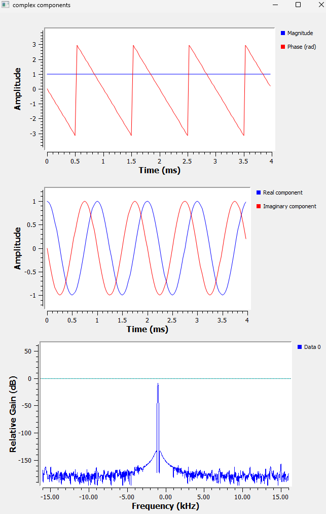

**Figure 4.13: A negative 1 kHz complex frequency. The phase decreases with time and the Frequency Sink shows a peak at -1 kHz.**

The magnitude is still

$$
|z(t)|=1
$$

and the real component has not changed.

But the imaginary component has been inverted.

The phase now decreases with time.

And something very clear happens in the Frequency Sink.

The peak moves from

$$
+1\text{ kHz}
$$

to

$$
-1\text{ kHz}
$$

So the same idea is visible in two different ways:

| Complex signal | Phase evolution | Frequency Sink |
|---|---|---|
| $e^{j2\pi ft}$ | Increasing | $+f$ |
| $e^{-j2\pi ft}$ | Decreasing | $-f$ |

For our experiment:

| Complex signal | Observed frequency |
|---|---:|
| $e^{j2\pi(1000)t}$ | +1 kHz |
| $e^{-j2\pi(1000)t}$ | -1 kHz |

Now negative frequency should feel much less mysterious.

> **Positive and negative complex frequencies represent opposite directions of phase rotation.**

The magnitude of the frequency tells us the rotation rate.

The sign tells us the direction.

---

## 4.24 Why Did a Real Cosine Have Two Frequency Peaks?

We can now return to the question that originally brought us to complex numbers.

In Chapter 3, when we generated a real cosine, the Frequency Sink showed two peaks:

$$
+f
$$

and

$$
-f
$$

Why does one real cosine produce both?

Euler's formula gives us

$$
e^{j\theta}=\cos\theta+j\sin\theta
$$

If we reverse the sign of the angle,

$$
e^{-j\theta}=\cos\theta-j\sin\theta
$$

Now add the two equations:

$$
e^{j\theta}+e^{-j\theta}=2\cos\theta
$$

Therefore,

$$
\cos\theta=
\frac{1}{2}e^{j\theta}
+
\frac{1}{2}e^{-j\theta}
$$

Now replace θ with $2\pi ft$:

$$
\boxed{
\cos(2\pi ft)
=
\frac{1}{2}e^{j2\pi ft}
+
\frac{1}{2}e^{-j2\pi ft}
}
$$

This equation explains the two peaks.

A real cosine can be represented as the combination of two complex rotations:

- one at +f
- one at -f

For example, a real 1 kHz cosine contains spectral components at

$$
+1\text{ kHz}
$$

and

$$
-1\text{ kHz}
$$

This is exactly what we observed in the Frequency Sink in Chapter 3.

The negative-frequency component is not another physical tone hiding inside the signal.

It appears because a real cosine can be represented mathematically as two complex exponentials rotating in opposite directions.

### Real Versus Complex Sinusoids

Now compare the real cosine with the complex signals we just generated.

A real cosine is

$$
x(t)=\cos(2\pi ft)
$$

and can be written as

$$
x(t)=
\frac{1}{2}e^{j2\pi ft}
+
\frac{1}{2}e^{-j2\pi ft}
$$

So its spectrum contains both

$$
+f
$$

and

$$
-f
$$

But the complex signal

$$
z(t)=\cos(2\pi ft)+j\sin(2\pi ft)
$$

is simply

$$
e^{j2\pi ft}
$$

so it contains only the positive-frequency component.

Similarly,

$$
z(t)=\cos(2\pi ft)-j\sin(2\pi ft)
$$

is

$$
e^{-j2\pi ft}
$$

so it contains only the negative-frequency component.

We can summarize what we have discovered:

| Signal | Frequency components |
|---|---|
| $\cos(2\pi ft)$ | $-f$ and $+f$ |
| $\cos(2\pi ft)+j\sin(2\pi ft)$ | $+f$ |
| $\cos(2\pi ft)-j\sin(2\pi ft)$ | $-f$ |

This reveals an important difference between real and complex signals:

> **A complex signal can distinguish positive-frequency rotation from negative-frequency rotation.**

A real cosine contains both rotations together.

This ability to preserve the distinction between positive and negative frequency is one of the reasons complex signals are so useful in SDR.

And it brings us much closer to understanding why SDR systems use two components called **I** and **Q**.

---

## 4.25 A Useful GNU Radio Habit: Watch Your Data Types

Before finishing the chapter, there is one practical GNU Radio habit worth reinforcing.

As our flowgraphs become larger, one of the easiest mistakes to make is connecting incompatible data types.

A block expecting a float stream cannot necessarily accept a complex stream.

Similarly, a complex stream contains two components, while a float stream contains only one real value per sample.

In this chapter, for example:

- `Float to Complex` takes two float streams and produces a complex stream.
- `Complex to Real` takes a complex stream and produces a float stream.
- `Complex to Imag` takes a complex stream and produces a float stream.
- `Complex to Mag` takes a complex stream and produces a float stream.
- `Complex to Arg` takes a complex stream and produces a float stream.

When a connection refuses to work, check:

1. the output data type of the first block,
2. the input data type expected by the second block,
3. the port colours.

As our GNU Radio experiments become more complicated, this simple habit will save us a lot of confusion.

---

## 4.26 Try It Yourself

Before moving to the next chapter, experiment with the flowgraph yourself.

But there is one rule:

> **Predict what will happen before pressing Run.**

The prediction is often more valuable than the experiment itself.

### Try 1: Increase the Imaginary Amplitude

Set the imaginary amplitude to

$$
2
$$

What shape do you expect in the constellation?

Will the magnitude remain constant?

---

### Try 2: Swap the Inputs

Connect the sine to the real input and the cosine to the imaginary input.

What do you expect to happen to the phase?

Will the direction of rotation remain the same?

---

### Try 3: Change the Frequency

Change both Signal Sources from 1 kHz to 2 kHz.

Before running the flowgraph, predict:

- Will the radius of the constellation change?
- Will the phase change faster or slower?
- Where should the peak appear in the Frequency Sink?

Then run it and check your prediction.

---

### Try 4: Switch Between Positive and Negative Frequency

Switch the imaginary amplitude between

```text
+1
```

and

```text
-1
```

Before running the flowgraph each time, predict:

- Will the phase increase or decrease?
- Will the Frequency Sink show +f or -f?

See if you can predict the result without looking back at the chapter.

---

### Try 5: Use Different Frequencies

Keep the real component at 1 kHz.

Change the imaginary component to another frequency.

Before running it, ask yourself:

> Will the constellation still form a circle?

Then observe what happens.

The result may look very different from the simple shapes we have seen so far.

---

## 4.27 What We Learned

We started this chapter with a mathematical expression:

$$
z=a+jb
$$

At first, it may have looked like an abstract way of combining a real number with an "imaginary" one.

But after building complex signals in GNU Radio, the idea should now feel much more concrete.

A complex sample contains two components:

$$
z=a+jb
$$

The same complex number can also be described using its magnitude and phase.

Magnitude tells us how far the point is from the origin.

Phase tells us its direction.

Euler's formula connects these two ways of thinking:

$$
e^{j\theta}=\cos\theta+j\sin\theta
$$

When θ changes with time, the complex number can be visualized as a rotating vector.

We saw this directly in GNU Radio.

Starting with

$$
\cos\theta+j\sin\theta
$$

we obtained a unit circle, constant magnitude, and changing phase.

When we reduced the imaginary component, the circle became an ellipse.

When we removed the imaginary component completely, the trajectory collapsed onto the real axis.

When we reversed the imaginary component, something even more interesting happened.

The magnitude remained the same, but the direction of phase evolution reversed.

The Frequency Sink then showed us what that means:

$$
e^{j2\pi ft}
\rightarrow
+f
$$

while

$$
e^{-j2\pi ft}
\rightarrow
-f
$$

This gave us a useful interpretation of positive and negative complex frequency:

> **The magnitude tells us how fast the complex vector rotates, while the sign tells us the direction of rotation.**

Finally, we returned to the real cosine from Chapter 3.

We found that

$$
\cos(2\pi ft)
=
\frac{1}{2}e^{j2\pi ft}
+
\frac{1}{2}e^{-j2\pi ft}
$$

which explains why a real cosine produces two frequency peaks, one at +f and another at -f.

A real cosine contains both complex rotations together.

A complex sinusoid can distinguish between them.

That distinction is extremely important in SDR.

---

## 4.28 Where We Go Next

There is one detail we have deliberately avoided explaining fully.

Look again at the GNU Radio Constellation Sink.

GNU Radio does not label its axes **Real** and **Imaginary**.

Instead, it calls them:

**In-phase**

and

**Quadrature**.

Why?

Why does SDR use the names **I** and **Q**?

Why are the two components 90° apart?

And why does an SDR receiver need both of them?

The real and imaginary components we have been working with are about to receive their radio names:

$$
x[n]=I[n]+jQ[n]
$$

In the next chapter, we will find out what **I and Q signals** actually mean, how an SDR produces them, and why they allow us to preserve information that a single real waveform cannot.