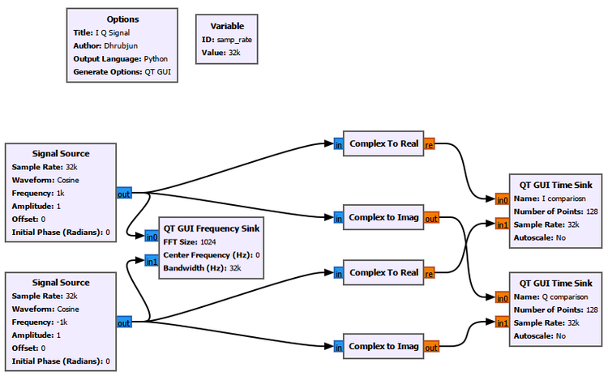
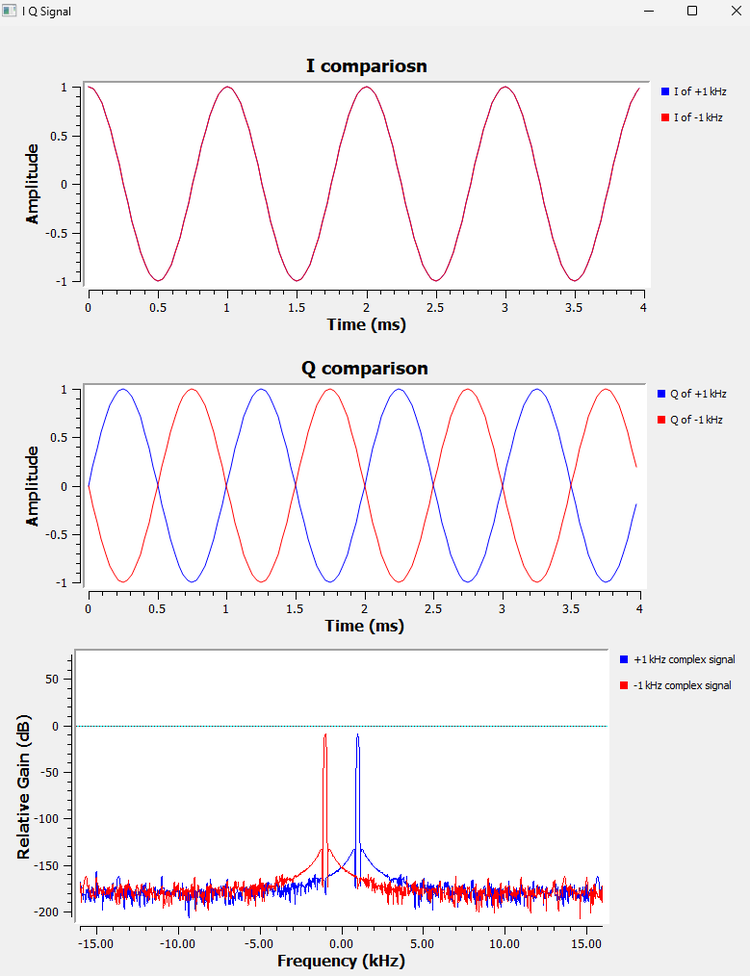
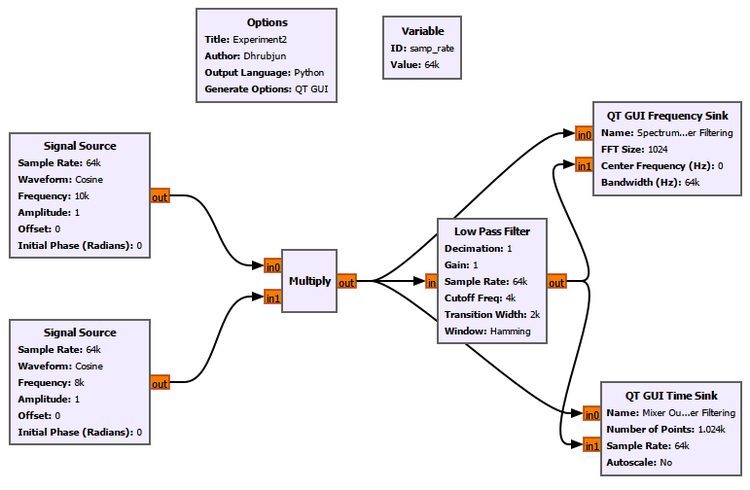
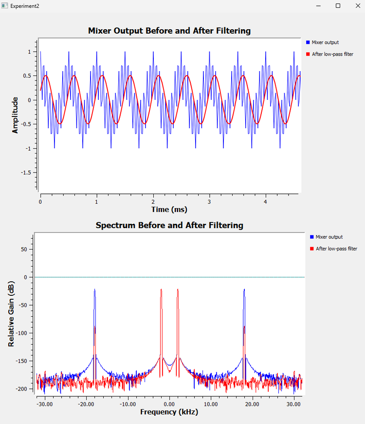
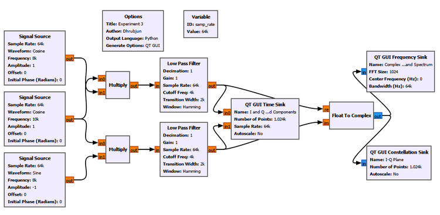
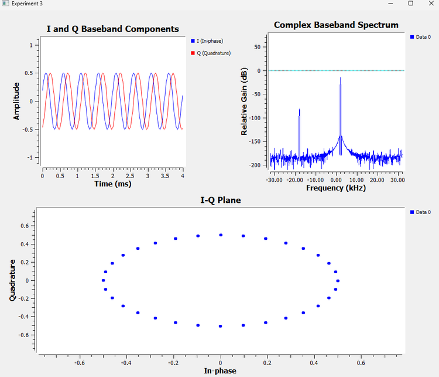
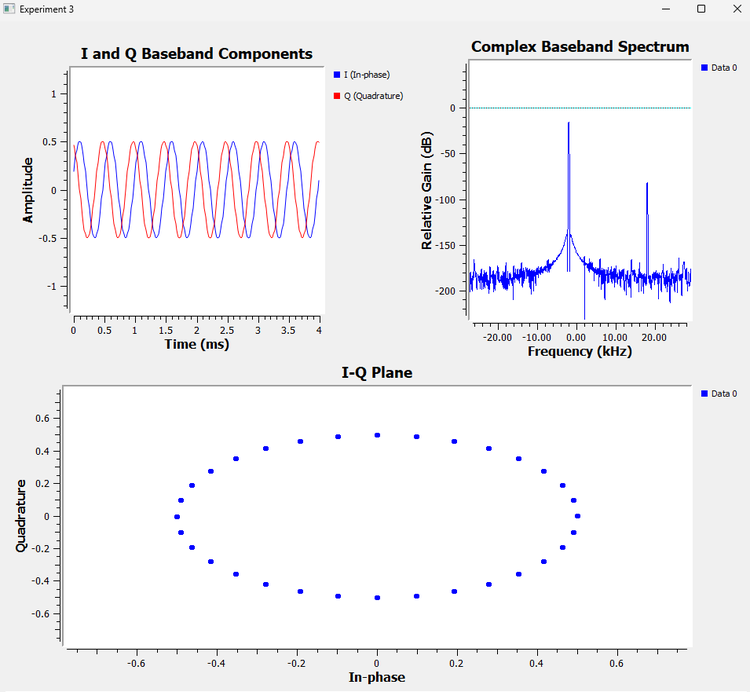

# Chapter 5: I and Q Signals

In the previous chapter, we introduced complex numbers and saw that a

complex signal can be written as

$$
z(t)=I(t)+jQ(t).
$$

We also saw that a complex signal can be thought of as a vector rotating

in the complex plane.

That raised an important question:

> Why does an SDR actually need two components, I and Q, to represent a signal?

Why not just use one ordinary waveform?

In this chapter, we will answer that question experimentally.

We will start by comparing positive and negative complex frequencies.

Then we will introduce mixing and frequency translation. Finally, we

will build a simple I/Q downconverter in GNU Radio and see how a real

signal can be converted into complex baseband.

---

## 5.1 What Are I and Q?

In SDR, a complex sample is normally written as

$$
x(t)=I(t)+jQ(t).
$$

Here:

-   $I(t)$ is the ****in-phase component****

-   $Q(t)$ is the ****quadrature component****

Mathematically, these are simply the real and imaginary parts of the

complex signal:

$$
I(t)=\operatorname{Re}\\{x(t)\\}
$$

and

$$
Q(t)=\operatorname{Im}\\{x(t)\\}.
$$

So the terms ****real and imaginary**** from Chapter 4 now receive their

radio names:

$$
\text{Real} \rightarrow I
$$

$$
\text{Imaginary} \rightarrow Q.
$$

The important point is that I and Q are not two unrelated signals.

Together, they describe ****one signal****.

---

## 5.2 Why Is It Called Quadrature?

Consider the complex exponential

$$
e^{j\theta}=\cos(\theta)+j\sin(\theta).
$$

If

$$
\theta=2\pi ft,
$$

then

$$
e^{j2\pi ft}=\cos(2\pi ft)+j\sin(2\pi ft).
$$

We can therefore identify

$$
I(t)=\cos(2\pi ft)
$$

and

$$
Q(t)=\sin(2\pi ft).
$$

Cosine and sine are separated by $90^\circ$. This $90^\circ$

relationship is called ****quadrature****. That is where the name Q comes

from.

---

## 5.3 I and Q Describe a Rotating Vector

Suppose

$$
I(t)=\cos(2\pi ft)
$$

and

$$
Q(t)=\sin(2\pi ft).
$$

Then

$$
x(t)=I(t)+jQ(t)
$$

becomes

$$
x(t)=\cos(2\pi ft)+j\sin(2\pi ft).
$$

Using Euler's formula,

$$
x(t)=e^{j2\pi ft}.
$$

As time increases, this complex number moves around the complex plane.

The I component tells us the horizontal position. The Q component tells

us the vertical position. Together, they tell us exactly where the

rotating vector is.

This gives us our first clue about why SDRs keep both components.

---

## Experiment 1: Why Do We Need Both I and Q?

Let us begin with a simple question.

Suppose we have two complex signals:

$$
x_+(t)=e^{j2\pi ft}
$$

and

$$
x_-(t)=e^{-j2\pi ft}.
$$

One represents positive frequency and the other represents negative

frequency.

Can we tell them apart using only the real component?

---

## 5.4 Expanding the Two Signals

For the positive-frequency signal,

$$
x_+(t)=\cos(2\pi ft)+j\sin(2\pi ft).
$$

Therefore,

$$
I_+(t)=\cos(2\pi ft)
$$

and

$$
Q_+(t)=\sin(2\pi ft).
$$

Now consider the negative-frequency signal:

$$
x_-(t)=\cos(-2\pi ft)+j\sin(-2\pi ft).
$$

Remember that cosine is an even function:

$$
\cos(-\theta)=\cos(\theta).
$$

But sine is an odd function:

$$
\sin(-\theta)=-\sin(\theta).
$$

Therefore,

$$
x_-(t)=\cos(2\pi ft)-j\sin(2\pi ft).
$$

So,

$$
I_-(t)=\cos(2\pi ft)
$$

but

$$
Q_-(t)=-\sin(2\pi ft).
$$

This gives us something very interesting:

$$
\boxed{I_+(t)=I_-(t)}
$$

while

$$
\boxed{Q_+(t)=-Q_-(t)}.
$$

The I component alone cannot distinguish the two signals. The Q

component contains the missing information.

Let us see this directly in GNU Radio.

---

## 5.5 Building the Experiment in GNU Radio

We generate two complex signals:

-   $+1$ kHz

-   $-1$ kHz

Each complex signal is separated into its real and imaginary components

using ****Complex to Real**** and ****Complex to Imag****.

The corresponding I components are compared in one Time Sink, while the

Q components are compared in another.

Both original complex signals are also connected to a Frequency Sink.



Figure 5.1: GNU Radio flowgraph for comparing positive and negative

complex frequencies.

---

## 5.6 What Do We Observe?



Figure 5.2: Comparison of the I and Q components of +1 kHz and -1 kHz

complex signals.

Look first at the ****I comparison****.

The two waveforms lie directly on top of each other. That means

$$
I_{+1\text{ kHz}}(t)=I_{-1\text{ kHz}}(t).
$$

If we had kept only I, there would be no way to determine which signal

was +1 kHz and which was -1 kHz.

Now look at the ****Q comparison****. The two Q waveforms have opposite

signs:

$$
Q_{-1\text{ kHz}}(t)=-Q_{+1\text{ kHz}}(t).
$$

Finally, the Frequency Sink clearly separates the two complex signals at

$+1$ kHz and $-1$ kHz.

This is our first major result:

> **I alone cannot preserve the sign of complex frequency. I and Q together can.**

---

## 5.7 What Does the Frequency Sign Really Tell Us?

Positive and negative complex frequencies correspond to opposite

directions of rotation in the complex plane.

For

$$
e^{j2\pi ft},
$$

the phase increases with time.

For

$$
e^{-j2\pi ft},
$$

the phase decreases with time.

So the frequency sign contains information about the **direction of

complex rotation**.

This is something that cannot be recovered from the cosine component

alone.

That is one of the fundamental reasons I/Q representation is so useful

in SDR.

But another question now appears:

> Where do I and Q actually come from inside a receiver?

To answer that, we first need to understand ****mixing****.

---

## Experiment 2: Mixing and Frequency Translation

Suppose our receiver contains a signal at

$$
f_{RF}=10\text{ kHz}.
$$

We would like to move this signal to a lower frequency so that it is

easier to process.

To do that, we can multiply it by another signal generated inside the

receiver. This second signal is called the ****local oscillator****, or LO.

Let

$$
f_{LO}=8\text{ kHz}.
$$

---

## 5.8 What Is a Mixer?

A mixer performs multiplication.

For our simplified example,

$$
x_{RF}(t)=\cos(2\pi f_{RF}t)
$$

and

$$
x_{LO}(t)=\cos(2\pi f_{LO}t).
$$

The mixer output is

$$
y(t)=x_{RF}(t)x_{LO}(t).
$$

Therefore,

$$
y(t)=\cos(2\pi f_{RF}t)\cos(2\pi f_{LO}t).
$$

Using the identity

$$
\cos A\cos B=\frac{1}{2}\left[\cos(A-B)+\cos(A+B)\right],
$$

we obtain

$$
y(t)= \frac{1}{2}\cos\left(2\pi(f_{RF}-f_{LO})t\right) \+ \frac{1}{2}\cos\left(2\pi(f_{RF}+f_{LO})t\right).
$$

Substituting our frequencies:

$$
f_{\text{difference}}=10-8=2\text{ kHz}
$$

and

$$
f_{\text{sum}}=10+8=18\text{ kHz}.
$$

So multiplication does not simply subtract two frequencies. It produces

****both the sum and the difference****.

---

## 5.9 Why We Use a 64 kS/s Sample Rate Here

In earlier experiments, we often used

$$
f_s=32\text{ kS/s}.
$$

The corresponding Nyquist frequency is

$$
f_N=\frac{f_s}{2}=16\text{ kHz}.
$$

But our mixer produces an 18 kHz component.

Since

$$
18\text{ kHz}>16\text{ kHz},
$$

that component would lie above Nyquist and would alias.

For this experiment, we therefore increase the sample rate to

$$
\boxed{f_s=64\text{ kS/s}}.
$$

Now,

$$
f_N=32\text{ kHz},
$$

so both the 2 kHz and 18 kHz mixer products can be represented

correctly.

This is a useful connection back to our discussion of sampling and

aliasing.

---

## 5.10 Building the Mixer

The GNU Radio flowgraph is shown below.



Figure 5.3: GNU Radio flowgraph for frequency mixing and low-pass

filtering.

The 10 kHz signal and the 8 kHz local oscillator are connected to a

****Multiply**** block.

The mixer output is then sent through a Low Pass Filter.

We observe the signal both before and after filtering.

---

## 5.11 GNU Radio Toolbox: Multiply

The ****Multiply**** block multiplies corresponding input samples.

If its inputs are

$$
x_1[n]
$$

and

$$
x_2[n],
$$

then its output is

$$
y[n]=x_1[n]x_2[n].
$$

At first this may look like a simple mathematical operation. But

multiplication becomes extremely important in radio because multiplying

sinusoids creates new frequency components.

This is the basic principle behind frequency mixing.

In this experiment, the Multiply block is acting as our simplified

****mixer****.

---

## 5.12 Before Filtering

Before filtering, the mixer contains two frequency components:

$$
2\text{ kHz}
$$

and

$$
18\text{ kHz}.
$$

Because the mixer output is real-valued, each component also has its

corresponding negative-frequency component.

Therefore the spectrum contains peaks at approximately

$$
-18,\ -2,\ +2,\ +18\text{ kHz}.
$$

In the time domain, these two sinusoids are added together. That is why

the mixer output does not look like a simple sinusoid.

---

## 5.13 Why Do We Need a Low-Pass Filter?

We are interested in the difference-frequency component:

$$
2\text{ kHz}.
$$

The 18 kHz component is unwanted.

So we place a Low Pass Filter after the mixer.

For our experiment, the filter uses approximately:

| Parameter | Value |
|---|---:|
| Sample Rate | 64 kS/s |
| Cutoff Frequency | 4 kHz |
| Transition Width | 2 kHz |
| Gain | 1 |
| Decimation | 1 |
| Window | Hamming |

The 2 kHz signal lies inside the passband.

The 18 kHz signal lies far outside it.

Therefore, the filter keeps the desired low-frequency component and

strongly suppresses the unwanted high-frequency component.

---

## 5.14 Before and After Filtering



Figure 5.4: Mixer output before and after low-pass filtering in the

time and frequency domains.

The time-domain plot makes the change easy to see.

Before filtering, the waveform contains both the 2 kHz and 18 kHz

components.

After filtering, it becomes approximately a clean 2 kHz sinusoid.

The Frequency Sink tells the same story more directly.

Before filtering, components at approximately

$$
\pm2\text{ kHz} \quad\text{and}\quad \pm18\text{ kHz}
$$

are present.

After filtering, the dominant remaining components are

$$
\pm2\text{ kHz}.
$$

The filtered sinusoid has an amplitude of approximately $0.5$.

This is not an error. Remember that

$$
\cos A\cos B=\frac{1}{2}[\cos(A-B)+\cos(A+B)].
$$

The factor $1/2$ appears naturally during mixing.

---

## 5.15 What Have We Actually Done?

We started with a signal at 10 kHz.

We mixed it with an 8 kHz oscillator.

The mixer produced 2 kHz and 18 kHz.

Then the low-pass filter removed the high-frequency component.

So the final result was approximately

$$
10\text{ kHz}\rightarrow2\text{ kHz}.
$$

We have moved the signal to a lower frequency.

This process is called ****downconversion****.

But so far, our receiver has produced only one real-valued baseband

signal.

To obtain I and Q, we need one more step.

---

## Experiment 3: Building an I/Q Downconverter

Instead of using one mixer, we now use ****two mixers****.

The same received signal is sent into both branches.

One branch uses a cosine local oscillator. The other uses a sine local

oscillator.

Because sine and cosine are separated by $90^\circ$, the two mixer

branches are in quadrature.

Conceptually, the receiver looks like this:

```text
RF signal

   |

   +----> Mixer with cos(2πf_LO t) ----> LPF ----> I

   |

   +----> Mixer with sin(2πf_LO t) ----> LPF ----> Q
```

This is the basic idea behind quadrature downconversion.

---

## 5.16 Building the I Branch

Our received signal is

$$
x_{RF}(t)=\cos(2\pi 10\\,000t).
$$

For the I branch, we use

$$
LO_I(t)=\cos(2\pi 8\\,000t).
$$

After multiplication and low-pass filtering, the 18 kHz sum component is

removed.

The remaining I component is approximately

$$
I(t)=\frac{1}{2}\cos(2\pi 2\\,000t).
$$

So the I branch produces a 2 kHz baseband signal.

---

## 5.17 Building the Q Branch

The second branch uses a sine local oscillator:

$$
LO_Q(t)=\sin(2\pi 8\\,000t).
$$

Again, the received signal is mixed with the LO and then low-pass

filtered.

The result is another 2 kHz baseband signal, but it is in quadrature

with the I component.

Depending on the sign convention used for the Q oscillator, the

resulting Q component may be

$$
Q(t)=+\frac{1}{2}\sin(2\pi 2\\,000t)
$$

or

$$
Q(t)=-\frac{1}{2}\sin(2\pi 2\\,000t).
$$

That sign will soon become very important.

---

## 5.18 GNU Radio I/Q Downconverter

The complete flowgraph is shown below.



Figure 5.5: GNU Radio flowgraph for quadrature downconversion and

complex baseband generation.

The received 10 kHz signal is sent into two Multiply blocks.

The upper branch uses the cosine LO.

The lower branch uses the sine LO.

Both mixer outputs pass through identical Low Pass Filters.

The filtered outputs are our I and Q signals.

They are then connected to a ****Float to Complex**** block:

-   I goes to the real input

-   Q goes to the imaginary input

The output therefore becomes

$$
x_{BB}(t)=I(t)+jQ(t).
$$

This is our ****complex baseband signal****.

---

## 5.19 Looking at I and Q

The Time Sink displays the outputs of the two Low Pass Filters.

Both signals have a frequency of approximately

$$
2\text{ kHz}.
$$

Their amplitudes are approximately

$$
0.5.
$$

But they are shifted relative to one another by approximately

$$
90^\circ.
$$

This is the quadrature relationship we have been discussing.

Now we are not simply generating I and Q directly from a complex Signal

Source. We have actually produced them using two mixer branches.

---

## 5.20 Combining I and Q

Once I and Q have been generated, GNU Radio's ****Float to Complex**** block

combines them.

Mathematically,

$$
x_{BB}(t)=I(t)+jQ(t).
$$

The two real streams have now become one complex stream:

```text
I ----\\

       >---- Float to Complex ----> I + jQ

Q ----/
```

The complex stream contains both components together.

---

## 5.21 GNU Radio Toolbox: Float to Complex

The ****Float to Complex**** block has two float inputs.

The first input becomes the real part:

$$
I.
$$

The second input becomes the imaginary part:

$$
Q.
$$

The output is

$$
I+jQ.
$$

We already encountered this block while learning about complex numbers.

Here, however, its radio meaning becomes much clearer. It is combining

the two outputs of our quadrature receiver into a single complex

baseband stream.

---

## 5.22 What Is Complex Baseband?

Our original signal was at

$$
10\text{ kHz}.
$$

Our local oscillator was at

$$
8\text{ kHz}.
$$

After downconversion, the useful information appears at the difference

frequency:

$$
10-8=2\text{ kHz}.
$$

Instead of continuing to process the original 10 kHz waveform, the

receiver can work with its lower-frequency representation around the LO.

This lower-frequency representation is called ****baseband****.

When both I and Q are retained, we obtain ****complex baseband****.

Complex baseband is one of the central ideas in SDR. It lets us

represent a band of frequencies relative to the receiver's tuning

frequency while preserving information about amplitude, phase, and

frequency direction.

---

## 5.23 Negative Complex Baseband Frequency

Let us first use one sign convention for the Q branch.

After filtering, suppose we obtain

$$
I(t)=\frac12\cos(2\pi2000t)
$$

and

$$
Q(t)=-\frac12\sin(2\pi2000t).
$$

Combining them gives

$$
x_{BB}(t)=I(t)+jQ(t).
$$

Therefore,

$$
x_{BB}(t) = \frac12\cos(2\pi2000t) - j\frac12\sin(2\pi2000t).
$$

Using Euler's formula,

$$
\boxed{x_{BB}(t)=\frac12e^{-j2\pi2000t}}
$$

which is a complex tone at

$$
\boxed{-2\text{ kHz}}.
$$



Figure 5.6: I and Q baseband components, complex spectrum, and I-Q

plane for a negative complex baseband frequency.

The Frequency Sink shows the dominant baseband component on the

negative-frequency side.

The I-Q plane shows a circular trajectory with a radius of approximately

$0.5$.

---

## 5.24 Now Reverse Q

Now make one small change.

Reverse the sign of the Q-branch local oscillator. For example, change

its amplitude from `+1` to `-1`.

Nothing else in the receiver is changed.

The I component remains

$$
I(t)=\frac12\cos(2\pi2000t),
$$

but Q changes sign:

$$
Q(t)=+\frac12\sin(2\pi2000t).
$$

Now,

$$
x_{BB}(t) = \frac12\cos(2\pi2000t) \+ j\frac12\sin(2\pi2000t).
$$

Therefore,

$$
\boxed{x_{BB}(t)=\frac12e^{j2\pi2000t}}
$$

and the complex frequency becomes

$$
\boxed{+2\text{ kHz}}.
$$



Figure 5.7: I and Q baseband components, complex spectrum, and I-Q

plane after reversing the Q branch, producing a positive complex

baseband frequency.

The dominant spectral component has moved from the negative side to the

positive side.

This happened simply because we reversed Q.

---

## 5.25 Something Strange About the I-Q Plane

Compare Figures 5.6 and 5.7.

The Frequency Sink clearly tells us that one signal is at $-2$ kHz while

the other is at $+2$ kHz.

But the static I-Q plots look almost the same.

Both appear as circles.

Why?

Because a static constellation shows the **locations visited by the

samples**, but it does not clearly show the order in which those

locations were visited.

For one signal, the vector moves around the circle in one direction. For

the other, it moves around the same circle in the opposite direction.

So the geometric path is the same. The ****direction of travel**** is

different.

This is another useful reminder:

> A static constellation plot does not necessarily reveal the sign of a complex tone's frequency.

The Frequency Sink makes that distinction immediately visible.

---

## 5.26 Why Does Reversing Q Reverse the Frequency?

Recall:

$$
e^{j\theta}=\cos(\theta)+j\sin(\theta).
$$

But

$$
e^{-j\theta}=\cos(\theta)-j\sin(\theta).
$$

The real component is unchanged.

Only the sign of the imaginary component changes.

Therefore, changing the sign of Q changes the direction of complex

rotation.

This connects directly back to Experiment 1.

There we discovered that positive and negative complex frequencies have

the same I component but opposite Q components.

Now we have reproduced exactly that behavior inside a simple quadrature

receiver.

---

## 5.27 Why Is This So Important for SDR?

Suppose we kept only I.

Then

$$
\cos(+2\pi ft)=\cos(-2\pi ft).
$$

We would lose the information that tells us which side of the tuned

frequency a signal lies on.

With I and Q together, the receiver can distinguish the two directions.

Suppose an SDR is tuned to a center frequency $f_c$.

Conceptually:

```text
RF spectrum

     below LO          LO          above LO

---------|--------------|--------------|---------

   f_c - Δf            f_c         f_c + Δf
```

After complex downconversion:

```text
Complex baseband

       -Δf              0              +Δf

---------|--------------|--------------|---------
```

The exact sign convention can depend on the receiver implementation, but

the important point is that ****the two sides remain distinguishable****.

That would not be possible in the same way using only one real-valued

component.

---

## 5.28 What About the Small 18 kHz Component?

In our complex-baseband spectrum, we may still see a much smaller

component near 18 kHz or -18 kHz, depending on the Q convention.

This comes from the sum-frequency term generated during mixing:

$$
10+8=18\text{ kHz}.
$$

Our Low Pass Filters strongly suppress this component, but a practical

FIR filter does not have infinite stopband attenuation.

Therefore, a small residual may remain.

This is normal.

It also reminds us that real filters are not ideal brick-wall filters.

---

## 5.29 Now Break the Flowgraph

As in the previous chapters, one of the best ways to understand the

system is to deliberately change it.

Do not change several parameters at once. Change one thing, predict what

should happen, and then run the flowgraph.

### Test 1: Reverse Q

Change the Q oscillator amplitude from `+1` to `-1`.

Observe:

-   Does I change?

-   Does Q change?

-   Does the frequency peak move?

-   Does the static I-Q circle look different?

### Test 2: Set Q to Zero

Set the Q branch amplitude to zero.

Now,

$$
x(t)=I(t)+j0.
$$

The complex signal collapses onto the real axis.

Think about what information has been lost.

### Test 3: Make the Two LO Signals Identical

Instead of using cosine in one branch and sine in the other, use cosine

for both.

Now the two branches are no longer in quadrature.

Observe what happens to:

-   I

-   Q

-   the I-Q plane

-   the complex spectrum

### Test 4: Change the LO Frequency

Change

$$
f_{LO}=8\text{ kHz}
$$

to, for example,

$$
f_{LO}=9\text{ kHz}.
$$

Predict the new baseband frequency:

$$
f_{BB}=f_{RF}-f_{LO}=10-9=1\text{ kHz}.
$$

Then run the experiment and check the Frequency Sink.

This is the basic idea behind ****tuning****.

### Test 5: Change the Low-Pass Filter Cutoff

Try reducing the cutoff frequency.

At some point, the desired baseband component will begin to fall inside

the transition band or stopband.

Observe what happens to its amplitude.

This helps connect filtering with receiver bandwidth.

---

## 5.30 GNU Radio Toolbox Used in This Chapter

By now our GNU Radio flowgraphs are becoming more complex.

That is intentional.

Instead of introducing many blocks at once, we have added them gradually

as we needed them.

**  -----------------------------------------------------------------------**

Block                               Purpose

**  ----------------------------------- -----------------------------------**

Signal Source                       Generates RF and local-oscillator

```text
                                  test signals
```

Complex to Real                     Extracts the I/real component

Complex to Imag                     Extracts the Q/imaginary component

Multiply                            Performs mixing by multiplying two

```text
                                  signals
```

Low Pass Filter                     Removes unwanted high-frequency

```text
                                  mixer products
```

Float to Complex                    Combines I and Q into one complex

```text
                                  stream
```

QT GUI Time Sink                    Displays I and Q in the time domain

QT GUI Frequency Sink               Displays the signal spectrum

QT GUI Constellation Sink           Displays samples in the I-Q plane

GUI Hint                            Organizes multiple QT GUI displays

```text
                                  in the application window
```

-----------------------------------------------------------------------

Some of these blocks were introduced in earlier chapters.

We do not need to relearn them every time. Instead, we are now seeing

how familiar blocks fit together to build increasingly useful SDR

systems.

---

## 5.31 GUI Hint Becomes More Useful as the Flowgraph Grows

Earlier, GUI Hint may have seemed mostly cosmetic.

Now its usefulness becomes clearer.

Experiment 3 contains:

-   a Time Sink

-   a Frequency Sink

-   a Constellation Sink

Without arranging them, the generated GUI can become difficult to read

and inconvenient for comparison.

Using GUI Hint, we can deliberately organize the displays:

```text
+-----------------------+-----------------------+

|                       |                       |

|   I and Q Baseband    |   Complex Baseband    |

|      Components       |       Spectrum        |

|                       |                       |

+-----------------------+-----------------------+

|                                               |

|                 I-Q Plane                     |

|                                               |

+-----------------------------------------------+
```

This does not change the signal processing.

It changes only how the GUI elements are arranged.

As our SDR experiments become larger, this becomes increasingly useful.

---

## 5.32 How Does This Relate to a Real SDR?

Our GNU Radio experiment is deliberately simplified.

A real SDR receiver contains additional hardware and signal-processing

stages.

Conceptually, however, we can think of the process as something like:

```text
Antenna

   |

   v

RF Front End

   |

   v

Frequency Translation / Quadrature Processing

   |

   v

I and Q

   |

   v

ADC / Digital Processing

   |

   v

I[n] + jQ[n]
```

The exact architecture depends on the SDR.

Some receivers perform quadrature conversion in analog circuitry. Others

use low-IF, direct-sampling, digital-downconversion, or other

architectures.

So we should not assume that every SDR literally contains the exact two

analog mixers shown in our educational flowgraph.

But the I/Q model remains extremely useful.

By the time samples reach GNU Radio, they are commonly represented as

complex values:

$$
x[n]=I[n]+jQ[n].
$$

---

## 5.33 Why SDRs Use I and Q

We can now answer the main question of this chapter.

Why does an SDR use I and Q?

Because one real waveform does not preserve all the information that is

convenient for radio signal processing.

With I and Q together, we can represent:

-   amplitude

-   phase

-   complex rotation

-   positive and negative frequency

-   frequency offsets relative to the tuning frequency

-   complex baseband signals

I and Q also make many later SDR operations much easier to describe and

implement.

The key idea is not that an SDR somehow measures an "imaginary physical

voltage."

Instead, I and Q are two real quantities that we combine mathematically:

$$
x[n]=I[n]+jQ[n].
$$

That complex representation gives us a powerful way to describe what the

signal is doing.

---

## 5.34 What We Learned

Let us connect the three experiments.

In Experiment 1, we discovered:

$$
I_{+f}=I_{-f}
$$

but

$$
Q_{+f}=-Q_{-f}.
$$

Therefore, I alone cannot distinguish positive and negative complex

frequency.

Then, in Experiment 2, we learned that multiplication can translate

frequencies:

$$
f_{RF} \quad\xrightarrow{\text{mixing}}\quad f_{RF}-f_{LO} \quad\text{and}\quad f_{RF}+f_{LO}.
$$

A Low Pass Filter allowed us to keep the desired difference-frequency

component.

Finally, in Experiment 3, we used two mixers in quadrature:

$$
\cos(2\pi f_{LO}t)
$$

and

$$
\sin(2\pi f_{LO}t)
$$

to generate I and Q.

We then combined them:

$$
\boxed{x_{BB}(t)=I(t)+jQ(t)}.
$$

That gave us a complex baseband representation of the received signal.

Reversing Q changed

$$
e^{-j2\pi ft}
$$

into

$$
e^{j2\pi ft},
$$

and the spectral peak moved from one side of zero frequency to the

other.

So the entire chapter can be summarized as:

> **I and Q preserve the information needed to describe both magnitude and direction in the complex plane.**

And that is why complex samples appear almost everywhere in SDR.

---

## 5.35 Connecting to the Next Chapter

We have now reached an important point.

We know why SDRs use complex samples.

We know what I and Q mean.

We know how quadrature mixing can generate them.

And we have seen that a complex signal can distinguish positive and

negative frequencies.

But throughout these experiments, we have repeatedly relied on one

extremely useful tool: the ****frequency spectrum****.

We have looked at peaks, frequency offsets, mixer products, and positive

and negative frequencies.

So far, however, we have mostly treated the Frequency Sink as something

that simply shows us what frequencies are present.

But how does it actually know?

How can a collection of time-domain samples be transformed into a

frequency-domain representation?

To understand that, we need to look more closely at the relationship

between time and frequency, and at one of the most important tools in

digital signal processing:

the ****Fourier transform****.
