# Chapter 6: From Time Domain to Frequency Domain

## Main Question

How can several frequencies exist inside one waveform?

---

## 6.1 One Signal, Two Ways of Looking at It

So far, most of the signals we have studied have been viewed in the ****time domain****.

A time-domain plot answers a simple question:

> ****How does the signal amplitude change with time?****

That view is extremely useful. It lets us see oscillations, pulses, delays, clipping, transients, and many other behaviours.

But it is not always the easiest way to understand what a signal contains.

Imagine that we add three ordinary cosine waves together:

- 1 kHz

- 3 kHz

- 6 kHz

Each individual signal is simple. But after adding them, the resulting waveform can look surprisingly complicated.

Now ask a different question:

> ****Instead of looking at how the waveform changes with time, can we ask which frequencies are present inside it?****

That takes us to the ****frequency domain****.

The two views answer different questions:

| View | Main question |

|---|---|

| Time domain | How does the signal change with time? |

| Frequency domain | What frequency components are present? |

They are not two different signals.

They are two different ways of describing the ****same signal****.

This chapter is about learning how to move between those two viewpoints and, more importantly, how to interpret what GNU Radio shows us when we use a spectrum display.

---

## 6.2 Experiment 1: A Complicated Waveform Made from Three Simple Tones

Let us begin with three cosine waves:

$$
x_1(t)=\cos(2\pi 1000t)
$$

$$
x_2(t)=\cos(2\pi 3000t)
$$

$$
x_3(t)=\cos(2\pi 6000t)
$$

We add them:

$$
x(t)=x_1(t)+x_2(t)+x_3(t)
$$

Nothing unusual has happened. We have simply added three sinusoids.

### Before Running the Flowgraph

What do we expect?

In the time domain, the three signals will interfere with one another and produce a waveform that no longer looks like a simple sine wave.

In the frequency domain, however, we should be able to identify the frequencies that we deliberately placed inside the signal.

### GNU Radio Flowgraph

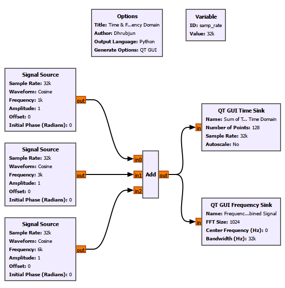

The combined signal is connected to:

- a ****QT GUI Time Sink****

- a ****QT GUI Frequency Sink****

The Time Sink and Frequency Sink therefore observe exactly the same signal.

### What Do We See?

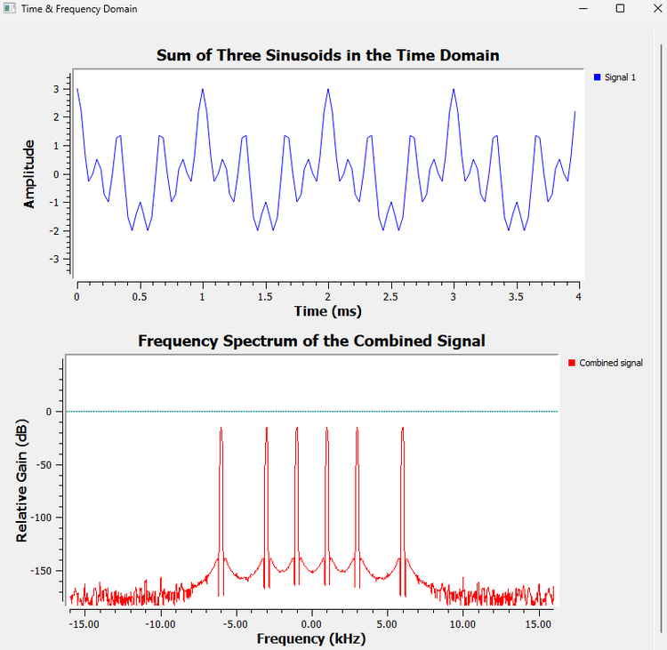

The time-domain waveform looks much more complicated than any of the three original cosine waves.

But the frequency-domain plot immediately reveals the spectral components.

There is one detail that is important here.

We generated ****real-valued cosine waves****. A real cosine can be written as

$$
\cos(2\pi f_0t) = \frac{1}{2}e^{j2\pi f_0t} \+ \frac{1}{2}e^{-j2\pi f_0t}.
$$

Therefore, in a centered spectrum, each real cosine appears as a pair of components:

$$
+f_0 \qquad\text{and}\qquad -f_0.
$$

So our three real tones appear at

$$
\pm1\text{ kHz},\qquad \pm3\text{ kHz},\qquad \pm6\text{ kHz}.
$$

We already encountered the reason for this when discussing I/Q signals and complex rotation. We will not repeat that entire discussion here.

For now, simply remember:

> ****A centered FFT of a real-valued signal normally has a symmetric spectrum.****

The important observation from this first experiment is:

> ****A waveform that looks complicated in time can have a very simple frequency-domain description.****

---

## 6.3 What Is the Fourier Transform Really Doing?

We now know why the frequency-domain view is useful.

But how do we obtain it?

The mathematical connection between the time and frequency domains comes from ****Fourier analysis****.

The basic idea is easier to understand if we forget the equation for a moment.

Suppose somebody gives us an unknown signal and asks:

> Does this signal contain 1 kHz?

We could compare the signal against a 1 kHz reference.

Then we could ask:

> Does it contain 2 kHz?

Compare it against a 2 kHz reference.

Then 3 kHz.

Then 4 kHz.

And so on.

Conceptually, Fourier analysis does something similar. It asks how strongly the signal matches sinusoidal components at different frequencies.

If a particular frequency is strongly present, the comparison produces a strong result.

If that frequency is absent, the contributions tend to cancel.

This is the intuition behind the Fourier transform.

For a continuous-time signal,

$$
X(f)=\int_{-\infty}^{\infty}x(t)e^{-j2\pi ft}\\,dt.
$$

The inverse Fourier transform is

$$
x(t)=\int_{-\infty}^{\infty}X(f)e^{j2\pi ft}\\,df.
$$

We do not need to derive these integrals here.

The important idea is:

$$
\boxed{ \text{Time-domain description} \longleftrightarrow \text{Frequency-domain description} }
$$

The Fourier transform does not create frequencies that were not already part of the signal. It gives us a different representation of the same signal.

---

## 6.4 From the Fourier Transform to the DFT

A real SDR does not normally process an infinitely long continuous waveform.

It works with ****samples****.

Suppose we take a block containing $N$ samples:

$$
x[0],x[1],x[2],\ldots,x[N-1].
$$

We now need a version of Fourier analysis that works with a finite set of discrete samples.

That is the ****Discrete Fourier Transform****, or DFT.

The DFT is

$$
X[k] = \sum_{n=0}^{N-1} x[n]e^{-j2\pi kn/N}, \qquad k=0,1,\ldots,N-1.
$$

At first sight, this equation contains a lot of symbols. Let us unpack them.

### What Does $n$ Mean?

$n$ is the ****sample index****.

As $n$ runs from

$$
0\quad\text{to}\quad N-1,
$$

the DFT moves through all samples in the block.

### What Does $N$ Mean?

$N$ is the number of samples used in the DFT.

If we calculate a 1024-point DFT, then

$$
N=1024.
$$

### What Does $k$ Mean?

$k$ is the ****frequency-bin index****.

Each value of $k$ corresponds to one discrete frequency tested by the DFT.

We will soon see exactly where those frequencies lie.

### What Is the Complex Exponential Doing?

The term

$$
e^{-j2\pi kn/N}
$$

acts like a complex sinusoidal reference associated with bin $k$.

The DFT effectively compares the input samples with that reference.

A useful mental picture is this:

- if the input contains a component matching that bin frequency, the contributions tend to reinforce;

- if the frequency does not match, the contributions tend to rotate around the complex plane and cancel more strongly.

The summation

$$
\sum_{n=0}^{N-1}
$$

accumulates that comparison across the entire block.

So $X[k]$ can be thought of as answering:

> ****How strongly does this finite block of samples correlate with the complex sinusoid represented by bin $k$?****

The result is generally complex.

Its magnitude,

$$
|X[k]|,
$$

indicates the strength of that correlation, while its angle,

$$
\angle X[k],
$$

contains phase information.

### A Small Practical Warning

The raw value of $|X[k]|$ is not automatically equal to the physical amplitude of a sinusoid.

The displayed magnitude can depend on:

- FFT length;

- normalization;

- window choice;

- whether the spectrum is one-sided or two-sided;

- whether the display represents amplitude, power, or another spectral quantity.

For now, we mainly use the GNU Radio Frequency Sink to understand ****where spectral components are located and how their relative behaviour changes****.

We should not treat its vertical scale as a calibrated RF power measurement unless the measurement chain has actually been calibrated.

---

## 6.5 DFT and FFT: What Is the Difference?

This is a common source of confusion.

The ****DFT**** and ****FFT**** are not two competing transforms.

The DFT is the mathematical operation.

The FFT, or ****Fast Fourier Transform****, is a family of efficient algorithms used to calculate the DFT.

A useful way to remember it is:

$$
\boxed{\text{DFT = what we want to calculate}}
$$

$$
\boxed{\text{FFT = an efficient way to calculate it}}
$$

If we directly evaluate the DFT equation for every output bin, the amount of computation grows approximately as

$$
O(N^2).
$$

Common FFT algorithms reduce this to roughly

$$
O(N\log_2N).
$$

For a small transform, this difference may not feel important.

But an SDR may repeatedly calculate FFTs containing hundreds, thousands, or more samples while data arrives continuously.

Then the computational saving becomes extremely important.

This leads to the next question:

> ****How can the FFT calculate the same DFT with much less work?****

---

## 6.6 Why Can the FFT Be Faster?

Look again at the DFT:

$$
X[k] = \sum_{n=0}^{N-1} x[n]e^{-j2\pi kn/N}.
$$

The complex exponential terms do not behave randomly.

They repeat.

They have symmetry.

Many calculations that appear separately in the direct DFT are closely related.

The FFT exploits those relationships instead of calculating everything independently.

The basic strategy is:

1\. break one large DFT into smaller DFTs;

2\. reuse calculations;

3\. combine the smaller results efficiently.

One common way to do this is the ****radix-2 FFT****.

---

## 6.7 Radix-2 FFT

A radix-2 FFT is especially convenient when

$$
N=2^m.
$$

Examples include:

$$
8=2^3,
$$

$$
32=2^5,
$$

$$
1024=2^{10},
$$

and

$$
2048=2^{11}.
$$

The word ****radix-2**** tells us that the algorithm repeatedly breaks the calculation into groups based on two.

For an 8-point transform, the idea is roughly

$$
8 \rightarrow 4+4 \rightarrow 2+2+2+2.
$$

The original large problem becomes several smaller problems.

One common way of organizing this decomposition is called ****Decimation in Time****, or DIT.

---

## 6.8 Decimation in Time (DIT)

In radix-2 DIT, we first separate the input samples according to whether their indices are even or odd.

The even-indexed samples are

$$
x[0],x[2],x[4],\ldots
$$

and the odd-indexed samples are

$$
x[1],x[3],x[5],\ldots
$$

Define

$$
W_N=e^{-j2\pi/N}.
$$

Then the DFT can be reorganized into

$$
X[k]=E[k]+W_N^kO[k]
$$

and

$$
X[k+N/2]=E[k]-W_N^kO[k].
$$

Here:

- $E[k]$ is the $N/2$-point DFT of the even-indexed samples;

- $O[k]$ is the $N/2$-point DFT of the odd-indexed samples.

This is the key step.

Instead of calculating one large $N$-point DFT directly, we calculate two smaller $N/2$-point DFTs and combine them.

Then each of those smaller DFTs can be split again.

And again.

That repeated decomposition is where much of the computational saving comes from.

> ****The FFT becomes fast because it reuses structure that the direct DFT calculation would repeatedly calculate from scratch.****

---

## 6.9 Twiddle Factors: Complex Rotations Inside the FFT

The term

$$
W_N^k=e^{-j2\pi k/N}
$$

is called a ****twiddle factor****.

The name sounds more mysterious than the mathematics.

Using Euler's relation,

$$
e^{j\theta}=\cos\theta+j\sin\theta,
$$

we can write

$$
W_N^k = \cos\left(\frac{2\pi k}{N}\right) - j\sin\left(\frac{2\pi k}{N}\right).
$$

So a twiddle factor is simply a known complex rotation.

That should sound familiar.

When we studied I/Q signals, a complex exponential represented rotation in the complex plane. The FFT uses the same mathematical idea.

The twiddle factor rotates one intermediate result by the amount required before it is combined with another result.

---

## 6.10 The FFT Butterfly

The basic repeated operation in a radix-2 FFT is called a ****butterfly****.

Suppose its inputs are $A$ and $B$.

First, the lower input is multiplied by the appropriate twiddle factor:

$$
T=BW_N^k.
$$

Then the butterfly produces

$$
Y_{\text{upper}}=A+T
$$

and

$$
Y_{\text{lower}}=A-T.
$$

Equivalently,

$$
Y_{\text{upper}}=A+BW_N^k
$$

and

$$
Y_{\text{lower}}=A-BW_N^k.
$$

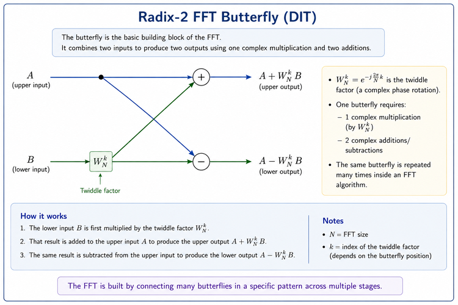

The butterfly is therefore not a mysterious DSP object.

It does three basic things:

1\. rotate one input using a twiddle factor;

2\. add the rotated value to the other input;

3\. subtract the rotated value from the other input.

### A Small Numerical Example

Let

$$
A=3+j,
$$

$$
B=1-j,
$$

and let the required twiddle factor be

$$
W_N^k=-j.
$$

First calculate the rotated lower input:

$$
T=BW_N^k.
$$

Therefore,

$$
T=(1-j)(-j).
$$

Expanding,

$$
T=-1-j.
$$

Now calculate the upper output:

$$
Y_{\text{upper}} = A+T
$$

$$
=(3+j)+(-1-j)
$$

$$
=2.
$$

The lower output is

$$
Y_{\text{lower}} = A-T
$$

$$
=(3+j)-(-1-j)
$$

$$
=4+2j.
$$

That is one butterfly.

A complete radix-2 FFT simply organizes many such butterfly operations into stages.

> ****The FFT is the DFT reorganized into a structured network of reusable calculations.****

---

## 6.11 Building an 8-Point Radix-2 DIT FFT

An 8-point FFT is small enough for us to see the complete structure.

Because

$$
8=2^3,
$$

a radix-2 FFT requires

$$
\log_2 8=3
$$

stages.

In general,

$$
\boxed{\text{Number of radix-2 stages}=\log_2N}.
$$

So:

- a 32-point radix-2 FFT has 5 stages;

- a 1024-point radix-2 FFT has 10 stages;

- a 2048-point radix-2 FFT has 11 stages.

### Why Does Bit Reversal Appear?

A common iterative radix-2 DIT implementation arranges the input samples in ****bit-reversed order****.

This is not a property of the DFT itself.

It appears because of the way this particular FFT implementation organizes the repeated even/odd decomposition and butterfly stages.

For an 8-point FFT, the indices require three binary bits:

| Normal index | Binary | Bits reversed | New index |

|---:|:---:|:---:|---:|

| 0 | 000 | 000 | 0 |

| 1 | 001 | 100 | 4 |

| 2 | 010 | 010 | 2 |

| 3 | 011 | 110 | 6 |

| 4 | 100 | 001 | 1 |

| 5 | 101 | 101 | 5 |

| 6 | 110 | 011 | 3 |

| 7 | 111 | 111 | 7 |

So the bit-reversed order becomes

$$
0,4,2,6,1,5,3,7.
$$

The input sequence is therefore arranged as

$$
x[0],x[4],x[2],x[6],x[1],x[5],x[3],x[7].
$$

In the iterative radix-2 DIT arrangement shown here, this ordering allows the butterfly stages to proceed conveniently while producing the final FFT outputs in natural order.

Library FFT implementations often hide this reordering internally, so a user calling an FFT function does not normally need to perform bit reversal manually.

### Following the Three Stages

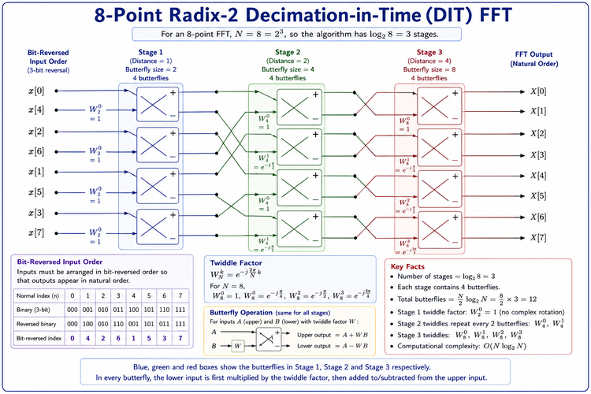

Let us read the figure from left to right.

#### Stage 1

The adjacent bit-reversed inputs are combined in four butterflies.

The butterfly distance is 1.

At this stage,

$$
W_2^0=1.
$$

So the first stage is mainly a set of additions and subtractions.

#### Stage 2

The intermediate values are now combined in groups corresponding to 4-point transforms.

The butterfly distance becomes 2.

The required twiddle factors are based on

$$
W_4^0 \qquad\text{and}\qquad W_4^1.
$$

#### Stage 3

Finally, the two 4-point results are combined to form the complete 8-point transform.

The butterfly distance is 4.

The four butterflies use

$$
W_8^0,\quad W_8^1,\quad W_8^2,\quad W_8^3.
$$

The outputs are

$$
X[0],X[1],X[2],\ldots,X[7].
$$

For an 8-point radix-2 FFT, each of the three stages contains four butterflies.

Therefore, the complete transform contains

$$
\frac{N}{2}\log_2N = 4\times3 = 12
$$

butterflies.

### Do We Need to Build This in GNU Radio?

No.

The purpose of this section is to look briefly ****under the hood**** of an FFT.

We are not going to construct the individual butterfly stages manually in GNU Radio. GNU Radio's FFT-based blocks already perform these calculations internally using efficient numerical libraries.

What matters to us as GNU Radio users is understanding what the FFT parameters mean and how they affect the spectrum we observe.

That takes us back from the internal FFT algorithm to something we can directly experiment with:

> ****What does an FFT block actually produce in GNU Radio?****

---

## 6.12 DIT and DIF

DIT is not the only way to organize a radix-2 FFT.

Another common form is ****Decimation in Frequency****, or DIF.

Both calculate the same DFT. They simply organize the intermediate calculations differently.

For this chapter, we use DIT only to understand the basic structure of an FFT.

We do not need a separate DIF derivation.

---

## 6.13 FFT Bins: Where Does the FFT Look?

An $N$-point DFT produces $N$ discrete frequency samples.

These locations are commonly called ****FFT bins****.

If the sample rate is $f_s$ and the FFT size is $N$, the spacing between adjacent bins is

$$
\boxed{ \Delta f=\frac{f_s}{N} }
$$

where $\Delta f$ is the ****FFT bin spacing****.

Suppose

$$
f_s=32\\,000\text{ samples/s}
$$

and

$$
N=1024.
$$

Then

$$
\Delta f = \frac{32000}{1024} = 31.25\text{ Hz}.
$$

So the FFT evaluates the spectrum at frequency locations separated by 31.25 Hz.

This gives us an important intuition.

Imagine placing equally spaced markers along the frequency axis.

With a small FFT, the markers are relatively far apart.

With a larger FFT, the markers are closer together.

For a fixed sample rate:

$$
N\uparrow \quad\Rightarrow\quad \Delta f\downarrow.
$$

So increasing FFT size gives us a ****denser sampling of the frequency axis****.

But we need to be careful with the word **resolution**.

---

## 6.14 Experiment 2: Using the FFT Block Directly in GNU Radio

Until now, we have mainly used the ****QT GUI Frequency Sink**** to look at spectra.

That is convenient because the Frequency Sink performs the spectral processing needed to draw the spectrum internally.

But after discussing the DFT, FFT, FFT bins, twiddle factors, and butterflies, it is worth opening that black box once.

Instead of asking GNU Radio to calculate and display the spectrum in one convenient block, we will build the main FFT-processing stages ourselves.

### Building the FFT Chain

The processing chain is:

```text

Signal Source

     ↓

Throttle

     ↓

Stream to Vector

     ↓

FFT

     ↓

Complex to Mag²

     ↓

QT GUI Vector Sink

```

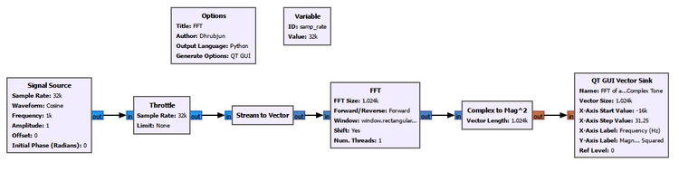

This flowgraph introduces several important blocks that were hidden when we used the QT GUI Frequency Sink:

- ****Stream to Vector****

- ****FFT****

- ****Complex to Mag²****

- ****QT GUI Vector Sink****

### Why Do We Need Stream to Vector?

The Signal Source produces a continuous stream of samples:

```text

x[0], x[1], x[2], x[3], ...

```

But an $N$-point FFT operates on blocks containing $N$ samples.

For

$$
N=1024,
$$

the FFT needs

$$
x[0],x[1],\ldots,x[1023]
$$

as one block.

The ****Stream to Vector**** block collects 1024 consecutive samples and groups them into one vector:

$$
\underbrace{ [x[0],x[1],\ldots,x[1023]] }_{1024\text{ samples}}.
$$

That vector is then passed to the FFT block.

This is an important practical connection between the mathematics and GNU Radio:

> ****The FFT does not operate on an infinitely long stream at once. It repeatedly processes finite blocks of samples.****

### The FFT Block

For this experiment, we use:

- sample rate: 32 kS/s;

- FFT size: 1024;

- forward FFT;

- rectangular window;

- a centered frequency display from approximately -16 kHz to +16 kHz.

Since

$$
f_s=32000\text{ samples/s}
$$

and

$$
N=1024,
$$

the FFT bin spacing is

$$
\Delta f = \frac{f_s}{N} = \frac{32000}{1024} = 31.25\text{ Hz}.
$$

For a centered spectrum, the displayed frequency span is approximately

$$
-\frac{f_s}{2} \quad\text{to}\quad +\frac{f_s}{2},
$$

which becomes

$$
-16\text{ kHz} \quad\text{to}\quad +16\text{ kHz}
$$

for our 32 kS/s sample rate.

### Why Do We Use Complex to Mag²?

The FFT output is complex:

$$
X[k].
$$

Each FFT bin therefore contains magnitude and phase information.

For this experiment, we are interested in the strength of each frequency component rather than its phase.

The ****Complex to Mag²**** block calculates

$$
|X[k]|^2.
$$

So the chain

```text

FFT → Complex to Mag²

```

converts the complex FFT output into a magnitude-squared quantity.

The ****QT GUI Vector Sink**** then plots those values against the frequency-bin positions.

One important warning:

> ****The vertical axis in this experiment is raw magnitude-squared. It should not be interpreted as calibrated power in watts or dBm, and it should not be compared directly with the dB scale of the QT GUI Frequency Sink.****

The purpose of this experiment is to understand the FFT-processing chain and the locations of spectral components.

### Part A: FFT of a Real 1 kHz Cosine

First, set the Signal Source to generate a ****real cosine****:

$$
x(t)=\cos(2\pi 1000t).
$$

The result is:

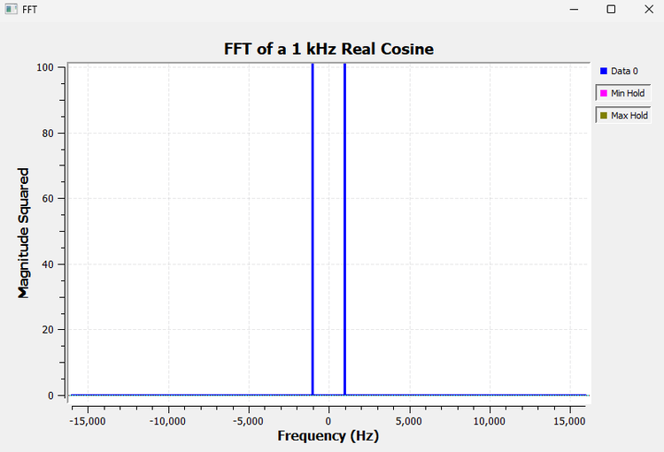

Two spectral components appear:

$$
-1\text{ kHz} \qquad\text{and}\qquad +1\text{ kHz}.
$$

This is exactly what we should expect because

$$
\cos(2\pi f_0t) = \frac{1}{2}e^{j2\pi f_0t} \+ \frac{1}{2}e^{-j2\pi f_0t}.
$$

A real cosine therefore contains two complex rotating components:

$$
+f_0 \qquad\text{and}\qquad -f_0.
$$

For

$$
f_0=1\text{ kHz},
$$

the FFT shows peaks at

$$
-1\text{ kHz} \qquad\text{and}\qquad +1\text{ kHz}.
$$

This is not something created by the QT GUI Frequency Sink. We are now observing the same behaviour using the FFT block directly.

### Part B: FFT of a Complex 1 kHz Tone

Now change the Signal Source so that it produces a ****complex tone****.

The signal is

$$
x(t)=e^{j2\pi f_0t}.
$$

Using Euler's relation,

$$
e^{j2\pi f_0t} = \cos(2\pi f_0t) \+ j\sin(2\pi f_0t).
$$

For

$$
f_0=1\text{ kHz},
$$

this complex signal represents one rotating phasor at positive 1 kHz.

The FFT now looks very different:

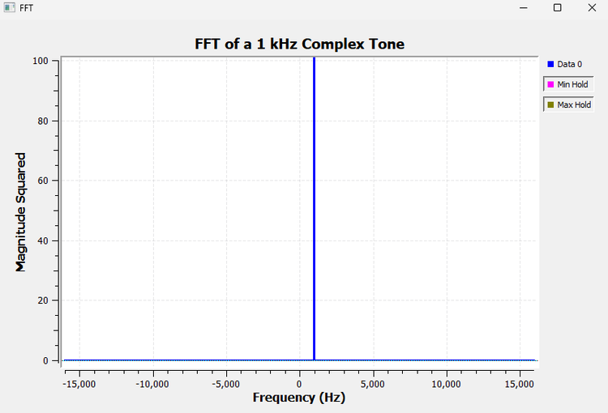

Instead of two peaks, we obtain only one:

$$
+1\text{ kHz}.
$$

The two experiments can therefore be summarized as:

| Input signal | FFT result |

|---|---|

| Real 1 kHz cosine | Peaks at $-1$ kHz and $+1$ kHz |

| Complex 1 kHz tone | Peak only at $+1$ kHz |

This is one of the most important differences between real and complex signal representations in SDR.

A real cosine contains both positive- and negative-frequency complex components.

A complex exponential can represent only one of those rotations.

We already explored the physical meaning of this behaviour when studying I/Q signals. Here, the FFT gives us another way to observe it directly.

### What Did We Actually Build?

This experiment is useful because it exposes operations that the Frequency Sink normally hides from us.

The processing chain was:

$$
\boxed{ \text{Sample stream} \rightarrow \text{Vector of }N\text{ samples} \rightarrow \text{FFT} \rightarrow |X[k]|^2 \rightarrow \text{Display} }
$$

Each block now has a clear purpose:

| GNU Radio block | What it does |

|---|---|

| Signal Source | Generates the test signal |

| Throttle | Controls the rate of a software-only flowgraph |

| Stream to Vector | Groups the continuous stream into $N$-sample blocks |

| FFT | Calculates the DFT efficiently |

| Complex to Mag² | Calculates $\lvert X[k] \rvert^2$ |

| QT GUI Vector Sink | Displays the FFT-bin values |

This also explains why the ****QT GUI Frequency Sink**** is so convenient.

Conceptually, it performs much of this spectral-analysis work for us internally.

So there are two useful ways to work in GNU Radio:

> ****Use the Frequency Sink when you simply want to observe a spectrum.****

and

> ****Use the FFT block directly when you want access to FFT data for further processing.****

That distinction becomes increasingly important in SDR systems. An FFT may not always be the final display. Its output can instead be passed to detection algorithms, channelizers, estimators, classifiers, or other DSP operations.

### One More Connection to the FFT Theory

Earlier, we looked inside a radix-2 FFT and saw DIT decomposition, twiddle factors, butterflies, and bit reversal.

We did ****not**** manually construct those operations in this GNU Radio experiment.

The single ****FFT block**** performs the transform for us.

So we can now connect the three levels:

```text
DFT equation
     ↓
Efficient FFT algorithm
     ↓
GNU Radio FFT block
```

The DFT tells us ****what is being calculated****.

The FFT algorithm tells us ****how it can be calculated efficiently****.

The GNU Radio FFT block gives us a ****practical implementation we can use inside a flowgraph****.

That completes the connection between the mathematics and what we are actually doing in GNU Radio.

---

## 6.15 Bin Spacing Is Not Exactly the Same as Spectral Resolution

It is tempting to say:

> Smaller bin spacing means better frequency resolution.

That is useful as a first intuition, but it is incomplete.

Three different ideas are involved:

| Property | Mainly affected by | What it tells us |

|---|---|---|

| Bin spacing | $f_s/N$ | Distance between FFT frequency samples |

| Main-lobe width | Observation length and window | How broad one spectral tone appears |

| Sidelobe level | Window | How strongly a tone spreads away from its main peak |

Two tones do not automatically become distinguishable just because their separation is slightly larger than one FFT bin.

Their spectral main lobes can still overlap.

So throughout this chapter, we will use ****bin spacing**** when we specifically mean

$$
\Delta f=\frac{f_s}{N},
$$

and use ****spectral resolution**** more carefully when discussing whether two nearby components can actually be distinguished.

---

## 6.16 Experiment 3: What Happens When We Change FFT Size?

We now return to GNU Radio.

We generated two cosine tones:

- 1.0 kHz

- 1.1 kHz

Their frequency separation is

$$
1100-1000=100\text{ Hz}.
$$

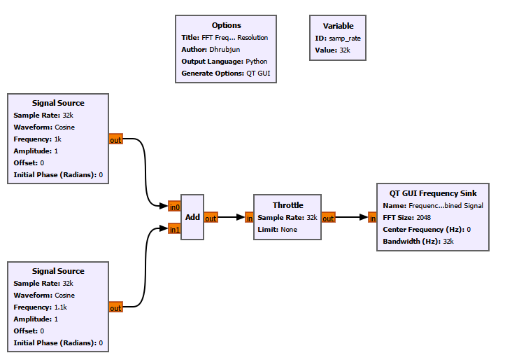

### Before Running It

Our sample rate is

$$
f_s=32\text{ kS/s}.
$$

Before looking at the screenshots, calculate the bin spacing for each FFT size.

### FFT Size = 32

For

$$
N=32,
$$

the bin spacing is

$$
\Delta f = \frac{32000}{32} = 1000\text{ Hz}.
$$

Our tones are only 100 Hz apart, while the FFT frequency samples are 1000 Hz apart.

So we should not expect the display to represent the two tones as two clean, narrowly separated peaks.

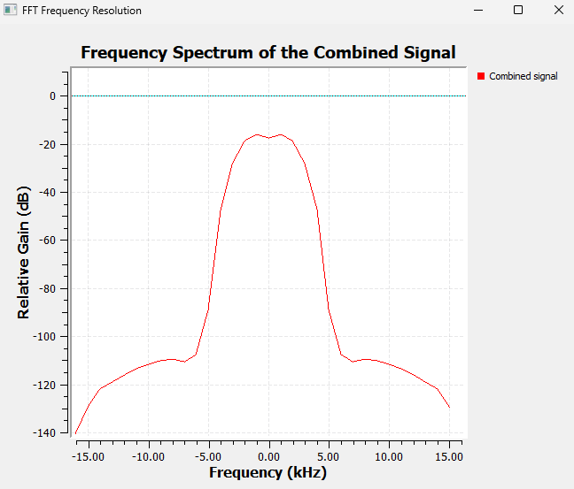

That is exactly what we observe.

### FFT Size = 256

Now let

$$
N=256.
$$

Then

$$
\Delta f = \frac{32000}{256} = 125\text{ Hz}.
$$

The FFT now samples the frequency axis much more finely.

The two components begin to become distinguishable, although their spectral shapes can still overlap.

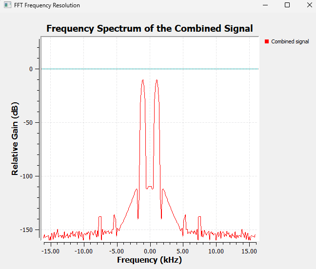

### FFT Size = 2048

Finally,

$$
N=2048.
$$

Now,

$$
\Delta f = \frac{32000}{2048} = 15.625\text{ Hz}.
$$

The 100 Hz separation between our tones now spans several FFT-bin intervals.

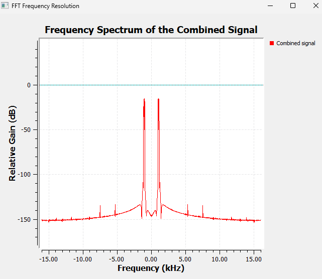

The two components are much easier to distinguish.

### But Where Did the Extra Frequency Detail Come From?

An $N$-point FFT uses $N$ samples.

The observation time is therefore

$$
T_{\text{obs}}=\frac{N}{f_s}.
$$

For our experiment:

| FFT size | Bin spacing | Observation time |

|---:|---:|---:|

| 32 | 1000 Hz | 1 ms |

| 256 | 125 Hz | 8 ms |

| 2048 | 15.625 Hz | 64 ms |

So the larger FFT is not obtaining extra detail for free.

It is examining a longer block of the signal.

This reveals a fundamental time-frequency trade-off:

> ****To obtain finer frequency information from actual samples, we generally need to observe the signal for longer.****

---

## 6.17 A Short Note About Zero-Padding

There is a common FFT misunderstanding worth clearing up here.

Suppose we collect only $N$ actual samples but append zeros and calculate a larger FFT.

For example, we might collect 256 samples and zero-pad them before calculating a 2048-point FFT.

The displayed frequency grid becomes denser.

The spectral curve may look smoother.

But we did ****not**** observe the signal for the same duration as 2048 actual samples.

Therefore, zero-padding does not create new information about the signal.

A useful rule is:

$$
\boxed{ \text{Zero-padding gives a denser frequency grid, not new spectral information.} }
$$

It can help us visualize or interpolate the spectral shape, but it does not magically narrow the window's main lobe or provide the same fundamental resolving ability as a longer observation.

---

## 6.18 Understanding the Frequency Axis

For a sampled complex baseband signal with sample rate $f_s$, a centered spectrum commonly spans

$$
-\frac{f_s}{2} \quad\text{to}\quad +\frac{f_s}{2}.
$$

With

$$
f_s=32\text{ kS/s},
$$

that becomes

$$
-16\text{ kHz} \quad\text{to}\quad +16\text{ kHz}.
$$

This is the available sampled Nyquist span.

It is not necessarily the same thing as the ****occupied bandwidth**** of the signal.

A narrowband signal may occupy only a small part of that available span.

### Center Frequency

For our baseband simulations, the center frequency is usually set to 0 Hz.

With actual SDR hardware, however, the receiver may be tuned to an RF frequency such as 100 MHz.

Then the FFT bins represent frequency offsets around that tuned center.

### Bandwidth Setting in the Frequency Sink

The Frequency Sink's bandwidth parameter tells GNU Radio how to map the FFT bins onto the frequency axis.

For our full complex-baseband display, we normally set it consistently with the incoming sample rate.

So with a 32 kS/s stream centered at 0 Hz, the displayed span is typically approximately

$$
-16\text{ kHz}\quad\text{to}\quad+16\text{ kHz}.
$$

Again, this is the ****sampled frequency span****, not necessarily the bandwidth actually occupied by the signal.

---

## 6.19 Why Does GNU Radio Use dB?

Look at almost any spectrum analyzer and you will see a logarithmic vertical scale.

GNU Radio does the same.

Why?

Because spectral components can differ enormously in magnitude.

A logarithmic scale allows strong and weak components to remain visible on the same graph.

For an amplitude ratio,

$$
A_{\text{dB}} = 20\log_{10} \left( \frac{A}{A_{\text{ref}}} \right).
$$

For a power ratio,

$$
P_{\text{dB}} = 10\log_{10} \left( \frac{P}{P_{\text{ref}}} \right).
$$

These are consistent because power is proportional to amplitude squared.

A few useful reference points are:

- $0\text{ dB}$: equal to the reference;

- approximately $-6\text{ dB}$: half the amplitude;

- approximately $-3\text{ dB}$: half the power.

### dB Is Not Automatically dBm

This distinction is very important in SDR.

A spectrum display showing something at $-30\text{ dB}$ does ****not**** automatically mean the received power is $-30\text{ dBm}$.

dB describes a ratio relative to some reference.

dBm is an absolute power unit referenced to 1 mW.

Unless the SDR hardware, gains, FFT scaling, windowing, and display have been properly calibrated, we should not interpret a GUI spectral level as an absolute RF power measurement.

For the experiments in this chapter, we mainly care about:

- peak locations;

- relative levels;

- spectral shape;

- how the spectrum changes when we change parameters.

---

## 6.20 Experiment 4: Why Does a Pure Tone Sometimes Spread Across the Spectrum?

We might expect a pure sinusoid to produce one perfectly sharp FFT line.

Sometimes it comes close.

Sometimes its energy spreads across many neighbouring bins.

Why?

This is ****spectral leakage****.

### First, What Does Bin-Centred Mean?

A tone lies exactly on an FFT bin when

$$
f_{\text{tone}} = k\frac{f_s}{N}
$$

for some integer $k$.

Since

$$
\Delta f=\frac{f_s}{N},
$$

we can also write

$$
f_{\text{tone}}=k\Delta f.
$$

So whether a 1 kHz or 1.1 kHz tone is bin-centred depends on the particular values of $f_s$ and $N$.

The frequency alone is not enough to decide.

### Bin-Centred Case

For the selected sample rate and FFT size, we first choose a frequency that satisfies

$$
f_{\text{tone}}=k\Delta f.
$$

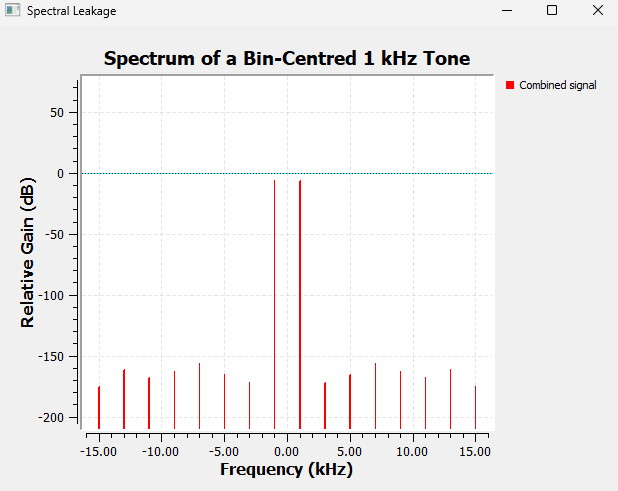

The energy is concentrated much more strongly around the corresponding FFT-bin location.

### Move the Tone Away from the Bin

Next, we choose a tone that does not fall exactly on a bin frequency.

In our saved experiment, the 1.1 kHz tone is the off-bin example for the chosen FFT configuration.

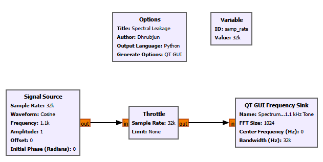

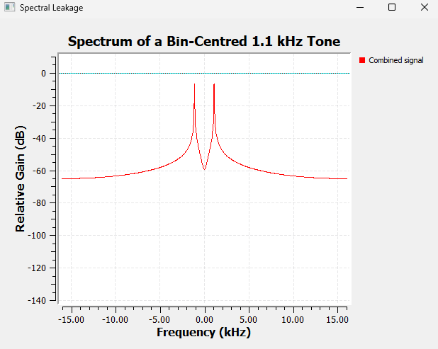

The tone has not physically turned into many new sinusoidal signals.

The spreading comes from the way we are observing it.

---

## 6.21 Where Does Spectral Leakage Actually Come From?

This idea is easier to understand if we remember one fact:

> ****The FFT does not see an infinitely long sine wave. It sees only a finite block of samples.****

Imagine a continuous sine wave.

Now cut out a short section.

That finite section is all the FFT receives.

One useful way to think about the DFT is that this finite block is treated as one period of a repeating sequence.

Imagine placing copies of the block one after another:

```text

FFT block | FFT block | FFT block | FFT block | ...

```

If the end of one block joins smoothly to the beginning of the next, the repeated waveform can remain smooth.

But if the beginning and end do not line up, repeating the block creates a sudden jump at every boundary.

Conceptually:

```text

smooth signal ... | jump | ... | jump | ...

```

Those abrupt boundaries cannot be represented by the original single sinusoid alone.

As a result, energy appears across additional FFT bins.

That is the intuitive origin of spectral leakage.

> ****Spectral leakage is a consequence of observing only a finite section of the signal.****

There is also a more formal way to describe this.

Selecting a finite block is equivalent to multiplying the signal by a window in the time domain.

Multiplication in time corresponds to convolution in frequency.

Therefore, the ideal spectrum of the signal becomes shaped by the spectrum of the window.

We do not need to derive that convolution here, but it explains why different window functions produce different spectral shapes.

---

## 6.22 Main Lobe and Sidelobes

When we examine the spectrum of a finite-length signal, a frequency component does not always appear as an infinitely thin line. Instead, its energy can spread into a characteristic shape consisting of a ****main lobe**** and ****sidelobes****.

The ****main lobe**** is the dominant part of this shape, centred around the frequency of the signal. Its width matters because it affects our ability to distinguish two frequencies that are close together. A narrower main lobe generally makes it easier to separate nearby frequency components.

The ****sidelobes**** are the smaller spectral components that appear on either side of the main lobe. They are important because energy from a strong signal can spread into neighbouring frequencies and potentially hide a weaker signal.

This gives us an important trade-off:

- a ****narrow main lobe**** helps us distinguish closely spaced frequencies;

- ****low sidelobes**** reduce spectral leakage into neighbouring frequencies.

Different window functions handle this trade-off differently. Some give us narrower main lobes, while others suppress the sidelobes more strongly.

We will see this difference directly in the next GNU Radio experiment.

---

## 6.23 Window Functions

Suppose the original samples are $x[n]$.

Before calculating the FFT, we multiply them by a window $w[n]$:

$$
x_w[n]=x[n]w[n].
$$

The window changes how strongly samples near the edges of the FFT block contribute to the calculation.

Many windows reduce the contribution of samples near the boundaries, making the finite observation less abrupt.

But every window has its own frequency-domain shape.

That produces a trade-off between:

- main-lobe width;

- sidelobe level;

- leakage suppression;

- ability to separate nearby tones;

- amplitude accuracy.

There is no universally best window.

The correct choice depends on what we are trying to measure.

---

## 6.24 Experiment 5: Comparing FFT Windows

In this experiment, we keep the signal and FFT settings unchanged and change only the window used by the QT GUI Frequency Sink.

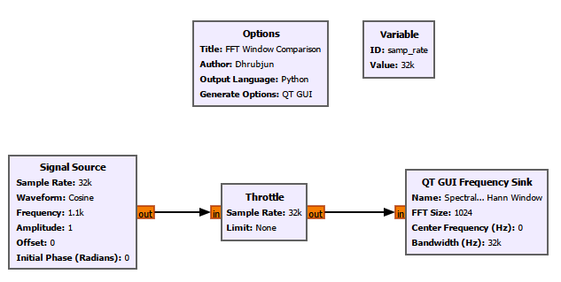

We compare:

1\. Rectangular

2\. Hann

3\. Hamming

4\. Blackman-Harris

5\. Kaiser

6\. Flat-top

### Before Switching Windows

Ask yourself:

> If the signal itself is unchanged, should the location of the actual tone move?

No.

The tone frequency is still the same.

What should change is the ****shape of its spectral representation****.

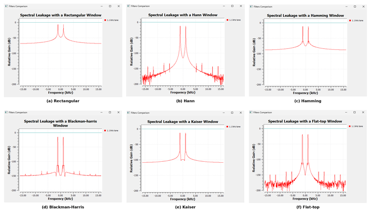

### Rectangular Window

The rectangular window gives equal weight to every sample in the FFT block.

It has a relatively narrow main lobe but comparatively high sidelobes.

That can be useful when separating nearby components, but an off-bin tone can produce significant visible leakage.

### Hann Window

The Hann window smoothly tapers toward zero near both ends of the block.

Its sidelobes are substantially reduced compared with the rectangular window, but its main lobe is wider.

It is a very common general-purpose choice.

### Hamming Window

The Hamming window is similar in spirit to the Hann window but uses different coefficients.

It provides a different compromise between main-lobe width and sidelobe behaviour.

### Blackman-Harris Window

The Blackman-Harris window strongly suppresses sidelobes.

That can be valuable when a weak spectral component lies close to a much stronger one.

The cost is a wider main lobe.

### Kaiser Window

The Kaiser window is adjustable.

It uses a parameter commonly called

$$
\beta.
$$

Increasing $\beta$ generally reduces sidelobes but widens the main lobe.

So the Kaiser window allows us to tune the trade-off rather than selecting one fixed compromise.

### Flat-Top Window

The flat-top window is designed mainly for good amplitude accuracy near a spectral peak.

Its main lobe is broad and relatively flat near the top.

That can be useful for amplitude measurement, but it is usually not the best choice when the main goal is separating very closely spaced tones.

### What Did This Experiment Teach Us?

The signal did not change.

The FFT size did not change.

Only the window changed.

Yet the spectral shape changed significantly.

That gives us an important lesson:

> ****The spectrum we see is influenced not only by the signal, but also by how we choose to analyse the finite block of samples.****

---

## 6.25 FFT Size, Leakage, and Windowing Are Related but Different

At this point, three ideas can easily become mixed together.

Let us separate them.

### FFT Bin Spacing

$$
\Delta f=\frac{f_s}{N}.
$$

This tells us the spacing between the discrete FFT frequency samples.

### Observation Time

$$
T_{\text{obs}}=\frac{N}{f_s}.
$$

This tells us how long a block of $N$ actual samples represents.

### Window Shape

The window determines the main-lobe and sidelobe characteristics of each spectral component.

So:

$$
\boxed{\text{FFT size affects bin spacing and observation time}}
$$

while

$$
\boxed{\text{window choice affects spectral spreading and peak shape}}.
$$

Both influence how well we can distinguish nearby signals.

That is why practical spectral resolution cannot be described by bin spacing alone.

---

## 6.26 What Does FFT Averaging Do?

So far, our signals have been clean and stable.

Real signals are often noisy.

If we calculate one FFT block, then another, then another, the displayed spectrum may fluctuate.

FFT averaging combines information from successive spectral estimates so that random variations become smoother.

This can make persistent components easier to see.

But there is a trade-off.

More averaging means a smoother display, but it also means the display responds more slowly when the signal changes.

So:

$$
\boxed{ \text{More averaging} \longleftrightarrow \text{Smoother but slower display} }
$$

For clean generated tones, averaging is not especially important.

It becomes much more useful when we begin working with noise and real received signals.

---

## 6.27 The Frequency Sink Shows Only the Present

A Frequency Sink is extremely useful.

But it has one limitation.

Suppose a tone begins at 1 kHz.

A few seconds later, we move it to 3 kHz.

Then we move it to 9 kHz.

The Frequency Sink clearly shows the tone at its current location.

But once the tone moves, the old frequency disappears.

The spectrum does not preserve the history.

For many SDR signals, that history matters.

A transmission may appear only briefly.

A carrier may drift.

A radar or communication signal may sweep in frequency.

An interferer may appear and disappear.

A transmitter may hop between channels.

To see how the spectrum changes with time, we need another display.

That is the ****Waterfall Sink****.

---

## 6.28 Experiment 6: Watching Frequency Change Over Time

We created a cosine source whose frequency could be changed while the flowgraph was running using a QT GUI Range.

The signal was connected to:

- a QT GUI Frequency Sink;

- a QT GUI Waterfall Sink.

Because this flowgraph generated samples entirely in software and did not contain hardware to control the sample rate, we used a ****Throttle**** block.

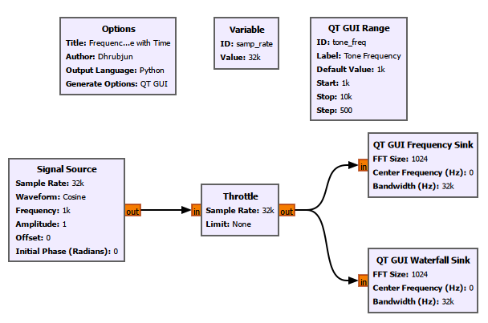

We then changed the tone frequency while the flowgraph was running.

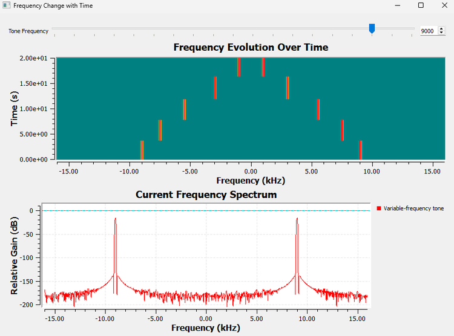

The Frequency Sink shows the ****current spectrum****.

The Waterfall Sink preserves previous spectral estimates.

A useful way to think about the waterfall is:

> ****Each row is essentially another spectrum, and successive spectra are stacked over time.****

Depending on the display orientation and settings:

- one direction represents frequency;

- the other represents time;

- colour represents spectral magnitude.

### Reading Common Waterfall Patterns

A constant-frequency signal produces a trace that stays at the same frequency.

A drifting signal produces a trace that gradually moves.

A chirp produces a sloped trace.

A short transmission produces a short-duration segment.

A persistent wideband source appears as a broader region rather than a narrow line.

The exact colour depends on the selected colour map and dynamic range.

The waterfall therefore gives us something the ordinary Frequency Sink cannot:

> ****spectral memory.****

---

## 6.29 What the QT GUI Frequency Sink Controls Actually Mean

After these experiments, the settings in the QT GUI Frequency Sink should feel much less arbitrary.

### FFT Size

Controls how many samples are used in each FFT calculation.

For actual sample blocks,

$$
\Delta f=\frac{f_s}{N}
$$

and

$$
T_{\text{obs}}=\frac{N}{f_s}.
$$

A larger FFT gives finer bin spacing but represents a longer observation interval.

### Center Frequency

Defines the frequency shown at the center of the display.

For our simulated baseband experiments, this is usually 0 Hz.

With SDR hardware, it can represent the tuned RF center frequency.

### Bandwidth

Tells GNU Radio how the FFT bins should be mapped onto the frequency axis.

For a full complex-baseband display, it is normally set consistently with the stream's sample rate.

### Window Type

Controls how the finite block is weighted before the FFT.

Different windows trade main-lobe width against sidelobe behaviour and amplitude characteristics.

### Averaging

Smooths changes between successive spectral estimates.

More averaging produces a steadier display but slower response.

### dB Scale

Allows a large range of spectral magnitudes to be shown on one plot.

But the displayed dB value should not automatically be interpreted as calibrated dBm.

---

## 6.30 What We Learned

We began this chapter with a simple question:

> ****How can several frequencies exist inside one waveform?****

We can now answer it from several different levels.

### Representation

- The time domain and frequency domain are two descriptions of the same signal.

- A complicated time-domain waveform can be made from only a few simple sinusoidal components.

- Fourier analysis provides the mathematical connection between the two domains.

- Real-valued signals have symmetric positive- and negative-frequency components in a centered spectrum.

- A complex tone can occupy only one side of the centered spectrum.

### Computation

- The DFT analyses a finite block of samples at discrete frequency locations.

- $X[k]$ measures how strongly the sample block correlates with the complex sinusoid associated with bin $k$.

- The FFT is an efficient family of algorithms for calculating the DFT.

- Radix-2 FFTs repeatedly break a large DFT into smaller calculations.

- DIT is one common organization of that decomposition.

- Twiddle factors are complex rotations.

- Butterflies combine intermediate FFT values using additions, subtractions, and twiddle-factor multiplication.

- Bit reversal appears in some iterative radix-2 DIT implementations; it is not a property of the DFT itself.

- In GNU Radio, an explicit FFT chain can be built using ****Stream to Vector → FFT → Complex to Mag² → QT GUI Vector Sink****.

### Spectral Measurement

- FFT bin spacing is

$$
\Delta f=\frac{f_s}{N}.
$$

- The observation time of $N$ actual samples is

$$
T_{\text{obs}}=\frac{N}{f_s}.
$$

- Bin spacing and practical spectral resolution are related, but they are not identical.

- Zero-padding gives a denser frequency grid but does not create new information.

- Finite observation causes spectral leakage.

- A tone is exactly bin-centred only when

$$
f_{\text{tone}}=k\frac{f_s}{N}.
$$

- Windows change the main-lobe and sidelobe behaviour of the spectral estimate.

- No single window is best for every measurement.

- FFT averaging smooths spectral fluctuations at the cost of slower response.

- dB and dBm are not the same thing.

### Visualization

- The QT GUI Frequency Sink is convenient when we simply want to observe a spectrum.

- The FFT block gives us direct access to FFT data for further processing.

- The Frequency Sink shows the current spectral estimate.

- The Waterfall Sink shows how the spectrum evolves over time.

Most importantly, the spectrum should no longer feel like a graph that GNU Radio somehow produces for us.

We now have a much clearer idea of:

- where the frequency bins come from;

- what the DFT is measuring;

- why the FFT is computationally efficient;

- what the FFT block actually produces;

- why real and complex signals can have different spectral symmetry;

- why FFT size matters;

- why spectral leakage appears;

- why windows change the spectrum;

- and what the GNU Radio spectrum controls are actually doing.

---

## 6.31 Now Break the Flowgraph

The best way to check whether these ideas make sense is to deliberately change things.

### 1. Reduce the FFT Size

Use the two closely spaced tones.

Reduce $N$.

Before running the flowgraph, calculate

$$
\Delta f=\frac{f_s}{N}.
$$

Predict what will happen.

Then compare your prediction with the Frequency Sink.

### 2. Move a Tone Between FFT Bins

Calculate the bin spacing.

Choose one frequency satisfying

$$
f=k\Delta f
$$

and another frequency that does not.

Compare the two spectra.

### 3. Change the Window

Keep the signal unchanged.

Switch between:

- Rectangular

- Hann

- Hamming

- Blackman-Harris

- Kaiser

- Flat-top

Watch the main lobe and sidelobes.

Ask yourself:

> Which window makes the peak narrowest?

and

> Which window suppresses the distant leakage most strongly?

### 4. Change the Sample Rate

Keep the FFT size fixed and increase $f_s$.

What happens to

$$
\Delta f=\frac{f_s}{N}?
$$

Predict before running.

### 5. Increase Averaging

Observe how the spectrum becomes smoother.

Then change the signal quickly.

Does the display react immediately?

### 6. Compare a Real and Complex Tone

Return to the explicit FFT flowgraph.

Generate a real 1 kHz cosine and observe the two spectral components.

Then change the source to a complex 1 kHz tone.

What happens to the negative-frequency component?

### 7. Move the Tone While Watching the Waterfall

Hold the tone at one frequency.

Move it.

Hold it again.

Move it once more.

Compare what the Frequency Sink remembers with what the Waterfall Sink remembers.

Breaking a flowgraph in controlled ways is often one of the fastest ways to understand what its parameters really mean.

---

## 6.32 Connecting to the Next Chapter

Until now, our signals have been almost unrealistically clean.

Real receivers do not normally show perfect tones floating on an otherwise empty spectrum.

There is always something else present:

****noise****.

Noise raises the spectral background.

It disturbs time-domain waveforms.

It makes weak signals harder to see.

It spreads constellation points.

Eventually, a signal can become so weak relative to the noise that reliable detection becomes difficult.

That leads to our next question:

> ****How weak can a signal become before it disappears into the noise?****

In the next chapter, we move from ideal signals toward real-world SDR behaviour by studying:

- noise;

- noise floor;

- signal-to-noise ratio;

- and how noise appears in both the time and frequency domains.
