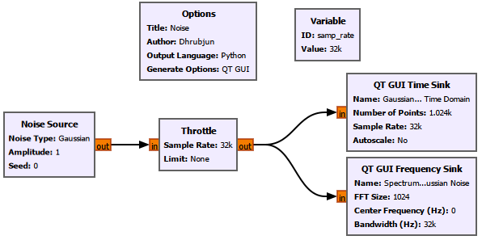
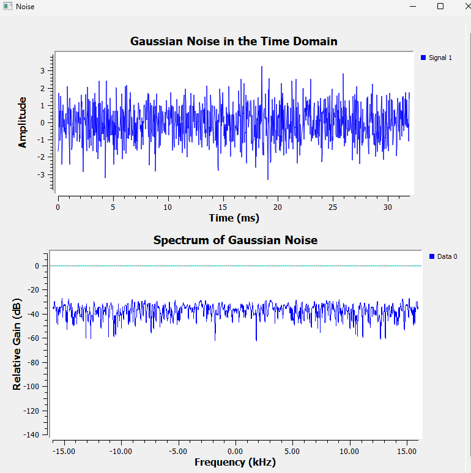
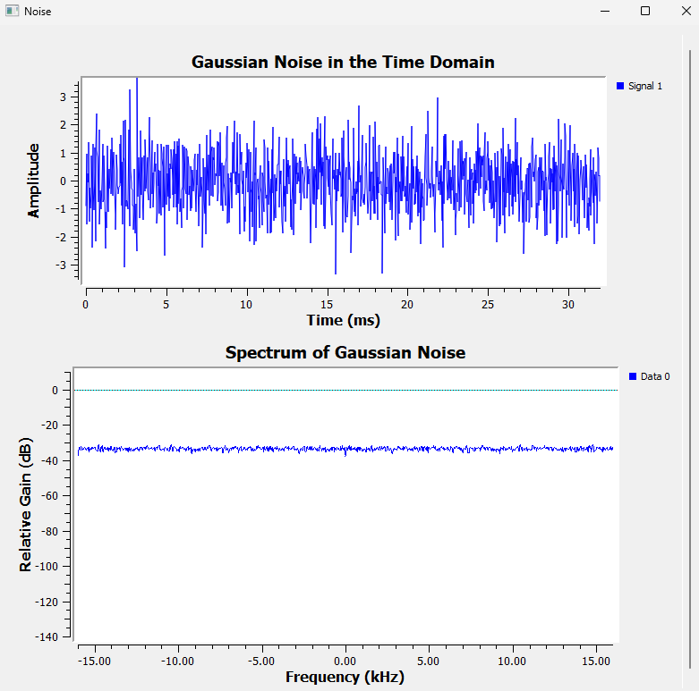
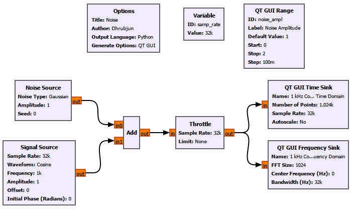
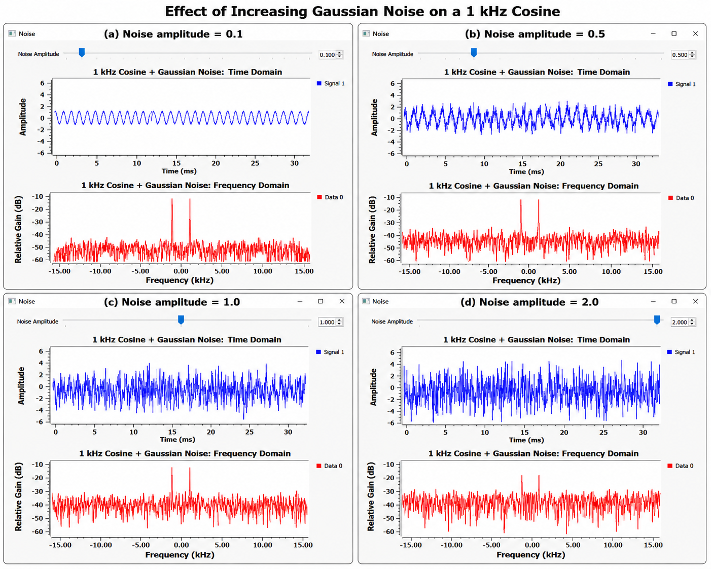
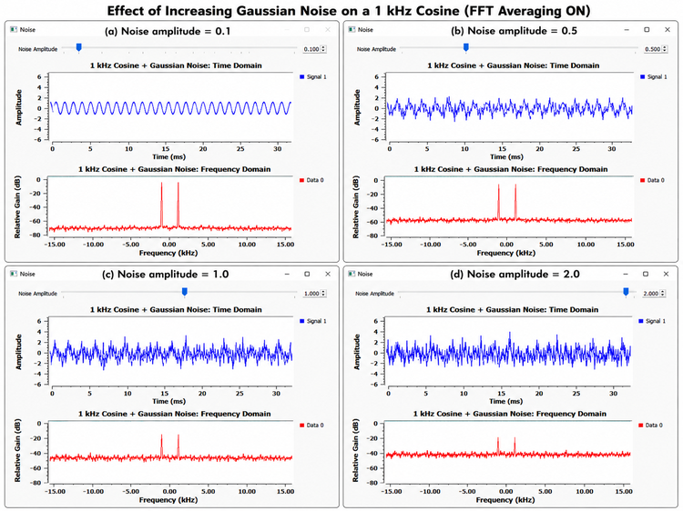
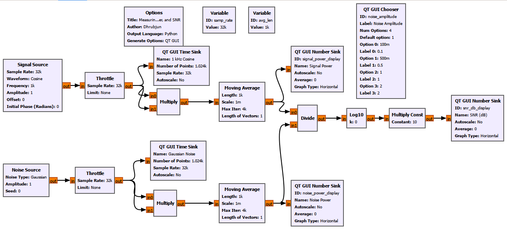
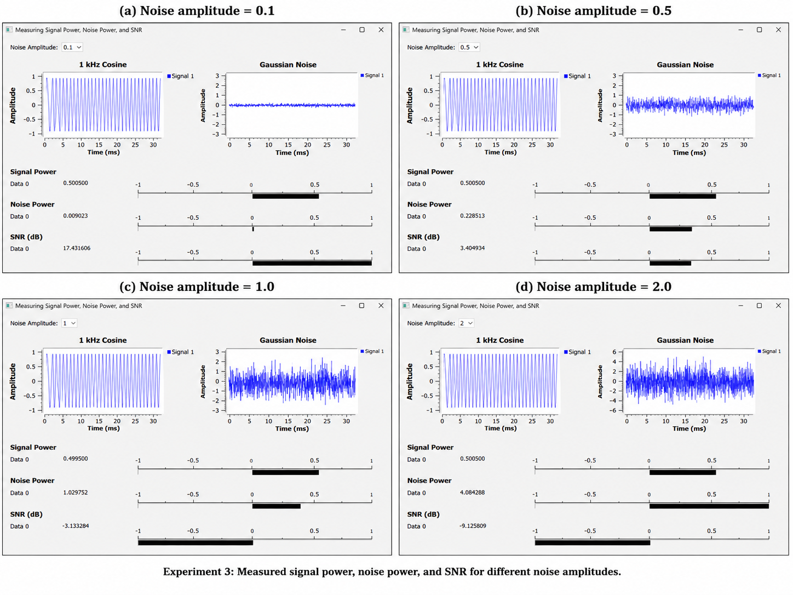
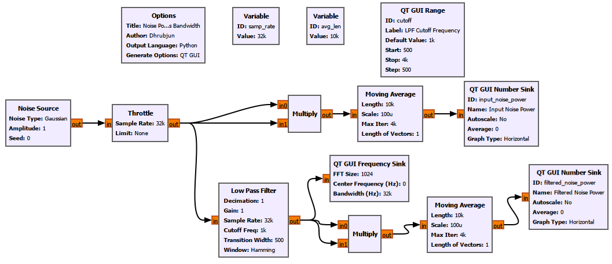
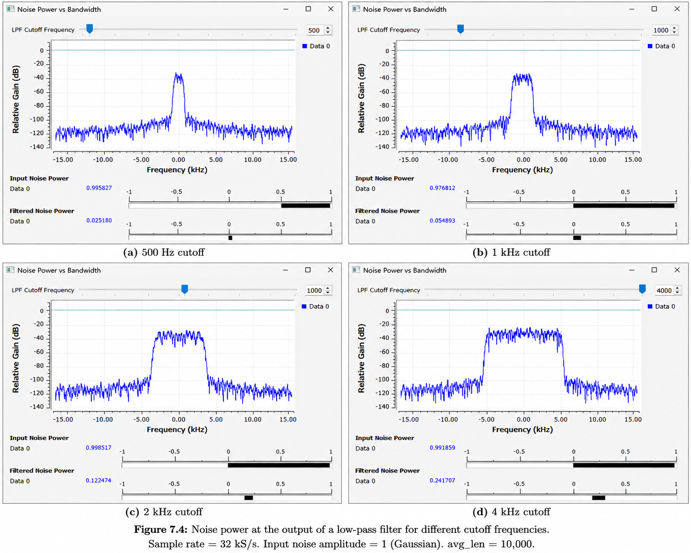

# Chapter 7: Noise, Noise Floor, and SNR

## Main Question

How weak can a signal become before it disappears into the noise?

---

## 7.1 Real Signals Are Never Completely Clean

Most of the signals we have worked with so far have been unusually clean.

We generated sine waves, cosine waves, and complex tones with exact frequencies and amplitudes. When we looked at them in the frequency domain, their spectral components were easy to identify.

Real receivers are not usually that friendly.

Connect an antenna to a receiver and look at the spectrum. Even when no obvious transmission is present, the display does not become completely empty. There is always some background activity.

Some of it comes from the receiver electronics themselves. Some comes from the environment. Other electronic equipment may contribute interference. Even the thermal motion of electrons inside electronic components produces noise.

So a useful signal rarely arrives by itself.

A more realistic picture is

$$
\boxed{
\text{Received signal}
=
\text{wanted signal}
+
\text{noise}
+
\text{other unwanted signals}
}
$$

In this chapter, we will begin with the simplest part of that problem: **noise**.

We will first look at noise by itself. Then we will add noise to a known signal and gradually make the noise stronger.

Eventually, instead of simply saying that a signal "looks noisy," we will put a number on it.

That number is the **signal-to-noise ratio**, or **SNR**.

---

## 7.2 What Do We Mean by Noise?

In signal processing, noise is an unwanted random component that interferes with the signal we are interested in.

Unlike the sinusoidal signals we used earlier, noise does not repeat in a simple, predictable pattern.

Consider a cosine:

$$
x(t)=\cos(2\pi f_0t)
$$

Once we know its amplitude, frequency, and phase, we can predict what it will do next.

Noise is different.

If we know the present value of a random noise sample, we generally cannot use that value alone to predict the exact value of the next sample.

That does not mean noise has no useful description.

Instead of predicting every individual sample, we describe noise statistically.

For example, we can ask:

- What is its average value?
- How widely do its samples vary?
- How much power does it contain?
- How is that power distributed across frequency?

These questions are much more useful than trying to predict the exact next noise sample.

---

## 7.3 Gaussian Noise and White Noise

For our first experiments, we will use **Gaussian noise**.

The word *Gaussian* describes the statistical distribution of the sample values.

If we collect a large number of Gaussian-noise samples and plot a histogram, values near the mean occur more frequently, while very large positive or negative values occur less frequently.

For zero-mean Gaussian noise, the distribution is centred around zero.

This is why a Gaussian Noise Source with amplitude 1 does **not** mean that its samples are restricted to

$$
-1\leq x[n]\leq1
$$

Values larger than $+1$ or smaller than $-1$ are perfectly possible.

We will also work with **white noise**.

The word *white* describes how the noise power is distributed across frequency.

Ideally, white noise has a constant power spectral density:

$$
S_n(f)=\text{constant}
$$

In simple terms:

> **White noise does not favour one frequency over another within the bandwidth being considered.**

The name comes from an analogy with white light, which contains many optical frequencies rather than a single colour.

Gaussian and white therefore describe two different properties:

| Term | What it describes |
|---|---|
| Gaussian | Statistical distribution of the sample amplitudes |
| White | Distribution of noise power across frequency |

Noise can be Gaussian without necessarily being white, and it can be white without necessarily having a Gaussian amplitude distribution.

For our experiments, the GNU Radio Noise Source gives us a convenient way to generate white Gaussian noise.

---

## 7.4 Experiment 1: What Does Noise Look Like?

Before adding noise to a useful signal, let us look at noise by itself.

The flowgraph is deliberately simple.

A **Noise Source** generates Gaussian noise. The same stream is observed in both the time and frequency domains.

Because this is a software-only simulation without hardware controlling the sample rate, we also use a **Throttle** block.

The processing chain is:

```text
                         ┌──→ QT GUI Time Sink
                         │
Noise Source → Throttle ─┤
                         │
                         └──→ QT GUI Frequency Sink
```

We use a sample rate of

$$
f_s=32\,000\text{ samples/s}
$$

or

$$
f_s=32\text{ kHz}
$$

The Noise Source amplitude is initially set to 1.



### Before Running the Flowgraph

We already know what a sinusoid looks like in the time domain.

It has a clear repeating pattern.

But what should noise look like?

And if the time-domain waveform is random, what should we expect to see in the frequency domain?

Let us run the flowgraph.

### Noise in the Time Domain

The Time Sink immediately looks very different from the clean signals we used earlier.

There is no obvious repeating waveform.

The samples jump irregularly above and below zero.

This is our first useful observation:

> **Noise can look completely irregular in the time domain.**

The Gaussian Noise Source amplitude is set to 1, but we can still see samples with magnitudes greater than 1.

That is expected.

The amplitude parameter controls the scale of the Gaussian distribution. It is not a hard upper and lower limit on the generated samples.

### Noise in the Frequency Domain

The Frequency Sink tells a different part of the story.

With

$$
f_s=32\text{ kHz}
$$

the displayed frequency range extends approximately from

$$
-\frac{f_s}{2}
$$

to

$$
+\frac{f_s}{2}
$$

which gives

$$
-16\text{ kHz}
\quad\text{to}\quad
+16\text{ kHz}
$$

Unlike a sinusoid, the noise does not produce one narrow spectral peak.

Instead, spectral energy appears across the full displayed frequency range.



This is what we expect from white noise.

But there is something that may initially seem strange.

The spectrum is not perfectly flat.

It jumps up and down from one frequency bin to another.

If white noise has a flat power spectral density, why does the FFT look so jagged?

---

## 7.5 Why Does White Noise Not Look Perfectly Flat?

The statement

> **White noise has a flat spectrum**

does not mean that every FFT of every finite block of white noise will produce a perfectly horizontal line.

Remember what we learned in Chapter 6.

The FFT does not analyse an infinitely long signal. It operates on a finite block of samples.

For example, if the FFT size is

$$
N=1024
$$

GNU Radio analyses a finite group of noise samples.

Then it analyses another group.

Then another.

Noise is random.

One particular block may happen to contain slightly more energy in one FFT bin and slightly less in another.

The next block will be different.

Conceptually:

```text
FFT frame 1 → noisy spectral estimate
FFT frame 2 → slightly different estimate
FFT frame 3 → another different estimate
FFT frame 4 → another different estimate
...
```

The underlying statistical behaviour may be flat, but each finite spectral estimate fluctuates.

This is not an error in the FFT.

It is a consequence of estimating the spectrum of a random process from a finite amount of data.

GNU Radio gives us a useful way to see this directly.

---

## 7.6 FFT Averaging: What Is Actually Happening?

Noise gives us a very good reason to understand the **Averaging** option in the QT GUI Frequency Sink.

Suppose GNU Radio calculates one spectral estimate:

$$
S_1[k]
$$

A short time later, it calculates another:

$$
S_2[k]
$$

Then another:

$$
S_3[k]
$$

and so on.

Without averaging, the displayed spectrum follows these changing estimates closely.

Since the noise is random, the displayed trace fluctuates.

A simple way to understand spectral averaging is to imagine combining several spectral estimates:

$$
\overline{S}[k]
\approx
\frac{
S_1[k]+S_2[k]+\cdots+S_M[k]
}{M}
$$

If one FFT happens to produce an unusually high value in a particular bin and another produces a lower value there, averaging reduces those random fluctuations.

The QT GUI Frequency Sink can use recursive averaging rather than literally storing a fixed collection of $M$ FFTs and calculating the arithmetic mean shown above.

But the basic idea is the same:

> **Do not rely entirely on one noisy spectral estimate. Combine information from successive estimates.**

### What Happens When We Turn Averaging On?

We now enable averaging in the QT GUI Frequency Sink while leaving the Noise Source unchanged.



The difference is immediately visible.

The time-domain waveform is still random.

But the frequency-domain trace becomes much smoother.

This reveals an important point:

> **FFT averaging did not remove the noise from the actual signal.**

The samples flowing through the system are still noisy.

Only the displayed spectral estimate has been averaged.

FFT averaging is therefore not the same thing as filtering the original time-domain signal.

### Why Does the Spectrum Become Smoother?

The random spectral fluctuations change from one FFT frame to another.

Averaging reduces those fluctuations.

The underlying broadband character of the white noise remains.

After averaging, it becomes much easier to see that the noise occupies the entire displayed frequency range.

### The Cost of Averaging

Averaging is useful, but it comes with a trade-off.

Suppose the signal suddenly changes.

If the display depends strongly on previous FFT estimates, the old information does not disappear immediately.

So:

$$
\boxed{
\text{More averaging}
\longleftrightarrow
\text{Smoother spectrum but slower response}
}
$$

This is why averaging settings matter on spectrum analysers and SDR displays.

A stable signal buried in noise may benefit from more averaging.

A short or rapidly changing signal may require a faster response.

---

## 7.7 Experiment 2: Adding Noise to a Signal

Noise by itself is useful to study, but in a receiver we are normally interested in something else:

> **Can we still find the signal when noise is present?**

To investigate this, we return to a familiar signal:

$$
x(t)=\cos(2\pi1000t)
$$

It is a real 1 kHz cosine with amplitude 1.

We generate Gaussian noise and add the two signals together.

The received signal in our simulation is therefore

$$
r(t)=x(t)+n(t)
$$

The flowgraph is:

```text
Signal Source ──┐
                │
                ├──→ Add → Throttle ──┬──→ QT GUI Time Sink
                │                      │
Noise Source ───┘                      └──→ QT GUI Frequency Sink
```

A **QT GUI Range** controls the noise amplitude while the flowgraph is running.

This allows us to increase the noise without stopping and rebuilding the experiment.



We keep the signal unchanged and test four noise amplitudes:

$$
0.1,\qquad0.5,\qquad1.0,\qquad2.0
$$

For the first comparison, FFT averaging is turned **off**.

### Noise Amplitude = 0.1

At a noise amplitude of 0.1, the cosine is still very easy to recognize in the time domain.

The waveform is no longer perfectly smooth, but its periodic structure is obvious.

The frequency-domain view is even clearer.

Because the signal is a real cosine, we see spectral components near

$$
-1\text{ kHz}
\quad\text{and}\quad
+1\text{ kHz}
$$

The noise produces a broadband background underneath them.

The two spectral peaks stand well above that background.

### Noise Amplitude = 0.5

Increasing the noise amplitude to 0.5 makes the time-domain waveform noticeably rougher.

The cosine is still visible, but the noise is now difficult to ignore.

In the frequency domain, however, the two spectral components near

$$
\pm1\text{ kHz}
$$

remain easy to identify.

### Noise Amplitude = 1.0

Now the noise becomes comparable in scale to the signal.

The time-domain waveform looks heavily corrupted.

If we were shown only a short section of the Time Sink without knowing what signal had been transmitted, identifying a 1 kHz cosine by eye would be much harder.

But the frequency-domain plot still tells us something useful.

The peaks near

$$
-1\text{ kHz}
\quad\text{and}\quad
+1\text{ kHz}
$$

are still present.

### Noise Amplitude = 2.0

Finally, we increase the noise amplitude to 2.

The time-domain waveform is now dominated by random fluctuations.

The sinusoidal structure is difficult to recognize by eye.

Yet the Frequency Sink can still show evidence of the 1 kHz signal.

The four cases are shown together below.



This experiment gives us one of the most useful lessons in this chapter:

> **A signal that is difficult to recognize in the time domain may still be identifiable in the frequency domain.**

The frequency-domain representation concentrates the persistent sinusoidal component around particular frequencies, while the white noise is distributed much more broadly.

This is one reason spectrum analysis is so useful in SDR.

---

## 7.8 What Is the Noise Floor?

Look again at the frequency-domain plots from Experiment 2.

The noise does not appear as one isolated spectral line.

Instead, it creates a broad background across the spectrum.

This background is commonly referred to as the **noise floor**.

A useful way to picture it is:

```text
Magnitude
   ↑
   │                  signal
   │                    │
   │                    │
   │        ~~~~~~~~    │    ~~~~~~~~
   │   ~~~~~~~~~~~~~~~  │ ~~~~~~~~~~~~~
   │~~~~~~~~~~~~~~~~~~~~~~~~~~~~~~~~~~~~
   └────────────────────────────────────→ Frequency
               noise floor
```

A strong signal rises clearly above the noise floor.

As the signal becomes weaker, or the noise becomes stronger, the spectral peak moves closer to the surrounding noise.

Eventually, detecting the signal becomes more difficult.

The noise floor seen on a real receiver depends on several things, including:

- thermal noise;
- receiver electronics;
- receiver gain;
- bandwidth;
- external interference;
- FFT and display settings.

So the number shown on a spectrum display should not automatically be treated as an absolute physical noise-power measurement unless the receiver and measurement chain have been calibrated.

For now, the important idea is simpler:

> **The noise floor is the background spectral level against which we try to detect useful signals.**

---

## 7.9 Experiment 2B: What Does FFT Averaging Do to a Signal in Noise?

Experiment 1 showed that averaging makes a noisy spectral estimate smoother.

Now we can ask a more practical question:

> **Can averaging help us see a persistent signal inside noise?**

We repeat Experiment 2, but this time enable FFT averaging in the QT GUI Frequency Sink.

Nothing about the actual signal changes.

The 1 kHz cosine is still present.

The Gaussian noise is still present.

Only the way successive spectral estimates are displayed has changed.

The results for the same four noise amplitudes are shown below.



The spectrum is now much smoother.

But why do the signal peaks remain?

The answer comes from the difference between a persistent tone and random noise.

Our cosine always has the same frequency:

$$
f_0=1\text{ kHz}
$$

So successive FFT frames repeatedly contain spectral energy near

$$
-f_0
\quad\text{and}\quad
+f_0
$$

Those components consistently appear in the same locations.

The random noise behaves differently.

Its instantaneous FFT values fluctuate from frame to frame.

When those estimates are averaged, much of the random variation becomes smoother.

So, conceptually:

$$
\boxed{
\text{Persistent spectral components remain consistent}
}
$$

while

$$
\boxed{
\text{Random spectral fluctuations are reduced by averaging}
}
$$

This can make a stable tone easier to distinguish from a noisy spectral background.

But again, averaging has **not cleaned the time-domain waveform**.

The noisy signal itself is unchanged.

We have improved the stability of the spectral estimate.

That difference is worth remembering.

---

## 7.10 From "Noisy" to a Number

So far, we have described the signal qualitatively.

At low noise amplitude we said:

> The signal is easy to see.

At higher noise amplitude we said:

> The signal is becoming difficult to recognize.

That is useful while learning, but engineers need something more precise.

Suppose two receivers produce different-looking noisy signals.

Which one is better?

Suppose we change the gain.

Did the signal improve relative to the noise, or did both increase together?

To answer questions like these, we need to compare **signal power** with **noise power**.

That comparison is called the **signal-to-noise ratio**:

$$
\boxed{
\mathrm{SNR}
=
\frac{P_s}{P_n}
}
$$

where $P_s$ is the signal power and $P_n$ is the noise power.

If

$$
P_s>P_n
$$

the linear SNR is greater than 1.

If

$$
P_s=P_n
$$

then

$$
\mathrm{SNR}=1
$$

And if

$$
P_s<P_n
$$

the linear SNR is less than 1.

SNR is usually expressed in decibels:

$$
\boxed{
\mathrm{SNR}_{\mathrm{dB}}
=
10\log_{10}
\left(
\frac{P_s}{P_n}
\right)
}
$$

This gives us a much better language for describing what we saw in Experiment 2.

Instead of saying only

> "The noise amplitude is 1,"

we can say

> "The measured SNR is approximately $-3\text{ dB}$."

But before using that number, we should understand where it comes from.

So instead of asking GNU Radio for an SNR value directly, we are going to build the calculation ourselves.

---

## 7.11 Experiment 3: Measuring Signal Power, Noise Power, and SNR

The goal of this experiment is to measure three quantities:

1. signal power;
2. noise power;
3. SNR.

We will use the same 1 kHz cosine and Gaussian noise from the previous experiment.

But this time, instead of adding them immediately and looking only at the waveform, we measure their powers separately.

This lets us see exactly how the SNR calculation is constructed.

### Measuring the Power of the Cosine

Our signal is

$$
x[n]
=
A\cos\left(
2\pi f_0\frac{n}{f_s}
\right)
$$

with

$$
A=1,
\qquad
f_0=1\text{ kHz},
\qquad
f_s=32\text{ kHz}
$$

For a real sinusoid with peak amplitude $A$, the average power is

$$
P_s=\frac{A^2}{2}
$$

Therefore,

$$
P_s
=
\frac{1^2}{2}
=
0.5
$$

We could simply use this equation and move on.

But it is much more useful to make GNU Radio measure the power from the actual samples.

For a real discrete-time signal, we can estimate the average power using

$$
P_s
\approx
\frac{1}{N}
\sum_{n=0}^{N-1}x^2[n]
$$

This tells us exactly what we need to build.

First, square every sample.

Then average the squared values.

### Squaring a Real Signal in GNU Radio

The Signal Source is configured as **Float**, so its output is a real-valued sample stream:

$$
x[0],x[1],x[2],\ldots
$$

We connect the same signal to both inputs of a **Multiply** block.

The block therefore calculates

$$
x[n]\times x[n]=x^2[n]
$$

The output becomes

$$
x^2[0],x^2[1],x^2[2],\ldots
$$

These are the squared sample values.

They are not yet the average power.

For that, we use the **Moving Average** block.

---

## 7.12 What Is the Moving Average Block Actually Doing?

This block is worth understanding because we will encounter averaging many times in signal processing.

Suppose the averaging length is $N$.

A moving average can be written as

$$
y[n]
=
\frac{1}{N}
\sum_{k=0}^{N-1}x[n-k]
$$

In our power-measurement branch, the input to the Moving Average block is already $x^2[n]$.

So the block calculates

$$
P_s[n]
\approx
\frac{1}{N}
\sum_{k=0}^{N-1}x^2[n-k]
$$

We use

$$
N=1000
$$

So one estimate is based on 1000 consecutive squared samples.

Conceptually, imagine that the current window contains

```text
x²[0], x²[1], x²[2], ... , x²[999]
```

The block averages them.

As a new sample arrives, the window moves forward:

```text
x²[1], x²[2], x²[3], ... , x²[1000]
```

Then again:

```text
x²[2], x²[3], x²[4], ... , x²[1001]
```

and so on.

That is why it is called a **moving average**.

In GNU Radio, we configure the block using

```text
Length = 1000
Scale  = 1/1000
```

The block forms a running sum, and the scale factor converts that sum into an average.

For our amplitude-1 cosine, the measured value settles very close to

$$
P_s=0.5
$$

which agrees with the theoretical result.

---

## 7.13 Measuring Gaussian-Noise Power

Now we repeat the same process for the Noise Source.

Let the noise samples be

$$
w[n]
$$

We first square them:

$$
w^2[n]
$$

Then calculate their moving average:

$$
P_n
\approx
\frac{1}{N}
\sum_{n=0}^{N-1}w^2[n]
$$

This gives us an estimate of the average noise power.

For zero-mean Gaussian noise with standard deviation $\sigma$,

$$
P_n
=
E\{w^2[n]\}
=
\sigma^2
$$

For the Gaussian Noise Source used in this experiment, the amplitude parameter sets the scale of the Gaussian noise. In our setup, the expected noise power is approximately

$$
P_n\approx A_n^2
$$

where $A_n$ is the Noise Source amplitude parameter.

So if

$$
A_n=0.1
$$

we expect approximately

$$
P_n=0.01
$$

If

$$
A_n=0.5
$$

we expect approximately

$$
P_n=0.25
$$

If

$$
A_n=1
$$

we expect approximately

$$
P_n=1
$$

And if

$$
A_n=2
$$

we expect approximately

$$
P_n=4
$$

This gives us an important relationship:

$$
\boxed{
P_n\propto A_n^2
}
$$

So doubling the noise amplitude does **not** double the noise power.

It increases the expected noise power by a factor of four.

---

## 7.14 Building the SNR Calculation

Once we have $P_s$ and $P_n$, the rest is straightforward.

First calculate the linear SNR:

$$
\mathrm{SNR}
=
\frac{P_s}{P_n}
$$

Then convert it to decibels:

$$
\boxed{
\mathrm{SNR}_{\mathrm{dB}}
=
10\log_{10}
\left(
\frac{P_s}{P_n}
\right)
}
$$

Notice that we use $10\log_{10}$ rather than $20\log_{10}$.

That is because we are taking the ratio of **powers**.

We implement the equation directly in GNU Radio:

```text
Signal Power ───────┐
                    │
                    ├──→ Divide → Log10 → Multiply Const → SNR (dB)
                    │
Noise Power ────────┘
```

Each block corresponds to one mathematical operation.

The **Divide** block calculates

$$
\frac{P_s}{P_n}
$$

The **Log10** block calculates

$$
\log_{10}
\left(
\frac{P_s}{P_n}
\right)
$$

The **Multiply Const** block uses a constant of 10, giving

$$
10\log_{10}
\left(
\frac{P_s}{P_n}
\right)
$$

Finally, a **QT GUI Number Sink** displays the result.

So there is no mysterious SNR block hiding the calculation from us.

We have built the equation ourselves.

---

## 7.15 GNU Radio Flowgraph for Measuring SNR

The complete flowgraph is shown below.



The signal branch calculates

$$
x[n]
\rightarrow
x^2[n]
\rightarrow
\text{average}
\rightarrow
P_s
$$

The noise branch calculates

$$
w[n]
\rightarrow
w^2[n]
\rightarrow
\text{average}
\rightarrow
P_n
$$

The two power estimates are then combined:

$$
P_s,P_n
\rightarrow
\frac{P_s}{P_n}
\rightarrow
10\log_{10}(\cdot)
\rightarrow
\mathrm{SNR}_{\mathrm{dB}}
$$

The important GNU Radio blocks are:

| GNU Radio block | What it does |
|---|---|
| Signal Source | Generates the 1 kHz real cosine |
| Noise Source | Generates Gaussian noise |
| Multiply | Squares the real-valued samples |
| Moving Average | Estimates average power over a finite window |
| Divide | Calculates $P_s/P_n$ |
| Log10 | Calculates the base-10 logarithm |
| Multiply Const | Multiplies the logarithmic result by 10 |
| QT GUI Number Sink | Displays signal power, noise power, and SNR |

---

## 7.16 Comparing Different Noise Levels

We now repeat the measurement using the same four noise amplitudes from Experiment 2:

$$
A_n
=
0.1,\quad0.5,\quad1.0,\quad2.0
$$

The signal does not change.

Its amplitude remains

$$
A_s=1
$$

so its expected power remains

$$
P_s=0.5
$$

Only the noise amplitude changes.



The values measured during our experiment were approximately:

| Noise amplitude | Signal power | Noise power | Measured SNR |
|---:|---:|---:|---:|
| 0.1 | 0.5005 | 0.0090 | +17.43 dB |
| 0.5 | 0.5005 | 0.2285 | +3.40 dB |
| 1.0 | 0.4995 | 1.0298 | -3.13 dB |
| 2.0 | 0.5005 | 4.0843 | -9.13 dB |

The first thing to notice is the signal power.

It remains close to

$$
P_s=0.5
$$

in every measurement.

That is exactly what we should expect because the signal itself was never changed.

The noise power behaves very differently.

As the noise amplitude increases,

$$
0.1
\rightarrow
0.5
\rightarrow
1
\rightarrow
2
$$

the expected noise power follows approximately

$$
0.01
\rightarrow
0.25
\rightarrow
1
\rightarrow
4
$$

Our measured values are close to those predictions.

---

## 7.17 Comparing Theory with Measurement

Because

$$
P_s=0.5
$$

and approximately

$$
P_n=A_n^2
$$

we can predict the SNR before running GNU Radio:

$$
\mathrm{SNR}_{\mathrm{dB}}
=
10\log_{10}
\left(
\frac{0.5}{A_n^2}
\right)
$$

This gives:

| Noise amplitude | Theoretical SNR | Measured SNR |
|---:|---:|---:|
| 0.1 | +16.99 dB | +17.43 dB |
| 0.5 | +3.01 dB | +3.40 dB |
| 1.0 | -3.01 dB | -3.13 dB |
| 2.0 | -9.03 dB | -9.13 dB |

The agreement is quite good.

The values are not exactly identical, and we should not expect them to be.

Gaussian noise is random.

Our noise-power measurement uses only a finite number of samples at any instant.

One averaging window may contain slightly more power than expected.

Another may contain slightly less.

As the Moving Average window continues to slide, the displayed noise power and SNR fluctuate slightly.

This is normal.

---

## 7.18 Why Does the Measurement Fluctuate?

Suppose the theoretical noise power is

$$
P_n=1
$$

That does not mean every group of 1000 random samples will have a measured power of exactly 1.

One group might produce

$$
P_n=0.97
$$

Another might produce

$$
P_n=1.03
$$

Another might give

$$
P_n=1.01
$$

Over a sufficiently large amount of data, the estimate tends toward the expected statistical value.

Increasing the Moving Average length generally makes the displayed estimate more stable because more samples contribute to each measurement.

But again, there is a trade-off.

A longer averaging window responds more slowly when the signal or noise changes.

So we encounter the same general principle that appeared with FFT averaging:

$$
\boxed{
\text{More averaging}
\longleftrightarrow
\text{More stable estimate but slower response}
}
$$

The calculations are different, but the practical trade-off is similar.

---

## 7.19 What Does a Negative SNR Mean?

One result from this experiment deserves special attention.

For noise amplitude 1, we measured approximately

$$
\mathrm{SNR}\approx-3\text{ dB}
$$

For noise amplitude 2, we measured approximately

$$
\mathrm{SNR}\approx-9\text{ dB}
$$

At first, a negative SNR may sound strange.

It does **not** mean that the signal power is negative.

Power is still positive.

A negative SNR in dB simply means

$$
P_s<P_n
$$

For example, suppose

$$
P_s=0.5
$$

and

$$
P_n=1
$$

Then

$$
\frac{P_s}{P_n}=0.5
$$

and therefore

$$
10\log_{10}(0.5)
\approx
-3.01\text{ dB}
$$

So:

$$
\boxed{
\mathrm{SNR}<0\text{ dB}
\quad\Rightarrow\quad
P_s<P_n
}
$$

This does **not** automatically mean that the signal is undetectable.

That is exactly what we observed in Experiment 2.

Even when the time-domain waveform looked dominated by noise, the persistent 1 kHz component could still be visible in the frequency domain.

Whether a signal can actually be detected depends on more than total SNR alone. Bandwidth, observation time, filtering, modulation, processing gain, and the detection method can all matter.

---

## 7.20 One Useful 6 dB Observation

Compare the last two measurements.

The noise amplitude changes from

$$
1
$$

to

$$
2
$$

So the amplitude doubles.

But the expected noise power changes from approximately

$$
1
$$

to

$$
4
$$

That is a fourfold increase in power.

The SNR correspondingly changes from approximately

$$
-3\text{ dB}
$$

to

$$
-9\text{ dB}
$$

The difference is about

$$
6\text{ dB}
$$

This is not a coincidence.

Because power is proportional to amplitude squared, doubling an amplitude corresponds to a factor of four in power.

In decibels,

$$
10\log_{10}(4)
\approx
6.02\text{ dB}
$$

Equivalently,

$$
20\log_{10}(2)
\approx
6.02\text{ dB}
$$

So, with the signal held constant:

> **Doubling the Gaussian-noise amplitude reduces the SNR by approximately 6 dB.**

We did not just calculate this on paper.

We can see the same behaviour in the GNU Radio measurements.

---

## 7.21 What Experiments 1, 2, and 3 Have Shown Us

We started with noise alone.

In the time domain, it looked random.

In the frequency domain, white noise occupied the full displayed bandwidth.

A single finite FFT estimate looked jagged because noise is random. FFT averaging made its underlying broadband character much easier to see.

Then we added a 1 kHz cosine.

As the noise increased, the sinusoid became progressively harder to recognize in the time domain.

The frequency-domain view told us more.

Even when the waveform looked badly corrupted, the persistent components near

$$
\pm1\text{ kHz}
$$

could still stand out from the surrounding noise.

Finally, we stopped describing the signal only as "clean" or "noisy."

We measured it.

For a real amplitude-1 cosine,

$$
P_s\approx0.5
$$

For our Gaussian Noise Source,

$$
P_n\approx A_n^2
$$

And from those two quantities,

$$
\mathrm{SNR}_{\mathrm{dB}}
=
10\log_{10}
\left(
\frac{P_s}{P_n}
\right)
$$

The important point is not simply that GNU Radio displayed an SNR number.

We now know where that number came from.

We built the calculation ourselves:

$$
\boxed{
\text{Samples}
\rightarrow
\text{Square}
\rightarrow
\text{Average}
\rightarrow
\text{Power}
}
$$

followed by

$$
\boxed{
P_s,P_n
\rightarrow
\frac{P_s}{P_n}
\rightarrow
10\log_{10}(\cdot)
\rightarrow
\mathrm{SNR}_{\mathrm{dB}}
}
$$

That gives us a much stronger foundation for what comes next.

So far, we have mainly treated noise as a broadband background that makes a useful signal harder to see.

But noise also has statistical properties, and not all types of noise behave in the same way.

That is where we go next.

## 7.22 Experiment 4: How Bandwidth Affects Noise Power

In the previous experiments, we looked at noise from several different angles. We first observed Gaussian noise by itself, then added it to a sinusoidal signal, and finally measured signal power, noise power, and SNR directly.

There is one more important question that naturally follows from those experiments:

**Does the amount of noise we receive depend on how much bandwidth we are looking at?**

The answer is yes, and this turns out to be extremely important in practical receivers.

A receiver does not collect noise only at one frequency. Noise is spread across a range of frequencies. Therefore, if we allow a wider range of frequencies into the receiver, we also allow more noise into it.

In this experiment, we will see this directly in GNU Radio.

---

## 7.23 The Basic Idea

Consider a noise source whose power is spread approximately uniformly over frequency. This is the basic idea behind white noise.

If the noise power spectral density is $N_0$, then the amount of noise power collected over a bandwidth $B$ is approximately

$$
P_n = N_0 B
$$

where:

- $P_n$ is the total noise power,
- $N_0$ is the noise power spectral density,
- $B$ is the bandwidth over which the noise is collected.

The important part for this experiment is the relationship

$$
P_n \propto B
$$

In simple words:

> **More bandwidth means more noise power.**

If the bandwidth doubles, we therefore expect the measured noise power to approximately double.

For example,

$$
B \rightarrow 2B
$$

should approximately give

$$
P_n \rightarrow 2P_n
$$

This is what we are going to test experimentally.

---

## 7.24 Building the Experiment in GNU Radio

The GNU Radio flowgraph used for this experiment is shown below.



The experiment begins with a Gaussian Noise Source.

The main settings are:

- Sample rate: 32 kS/s
- Noise type: Gaussian
- Noise amplitude: 1
- Mean: 0
- Averaging length: 10000 samples

The noise is then divided into two paths.

The first path measures the power of the original noise before filtering.

The second path sends the noise through a low-pass filter and then measures the power remaining after the filter.

This gives us two useful measurements:

**Input Noise Power**

and

**Filtered Noise Power**

The input noise power acts as a reference. The filtered noise power tells us how much noise remains after restricting the bandwidth.

---

## 7.25 Measuring the Noise Power

The power calculation follows the same idea that we used in Experiment 3.

For a real-valued signal $x[n]$, the average power can be estimated from

$$
P = \frac{1}{N}\sum_{n=0}^{N-1}x^2[n]
$$

In the GNU Radio flowgraph, the signal is therefore multiplied by itself:

$$
x[n] \times x[n] = x^2[n]
$$

The Moving Average block then averages these squared samples.

For the original noise,

$$
P_{\text{input}} \approx \text{average}\left(x^2[n]\right)
$$

and after the low-pass filter,

$$
P_{\text{filtered}} \approx \text{average}\left(y^2[n]\right)
$$

where $y[n]$ is the filtered noise signal.

We used an averaging length of 10000 samples. A relatively long averaging interval is useful here because instantaneous noise power fluctuates continuously. Averaging gives us a much more stable estimate.

---

## 7.26 Why We Measure the Input Noise Power Too

At first, it may seem unnecessary to measure the input noise power. After all, our main interest is the filtered noise.

However, the input measurement gives us an important reference.

With the Gaussian Noise Source amplitude set to 1, the measured input noise power stays close to

$$
P_{\text{input}} \approx 1
$$

It will not remain exactly equal to 1 at every instant because the signal is random, but with sufficient averaging it should stay reasonably close.

This allows us to see that the noise source itself has not changed while we adjust the filter bandwidth.

The quantity we intentionally change is the amount of that noise spectrum allowed through the low-pass filter.

---

## 7.27 Changing the Receiver Bandwidth

A QT GUI Range was connected to the cutoff frequency of the Low Pass Filter.

We tested four cutoff frequencies:

| LPF Cutoff Frequency | Purpose |
|---:|---|
| 500 Hz | Narrow bandwidth |
| 1 kHz | Twice the previous cutoff |
| 2 kHz | Twice again |
| 4 kHz | Widest bandwidth tested |

The transition width of the filter was kept at 500 Hz.

Nothing about the noise source was changed between these measurements.

Only the filter cutoff frequency was changed.

This is important because it allows us to isolate the effect of bandwidth itself.

---

## 7.28 What We Expect to See

Before looking at the GNU Radio results, we can make a prediction.

Suppose the first bandwidth is $B$.

If the noise is approximately white, then

$$
P_n \propto B
$$

Therefore,

$$
B \rightarrow 2B
$$

should produce approximately

$$
P_n \rightarrow 2P_n
$$

So when we increase the cutoff frequency from 500 Hz to 1 kHz, the measured noise power should increase.

Increasing it again to 2 kHz should increase the noise power further.

The same should happen when going from 2 kHz to 4 kHz.

The relationship will not be perfectly exact because we are using a practical digital filter rather than an ideal rectangular filter, but the overall trend should be very clear.

---

## 7.29 Experimental Results

The following figure combines the four measurements obtained using cutoff frequencies of 500 Hz, 1 kHz, 2 kHz, and 4 kHz.



The measured values were approximately:

| LPF Cutoff | Input Noise Power | Filtered Noise Power |
|---:|---:|---:|
| 500 Hz | 0.996 | 0.025 |
| 1 kHz | 0.977 | 0.055 |
| 2 kHz | 0.999 | 0.122 |
| 4 kHz | 0.992 | 0.242 |

The exact numbers move slightly from run to run because the input is random noise. What matters here is the overall pattern.

The input noise power remains approximately constant:

$$
P_{\text{input}} \approx 1
$$

At the same time, the filtered noise power increases as the filter bandwidth increases.

That is exactly the behaviour we expected.

---

## 7.30 Looking at the Spectrum

The Frequency Sink makes the experiment much easier to understand visually.

At a cutoff frequency of 500 Hz, only a narrow region around 0 Hz is allowed through the low-pass filter.

When the cutoff is increased to 1 kHz, the visible noise spectrum becomes wider.

At 2 kHz, an even larger portion of the noise spectrum passes through.

Finally, at 4 kHz, the passed noise occupies a much wider region.

The important point is that the noise level at any particular frequency has not suddenly become much larger.

Instead, we are allowing noise from **more frequencies** to reach the output.

That additional frequency range contributes additional power.

This is why the total measured noise power increases.

---

## 7.31 Comparing 500 Hz and 1 kHz

Let us look at the first two measurements.

For approximately 500 Hz cutoff, we measured

$$
P_{500} \approx 0.025
$$

At approximately 1 kHz,

$$
P_{1000} \approx 0.055
$$

The cutoff frequency was doubled:

$$
500 \rightarrow 1000\text{ Hz}
$$

and the measured noise power increased by roughly a factor of two.

The ratio is approximately

$$
\frac{P_{1000}}{P_{500}}
=
\frac{0.055}{0.025}
\approx 2.2
$$

It is not exactly 2, but it is close enough to show the expected relationship.

---

## 7.32 Continuing to Wider Bandwidths

The same trend continues as the cutoff frequency is increased.

At approximately 2 kHz,

$$
P_{2000} \approx 0.122
$$

and at approximately 4 kHz,

$$
P_{4000} \approx 0.242
$$

The ratio between the last two measurements is approximately

$$
\frac{P_{4000}}{P_{2000}}
=
\frac{0.242}{0.122}
\approx 1.98
$$

This is remarkably close to 2.

So in this part of the experiment,

$$
B \times 2
\quad \Rightarrow \quad
P_n \times 2
$$

which is exactly what the theoretical relationship predicts for white noise.

---

## 7.33 What Happens in Decibels?

There is another useful way to look at the same result.

Power ratios are often expressed in decibels.

For two power values,

$$
\Delta P_{\text{dB}}
=
10\log_{10}
\left(
\frac{P_2}{P_1}
\right)
$$

If the bandwidth doubles and the noise power also doubles, then

$$
\Delta P_{\text{dB}}
=
10\log_{10}(2)
$$

which gives approximately

$$
\Delta P_{\text{dB}}
\approx 3.01\text{ dB}
$$

This gives us a very useful engineering rule:

> **Doubling the noise bandwidth increases the total noise power by approximately 3 dB.**

Likewise, halving the noise bandwidth reduces the total noise power by approximately 3 dB.

This simple rule appears repeatedly in communication systems, RF receivers, radar systems, and SDR.

---

## 7.34 Why the Measurements Are Not Perfectly Proportional

Our measured values do not follow the theoretical relationship perfectly.

For example, doubling the cutoff from 500 Hz to 1 kHz did not produce exactly twice the measured noise power.

There are several reasons for this.

First, the input is random noise. Even with averaging, the measured value still fluctuates slightly.

Second, our low-pass filter is not an ideal filter.

An ideal low-pass filter would have a perfectly rectangular frequency response:

- everything inside the passband would pass unchanged,
- everything outside the passband would be completely removed,
- and the transition between the two would occur instantly.

A real FIR filter cannot behave like that.

Our GNU Radio filter has a transition width of 500 Hz, so the boundary between the passband and stopband occupies a finite frequency range.

Noise inside this transition region is only partially attenuated.

As a result, the effective noise bandwidth is not exactly the same as the cutoff frequency entered into the block.

---

## 7.35 Cutoff Frequency and Noise Bandwidth Are Not Exactly the Same Thing

This distinction is worth remembering.

When we set

`Cutoff Frequency = 1 kHz`

we should not automatically interpret that as saying that the filter passes an ideal, perfectly rectangular 1 kHz noise bandwidth.

The actual filter response has a shape.

Some frequencies pass almost completely, some are attenuated partially in the transition region, and frequencies sufficiently far into the stopband are strongly suppressed.

Therefore, the amount of noise passed by a real filter depends on the complete frequency response of that filter.

Later, when we study filters in more detail, this leads to the idea of **equivalent noise bandwidth**.

For now, the important point is simpler:

> The cutoff frequency controls how much of the noise spectrum we allow through, but a practical filter does not have an infinitely sharp boundary.

---

## 7.36 Why This Matters for an SDR Receiver

This experiment is directly related to how an SDR receiver operates.

Imagine that we want to receive a signal occupying only a small region of spectrum.

Suppose the useful signal occupies approximately

$$
B_{\text{signal}} = 20\text{ kHz}
$$

but our receiver processes

$$
B_{\text{receiver}} = 2\text{ MHz}
$$

The receiver is then accepting much more spectrum than the desired signal actually requires.

That extra spectrum contains noise.

If we apply an appropriate filter and reduce the bandwidth around the desired signal, much of that unwanted noise can be removed.

The signal itself may remain almost unchanged, provided that the filter is still wide enough to contain the entire useful signal.

The result can therefore be a better signal-to-noise ratio.

This is one of the fundamental reasons filtering is so important in receivers.

---

## 7.37 Why We Cannot Keep Reducing the Bandwidth Forever

At this point, it might seem that the solution to noise is simply to make the filter as narrow as possible.

Unfortunately, that does not work.

A real communication signal occupies some finite bandwidth.

If the receiver filter becomes narrower than the signal itself, part of the desired signal will also be removed.

So there is always a trade-off.

We want the receiver bandwidth to be:

**wide enough to preserve the desired signal, but not unnecessarily wide.**

This is a much more useful way of thinking about receiver bandwidth than simply saying that "narrower is better."

---

## 7.38 Connecting This Experiment to SNR

Experiment 3 introduced the signal-to-noise ratio:

$$
\text{SNR}
=
\frac{P_s}{P_n}
$$

or in decibels,

$$
\text{SNR}_{\text{dB}}
=
10\log_{10}
\left(
\frac{P_s}{P_n}
\right)
$$

Experiment 4 now tells us something important about the denominator.

The noise power depends on bandwidth:

$$
P_n = N_0B
$$

Therefore,

$$
\text{SNR}
=
\frac{P_s}{N_0B}
$$

If the desired signal power remains approximately constant while the noise bandwidth increases, then the SNR decreases.

Likewise, reducing unnecessary bandwidth can reduce noise power and improve SNR.

This connects filtering, noise, bandwidth, and SNR into one picture.

---

## 7.39 A Useful Way to Visualise It

One way to think about white noise is to imagine a long strip of sand spread across the frequency axis.

The height of the sand represents the noise power density.

Now imagine placing a window over part of that strip.

A narrow window collects only a small amount of sand.

A wider window collects more.

The height of the sand did not need to change. We simply collected it over a wider region.

That is essentially what happened in this experiment.

The low-pass filter controlled the width of the frequency region that we accepted.

Increasing that width allowed more noise through, so the total measured noise power increased.

---

## 7.40 What Experiment 4 Taught Us

This experiment demonstrated an important property of noise that is easy to miss when looking only at a time-domain waveform.

Noise power depends on the bandwidth over which we measure it.

For approximately white noise,

$$
P_n \propto B
$$

and therefore

$$
P_n = N_0B
$$

provides the basic relationship between noise power and bandwidth.

In our GNU Radio experiment, increasing the low-pass filter cutoff from 500 Hz to 1 kHz, 2 kHz, and finally 4 kHz progressively increased the measured filtered noise power.

The original noise power remained approximately constant, while the amount of noise allowed through the filter increased.

We also observed the practical rule that doubling the bandwidth approximately doubles the noise power, corresponding to an increase of about

$$
3\text{ dB}
$$

This gives us an important lesson for SDR receivers:

> **Every extra piece of bandwidth that we accept can bring extra noise with it.**

The goal is therefore not simply to use the widest possible receiver bandwidth. We normally want enough bandwidth to preserve the desired signal without collecting unnecessary noise.

This experiment also gives us a natural bridge to the next question.

So far, we have been talking about **total noise power**.

But when we look at a spectrum, the noise is distributed across many FFT bins.

That raises another question:

**What exactly does the height of the noise floor in an FFT represent, and why does FFT averaging make that floor look smoother even though the actual noise has not disappeared?**

That is the next piece we need to understand.