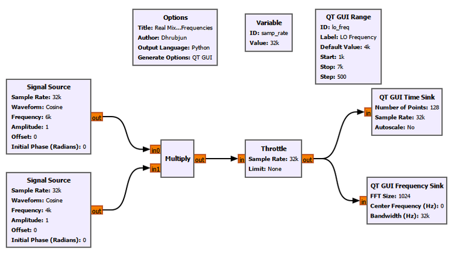
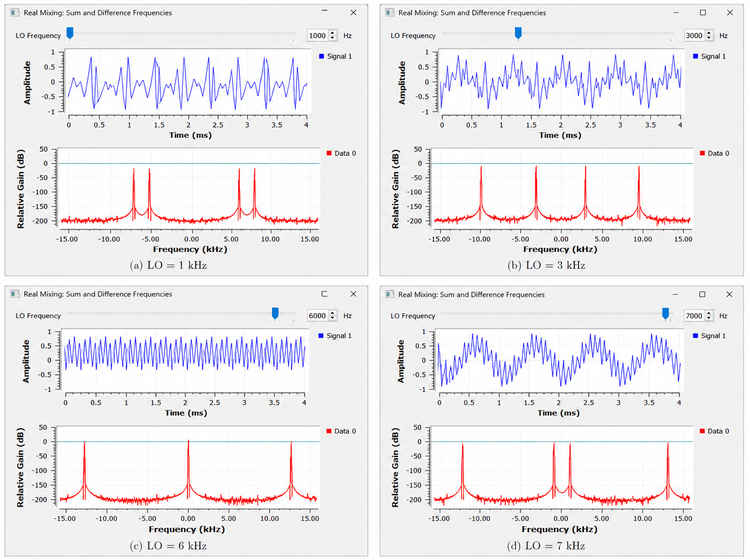
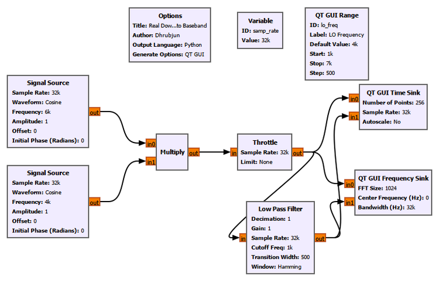
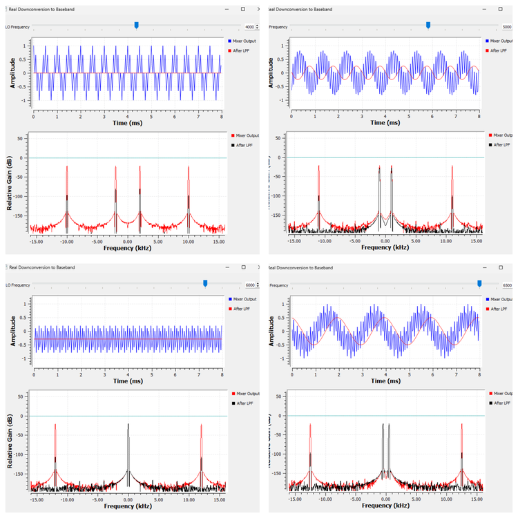
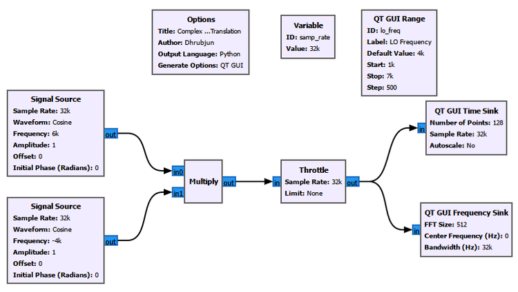
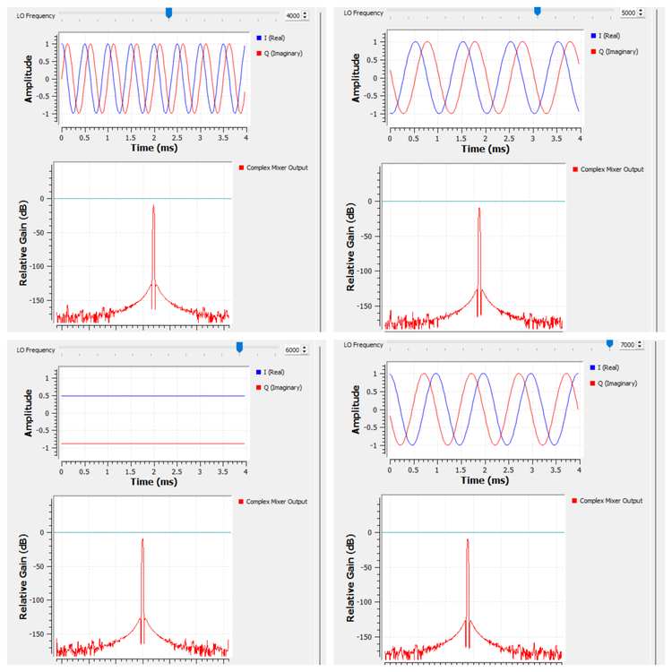
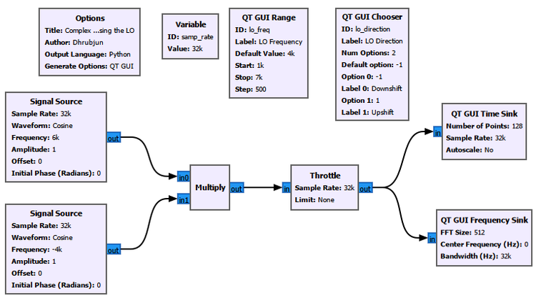
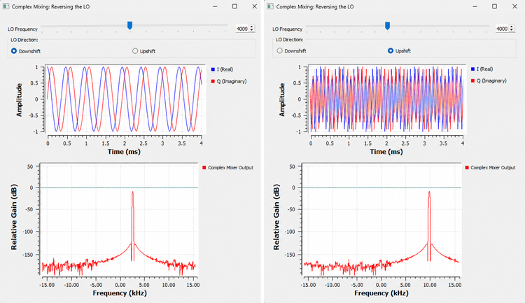

# Chapter 8: Mixing and Frequency Translation

In the previous chapters, we spent a lot of time looking at signals where they already were.

We generated tones, sampled them, looked at their spectra, added noise, measured power, and changed bandwidth.

But a radio receiver has another problem.

The signal we want may not be sitting at a convenient frequency.

Suppose a receiver is interested in a signal around 100 MHz. We may eventually want to filter it, demodulate it, measure it, or process its information digitally. Working directly at that frequency is not always the most convenient way to do those things.

So radios routinely do something that may seem strange at first:

> **They move signals from one frequency to another.**

A signal at one part of the spectrum can be shifted somewhere else while preserving the information carried by it.

This process is called **frequency translation**, and one of the main tools used to perform it is the **mixer**.

In this chapter, we will build that idea gradually.

We will begin with ordinary real cosine signals. That will immediately produce an interesting result: two new frequencies appear.

Then we will use one of those frequencies to understand downconversion and baseband.

After that, we will repeat the idea with complex signals and discover why complex mixing is so useful in SDR.

---

## 8.1 The Basic Problem

Imagine that we have a signal at

$$
f_{\text{signal}} = 6\text{ kHz}
$$

but we would rather process it near 1 kHz.

We need some operation that can move the signal.

At first, we might imagine simply changing its frequency somehow.

A mixer does something more specific.

It **multiplies one signal by another**.

The second signal is normally called the **local oscillator**, or **LO**.

So the basic structure is:

$$
\text{Signal} \times \text{Local Oscillator}
$$

The surprising part is what multiplication does in the frequency domain.

Let us see it before trying to explain it.

---

# Experiment 1: Real Mixing

## 8.2 Building a Real Mixer

We begin with two ordinary real cosine signals.

The first is our signal:

$$
f_{\text{signal}} = 6\text{ kHz}
$$

The second acts as the local oscillator:

$$
f_{\text{LO}} = 1\text{ kHz}
$$

Both signals have amplitude 1.

We multiply them using the GNU Radio **Multiply** block.

The flowgraph used for this experiment is shown below.



### GNU Radio Settings

Set the common sample rate to:

```text
samp_rate = 32000
```

For the first **Signal Source**:

| Setting | Value |
|---|---:|
| Output Type | Float |
| Sample Rate | `samp_rate` |
| Waveform | Cosine |
| Frequency | `6000` |
| Amplitude | `1` |
| Offset | `0` |
| Initial Phase | `0` |

For the LO **Signal Source**:

| Setting | Value |
|---|---:|
| Output Type | Float |
| Sample Rate | `samp_rate` |
| Waveform | Cosine |
| Frequency | `lo_freq` |
| Amplitude | `1` |
| Offset | `0` |
| Initial Phase | `0` |

Add a **QT GUI Range** for the LO frequency.

```text
ID: lo_freq
Label: LO Frequency
Default Value: 1000
Start: 1000
Stop: 7000
Step: 500
```

Connect the two Signal Sources to a **Multiply** block.

Send the mixer output through a **Throttle** block and then to:

- a QT GUI Time Sink
- a QT GUI Frequency Sink

For the Frequency Sink, use:

```text
Center Frequency: 0
Bandwidth: samp_rate
FFT Size: 1024
```

The important point is that everything in this first experiment is **real-valued**.

---

### GNU Radio Toolbox: Multiply

The **Multiply** block performs sample-by-sample multiplication.

If its two inputs are $x[n]$ and $y[n]$, its output is

$$
z[n] = x[n]y[n]
$$

That sounds simple, but multiplication has a very important consequence in the frequency domain.

We will use the Multiply block repeatedly in this chapter.

For the full block reference, see the GNU Radio Toolbox.

---

## 8.3 What Do We Expect?

Our two signals are

$$
x(t)=\cos(2\pi f_{\text{signal}}t)
$$

and

$$
l(t)=\cos(2\pi f_{\text{LO}}t)
$$

The mixer output is therefore

$$
y(t)=x(t)l(t)
$$

or

$$
y(t)=\cos(2\pi f_{\text{signal}}t)
\cos(2\pi f_{\text{LO}}t)
$$

Now we use the familiar trigonometric identity

$$
\cos A\cos B
=
\frac{1}{2}\cos(A-B)
+
\frac{1}{2}\cos(A+B)
$$

Therefore,

$$
y(t)
=
\frac{1}{2}
\cos\left(2\pi(f_{\text{signal}}-f_{\text{LO}})t\right)
+
\frac{1}{2}
\cos\left(2\pi(f_{\text{signal}}+f_{\text{LO}})t\right)
$$

This is the key result.

The mixer does not simply replace one frequency with another.

For real cosine mixing, it produces two components:

$$
f_{\text{difference}}
=
f_{\text{signal}}-f_{\text{LO}}
$$

and

$$
f_{\text{sum}}
=
f_{\text{signal}}+f_{\text{LO}}
$$

For our first case,

$$
f_{\text{signal}}=6\text{ kHz}
$$

and

$$
f_{\text{LO}}=1\text{ kHz}
$$

so

$$
f_{\text{difference}}
=
6-1
=
5\text{ kHz}
$$

while

$$
f_{\text{sum}}
=
6+1
=
7\text{ kHz}
$$

We therefore expect components at 5 kHz and 7 kHz.

Because the mixer output is real, each positive-frequency component also has its corresponding negative-frequency component.

So the complete two-sided spectrum contains peaks at approximately

$$
-7,\ -5,\ +5,\ +7\text{ kHz}
$$

That is exactly what we observe.

---

## 8.4 Moving the LO

The advantage of making `lo_freq` adjustable is that we can watch the mixer products move in real time.

The following figure compares several LO settings.



The input signal remains fixed at 6 kHz.

Only the LO changes.

### LO = 1 kHz

The difference frequency is

$$
6-1=5\text{ kHz}
$$

and the sum frequency is

$$
6+1=7\text{ kHz}
$$

### LO = 3 kHz

Now,

$$
6-3=3\text{ kHz}
$$

and

$$
6+3=9\text{ kHz}
$$

The two mixer products have moved.

### LO = 6 kHz

This case is especially important.

Now,

$$
6-6=0
$$

so the difference component reaches DC.

The other component is

$$
6+6=12\text{ kHz}
$$

This is our first glimpse of **downconversion to baseband**.

### LO = 7 kHz

Now the formal difference is

$$
6-7=-1\text{ kHz}
$$

while the sum is

$$
6+7=13\text{ kHz}
$$

For a real signal, however, the spectrum is mirrored about zero frequency. We therefore see energy at both $+1$ kHz and $-1$ kHz.

This is one reason why the sign of frequency becomes much more meaningful once we begin working with complex signals.

We will return to that shortly.

---

## 8.5 What Did the Mixer Actually Do?

The most important lesson from Experiment 1 is not simply that we obtained several FFT peaks.

It is this:

> **Multiplication in time can move spectral components in frequency.**

Changing the LO changes where the mixer products appear.

This is the basic mechanism behind frequency conversion.

The LO is therefore not the signal we ultimately care about.

It is a tool we use to reposition another signal.

---

## 8.6 Upconversion and Downconversion

Two words appear constantly in radio systems:

**upconversion** and **downconversion**.

If frequency translation moves the desired signal toward a higher frequency region, we call it **upconversion**.

If it moves the desired signal toward a lower frequency region, we call it **downconversion**.

For example, starting with a 6 kHz signal and using a 5 kHz LO gives a difference component at

$$
6-5=1\text{ kHz}
$$

We have moved one mixer product from 6 kHz down to 1 kHz.

That is downconversion.

But there is an important problem.

The real mixer also produces

$$
6+5=11\text{ kHz}
$$

So the mixer output contains both the component we want and another component that we may not want.

What do we do with the unwanted one?

We filter it.

That leads directly to our second experiment.

---

# Experiment 2: Real Downconversion to Baseband

## 8.7 Mixing Is Only Part of the Receiver

We now keep the input signal fixed at

$$
6\text{ kHz}
$$

and vary the LO around that frequency.

This time, however, we place a **Low Pass Filter** after the mixer.

The purpose is simple.

We want to keep the low-frequency difference component and reject the high-frequency sum component.

The GNU Radio flowgraph is shown below.



The first part of the flowgraph is familiar:

$$
\text{Signal} \rightarrow \text{Mixer}
$$

but now we add

$$
\text{Mixer} \rightarrow \text{Low Pass Filter}
$$

We observe both the raw mixer output and the filtered output.

---

## 8.8 GNU Radio Settings

Keep:

```text
samp_rate = 32000
```

The input Signal Source remains:

```text
Frequency: 6000
Amplitude: 1
Waveform: Cosine
```

The LO frequency is controlled using the QT GUI Range.

Useful values for this experiment include:

```text
4000 Hz
5000 Hz
5500 Hz
6000 Hz
6500 Hz
```

For the **Low Pass Filter**, use:

| Setting | Value |
|---|---:|
| Decimation | `1` |
| Gain | `1` |
| Sample Rate | `samp_rate` |
| Cutoff Frequency | `1000` |
| Transition Width | `500` |
| Window | Hamming |

Display the mixer output and the LPF output together so that we can compare them directly.

---

### GNU Radio Toolbox: Low Pass Filter

A **Low Pass Filter** allows low-frequency components to pass while attenuating components above its cutoff region.

Here we are not yet trying to study filter design in detail. That is the subject of the next chapter.

For now, the Low Pass Filter has one job:

> **Keep the low-frequency mixer product and suppress the high-frequency mixer product.**

The full Low Pass Filter reference is available in the GNU Radio Toolbox.

---

## 8.9 Predict Before Running

The difference frequency is

$$
f_{\text{difference}}
=
\left|f_{\text{signal}}-f_{\text{LO}}\right|
$$

for the real sinusoidal output we observe after mixing.

With the signal fixed at 6 kHz, we can predict:

| LO Frequency | Difference Component | Sum Component |
|---:|---:|---:|
| 4 kHz | 2 kHz | 10 kHz |
| 5 kHz | 1 kHz | 11 kHz |
| 5.5 kHz | 0.5 kHz | 11.5 kHz |
| 6 kHz | 0 Hz | 12 kHz |
| 6.5 kHz | 0.5 kHz | 12.5 kHz |

Now compare these frequencies with the low-pass filter.

The high-frequency sum component should be strongly suppressed.

The low-frequency difference component moves progressively toward DC as the LO approaches 6 kHz.

---

## 8.10 Watching the Signal Approach Baseband

The measured results are shown below.



This figure is worth studying carefully.

At an LO of 4 kHz, the difference component is still around 2 kHz. With our chosen low-pass filter, it lies outside the main passband and is strongly attenuated.

At 5 kHz,

$$
6-5=1\text{ kHz}
$$

so the difference component has reached the cutoff region.

At 5.5 kHz,

$$
6-5.5=0.5\text{ kHz}
$$

and the low-frequency component is clearly retained.

At 6 kHz,

$$
6-6=0
$$

The desired difference component has reached DC.

When the LO moves beyond the signal, for example to 6.5 kHz, the separation becomes 0.5 kHz again.

For a real mixer output, the sign information is not available in the same way that it is for a complex signal. A real cosine at $+0.5$ kHz and one at $-0.5$ kHz are not distinguishable as two different directions of spectral rotation.

This limitation becomes important later in the chapter.

---

## 8.11 What Is Baseband?

We have used the word **baseband**, so let us make sure it means something concrete.

A baseband signal is a signal represented around zero frequency rather than around some higher carrier frequency.

Suppose a radio signal is centred at

$$
f_c
$$

If we mix it with an appropriate LO, we can translate that signal so that its centre moves toward

$$
0\text{ Hz}
$$

The information has not necessarily disappeared.

We have changed **where that information sits in the spectrum**.

That is the important idea.

A receiver might therefore perform something conceptually like

$$
\text{RF signal}
\rightarrow
\text{Mixer}
\rightarrow
\text{Baseband}
\rightarrow
\text{Further processing}
$$

Once the signal is near baseband, many later operations become easier.

---

## 8.12 What Happens If the LO Is Not Exact?

Experiment 2 also gives us a useful way to understand **frequency offset**.

Suppose the desired signal is at

$$
6\text{ kHz}
$$

and we want to move it exactly to DC.

Ideally,

$$
f_{\text{LO}}=6\text{ kHz}
$$

Then,

$$
f_{\text{signal}}-f_{\text{LO}}=0
$$

But suppose the LO is actually

$$
5.5\text{ kHz}
$$

Then the difference becomes

$$
6-5.5=0.5\text{ kHz}
$$

The signal does not land at DC.

It lands 500 Hz away.

That remaining separation is a **frequency offset**.

This is not just a GNU Radio effect.

Real radios also have frequency errors. Oscillators are not perfectly exact, transmitters and receivers may not agree perfectly, and motion can introduce Doppler shifts.

So a signal that we expect at DC may appear slightly to one side.

---

## 8.13 A Problem With Real Mixing

At this point, real mixing seems to work quite well.

Why do SDR systems make such a big deal about complex signals?

Experiment 1 already gave us a clue.

A real cosine has two spectral components:

$$
+f
$$

and

$$
-f
$$

A real LO also has components at both positive and negative frequencies.

When we multiply them, both directions interact.

That is why real mixing naturally produces multiple mixer products.

There is another limitation.

When the LO moves from below the signal to above it, the difference frequency crosses through zero.

With real signals, the spectrum remains mirrored.

The sign of that frequency is therefore difficult to preserve as a unique piece of information.

Complex signals change this.

---

# Experiment 3: Complex Mixing and Frequency Translation

## 8.14 Moving From Real Signals to Complex Signals

Earlier in this book, we introduced I and Q and saw that a complex signal can be written as

$$
x(t)=I(t)+jQ(t)
$$

A complex exponential can be written as

$$
e^{j2\pi ft}
$$

Using Euler's relation,

$$
e^{j2\pi ft}
=
\cos(2\pi ft)
+
j\sin(2\pi ft)
$$

Unlike a real cosine, an ideal complex exponential can represent a **single signed frequency**.

That changes the behaviour of mixing dramatically.

Suppose our complex input is

$$
x(t)=e^{j2\pi f_{\text{signal}}t}
$$

and we multiply it by a complex LO rotating in the negative-frequency direction:

$$
l(t)=e^{-j2\pi f_{\text{LO}}t}
$$

Then

$$
y(t)
=
e^{j2\pi f_{\text{signal}}t}
e^{-j2\pi f_{\text{LO}}t}
$$

Using the exponent rule,

$$
e^Ae^B=e^{A+B}
$$

we obtain

$$
y(t)
=
e^{j2\pi(f_{\text{signal}}-f_{\text{LO}})t}
$$

Notice what is missing.

There is no second term at

$$
f_{\text{signal}}+f_{\text{LO}}
$$

We get a direct frequency translation.

That is the behaviour we want to observe.

---

## 8.15 GNU Radio Flowgraph

The flowgraph for complex mixing is shown below.



Use:

```text
samp_rate = 32000
```

Keep the complex signal at:

```text
Signal Frequency: 6000 Hz
```

Use the adjustable LO frequency:

```text
lo_freq
```

For this experiment, the LO is applied in the **negative-frequency direction**, so that the output follows

$$
f_{\text{out}}
=
f_{\text{signal}}-f_{\text{LO}}
$$

Observe:

- the I component
- the Q component
- the complex output spectrum

The I and Q traces allow us to see the complex tone in the time domain, while the Frequency Sink shows where the signed frequency lies.

---

## 8.16 Predict the Translation

The signal remains fixed at

$$
f_{\text{signal}}=6\text{ kHz}
$$

Therefore,

$$
f_{\text{out}}
=
6\text{ kHz}-f_{\text{LO}}
$$

Consider four LO values.

### LO = 4 kHz

$$
f_{\text{out}}
=
6-4
=
+2\text{ kHz}
$$

### LO = 5 kHz

$$
f_{\text{out}}
=
6-5
=
+1\text{ kHz}
$$

### LO = 6 kHz

$$
f_{\text{out}}
=
6-6
=
0
$$

### LO = 7 kHz

$$
f_{\text{out}}
=
6-7
=
-1\text{ kHz}
$$

This is the behaviour we were unable to see cleanly with the real mixer.

The signal can pass through DC and continue into **negative frequency**.

---

## 8.17 What We Observe

The four cases are shown below.



The spectrum behaves exactly as predicted.

At 4 kHz LO, the output lies around

$$
+2\text{ kHz}
$$

At 5 kHz LO, it moves to

$$
+1\text{ kHz}
$$

At 6 kHz LO, it reaches

$$
0\text{ Hz}
$$

and at 7 kHz LO, it continues to

$$
-1\text{ kHz}
$$

There is no mirrored partner automatically appearing on the other side in the way we saw for a real cosine.

This is one of the most important reasons complex I/Q signals are so useful in SDR.

---

## 8.18 What Happens to I and Q at DC?

The 6 kHz LO case deserves special attention.

When

$$
f_{\text{signal}}=f_{\text{LO}}
$$

we obtain

$$
f_{\text{out}}=0
$$

A zero-frequency complex exponential does not rotate.

Since

$$
e^{j0}=1
$$

the I and Q values become constant rather than continuing to oscillate.

The exact constant values depend on the phases and amplitudes used in the flowgraph, but the important observation is this:

> **When a complex tone is translated exactly to DC, its rotating I/Q vector stops rotating.**

That is why the time-domain traces become horizontal in the DC case.

This connects directly to the rotating-vector picture of I/Q that we developed earlier.

---

## 8.19 Positive and Negative Frequency Revisited

Negative frequency can sound like an abstract mathematical trick until we perform this experiment.

Here it becomes much more concrete.

Consider

$$
e^{j2\pi ft}
$$

and

$$
e^{-j2\pi ft}
$$

Both have ordinary sinusoidal I and Q components.

The difference is their direction of rotation in the complex plane.

One rotates one way.

The other rotates the opposite way.

So when the translated signal moves from

$$
+1\text{ kHz}
$$

through

$$
0
$$

to

$$
-1\text{ kHz}
$$

the physical interpretation is not that time or frequency somehow becomes negative.

Instead, the **complex rotation reverses direction**.

That distinction is invisible if we keep only a single real cosine.

It becomes visible when we retain both I and Q.

---

## 8.20 Why Real and Complex Mixing Look So Different

We can now compare the two cases directly.

For real mixing,

$$
\cos(2\pi f_1t)\cos(2\pi f_2t)
$$

produces

$$
\frac{1}{2}\cos\left(2\pi(f_1-f_2)t\right)
+
\frac{1}{2}\cos\left(2\pi(f_1+f_2)t\right)
$$

So we obtain both a sum and a difference term.

For ideal complex mixing,

$$
e^{j2\pi f_1t}
e^{j2\pi f_2t}
$$

gives

$$
e^{j2\pi(f_1+f_2)t}
$$

and

$$
e^{j2\pi f_1t}
e^{-j2\pi f_2t}
$$

gives

$$
e^{j2\pi(f_1-f_2)t}
$$

There is no trigonometric splitting into two cosine terms.

The sign of the complex LO determines the translation direction.

This is powerful enough that we should test it directly.

---

# Experiment 4: Reversing the Complex LO

## 8.21 Can We Choose the Direction?

For the final experiment, we keep the signal fixed at

$$
+6\text{ kHz}
$$

and the LO magnitude fixed at

$$
4\text{ kHz}
$$

This time, instead of sweeping only the LO magnitude, we allow ourselves to reverse its sign.

We add a **QT GUI Chooser** with two options:

```text
Downshift
Upshift
```

The flowgraph is shown below.



---

## 8.22 GNU Radio Settings

Create a QT GUI Chooser with:

| Setting | Value |
|---|---|
| ID | `lo_direction` |
| Label | `LO Direction` |
| Type | Integer |
| Num Options | `2` |
| Default Option | `-1` |
| Option 0 | `-1` |
| Label 0 | `Downshift` |
| Option 1 | `1` |
| Label 1 | `Upshift` |
| Widget | Radio Buttons |
| Orientation | Horizontal |

One small detail is important here.

The **Default Option** is an actual option value, not the position of the option in the list.

Since our available values are

```text
-1
1
```

the default must be one of those values.

Using `0` would not be valid.

Set the LO Signal Source frequency using:

```text
lo_direction * lo_freq
```

with

```text
lo_freq = 4000
```

Now the same control can generate either

$$
-4\text{ kHz}
$$

or

$$
+4\text{ kHz}
$$

as the complex LO frequency.

---

### GNU Radio Toolbox: QT GUI Chooser

The **QT GUI Chooser** lets us select one value from a predefined set while the flowgraph is running.

Here we use it to choose between:

```text
-1
```

and

```text
+1
```

Those values multiply the LO frequency and therefore reverse the sign of the complex oscillator.

A chooser is useful when the variable should take only a small number of known states rather than vary continuously.

For the complete reference, see the GNU Radio Toolbox.

---

## 8.23 Downshift

First select:

```text
Downshift
```

Then,

$$
\text{lo\_direction}=-1
$$

so the actual LO frequency becomes

$$
f_{\text{LO}}
=
-1\times4\text{ kHz}
=
-4\text{ kHz}
$$

The input is at

$$
+6\text{ kHz}
$$

Therefore,

$$
f_{\text{out}}
=
6+(-4)
=
+2\text{ kHz}
$$

The Frequency Sink shows a single peak at approximately

$$
+2\text{ kHz}
$$

The I and Q traces also oscillate at the translated frequency.

---

## 8.24 Upshift

Now select:

```text
Upshift
```

Nothing else changes.

This time,

$$
\text{lo\_direction}=+1
$$

and therefore

$$
f_{\text{LO}}
=
+4\text{ kHz}
$$

The output becomes

$$
f_{\text{out}}
=
6+4
=
+10\text{ kHz}
$$

The single spectral peak moves from approximately

$$
+2\text{ kHz}
$$

to

$$
+10\text{ kHz}
$$

The two cases are shown side by side below.



This experiment makes the role of the LO sign very clear.

With the negative complex LO,

$$
6\text{ kHz}
\rightarrow
2\text{ kHz}
$$

With the positive complex LO,

$$
6\text{ kHz}
\rightarrow
10\text{ kHz}
$$

We are not generating both results simultaneously.

We are choosing the direction of translation.

---

## 8.25 The Big Difference Between Real and Complex Mixing

We can now summarize the distinction that has been developing throughout the chapter.

### Real Mixing

With a real signal and a real LO, multiplication produces sum and difference components.

For example,

$$
6\text{ kHz}\times4\text{ kHz}
$$

produces components associated with

$$
6-4=2\text{ kHz}
$$

and

$$
6+4=10\text{ kHz}
$$

Because the resulting signal is real, its spectrum also has the corresponding negative-frequency mirror components.

### Complex Mixing

With complex exponentials, frequency translation behaves more directly.

Using a negative 4 kHz complex LO gives

$$
6+(-4)=2\text{ kHz}
$$

Using a positive 4 kHz complex LO gives

$$
6+4=10\text{ kHz}
$$

The sign of the complex oscillator determines which way the spectrum moves.

That is why complex mixing is such a natural operation in SDR.

---

## 8.26 A Useful Mental Picture

There are several equations in this chapter, but there is a simple picture worth keeping in mind.

Imagine the frequency axis as a ruler.

Your signal is sitting somewhere on that ruler.

Complex mixing shifts the signal along the ruler.

If we multiply by

$$
e^{j2\pi f_{\text{LO}}t}
$$

the spectrum shifts by

$$
+f_{\text{LO}}
$$

If we multiply by

$$
e^{-j2\pi f_{\text{LO}}t}
$$

the spectrum shifts by

$$
-f_{\text{LO}}
$$

So, in a simplified form,

$$
f_{\text{out}}
=
f_{\text{in}}
+
f_{\text{LO}}
$$

where the sign of $f_{\text{LO}}$ matters.

For example,

$$
6+(-4)=2
$$

while

$$
6+(+4)=10
$$

This is often easier to remember than thinking separately about "upconversion" and "downconversion."

The LO simply tells the spectrum how far, and in which direction, to move.

---

## 8.27 What Does the Local Oscillator Actually Mean in a Receiver?

The word **local oscillator** comes from radio hardware.

A receiver generates an oscillator locally and combines it with the incoming signal in a mixer.

Conceptually,

$$
\text{Received signal}
+
\text{Local oscillator}
\rightarrow
\text{Mixer}
$$

although the actual mixer operation is multiplication, not addition.

The LO frequency determines where signals move after mixing.

Suppose a receiver contains a signal centred at

$$
100.1\text{ MHz}
$$

and we want to translate it to baseband.

In an idealized complex receiver, we can use an appropriate complex LO so that the centre frequency is shifted by approximately

$$
-100.1\text{ MHz}
$$

Then,

$$
100.1\text{ MHz}
-
100.1\text{ MHz}
=
0
$$

The signal that was centred around 100.1 MHz is now centred around DC.

Its information has not been thrown away simply because its centre frequency moved.

The spectrum has been translated.

---

## 8.28 What Happens Inside an SDR?

This idea becomes particularly important when using SDR hardware.

Suppose an SDR is tuned to a radio frequency $f_c$.

The hardware can use oscillators and mixers to translate a region around that RF frequency into a complex I/Q signal that can be sampled by the ADC and processed digitally.

Once we are working digitally, further frequency translation can also be performed mathematically.

A digital complex mixer can multiply the sampled signal by a complex oscillator.

So the same idea appears both in hardware and software:

$$
\text{frequency translation}
=
\text{signal}\times\text{oscillator}
$$

GNU Radio lets us see this operation directly rather than hiding it inside a radio.

---

## 8.29 Mistuning the LO

Now suppose we intend to translate a signal exactly to DC.

The desired signal is at

$$
f_{\text{signal}}
$$

and ideally we use

$$
f_{\text{LO}}=-f_{\text{signal}}
$$

Then,

$$
f_{\text{out}}=0
$$

But if the LO is slightly wrong,

$$
f_{\text{LO}}
=
-f_{\text{signal}}+\Delta f
$$

then

$$
f_{\text{out}}
=
f_{\text{signal}}
+
\left(-f_{\text{signal}}+\Delta f\right)
$$

so

$$
f_{\text{out}}=\Delta f
$$

The remaining frequency is exactly the offset between the desired tuning and the actual tuning.

This gives us a useful interpretation:

> **A tone near DC after downconversion may represent a frequency mismatch between the received signal and the LO.**

In an I/Q display, that offset appears as continued rotation.

At exact tuning, the complex tone reaches DC and stops rotating.

With a small frequency offset, it rotates slowly.

With a larger offset, it rotates faster.

This connects frequency translation, negative frequency, and the rotating I/Q vector into one picture.

---

## 8.30 Now Break the Flowgraph

The experiments in this chapter become even more useful when we deliberately change things.

### Put the LO Below the Signal

Keep the signal at 6 kHz and use a negative complex LO with magnitude less than 6 kHz.

For example,

$$
f_{\text{LO}}=-4\text{ kHz}
$$

The result is

$$
f_{\text{out}}=+2\text{ kHz}
$$

### Match the LO Exactly

Use

$$
f_{\text{LO}}=-6\text{ kHz}
$$

Now,

$$
f_{\text{out}}=0
$$

Watch both the Frequency Sink and the I/Q traces.

The spectral peak reaches DC and the complex rotation stops.

### Move Past the Signal

Increase the magnitude of the negative LO to 7 kHz.

Then,

$$
f_{\text{out}}
=
6-7
=
-1\text{ kHz}
$$

The signal crosses through DC and appears at negative frequency.

### Reverse the Complex LO

Change from

$$
-4\text{ kHz}
$$

to

$$
+4\text{ kHz}
$$

The output moves from

$$
+2\text{ kHz}
$$

to

$$
+10\text{ kHz}
$$

### Mistune the LO Slightly

Try to bring the 6 kHz signal to DC, but set the LO to something such as

$$
-5.9\text{ kHz}
$$

The output should remain approximately

$$
+100\text{ Hz}
$$

away from DC.

This is a simple way to create a controlled frequency offset.

---

## 8.31 What We Learned

We began this chapter with a simple question:

> **How does a radio move a signal from one frequency to another?**

The answer is mixing.

A mixer multiplies a signal by an oscillator.

For real cosine mixing, this multiplication produces both sum and difference frequencies:

$$
f_{\text{sum}}
=
f_{\text{signal}}+f_{\text{LO}}
$$

and

$$
f_{\text{difference}}
=
f_{\text{signal}}-f_{\text{LO}}
$$

By selecting the low-frequency difference component with a filter, we can downconvert a signal toward baseband.

When the signal and LO frequencies match, the difference component reaches DC.

If they do not match exactly, the remaining difference appears as a frequency offset.

Complex mixing gives us more control.

A complex exponential represents a signed frequency, so multiplying by a complex oscillator can translate a spectrum directly in one direction.

With

$$
f_{\text{signal}}=+6\text{ kHz}
$$

and

$$
f_{\text{LO}}=-4\text{ kHz}
$$

we obtain

$$
f_{\text{out}}=+2\text{ kHz}
$$

while reversing the LO to

$$
f_{\text{LO}}=+4\text{ kHz}
$$

gives

$$
f_{\text{out}}=+10\text{ kHz}
$$

We also saw what happens when a complex signal crosses DC.

Positive and negative frequency are not simply duplicate FFT labels for a complex signal. They represent opposite directions of complex rotation.

That is why I/Q representation and complex mixing are so closely connected.

---

## 8.32 One Last Question

We now know how to move a signal.

But moving a signal does not automatically isolate it.

A real receiver may contain many signals at different frequencies.

After mixing, some of those signals may move into regions we do not want. Mixer products may also remain. Noise is still present.

So the next problem is:

> **How can the receiver keep the part of the spectrum it wants and reject the rest?**

We already used a Low Pass Filter briefly in this chapter to keep a difference component.

But we treated the filter almost like a black box.

In the next chapter, we will open that box.

We will look at low-pass, high-pass, band-pass, and band-stop filters, and see what cutoff frequency, transition width, passband, stopband, filter order, and decimation actually do to a signal.

That takes us to:

# Chapter 9: Filters and Channel Selection