# Chapter 9: Filters and Channel Selection

## 9.1 Why Do We Need Filters?

So far, we have spent a lot of time learning how signals look in the time domain and frequency domain. We have generated tones, added signals together, looked at FFTs, changed sample rates, and moved signals around the spectrum.

But a receiver has another problem.

It usually receives much more than the signal we actually want.

Imagine that our receiver contains three signals:

- one at 2 kHz,

- one at 5 kHz,

- one at 9 kHz.

Suppose we are interested only in the 2 kHz signal.

How do we keep it while rejecting the others?

Or suppose we want only the 5 kHz signal.

Or perhaps the 5 kHz signal is interference and we want everything except that signal.

This is where filters become useful.

A filter is not simply something that "removes noise." That description is too limited.

A better way to think about a filter is:

> ****A filter treats different parts of the frequency spectrum differently.****

Some frequencies are allowed through almost unchanged. Others are reduced, sometimes very strongly.

In this chapter, we will build a multi-frequency signal in GNU Radio and gradually learn how to control its spectrum.

We will work with:

- low-pass filters,

- high-pass filters,

- band-pass filters,

- band-reject filters,

- cutoff frequencies,

- passbands and stopbands,

- transition width,

- FIR filter taps,

- filter windows,

- decimation,

- anti-alias filtering.

Most importantly, we will not study these ideas only as equations.

We will watch them happen.

---

## 9.2 Our Test Signal

We need a signal containing several frequencies so that there is actually something for our filters to separate.

For most of this chapter, we will use three cosine signals:

$$
x_1(t)=\cos(2\pi 2000t)
$$

$$
x_2(t)=\cos(2\pi 5000t)
$$

$$
x_3(t)=\cos(2\pi 9000t)
$$

and add them together:

$$
x(t)=x_1(t)+x_2(t)+x_3(t)
$$

Therefore,

$$
x(t) = \cos(2\pi 2000t) \+ \cos(2\pi 5000t) \+ \cos(2\pi 9000t)
$$

We will use a sample rate of

$$
f_s=32\\,000\text{ samples/s}
$$

or

$$
f_s=32\text{ kS/s}
$$

The Nyquist frequency is therefore

$$
f_N=\frac{f_s}{2}=16\text{ kHz}
$$

All three signals are below 16 kHz, so they can be represented correctly at this sample rate.

---

## Experiment 1: Building a Multi-Frequency Signal

## 9.3 Building the Test Signal in GNU Radio

Before filtering anything, let us first see what happens when several sinusoidal signals are added together.

Build the flowgraph using:

- three ****Signal Source**** blocks,

- one ****Add**** block,

- one ****Throttle**** block,

- one ****QT GUI Time Sink****,

- one ****QT GUI Frequency Sink****.

Use the following global sample rate:

```text
samp_rate = 32k
```

Configure the three Signal Source blocks as follows.

### Signal Source 1

```text
Sample Rate:    samp_rate

Waveform:       Cosine

Frequency:      2k

Amplitude:      1

Offset:         0

Initial Phase:  0
```

### Signal Source 2

```text
Sample Rate:    samp_rate

Waveform:       Cosine

Frequency:      5k

Amplitude:      1

Offset:         0

Initial Phase:  0
```

### Signal Source 3

```text
Sample Rate:    samp_rate

Waveform:       Cosine

Frequency:      9k

Amplitude:      1

Offset:         0

Initial Phase:  0
```

Connect all three Signal Sources to the Add block.

Then connect the combined signal to the Time Sink and Frequency Sink.

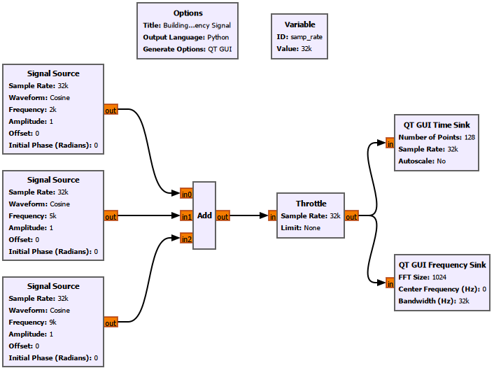

## 9.4 What Do We See?

The time-domain waveform does not look like a simple sine wave anymore.

That is expected.

We are looking at three sinusoids added together. At some instants they reinforce each other, while at other instants they partially cancel.

The frequency-domain view is much easier to interpret.

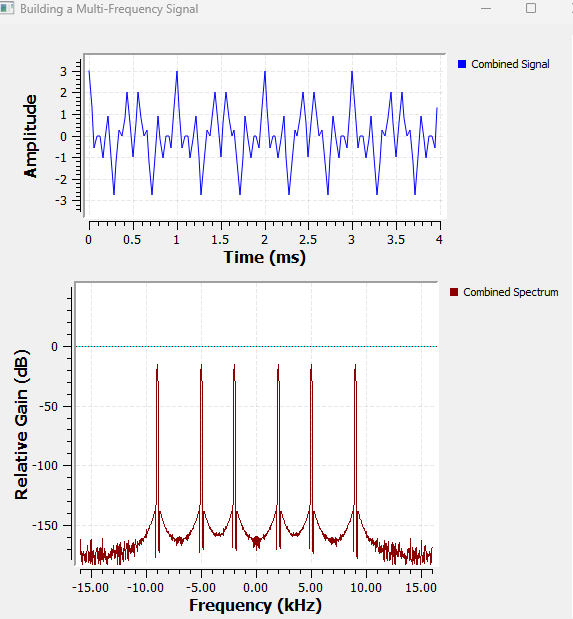

We see spectral components at approximately

$$
\pm2\text{ kHz},\quad \pm5\text{ kHz},\quad \pm9\text{ kHz}
$$

Why do we see both positive and negative frequencies?

Because these are real cosine signals. As we saw earlier, a real cosine contains two complex exponential components:

$$
\cos(2\pi f_0t) = \frac{1}{2}e^{j2\pi f_0t} \+ \frac{1}{2}e^{-j2\pi f_0t}
$$

So each cosine produces a pair of spectral components at

$$
+f_0
$$

and

$$
-f_0
$$

Our job now is to selectively keep or reject some of these frequency components.

---

## 9.5 What Does a Filter Actually Do?

Suppose our input signal is represented in the frequency domain as

$$
X(f)
$$

A filter has its own frequency response,

$$
H(f)
$$

The output spectrum is

$$
Y(f)=X(f)H(f)
$$

This equation captures the main idea of filtering.

The filter multiplies different parts of the input spectrum by different amounts.

If

$$
|H(f)|\approx1
$$

that frequency passes through almost unchanged.

If

$$
|H(f)|\approx0
$$

that frequency is strongly suppressed.

The region that is allowed through is called the ****passband****.

The region that is strongly attenuated is called the ****stopband****.

Between them lies the ****transition band****.

Real filters do not normally change from perfect transmission to perfect rejection at one infinitely sharp frequency. There is always some transition.

We will see this directly in GNU Radio.

---

## Experiment 2: Low-Pass Filtering

## 9.6 Keeping the Lowest-Frequency Component

Suppose we want to keep the lowest-frequency signal and reject the higher-frequency components.

That is exactly what a low-pass filter is designed to do.

A low-pass filter passes low frequencies and attenuates frequencies above its cutoff region.

For this experiment, use a cutoff frequency of

$$
f_c=3\text{ kHz}
$$

Our signals are at

$$
2,\quad5,\quad9\text{ kHz}
$$

Therefore, we expect the 2 kHz component to survive while the 5 kHz and 9 kHz components are strongly attenuated.

## 9.7 GNU Radio Setup

Add a ****Low Pass Filter**** block after the combined signal.

Use:

```text
FIR Type:          Float -> Float (Decimating)

Decimation:        1

Gain:              1

Sample Rate:       samp_rate

Cutoff Freq:       3000

Transition Width:  500

Window:            Hamming
```

Compare the signal before and after the filter using both the Time Sink and Frequency Sink.

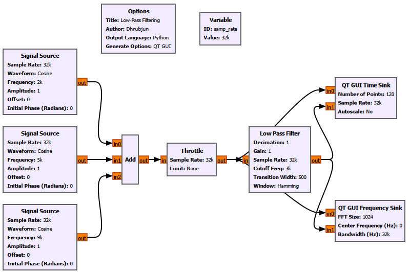

---

## 9.8 Low Pass Filter Settings That Matter Here

We have already used the Low Pass Filter in earlier chapters. Here, for the first time, its design parameters themselves become part of what we are trying to understand.

### FIR Type

This determines the input and output sample types and the way the filter operates.

For our real-valued cosine signals, we use:

```text
Float -> Float
```

### Decimation

Decimation reduces the output sample rate.

For now:

```text
Decimation = 1
```

so the sample rate does not change.

Later in this chapter, we will deliberately change this value.

### Gain

Gain scales the filter output.

We use:

```text
Gain = 1
```

so the filter does not intentionally amplify or reduce the passband signal.

### Sample Rate

This tells GNU Radio the sampling frequency used to design the filter.

For our experiment:

```text
Sample Rate = samp_rate
```

where

$$
f_s=32\text{ kS/s}
$$

### Cutoff Frequency

The cutoff frequency defines the approximate edge of the low-pass region.

We use:

```text
Cutoff Freq = 3000
```

or

$$
f_c=3\text{ kHz}
$$

The 2 kHz signal therefore lies inside the passband.

The 5 kHz and 9 kHz signals lie beyond it.

### Transition Width

We use:

```text
Transition Width = 500
```

or

$$
\Delta f=500\text{ Hz}
$$

The transition width tells the filter how quickly it must move from the passband toward the stopband.

A smaller transition width requires a sharper filter.

We will investigate this properly later.

### Window

We use:

```text
Window = Hamming
```

The window affects the FIR filter design, including its transition behaviour, stopband attenuation, and number of taps.

We will return to this later.

---

## 9.9 Low-Pass Filter Result

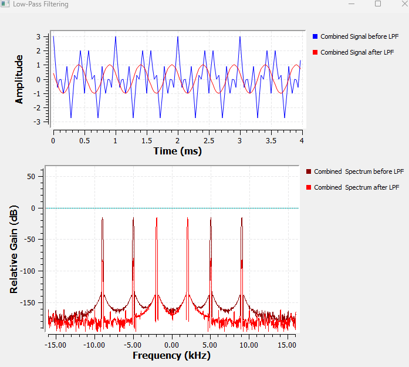

The result is much easier to understand in the frequency domain.

Before filtering, the spectrum contains

$$
\pm2,\quad\pm5,\quad\pm9\text{ kHz}
$$

After the low-pass filter, the 2 kHz component remains while the 5 kHz and 9 kHz components are heavily attenuated.

The time-domain waveform also becomes much simpler.

Instead of the complicated three-tone waveform, the output now resembles a single 2 kHz sinusoid.

This gives us an important observation:

> ****Filtering is often easier to understand in the frequency domain than in the time domain.****

Also notice that the unwanted components do not necessarily disappear completely.

They are attenuated.

That distinction matters.

A practical filter changes different frequencies by different amounts rather than simply deleting them.

---

## Experiment 3: High-Pass Filtering

## 9.10 Keeping the Highest-Frequency Component

Now let us do the opposite.

Instead of keeping the low-frequency signal, suppose we want to keep the high-frequency part of the spectrum.

A ****high-pass filter**** attenuates frequencies below its cutoff region and passes frequencies above it.

For our three-tone signal, we choose the filter so that the 9 kHz component remains while the 2 kHz and 5 kHz components are strongly reduced.

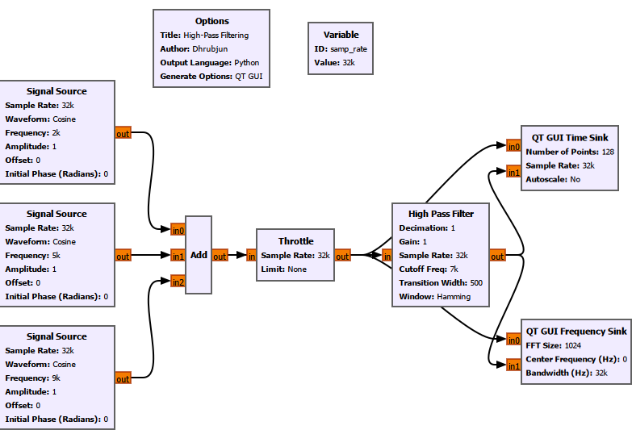

The before-and-after result is shown below.

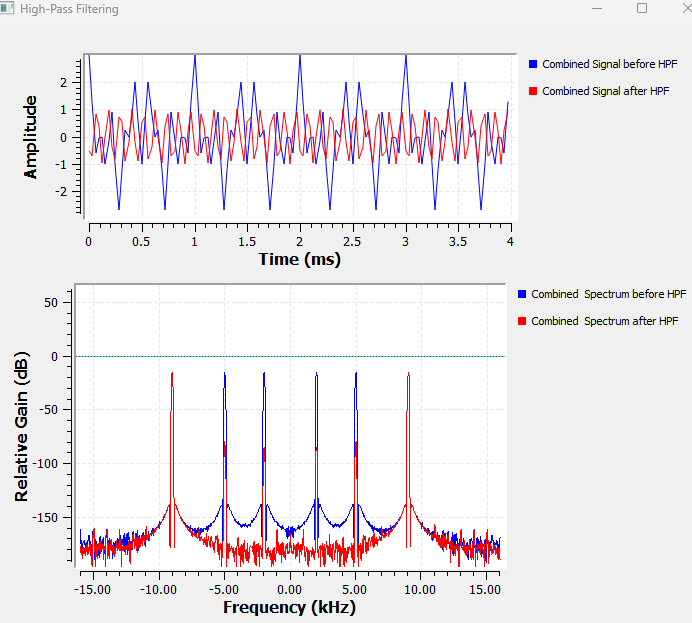

The lower-frequency components are strongly attenuated while the 9 kHz component remains.

The time-domain result also changes.

Since the surviving sinusoid is at a much higher frequency than the 2 kHz signal from the previous experiment, many more cycles appear inside the same time window.

The low-pass and high-pass filters are not fundamentally different mathematical operations.

Both are FIR filters.

What changes is their frequency response.

For a low-pass filter,

$$
|H(f)|
$$

is large at low frequencies and small at high frequencies.

For a high-pass filter, the opposite is true.

---

## Experiment 4: Band-Pass Filtering and Channel Selection

## 9.11 What If the Desired Signal Is in the Middle?

Low-pass and high-pass filters are convenient when the signal we want lies near one side of the spectrum.

But what if the signal we want lies in the middle?

Suppose our desired signal is the 5 kHz tone.

Our spectrum contains

$$
2,\quad5,\quad9\text{ kHz}
$$

A low-pass filter would keep the 2 kHz component as well.

A high-pass filter would tend to keep the 9 kHz component.

What we want is a filter that passes only a selected range around 5 kHz.

That is a ****band-pass filter****.

A band-pass filter passes frequencies between two frequency boundaries.

We can think of its desired passband as

$$
f_L < |f| < f_H
$$

where

- $f_L$ is the lower cutoff frequency,

- $f_H$ is the upper cutoff frequency.

For this experiment, we choose the passband so that the 5 kHz signal lies inside it while the 2 kHz and 9 kHz signals lie outside.

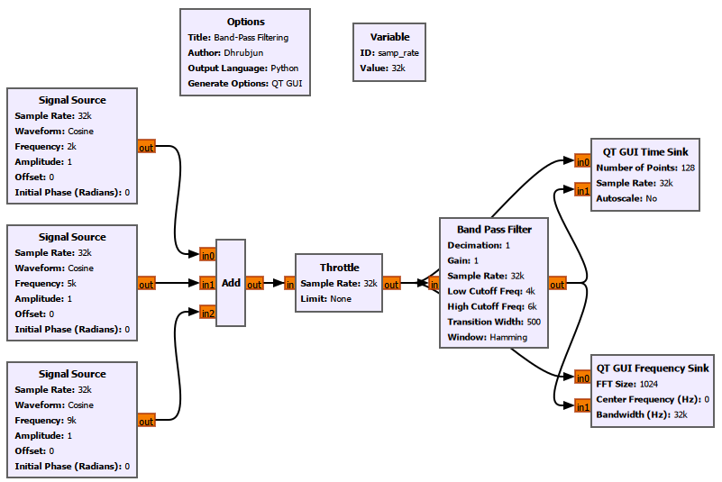

The result is shown below.

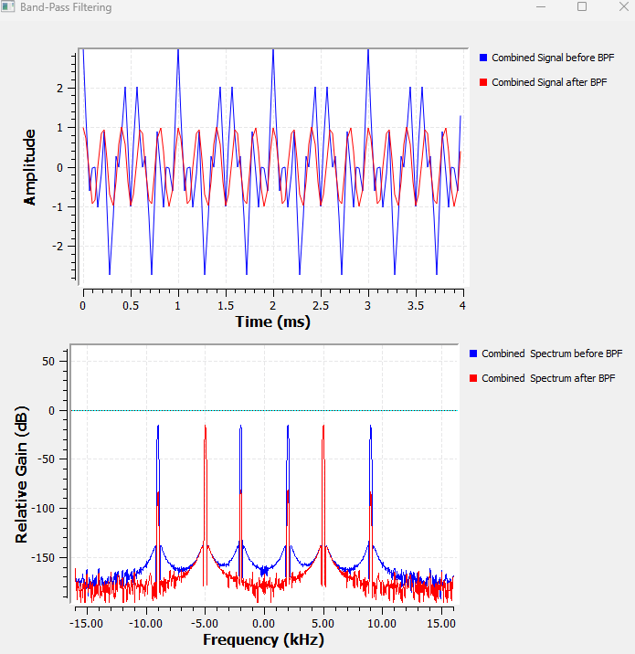

The filter has isolated the middle-frequency component.

The spectrum after filtering contains the real-signal pair around

$$
\pm5\text{ kHz}
$$

while the 2 kHz and 9 kHz components are strongly attenuated.

This is our first clear example of ****channel selection****.

---

## 9.12 Channel Selection in a Receiver

Imagine several radio channels occupying different frequency regions.

The antenna may receive all of them at once.

The receiver does not magically receive only the station we selected.

Instead, the receiver performs operations such as:

1\. frequency translation,

2\. filtering,

3\. sample-rate reduction,

4\. demodulation.

The mixing experiments from the previous chapter and the filtering experiments in this chapter therefore fit together.

A signal can first be translated to a convenient frequency and then filtered so that only the desired channel remains.

Conceptually:

```text
RF spectrum
    ↓
Frequency translation
    ↓
Channel filter
    ↓
Desired signal
```

This is one of the central ideas behind software-defined radio.

---

## Experiment 5: Band-Reject Filtering

## 9.13 Removing One Frequency Region Instead

Sometimes the problem is reversed.

We do not want to keep one particular band.

We want to remove it.

Suppose the 5 kHz component is interference and we want to retain the 2 kHz and 9 kHz components.

A ****band-reject filter****, also called a ****band-stop filter****, suppresses frequencies within a selected range while allowing frequencies outside that range to remain.

If the rejected band is very narrow, the filter is often called a ****notch filter****.

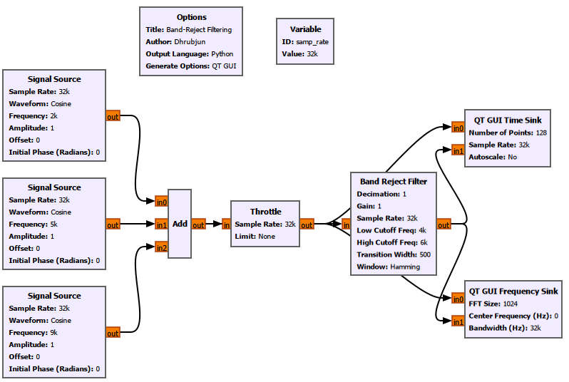

The result is shown below.

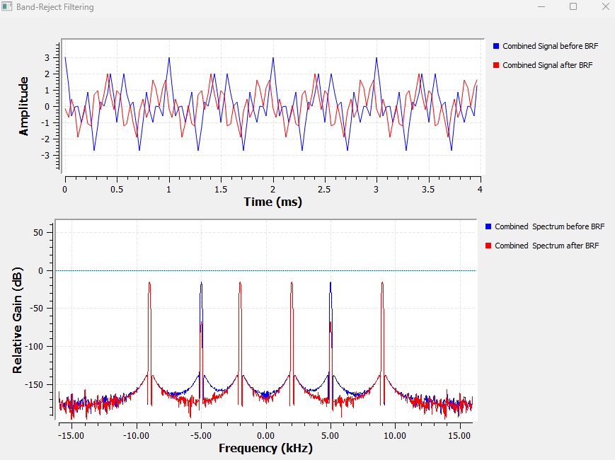

The 5 kHz component is strongly attenuated, while the 2 kHz and 9 kHz components remain.

The time-domain waveform is still relatively complicated because more than one frequency component survives.

This is a useful reminder that frequency-domain plots often reveal the action of a filter more clearly than the time-domain waveform.

---

## 9.14 Four Filters, One Basic Idea

At this point we have used four common filter types.

| Filter | What it does |

|---|---|

| Low-pass | Keeps lower-frequency components |

| High-pass | Keeps higher-frequency components |

| Band-pass | Keeps a selected frequency band |

| Band-reject | Rejects a selected frequency band |

Their shapes are different, but the underlying idea is the same:

$$
Y(f)=X(f)H(f)
$$

The filter determines which parts of the input spectrum survive.

But we have been hiding an important detail.

How sharp can the boundary between passband and stopband actually be?

---

## Experiment 6: Understanding Transition Width

## 9.15 Real Filters Are Not Brick Walls

An ideal low-pass filter might be written as

An ideal low-pass filter would have

$$
H(f)=1 \quad 	ext{for } |f|\leq f_c
$$

and

$$
H(f)=0 \quad 	ext{for } |f|>f_c
$$

This describes an infinitely sharp boundary.

Everything below the cutoff passes.

Everything above it disappears immediately.

A practical finite-length FIR filter cannot behave exactly like this.

Instead, the response changes gradually between the passband and stopband.

That region is the ****transition band****.

The width of this region is called the ****transition width****.

We can write it conceptually as

$$
\Delta f=f_{\text{stop}}-f_{\text{pass}}
$$

A narrow transition width means the filter must change rapidly.

A wide transition width allows the change to happen more gradually.

---

## 9.16 Making the Transition Width Visible

For this experiment, we return to the low-pass filter.

To make the effect easier to see, we move one of our tones closer to the cutoff.

Instead of the original 2 kHz tone, we use a 3.5 kHz tone.

The test frequencies therefore become approximately

$$
3.5,\quad5,\quad9\text{ kHz}
$$

while the low-pass cutoff remains

$$
f_c=3\text{ kHz}
$$

This places the 3.5 kHz component close to the filter edge, where the transition width matters.

We keep:

```text
Sample Rate:       32k

Cutoff Frequency:  3k

Window:            Hamming
```

and make the transition width adjustable using a ****QT GUI Range****.

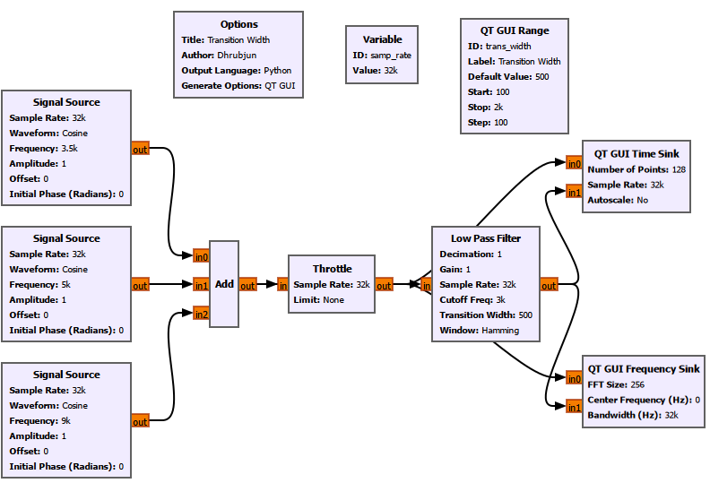

We tested values including:

```text
100 Hz

500 Hz

1000 Hz

2000 Hz
```

The comparison between narrow and wide transition widths is shown below.

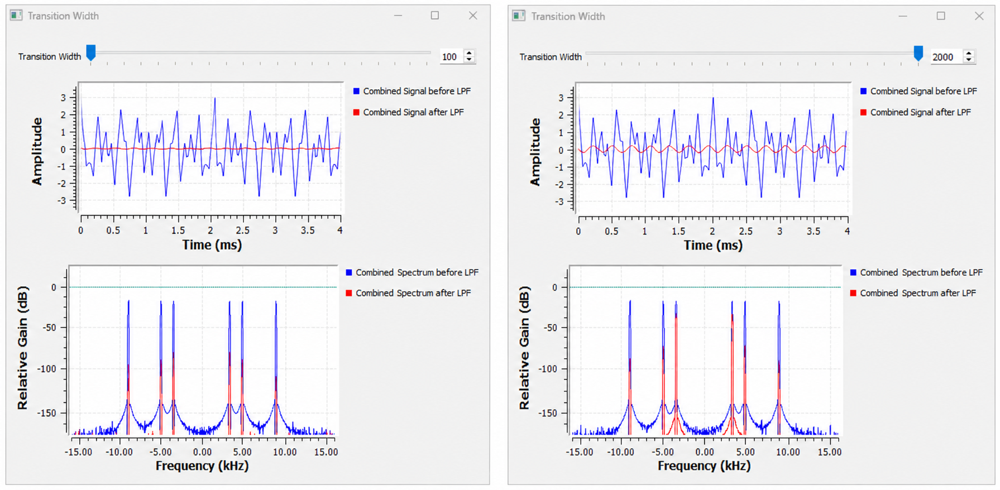

With a narrow transition width, the 3.5 kHz component is already well into the rejected region and is strongly attenuated.

With a much wider transition width, the 3.5 kHz component lies inside the broader transition region and is attenuated less strongly.

This gives us a much better mental picture of what transition width means.

It is not simply another number in the GNU Radio properties window.

It controls how quickly the filter moves from passing frequencies to rejecting them.

---

## 9.17 Why Not Always Use an Extremely Narrow Transition?

A natural question now appears.

If a narrow transition gives us a sharper filter, why not always make the transition width extremely small?

The answer is that sharper filtering has a cost.

To understand that cost, we need to look inside the FIR filter.

---

## Experiment 7: Filter Taps and FIR Complexity

## 9.18 What Is an FIR Filter?

The filters we have been using are FIR filters.

FIR means ****Finite Impulse Response****.

An FIR filter calculates each output sample from a weighted combination of input samples.

A simple FIR filter can be written as

$$
y[n] = h[0]x[n] \+ h[1]x[n-1] \+ h[2]x[n-2] +\cdots+ h[N-1]x[n-(N-1)]
$$

More compactly,

$$
y[n] = \sum_{k=0}^{N-1}h[k]x[n-k]
$$

The values

$$
h[0],h[1],\ldots,h[N-1]
$$

are the ****filter coefficients****, usually called ****filter taps****.

So if a filter contains 155 taps, GNU Radio is using 155 coefficients in the FIR calculation.

This is convolution.

The FIR filter performs

$$
y[n]=x[n]*h[n]
$$

where $h[n]$ is the filter impulse response.

Its Fourier transform gives the filter frequency response:

$$
H(f)=\mathcal{F}\\{h[n]\\}
$$

This connects the time-domain idea of convolution directly to the frequency-domain shape of the filter.

---

## 9.19 Exposing the Filter Taps in GNU Radio

Until now, the convenient ****Low Pass Filter**** block created and applied the coefficients internally.

For this experiment, we separate those two jobs.

We use:

- ****Low-pass Filter Taps****

- ****Decimating FIR Filter****

The Low-pass Filter Taps block creates the coefficient vector.

The Decimating FIR Filter applies those coefficients to the signal.

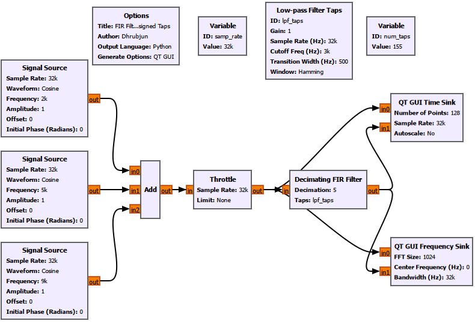

The Low-pass Filter Taps block is configured with:

```text
ID:                lpf_taps

Gain:              1

Sample Rate:       samp_rate

Cutoff Frequency:  3k

Transition Width:  500

Window:            Hamming
```

The Decimating FIR Filter then uses:

```text
Type:          Float -> Float (Real Taps)

Decimation:    1

Taps:          lpf_taps

Sample Delay:  0
```

There is no signal wire between the Low-pass Filter Taps block and the Decimating FIR Filter.

`lpf_taps` is a variable containing the coefficient vector.

The FIR filter references that vector through its ****Taps**** field.

---

## 9.20 GNU Radio Toolbox: Low-pass Filter Taps

### Gain

Sets the overall filter gain.

```text
Gain = 1
```

### Sample Rate

Defines the sampling frequency used during filter design.

```text
Sample Rate = samp_rate
```

### Cutoff Frequency

Defines the low-pass cutoff.

```text
Cutoff Frequency = 3k
```

### Transition Width

Controls how sharply the response changes from passband toward stopband.

```text
Transition Width = 500
```

### Window

Controls how the finite-length FIR impulse response is shaped.

For this experiment:

```text
Window = Hamming
```

---

## 9.21 Where Does `num_taps` Come From?

This is an important detail.

We do not manually choose the tap count in this experiment.

The Low-pass Filter Taps block generates a coefficient vector called

```text
lpf_taps
```

If the vector contains $N$ coefficients, then the number of taps is simply

$$
N=\operatorname{len}(lpf_taps)
$$

In GNU Radio, we created another variable:

```text
ID:     num_taps

Value:  len(lpf_taps)
```

The value shown in `num_taps` is therefore not an arbitrary number.

It is the actual length of the coefficient vector generated by GNU Radio.

For example, with:

```text
Sample Rate:       32k

Cutoff Frequency:  3k

Transition Width:  500

Window:            Hamming
```

GNU Radio generated approximately

```text
num_taps = 155
```

That means

$$
N=155
$$

and therefore the FIR filter contains 155 coefficients.

When we temporarily used a Blackman window with similar filter specifications, we observed a larger tap count of approximately

```text
num_taps = 215
```

This shows that the required number of taps depends not only on transition width, but also on the chosen window.

---

## 9.22 Transition Width Versus Number of Taps

We then varied the transition width while keeping the Hamming window.

The measured values were:

| Transition Width | Number of Taps |

|---:|---:|

| 2000 Hz | 39 |

| 1000 Hz | 77 |

| 500 Hz | 155 |

| 200 Hz | 385 |

| 100 Hz | 771 |

The trend is very clear.

As the transition width becomes smaller, the number of taps becomes larger.

Approximately,

$$
N\propto\frac{f_s}{\Delta f}
$$

The exact value depends on the design method and window, but the trend is what matters.

For example,

$$
\Delta f=1000\text{ Hz} \Rightarrow N\approx77
$$

while

$$
\Delta f=500\text{ Hz} \Rightarrow N\approx155
$$

Halving the transition width roughly doubles the number of taps.

At the extreme we tested,

$$
\Delta f=100\text{ Hz} \Rightarrow N\approx771
$$

This gives us one of the most important engineering trade-offs in filter design:

```text
Narrower transition
        ↓
More taps
        ↓
More computation
```

A sharper filter is useful, but it is not free.

---

## 9.23 What Does the Window Change?

The window also affects FIR filter design.

Common windows include:

- Rectangular,

- Hann,

- Hamming,

- Blackman,

- Kaiser.

Different windows trade transition sharpness, stopband attenuation, and filter length differently.

We already explored and compared windows earlier, so there is no need to repeat the complete window discussion here.

However, it is useful to keep the result in mind:

> ****The window is part of the filter design, not a cosmetic setting.****

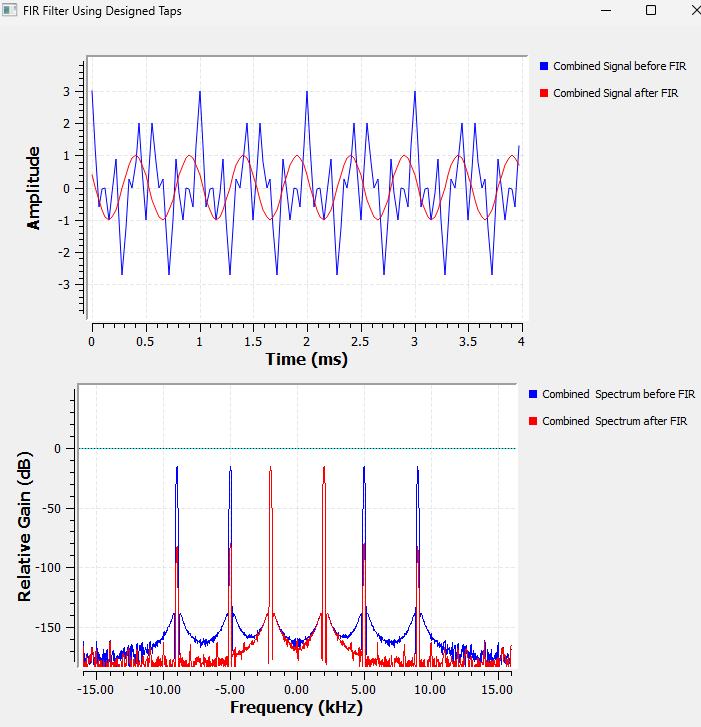

For the same general filter requirement, changing the window can change both the shape of the response and the required number of taps.

This is why the Blackman design we tested produced a different tap count from the Hamming design.

---

## 9.24 Filtering Has a Computational Cost

Each output sample of an FIR filter requires calculations involving its taps.

For an $N$-tap filter,

$$
y[n] = \sum_{k=0}^{N-1}h[k]x[n-k]
$$

so increasing $N$ increases the number of multiply-and-add operations.

This means that asking for an unnecessarily narrow transition width can make a filter much more expensive than necessary.

A practical SDR designer therefore does not simply ask:

> What is the sharpest filter I can build?

A better question is:

> ****How sharp does this filter actually need to be?****

---

## Experiment 8: Filtering and Decimation

## 9.25 Why Reduce the Sample Rate?

So far, our filters have mainly changed the spectrum.

Now we will use the filter together with another important SDR operation:

****decimation****.

Decimation reduces the sample rate.

If the input sample rate is $f_s$ and the decimation factor is $D$, then

$$
f_{s,\text{out}} = \frac{f_s}{D}
$$

For our original sample rate,

$$
f_s=32\text{ kS/s}
$$

If

$$
D=2
$$

then

$$
f_{s,\text{out}}=16\text{ kS/s}
$$

If

$$
D=4
$$

then

$$
f_{s,\text{out}}=8\text{ kS/s}
$$

If

$$
D=8
$$

then

$$
f_{s,\text{out}}=4\text{ kS/s}
$$

---

## 9.26 GNU Radio Setup

For this experiment, we use:

- the three Signal Sources,

- Add,

- Throttle,

- Low-pass Filter Taps,

- Decimating FIR Filter,

- QT GUI Range,

- QT GUI Time Sink,

- QT GUI Frequency Sink.

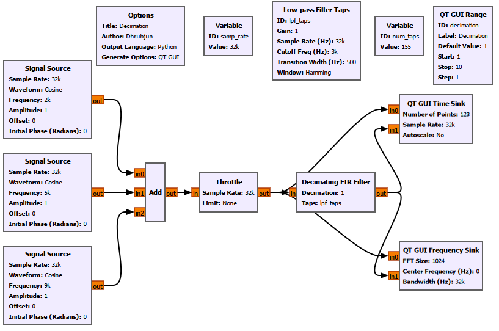

The decimation factor is controlled with a QT GUI Range.

For example:

```text
ID:             decimation

Label:          Decimation

Default Value:  1

Start:          1

Stop:           10

Step:           1
```

Inside the Decimating FIR Filter, use:

```text
Decimation: decimation
```

The downstream GUI sinks must also know the new sample rate.

For the QT GUI Time Sink:

```text
Sample Rate: samp_rate/decimation
```

For the QT GUI Frequency Sink:

```text
Bandwidth: samp_rate/decimation
```

This is important.

Once the sample rate changes, any downstream block that interprets time or frequency must use the new rate.

---

## 9.27 GNU Radio Toolbox: Decimating FIR Filter

### Type

For our real-valued signal and real taps:

```text
Float -> Float (Real Taps)
```

### Decimation

This controls how much the sample rate is reduced.

If

```text
Decimation = 4
```

then

$$
f_{s,\text{out}} = \frac{f_{s,\text{in}}}{4}
$$

### Taps

We use:

```text
lpf_taps
```

These are the coefficients produced by the Low-pass Filter Taps block.

### Sample Delay

For this experiment:

```text
Sample Delay = 0
```

No additional sample offset is intentionally introduced.

---

## 9.28 What Happens as Decimation Increases?

We tested

$$
D=1,\quad2,\quad4,\quad8
$$

The comparison is shown below.

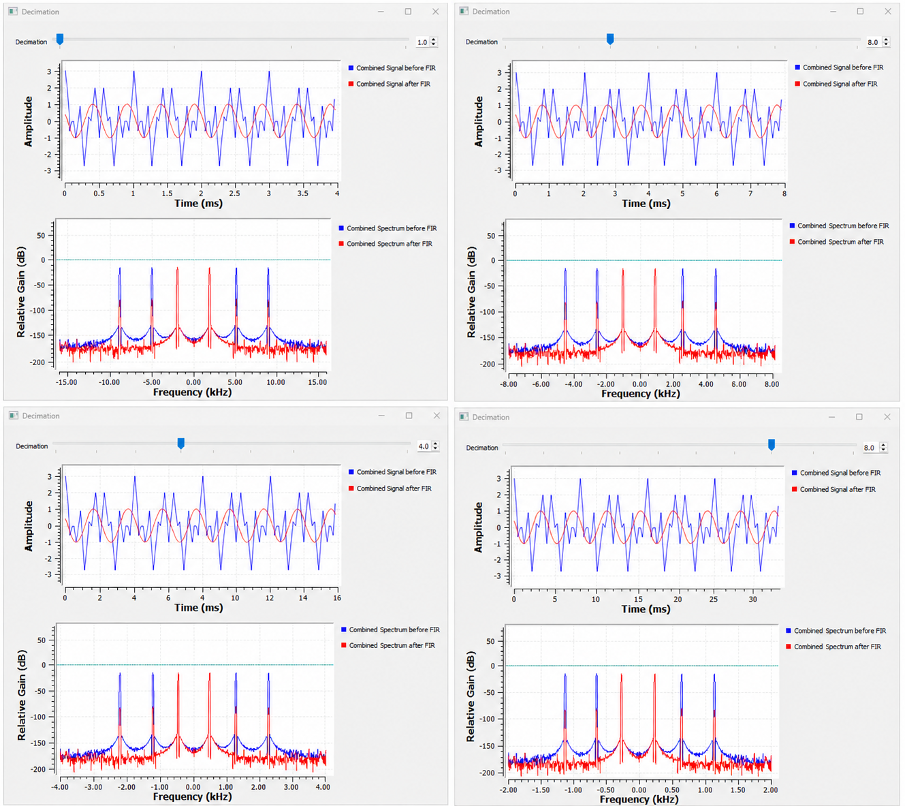

For

$$
D=1
$$

the sample rate remains

$$
32\text{ kS/s}
$$

and the Nyquist frequency is

$$
16\text{ kHz}
$$

For

$$
D=2
$$

the output sample rate becomes

$$
16\text{ kS/s}
$$

and the Nyquist frequency becomes

$$
8\text{ kHz}
$$

For

$$
D=4
$$

the output sample rate becomes

$$
8\text{ kS/s}
$$

and the Nyquist frequency becomes

$$
4\text{ kHz}
$$

For

$$
D=8
$$

the output sample rate becomes

$$
4\text{ kS/s}
$$

and the Nyquist frequency becomes

$$
2\text{ kHz}
$$

The relationship is summarized below.

| Decimation $D$ | Output Sample Rate | Nyquist Frequency |

|---:|---:|---:|

| 1 | 32 kS/s | 16 kHz |

| 2 | 16 kS/s | 8 kHz |

| 4 | 8 kS/s | 4 kHz |

| 8 | 4 kS/s | 2 kHz |

The same number of samples also covers more time as the sample rate becomes lower.

That is why the Time Sink shows approximately:

$$
4\text{ ms} \rightarrow 8\text{ ms} \rightarrow 16\text{ ms} \rightarrow 32\text{ ms}
$$

for the same displayed number of points.

Decimation changes the sample density, not the physical frequency of the correctly preserved signal.

---

## 9.29 The Nyquist Limit After Decimation

The important issue is not merely that the sample rate becomes lower.

The allowable frequency range becomes smaller too.

After decimation,

$$
f_N' = \frac{f_s'}{2}
$$

For example, with

$$
D=4
$$

we have

$$
f_s'=8\text{ kS/s}
$$

so

$$
f_N'=4\text{ kHz}
$$

A 2 kHz desired component can still be represented safely because

$$
2<4\text{ kHz}
$$

But the original 5 kHz and 9 kHz components cannot be represented correctly at the new sample rate.

Something must happen to them before downsampling.

That is where filtering becomes essential.

---

## Experiment 8a: What Happens If We Decimate Without Filtering?

## 9.30 Breaking the Correct Decimation Process

Now we deliberately do it incorrectly.

This experiment compares two paths.

The first uses the correct method:

```text
Combined Signal

    ↓

Decimating FIR Filter

    ↓

Filtered and Decimated Output
```

The second simply discards samples:

```text
Combined Signal

    ↓

Keep 1 in N

    ↓

Directly Decimated Output
```

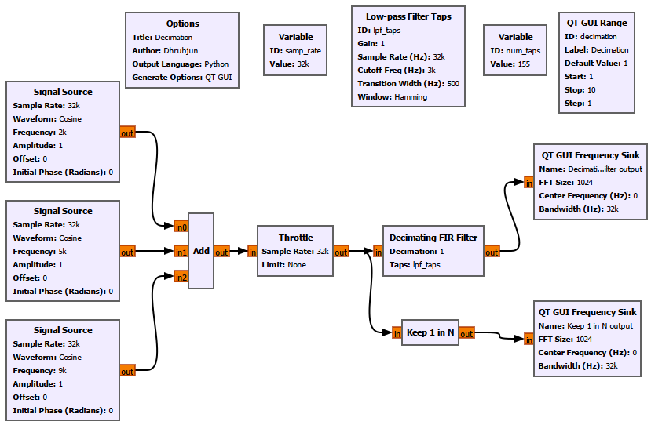

Both paths use the same decimation factor.

For the comparison, we use:

```text
Decimation = 4
```

The new sample rate is therefore

$$
f_s' = \frac{32}{4} = 8\text{ kS/s}
$$

and the new Nyquist frequency is

$$
f_N'=4\text{ kHz}
$$

---

## 9.31 Predict the Aliasing Before Running It

Our original signal contains

$$
2,\quad5,\quad9\text{ kHz}
$$

The 2 kHz component lies inside the new Nyquist range.

The 5 kHz and 9 kHz components do not.

If we simply downsample without filtering, those frequencies fold back into the allowed range.

The 5 kHz component aliases to

$$
|5-8| = 3\text{ kHz}
$$

The 9 kHz component aliases to

$$
|9-8| = 1\text{ kHz}
$$

So after direct downsampling, we expect components around

$$
\pm1,\quad \pm2,\quad \pm3\text{ kHz}
$$

even though our original Signal Sources were at

$$
2,\quad5,\quad9\text{ kHz}
$$

---

## 9.32 Filter Before Decimation Versus Direct Downsampling

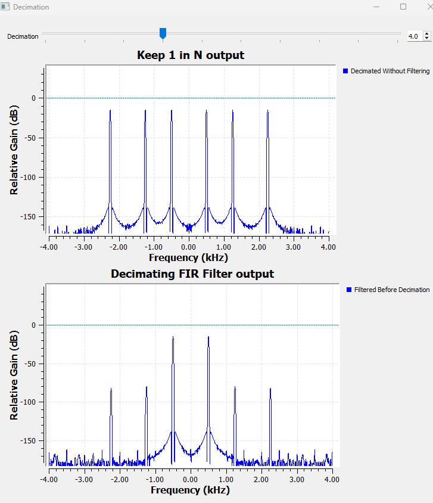

Look first at the ****Keep 1 in N output****.

We see components around

$$
\pm1,\quad \pm2,\quad \pm3\text{ kHz}
$$

The 1 kHz and 3 kHz components were not present in the original signal.

They are aliases.

The original 9 kHz signal has folded to approximately 1 kHz.

The original 5 kHz signal has folded to approximately 3 kHz.

Now look at the ****Decimating FIR Filter output****.

Before discarding samples, the FIR filter suppresses the high-frequency components that would violate the new Nyquist limit.

As a result, aliasing is strongly reduced.

Small residual components may still be visible because a finite FIR filter does not provide infinite attenuation.

The important difference between the two outputs is clear.

Direct downsampling gives us:

$$
\text{aliasing}
$$

while filtering first gives us:

$$
\text{strong alias suppression}
$$

This leads to one of the most important rules in digital signal processing:

> **Filter first. Decimate second.**

---

## 9.33 GNU Radio Toolbox: Keep 1 in N

The ****Keep 1 in N**** block performs a simple form of downsampling.

If

```text
N = 4
```

then it keeps one sample out of every four input samples.

The sample rate therefore becomes

$$
f_s' = \frac{f_s}{4}
$$

But the block does not automatically perform the anti-alias filtering needed before reducing the sample rate.

That is why it is useful in this experiment.

It lets us deliberately see what goes wrong when samples are discarded without first limiting the bandwidth.

---

## 9.34 Why the Frequency Sink Bandwidth Must Change

If the signal has been decimated, the QT GUI Frequency Sink must know the new sample rate.

For a decimation factor $D$, set:

```text
Bandwidth: samp_rate/decimation
```

not:

```text
Bandwidth: samp_rate
```

For example, with

$$
f_s=32\text{ kS/s}
$$

and

$$
D=4
$$

the Frequency Sink bandwidth must be

$$
\frac{32}{4}=8\text{ kHz}
$$

The visible two-sided frequency range then extends approximately from

$$
-4\text{ kHz}
$$

to

$$
+4\text{ kHz}
$$

If the sink is left at 32 kHz, the samples will still be plotted, but the frequency-axis labels will no longer correspond to the real output sample rate.

This is an important GNU Radio habit:

> ****Whenever the sample rate changes, check every downstream block that depends on the sample rate.****

---

## 9.35 Be Careful When Comparing Different Sample Rates

Suppose the original signal is sampled at

$$
32\text{ kS/s}
$$

while a decimated signal is sampled at

$$
8\text{ kS/s}
$$

It may be tempting to feed both signals into two inputs of the same Frequency Sink.

That can be misleading.

A single Frequency Sink has one bandwidth setting.

But the two signals have different sample rates.

For this reason, separate Frequency Sinks are often clearer when comparing signals before and after decimation.

Each sink can then use the correct bandwidth for its own signal.

---

## 9.36 Common Filter Mistakes in GNU Radio

By now, we have encountered several ways a filtering flowgraph can go wrong.

### Wrong Sample Rate

The filter-design block must know the actual sample rate.

If the real sample rate is

$$
32\text{ kS/s}
$$

but the filter is designed with some other value, the cutoff and transition frequencies will not correspond to what we intended.

### Wrong Cutoff Frequency

Suppose the desired signal is at 5 kHz but our low-pass cutoff is 3 kHz.

The filter is doing exactly what we told it to do.

The problem is our specification.

### Unrealistically Narrow Transition Width

A very narrow transition width can dramatically increase the number of taps.

For our Hamming-window experiment:

$$
\Delta f=2000\text{ Hz} \Rightarrow N\approx39
$$

while

$$
\Delta f=100\text{ Hz} \Rightarrow N\approx771
$$

That is a large increase in computation.

### Changing Decimation Without Updating GUI Blocks

If

$$
D
$$

changes, then

$$
f_s'=\frac{f_s}{D}
$$

also changes.

The downstream Time Sink and Frequency Sink must use the new rate.

### Downsampling Without Anti-Alias Filtering

Experiment 8a demonstrated this directly.

Components above the new Nyquist frequency fold into the retained spectrum.

Once that aliasing has occurred, the aliased components are no longer distinguishable from genuine signals at those frequencies.

---

## 9.37 What We Learned

We started this chapter with three simple tones:

$$
2,\quad5,\quad9\text{ kHz}
$$

At first, all three existed together in the same signal.

Then we learned how to manipulate the spectrum.

A low-pass filter allowed us to keep the lowest-frequency component.

A high-pass filter allowed us to keep the highest-frequency component.

A band-pass filter allowed us to isolate the middle component.

A band-reject filter allowed us to remove the middle component.

Then we looked deeper.

We discovered that practical filters need a transition band.

A narrower transition width gives us a sharper filter, but it requires more FIR taps.

Those taps are the coefficients of the convolution

$$
y[n] = \sum_{k=0}^{N-1}h[k]x[n-k]
$$

The window used during filter design affects the response and the number of taps.

Finally, we connected filtering to decimation.

That showed us something fundamental about SDR processing.

When the sample rate is reduced, the allowable spectrum becomes smaller.

The signal must therefore be filtered before downsampling so that frequencies outside the new Nyquist region do not fold back as aliases.

---

## 9.38 The Bigger SDR Picture

We can now connect several chapters together.

A practical SDR receiver may perform something like

```text
Sample
  ↓
Frequency Translate
  ↓
Filter
  ↓
Decimate
  ↓
Demodulate
```

Each step solves a different problem.

Sampling converts the physical signal into digital samples.

Frequency translation moves the desired channel to a convenient location.

Filtering removes unwanted parts of the spectrum.

Decimation reduces the sample rate once the required bandwidth has become smaller.

Later processing can then work with fewer samples.

This is why filtering is not an isolated DSP topic.

It sits at the heart of a software-defined receiver.

---

## 9.39 GNU Radio Toolbox Summary

This chapter introduced several filter-design and decimation blocks, while also reusing familiar GNU Radio blocks in more advanced roles.

### Low Pass Filter

Use it when lower-frequency components should pass while higher-frequency components are attenuated.

Important parameters include:

```text
Decimation

Gain

Sample Rate

Cutoff Frequency

Transition Width

Window
```

### High Pass Filter

Use it when higher-frequency components should pass while lower-frequency components are attenuated.

### Band Pass Filter

Use it when only a selected frequency band should survive.

Important parameters include the lower and upper band edges.

### Band Reject Filter

Use it when a selected frequency band should be suppressed.

### Low-pass Filter Taps

Generates an FIR coefficient vector explicitly.

This is useful when we want to inspect, reuse, or separately apply the designed filter taps.

### Decimating FIR Filter

Applies FIR filtering and downsampling together.

Conceptually:

$$
\text{FIR filtering} \rightarrow \text{keep every }D\text{th sample}
$$

### Keep 1 in N

Keeps one sample out of every $N$ input samples.

It is useful for demonstrating direct downsampling, but it does not automatically provide anti-alias filtering.

### QT GUI Range

Allows parameters such as transition width or decimation factor to be changed while the flowgraph is running.

This is especially useful in experiments because we can immediately see the effect of changing a parameter.

---

## 9.40 Key Design Takeaway

If there is one idea to carry forward from this chapter, it is this:

> ****A filter is a way of deciding which parts of a signal's spectrum matter.****

But useful filter design involves more than choosing "low-pass" or "high-pass."

We also have to think about:

- where the passband should end,

- where the stopband should begin,

- how wide the transition region can be,

- how many taps are reasonable,

- which window is appropriate,

- what the sample rate is,

- whether that sample rate will change afterward.

Those choices are connected.

A narrower transition usually means more taps.

More taps mean more computation.

A lower output sample rate means a smaller Nyquist region.

A smaller Nyquist region means we must remove more spectrum before downsampling.

Once these relationships become intuitive, GNU Radio filter blocks stop looking like collections of mysterious parameters.

Each setting has a mathematical and practical reason for being there.

That is the real goal of this chapter.

---

## 9.41 Connecting to the Next Chapter

By the end of this chapter, we have learned how to shape a spectrum deliberately.

We can:

- keep low-frequency components,

- keep high-frequency components,

- isolate a selected band,

- reject an unwanted band,

- control the transition region,

- inspect FIR filter taps,

- and reduce the sample rate safely after filtering.

We also saw that an FIR filter can be written as

$$
y[n] = \sum_{k=0}^{N-1} h[k]x[n-k]
$$

and that the values

$$
h[0],h[1],\ldots,h[N-1]
$$

are the filter taps.

But we have not yet really explained why this sum works.

Why should multiplying delayed input samples by these coefficients produce the filtered output?

And why do the taps describe the behaviour of the system?

To answer that, we need to look at filters from a different point of view.

Instead of starting with frequency response, we will start with the simplest possible input:

> ****an impulse.****

If we send an impulse into a system and observe what comes out, we obtain the system's ****impulse response****.

For an FIR filter, that impulse response is closely connected to the taps we have already been using.

Then something powerful happens.

A more complicated signal can be thought of as a collection of shifted and scaled impulses. If we know how the system responds to one impulse, we can build the response to the entire input.

That operation is called ****convolution****.

So the next question is:

> ****If we know how a system responds to one impulse, can we predict how it responds to any signal?****

That takes us to:

