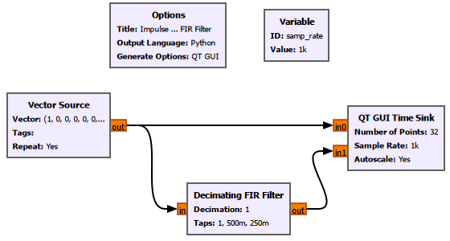
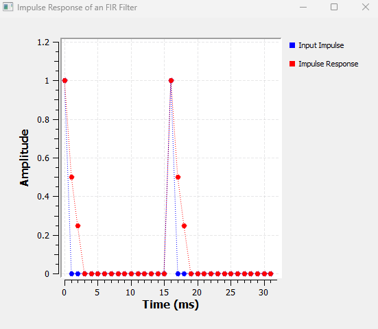
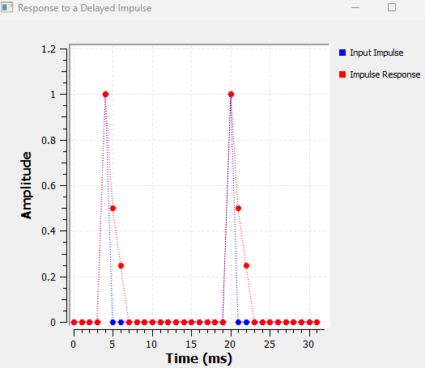
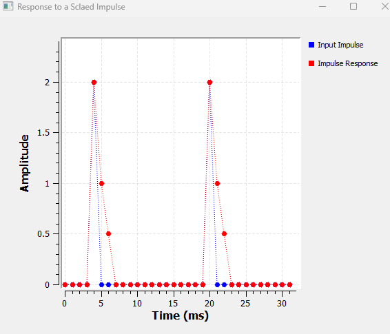
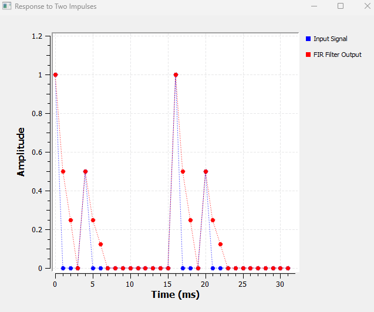
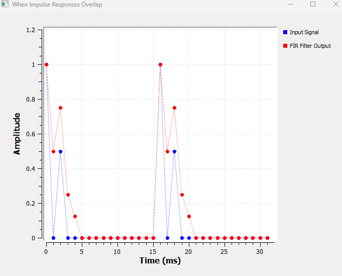
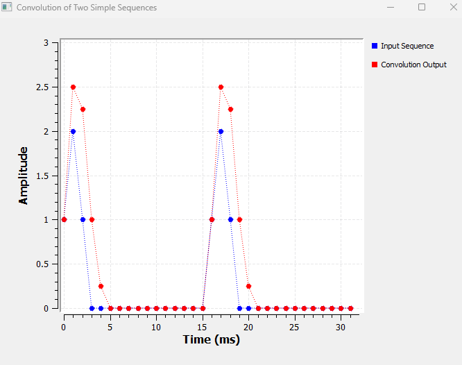
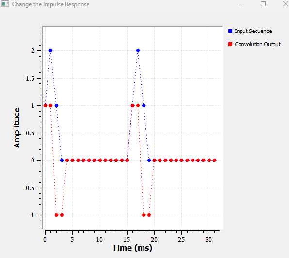
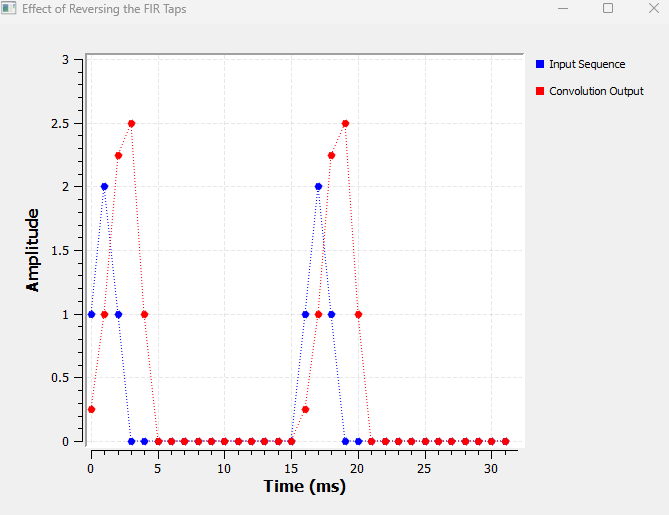

# Chapter 10: Impulse Response and Convolution

In the previous chapter, we used filters to keep some frequencies and suppress others.

We saw low-pass, high-pass, band-pass and band-reject filters in action. We changed cutoff frequencies, transition widths and filter taps, and we watched the spectrum change.

But there is still an important question hiding underneath all of that:

> **What is a filter actually doing to the individual samples of a signal?**

To answer that, we are going to look at filters from a completely different direction.

Instead of beginning with frequency response, we will begin with one of the simplest possible discrete-time signals:

**a single impulse.**

From there, we will gradually build our way toward convolution.

We will not start with the convolution equation.

First, we will make GNU Radio show us what convolution actually means.

---

## 10.1 A System: Input Goes In, Output Comes Out

Before talking about impulses or convolution, let us use the word **system** in a very simple sense.

A system takes an input and produces an output.

$$
x[n]
\longrightarrow
\boxed{\text{System}}
\longrightarrow
y[n]
$$

Here:

- $x[n]$ is the input;
- $y[n]$ is the output.

A filter is one example of a system.

If we pass a signal through an FIR filter,

$$
x[n]
\longrightarrow
\boxed{\text{FIR Filter}}
\longrightarrow
y[n]
$$

the filter changes the input according to its coefficients, or **taps**.

In Chapter 9, we mainly observed this change in the frequency domain.

In this chapter, we are going to look at what happens sample by sample.

---

## 10.2 What Is an Impulse?

A discrete-time impulse is one of the simplest signals we can create.

It contains a value of $1$ at one sample and $0$ everywhere else:

$$
\delta[n]
=
\begin{cases}
1, & n=0 \\
0, & n\neq0
\end{cases}
$$

As a sequence, we can imagine it as

$$
[1,\;0,\;0,\;0,\;0,\ldots]
$$

At first this may not look particularly useful.

Why should we care about a signal that is zero almost everywhere?

Because an impulse gives us a remarkably useful way of testing a system.

We send one impulse into the system and observe what comes out.

That output tells us a great deal about the system itself.

---

## 10.3 Impulse Response

Suppose we apply an impulse to a system:

$$
\delta[n]
\longrightarrow
\boxed{\text{System}}
\longrightarrow
?
$$

The output produced by the system is called its **impulse response**.

We normally write it as

$$
h[n]
$$

Therefore,

$$
\boxed{
\delta[n]
\longrightarrow
h[n]
}
$$

This idea is especially useful for FIR filters.

If an FIR filter has taps

$$
[1,\;0.5,\;0.25]
$$

then its impulse response is

$$
h[n]=[1,\;0.5,\;0.25]
$$

Let us verify that directly in GNU Radio.

---

# Experiment 1: Observing the Impulse Response of an FIR Filter

## 10.4 GNU Radio Flowgraph

For our first experiment, we will create an impulse and pass it through a very small FIR filter.

We deliberately use only three taps so that every output sample can be understood by inspection.



The basic flow is:

```text
Vector Source ───────────────→ QT GUI Time Sink
      │
      └→ Decimating FIR Filter ─→ QT GUI Time Sink
```

The direct path lets us see the input impulse.

The filtered path lets us see the response of the FIR filter.

---

## 10.5 GNU Radio Settings

### Variable

```text
ID: samp_rate
Value: 1k
```

### Vector Source

Use a sequence containing one impulse followed by zeros:

```text
Vector:
(1, 0, 0, 0, 0, 0, 0, 0,
 0, 0, 0, 0, 0, 0, 0, 0)

Tags: []

Repeat: Yes
Vector Length: 1
```

We use `Repeat = Yes` only so that the impulse appears repeatedly in the continuously running GNU Radio display.

Conceptually, the impulse response is the response to **one impulse**.

Repeating the sequence is simply a convenient way to visualize the experiment.

Because our impulse response lasts for only three samples and the impulses are separated by sixteen samples, the individual responses do not overlap.

### Decimating FIR Filter

```text
Type: Float -> Float (Real Taps)
Decimation: 1
Taps: (1, 0.5, 0.25)
Sample Delay: 0
```

### QT GUI Time Sink

Use:

```text
Number of Points: 32
Sample Rate: samp_rate
Autoscale: Yes
```

The sample rate is

$$
f_s=1000\text{ samples/s}
$$

so the sample interval is

$$
T_s=\frac{1}{f_s}
$$

and therefore

$$
T_s=\frac{1}{1000}=1\text{ ms}
$$

This makes the spacing between individual samples easy to interpret.

Using visible point markers in the Time Sink is also helpful because we are dealing with discrete-time samples rather than a truly continuous waveform.

---

> **GNU Radio Toolbox: Vector Source**
>
> The **Vector Source** lets us enter a predefined sequence of sample values directly.
>
> This makes it particularly useful when we want to study DSP operations using small sequences such as
>
> $$
> [1,\;0,\;0,\;0]
> $$
>
> rather than continuously generated sine waves.
>
> Important settings include:
>
> - Output Type
> - Vector
> - Tags
> - Repeat
> - Vector Length
>
> In this experiment, `Repeat = Yes` causes the vector to start again after its final sample.

---

> **GNU Radio Toolbox: Decimating FIR Filter**
>
> The **Decimating FIR Filter** performs FIR filtering and can optionally reduce the sample rate.
>
> Important parameters include:
>
> - Type
> - Decimation
> - Taps
> - Sample Delay
>
> In this experiment,
>
> ```text
> Decimation = 1
> ```
>
> so no sample-rate reduction takes place.
>
> The important parameter is
>
> ```text
> Taps = (1, 0.5, 0.25)
> ```
>
> These taps define the impulse response of the FIR filter.

---

## 10.6 What Do We Expect?

The input is an impulse:

$$
x[n]=\delta[n]
$$

The filter taps are

$$
h[n]=[1,\;0.5,\;0.25]
$$

Therefore, if the taps really are the impulse response, an input impulse should produce

$$
[1,\;0.5,\;0.25]
$$

at the output.

Let us see what GNU Radio gives us.



That is exactly what happens.

The blue trace contains the input impulse.

The red trace contains three non-zero samples:

$$
1,\quad0.5,\quad0.25
$$

Therefore,

$$
\boxed{
h[n]=[1,\;0.5,\;0.25]
}
$$

and we have experimentally confirmed something very important:

$$
\boxed{
\text{FIR filter taps}=\text{impulse response}
}
$$

This fact will become increasingly useful as the chapter continues.

---

# Experiment 2: Response to a Delayed Impulse

## 10.7 What If the Impulse Arrives Later?

Now let us change only one thing.

Instead of placing the impulse at the beginning of the vector, move it four samples to the right.

Change the Vector Source from

```text
(1, 0, 0, 0, 0, 0, ...)
```

to

```text
(0, 0, 0, 0, 1, 0, ...)
```

Everything else remains unchanged.

There is no need to rebuild the flowgraph.

Our input is now a delayed impulse:

$$
x[n]=\delta[n-4]
$$

What should happen to the output?



The impulse response has moved to the right by exactly the same amount.

Originally,

$$
\delta[n]
\longrightarrow
h[n]
$$

After delaying the input,

$$
\delta[n-4]
\longrightarrow
h[n-4]
$$

The shape

$$
[1,\;0.5,\;0.25]
$$

has not changed.

Only its position has changed.

This is the intuition behind **time invariance**:

> If we delay the input to a time-invariant system, its output is delayed by the same amount.

The system does not suddenly behave differently just because the signal arrived later.

---

# Experiment 3: Response to a Scaled Impulse

## 10.8 What If the Impulse Is Larger?

Now keep the impulse at the same delayed position, but change its amplitude from $1$ to $2$.

Change

```text
(0, 0, 0, 0, 1, 0, ...)
```

to

```text
(0, 0, 0, 0, 2, 0, ...)
```

The input is now

$$
x[n]=2\delta[n-4]
$$

What should the filter do?

Previously,

$$
\delta[n-4]
\longrightarrow
h[n-4]
$$

If we double the input, we expect the output to double:

$$
2\delta[n-4]
\longrightarrow
2h[n-4]
$$

Since

$$
h[n]=[1,\;0.5,\;0.25]
$$

we predict

$$
2h[n]=[2,\;1,\;0.5]
$$



GNU Radio gives exactly that result.

The output samples are now

$$
2,\quad1,\quad0.5
$$

The complete response has simply been scaled by the same factor as the input.

This is one part of the idea behind **linearity**.

---

## 10.9 Two Things We Have Learned Already

At this point, we know two important things.

A delayed impulse creates a delayed copy of the impulse response:

$$
\delta[n-k]
\longrightarrow
h[n-k]
$$

A scaled impulse creates a scaled copy:

$$
A\delta[n-k]
\longrightarrow
Ah[n-k]
$$

What happens if the input contains **more than one impulse**?

That question takes us much closer to convolution.

---

# Experiment 4: Response to Two Impulses

## 10.10 Two Separate Impulses

Use the same flowgraph.

This time set the Vector Source to contain two non-zero samples:

```text
(1, 0, 0, 0, 0.5, 0, 0, 0,
 0, 0, 0, 0, 0, 0, 0, 0)
```

The input can be written as

$$
x[n]
=
\delta[n]
+
0.5\delta[n-4]
$$

The first impulse has amplitude $1$.

It produces

$$
h[n]
=
[1,\;0.5,\;0.25]
$$

The second impulse has amplitude $0.5$, so it produces

$$
0.5h[n]
=
[0.5,\;0.25,\;0.125]
$$

But the second impulse occurs four samples later.

Therefore its response also starts four samples later.

We expect

$$
y[n]
=
h[n]
+
0.5h[n-4]
$$



For one period, the samples can be written as:

| $n$ | 0 | 1 | 2 | 3 | 4 | 5 | 6 | 7 |
|---:|---:|---:|---:|---:|---:|---:|---:|---:|
| $x[n]$ | 1 | 0 | 0 | 0 | 0.5 | 0 | 0 | 0 |
| $y[n]$ | 1 | 0.5 | 0.25 | 0 | 0.5 | 0.25 | 0.125 | 0 |

Something important has happened.

Each non-zero input sample has produced **its own copy of the impulse response**.

The amplitude of the input sample controls the size of the copy.

The position of the input sample controls where that copy begins.

This observation is going to become the central idea of convolution.

---

# Experiment 5: When Impulse Responses Overlap

## 10.11 Move the Impulses Closer Together

In the previous experiment, the two impulses were separated far enough that their responses did not overlap.

Let us deliberately change that.

Change the Vector Source to

```text
(1, 0, 0.5, 0, 0, 0, 0, 0,
 0, 0, 0, 0, 0, 0, 0, 0)
```

Now,

$$
x[n]
=
\delta[n]
+
0.5\delta[n-2]
$$

The first impulse produces

$$
[1,\;0.5,\;0.25]
$$

The second produces

$$
[0.5,\;0.25,\;0.125]
$$

starting at $n=2$.

Let us place the two contributions underneath each other:

| $n$ | 0 | 1 | 2 | 3 | 4 |
|---:|---:|---:|---:|---:|---:|
| Contribution from $\delta[n]$ | 1 | 0.5 | 0.25 | 0 | 0 |
| Contribution from $0.5\delta[n-2]$ | 0 | 0 | 0.5 | 0.25 | 0.125 |
| **Total $y[n]$** | **1** | **0.5** | **0.75** | **0.25** | **0.125** |

At $n=2$, both responses contribute.

Therefore,

$$
y[2]
=
0.25+0.5
$$

so

$$
\boxed{
y[2]=0.75
}
$$

The complete expected output is

$$
y[n]
=
[1,\;0.5,\;0.75,\;0.25,\;0.125]
$$



Look carefully at the red sample with amplitude $0.75$.

That value did not appear in either individual response.

It appeared because two contributions arrived at the same output location:

$$
0.25+0.5=0.75
$$

We have now discovered another important rule:

> **When shifted impulse responses overlap, their contributions add.**

At this point, we already have almost everything we need to understand convolution.

We just have not called it convolution yet.

---

## 10.12 From Impulses to an Ordinary Sequence

So far, our input signals have been deliberately constructed from obvious impulses.

But consider a more ordinary finite sequence:

$$
x[n]=[1,\;2,\;1]
$$

At first, this may seem different.

It is not.

We can think of the first sample as an impulse of amplitude $1$ at $n=0$.

The second sample is an impulse of amplitude $2$ at $n=1$.

The third sample is an impulse of amplitude $1$ at $n=2$.

Therefore,

$$
x[n]
=
\delta[n]
+
2\delta[n-1]
+
\delta[n-2]
$$

This is the key idea:

> **Any discrete-time sequence can be thought of as a collection of shifted and scaled impulses.**

Now our previous experiments become much more powerful.

We already know what the system does to each one of those impulses.

---

# Experiment 6: Convolution of Two Simple Sequences

## 10.13 The Input and the Impulse Response

Keep the same FIR filter:

$$
h[n]=[1,\;0.5,\;0.25]
$$

Change the Vector Source to

```text
(1, 2, 1, 0, 0, 0, 0, 0,
 0, 0, 0, 0, 0, 0, 0, 0)
```

The non-zero part of the input is

$$
x[n]=[1,\;2,\;1]
$$

Before looking at GNU Radio, let us work out what should happen.

This calculation is worth doing slowly.

---

## 10.14 Start With the First Input Sample

The first input sample is

$$
x[0]=1
$$

It creates one copy of the impulse response:

$$
1\times h[n]
$$

Since

$$
h[n]=[1,\;0.5,\;0.25]
$$

the contribution is

$$
[1,\;0.5,\;0.25]
$$

and it begins at $n=0$.

So its contribution is:

| $n$ | 0 | 1 | 2 | 3 | 4 |
|---:|---:|---:|---:|---:|---:|
| Contribution from $x[0]=1$ | 1 | 0.5 | 0.25 | 0 | 0 |

---

## 10.15 Now the Second Input Sample

The second input sample is

$$
x[1]=2
$$

It creates a copy of the impulse response scaled by $2$:

$$
2h[n]
$$

Therefore,

$$
2[1,\;0.5,\;0.25]
=
[2,\;1,\;0.5]
$$

But this input sample occurs at $n=1$.

Therefore its response begins one sample later:

| $n$ | 0 | 1 | 2 | 3 | 4 |
|---:|---:|---:|---:|---:|---:|
| Contribution from $x[1]=2$ | 0 | 2 | 1 | 0.5 | 0 |

---

## 10.16 Now the Third Input Sample

The third input sample is

$$
x[2]=1
$$

It produces

$$
1h[n]
=
[1,\;0.5,\;0.25]
$$

But because the sample occurs at $n=2$, this copy starts at $n=2$:

| $n$ | 0 | 1 | 2 | 3 | 4 |
|---:|---:|---:|---:|---:|---:|
| Contribution from $x[2]=1$ | 0 | 0 | 1 | 0.5 | 0.25 |

---

## 10.17 Put All Three Contributions Together

Now place all three contributions underneath one another:

| $n$ | 0 | 1 | 2 | 3 | 4 |
|---:|---:|---:|---:|---:|---:|
| Contribution from $x[0]=1$ | 1 | 0.5 | 0.25 | 0 | 0 |
| Contribution from $x[1]=2$ | 0 | 2 | 1 | 0.5 | 0 |
| Contribution from $x[2]=1$ | 0 | 0 | 1 | 0.5 | 0.25 |
| **Total $y[n]$** | **1** | **2.5** | **2.25** | **1** | **0.25** |

Now the calculation becomes very easy.

At $n=0$,

$$
y[0]=1
$$

At $n=1$,

$$
y[1]
=
0.5+2
$$

so

$$
y[1]=2.5
$$

At $n=2$,

$$
y[2]
=
0.25+1+1
$$

so

$$
y[2]=2.25
$$

At $n=3$,

$$
y[3]
=
0.5+0.5
$$

so

$$
y[3]=1
$$

At $n=4$,

$$
y[4]=0.25
$$

Therefore,

$$
\boxed{
y[n]
=
[1,\;2.5,\;2.25,\;1,\;0.25]
}
$$

Now let us compare that prediction with GNU Radio.



The red output is

$$
1,\quad2.5,\quad2.25,\quad1,\quad0.25
$$

GNU Radio has produced exactly the sequence we calculated by hand.

---

## 10.18 What We Have Just Done Has a Name

Up to this point, we have deliberately avoided beginning with a formula.

Instead, we discovered a process.

For every input sample:

1. take the system's impulse response;
2. scale it by the value of that input sample;
3. shift it to the position of that input sample;
4. add it to all the other contributions.

That process is called **convolution**.

We write

$$
\boxed{
y[n]
=
x[n]*h[n]
}
$$

where the symbol $*$ represents convolution.

Now that we know what the operation actually means, we are ready to write its full mathematical form.

---

## 10.19 The Convolution Equation

For a discrete-time system,

$$
\boxed{
y[n]
=
\sum_{k=-\infty}^{\infty}
x[k]h[n-k]
}
$$

This equation can look intimidating when it is encountered for the first time.

But it is describing exactly the process we just performed by hand.

Let us unpack it.

---

## 10.20 What Does $n$ Mean?

The variable $n$ tells us **which output sample we are calculating**.

For example,

$$
y[0]
$$

means we are calculating the output at $n=0$.

Similarly,

$$
y[3]
$$

means we are calculating the output at $n=3$.

So $n$ identifies our current position in the output sequence.

---

## 10.21 What Does $k$ Mean?

The variable $k$ is used to walk through the input samples.

For

$$
x[n]=[1,\;2,\;1]
$$

we have

$$
x[0]=1
$$

$$
x[1]=2
$$

and

$$
x[2]=1
$$

As $k$ takes the values

$$
0,\;1,\;2
$$

the summation visits each of those input samples.

A useful way to remember the difference is:

> $n$ asks, **"Which output sample am I calculating?"**
>
> $k$ asks, **"Which input sample is contributing to it?"**

---

## 10.22 Using the Equation on Our Experiment

Our sequences are

$$
x[n]=[1,\;2,\;1]
$$

and

$$
h[n]=[1,\;0.5,\;0.25]
$$

Let us calculate the same output again, this time using the formal convolution equation.

---

### Calculating $y[0]$

Set

$$
n=0
$$

Then

$$
y[0]
=
\sum_k x[k]h[0-k]
$$

For our finite input,

$$
y[0]
=
x[0]h[0]
+
x[1]h[-1]
+
x[2]h[-2]
$$

Our impulse response is zero outside its defined samples, so

$$
h[-1]=0
$$

and

$$
h[-2]=0
$$

Therefore,

$$
y[0]
=
(1)(1)
+
(2)(0)
+
(1)(0)
$$

Thus,

$$
\boxed{
y[0]=1
}
$$

---

### Calculating $y[1]$

Now,

$$
n=1
$$

Therefore,

$$
y[1]
=
x[0]h[1]
+
x[1]h[0]
+
x[2]h[-1]
$$

Substituting the values,

$$
y[1]
=
(1)(0.5)
+
(2)(1)
+
(1)(0)
$$

Hence,

$$
\boxed{
y[1]=2.5
}
$$

---

### Calculating $y[2]$

Now set

$$
n=2
$$

Then,

$$
y[2]
=
x[0]h[2]
+
x[1]h[1]
+
x[2]h[0]
$$

Substituting,

$$
y[2]
=
(1)(0.25)
+
(2)(0.5)
+
(1)(1)
$$

Therefore,

$$
y[2]
=
0.25+1+1
$$

and

$$
\boxed{
y[2]=2.25
}
$$

This is the location where all three shifted responses overlap.

---

### Calculating $y[3]$

For

$$
n=3
$$

we obtain

$$
y[3]
=
x[0]h[3]
+
x[1]h[2]
+
x[2]h[1]
$$

Since

$$
h[3]=0
$$

we have

$$
y[3]
=
(1)(0)
+
(2)(0.25)
+
(1)(0.5)
$$

Therefore,

$$
\boxed{
y[3]=1
}
$$

---

### Calculating $y[4]$

Finally,

$$
y[4]
=
x[0]h[4]
+
x[1]h[3]
+
x[2]h[2]
$$

Since

$$
h[4]=0
$$

and

$$
h[3]=0
$$

we get

$$
y[4]
=
(1)(0)
+
(2)(0)
+
(1)(0.25)
$$

Therefore,

$$
\boxed{
y[4]=0.25
}
$$

Putting everything together,

$$
\boxed{
y[n]
=
[1,\;2.5,\;2.25,\;1,\;0.25]
}
$$

which is exactly the same result we obtained visually and experimentally.

The convolution equation has not introduced a new operation.

It has simply given us a compact mathematical way to describe the operation we already understood.

---

## 10.23 Why Does $h[n-k]$ Look Backwards?

There is one part of the convolution equation that often causes confusion:

$$
h[n-k]
$$

Why not simply write $h[k]$?

Let us examine what happens while calculating one output sample.

Suppose we are calculating

$$
y[2]
$$

The equation contains

$$
h[2-k]
$$

As $k$ moves through the input:

for $k=0$,

$$
h[2-0]=h[2]
$$

for $k=1$,

$$
h[2-1]=h[1]
$$

and for $k=2$,

$$
h[2-2]=h[0]
$$

So we encounter

$$
h[2],\quad h[1],\quad h[0]
$$

Notice the order.

It appears reversed as $k$ increases.

This is where the familiar **flip-and-slide** interpretation of convolution comes from.

However, for understanding what an FIR filter is doing, the viewpoint we developed earlier is often more intuitive:

> Every input sample creates a shifted and scaled copy of the impulse response, and all of those copies are added together.

Both descriptions represent the same mathematics.

---

## 10.24 How Long Is the Convolution Output?

Our input contained three non-zero samples:

$$
L_x=3
$$

Our impulse response also contained three samples:

$$
L_h=3
$$

The convolution result contained five samples:

$$
[1,\;2.5,\;2.25,\;1,\;0.25]
$$

For two finite sequences of lengths $L_x$ and $L_h$, the full convolution has length

$$
\boxed{
L_y=L_x+L_h-1
}
$$

Therefore,

$$
L_y
=
3+3-1
$$

so

$$
\boxed{
L_y=5
}
$$

That is exactly what we observed.

---

## 10.25 FIR Filtering Is Convolution

We can now understand what our FIR block has been doing throughout the chapter.

Suppose an FIR filter has $M$ taps:

$$
h[0],h[1],h[2],\ldots,h[M-1]
$$

For each output sample, the FIR filter calculates a weighted combination of present and previous input samples.

One common FIR form is

$$
y[n]
=
\sum_{k=0}^{M-1}
h[k]x[n-k]
$$

This is the finite FIR form of the same convolution operation.

So when GNU Radio receives a stream of samples, the FIR filter is continuously combining samples according to its tap values.

The taps are not just arbitrary configuration numbers.

They describe how the system responds to an impulse.

$$
\boxed{
\text{FIR taps}=h[n]
}
$$

and filtering is the convolution

$$
\boxed{
y[n]=x[n]*h[n]
}
$$

---

# Experiment 7: Change the Impulse Response

## 10.26 Change the Taps, Change the System

Until now, we kept

$$
h[n]=[1,\;0.5,\;0.25]
$$

for most of our experiments.

Let us now keep the input unchanged and change the system.

Use

$$
x[n]=[1,\;2,\;1]
$$

Change the FIR taps to

```text
(1, -1)
```

The new impulse response is therefore

$$
h[n]=[1,\;-1]
$$

Before running the flowgraph, we can predict the result using the same method.

The first input sample produces

$$
[1,\;-1]
$$

The second input sample has amplitude $2$, so it produces

$$
[2,\;-2]
$$

one sample later.

The third produces

$$
[1,\;-1]
$$

starting two samples later.

Aligning the contributions gives:

| $n$ | 0 | 1 | 2 | 3 |
|---:|---:|---:|---:|---:|
| Contribution from $x[0]=1$ | 1 | -1 | 0 | 0 |
| Contribution from $x[1]=2$ | 0 | 2 | -2 | 0 |
| Contribution from $x[2]=1$ | 0 | 0 | 1 | -1 |
| **Total $y[n]$** | **1** | **1** | **-1** | **-1** |

Therefore,

$$
\boxed{
y[n]=[1,\;1,\;-1,\;-1]
}
$$



GNU Radio produces exactly that sequence.

Notice what changed.

The input remained

$$
[1,\;2,\;1]
$$

Only the taps changed.

Yet the output changed completely.

That is because changing the taps means changing

$$
h[n]
$$

In other words, we changed the system itself.

---

# Experiment 8: Effect of Reversing the FIR Taps

## 10.27 Should We Reverse the Taps Ourselves?

There is one possible source of confusion worth testing directly.

We have seen that the convolution equation contains

$$
h[n-k]
$$

and that this leads to the usual flip-and-slide interpretation.

Does that mean we should reverse the taps ourselves before giving them to GNU Radio?

Let us find out.

Return to the original taps:

$$
[1,\;0.5,\;0.25]
$$

With

$$
x[n]=[1,\;2,\;1]
$$

we already know the output is

$$
[1,\;2.5,\;2.25,\;1,\;0.25]
$$

Now manually reverse the taps:

```text
(0.25, 0.5, 1)
```

The new impulse response is

$$
h_r[n]=[0.25,\;0.5,\;1]
$$

Let us predict the result.

From $x[0]=1$, we get

$$
[0.25,\;0.5,\;1]
$$

From $x[1]=2$, we get

$$
[0.5,\;1,\;2]
$$

starting one sample later.

From $x[2]=1$, we get

$$
[0.25,\;0.5,\;1]
$$

starting two samples later.

Aligning the contributions gives:

| $n$ | 0 | 1 | 2 | 3 | 4 |
|---:|---:|---:|---:|---:|---:|
| Contribution from $x[0]=1$ | 0.25 | 0.5 | 1 | 0 | 0 |
| Contribution from $x[1]=2$ | 0 | 0.5 | 1 | 2 | 0 |
| Contribution from $x[2]=1$ | 0 | 0 | 0.25 | 0.5 | 1 |
| **Total $y[n]$** | **0.25** | **1** | **2.25** | **2.5** | **1** |

Therefore,

$$
\boxed{
y[n]
=
[0.25,\;1,\;2.25,\;2.5,\;1]
}
$$



Again, GNU Radio agrees with our prediction.

---

## 10.28 Reversing the Taps Defines a Different System

The original impulse response was

$$
h[n]=[1,\;0.5,\;0.25]
$$

The reversed sequence is

$$
h_r[n]=[0.25,\;0.5,\;1]
$$

These are not two different ways of entering the same filter.

They describe **two different systems**.

If the intended impulse response is

$$
[1,\;0.5,\;0.25]
$$

then those are the taps we should enter into GNU Radio.

We should **not manually reverse them** just because convolution is sometimes explained using the phrase "flip and slide."

GNU Radio's FIR filter already performs the required convolution indexing internally.

Manually reversing the taps changes the impulse response itself.

That is why the output changes.

---

## 10.29 Linearity and Time Invariance: What Have We Actually Observed?

We can now return to two terms that have quietly appeared throughout our experiments.

### Time Invariance

Experiment 2 showed that

$$
\delta[n]
\longrightarrow
h[n]
$$

and

$$
\delta[n-4]
\longrightarrow
h[n-4]
$$

Delaying the input delayed the output by the same amount.

That is time invariance.

### Linearity

Experiment 3 showed that scaling the input scaled the output.

If

$$
\delta[n]
\longrightarrow
h[n]
$$

then

$$
2\delta[n]
\longrightarrow
2h[n]
$$

Experiments 4 and 5 also showed that when several input components were present, their output contributions could be added.

These are the ideas behind linearity.

A system that is both linear and time invariant is called an **LTI system**.

This is why impulse response is so powerful.

For an LTI system, once we know

$$
h[n]
$$

we can determine the response to an arbitrary input by convolution.

---

## 10.30 Why the Impulse Response Is So Useful

We can now answer the main question of this chapter:

> **If we know how a system responds to one impulse, can we predict how it responds to any signal?**

For an LTI system, yes.

The reason is that we can represent a discrete-time signal as a collection of shifted and scaled impulses.

For example,

$$
x[n]=[1,\;2,\;1]
$$

can be written as

$$
x[n]
=
\delta[n]
+
2\delta[n-1]
+
\delta[n-2]
$$

If we know how the system responds to

$$
\delta[n]
$$

then time invariance tells us how it responds to shifted impulses.

Linearity tells us how it responds to scaled impulses and sums of impulses.

Put those ideas together, and we can construct the response to the entire signal.

That construction is convolution.

---

## 10.31 Connecting Back to Chapter 9

We can now revisit the filters from Chapter 9 with a better understanding of what was happening underneath.

In Chapter 9, our main question was:

> Which frequencies does this filter keep, and which does it reject?

We used low-pass, high-pass, band-pass and band-reject filters and mainly observed their spectra.

That was the **frequency-domain view** of filtering.

In this chapter, we asked a different question:

> How does an FIR filter actually calculate its output samples?

Now we know the answer.

The FIR taps form the impulse response:

$$
h[n]
=
[\text{tap}_0,\text{tap}_1,\ldots,\text{tap}_{M-1}]
$$

The incoming signal is convolved with that impulse response:

$$
\boxed{
y[n]=x[n]*h[n]
}
$$

The filters in Chapter 9 often had many more taps than the simple three-tap examples used here.

But the underlying operation was the same.

The three-tap filters in this chapter were deliberately small so that we could see and calculate every contribution ourselves.

So Chapters 9 and 10 have shown us the same FIR filter from two different viewpoints.

### Time-domain viewpoint

$$
x[n]
\longrightarrow
h[n]
\longrightarrow
y[n]
$$

with

$$
\boxed{
y[n]=x[n]*h[n]
}
$$

### Frequency-domain viewpoint

The corresponding frequency-domain relationship is

$$
\boxed{
Y(f)=X(f)H(f)
}
$$

In the time domain, filtering appears as convolution.

In the frequency domain, the same operation appears as multiplication.

This connection will become increasingly important as we continue with DSP and SDR.

---

## 10.32 A Useful Mental Model for Convolution

If the convolution equation ever feels abstract,

$$
y[n]
=
\sum_{k=-\infty}^{\infty}
x[k]h[n-k]
$$

return to the experiments in this chapter.

Do not begin by thinking about the summation sign.

Instead, imagine the input as individual samples.

For every input sample:

> **Take a copy of the impulse response.**

Then:

> **Scale it by the value of that input sample.**

Then:

> **Shift it to the position of that sample.**

Finally:

> **Add all the overlapping copies.**

That is convolution.

The equation is simply the compact mathematical description of that process.

---

## 10.33 GNU Radio Toolbox Summary

This chapter introduced or expanded a small number of GNU Radio tools.

### Vector Source

Useful for creating short, known sequences.

Important settings:

```text
Output Type
Vector
Tags
Repeat
Vector Length
```

It is particularly useful when working with:

- impulses;
- finite sequences;
- known sample patterns;
- hand-verifiable DSP examples.

### Decimating FIR Filter

Used here as an ordinary FIR filter by setting:

```text
Decimation = 1
```

Important settings:

```text
Type
Decimation
Taps
Sample Delay
```

The taps are the impulse response of the FIR filter.

### QT GUI Time Sink

Used to compare:

- the input sequence;
- the FIR output.

For these experiments, visible sample markers are especially useful because the signals are discrete-time sequences.

### Variable

Used to define values such as:

```text
samp_rate = 1k
```

so that the same setting can be shared across the flowgraph.

---

## 10.34 What We Learned

We began this chapter with one impulse.

From that simple experiment, we gradually discovered how FIR filtering works.

An impulse applied to an FIR filter reveals its taps:

$$
\delta[n]
\longrightarrow
h[n]
$$

A delayed impulse produces a delayed response:

$$
\delta[n-k]
\longrightarrow
h[n-k]
$$

A scaled impulse produces a scaled response:

$$
A\delta[n-k]
\longrightarrow
Ah[n-k]
$$

Multiple input samples create multiple shifted and scaled copies of the impulse response.

When those copies overlap, their contributions add.

That leads naturally to convolution:

$$
\boxed{
y[n]
=
x[n]*h[n]
}
$$

or, formally,

$$
\boxed{
y[n]
=
\sum_{k=-\infty}^{\infty}
x[k]h[n-k]
}
$$

Most importantly, we now understand what this equation means rather than treating it as a formula to memorize.

For an FIR filter,

$$
\boxed{
\text{taps}=\text{impulse response}
}
$$

Changing the taps changes the system.

And the output of that FIR system is produced by convolution.

---

## 10.35 Before Moving On

There is one broader lesson from this chapter worth keeping.

A complicated signal does not always need to be understood as one complicated object.

We can break it into simpler pieces, understand what the system does to each piece, and then combine the results.

For convolution, those simple pieces were shifted and scaled impulses.

That same way of thinking will help us with the next problem.

Suppose a receiver already knows what a particular signal should look like.

The signal arrives buried in noise, shifted in time, or mixed with other signals.

How can the receiver find it?

That leads to our next chapter.

---

# Chapter 11: Correlation, Matched Filtering and Signal Detection

In Chapter 10, our central question was:

> **If we know the impulse response of a system, can we predict its output?**

In the next chapter, the question changes:

> **If we know the signal we are looking for, can we find where it appears inside a received signal?**

This leads us to **correlation**.

We will begin with simple sequences again rather than starting with the correlation equation.

We will create a known sequence, shift it in time, add noise, and ask GNU Radio to help us determine where that sequence is hiding.

From there, we will build toward:

- cross-correlation;
- autocorrelation;
- delay estimation;
- correlation peaks;
- signal detection;
- noise and detection;
- matched-filter intuition.

Just as convolution became easier once we could see the shifted and scaled impulse responses, correlation will become easier once we can see what it means to slide a known pattern across a received signal and ask:

> **How similar are these two signals at this position?**