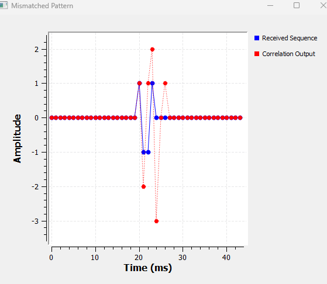

# Chapter 11: Correlation, Matched Filtering and Signal Detection

## Main Question

**How can a receiver find a known signal hidden inside another signal?**

In Chapter 10, we looked at an LTI system from a very useful point of
view. We treated a signal as a collection of scaled and shifted
impulses, and then built the output by adding scaled and shifted copies
of the system's impulse response.

That gave us convolution.

In this chapter, we are going to reuse that same machinery for a
different purpose.

Instead of asking,

> What does this system do to my signal?

we will ask,

> Does the signal I am looking for appear anywhere inside what I
> received?

That question sits at the heart of many real receivers.

A radar receiver may know the pulse it transmitted and search for a
delayed echo. A digital receiver may know a preamble and search for the
beginning of a packet. A GNSS receiver searches for known spreading
codes. Sonar systems search for echoes of known acoustic waveforms.

The received waveform may be noisy. It may arrive later than expected.
It may be difficult to recognize by eye.

Yet the receiver still needs to find it.

The basic tool that makes this possible is **correlation**.

Later, we will see that the same idea leads naturally to the **matched
filter**, and then to a practical detection rule based on a
**threshold**.

We will build the ideas experimentally first, using GNU Radio.

------------------------------------------------------------------------

## 11.1 A Different Kind of Question

Suppose we know that the short sequence

$$
p[n] = (1,\;1,\;-1,\;1)
$$

may appear somewhere inside a longer received sequence.

For example,

$$
x[n] = (0,\;0,\;0,\;1,\;1,\;-1,\;1,\;0,\;0,\;0).
$$

We can see the pattern easily because the example is tiny.

A real receiver does not have that luxury. It may be processing
thousands or millions of samples, and those samples may contain noise.

What we need is a numerical way to ask:

> How well does the received signal match my known pattern at this
> position?

Then we move the pattern and ask the same question again.

That is the basic intuition behind correlation.

------------------------------------------------------------------------

## 11.2 Correlation as a Sliding Similarity Test

Imagine placing the known pattern over part of the received signal.

At one position, the samples may not agree very well. At another
position, they may agree partially. At one particular position, they may
line up perfectly.

For our pattern,

$$
p[n] = (1,\;1,\;-1,\;1),
$$

a perfect alignment gives

$$
1(1)+1(1)+(-1)(-1)+1(1).
$$

Therefore,

$$
R = 1+1+1+1 = 4.
$$

Every sample agrees, so every multiplication contributes positively.

If the alignment is poor, some products are positive, some are negative,
and some may involve zeros. The sum is then smaller.

This gives us a useful first interpretation:

> **Correlation measures similarity as one signal is shifted past
> another.**

A large positive correlation means the received samples look strongly
like the known pattern at that alignment.

------------------------------------------------------------------------

## 11.3 Correlation and the Convolution We Already Know

There is an important connection to Chapter 10.

For real-valued sequences, correlation with a known pattern can be
implemented using convolution if we first reverse the known pattern.

Our pattern is

$$
p[n] = (1,\;1,\;-1,\;1).
$$

Reverse it:

$$
h[n] = (1,\;-1,\;1,\;1).
$$

Now use this reversed sequence as the taps of an FIR filter.

The FIR filter performs convolution, but because its impulse response is
the reversed known pattern, its output gives us the correlation values
we want.

This is why the first GNU Radio experiment uses an ordinary FIR filter.
We are not introducing a mysterious new mathematical machine. We are
reusing convolution in a clever way.

For a real sequence of length $N$,

$$
h[n] = p[N-1-n].
$$

For complex signals, which become very important in SDR, the
matched/correlation sequence is also conjugated:

$$
h[n] = p^*[N-1-n].
$$

We will return to this when we introduce the matched filter.

------------------------------------------------------------------------

# Experiment 11.1: Basic Correlation

Our first experiment asks a simple question:

> Can GNU Radio locate a known four-sample pattern inside a longer
> sequence?

We create a 100-sample frame with the pattern beginning after 20 zeros:

``` python
(0,)*20 + (1, 1, -1, 1) + (0,)*76
```

This expression is worth understanding.

-   `(0,)*20` creates 20 zeros.
-   `(1, 1, -1, 1)` is the pattern we want to detect.
-   `(0,)*76` fills the remainder of the frame with zeros.

The complete frame therefore contains

$$
20+4+76=100
$$

samples.

For the Vector Source, use:

  Setting         Value
  --------------- -------------------------------------
  Output type     Float
  Vector          `(0,)*20 + (1, 1, -1, 1) + (0,)*76`
  Repeat          Yes
  Vector Length   1

The FIR filter uses the reversed pattern:

``` python
(1, -1, 1, 1)
```

Use a Decimating FIR Filter with:

  Setting      Value
  ------------ -----------------
  Decimation   `1`
  Taps         `(1, -1, 1, 1)`

The Vector Source is connected directly to one input of the QT GUI Time
Sink and through the FIR filter to the other input.


For the display used here, we used 44 points so that the pattern and its
correlation response could be inspected clearly.

The result is shown below.


The blue samples are the received sequence. The red samples are the
correlation output.

The important feature is the red peak:

$$
R_{\max}=4.
$$

That is exactly what we predicted for a perfect match.

### Why is the peak not at the first sample of the pattern?

The pattern begins at sample 20, but the full correlation peak occurs
three samples later.

That is not an error.

The correlator needs all four samples before it can form the complete
four-sample comparison. For a pattern of length $N$ beginning at sample
$n_0$,

$$
n_{\text{peak}} = n_0 + N - 1.
$$

Here,

$$
n_{\text{peak}} = 20 + 4 - 1 = 23.
$$

This delay will appear again when we use longer patterns.

------------------------------------------------------------------------

> ### GNU Radio Toolbox: Vector Source
>
> **Vector Source** generates a sequence of values that we specify
> ourselves.
>
> It is extremely useful for controlled DSP experiments because we know
> exactly what samples enter the system.
>
> In this experiment, we use it to create zeros, insert a known
> four-sample pattern at a chosen location, and then continue with
> zeros.
>
> With **Repeat = Yes**, GNU Radio repeatedly sends the specified
> sequence.

------------------------------------------------------------------------

> ### GNU Radio Toolbox: Decimating FIR Filter
>
> An FIR filter calculates its output from a weighted sum of recent
> input samples.
>
> We already met the underlying idea through convolution in Chapter 10.
>
> Here, **Decimation = 1**, so we are not reducing the sample rate. We
> are using the block simply as an FIR filter.
>
> The important setting is the tap sequence. By setting the taps equal
> to the reversed known pattern, the FIR filter acts as a correlator for
> our real-valued sequence.

------------------------------------------------------------------------

## 11.4 The Peak Tells Us Where the Signal Is

A large correlation value tells us that the pattern matches, but
correlation gives us another piece of information too.

The **location of the peak** tells us where the pattern occurred.

To test this, we move the same pattern ten samples later.

------------------------------------------------------------------------

# Experiment 11.2: Shift the Pattern

Change the Vector Source to:

``` python
(0,)*30 + (1, 1, -1, 1) + (0,)*66
```

Nothing else changes.

The known waveform is identical. Only its location has moved.

The result is:


The correlation peak still reaches

$$
4,
$$

because the pattern itself has not changed.

But the peak has moved by ten samples.

The pattern now begins at sample 30, so the complete four-sample match
occurs at

$$
30+4-1=33.
$$

This gives us two different meanings for the correlation result:

-   **Peak height** tells us how strongly the received samples resemble
    the known pattern.
-   **Peak location** tells us where, or when, that pattern occurred.

That second property is extremely useful for synchronization and timing.

A receiver may not know exactly when a packet, pulse, or synchronization
sequence will arrive. Correlation can tell it.

------------------------------------------------------------------------

## 11.5 What If the Pattern Is Not Quite Right?

So far, the received sequence contains exactly what the correlator
expects.

What happens if one sample is wrong?

------------------------------------------------------------------------

# Experiment 11.3: A Mismatched Pattern

Keep the correlator unchanged, but replace the received pattern with

$$
(1,\;-1,\;-1,\;1).
$$

The Vector Source becomes:

``` python
(0,)*20 + (1, -1, -1, 1) + (0,)*76
```

The FIR taps remain:

``` python
(1, -1, 1, 1)
```

This is important. The receiver is still searching for the original
pattern

$$
(1,\;1,\;-1,\;1).
$$

At the intended alignment, the similarity is now

$$
1(1)+1(-1)+(-1)(-1)+1(1).
$$

Therefore,

$$
R = 1-1+1+1 = 2.
$$

The result confirms this.



The perfect-match value of 4 is gone. At the intended alignment, the
correlation is only 2.

The graph also contains negative correlation values. A negative value
does not simply mean "bad." It means the samples at that particular
alignment resemble an opposite or inverted relationship to the known
pattern.

For our present detector, the main point is simpler:

> **The better the waveform matches the expected pattern at the intended
> alignment, the stronger the positive correlation response.**

We have now learned what the peak height and peak position mean.

The next question is the one that really matters in a receiver.

What happens when noise is added?

------------------------------------------------------------------------

# 11.6 Finding a Known Signal in Noise

In the previous experiments, the received sequence was clean. Real
receivers rarely have that luxury.

Suppose the received signal is

$$
r[n] = s[n] + w[n],
$$

where $s[n]$ is the signal we want and $w[n]$ is noise.

If the noise becomes strong enough, simply looking at the waveform may
no longer tell us where the known pattern is.

Correlation gives us another way to look.

At the correct alignment, the known signal contributes in an organized
way. Matching samples reinforce each other.

Noise is different. It is not deliberately arranged to match our known
pattern. Some noise contributions increase the correlation and others
decrease it.

That does not make noise disappear, but it gives the known waveform a
chance to stand out.

------------------------------------------------------------------------

# Experiment 11.4: Correlation with Noise

We return to the correct four-sample pattern and add Gaussian noise.

For this experiment, the frame is 44 samples long:

``` python
(0,)*20 + (1, 1, -1, 1) + (0,)*20
```

We add a Noise Source and an Add block.

Use the Noise Source settings:

  Setting       Value
  ------------- ----------
  Noise Type    Gaussian
  Amplitude     `0.5`
  Seed          `0`
  Output Type   Float

The noisy signal is sent both to the display and to the FIR correlator.


At this point we also changed the way the samples are displayed.

### Why did we switch from a Time Sink to Stream to Vector and a Vector Sink?

With Gaussian noise running continuously, the QT GUI Time Sink behaves
like a live oscilloscope. The display keeps refreshing with new samples.
That made it difficult to compare fixed sample positions and to capture
a useful figure.

For this controlled experiment, we wanted to look at exactly one
44-sample frame at a time.

A **Stream to Vector** block collects consecutive scalar samples and
packages them into a fixed-length vector.

For both Stream to Vector blocks we use:

  Setting         Value
  --------------- -------
  IO Type         Float
  Num Items       `44`
  Vector Length   `1`

The QT GUI Vector Sink then displays those 44 values against fixed
sample indices.

Its important settings are:

  Setting              Value
  -------------------- ----------------
  Vector Size          `44`
  X-Axis Start Value   `0`
  X-Axis Step Value    `1`
  X-Axis Label         `Sample Index`
  Y-Axis Label         `Amplitude`
  Grid                 Yes
  Autoscale            Yes
  Average              None
  Number of Inputs     `2`
  Update Period        `2` s

The two lines are labelled:

-   `Noisy Received Signal`
-   `Correlation Output`

The two-second update period does not change the DSP. It only slows the
GUI refresh enough for us to inspect each noise realization comfortably.

The result is:


The blue waveform is now much less obvious than the clean sequence from
Experiment 11.1.

Yet the red correlation output still produces a strong response near the
expected pattern location.

The peak is not guaranteed to be exactly 4 anymore. Noise can push it
upward or downward.

There are also correlation fluctuations elsewhere because random noise
can accidentally resemble part of the known sequence.

That observation leads to an important limitation of our first detector:

> Four samples do not give the receiver much evidence.

So let us give it more.

------------------------------------------------------------------------

> ### GNU Radio Toolbox: Noise Source
>
> **Noise Source** generates random samples. We use Gaussian noise here
> to create a simple noisy-channel experiment.
>
> The **Amplitude** controls the noise strength. The **Seed** controls
> the random-number generator. Using a fixed seed is useful when we want
> reproducible experiments.

------------------------------------------------------------------------

> ### GNU Radio Toolbox: Add
>
> **Add** sums its input streams sample by sample.
>
> Here it creates the received signal
>
> $$
> r[n]=s[n]+w[n].
> $$
>
> One input is our known signal frame and the other is Gaussian noise.

------------------------------------------------------------------------

> ### GNU Radio Toolbox: Stream to Vector
>
> GNU Radio normally processes a continuous stream of scalar samples.
>
> **Stream to Vector** groups a chosen number of consecutive samples
> into one vector.
>
> In Experiment 11.4, 44 scalar samples become one 44-element vector.
> This lets us display a fixed frame with a meaningful sample index.

------------------------------------------------------------------------

> ### GNU Radio Toolbox: QT GUI Vector Sink
>
> **QT GUI Vector Sink** displays an entire vector at once.
>
> Unlike the Time Sink used earlier, we use its horizontal axis here as
> a fixed **Sample Index**. That makes it particularly convenient for
> controlled sequence experiments where we want to compare sample 20,
> sample 23, and so on directly.

------------------------------------------------------------------------

# Experiment 11.5: A Longer Known Pattern

Now we increase the known pattern from 4 samples to 16 samples:

``` python
(1, 1, -1, 1, -1, -1, 1, -1,
 1, -1, -1, -1, 1, 1, 1, -1)
```

We place it after 20 zeros in a 64-sample frame:

``` python
(0,)*20 + (1, 1, -1, 1, -1, -1, 1, -1,
           1, -1, -1, -1, 1, 1, 1, -1) + (0,)*28
```

The FIR taps must again be the reversed pattern:

``` python
(-1, 1, 1, 1, -1, -1, -1, 1,
 -1, 1, -1, -1, 1, -1, 1, 1)
```

Because the frame is now 64 samples long, both Stream to Vector blocks
use `Num Items = 64`, and the Vector Sink uses `Vector Size = 64`.

The noise amplitude remains `0.5`.


The strongest useful correlation response appears around sample 35.

Why 35?

The pattern starts at sample 20 and contains 16 samples:

$$
n_{\text{peak}}=20+16-1=35.
$$

Without noise, a perfect match would give

$$
R_{\max}=16,
$$

because each of the sixteen $\pm1$ samples contributes +1 at perfect
alignment.

In the noisy experiment, the peak is perturbed by noise, but it stands
out much more clearly than it did with the four-sample pattern.

The intuition is important.

At the correct alignment, the desired signal contributes coherently:

$$
1+1+1+\cdots+1.
$$

The noise is not organized according to the known pattern, so its
contributions do not all reinforce one another in the same way.

A longer known sequence therefore gives the receiver more evidence to
accumulate.

This is one reason practical communication and ranging systems often use
known preambles, training sequences, codes, or pulses rather than trying
to detect an event from only a couple of samples.

------------------------------------------------------------------------

# 11.7 From Correlation to the Matched Filter

We have reached an interesting point.

We already know the waveform we want to detect. We also know that
reversing it and using it as FIR taps gives us a strong correlation
response when the waveform arrives.

This suggests another question:

> If we know the signal in advance, can we design a filter specifically
> for that signal?

Yes.

That filter is called a **matched filter**.

A matched filter is not a general low-pass or high-pass filter. It is
designed specifically for the waveform the receiver expects.

For a known signal $p[n]$, the discrete-time matched-filter impulse
response is

$$
h[n]=p^*[N-1-n].
$$

The star means complex conjugation.

For our present real-valued $\pm1$ sequence,

$$
p^*[n]=p[n],
$$

so the expression becomes simply

$$
h[n]=p[N-1-n].
$$

That should look very familiar.

It is exactly the reversed pattern we have already been using to
implement correlation.

So for our real-valued experiment:

$$
\boxed{\text{correlation with }p[n]\;\Longleftrightarrow\;\text{filtering with the matched filter}}
$$

The two ideas come from slightly different viewpoints.

**Correlation viewpoint:**\
How similar is the received signal to the known pattern at each shift?

**Matched-filter viewpoint:**\
What FIR filter should I build if I want a strong response when this
known waveform arrives?

For our real sequence, they lead to the same FIR operation.

### Where are matched filters used?

Matched filtering appears in many practical systems.

  -----------------------------------------------------------------------
  Application             What is known?          What the receiver is
                                                  trying to find
  ----------------------- ----------------------- -----------------------
  Radar                   Transmitted pulse or    A delayed echo from a
                          coded waveform          target

  Sonar                   Transmitted acoustic    A reflected acoustic
                          waveform                echo

  Digital communications  Pulse shape, preamble,  Symbols, packet start,
                          training sequence       timing

  GNSS/GPS                Satellite spreading     A weak code sequence
                          code                    and its timing

  Wireless                Known synchronization   Frame or packet
  synchronization         sequence                boundaries
  -----------------------------------------------------------------------

The details differ, but the underlying idea is remarkably similar: **the
receiver already knows something about the waveform it wants to find.**

------------------------------------------------------------------------

# Experiment 11.6: Correlation vs. Matched Filter

Let us verify the connection directly in GNU Radio.

We send the same noisy received signal into two Decimating FIR Filters.

Both use exactly the same taps:

``` python
(-1, 1, 1, 1, -1, -1, -1, 1,
 -1, 1, -1, -1, 1, -1, 1, 1)
```

We call one branch `Correlation Output` and the other
`Matched Filter Output`.


The result is:


At first glance, it may look as if only one curve is present.

That is actually the result we wanted.

The two curves lie exactly on top of each other because both filters
receive the same input and use the same taps.

Therefore,

$$
y_{\text{corr}}[n]=y_{\text{MF}}[n].
$$

For this real-valued sequence, our correlator is the matched filter.

This is a nice connection back to Chapter 10. Convolution was not just
an abstract way to describe an LTI system. By choosing the impulse
response carefully, an ordinary FIR filter can become a detector for a
known waveform.

------------------------------------------------------------------------

## 11.8 Why Is It Called "Matched"?

Experiment 11.6 showed that correlation and matched filtering give the
same output in our setup.

But it did not yet show why the word **matched** matters.

To see that, we deliberately use the wrong filter.

------------------------------------------------------------------------

# Experiment 11.7: Matched vs. Mismatched Filter

The first FIR filter remains correctly matched to the transmitted
16-sample pattern:

``` python
(-1, 1, 1, 1, -1, -1, -1, 1,
 -1, 1, -1, -1, 1, -1, 1, 1)
```

For the second filter, we deliberately use a different 16-sample tap
sequence:

``` python
(1, -1, 1, -1, 1, -1, 1, -1,
 1, -1, 1, -1, 1, -1, 1, -1)
```

Everything else remains the same. Both filters receive exactly the same
noisy samples.

Because the flowgraph architecture is almost identical to Experiment
11.6, we do not need another nearly identical flowgraph figure.

The result tells the story much more clearly.


Around the expected full-alignment position near sample 35, the matched
filter produces a strong positive peak.

The mismatched filter does not.

Why?

For the correctly matched filter, the signal contributions line up
constructively. In the ideal noise-free case,

$$
1^2+1^2+(-1)^2+\cdots+(-1)^2=16.
$$

For the mismatched filter, some terms reinforce and others oppose each
other. Much more cancellation occurs.

This gives us a better interpretation of matched filtering:

> A matched filter does not necessarily make the entire output waveform
> look clean. It makes the response to the waveform we care about stand
> out strongly at the correct detection instant.

That is what we want from a detector.

------------------------------------------------------------------------

# 11.9 Seeing a Peak Is Not Enough

So far, we have been acting like human observers.

We look at the graph and say:

> There is a large peak around sample 35. The signal must be there.

A real receiver cannot depend on someone staring at a graph.

It needs a rule.

The simplest rule is a threshold.

If the matched-filter output is larger than some chosen value $T$,
declare a detection:

$$
y[n]>T.
$$

For our experiment, we choose

$$
T=8.
$$

This value is not universal or optimal. It is simply a useful
experimental threshold for the signal and noise levels we are using.

Now we need GNU Radio to convert that mathematical comparison into a
binary output.

------------------------------------------------------------------------

# Experiment 11.8: Threshold-Based Detection

GNU Radio did not provide a simple greater-than-constant block in the
setup we used, so we built the comparison from basic blocks.

The detector is:

``` text
Matched Filter
      |
      v
Add Const (-8)
      |
      v
Binary Slicer
      |
      v
Char to Float
      |
      v
Detection Output
```

The complete flowgraph is:


Let us understand each new block before looking at the result.

### Why Add Const = -8?

We want to test

$$
y[n]>8.
$$

The Binary Slicer makes its decision around zero, not around 8.

So we first move the threshold from 8 to zero by subtracting 8:

$$
z[n]=y[n]-8.
$$

GNU Radio's Add Const block **adds** a constant. Therefore, to subtract
8, we set

``` text
Constant = -8
```

Suppose the matched-filter output is 11:

$$
11-8=3.
$$

The result is positive, so the threshold has been crossed.

If the matched-filter output is 5:

$$
5-8=-3.
$$

The result is negative, so the threshold has not been crossed.

This is why we use **-8**, not +8.

Adding +8 would shift the signal in the wrong direction and would not
implement the test $y[n]>8$.

### What does Binary Slicer do?

After subtracting the threshold, we only care whether the result is on
one side of zero or the other.

The Binary Slicer turns that into a binary decision.

Conceptually,

$$
d[n]=
\begin{cases}
1, & y[n]>8\\
0, & y[n]\leq8.
\end{cases}
$$

So the output now has a very direct meaning:

-   `0` means no detection.
-   `1` means detection.

This is the point where our receiver stops merely measuring similarity
and starts making a decision.

### Why Char to Float?

The Binary Slicer outputs byte/char values.

Our display branch uses floating-point vectors.

The Char to Float block therefore converts

``` text
0 -> 0.0
1 -> 1.0
```

so the binary detector output can be displayed with the floating-point
matched-filter output.

It does **not** change the detection logic. It is only a data-type
conversion for visualization.

The result is:


The blue curve is the matched-filter output.

The red curve is now a binary detection signal.

Whenever the matched-filter output crosses the chosen threshold, the
detector produces a `1`.

We have finally moved from

> "That peak looks large"

to an automatic rule that a receiver can execute sample by sample.

------------------------------------------------------------------------

> ### GNU Radio Toolbox: Add Const
>
> **Add Const** adds the same constant to every input sample.
>
> In our detector we use `-8`, which means that 8 is subtracted from
> every matched-filter output sample.
>
> This shifts our desired threshold of 8 down to zero so that the Binary
> Slicer can make the final decision.

------------------------------------------------------------------------

> ### GNU Radio Toolbox: Binary Slicer
>
> **Binary Slicer** converts a numerical input into a binary decision
> around zero.
>
> In our experiment, the Add Const block has already shifted the
> threshold to zero. The slicer therefore turns the threshold test into
> zeros and ones.

------------------------------------------------------------------------

> ### GNU Radio Toolbox: Char to Float
>
> **Char to Float** converts byte/char samples into floating-point
> samples.
>
> It is not part of the detector mathematics here. We use it because the
> Binary Slicer output and our QT GUI display branch use different data
> types.

------------------------------------------------------------------------

# 11.10 False Alarms and Missed Detections

Choosing a threshold introduces a trade-off.

Our experimental value was

$$
T=8.
$$

What would happen if we lowered it?

Suppose we choose

$$
T=4.
$$

The detector becomes more sensitive. A weaker signal has a better chance
of crossing the threshold.

But ordinary noise fluctuations also have a better chance of crossing
it.

If the receiver declares that a signal is present when no signal is
actually present, we call that a **false alarm**.

Now suppose we raise the threshold:

$$
T=12.
$$

Noise is less likely to trigger the detector.

But a real signal weakened by noise, fading, or other channel effects
may also fail to reach the threshold.

If a signal is actually present but the receiver fails to detect it, we
call that a **missed detection**.

So the basic trade-off is:

  -----------------------------------------------------------------------
  Threshold choice                    Effect
  ----------------------------------- -----------------------------------
  Lower threshold                     More sensitive, but more false
                                      alarms

  Higher threshold                    More conservative, but greater risk
                                      of missed detections
  -----------------------------------------------------------------------

There is no threshold that is automatically correct for every receiver.

Practical systems choose thresholds based on the noise environment,
desired detection probability, acceptable false-alarm rate, signal
strength, and the consequences of making a wrong decision.

A full statistical treatment of detection theory goes beyond what we
need here. The important idea is already visible from our GNU Radio
experiment:

> **Correlation creates a useful detection statistic. The threshold
> turns that statistic into a decision.**

------------------------------------------------------------------------

# 11.11 Putting the Whole Receiver Story Together

We began this chapter with a very simple question:

> How can a receiver find a known signal hidden inside another signal?

We can now answer it step by step.

First, the receiver needs to know something about the waveform it is
looking for.

It then compares that known waveform with the incoming samples at
different alignments.

That comparison is correlation.

When the waveform lines up correctly, the matching sample contributions
reinforce each other and produce a peak.

The **height** of the peak tells us how strongly the received samples
match the known waveform.

The **location** of the peak tells us when the waveform occurred.

When noise is added, the correlation output also becomes noisy, but the
known signal can still produce a recognizable response.

Using a longer known pattern gives the receiver more matching samples
over which to accumulate evidence.

For a known real-valued sequence, correlation can be implemented as an
FIR filter whose taps are the reversed known waveform.

That FIR filter is the matched filter.

Finally, a threshold converts the matched-filter output into a practical
yes/no detection decision.

The complete idea can therefore be summarized as:

``` text
Received signal
      |
      v
Known-waveform correlation
or matched filter
      |
      v
Strong response at a match
      |
      v
Threshold
      |
      v
Signal detected
```

That small chain captures a surprisingly large part of how practical
receivers find known events inside noisy data.

------------------------------------------------------------------------

# 11.12 A Note About Complex SDR Signals

Our experiments deliberately used real-valued $\pm1$ sequences so that
the underlying idea remained easy to see.

An SDR, however, very often works with complex I/Q samples.

For a complex known waveform, simply reversing the samples is not
enough. We also take the complex conjugate:

$$
h[n]=p^*[N-1-n].
$$

This is the complex matched-filter form.

The basic intuition does not change.

We still ask:

> How strongly does this part of the received complex signal match the
> complex waveform I expect?

The conjugation ensures that the complex phases combine correctly during
the comparison.

This is one reason the ideas of complex signals, I/Q representation,
correlation, and matched filtering fit together so naturally in SDR.

------------------------------------------------------------------------

# 11.13 What We Learned

By working through the experiments rather than starting with formulas,
we discovered several important ideas.

-   Correlation is a sliding measure of similarity.
-   A perfect match between our four-sample $\pm1$ sequences produced a
    correlation value of 4.
-   Moving the known signal moved the correlation peak by the same
    number of samples.
-   Changing one sample reduced the intended-match correlation response.
-   Correlation can reveal a known waveform even when noise makes the
    received waveform difficult to recognize directly.
-   A longer known sequence gives the receiver more evidence to
    accumulate.
-   Correlation with a real known waveform can be implemented by an FIR
    filter using the reversed waveform as its taps.
-   That FIR structure is the matched filter for our real-valued
    sequence.
-   A correctly matched filter gives a much stronger useful response
    than a deliberately mismatched filter.
-   A threshold converts the matched-filter output into an automatic
    detection decision.
-   A low threshold increases false alarms, while a high threshold
    increases the risk of missed detections.

Most importantly, convolution from Chapter 10 has now acquired another
practical meaning.

An FIR filter is not only something that smooths signals or changes
frequency content.

If we choose its impulse response to match a waveform we care about, it
can become a **signal detector**.

------------------------------------------------------------------------

# 11.14 Connecting to the Next Chapter

So far, our known patterns have been abstract baseband sample sequences.
We deliberately avoided asking how such information gets placed onto a
physical radio-frequency carrier and transmitted through the air.

That is the next major step.

In **Chapter 12: Why Modulation Exists**, we will ask a different
question:

> **Why can't we simply transmit our original low-frequency information
> signal directly?**

That will take us from baseband DSP into analog communication.

We will look at why practical radio systems move information to a
carrier frequency, what modulation actually accomplishes, and how the
signal-processing ideas we have already developed begin to appear inside
a real communication system.

Correlation and matched filtering will return later. Once a receiver has
tuned, sampled, and demodulated a signal, it still needs to find timing,
synchronization sequences, packets, symbols, pulses, or other known
structures.

So Chapter 11 is not an isolated topic.

It gives us one of the central ideas of receiver design:

> **Knowing what to look for can make a weak signal much easier to
> find.**
