# Chapter 13: Amplitude Modulation

## Main Question

**How can information be carried by changing the amplitude of a carrier, and what do we gain or lose when we transmit the carrier and one or both sidebands?**

---

## From Frequency Translation to Amplitude Modulation

In Chapter 12, we started with a simple question: why do we need modulation at all?

By multiplying a low-frequency message by a higher-frequency carrier, we moved the message away from baseband and placed it around a carrier frequency. We saw that multiplication created two shifted copies of the message spectrum, one below the carrier and one above it. We also learned how a receiver could tune to the translated signal and coherently recover the original message.

For a single-tone message, the basic multiplication looked like this:

$$
m(t)\cos(2\pi f_c t)
$$

and produced components at

$$
f_c-f_m
$$

and

$$
f_c+f_m.
$$

At the end of Chapter 12, we gave that signal a name: **double-sideband suppressed-carrier**, or **DSB-SC**.

The name tells us exactly what we observed:

- **double-sideband** because both the lower and upper sidebands are present;
- **suppressed-carrier** because there is no separate carrier component at $f_c$.

That raises a natural question.

> If multiplying the message by the carrier already moves the information to the frequency region we want, why would we deliberately transmit the carrier as well?

That question leads directly to conventional amplitude modulation.

---

# 13.1 What Does Amplitude Modulation Actually Mean?

Imagine a pure carrier:

$$
c(t)=A_c\cos(2\pi f_c t).
$$

Its frequency and phase remain fixed. Its amplitude is also fixed, so by itself it carries no changing message.

Now imagine that instead of keeping the carrier amplitude constant, we allow a message signal to make the carrier larger and smaller with time.

A positive part of the message makes the carrier larger. A negative part makes it smaller. If the message varies slowly compared with the carrier, the rapidly oscillating carrier appears to sit inside a slowly changing outline.

That outline is called the **envelope**.

Conceptually:

```text
Message changes slowly
        |
        v
Carrier amplitude grows and shrinks
        |
        v
The envelope follows the message
```

This is the central idea of amplitude modulation.

The carrier frequency is not being moved back and forth. The carrier amplitude is being controlled by the message.

For a normalized message $m(t)$, conventional AM can be written as

$$
s(t)=A_c[1+\mu m(t)]\cos(2\pi f_c t),
$$

where:

- $A_c$ is the carrier amplitude;
- $f_c$ is the carrier frequency;
- $m(t)$ is the normalized message;
- $\mu$ is the **modulation index**.

The term

$$
1+\mu m(t)
$$

is what controls the instantaneous carrier amplitude.

The constant $1$ will turn out to be extremely important. It is the reason conventional AM contains a transmitted carrier, and it is also the reason a very simple receiver can recover the message.

Rather than beginning with a long derivation, let us build the signal and watch what happens.

---

# Experiment 13.1: Building Conventional AM and Exploring the Modulation Index

## What Are We Trying to Discover?

We want to answer four questions experimentally:

1. What does a conventional AM waveform look like in time?
2. What appears in its spectrum?
3. What does the modulation index $\mu$ actually change?
4. What happens when we increase $\mu$ beyond 1?

We will use:

$$
f_m=1\text{ kHz}
$$

for the message and

$$
f_c=10\text{ kHz}
$$

for the carrier.

The sample rate is

$$
f_s=64\text{ kS/s}.
$$

## Building the Signal

The flowgraph follows the AM equation directly:

```text
1 kHz message
      |
      v
  scale by μ
      |
      v
    Add 1
      |
      v
Multiply by 10 kHz carrier
      |
      +------> Time Sink
      |
      +------> Frequency Sink
```

In the actual flowgraph, the message amplitude is controlled by the QT GUI Range `mu`, so adding the constant `1` produces

$$
1+\mu\cos(2\pi f_m t).
$$

Multiplying by the carrier then produces conventional AM.

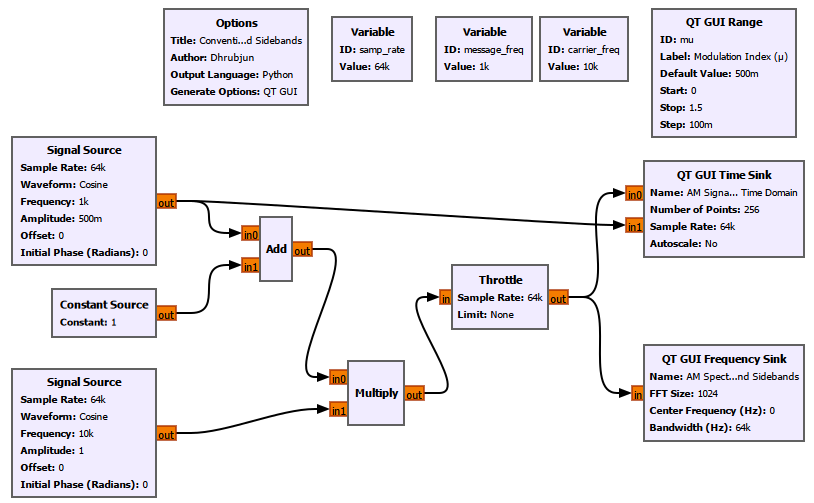

## Experiment Setup

We use the following main parameters:

| Parameter | Value |
|---|---:|
| Sample rate | 64 kS/s |
| Message frequency | 1 kHz |
| Carrier frequency | 10 kHz |
| Carrier amplitude | 1 |
| DC term added before modulation | 1 |

The message Signal Source uses `mu` as its amplitude. A QT GUI Range lets us change the modulation index while the flowgraph is running:

```text
ID: mu
Label: Modulation Index (μ)
Default Value: 500m
Start: 0
Stop: 1.5
Step: 100m
```

The Time Sink displays the AM waveform together with the original message, while the Frequency Sink shows the carrier and sidebands. The familiar Signal Source and GUI Sink settings are otherwise unchanged from the earlier experiments.

## Start with a Small Modulation Index

At a small value such as

$$
\mu=0.1,
$$

the carrier amplitude changes only slightly. The envelope is visible, but shallow.

As $\mu$ is increased to

$$
\mu=0.5,
$$

the carrier amplitude varies much more clearly with the message.

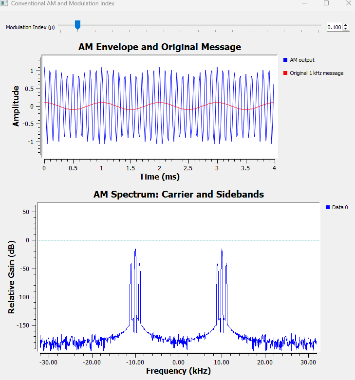

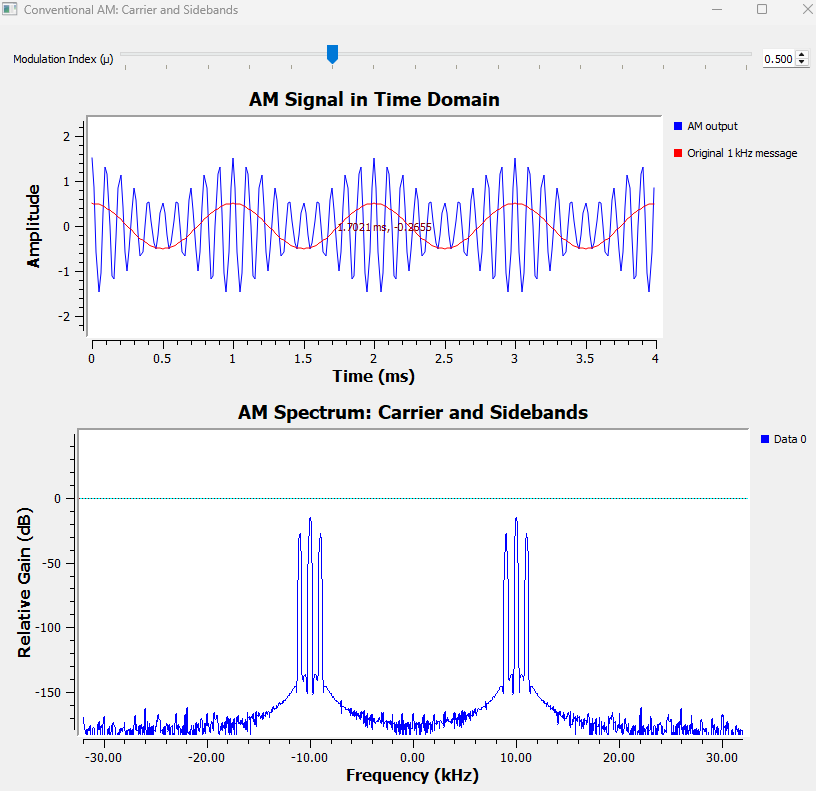

The important observation is that the high-frequency oscillation is still the 10 kHz carrier, but its outer boundary follows the much slower 1 kHz message.

## What Appears in the Spectrum?

The Frequency Sink shows three positive-frequency components:

$$
9\text{ kHz},\quad10\text{ kHz},\quad11\text{ kHz}.
$$

The middle component is the carrier:

$$
f_c=10\text{ kHz}.
$$

The two components on either side are the sidebands:

$$
f_{LSB}=f_c-f_m=9\text{ kHz}
$$

and

$$
f_{USB}=f_c+f_m=11\text{ kHz}.
$$

Because the AM waveform is real-valued, the Frequency Sink also shows corresponding negative-frequency components. As we learned earlier in the book, these are part of the Fourier representation of a real signal. They are not additional independent radio channels.

Now that we have seen the three components experimentally, the mathematics becomes much easier to interpret.

For a single-tone message,

$$
m(t)=\cos(2\pi f_m t),
$$

conventional AM is

$$
s(t)=A_c[1+\mu\cos(2\pi f_m t)]\cos(2\pi f_c t).
$$

Expanding it gives

$$
s(t)=A_c\cos(2\pi f_c t)+A_c\mu\cos(2\pi f_m t)\cos(2\pi f_c t).
$$

Using the product-to-sum identity gives

$$
s(t)=A_c\cos(2\pi f_c t)+\frac{A_c\mu}{2}\cos[2\pi(f_c-f_m)t]+\frac{A_c\mu}{2}\cos[2\pi(f_c+f_m)t].
$$

That equation describes exactly what GNU Radio showed us:

```text
Lower sideband        Carrier        Upper sideband
   fc - fm               fc              fc + fm
      |                   |                  |
------|-------------------|------------------|------
```

## What Does the Modulation Index Mean?

For our normalized cosine message, the envelope-controlling term is

$$
1+\mu\cos(2\pi f_m t).
$$

Its largest value is

$$
1+\mu
$$

and its smallest value is

$$
1-\mu.
$$

This immediately explains the three important operating regions.

### Under 100% Modulation: $0<\mu<1$

The minimum envelope remains positive:

$$
1-\mu>0.
$$

The envelope never reaches zero.

### 100% Modulation: $\mu=1$

Now

$$
1-\mu=0.
$$

The envelope just touches zero.

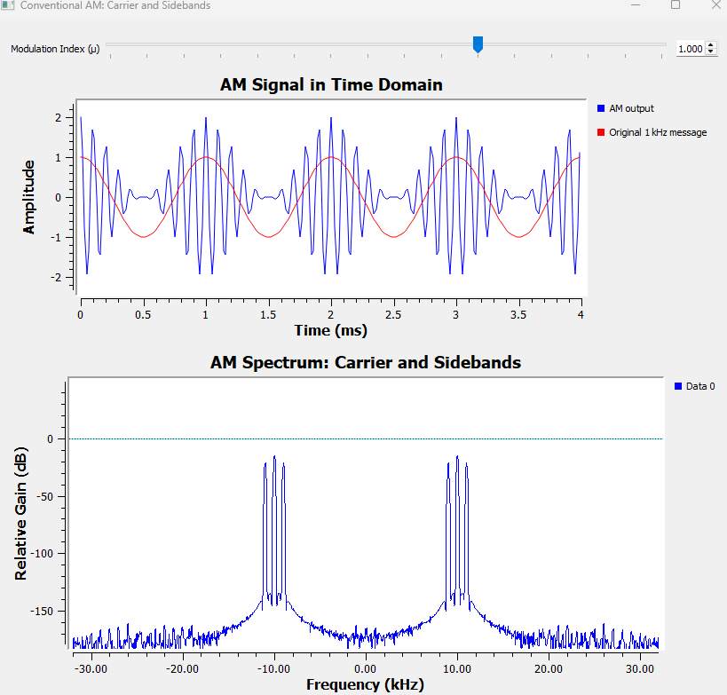

This is the limiting case for ordinary envelope detection without overmodulation.

### Overmodulation: $\mu>1$

Now

$$
1-\mu<0.
$$

The quantity controlling the carrier amplitude becomes negative during part of the message cycle.

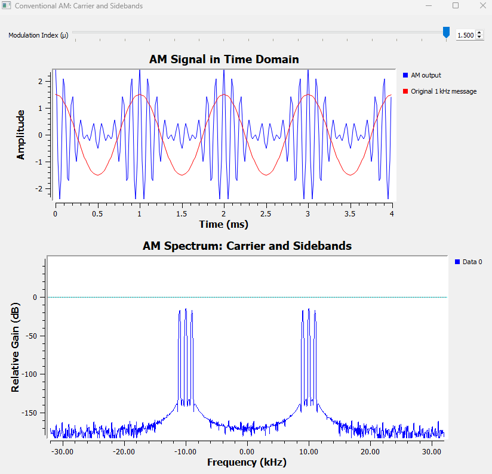

The waveform no longer has the simple nonnegative envelope that an ordinary envelope detector expects.

This will matter greatly when we build the receiver.

---

## Try It Yourself: Predict the Sidebands

Before changing the flowgraph, predict what will happen if the message frequency is changed from 1 kHz to 2 kHz while the carrier remains at 10 kHz.

Where should the two sidebands appear?

Use

$$
f_c-f_m
$$

and

$$
f_c+f_m
$$

to make the prediction first. Then change the message frequency and check the Frequency Sink.

The carrier should remain at 10 kHz, while the sidebands move to 8 kHz and 12 kHz.

---

# 13.2 Why Transmit the Carrier at All?

At this point conventional AM may seem wasteful.

Chapter 12 already showed us that DSB-SC can move the message around a carrier frequency without transmitting a separate carrier component. Conventional AM adds a large carrier at $f_c$.

Why?

The answer becomes clear at the receiver.

A DSB-SC receiver needs coherent detection. It multiplies the received signal by a locally generated carrier with the correct frequency and phase, then low-pass filters the result.

Conceptually:

```text
DSB-SC signal
     |
     v
Multiply by synchronized local carrier
     |
     v
Low-Pass Filter
     |
     v
Recovered message
```

Conventional AM gives us another possibility. Because the message is visible in the envelope, we can recover it without generating a synchronized 10 kHz oscillator.

That is what we test next.

---

# Experiment 13.2: Recovering AM with an Envelope Detector

## The Basic Idea

A simple envelope detector needs to do three things:

1. make the rapidly alternating AM waveform nonnegative;
2. smooth away the carrier-frequency ripple;
3. remove the remaining DC offset.

Our GNU Radio version is therefore:

```text
AM signal
    |
    v
   Abs
    |
    v
Low-Pass Filter
    |
    v
DC Blocker
    |
    v
Recovered message
```

We keep the AM transmitter from Experiment 13.1 and add the receiver to it.

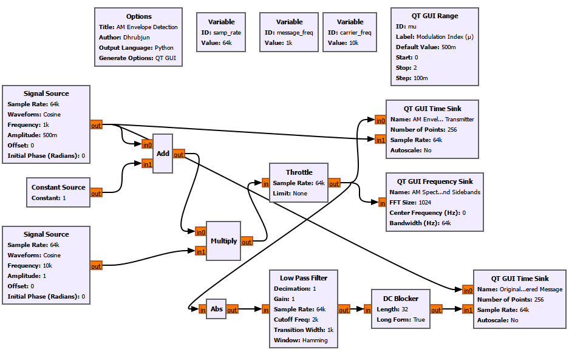

## Receiver Setup

We keep the same 64 kS/s sample rate, 1 kHz message, 10 kHz carrier, and modulation-index control from Experiment 13.1. Only the new receiver blocks need special attention.

The Low Pass Filter is configured as:

```text
Decimation: 1
Gain: 1
Sample Rate: samp_rate
Cutoff Frequency: 2k
Transition Width: 1k
Window: Hamming
```

The DC Blocker uses:

```text
Length: 32
Long Form: True
```

A two-input Time Sink named `Original and Recovered Message` displays the original message and the demodulated output together.

## Clean Envelope Recovery

At

$$
\mu=0.5,
$$

the envelope never reaches zero. The detector recovers a clean 1 kHz sinusoidal message.

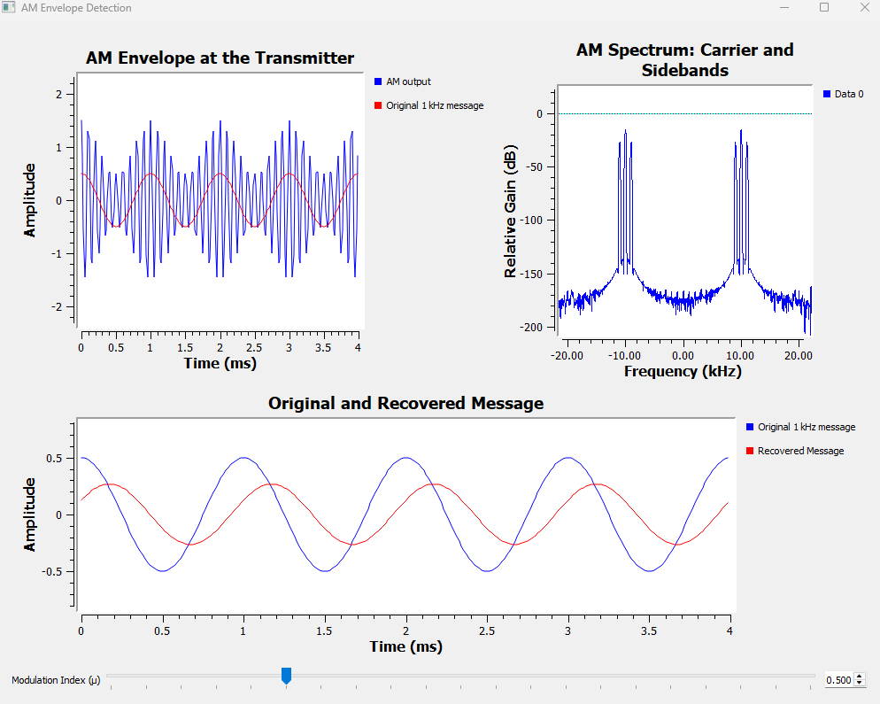

The recovered waveform is not necessarily identical in amplitude or perfectly aligned in time with the original. The filtering stages introduce scaling and delay. What matters here is that the original message shape is recovered without a synchronized local carrier.

This is the major practical advantage of conventional AM.

> The transmitted carrier consumes power, but it allows a much simpler receiver.

Historically, that simplicity mattered enormously. A receiver that can recover audio with a simple envelope detector is easier and cheaper to build than one requiring accurate carrier synchronization.

---

## GNU Radio Toolbox: Abs

The **Abs** block outputs the absolute value of each real input sample.

If the input is $x(t)$, the output is

$$
y(t)=|x(t)|.
$$

In our envelope detector, the AM carrier swings above and below zero rapidly. Taking the absolute value folds the negative portions upward.

That creates a waveform whose slow variation follows the AM envelope. The Low Pass Filter then removes most of the rapid carrier-related variation.

### Watch Out

The Abs block does not magically know what the message is. It discards sign information.

That is harmless only while the desired envelope itself does not cross below zero. This is why overmodulation causes a problem.

---

## GNU Radio Toolbox: DC Blocker

After rectification and low-pass filtering, the recovered signal contains a DC component because conventional AM was built from

$$
1+\mu m(t).
$$

The **DC Blocker** removes the constant or very slowly varying DC component, leaving the changing message centered around zero.

In this experiment it performs the final cleanup step:

```text
Rectified AM
     |
     v
Low-pass smoothing
     |
     v
Message + DC offset
     |
     v
DC Blocker
     |
     v
Message centered around zero
```

---

# 13.3 Why Overmodulation Breaks a Simple Envelope Detector

At

$$
\mu=1,
$$

the envelope just touches zero. This is the boundary case.

For

$$
\mu>1,
$$

the term

$$
1+\mu\cos(2\pi f_m t)
$$

becomes negative during part of each message cycle.

Our detector begins with an absolute-value operation, so it effectively observes

$$
|1+\mu\cos(2\pi f_m t)|.
$$

For $\mu\leq1$, the expression inside the absolute value never becomes negative, so

$$
|1+\mu\cos(2\pi f_m t)|=1+\mu\cos(2\pi f_m t).
$$

But once $\mu>1$, this is no longer true.

A negative value is folded upward:

```text
-0.2  ->  0.2
-0.5  ->  0.5
-1.0  ->  1.0
```

The detector can no longer tell whether a positive envelope value originally came from a positive or a negative value. Sign information has been lost before the Low Pass Filter even sees the signal.

To make this failure unmistakable, we deliberately increased the modulation index to

$$
\mu=2.
$$

Then the envelope-controlling term ranges from

$$
-1
$$

to

$$
3.
$$

The recovered waveform becomes visibly distorted and develops broad flattened regions.

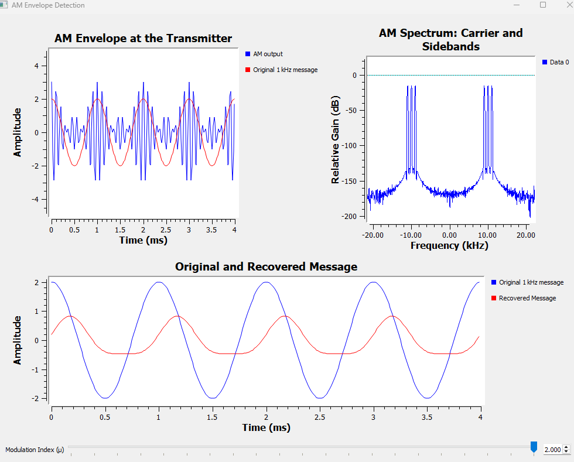

The value $\mu=2$ is not a special boundary. Overmodulation begins as soon as $\mu>1$. We used $\mu=2$ simply because it makes the failure easy to see.

### Now Break the Flowgraph

Move the modulation-index control slowly through

$$
0.5\rightarrow1.0\rightarrow1.5\rightarrow2.0.
$$

Watch the recovered waveform rather than only the transmitted AM waveform.

Ask:

> At what point does the receiver stop recovering a faithful sinusoid?

This is a useful reminder that a transmitter waveform should not be judged only by how it looks at the transmitter. What matters is whether the receiver can recover the information.

---

# 13.4 The Price of a Simple Receiver

We now understand why conventional AM transmits a carrier.

It buys receiver simplicity.

But how expensive is that convenience in transmitted power?

Look again at the conventional AM spectrum:

```text
LSB        Carrier        USB
 |            |            |
9 kHz       10 kHz       11 kHz
```

The sidebands change when the message changes. The carrier remains at the same frequency and amplitude.

This suggests an important question:

> How much of the transmitter's power is going into the carrier, and how much is going into the sidebands that represent the changing message?

Instead of estimating this from the dB scale of a spectrum display, we built the percentages directly into GNU Radio.

---

# Experiment 13.3: Where Does the Power Go in Conventional AM?

The transmitter is the same conventional AM generator used earlier, but the GUI now calculates and displays the carrier and sideband power percentages as the modulation index changes.

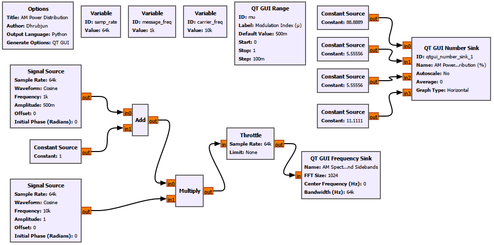

## Experiment Setup

We keep the same 64 kS/s sample rate, 1 kHz message, and 10 kHz carrier. The message Signal Source again uses `mu` as its amplitude, but for this experiment the QT GUI Range is limited to the normal AM region:

```text
ID: mu
Label: Modulation Index (μ)
Default Value: 500m
Start: 0
Stop: 1
Step: 100m
```

The power percentages are calculated directly inside four Float Constant Source blocks:

```text
Carrier Power: 100 / (1 + mu**2 / 2)
LSB Power: 50 * (mu**2 / 2) / (1 + mu**2 / 2)
USB Power: 50 * (mu**2 / 2) / (1 + mu**2 / 2)
Total Sideband Power: 100 * (mu**2 / 2) / (1 + mu**2 / 2)
```

These four constant streams feed a QT GUI Number Sink named `AM Power Distribution (%)`, with its display range set from 0 to 100. The Frequency Sink remains `AM Spectrum: Carrier and Sidebands`. This lets the numerical power distribution and the changing spectrum respond to the same `mu` control.

---

## First Observation: $\mu=0$

With

$$
\mu=0,
$$

the AM equation reduces to

$$
s(t)=A_c\cos(2\pi f_c t).
$$

There is no message modulation at all.

GNU Radio shows:

$$
P_C=100\%
$$

and

$$
P_{LSB}=P_{USB}=0\%.
$$

The spectrum contains only the carrier at 10 kHz on the positive-frequency side.

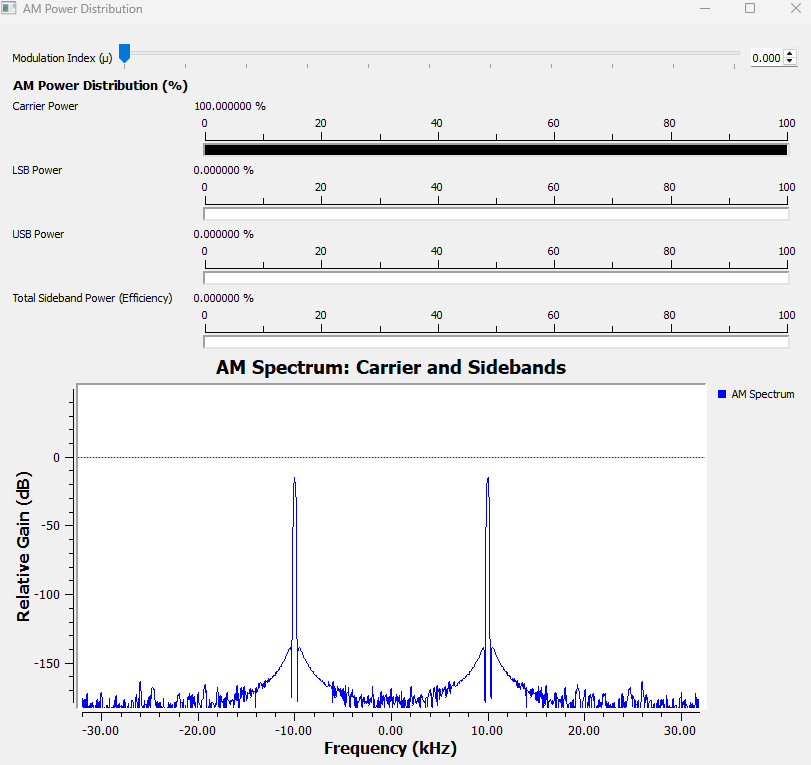

This gives us a useful interpretation:

> No modulation means no sidebands.

The transmitter can radiate a perfectly strong carrier while conveying none of our changing 1 kHz message.

---

## At $\mu=0.5$

The sidebands appear and the live display shows approximately

$$
P_C=88.89\%,
$$

$$
P_{LSB}=P_{USB}=5.56\%,
$$

and

$$
P_{SB,total}=11.11\%.
$$

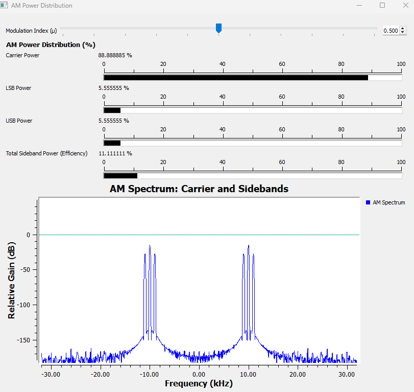

The sidebands have grown, but almost 89% of the total transmitted power is still in the carrier.

---

## At $\mu=1$

At 100% modulation, the sidebands are at their strongest without entering overmodulation.

GNU Radio shows approximately

$$
P_C=66.67\%,
$$

$$
P_{LSB}=P_{USB}=16.67\%,
$$

and

$$
P_{SB,total}=33.33\%.
$$

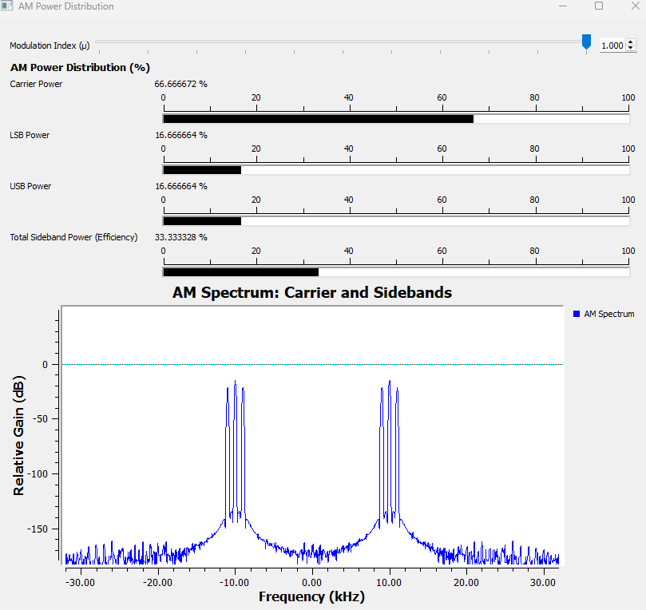

This is the key result:

> Even at 100% modulation, about two-thirds of the transmitted power is in the carrier. Only one-third is in the two information-bearing sidebands.

Now let us see where those percentages come from.

---

# 13.5 AM Power and Efficiency

For a sinusoid with amplitude $A$ across a normalized $1\ \Omega$ load, the average power is

$$
P=\frac{A^2}{2}.
$$

The conventional AM carrier has amplitude $A_c$, so

$$
P_c=\frac{A_c^2}{2}.
$$

From the expansion of the AM signal, each sideband has amplitude

$$
\frac{A_c\mu}{2}.
$$

Therefore the power in each sideband is

$$
P_{SB}=\frac{1}{2}\left(\frac{A_c\mu}{2}\right)^2=\frac{A_c^2\mu^2}{8}.
$$

There are two sidebands, so their total power is

$$
P_{SB,total}=\frac{A_c^2\mu^2}{4}.
$$

Since

$$
P_c=\frac{A_c^2}{2},
$$

we can write

$$
P_{SB,total}=P_c\frac{\mu^2}{2}.
$$

The total transmitted power is therefore

$$
P_T=P_c+P_{SB,total}=P_c\left(1+\frac{\mu^2}{2}\right).
$$

If we define conventional AM power efficiency as the fraction of total transmitted power contained in the information-bearing sidebands, then

$$
\eta=\frac{P_{SB,total}}{P_T}=\frac{\mu^2/2}{1+\mu^2/2}.
$$

At the largest modulation index normally used without overmodulation,

$$
\mu=1,
$$

so

$$
\eta=\frac{1/2}{1+1/2}=\frac{1}{3}\approx33.3\%.
$$

For single-tone conventional AM at 100% modulation,

$$
\boxed{\eta_{max}\approx33.3\%}.
$$

The remaining

$$
66.7\%
$$

is carrier power.

This does not mean the carrier is useless. It is precisely what enabled our simple envelope detector. The point is that conventional AM makes an engineering trade-off:

$$
\boxed{\text{simple receiver}\quad\longleftrightarrow\quad\text{poor power efficiency}}
$$

---

## GNU Radio Toolbox: QT GUI Number Sink

The **QT GUI Number Sink** displays numerical values from one or more input streams.

In this experiment, the quantities we wanted to display were calculated from the modulation index rather than measured from a changing signal stream. We therefore used Constant Source blocks whose values depend on `mu`, then connected those streams to the Number Sink.

This gave us a live display of:

- carrier power percentage;
- LSB power percentage;
- USB power percentage;
- total sideband power percentage.

The horizontal graph range was set from 0 to 100 so the bar length itself also represented a percentage visually.

### Why Not Estimate Power from Peak Height Alone?

The Frequency Sink is excellent for showing where spectral components are located and how they change, but a dB peak height is not the same thing as directly reading a percentage of total transmitted power.

The Number Sink made the power relationship explicit while the Frequency Sink provided the spectral evidence.

---

# 13.6 Do the Sidebands Really Carry the Message?

It is common to say that the sidebands carry the information. That statement is useful, but it deserves a careful interpretation.

At $\mu=0$, the transmitter produces only the carrier. Whether our intended message was 500 Hz, 1 kHz, speech, music, or nothing at all, that unmodulated carrier by itself does not reproduce the changing message waveform.

When a 1 kHz message is applied, sidebands appear at

$$
f_c-1\text{ kHz}
$$

and

$$
f_c+1\text{ kHz}.
$$

If the message frequency changes to 2 kHz, those sidebands move accordingly.

For a complicated message, such as speech, the whole baseband spectrum is translated into sidebands around the carrier.

So when we say that the sidebands carry the information, we mean that their spectral content reflects the changing amplitude and frequency content of the message. The carrier mainly provides the reference that makes simple envelope detection possible.

That immediately suggests another question:

> If the carrier consumes most of the power, what happens if we stop transmitting it?

We already know the answer from Chapter 12: we return to DSB-SC.

Now we can compare the two schemes for a much more meaningful reason.

---

# Experiment 13.4: Conventional AM vs DSB-SC

We generate conventional AM and DSB-SC from the same 1 kHz message and the same 10 kHz carrier.

The two branches differ by only one important step.

```text
                         +--> Add 1 --> Multiply --> Conventional AM
                         |                ^
1 kHz message -----------+             10 kHz
                         |              carrier
                         |                v
                         +----------> Multiply --> DSB-SC
```

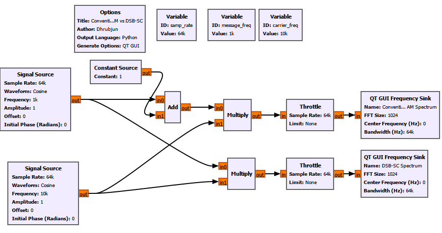

## Experiment Setup

For this comparison we use a 64 kS/s sample rate, a 1 kHz message of amplitude 1, and a 10 kHz carrier of amplitude 1. The same message and carrier feed both branches.

```text
Conventional AM: Message --> Add Constant 1 --> Multiply by carrier
DSB-SC:          Message ---------------------> Multiply by carrier
```

Two Frequency Sinks, `Conventional AM Spectrum` and `DSB-SC Spectrum`, display the results side by side. No special settings are needed beyond the familiar 1024-point FFT and `samp_rate` bandwidth.

## What Do We See?

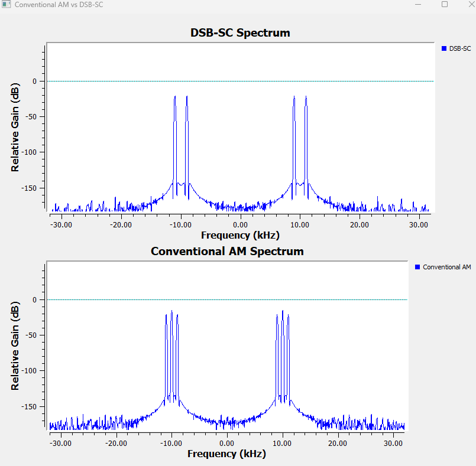

Conventional AM contains

$$
9\text{ kHz},\quad10\text{ kHz},\quad11\text{ kHz}.
$$

DSB-SC contains

$$
9\text{ kHz},\quad11\text{ kHz},
$$

but no separate 10 kHz carrier component.

So:

$$
\boxed{\text{Conventional AM}=\text{Carrier}+\text{LSB}+\text{USB}}
$$

while

$$
\boxed{\text{DSB-SC}=\text{LSB}+\text{USB}}.
$$

## Suppressing the Carrier Saves Power, Not Bandwidth

This distinction is important.

Both signals still extend from 9 kHz to 11 kHz for our single-tone demonstration. For a general baseband message of bandwidth $B$,

$$
BW_{AM}=2B
$$

and

$$
BW_{DSB-SC}=2B.
$$

Removing the carrier therefore improves power efficiency, but it does **not** reduce the occupied bandwidth.

And the power saving comes with a cost.

Conventional AM can use the simple envelope detector from Experiment 13.2.

DSB-SC normally requires coherent detection, which means the receiver must recreate or recover a carrier with suitable frequency and phase accuracy.

So we have another engineering trade-off:

| Property | Conventional AM | DSB-SC |
|---|---|---|
| Carrier | Transmitted | Suppressed |
| Sidebands | LSB + USB | LSB + USB |
| Bandwidth for message bandwidth $B$ | $2B$ | $2B$ |
| Power efficiency | Poor | Better |
| Simple envelope detection | Yes, when not overmodulated | No |
| Coherent detection | Not required for basic envelope detection | Required |

Neither scheme is automatically better in every situation. One favors receiver simplicity; the other avoids spending transmitter power on a large carrier.

But DSB-SC leaves us with another question.

> We removed the carrier, but why are we still transmitting two sidebands?

---

# 13.7 Do We Really Need Both Sidebands?

With a single 1 kHz message, DSB-SC gives us components at 9 kHz and 11 kHz. Both came from the same original 1 kHz tone.

For a real message with many frequencies, the situation is more interesting. The lower and upper sidebands contain mirrored versions of the same baseband information.

If one complete sideband is sufficient to reconstruct the message, then transmitting both uses twice the necessary sideband bandwidth.

To make this visible, a single-tone message is not enough. A single sinusoid has no meaningful occupied band to compare. So we built a simple three-tone message:

$$
m(t)=0.3\cos(2\pi500t)+0.3\cos(2\pi1000t)+0.3\cos(2\pi1500t).
$$

This gives us a message extending to 1.5 kHz and lets us see how a group of message frequencies behaves.

---

# Experiment 13.5: From DSB-SC to SSB-SC

## Step 1: Build a Multi-Tone Message

Three Signal Source blocks generate:

```text
500 Hz   amplitude 0.3
1 kHz    amplitude 0.3
1.5 kHz  amplitude 0.3
```

They are added together and multiplied by a 10 kHz carrier.

The resulting DSB-SC signal contains the lower-sideband components

$$
8.5\text{ kHz},\quad9\text{ kHz},\quad9.5\text{ kHz}
$$

and the upper-sideband components

$$
10.5\text{ kHz},\quad11\text{ kHz},\quad11.5\text{ kHz}.
$$

Notice something important about the order.

The USB maps

```text
500 Hz   -> 10.5 kHz
1 kHz    -> 11.0 kHz
1.5 kHz  -> 11.5 kHz
```

while the LSB maps

```text
500 Hz   -> 9.5 kHz
1 kHz    -> 9.0 kHz
1.5 kHz  -> 8.5 kHz
```

The lower sideband is therefore frequency-reversed around the carrier. The two sidebands are not simply identical left-to-right drawings. They are mirrored representations of the same message information.

## Step 2: Remove One Sideband

We pass the DSB-SC signal through a Band Pass Filter that retains the USB.

```text
Three-tone message
       |
       v
Multiply by 10 kHz carrier
       |
       v
     DSB-SC
       |
       v
Band Pass Filter
       |
       v
SSB-SC: USB only
```

The final flowgraph also includes coherent demodulation so that we can prove the message survives.

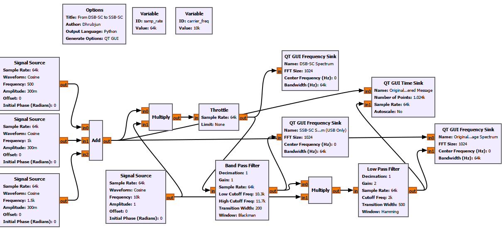

## Experiment Setup

The sample rate remains 64 kS/s and the carrier remains 10 kHz. The baseband message is now the sum of three cosine tones:

| Tone | Frequency | Amplitude |
|---|---:|---:|
| 1 | 500 Hz | 0.3 |
| 2 | 1 kHz | 0.3 |
| 3 | 1.5 kHz | 0.3 |

The familiar Signal Sources use the common `samp_rate`. The important new setting is the Band Pass Filter that selects the USB:

```text
Decimation: 1
Gain: 1
Sample Rate: samp_rate
Low Cutoff Frequency: 10.3k
High Cutoff Frequency: 11.7k
Transition Width: 200
Window: Blackman-Harris
```

The filtered USB-only signal is then coherently multiplied by the same 10 kHz carrier. The recovery Low Pass Filter uses:

```text
Decimation: 1
Gain: 2
Sample Rate: samp_rate
Cutoff Frequency: 2k
Transition Width: 500
Window: Hamming
```

The GUI shows `DSB-SC Spectrum`, `SSB-SC Spectrum (USB Only)`, `Original and Recovered Message`, and `Original and Recovered Message Spectrum`.

## What Did the Spectrum Show?

The DSB-SC spectrum contains both groups of three tones.

After the Band Pass Filter, only the USB group remains strongly around the positive carrier frequency.

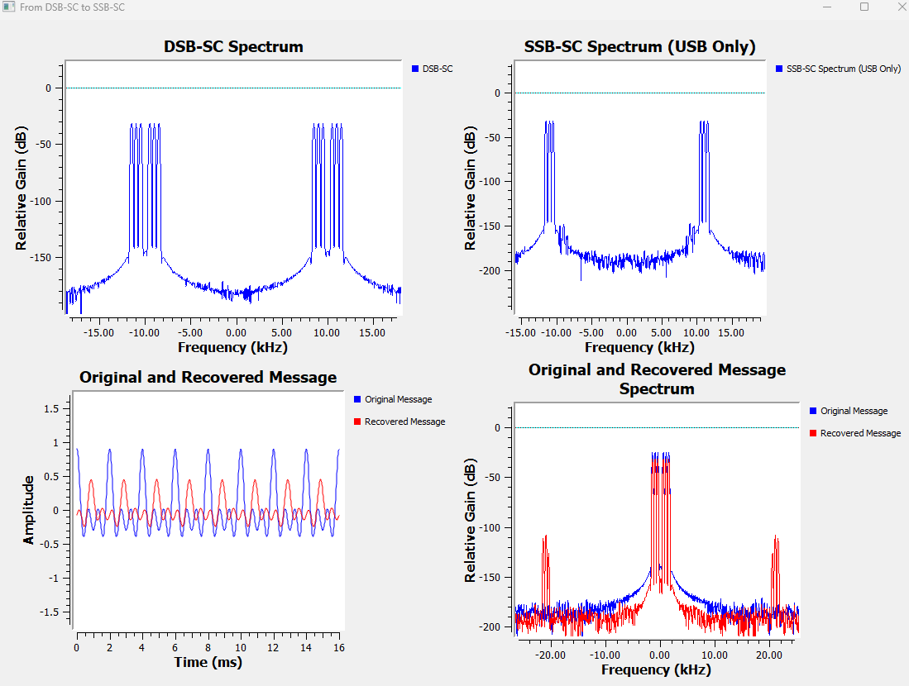

The SSB Frequency Sink still shows corresponding components around negative 10 kHz. This can be confusing at first.

They do **not** mean that the unwanted lower sideband has returned.

Our transmitted SSB waveform in this experiment is real-valued. A real signal has conjugate-symmetric positive- and negative-frequency components. When we say that the positive-frequency signal contains the USB only, the corresponding negative-frequency mirror is still required by the Fourier representation of a real waveform.

This connects directly to our earlier chapters on positive and negative frequencies and real versus complex signals.

---

## A Practical Filtering Lesson

Initially, the unwanted sideband was still visibly present after filtering. Changing the Band Pass Filter window to **Blackman-Harris** produced much stronger rejection.

That observation teaches something useful about practical SSB generation.

An ideal textbook filter may be drawn as a perfectly vertical wall:

```text
Pass everything here | Reject everything there
                     |
                     |
---------------------|-------------------------
```

A real digital filter has a transition region and finite stopband attenuation.

This becomes especially important when message components lie very close to the carrier, because the LSB and USB then approach one another closely. Separating them by filtering can require a demanding filter.

Our experiment therefore did more than demonstrate SSB. It also showed why practical filter design matters in communication systems.

---

## Step 3: Can We Recover the Complete Message from One Sideband?

This is the most important part of the experiment.

The USB-only signal is coherently mixed with the 10 kHz carrier and low-pass filtered.

The recovered spectrum contains the original message components at

$$
500\text{ Hz},\quad1\text{ kHz},\quad1.5\text{ kHz}.
$$

So even though we transmitted only one sideband, the complete three-tone message could still be recovered.

That gives us the central result:

$$
\boxed{\text{One complete sideband contains enough information to reconstruct the original message.}}
$$

The recovered time waveform does not lie perfectly on top of the original waveform. This is not surprising. The signal has passed through both a Band Pass Filter and a Low Pass Filter, which introduce delay and frequency-dependent phase shifts. A multi-tone waveform is particularly sensitive to the relative phases of its components.

For that reason, the recovered frequency spectrum is especially useful here. It shows directly that all three message frequencies survived.

---

## Bandwidth: DSB-SC vs SSB-SC

For a message with bandwidth $B$, DSB-SC occupies both sides of the carrier:

$$
BW_{DSB-SC}=2B.
$$

SSB transmits only one of them:

$$
BW_{SSB}=B.
$$

So the progression is now clear:

```text
Conventional AM
Carrier + LSB + USB
        |
        | suppress carrier
        v
DSB-SC
LSB + USB
        |
        | suppress one sideband
        v
SSB-SC
LSB or USB
```

Suppressing the carrier saves power.

Suppressing one sideband saves additional power **and** cuts the required sideband bandwidth in half.

---

## GNU Radio Toolbox: Band Pass Filter

A **Band Pass Filter** passes a selected range of frequencies while attenuating frequencies below and above that range.

In Experiment 13.5, we used it to keep the upper sideband:

```text
Wanted USB:     10.5 kHz to 11.5 kHz
Carrier region: 10 kHz
Unwanted LSB:    8.5 kHz to 9.5 kHz
```

The important parameters were:

- low cutoff frequency;
- high cutoff frequency;
- transition width;
- window;
- sample rate.

The transition width determines how quickly the filter moves between its stopband and passband. A narrower transition generally demands a more selective filter.

The window affects characteristics such as stopband attenuation and transition behavior. In our SSB experiment, changing to Blackman-Harris improved rejection of the unwanted sideband enough to make the USB-only result much clearer.

### Watch Out

Do not interpret a practical band-pass filter as an ideal frequency-domain knife. Some residual unwanted-sideband energy may remain. In real communication systems we often talk about **sideband suppression** rather than pretending the unwanted sideband has mathematically vanished.

---

# 13.8 How Is SSB Generated in Practice?

Our experiment used the most intuitive route:

```text
Generate DSB-SC
      |
      v
Filter away one sideband
      |
      v
SSB-SC
```

This is called the **filter method**.

It is an excellent way to understand what SSB means, but it is not the only way to generate it.

In SDR, another route is especially important because it connects SSB to complex signals, I/Q processing, Hilbert transforms, and analytic signals.

Those ideas may have seemed abstract when we first met positive and negative frequencies. Here they solve a real modulation problem.

---

# 13.9 The Filter Method

The filter method begins with DSB-SC:

$$
s_{DSB-SC}(t)=m(t)\cos(2\pi f_c t).
$$

This creates both sidebands. A selective band-pass filter then keeps either the USB or the LSB.

The advantage is conceptual simplicity.

The difficulty appears when the message contains important frequencies very close to DC. Those components create sideband energy very close to the carrier frequency. The gap between the wanted and unwanted sidebands can then become extremely small, making the required filter more difficult to realize.

Our Experiment 13.5 gave us a mild version of this practical problem. The choice of filter window visibly affected how well the unwanted sideband was suppressed.

So engineers developed other ways of creating SSB that do not rely only on cutting one sideband away with an extremely sharp filter.

---

# 13.10 The Phasing Method: Cancel the Sideband Instead of Filtering It

Suppose we could create two versions of the message that are 90 degrees apart in phase, and also two carrier signals that are 90 degrees apart.

Then we could combine the resulting products so that one sideband adds while the other cancels.

Conceptually:

```text
                         +--> × cos(2πfct) --+
Message ----------------|                    |
                         |                    +--> Add/Subtract --> SSB
                         |                    |
                         +--> 90° shift --> × sin(2πfct)
```

This is the basic idea behind the **phasing method**.

Instead of first producing both sidebands and then removing one with a narrow filter, we arrange the phases so that the unwanted sideband cancels during addition or subtraction.

To do this for a general message, we need a way to construct the required quadrature version of that message.

That is where the Hilbert transform enters.

---

# 13.11 The Hilbert Transform: Creating the Quadrature Message

Let the original real message be

$$
m(t).
$$

Its Hilbert transform is commonly written as

$$
\hat{m}(t).
$$

For our purpose, the most useful intuition is this:

> The Hilbert transform creates a quadrature version of the signal, applying a 90-degree phase relationship in the frequency-domain sense required for analytic-signal construction.

For a simple cosine, depending on the sign convention,

$$
\cos(2\pi f_m t)\xrightarrow{\text{Hilbert}}\sin(2\pi f_m t)
$$

up to sign.

For a complicated message, however, it is better not to think of the Hilbert transform as merely delaying the whole waveform by one-quarter of a cycle. Different frequencies have different periods, so there is no single time delay that represents 90 degrees for every frequency simultaneously.

The Hilbert transform is a frequency-dependent phase operation.

That distinction is important.

---

# 13.12 The Analytic Signal

Once we have the original message and its Hilbert transform, we can combine them into a complex signal:

$$
m_a(t)=m(t)+j\hat{m}(t).
$$

This is called the **analytic signal** associated with $m(t)$.

The remarkable property of the analytic signal is that, ideally, it contains only one side of the frequency spectrum.

This connects directly to something we learned much earlier:

- a real cosine contains positive and negative frequency components;
- a properly constructed complex signal can represent only one frequency direction.

The analytic signal uses exactly that idea.

We can then translate it to the carrier frequency using a complex exponential:

$$
m_a(t)e^{j2\pi f_c t}.
$$

Taking the real part gives an SSB waveform:

$$
s_{SSB}(t)=\operatorname{Re}\{m_a(t)e^{j2\pi f_c t}\}.
$$

Expanding the expression gives

$$
s_{SSB}(t)=m(t)\cos(2\pi f_c t)-\hat{m}(t)\sin(2\pi f_c t).
$$

With the corresponding sign choice, the other sideband can be selected:

$$
s_{SSB}(t)=m(t)\cos(2\pi f_c t)+\hat{m}(t)\sin(2\pi f_c t).
$$

Which sign is labeled USB or LSB depends on the Hilbert-transform and oscillator sign convention being used. The important idea is not to memorize a sign blindly.

The important idea is:

> One combination makes the unwanted sideband cancel while the desired sideband reinforces.

This is the phasing method expressed using the language of complex signals.

---

# 13.13 Why Analytic Signals Matter in SDR

This is one of the places where several earlier chapters come together.

We previously learned about:

- complex numbers;
- I and Q components;
- positive and negative frequencies;
- complex baseband;
- frequency translation.

Now we can see why SDR systems use those ideas so heavily.

The analytic signal gives us a complex representation in which one side of the spectrum can be treated independently. Complex multiplication by

$$
e^{j2\pi f_c t}
$$

then shifts that spectrum cleanly in frequency.

Conceptually:

```text
Real message m(t)
       |
       +--------------------+
       |                    |
       v                    v
       I                 Hilbert
       |                    |
       |                    v
       |                    Q
       +---------+----------+
                 |
                 v
          Complex analytic signal
             m(t) + j m^(t)
                 |
                 v
        Complex frequency shift
                 |
                 v
          Selectable SSB signal
```

Here `m^(t)` in the diagram represents the Hilbert-transformed message $\hat{m}(t)$.

This is much more than a trick for SSB. Analytic and complex signals are fundamental tools throughout modern SDR because they let us represent and manipulate spectral direction explicitly.

---

# 13.14 SSB with Carrier and Reduced Carrier

So far, when we said SSB we mainly meant **SSB-SC**:

```text
One sideband
No transmitted carrier
```

But a system does not always have to suppress the carrier completely.

An SSB signal may retain a carrier or a reduced carrier component. The general idea is:

```text
SSB-SC
One sideband + no carrier

SSB with carrier
One sideband + carrier

Reduced-carrier SSB
One sideband + smaller carrier reference
```

Why would we put some carrier back after working so hard to remove it?

For the same reason conventional AM transmitted one in the first place: a carrier reference can simplify parts of the receiver, especially carrier recovery or tuning.

The trade-off returns:

- more carrier power can make reception easier;
- less carrier power improves transmitter power efficiency.

So SSB is not only one rigid waveform. Practical systems can choose how much carrier, if any, is appropriate for the application.

---

# 13.15 Vestigial Sideband: A Practical Compromise

There is another problem with ideal SSB.

Suppose the message contains important frequencies very close to zero. After modulation, the two sidebands meet very close to the carrier. Removing one sideband perfectly would require a very sharp transition.

Instead of demanding perfect removal, we can deliberately keep:

- one complete sideband;
- a small **vestige** of the other sideband.

This is called **vestigial sideband**, or **VSB**.

Conceptually:

```text
DSB                 SSB                 VSB

LSB | USB               | USB            vestige | USB
----|----             ---|----            -------|----
    fc                   fc                      fc
```

VSB occupies slightly more bandwidth than ideal SSB, but less than full DSB.

It is therefore a compromise between:

- bandwidth efficiency;
- practical filter realizability;
- receiver requirements.

VSB became particularly important in traditional analog television video transmission, where completely removing one sideband near the carrier would have been inconvenient.

The lesson is broader than television:

> Communication-system design is often about choosing a practical compromise rather than maximizing one property in isolation.

---

# 13.16 Comparing the Main AM Families

We can now put the major variants side by side.

| Scheme | Carrier | Sidebands | Approximate bandwidth for message bandwidth $B$ | Power efficiency | Receiver complexity | Main idea |
|---|---|---|---|---|---|---|
| Conventional AM | Full carrier | LSB + USB | $2B$ | Poor | Low | Spend carrier power to allow simple envelope detection |
| DSB-SC | Suppressed | LSB + USB | $2B$ | Better | Higher | Remove the carrier and use coherent detection |
| SSB-SC | Suppressed | LSB or USB | $B$ | High | Higher | Transmit only one information-bearing sideband |
| SSB with carrier / reduced carrier | Full or partial carrier | One sideband | About $B$ | Between conventional AM and SSB-SC | Depends on implementation | Trade some power efficiency for an easier carrier reference |
| VSB | Depends on system | One full sideband + vestige of the other | Slightly greater than $B$ | Good | Moderate | Relax the filtering problem while saving bandwidth |

There is no universally best scheme.

### Conventional AM

**Advantages**

- simple envelope-detector receivers are possible;
- intuitive and historically easy to implement;
- no coherent local carrier is required for basic envelope detection.

**Disadvantages**

- most transmitted power can be spent on the carrier;
- two sidebands are transmitted;
- bandwidth is $2B$.

### DSB-SC

**Advantages**

- eliminates the large carrier-power expenditure;
- both sidebands preserve the message spectrum.

**Disadvantages**

- still occupies $2B$;
- coherent carrier recovery or synchronization is required.

### SSB-SC

**Advantages**

- no large transmitted carrier;
- only one sideband is transmitted;
- bandwidth is reduced to $B$;
- well suited to applications where spectrum and transmitter power are valuable.

**Disadvantages**

- generation is more demanding than conventional AM;
- coherent reception and carrier/frequency accuracy matter;
- practical filters or phasing networks are not ideal.

### VSB

**Advantages**

- saves substantial bandwidth compared with DSB;
- relaxes the requirement for an extremely sharp sideband-removal filter.

**Disadvantages**

- occupies more bandwidth than ideal SSB;
- transmitter and receiver design must account for the vestigial response.

The correct choice therefore depends on what the system values most:

```text
Receiver simplicity?
Transmitter power?
Available spectrum?
Filter difficulty?
Carrier synchronization?
Implementation cost?
```

That is a more useful engineering question than asking which modulation type is simply "best."

---

# 13.17 A Note About "Bandwidth" in Our Single-Tone Experiments

There is one subtle point worth making before we leave AM.

When we used a single 1 kHz sinusoid, the spectrum consisted of discrete lines. Strictly speaking, a perfect sinusoid is not a broad message band.

We still used the distance between the sideband components to understand where the modulation products appear, but the real bandwidth advantage of SSB becomes clearer with a message containing a range of frequencies.

That is why Experiment 13.5 used three message tones instead of only one.

For a general baseband message occupying frequencies up to $B$:

```text
DSB / conventional AM

fc-B              fc              fc+B
 |----------------|----------------|
       LSB               USB

Total RF bandwidth = 2B
```

while an ideal USB SSB signal occupies only

```text
fc                              fc+B
 |--------------------------------|
               USB

Total RF bandwidth = B
```

The three-tone experiment was our first step from isolated spectral lines toward that more general picture.

---

# 13.18 Putting the Whole Chapter Together

We began with the DSB-SC signal from Chapter 12.

Then, instead of treating AM, DSB-SC, and SSB as unrelated modulation names to memorize, we developed them by asking what happens when parts of the transmitted spectrum are added or removed.

The progression is:

```text
                         CONVENTIONAL AM

                    Carrier + LSB + USB
                             |
             simple envelope detection possible
                             |
                             | suppress carrier
                             v
                           DSB-SC

                         LSB + USB
                             |
                  better power efficiency
                             |
                             | suppress one sideband
                             v
                           SSB-SC

                         LSB or USB
                             |
                better bandwidth efficiency
```

Each step solves one problem but changes another part of the system.

Conventional AM gives us an easy receiver but wastes carrier power.

DSB-SC removes that carrier power but requires coherent detection and still uses two sidebands.

SSB-SC removes one redundant sideband as well, reducing the required bandwidth, but its generation and reception are more demanding.

VSB then shows us that real systems do not always choose the mathematically pure extreme. Sometimes keeping a small part of the unwanted sideband makes the hardware or filtering problem much easier.

This is a recurring theme in SDR and communication engineering:

> A waveform is not chosen because one equation looks elegant. It is chosen because its power, bandwidth, receiver complexity, synchronization requirements, and implementation cost fit the system being built.

---

# GNU Radio Toolbox: New Tools Used in This Chapter

This chapter reused many familiar blocks, including Signal Source, Constant Source, Add, Multiply, Throttle, QT GUI Range, QT GUI Time Sink, QT GUI Frequency Sink, and Low Pass Filter.

The main new tools were the following.

## Abs

**Purpose:** Rectifies a real-valued signal by outputting its absolute value.

**Used for:** The first stage of our simple AM envelope detector.

**Key idea:** It folds negative samples upward, which is useful for envelope extraction but destroys sign information if the envelope itself becomes negative.

---

## DC Blocker

**Purpose:** Removes DC or very slowly varying offset from a signal.

**Used for:** Removing the constant component remaining after AM envelope detection.

**Important setting used:**

```text
Length: 32
Long Form: True
```

---

## QT GUI Number Sink

**Purpose:** Displays numerical values from one or more input streams.

**Used for:** Showing carrier, LSB, USB, and total sideband power percentages live while the modulation index changed.

**Important display range used:**

```text
Minimum: 0
Maximum: 100
Graph Type: Horizontal
```

---

## Band Pass Filter

**Purpose:** Passes a selected frequency interval while attenuating frequencies outside it.

**Used for:** Suppressing the LSB and retaining the USB in our SSB-SC experiment.

**Important settings used:**

```text
Low Cutoff Frequency: 10.3k
High Cutoff Frequency: 11.7k
Transition Width: 200
Window: Blackman-Harris
```

The experiment also reminded us that a filter window is not merely a cosmetic choice. It affects practical stopband suppression and transition behavior.

---

# Try It Yourself: Keep the Other Sideband

Experiment 13.5 kept the USB.

Before changing anything, predict what should happen if the Band Pass Filter is moved to the lower side of the carrier instead.

The desired positive-frequency components would be

$$
8.5\text{ kHz},\quad9\text{ kHz},\quad9.5\text{ kHz}.
$$

Adjust the Band Pass Filter to retain the LSB instead of the USB, then coherently demodulate it.

Questions to investigate:

1. Do the same three baseband frequencies return?
2. Does the recovered time waveform have the same phase relationship as the USB case?
3. What does the negative-frequency mirror look like?

The important prediction is that the complete message information should still be recoverable from the LSB alone.

---

# What We Learned

In this chapter, we moved from the basic frequency translation of Chapter 12 to the main family of amplitude-modulation schemes.

We learned that conventional AM can be written as

$$
s(t)=A_c[1+\mu m(t)]\cos(2\pi f_c t),
$$

and that for a single-tone message it produces a carrier plus a lower and upper sideband.

We saw experimentally that the modulation index controls the depth of the envelope. For

$$
0<\mu<1,
$$

the signal is under 100% modulation. At

$$
\mu=1,
$$

the envelope just touches zero. For

$$
\mu>1,
$$

the signal is overmodulated and a simple envelope detector becomes distorted.

We built an envelope detector using

```text
Abs --> Low Pass Filter --> DC Blocker
```

and saw why conventional AM does not require a synchronized local carrier for this simple form of reception.

That simplicity has a cost. For single-tone conventional AM at 100% modulation, only about

$$
33.3\%
$$

of the total transmitted power is in the two sidebands, while about

$$
66.7\%
$$

remains in the carrier.

We then compared conventional AM with DSB-SC and found that suppressing the carrier saves power but does not reduce the bandwidth:

$$
BW_{AM}=BW_{DSB-SC}=2B.
$$

Next, we used a three-tone message to show that the LSB and USB contain mirrored representations of the same message information. By filtering away the LSB, transmitting only the USB, and coherently demodulating it, we recovered all three original message frequencies.

That demonstrated why SSB works:

$$
BW_{SSB}=B.
$$

We also connected SSB to the filter method, phasing method, Hilbert transform, analytic signals, complex frequency translation, and I/Q processing.

Finally, we looked at SSB with carrier, reduced-carrier SSB, and VSB and saw that the AM family is really a set of engineering trade-offs involving:

- transmitted power;
- occupied bandwidth;
- receiver simplicity;
- carrier synchronization;
- filter requirements;
- implementation complexity.

The most important lesson is not a formula or a list of modulation names.

It is the progression:

```text
Conventional AM
Carrier + LSB + USB
        |
        v
DSB-SC
LSB + USB
        |
        v
SSB-SC
LSB or USB
```

Once we understand what each spectral component contributes, the different AM schemes stop looking like unrelated definitions. They become different answers to the same design question:

> How much power, bandwidth, and receiver complexity are we willing to spend to carry the message?

---

# Connecting to the Next Chapter

Throughout this chapter, the information was carried by changing the **amplitude** of a carrier.

That immediately creates a new possibility.

What if we keep the carrier amplitude essentially constant and make the message change something else?

For example, instead of making the carrier taller and shorter, what if the message makes its instantaneous frequency move above and below a center frequency?

That leads us to **frequency modulation**, or FM.

In the next chapter, we will build that idea experimentally and ask a new main question:

> **What happens when the message controls the frequency of the carrier instead of its amplitude?**
