# Chapter 14: Frequency Modulation

In the previous chapter, we explored amplitude modulation. We took a message signal, used it to change the amplitude of a carrier, examined the resulting spectrum, and then recovered the message again.

But amplitude is only one property of a sinusoid.

A carrier also has a frequency and a phase.

This raises a natural question:

> What happens if we keep the carrier amplitude essentially constant and make its frequency change with the message instead?

That is the basic idea behind **frequency modulation**, or **FM**.

FM is familiar from radio broadcasting, but the idea is much broader than broadcast radio. It is also a useful way to understand a deeper signal-processing concept: information does not have to be stored in the amplitude of a waveform. It can be carried by the way the signal's phase evolves with time.

In this chapter, we will build FM experimentally. We will first watch a carrier speed up and slow down, then examine the sidebands that appear in the frequency domain. From there, we will introduce frequency deviation, modulation index, Bessel functions, narrowband and wideband FM, practical bandwidth, and finally FM demodulation.

We will also deliberately disturb the signal in two different ways. That will answer an important question that often causes confusion:

> If FM does not carry information in amplitude, does that mean noise cannot affect it?

By the end of the chapter, the answer will be visible directly in GNU Radio.

---

## 14.1 The Basic Idea: Let the Frequency Carry the Message

Consider an ordinary unmodulated carrier:

$$
c(t)=A_c\cos(2\pi f_ct)
$$

Its amplitude is fixed at $A_c$, and its frequency is fixed at $f_c$.

With amplitude modulation, the message changes $A_c$.

With frequency modulation, we take a different approach. We keep the amplitude essentially constant and allow the **instantaneous frequency** of the carrier to move above and below $f_c$.

For a normalized message, the basic picture is:

```text
Positive message value  -> carrier frequency moves above fc
Zero message value      -> carrier frequency returns to fc
Negative message value  -> carrier frequency moves below fc
```

Suppose the carrier is centered at 10 kHz and we allow a maximum frequency deviation of 2 kHz.

Then the carrier can move between:

$$
f_{\min}=10\,000-2\,000=8\,000\text{ Hz}
$$

and

$$
f_{\max}=10\,000+2\,000=12\,000\text{ Hz}
$$

If the message changes smoothly, the instantaneous frequency also moves smoothly between these limits.

Notice what is *not* changing: the ideal FM signal does not need to grow taller or shorter. The information is being represented by the changing frequency.

Let's build this before adding more mathematics.

---

## 14.2 Experiment 1: Seeing Frequency Modulation

The first experiment is designed to make FM visible in both time and frequency.

We use a sinusoidal message and allow it to control a complex voltage-controlled oscillator. Two QT GUI Range controls let us change the message frequency and frequency deviation while the flowgraph is running.

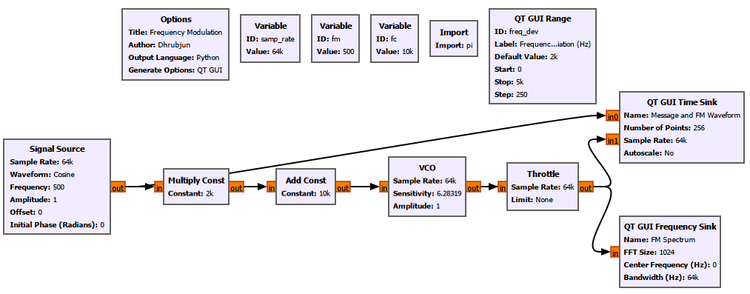

### Main setup

| Parameter | Value |
|---|---:|
| Sample rate | 64 kS/s |
| Carrier frequency $f_c$ | 10 kHz |
| Initial message frequency $f_m$ | 500 Hz |
| Message amplitude | 1 |
| Initial frequency deviation $\Delta f$ | 2 kHz |

The important signal path is conceptually:

```text
Message
   |
   v
Scale by frequency deviation
   |
   v
Add carrier-frequency control
   |
   v
Complex VCO
   |
   +------> Time-domain display
   |
   +------> Frequency-domain display
```

The VCO is the key new block. Its input controls how quickly the phase of its complex output rotates. In other words, changing the VCO input changes its instantaneous frequency.

### Start with no deviation

Before applying FM, set:

```text
Frequency Deviation = 0 Hz
Message Frequency   = 500 Hz
Carrier Frequency   = 10 kHz
```

The message is still present in the flowgraph, but it has no influence on the oscillator frequency because its contribution has been multiplied by zero.

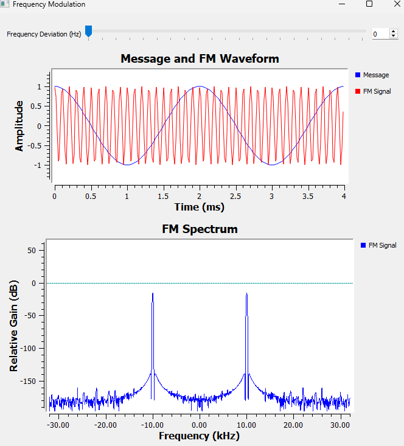

This is an important reference case.

The output is simply an unmodulated carrier at 10 kHz. There is no frequency excursion and therefore no FM.

Now increase the frequency deviation.

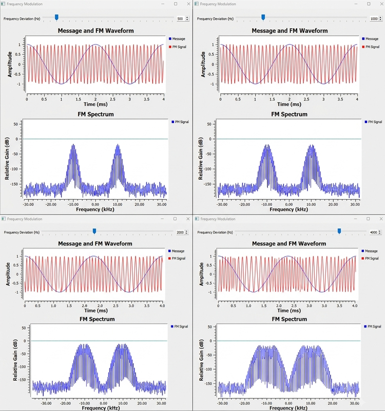

The time-domain waveform begins to look unusual. In some regions the cycles crowd together. In other regions they spread apart.

That is not an amplitude change.

When the cycles are closer together, the instantaneous frequency is higher. When they are farther apart, the instantaneous frequency is lower.

For our sinusoidal message:

| Message value | Instantaneous frequency |
|---|---|
| $m(t)=+1$ | $f_c+\Delta f$ |
| $m(t)=0$ | $f_c$ |
| $m(t)=-1$ | $f_c-\Delta f$ |

This gives us a compact mathematical description:

$$
f_i(t)=f_c+\Delta f\,m(t)
$$

For a sinusoidal message,

$$
m(t)=\cos(2\pi f_mt)
$$

so:

$$
f_i(t)=f_c+\Delta f\cos(2\pi f_mt)
$$

This equation says exactly what we just observed.

The message does not directly become the FM waveform. Instead, it controls the **instantaneous frequency** of the carrier.

### Three frequencies that are easy to confuse

At this point, it is worth separating three quantities that will appear throughout the chapter.

| Quantity | Meaning | Main effect |
|---|---|---|
| $f_c$ | Carrier frequency | Sets the center frequency |
| $f_m$ | Message frequency | Sets how quickly the carrier moves back and forth and the sideband spacing |
| $\Delta f$ | Peak frequency deviation | Sets how far the instantaneous frequency moves from $f_c$ |

This distinction becomes especially important when we look at the FM spectrum.

---

## 14.3 From Instantaneous Frequency to the FM Equation

We now understand FM in terms of a changing instantaneous frequency. We can therefore introduce the standard FM equation without treating it as something mysterious.

Frequency and phase are closely related. Instantaneous frequency tells us how quickly phase is changing:

$$
f_i(t)=\frac{1}{2\pi}\frac{d\theta(t)}{dt}
$$

If the instantaneous frequency varies sinusoidally, integrating that frequency variation gives the corresponding phase variation.

For a single-tone message, the FM signal becomes:

$$
s_{\mathrm{FM}}(t)=A_c\cos\left(2\pi f_ct+\beta\sin(2\pi f_mt)\right)
$$

where:

$$
\beta=\frac{\Delta f}{f_m}
$$

The quantity $\beta$ is called the **FM modulation index**.

We will shortly see why this ratio matters so much.

For now, notice something important about the equation. The message-dependent term appears **inside the phase** of the cosine. That is fundamentally different from ordinary AM, where the message changes the amplitude multiplying the carrier.

This is our first mathematical clue that FM stores its information in phase/frequency evolution rather than in amplitude.

---

## 14.4 Experiment 2: Exploring the FM Sidebands

The time-domain waveform showed the carrier speeding up and slowing down. But the frequency-domain display revealed something even more interesting: FM does not normally produce only one carrier and one pair of sidebands.

It can produce many spectral lines.

We do not need another flowgraph for this experiment. We simply reuse Experiment 1 and change the two QT GUI controls.

This is useful because it lets us answer two separate questions:

1. What happens when we change frequency deviation?
2. What happens when we change message frequency?

These sound similar, but they produce different spectral effects.

### Part A: Keep $f_m$ fixed and change $\Delta f$

Keep:

$$
f_m=500\text{ Hz}
$$

and increase the frequency deviation.

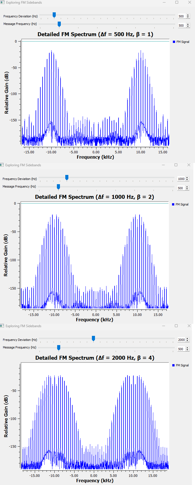

As $\Delta f$ increases, more significant spectral components appear farther from the carrier.

This is where the modulation index becomes useful.

With $f_m=500$ Hz:

| $\Delta f$ | $f_m$ | $\beta=\Delta f/f_m$ |
|---:|---:|---:|
| 500 Hz | 500 Hz | 1 |
| 1000 Hz | 500 Hz | 2 |
| 2000 Hz | 500 Hz | 4 |

As $\beta$ increases, energy is distributed among more sideband orders and the practical spectrum becomes wider.

But notice another detail: the spacing between neighboring spectral lines remains 500 Hz because $f_m$ has not changed.

### Part B: Keep $\Delta f$ fixed and change $f_m$

Now keep:

$$
\Delta f=2000\text{ Hz}
$$

and change the message frequency.

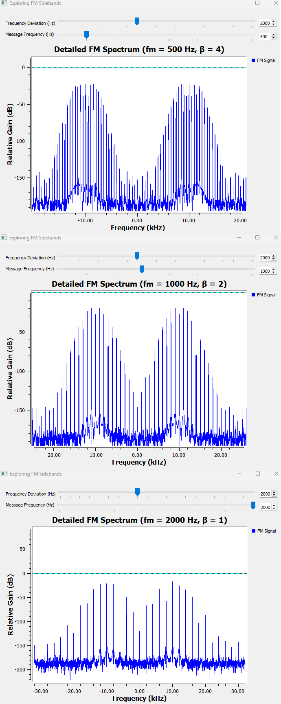

Now something different happens.

The spectral lines become farther apart as $f_m$ increases.

For a single-tone FM signal, adjacent sidebands are separated by:

$$
f_m
$$

At the same time, because $\Delta f$ is fixed, increasing $f_m$ reduces the modulation index:

| $\Delta f$ | $f_m$ | $\beta$ |
|---:|---:|---:|
| 2000 Hz | 500 Hz | 4 |
| 2000 Hz | 1000 Hz | 2 |
| 2000 Hz | 2000 Hz | 1 |

This gives us an important summary.

| What we change | What we mainly observe |
|---|---|
| Increase $\Delta f$ with $f_m$ fixed | More significant sideband orders and a wider spectrum |
| Increase $f_m$ with $\Delta f$ fixed | Greater sideband spacing and a smaller $\beta$ |
| Increase $\beta$ | Energy spreads among more significant sidebands |
| Change $f_c$ | The entire FM spectrum moves to a different center frequency |

This is why $f_m$ and $\Delta f$ should not be treated as interchangeable controls.

### A note about the two groups in the spectrum

Depending on how the signal is displayed, you may see spectral structure around both positive and negative carrier frequencies.

This is not two separate transmissions.

A real sinusoidal waveform has conjugate-symmetric positive- and negative-frequency components, something we encountered earlier in the book. FM does not remove that property. The negative-frequency structure is the corresponding spectral mirror of the real signal representation.

---

## 14.5 Why Does FM Have So Many Sidebands?

This is one of the biggest differences between the AM experiment from the previous chapter and what we have just seen.

For ordinary single-tone AM, we encountered components at:

$$
f_c-f_m,\quad f_c,\quad f_c+f_m
$$

Single-tone FM can contain components at:

$$
f_c\pm nf_m,\qquad n=0,1,2,3,\ldots
$$

So we can have:

```text
fc
fc +/- fm
fc +/- 2fm
fc +/- 3fm
fc +/- 4fm
...
```

But the sidebands are not all equally strong.

Their amplitudes are described by **Bessel functions of the first kind**.

For the single-tone FM signal,

$$
s_{\mathrm{FM}}(t)=A_c\cos\left(2\pi f_ct+\beta\sin(2\pi f_mt)\right)
$$

the relative amplitudes of the spectral components depend on $J_n(\beta)$.

| Spectral component | Amplitude factor |
|---|---|
| Carrier at $f_c$ | $A_cJ_0(\beta)$ |
| First sidebands at $f_c\pm f_m$ | $A_cJ_1(\beta)$ |
| Second sidebands at $f_c\pm2f_m$ | $A_cJ_2(\beta)$ |
| Third sidebands at $f_c\pm3f_m$ | $A_cJ_3(\beta)$ |
| Higher orders | $A_cJ_n(\beta)$ |

You do not need to derive the Bessel expansion to use this idea.

The important interpretation is:

> Changing $\beta$ redistributes the FM signal's energy among the carrier and different sideband orders.

This explains why the spectral lines in Experiment 2 did not simply grow together.

Some components become stronger while others become weaker as $\beta$ changes. At particular values of $\beta$, a Bessel coefficient can even become zero. For example, when $J_0(\beta)=0$, the spectral line at the carrier frequency disappears even though the FM signal itself is still present.

That would be very strange if we tried to interpret FM as "a carrier plus a little frequency wobble." The Bessel-function view makes clear that FM has a richer spectrum.

### Infinite sidebands, but not infinite useful bandwidth

Mathematically, the index $n$ can continue indefinitely. Therefore ideal single-tone FM has infinitely many sidebands.

That does **not** mean every sideband is equally important.

As we move to sufficiently high orders, the corresponding Bessel coefficients become very small. In practice, we therefore talk about **significant sidebands** and occupied bandwidth rather than pretending that every mathematically nonzero component needs to be transmitted with equal importance.

This distinction will become useful when we estimate FM bandwidth.

---

## 14.6 Experiment 3: Narrowband FM

Experiment 2 showed that a large modulation index can produce many significant sidebands.

What happens at the other extreme?

Set the modulation index to a very small value. In this experiment we use:

$$
\beta=0.1
$$

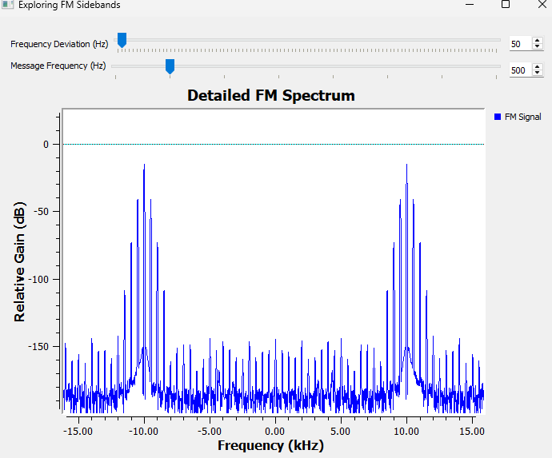

The spectrum is now much simpler.

When:

$$
\beta\ll1
$$

the useful approximations are:

$$
J_0(\beta)\approx1
$$

and:

$$
J_1(\beta)\approx\frac{\beta}{2}
$$

while higher-order Bessel terms become very small.

So most of the important spectral content is concentrated in the carrier and the first sideband pair.

This operating region is called **narrowband FM**, or **NBFM**.

As the modulation index becomes larger, more sideband orders become important. We then move toward **wideband FM**, or **WBFM**.

A useful qualitative picture is:

```text
Small beta
   |
   v
Few significant sidebands
   |
   v
Narrowband FM


Larger beta
   |
   v
More significant sidebands
   |
   v
Wideband FM
```

The distinction should not be treated as a magical switch at one exact value. The important idea is the spectral behavior: small $\beta$ concentrates the useful energy into fewer sidebands, while larger $\beta$ spreads it across more sideband orders.

### Try It Yourself: Predict Before Moving the Slider

Return to the Experiment 2 flowgraph.

Before changing anything, predict what will happen if you:

1. Keep $f_m$ fixed and reduce $\Delta f$ until $\beta\ll1$.
2. Keep $\Delta f$ fixed and increase $f_m$.
3. Make $\Delta f$ much larger while keeping $f_m$ unchanged.

Then move the controls and compare the spectrum with your prediction.

The goal is no longer simply to watch the spectrum change. Try to explain the change using $\Delta f$, $f_m$, and $\beta$ before GNU Radio shows you the answer.

---

## 14.7 How Much Bandwidth Does FM Need?

We now face an interesting problem.

If ideal FM has infinitely many sidebands, does it require infinite bandwidth?

Mathematically, its spectrum does extend indefinitely. Practically, however, sufficiently distant sidebands contain negligible energy.

A widely used engineering estimate of the occupied FM bandwidth is **Carson's rule**:

$$
B\approx2(\Delta f+f_m)
$$

Using:

$$
\beta=\frac{\Delta f}{f_m}
$$

we can also write:

$$
B\approx2f_m(\beta+1)
$$

Carson's rule is a practical approximation. It does not claim that every component outside this range is exactly zero.

### Example from our experiment

Take the values we used repeatedly:

$$
\Delta f=2000\text{ Hz}
$$

and:

$$
f_m=500\text{ Hz}
$$

The modulation index is:

$$
\beta=\frac{2000}{500}=4
$$

Carson's rule gives:

$$
B\approx2(2000+500)=5000\text{ Hz}
$$

So although the mathematical FM spectrum contains sidebands extending beyond this range, approximately 5 kHz gives us a useful engineering estimate of the occupied bandwidth for this single-tone case.

This also explains something we observed experimentally: increasing frequency deviation generally costs bandwidth.

FM gives us useful properties, but it does not give them for free.

---

## 14.8 How Do We Recover the Message?

So far, we have concentrated on generating FM.

At the transmitter, the message caused the instantaneous frequency to move above and below the carrier frequency.

At the receiver, we need to reverse that process.

Conceptually, the receiver needs to perform:

```text
Instantaneous frequency
        |
        v
Measure deviation from fc
        |
        v
Scale the deviation
        |
        v
Recovered message
```

For our experiment:

$$
f_c=10\,000\text{ Hz}
$$

and:

$$
\Delta f=2000\text{ Hz}
$$

Therefore, when the message is at its positive peak, the instantaneous frequency is approximately:

$$
12\,000\text{ Hz}
$$

At the negative peak:

$$
8\,000\text{ Hz}
$$

At a message zero crossing:

$$
10\,000\text{ Hz}
$$

If we can measure that instantaneous frequency, subtract the 10 kHz center frequency, and divide by the 2 kHz deviation, we should get our original normalized message back.

Let's test that.

---

## 14.9 Experiment 4: Recovering the Message from FM

We now extend the FM flowgraph by adding a **Quadrature Demod** block.

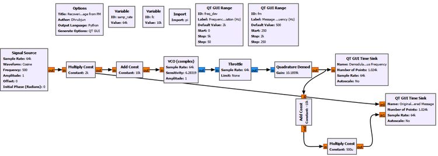

### Main setup

| Parameter | Value |
|---|---:|
| Sample rate | 64 kS/s |
| Carrier frequency | 10 kHz |
| Message frequency | 500 Hz |
| Frequency deviation | 2 kHz |
| Message amplitude | 1 |

The demodulation path can be understood as:

```text
FM signal
   |
   v
Quadrature Demod
   |
   v
Instantaneous-frequency information
   |
   v
Subtract fc
   |
   v
Divide by Delta f
   |
   v
Recovered message
```

The Quadrature Demod block uses a gain of approximately:

```text
Gain = 10.1859k
```

For a complex sampled signal, the relationship between phase change and frequency gives the useful scaling:

$$
G=\frac{f_s}{2\pi}
$$

With:

$$
f_s=64\,000\text{ samples/s}
$$

we obtain approximately:

$$
G=\frac{64\,000}{2\pi}\approx10\,185.9
$$

This makes the block output convenient to interpret in hertz.

The raw output therefore follows the instantaneous frequency and moves approximately between 8 kHz and 12 kHz.

To remove the carrier-frequency offset, subtract:

```text
Constant = -10k
```

Then scale the remaining deviation by:

```text
Constant = 500u
```

because:

$$
\frac{1}{\Delta f}=\frac{1}{2000}=0.0005
$$

The result is a recovered message with approximately unit amplitude.

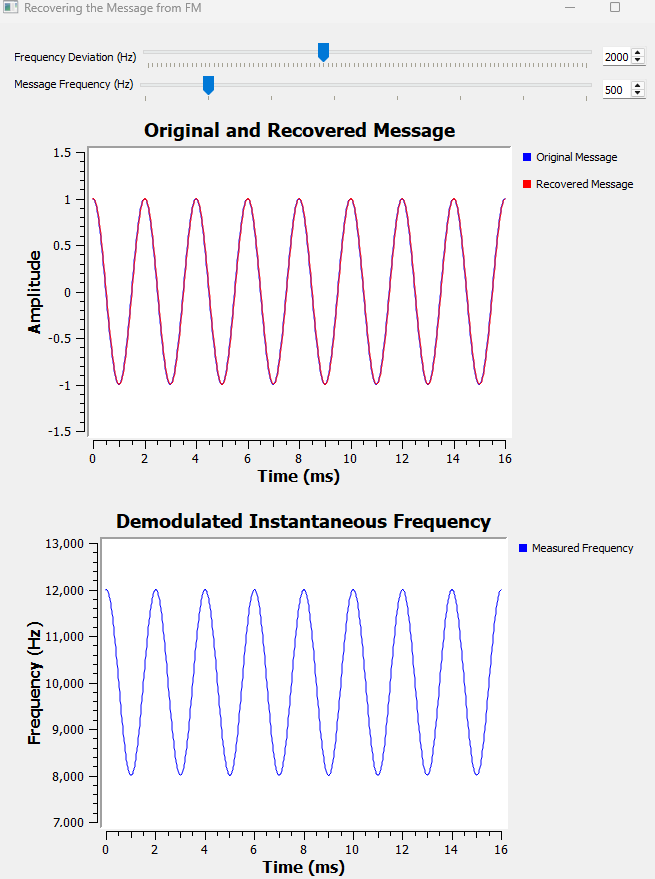

The two traces lie almost directly on top of one another.

This is a satisfying result because it closes the loop:

```text
Message
   |
   v
Frequency modulation
   |
   v
Changing instantaneous frequency
   |
   v
Quadrature demodulation
   |
   v
Message recovered
```

### What is the Quadrature Demodulator actually measuring?

It is worth looking one level deeper.

Write a complex sample as:

$$
x[n]=A[n]e^{j\phi[n]}
$$

Now compare one sample with the previous sample:

$$
x[n]x^*[n-1]
$$

Its phase contains approximately:

$$
\phi[n]-\phi[n-1]
$$

That is the phase change between consecutive samples.

A larger phase change per sample means a higher instantaneous frequency. A smaller phase change means a lower instantaneous frequency.

So the Quadrature Demodulator is not looking at how tall the FM waveform is. It is looking at how its **phase advances from sample to sample**.

This connects FM directly back to our earlier work with complex signals and I/Q.

---

## 14.10 GNU Radio Toolbox: FM Generation and Demodulation

### VCO (complex)

**VCO** stands for **Voltage-Controlled Oscillator**.

In GNU Radio, the complex VCO produces a complex sinusoid whose phase rate is controlled by its input.

The important parameters in our experiment are:

```text
Sample Rate = 64k
Sensitivity = 6.28319
Amplitude   = 1
```

Conceptually:

```text
Larger control input
        |
        v
Faster phase rotation
        |
        v
Higher instantaneous frequency
```

The VCO is useful because FM is naturally produced by controlling phase rate rather than by directly editing individual sinusoidal cycles.

### Quadrature Demod

The **Quadrature Demod** block estimates the change in phase between consecutive complex samples.

Conceptually:

```text
Complex FM samples
        |
        v
Measure phase difference
        |
        v
Frequency-related output
```

Its **Gain** determines the scale of the output.

In this experiment we choose:

$$
G=\frac{f_s}{2\pi}
$$

so that the output can be interpreted conveniently as instantaneous frequency in hertz.

### Complex to Mag

The **Complex to Mag** block converts a complex signal:

$$
z=I+jQ
$$

into its magnitude:

$$
|z|=\sqrt{I^2+Q^2}
$$

This block will become especially useful in the next experiments because it allows us to inspect whether the received FM signal's magnitude remains constant.

### Noise Source

The **Noise Source** block generates random samples from a selected statistical distribution.

For the channel-noise experiment later in this chapter, we use Gaussian noise and control its amplitude from a QT GUI Range.

The important point is where the noise is inserted. Adding noise to the FM signal is fundamentally different from merely multiplying the FM signal by a changing amplitude.

We will see that difference experimentally.

---

## 14.11 Where Is the Information in an FM Signal?

Before adding noise, there is a useful question to answer.

If we have successfully recovered the message, where was that information actually stored?

For ideal FM, the magnitude is constant:

$$
|s_{\mathrm{FM}}(t)|=A_c
$$

The message therefore cannot be encoded in the changing amplitude, because the amplitude does not need to change at all.

Instead, the information is encoded in the evolution of phase and therefore in instantaneous frequency.

This gives FM its **constant-envelope** property.

In complex form, we can think of an ideal FM signal as a vector rotating in the I/Q plane. Its length can remain constant while its rotation rate changes.

```text
Constant vector length
        +
Changing rotation rate
        |
        v
Frequency modulation
```

This raises a useful experimental question.

> If amplitude is not carrying the information, what happens if the FM amplitude changes?

---

## 14.12 Experiment 5: Disturbing the Amplitude

In this experiment, we deliberately change the amplitude of the FM signal while leaving its phase/frequency modulation intact.

The filename uses the phrase "amplitude noise," but conceptually this experiment should be understood as **multiplicative amplitude variation**.

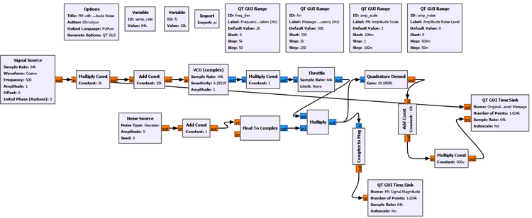

The important idea is:

$$
r(t)=A(t)s_{\mathrm{FM}}(t)
$$

where $A(t)$ changes the received magnitude.

First observe the undisturbed case.

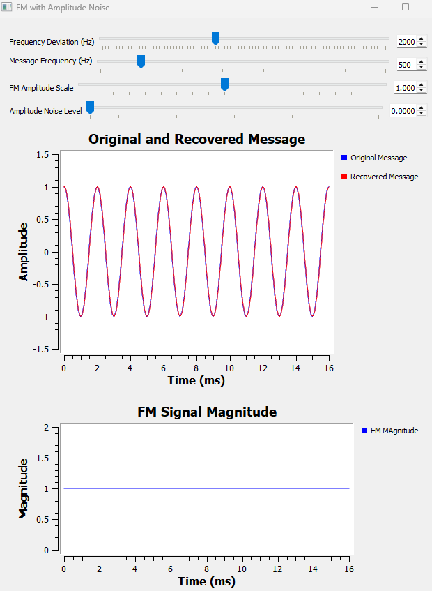

The FM magnitude remains at approximately 1 and the recovered message follows the original.

Now increase the amplitude disturbance.

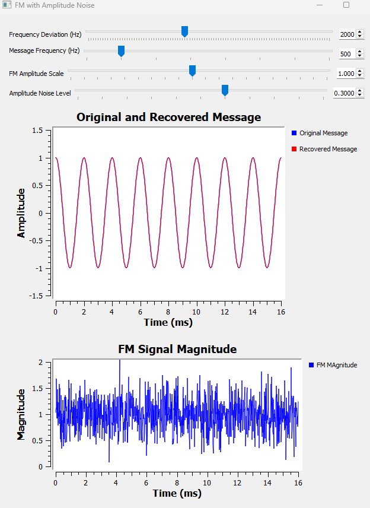

The FM magnitude is no longer perfectly flat. It visibly fluctuates.

But something interesting happens in the recovered message: it remains essentially unchanged.

Why?

The Quadrature Demodulator is primarily responding to **phase change between samples**, not to the absolute magnitude of those samples.

If the amplitude changes while the phase trajectory remains intact, the frequency information is still available.

This is an important property of FM.

It is also one reason practical FM receivers can use **amplitude limiting** before demodulation. A limiter attempts to remove unwanted amplitude variations while preserving the phase/frequency behavior that carries the information.

Conceptually:

```text
Received FM
    |
    v
Amplitude limiter
    |
    v
FM demodulator
    |
    v
Recovered message
```

We are not building a limiter in this experiment. The point is simply to understand why such a receiver stage is possible.

But this experiment can easily lead to an incorrect conclusion:

> "If amplitude variations do not matter much, FM must be immune to noise."

That is not true.

To see why, we need to disturb the signal in a different way.

---

## 14.13 Experiment 6: FM Through an Additive Noise Channel

Instead of multiplying the FM signal by a varying amplitude, we now **add noise directly to the complex FM signal**.

The received signal becomes:

$$
r(t)=s_{\mathrm{FM}}(t)+n(t)
$$

This is fundamentally different from Experiment 5.

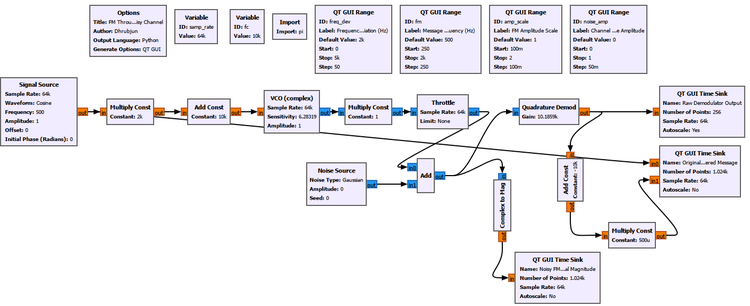

### Main setup

The FM settings remain the same as before:

| Parameter | Value |
|---|---:|
| Sample rate | 64 kS/s |
| Carrier frequency | 10 kHz |
| Message frequency | 500 Hz |
| Frequency deviation | 2 kHz |
| FM amplitude scale | 1 |

The new QT GUI control changes the additive channel-noise amplitude.

We monitor three things simultaneously:

1. the original and recovered messages,
2. the raw Quadrature Demod output,
3. the magnitude of the noisy FM signal.

This three-view arrangement is useful because it lets us watch the disturbance travel through the receiver.

### Start with a clean channel

Set:

```text
Channel Noise Amplitude = 0
```

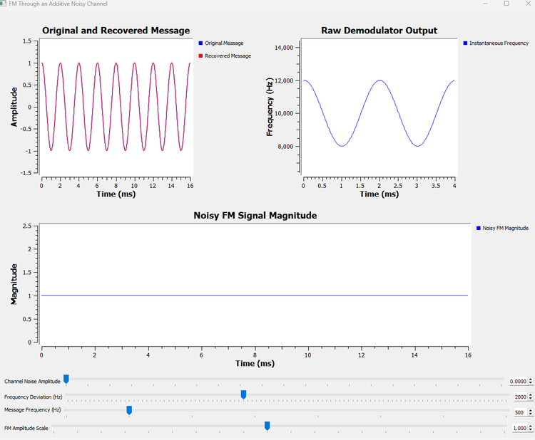

The three observations agree with what we already know.

The received magnitude is essentially constant at 1.

The raw demodulator output follows the instantaneous frequency cleanly between approximately:

$$
8\,000\text{ Hz}
$$

and:

$$
12\,000\text{ Hz}
$$

The recovered message lies on top of the original message.

### Add moderate channel noise

Now set:

```text
Channel Noise Amplitude = 0.10
```

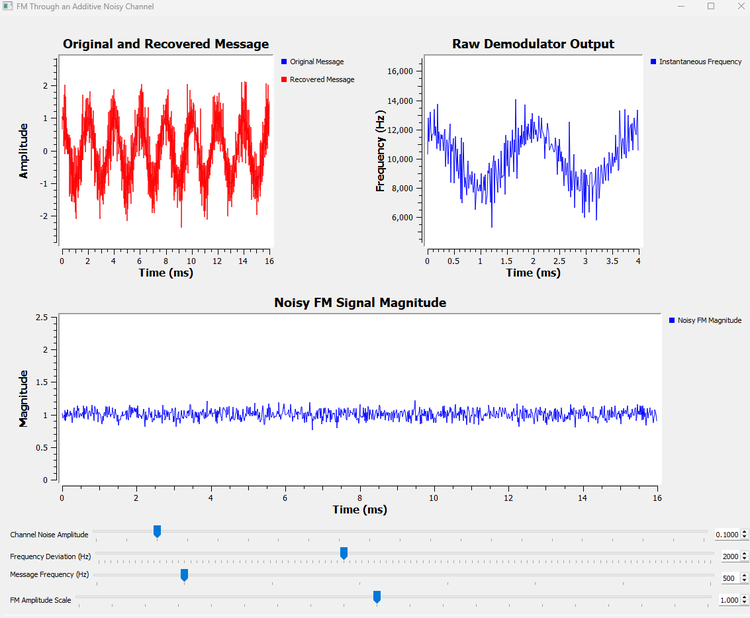

The received magnitude now fluctuates around 1.

More importantly, the raw instantaneous-frequency estimate becomes noisy.

The recovered message also begins to show noise, although its underlying sinusoidal shape is still clearly recognizable.

### Increase the noise further

Finally, set:

```text
Channel Noise Amplitude = 0.30
```

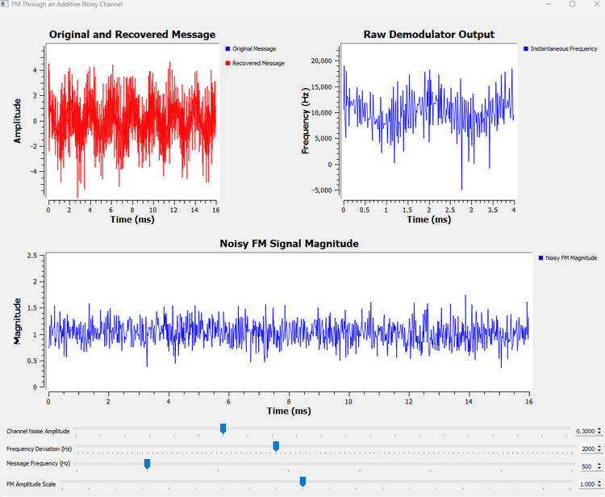

The difference is now dramatic.

The received magnitude fluctuates strongly, but that is not the whole problem. The raw demodulator output contains large frequency errors, and the recovered message becomes heavily corrupted.

Why did Experiment 5 tolerate amplitude disturbance while Experiment 6 does not?

Because additive noise does more than change magnitude.

The FM signal is complex. Adding random noise changes its I and Q components:

```text
Additive channel noise
        |
        v
I and Q are disturbed
        |
        v
Phase is disturbed
        |
        v
Instantaneous-frequency estimate becomes noisy
        |
        v
Recovered message becomes noisy
```

The distinction is worth summarizing.

| Disturbance | Magnitude affected? | Phase affected? | Effect on simple FM demodulation |
|---|---|---|---|
| Constant amplitude scaling | Yes | No | Essentially unchanged |
| Multiplicative positive amplitude variation | Yes | Ideally no | Largely unchanged |
| Additive channel noise | Yes | Yes | Increasingly degraded |

This is the key lesson from the final two experiments.

**FM does not carry its information in amplitude, but that does not make FM immune to noise.**

### A practical receiver would do more

Our demodulation chain is intentionally simple because we want to see the underlying behavior clearly.

A practical FM receiver normally includes additional filtering and receiver stages. The raw demodulator output shown here is deliberately exposed, so the effect of additive noise is easy to observe.

The experiment should therefore not be interpreted as a complete model of the noise performance of a commercial FM receiver.

Its purpose is more fundamental: to show why additive noise can corrupt FM even though simple amplitude changes do not directly carry the message.

---

## 14.14 Try It Yourself: Find the Point Where the Message Disappears

Return to Experiment 6 and begin with:

```text
Channel Noise Amplitude = 0
```

Before moving the slider, predict the order in which you expect the three displays to become visibly disturbed.

Then slowly increase the channel-noise amplitude.

Watch:

```text
Noisy FM magnitude
        |
        v
Raw demodulator output
        |
        v
Recovered message
```

Do not focus on finding one universal numerical "failure point." Instead, notice how degradation develops gradually.

Try values such as:

```text
0.05
0.10
0.20
0.30
```

Ask yourself:

- Can I still recognize the 500 Hz pattern in the raw demodulator output?
- Can I still recognize it in the recovered message?
- Does a noisy magnitude automatically mean the message has been lost?
- At what point does phase/frequency noise become the dominant problem?

This is a useful habit in SDR experiments: do not only ask whether a system works. Watch **how it stops working**.

---

## 14.15 Putting the FM Story Together

We began this chapter with a simple idea: instead of changing carrier amplitude, let the message change carrier frequency.

That idea led us through a surprisingly rich chain of consequences.

```text
Message
   |
   v
Controls instantaneous frequency
   |
   v
Carrier speeds up and slows down
   |
   v
FM spectrum develops multiple sidebands
   |
   v
Delta f and fm determine spectral behavior
   |
   v
beta = Delta f / fm describes modulation strength
   |
   v
Bessel functions determine component amplitudes
   |
   v
Practical bandwidth can be estimated
   |
   v
Phase change can be measured at the receiver
   |
   v
Original message can be recovered
```

There is another equally important chain on the receiver side:

```text
FM information
   |
   v
Stored in phase/frequency evolution
   |
   +--> Pure amplitude change: little effect on ideal demodulation
   |
   +--> Additive noise: phase can be disturbed
                         |
                         v
                 Frequency estimate becomes noisy
                         |
                         v
                  Message becomes noisy
```

These two views together give us a much more useful understanding of FM than simply memorizing its equation.

---

## 14.16 What We Learned

In this chapter, we built frequency modulation from the waveform upward.

The main ideas are:

- In FM, the message controls the **instantaneous frequency** of the carrier.
- The carrier frequency $f_c$ sets the center frequency.
- The message frequency $f_m$ determines how quickly the instantaneous frequency moves and sets the spacing between single-tone FM sidebands.
- The frequency deviation $\Delta f$ tells us how far the instantaneous frequency moves away from $f_c$.
- For a normalized sinusoidal message:

$$
f_i(t)=f_c+\Delta f\cos(2\pi f_mt)
$$

- The single-tone FM signal can be written as:

$$
s_{\mathrm{FM}}(t)=A_c\cos\left(2\pi f_ct+\beta\sin(2\pi f_mt)\right)
$$

- The FM modulation index is:

$$
\beta=\frac{\Delta f}{f_m}
$$

- Increasing $\beta$ generally causes more sideband orders to become significant.
- Single-tone FM sidebands occur at:

$$
f_c\pm nf_m
$$

- Their amplitudes are governed by Bessel functions $J_n(\beta)$.
- Ideal FM has infinitely many mathematical sidebands, but only a finite number are significant in practice.
- Small $\beta$ produces narrowband FM behavior.
- Carson's rule gives a useful practical bandwidth estimate:

$$
B\approx2(\Delta f+f_m)
$$

- A Quadrature Demodulator recovers FM by measuring phase change from sample to sample.
- Ideal FM has a constant envelope, so its information is not carried in amplitude.
- Multiplicative amplitude changes can leave the recovered message essentially unchanged when the phase trajectory remains intact.
- Additive channel noise is different because it disturbs I and Q and therefore can disturb phase.
- As phase noise increases, the instantaneous-frequency estimate becomes noisy and the recovered message eventually degrades.

Perhaps the most important conceptual distinction is this:

> **FM is relatively insensitive to pure amplitude variation, but it is not immune to additive noise.**

---

## 14.7 FM's Close Relative: Phase Modulation

Before leaving analog modulation, there is one closely related idea worth introducing.

So far, we have used two properties of a carrier to carry information:

```text
Amplitude Modulation
        |
        v
Message changes carrier amplitude


Frequency Modulation
        |
        v
Message changes instantaneous frequency
```

But a sinusoidal carrier has another important property that can be changed: its **phase**.

If the message directly changes the phase of the carrier, we obtain **phase modulation**, or **PM**.

A simple phase-modulated signal can be written as:

$$
s_{\mathrm{PM}}(t)=A_c\cos\left(2\pi f_ct+k_pm(t)\right)
$$

Here, $k_p$ determines how strongly the message changes the carrier phase.

The important point is that the message $m(t)$ appears directly in the phase term.

This makes PM look very similar to FM, and that is not an accident. FM and PM are closely related and are often grouped together under the name **angle modulation**.

### FM and PM: What Is the Difference?

The easiest way to separate them is to ask what the message controls directly.

| Modulation | What the message directly controls |
|---|---|
| AM | Carrier amplitude |
| FM | Instantaneous frequency |
| PM | Carrier phase |

For PM:

$$
\phi_{\mathrm{PM}}(t)\propto m(t)
$$

The phase deviation follows the message itself.

For FM:

$$
f_i(t)-f_c\propto m(t)
$$

The instantaneous-frequency deviation follows the message.

But frequency and phase are related:

$$
f_i(t)=\frac{1}{2\pi}\frac{d\phi(t)}{dt}
$$

This means that changing frequency also changes how phase evolves with time.

That is exactly what we saw with the VCO in this chapter. The VCO did not somehow jump from one finished sinusoid to another. Its phase kept evolving continuously, but the **rate at which that phase changed** became faster or slower according to the message.

This gives us a useful way to think about the difference:

```text
Phase Modulation

Message
   |
   v
Controls phase deviation directly


Frequency Modulation

Message
   |
   v
Controls how quickly phase changes
   |
   v
Controls instantaneous frequency
```

There is also a mathematical relationship between the two.

For FM, the phase contribution depends on the integral of the message:

$$
s_{\mathrm{FM}}(t)=A_c\cos\left(2\pi f_ct+2\pi k_f\int_0^t m(\tau)\,d\tau\right)
$$

For PM, the message appears directly in the phase:

$$
s_{\mathrm{PM}}(t)=A_c\cos\left(2\pi f_ct+k_pm(t)\right)
$$

We will not build a separate PM experiment here. Our goal in this part of the book was to develop the main ideas of analog carrier modulation, and the FM experiments have already given us the most important connection between frequency and phase.

However, phase is far from finished.

In digital communication, instead of allowing an analog message to change phase continuously, we can choose particular phase states to represent information. That idea will eventually lead us to **phase-shift keying (PSK)**.

So this brief introduction to PM is also a bridge between the analog modulation we have studied here and the digital modulation techniques we will encounter later.

---

## 14.18 Connecting to the Next Chapter

Over the last three chapters, we have moved from asking why modulation is necessary to building two of the most important forms of analog modulation.

With AM, the message changed the amplitude of a carrier.

With FM, the message changed its instantaneous frequency.

We also briefly saw that information can be carried by directly changing phase.

We can summarize the possibilities we have encountered so far as:

```text
                     Carrier
                        |
          +-------------+-------------+
          |             |             |
          v             v             v
      Amplitude      Frequency       Phase
          |             |             |
          v             v             v
          AM            FM            PM
```

Until now, however, our message has always been a continuously varying analog signal such as a sinusoid.

Modern communication systems often begin somewhere very different:

```text
0 1 1 0 1 0 0 1 ...
```

A radio cannot simply transmit the abstract idea of a `0` or a `1`. Those bits must somehow be represented by physical waveforms.

This raises a new set of questions.

What exactly is the difference between a **bit** and a **symbol**?

How can a sequence of bits become a waveform?

How many bits can one symbol represent?

What does **symbol rate** mean, and how is it different from bit rate?

And eventually, how can amplitude, phase, frequency, or combinations of them be used to represent digital information?

These questions mark an important transition in the book.

We are moving from **analog communication**, where a continuously varying message continuously changes a carrier, to **digital communication**, where discrete information must first be mapped onto physical signals.

In the next chapter, we will begin with the foundation:

**bits, symbols, and how digital information becomes a waveform that can actually be transmitted.**
