# Chapter 15: Bits, Symbols and Digital Communication

## Main Question

**How can zeros and ones eventually become a radio waveform?**

In Chapters 12 through 14, our message signals varied continuously.

In AM, the message controlled amplitude. In FM, the message controlled instantaneous frequency. Even when we added noise or changed the modulation conditions, the underlying message was still an analog waveform whose value could vary continuously with time.

Digital communication begins from a different kind of information.

Instead of asking a transmitter to carry every possible message value directly, we may begin with a sequence such as

```text
1 0 1 1 0 0 1 0
```

These zeros and ones are **bits**.

But there is an immediate problem.

An antenna cannot radiate an abstract `1` or `0`. A radio ultimately has to produce a physical waveform: voltages and currents changing with time, electromagnetic fields propagating through space, and sampled signals inside an SDR.

So there must be a path from

```text
bits
  |
  v
groups of bits
  |
  v
symbols
  |
  v
physical signal states
  |
  v
radio waveform
```

This chapter develops the first half of that path.

We will not yet build BPSK, QPSK, QAM, or even PAM. Those modulation methods deserve their own treatment. For now, our goal is more fundamental: understand what bits and symbols are, how fast they occur, why several bits can be grouped into one symbol, and what **mapping** means before any actual digital modulation takes place.

------------------------------------------------------------------------

## 15.1 A Bit Is Information, Not a Voltage

A bit has two possible values:

```text
0
1
```

That sounds simple, but it is worth separating the **information** from the **signal used to represent that information**.

The sequence

```text
1 0 1 1 0 0 1 0
```

is information.

Inside a computer or SDR, those values must be stored and processed using some numerical data type. Later, when the information is transmitted, the bits must influence some physical signal property.

These are related ideas, but they are not the same thing.

A beginner can easily fall into the habit of thinking that a bit `1` literally means one volt and a bit `0` literally means zero volts. That can be one possible representation, but it is not the definition of a bit. In another system, the same bit may eventually be represented by a phase, a frequency, a complex I/Q point, or something else entirely.

Before worrying about modulation, let us first make a bit sequence visible in GNU Radio.

------------------------------------------------------------------------

# Experiment 15.1: Bits as a Sampled Waveform

We begin with a known sequence rather than random data:

```text
1 0 1 1 0 0 1 0
```

Using a known sequence is useful because we can predict exactly what should appear in the Time Sink.

The flowgraph is shown below.

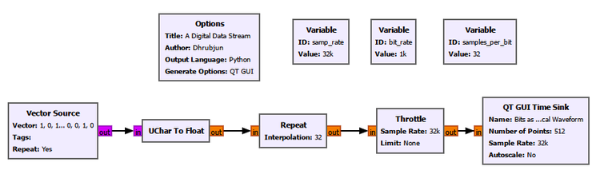

The important parameters are:

| Parameter | Value |
|---|---:|
| Sample rate | `32k` samples/s |
| Bit rate | `1k` bit/s |
| Samples per bit | `32` |
| Vector Source | `[1, 0, 1, 1, 0, 0, 1, 0]` |
| Repeat | Yes |
| Time Sink points | `512` |

The Vector Source produces the known sequence as byte values. We deliberately restrict those byte values to `0` and `1` because they represent binary information.

The **UChar to Float** block changes the numerical data type from unsigned byte values to floating-point values. It does not change the information:

```text
byte 0  ->  float 0.0
byte 1  ->  float 1.0
```

The most important new operation is **Repeat**.

If one bit were represented by only one sample, the sequence would simply be a stream of isolated numerical values. But a transmitted bit occupies a finite interval of time. In our sampled SDR representation, we therefore use several samples to describe the signal during one bit interval.

We chose

$$
f_s = 32000\text{ samples/s}
$$

and

$$
R_b = 1000\text{ bit/s}.
$$

The number of samples used for each bit is therefore

$$
N_{\text{samples/bit}} = \frac{f_s}{R_b} = \frac{32000}{1000} = 32.
$$

So Repeat holds every bit value for 32 samples.

Conceptually,

```text
Information bits:

1        0        1        1        0

Sampled representation:

111...111 000...000 111...111 111...111 000...000
<-- 32 --> <-- 32 --> <-- 32 --> <-- 32 --> <-- 32 -->
 samples    samples    samples    samples    samples
```

The result is shown below.

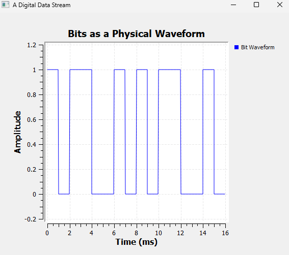

The waveform repeats the pattern `1 0 1 1 0 0 1 0`.

At a bit rate of 1000 bit/s, one bit lasts

$$
T_b = \frac{1}{R_b} = \frac{1}{1000} = 1\text{ ms}.
$$

That is exactly what we see: each individual bit interval is 1 ms wide.

The Time Sink displays 512 samples. At 32 kS/s, this corresponds to

$$
T_{\text{display}} = \frac{512}{32000} = 16\text{ ms}.
$$

Since each bit lasts 1 ms, the display contains 16 bit intervals, or two repetitions of our eight-bit pattern.

This experiment gives us an important distinction that will remain useful throughout digital communication:

> **A bit is a unit of information. A sample is a numerical description of a waveform at one instant. One bit may be represented by many samples.**

------------------------------------------------------------------------

> ### GNU Radio Toolbox: UChar to Float
>
> **UChar to Float** converts unsigned-character values into floating-point values.
>
> In this experiment, the input byte values are `0` and `1`, so the output becomes `0.0` and `1.0`.
>
> The block does not perform modulation and does not change the information. It only changes the numerical data type so that the values can be treated as a floating-point signal in the following blocks.

> ### GNU Radio Toolbox: Repeat
>
> The **Repeat** block repeats every input item a specified number of times.
>
> Here, its interpolation value is `32`, so each input bit value appears for 32 output samples.
>
> This is useful for making each bit occupy a definite time interval in our sampled representation. Later chapters will introduce more realistic pulse shaping. For now, Repeat gives us a simple rectangular representation that makes bit timing easy to see.

------------------------------------------------------------------------

## 15.2 Bit Rate and Bit Duration

Experiment 15.1 used a bit rate of 1000 bit/s. That gave every bit a duration of 1 ms.

What happens if we transmit the same information faster?

The relationship is simple:

$$
T_b = \frac{1}{R_b}.
$$

A higher bit rate means a shorter bit duration.

Rather than accepting that only as an equation, we can watch it happen.

------------------------------------------------------------------------

# Experiment 15.2: Changing the Bit Rate

We keep the sample rate fixed at 32 kS/s and use a QT GUI Range to vary the bit rate from 500 to 4000 bit/s.

The same known binary sequence is used throughout. Only the speed at which the bits are represented changes.

The important relationship in the flowgraph is

$$
N_{\text{samples/bit}} = \frac{f_s}{R_b}.
$$

At our fixed sample rate, the following values result:

| Bit rate | Bit duration | Samples per bit |
|---:|---:|---:|
| 500 bit/s | 2 ms | 64 |
| 1000 bit/s | 1 ms | 32 |
| 2000 bit/s | 0.5 ms | 16 |
| 4000 bit/s | 0.25 ms | 8 |

Before looking at the result, predict what should happen.

The Time Sink continues to show the same 16 ms interval. If each bit becomes shorter, more bits should fit inside that unchanged window.

At 500 bit/s, the waveform looks relatively slow and wide.

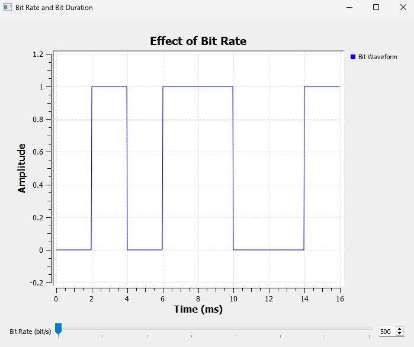

Each bit lasts 2 ms, so only eight bit intervals fit inside 16 ms.

Now increase the bit rate to 2000 bit/s.

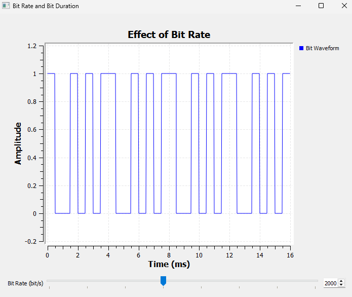

The bits are now much narrower. Each bit lasts only 0.5 ms, so 32 bit intervals fit into the same 16 ms display.

Nothing about the information alphabet has changed. We still have only zeros and ones, and the source pattern is unchanged. We are simply sending the bits more quickly.

This is the physical meaning of bit rate:

> **Bit rate tells us how many information bits pass through the system each second.**

### Try It Yourself

Move the Bit Rate control through `500`, `1000`, `2000`, and `4000` bit/s.

Before moving the control, predict both the bit duration and the number of samples per bit.

Then watch the waveform. At a fixed sample rate, notice that increasing the bit rate means fewer samples are available to represent each bit.

------------------------------------------------------------------------

## 15.3 Do We Have to Handle Bits One at a Time?

So far, every bit has been treated individually:

```text
1 | 0 | 1 | 1 | 0 | 0 | 1 | 0
```

But there is no rule saying that a transmitter must always work with one bit at a time.

Suppose we group the bits in pairs:

```text
10 | 11 | 00 | 10
```

There are four possible two-bit combinations:

```text
00
01
10
11
```

We can give each combination a label:

| Bit group | Symbol index |
|---|---:|
| `00` | 0 |
| `01` | 1 |
| `10` | 2 |
| `11` | 3 |

Each two-bit group is now treated as one **symbol**.

This is the first major step from bits toward digital modulation.

A symbol is not necessarily one bit. A symbol is one choice from a set of allowed possibilities, and that choice may represent one bit, two bits, four bits, or some other number of bits depending on the system.

------------------------------------------------------------------------

# Experiment 15.3: From Bits to Symbols

We reuse the sequence

```text
1 0 1 1 0 0 1 0
```

but now group two bits at a time.

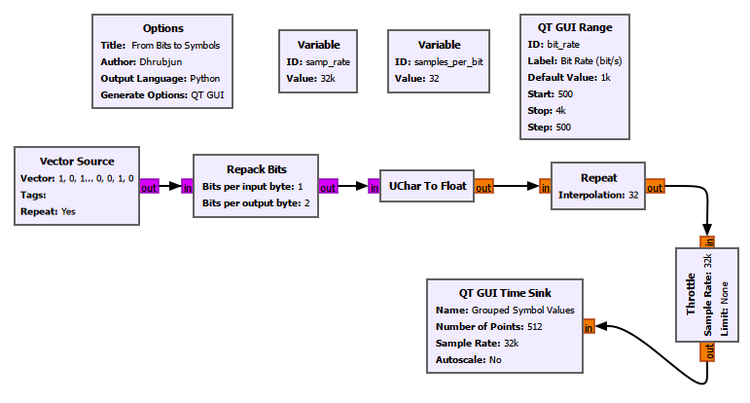

The new block is **Repack Bits**. It is configured to convert one-bit input items into two-bit output items.

For our known sequence,

```text
Bits:
1 0 | 1 1 | 0 0 | 1 0

Groups:
 10 |  11 |  00 |  10

Symbol indices:
  2 |   3 |   0 |   2
```

The resulting symbol indices are shown below.

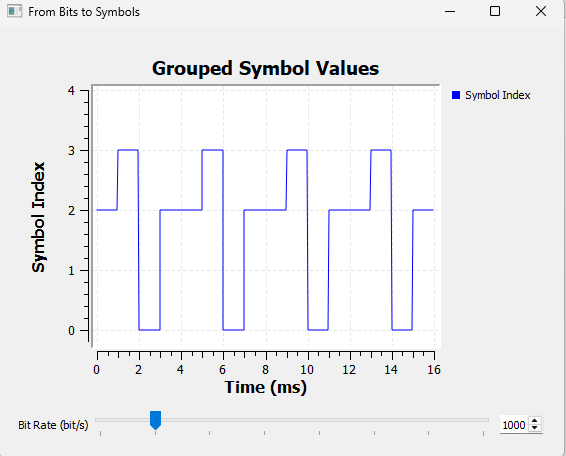

The sequence is

```text
2 -> 3 -> 0 -> 2 -> 2 -> 3 -> 0 -> 2 -> ...
```

The adjacent `2` values at the repetition boundary merge visually into a longer flat section. This is expected: the last group of one source period is `10`, and the first group of the next period is also `10`.

There is an important point here.

The vertical values `0`, `1`, `2`, and `3` are **symbol indices**. We are plotting them numerically because it is convenient to inspect them.

They are not yet transmitted amplitudes.

In particular,

```text
symbol index 3
```

does not mean

```text
3 volts
```

or amplitude `3`, phase `3`, or frequency `3`.

At this stage, the number is only a label identifying which bit group occurred.

------------------------------------------------------------------------

> ### GNU Radio Toolbox: Repack Bits
>
> **Repack Bits** changes how bits are grouped into stream items.
>
> In this experiment, the input contains one useful bit per byte and the output contains two useful bits per byte. Therefore, every two input bits become one output value between `0` and `3`.
>
> With the bit ordering used in our experiment:
>
> ```text
> 00 -> 0
> 01 -> 1
> 10 -> 2
> 11 -> 3
> ```
>
> Repack Bits does not yet perform modulation. It reorganizes the digital data so that groups of bits can be treated as symbols.
>
> Bit ordering matters. If the ordering is changed, the numerical index assigned to a particular bit pattern can change even though the underlying bits are the same.

------------------------------------------------------------------------

## 15.4 Bits per Symbol

The previous experiment used two bits per symbol, giving four possible symbols.

The pattern generalizes naturally.

If each symbol contains $k$ bits, then the number of possible bit patterns is

$$
M = 2^k.
$$

For example:

| Bits per symbol $k$ | Possible symbols $M$ |
|---:|---:|
| 1 | 2 |
| 2 | 4 |
| 3 | 8 |
| 4 | 16 |

Conversely,

$$
k = \log_2(M).
$$

This is why digital communication systems often talk about 2, 4, 8, 16, 64, or 256 possible symbol states. Powers of two allow an integer number of bits to be associated with each symbol.

But grouping more bits into a symbol raises another question.

If the bit rate remains fixed, how fast do the symbols themselves occur?

------------------------------------------------------------------------

# Experiment 15.4: Bit Rate vs Symbol Rate

We keep the bit rate fixed at

$$
R_b = 1000\text{ bit/s}
$$

and compare three ways of grouping the same binary data:

```text
1 bit per symbol
2 bits per symbol
4 bits per symbol
```

The flowgraph creates three parallel branches from the same source.

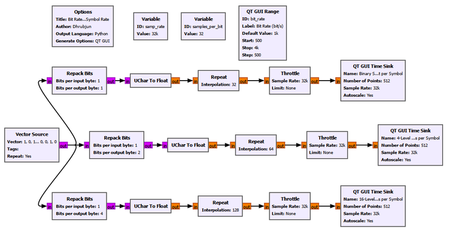

The sample rate remains 32 kS/s. Since one bit at 1000 bit/s lasts 1 ms, it occupies 32 samples.

Therefore:

```text
1 bit/symbol  ->  32 samples/symbol
2 bits/symbol ->  64 samples/symbol
4 bits/symbol -> 128 samples/symbol
```

The three results are displayed over the same 16 ms time window.

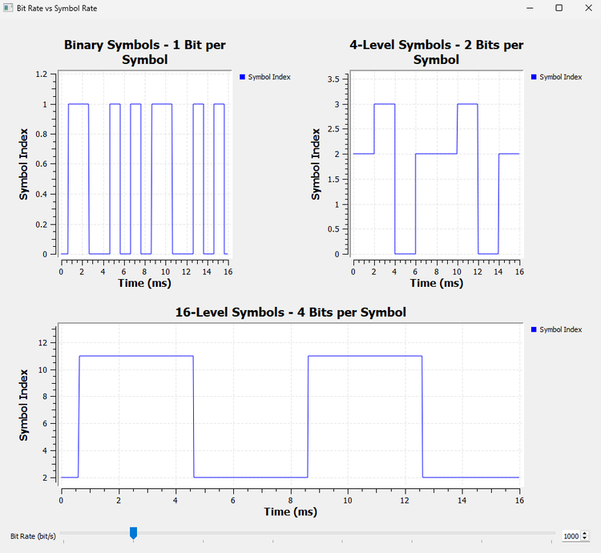

The top graph treats each bit as one symbol. The middle graph groups two bits per symbol. The bottom graph groups four bits per symbol.

At a fixed bit rate, increasing the number of bits carried by each symbol means that fewer symbols are needed every second.

For one bit per symbol,

$$
R_s = 1000\text{ symbols/s}.
$$

For two bits per symbol,

$$
R_s = 500\text{ symbols/s}.
$$

For four bits per symbol,

$$
R_s = 250\text{ symbols/s}.
$$

The general relationship is

$$
R_b = kR_s.
$$

Since $k = \log_2(M)$, we can also write

$$
R_b = R_s\log_2(M).
$$

Here:

- $R_b$ is the bit rate in bit/s,
- $R_s$ is the symbol rate in symbols/s,
- $k$ is the number of bits carried by each symbol,
- $M$ is the number of possible symbols.

### Bit/s and baud are not always the same

The symbol rate is commonly measured in **baud**.

One baud means one symbol per second.

This gives an important distinction:

```text
1000 bit/s with 1 bit/symbol -> 1000 baud
1000 bit/s with 2 bits/symbol ->  500 baud
1000 bit/s with 4 bits/symbol ->  250 baud
```

So bit/s and baud are equal only when each symbol carries exactly one bit.

This is one of the easiest ideas to confuse when first learning digital communication. Bit rate describes the rate of **information bits**. Symbol rate describes the rate at which the transmitter makes **symbol choices**.

------------------------------------------------------------------------

## 15.5 What Does Mapping Mean?

We have already been using a simple rule:

```text
00 -> symbol 0
01 -> symbol 1
10 -> symbol 2
11 -> symbol 3
```

That rule is a **mapping**.

Mapping answers the question:

> Which symbol should represent this particular group of bits?

The idea sounds almost trivial with four possibilities, but it becomes extremely important later. In QPSK, QAM, and other modulation schemes, the transmitter must associate groups of bits with particular allowed signal states, and the receiver must reverse that association.

For now, we keep the mapping abstract. We map bits only to symbol indices, not to amplitudes, phases, frequencies, or I/Q points.

------------------------------------------------------------------------

# Experiment 15.5: Mapping Bits to Symbol Indices

The previous experiments showed either the bit stream or the symbol stream. Now we display them together over the same time interval.

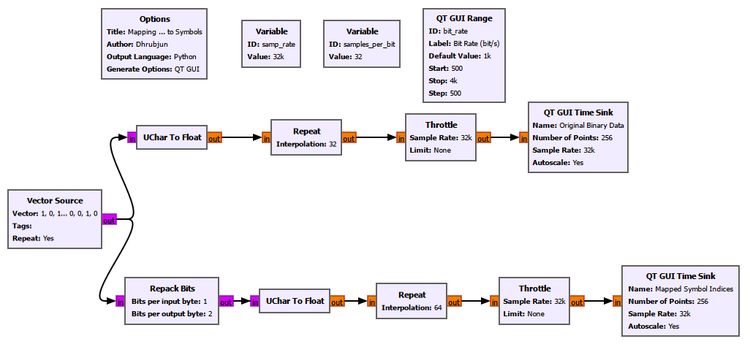

The top branch displays the original binary data. The lower branch groups the same bits in pairs using Repack Bits and displays the resulting symbol indices.

We use 256 display points at 32 kS/s, giving an 8 ms window. At 1000 bit/s, that window contains exactly eight bit intervals.

The result is especially useful because the two displays can be read together.

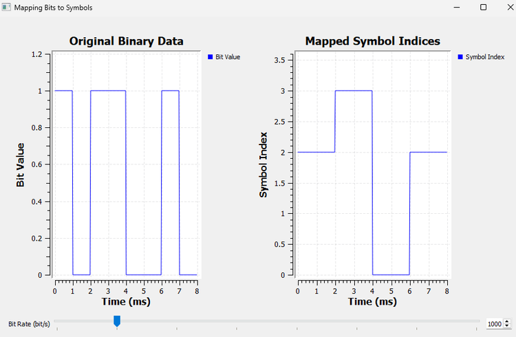

Over the 8 ms interval,

```text
Time:       0        2        4        6        8 ms

Bits:       1 0  |   1 1  |   0 0  |   1 0
             |         |         |         |
             v         v         v         v
Symbols:     2    |    3    |    0    |    2
```

Each bit lasts 1 ms, while each two-bit symbol lasts 2 ms.

The mapping can therefore be read directly from the experiment:

```text
10 -> 2
11 -> 3
00 -> 0
10 -> 2
```

Again, the values on the symbol graph are labels. We have not yet decided what physical signal state symbol `2` or symbol `3` will produce.

That distinction is deliberate. It keeps two separate operations clear:

```text
bit grouping and symbol mapping
              |
              v
        symbol index
              |
              v
physical signal mapping comes later
```

------------------------------------------------------------------------

## 15.6 From a Teaching Pattern to Arbitrary Data

Known patterns are excellent for learning because we can predict every result. Real communication systems, however, do not normally transmit the same eight bits forever.

The information may come from audio, images, sensor measurements, network packets, files, control messages, or many other sources. From the modulator's point of view, the incoming binary data can appear arbitrary.

So our final experiment replaces the controlled Vector Source with a Random Source.

------------------------------------------------------------------------

# Experiment 15.6: Random Bits to Symbols

The Random Source is configured to generate binary values only:

```text
Minimum: 0
Maximum: 2
```

With the GNU Radio Random Source used here, this produces values `0` and `1`.

The upper branch displays the random binary data. The second branch performs exactly the same two-bit grouping used earlier and displays symbol indices from `0` to `3`.

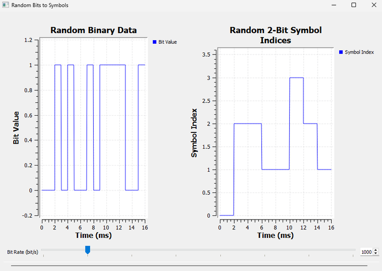

Unlike our repeating Vector Source, the random data continually changes, so the Time Sink display also continually updates. That is expected. The exact pattern is no longer the important part.

What matters is that the processing rule has not changed:

```text
random binary data
        |
        v
group two bits
        |
        v
00, 01, 10, or 11
        |
        v
symbol index 0, 1, 2, or 3
```

There is also a practical visualization detail worth remembering. Two separate QT GUI Time Sinks may capture different positions in a continuously running random stream, so a static screenshot is not the best place to verify every visible bit pair against every visible symbol. Experiment 15.5 already gave us that controlled, sample-by-sample comparison.

The purpose of this experiment is different: it shows that the same grouping process works for an ongoing stream of arbitrary binary data.

------------------------------------------------------------------------

> ### GNU Radio Toolbox: Random Source
>
> The **Random Source** generates pseudo-random numerical values.
>
> In this chapter, we configure it so that the generated values are only `0` and `1`, giving us a convenient test source for binary data.
>
> A Random Source is useful when we no longer need a hand-picked pattern and want to exercise a digital processing chain with changing data.

------------------------------------------------------------------------

## 15.7 Bits, Bytes, and GNU Radio Stream Items

Our experiments reveal a subtle distinction that becomes increasingly important as GNU Radio flowgraphs become more digital.

When we say that a stream contains bits, we are describing the **information** carried by the stream.

But GNU Radio still has to store each stream item using a data type.

For example, our Vector Source and Random Source used byte-sized items whose numerical values happened to be only `0` and `1`.

So conceptually we had

```text
information:
1 0 1 1 0 0 1 0
```

while GNU Radio carried those values inside byte stream items.

After Repack Bits changed the grouping to two bits per item, the possible numerical values became

```text
0, 1, 2, 3
```

but the stream items were still byte-sized containers.

This is why it is useful to keep three questions separate:

1. How many information bits are represented?
2. How are those bits grouped into symbols?
3. What GNU Radio data type is carrying the numerical values?

They are not the same question.

------------------------------------------------------------------------

## 15.8 A Symbol Is Still Not a Radio Waveform

At this point, we have come a long way from our original bit stream.

We can take

```text
1 0 1 1 0 0 1 0
```

group it as

```text
10 | 11 | 00 | 10
```

and label the groups as

```text
2 | 3 | 0 | 2
```

But we still have not transmitted anything.

The symbol indices are still abstract numerical labels inside the transmitter.

Eventually, the transmitter needs to associate each allowed symbol with a distinguishable **physical signal state**.

This is where the analog ideas from the previous chapters become useful again.

A sinusoidal carrier has properties we already know how to manipulate:

```text
                         Carrier
                            |
             +--------------+--------------+
             |              |              |
             v              v              v
         Amplitude       Frequency        Phase
```

Digital communication can choose among discrete values of these properties.

For example, a system might distinguish symbols using different amplitudes, different frequencies, different phases, or combinations of signal dimensions.

This leads to familiar modulation families such as ASK, FSK, PSK, and QAM. Later chapters will develop the important schemes experimentally.

The key conceptual change from analog modulation is this:

> In analog modulation, a signal property can follow a continuously varying message. In digital modulation, the transmitter chooses from a discrete set of allowed signal states according to the current symbol.

That is the bridge from the analog communication chapters to the digital communication chapters.

------------------------------------------------------------------------

## 15.9 Why Symbols Are Useful

It may seem simpler to transmit one bit at a time forever. Why bother grouping bits into symbols?

One reason is that a larger set of distinguishable signal states can allow each transmitted symbol to carry more information.

If there are only two possible symbols, each symbol can identify one of two possibilities and therefore carry one bit.

If there are four possible symbols, one symbol can identify one of four possibilities and therefore carry two bits.

If there are sixteen possible symbols, one symbol can identify one of sixteen possibilities and therefore carry four bits.

This does not mean that increasing the number of symbols is free. As the allowed states become more numerous, the receiver generally has to distinguish between more possibilities, and noise or distortion can make that harder.

We will see that tradeoff much more clearly when the symbols become actual amplitude levels and constellation points.

For now, the important idea is simply:

> **A symbol is a transmitted choice, and one symbol can represent several bits of information.**

------------------------------------------------------------------------

## 15.10 Putting the Whole Chain Together

We can now describe the transmitter-side logic without referring to any particular digital modulation scheme.

Suppose the incoming information is

```text
1 0 1 1 0 0 1 0
```

Choose two bits per symbol:

```text
10 | 11 | 00 | 10
```

Map those groups to symbol indices:

```text
 2 |  3 |  0 |  2
```

The remaining step is still unanswered:

```text
Bits
  |
  v
Bit groups
  |
  v
Symbol indices
  |
  v
??? physical signal states ???
  |
  v
Waveform
```

That question mark is exactly where the next part of digital modulation begins.

------------------------------------------------------------------------

## What We Learned

In this chapter, we made the transition from continuously varying analog messages to discrete digital information.

The most important ideas are:

- A **bit** is a unit of binary information with two possible values, `0` and `1`.
- A bit is not the same thing as a sample, voltage, byte, or waveform level.
- The **bit rate** $R_b$ tells us how many information bits are carried per second.
- The bit duration is

$$
T_b = \frac{1}{R_b}.
$$

- In an SDR, one bit may be represented by many waveform samples.
- Several bits can be grouped and treated as one **symbol**.
- If a symbol contains $k$ bits, the number of possible symbols is

$$
M = 2^k.
$$

- The relationship between bit rate and symbol rate is

$$
R_b = kR_s = R_s\log_2(M).
$$

- Symbol rate is measured in **baud**. Baud and bit/s are equal only when there is one bit per symbol.
- **Mapping** defines which symbol corresponds to each possible group of bits.
- A symbol index such as `0`, `1`, `2`, or `3` is only a label until we associate it with a physical signal state.
- GNU Radio's byte stream items, information bits, symbol indices, and waveform samples are related but distinct concepts.
- The same bit-to-symbol process works for known teaching sequences and for continuously changing binary data.

The central mental model to carry forward is:

```text
bits -> bit groups -> symbols -> physical signal states -> waveform
```

In this chapter, we reached the symbols.

------------------------------------------------------------------------

## Connecting to the Next Chapter

We now know how to take binary information, group the bits, and produce symbol indices.

But the radio still needs something physical to transmit.

The simplest possibility is to let different symbols correspond to different signal amplitudes.

For example, instead of treating `0` and `1` only as abstract labels, we could assign them two actual signal levels. With more symbols, we could choose from four or more allowed levels.

That leads directly to **Pulse Amplitude Modulation (PAM)**.

In the next chapter, we will turn our abstract symbols into amplitude levels, add noise, and discover a new receiver problem:

> **If the received value does not land exactly on an ideal symbol level, how does the receiver decide which symbol was transmitted?**

That question will introduce symbol decisions, decision thresholds, and the first real digital modulation scheme in our progression.
