# Chapter 16: Linear Modulation and PAM

## Main Question

**What if we represent digital information using different signal amplitudes?**

In Chapter 15, we made the transition from continuous analog information to digital data. We started with bits, grouped those bits into symbols, and eventually produced **symbol indices**.

For two bits per symbol, for example, the bit pairs can be represented by four symbol indices:

```text
00 -> 0
01 -> 1
10 -> 2
11 -> 3
```

That was a useful abstraction, but we deliberately stopped there.

A symbol index such as `0`, `1`, `2`, or `3` is only a label. It is not yet a physical signal value.

So Chapter 15 left us with an unfinished chain:

```text
bits
  |
  v
groups of bits
  |
  v
symbol indices
  |
  v
???
```

The missing step is the subject of this chapter.

We will map each abstract symbol index to a real signal amplitude. Once we do that, the transmitter has an actual value that can be represented by a waveform.

This leads us to **Pulse Amplitude Modulation**, or **PAM**.

Along the way, we will also meet an equally important problem at the receiver. If noise changes the transmitted amplitude, how does the receiver decide which symbol was originally sent?

That question will lead us naturally to **hard decisions**, **decision thresholds**, and eventually **wrong symbol decisions**.

------------------------------------------------------------------------

## 16.1 From an Abstract Symbol to a Signal Value

Suppose a transmitter has four possible symbol indices:

$$
0,\;1,\;2,\;3
$$

These numbers identify the symbols, but there is nothing special about transmitting the numerical values `0`, `1`, `2`, and `3` themselves.

Instead, we can define a mapping such as:

| Symbol index | PAM amplitude |
|---:|---:|
| 0 | -3 |
| 1 | -1 |
| 2 | +1 |
| 3 | +3 |

Now the symbol index selects one value from a known set of allowed amplitudes.

For example:

```text
symbol index 0 -> -3
symbol index 1 -> -1
symbol index 2 -> +1
symbol index 3 -> +3
```

The set

$$
\{-3,\;-1,\;+1,\;+3\}
$$

is called the **symbol alphabet** or set of **symbol levels**.

Because there are four possible amplitudes, this is **4-PAM**.

Notice the conceptual change:

```text
symbol index       signal amplitude
     0       ->          -3
     1       ->          -1
     2       ->          +1
     3       ->          +3
```

The left side is information represented as an abstract label. The right side is a signal value.

This is the bridge we were missing at the end of Chapter 15.

------------------------------------------------------------------------

# Experiment 16.1: Mapping Symbol Indices to PAM Amplitudes

Our first experiment asks:

> How can GNU Radio turn the symbol indices from Chapter 15 into actual amplitude values?

We will reuse the same basic bit-to-symbol chain and add only one important operation: a lookup from symbol index to amplitude.

The main parameters are:

| Parameter | Value |
|---|---:|
| Sample rate | `32k` samples/s |
| Bit rate | `1k` bit/s |
| Bits per symbol | `2` |
| Symbol rate | `500` symbols/s |
| Samples per symbol | `64` |
| 4-PAM symbol table | `[-3, -1, 1, 3]` |

The relationship from Chapter 15 still applies:

$$
R_b=kR_s
$$

With two bits per symbol,

$$
R_s=\frac{R_b}{k}=\frac{1000}{2}=500\text{ symbols/s}
$$

and with 64 samples per symbol,

$$
f_s=R_sN_{\text{sps}}=500\times64=32000\text{ samples/s}
$$

So the rate variables used in this experiment are not arbitrary. They continue directly from the bit and symbol relationships developed in Chapter 15.

The important part of the flowgraph is:

```text
Vector Source
     |
     v
Repack Bits
     |
     v
symbol indices 0, 1, 2, 3
     |
     v
Chunks to Symbols
Symbol Table: [-3, -1, 1, 3]
     |
     v
PAM amplitudes -3, -1, +1, +3
```

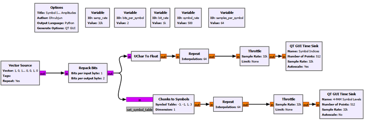

The two branches let us compare the symbol indices with the amplitudes produced by the mapping.

### Important Chunks to Symbols settings

```text
Input Type: int
Output Type: float
Symbol Table: [-3, -1, 1, 3]
Dimension: 1
Num Ports: 1
```

The exact input/output type choices should match the connected stream types in the flowgraph. The important conceptual setting is the **Symbol Table**.

The block uses the incoming symbol index as a lookup index. Therefore:

```text
input 0 -> table entry 0 -> -3
input 1 -> table entry 1 -> -1
input 2 -> table entry 2 -> +1
input 3 -> table entry 3 -> +3
```

The result makes the mapping visible.

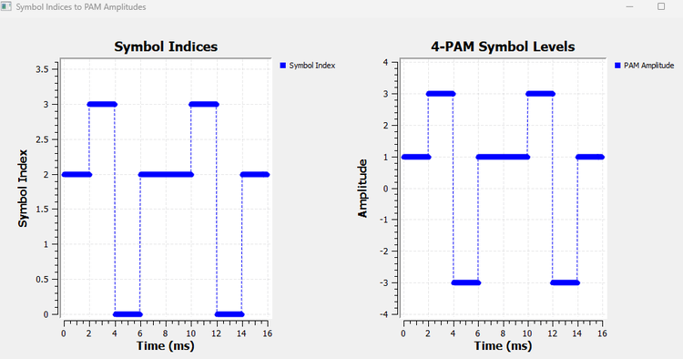

The left plot contains the abstract symbol indices. The right plot contains the corresponding PAM amplitudes.

The important observation is that **Chunks to Symbols does not create new information**. It changes the representation of the information.

The symbol index `2`, for example, does not mean that the transmitted signal must have amplitude 2. It simply tells the mapper to choose entry 2 from the symbol table, which in our case is `+1`.

This distinction becomes extremely important later when we work with phase and I/Q constellations.

------------------------------------------------------------------------

## GNU Radio Toolbox: Chunks to Symbols

**Chunks to Symbols** maps integer symbol indices to user-defined symbol values.

Conceptually, it behaves like a lookup table:

```text
incoming index
      |
      v
symbol table lookup
      |
      v
mapped signal value
```

For the table

```text
[-3, -1, 1, 3]
```

index `0` selects `-3`, index `1` selects `-1`, and so on.

The name can sound more complicated than the operation actually is. In our use here, a "chunk" is simply the integer symbol index produced after grouping bits.

The block will become useful again whenever digital labels need to be mapped to actual signal values.

------------------------------------------------------------------------

## 16.2 From Symbol Amplitudes to a Waveform

We now have real amplitude values, but another question remains.

If a symbol has amplitude `+3`, what does that mean over time?

A symbol is not transmitted for zero seconds. It occupies a **symbol duration**.

If the symbol rate is $R_s$, then the symbol duration is

$$
T_s=\frac{1}{R_s}
$$

For our symbol rate of 500 symbols/s,

$$
T_s=\frac{1}{500}=2\text{ ms}
$$

So each amplitude must represent the signal for 2 ms.

A very simple way to do this is to hold the chosen amplitude constant throughout the symbol interval.

For the symbol sequence

```text
+1, +3, -3, +1
```

we can imagine:

```text
+3       +-------+
         |       |
+1 +-----+       |       +-----
   |             |       |
-1 |             |       |
   |             |       |
-3 |             +-------+
   +----------------------------> time
```

Each symbol becomes a rectangular pulse whose height is determined by the symbol value.

That is a basic rectangular PAM waveform.

------------------------------------------------------------------------

# Experiment 16.2: Building a Rectangular PAM Waveform

We now extend Experiment 16.1.

The mapping remains unchanged:

```text
symbol indices
     |
     v
Chunks to Symbols
     |
     v
-3, -1, +1, +3
```

This time, however, we use `Repeat` to hold every mapped symbol value for 64 samples.

```text
Chunks to Symbols
        |
        +-----------------------> individual symbol values
        |
        v
      Repeat
Interpolation: 64
        |
        v
rectangular 4-PAM waveform
```

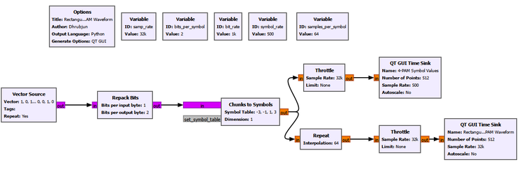

The upper display represents the individual symbol values. The lower display shows what happens when each value is held for the complete symbol duration.

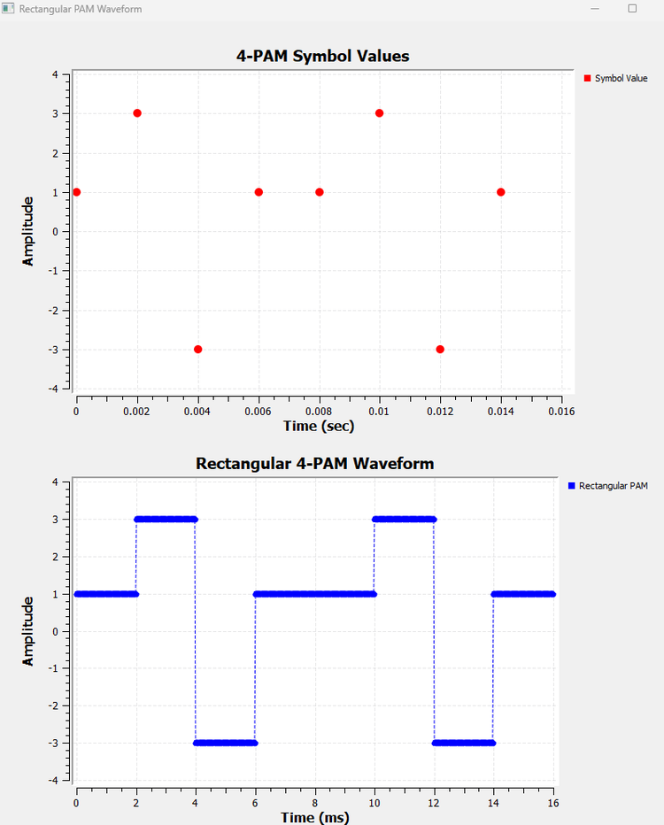

This experiment teaches an important distinction.

A sequence such as

$$
1,\;3,\;-3,\;1,\;1,\;3,\;-3,\;1
$$

is a sequence of **symbol values**.

The rectangular signal below it is a **waveform in time**.

The information is the same, but the representation is different.

In this experiment, `Repeat` is an intentionally simple educational way to turn one symbol value into multiple identical samples. It gives us a rectangular pulse shape and makes the symbol duration easy to see.

Later, we will discover that abrupt rectangular pulses are not always what we want to transmit through a practical band-limited communication channel. That problem will be addressed when we study pulse shaping.

------------------------------------------------------------------------

## 16.3 Why This Is Called Pulse Amplitude Modulation

At this point the name **Pulse Amplitude Modulation** becomes much less mysterious.

The pulse shape remains the same from symbol to symbol. What changes is its amplitude.

One symbol may produce a pulse at `-3`, another at `+1`, and another at `+3`.

In a general linear modulation model, we can write the transmitted baseband waveform as

$$
x(t)=\sum_k a_kp(t-kT_s)
$$

where:

- $a_k$ is the amplitude chosen for the $k$th symbol,
- $p(t)$ is the pulse shape,
- $T_s$ is the symbol duration.

The equation is simply a compact description of what we have already built.

For Experiment 16.2, $p(t)$ is a rectangular pulse. The symbol sequence changes the coefficient $a_k$.

This is one reason PAM is described as a form of **linear modulation**: the waveform is built as a sum of scaled, shifted copies of a pulse shape.

### Why are we calling this baseband?

Notice that we have not placed these symbols onto a radio-frequency carrier.

We are studying the information-bearing waveform directly, around baseband. Our immediate concern is how digital symbols become signal values and how those values can later be detected.

This separation is useful. Before worrying about antennas, RF carriers, frequency translation, or I/Q modulation, we can understand the symbol representation itself.

------------------------------------------------------------------------

## 16.4 Before 4-PAM, Step Back to the Simplest Case

We have already produced 4-PAM, so it may seem natural to continue with four levels.

But the receiver problem is easier to understand if we temporarily simplify the alphabet.

Suppose one bit directly selects one of two amplitudes:

```text
bit 0 -> -1
bit 1 -> +1
```

This is **2-PAM**.

There are only two valid symbol levels:

$$
\{-1,\;+1\}
$$

Now imagine that the receiver measures a value of `+0.82`.

That value is not exactly `+1`, but it is clearly much more consistent with the positive symbol than the negative one.

The receiver therefore needs a rule for turning a measured value back into a digital decision.

For symmetric 2-PAM, the natural boundary is zero:

```text
                threshold
                    0
                    |
       -1           |           +1
        o------------|------------o
                    |
       decide 0      |      decide 1
```

The decision rule is:

$$
r<0\rightarrow\text{bit }0
$$

$$
r>0\rightarrow\text{bit }1
$$

where $r$ is the received symbol observation.

This is called a **hard decision** because the receiver produces one definite output. It does not report how confident it was.

------------------------------------------------------------------------

# Experiment 16.3: Hard Decisions in 2-PAM

The purpose of this experiment is to make the transmitter-to-receiver logic visible without noise.

We use one bit per symbol, so the rates become:

| Parameter | Value |
|---|---:|
| Sample rate | `32k` samples/s |
| Bit rate | `1k` bit/s |
| Bits per symbol | `1` |
| Symbol rate | `1k` symbols/s |
| Samples per symbol | `32` |
| 2-PAM symbol table | `[-1, 1]` |

The key signal path is:

```text
binary data
    |
    v
Chunks to Symbols
[-1, +1]
    |
    +-----------------------> received 2-PAM display
    |
    v
Binary Slicer
    |
    v
detected bits
```

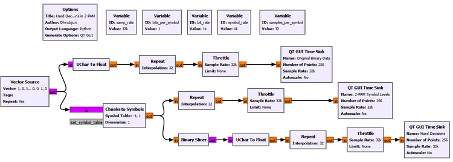

The three displays let us compare:

1. the original binary data,
2. the corresponding 2-PAM levels,
3. the hard decisions made by the receiver.

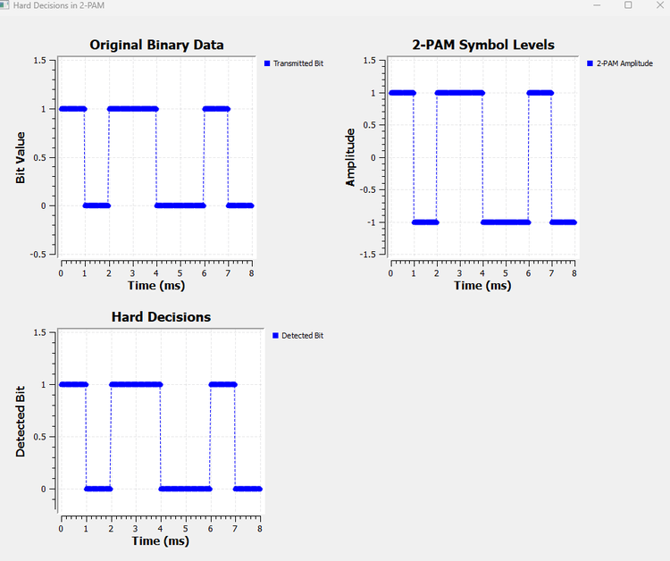

The result shows the complete round trip:

```text
bit 0 -> -1 -> decision 0
bit 1 -> +1 -> decision 1
```

Nothing has disturbed the signal yet, so the recovered bits match the transmitted bits exactly.

The important idea is not that this noiseless case is difficult. It is that we have now separated three quantities that can easily be confused:

```text
original information
       |
       v
symbol amplitude
       |
       v
receiver decision
```

The amplitude is not the bit. It is the physical signal value chosen to **represent** the bit.

------------------------------------------------------------------------

## GNU Radio Toolbox: Binary Slicer

The **Binary Slicer** converts a real-valued input into a binary decision according to its sign.

For the 2-PAM levels used here, it acts like a zero-threshold detector:

```text
negative input -> 0
positive input -> 1
```

That makes it a natural receiver for the mapping

```text
0 -> -1
1 -> +1
```

The block is simple, but the concept behind it is fundamental. Digital receivers eventually have to turn uncertain measured values into discrete decisions.

------------------------------------------------------------------------

## 16.5 Real Receivers Do Not See Perfect Symbol Levels

So far, the receiver sees exactly `-1` or `+1`.

That is convenient, but it is not realistic.

A communication channel introduces disturbances. Thermal noise, receiver electronics, interference, and other effects can move the measured value away from its ideal location.

A transmitted `+1` might be received as:

```text
+0.93
+1.14
+0.62
+1.37
```

Similarly, a transmitted `-1` might arrive as:

```text
-0.88
-1.21
-0.54
-1.35
```

The receiver does not need the value to land exactly on the ideal symbol level. It only needs the observation to remain in the correct **decision region**.

For 2-PAM:

```text
received value < 0  -> decide 0
received value > 0  -> decide 1
```

This gives us an important principle:

> Noise can change the received amplitude without necessarily changing the detected information.

An error occurs only when the disturbance is large enough to move the observation across the decision boundary.

------------------------------------------------------------------------

# Experiment 16.4: 2-PAM in Noise

We now extend Experiment 16.3 by adding Gaussian noise before the hard decision.

The transmitter mapping remains:

```text
0 -> -1
1 -> +1
```

The new part is:

```text
2-PAM symbol
     |
     v
    Add <--- Gaussian Noise
     |
     +------------------> noisy 2-PAM display
     |
     v
Binary Slicer
     |
     v
detected bit
```

A QT GUI Range lets us change the noise amplitude while the flowgraph is running.

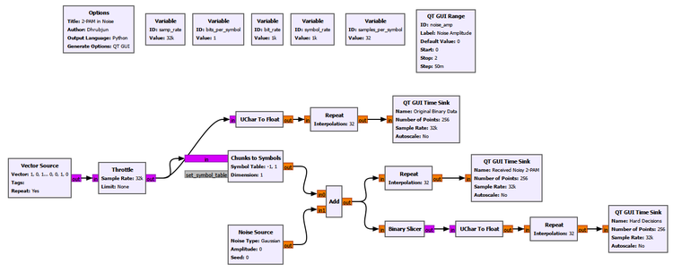

### New settings

```text
QT GUI Range
ID: noise_amp
Label: Noise Amplitude
Default Value: 0
Start: 0
Stop: 2
Step: 0.05

Noise Source
Noise Type: Gaussian
Amplitude: noise_amp
Seed: 0
```

The remaining rate settings stay the same as Experiment 16.3.

### A deliberate simplification in this experiment

There is an important detail in how we constructed this flowgraph.

We add one noise value to each **symbol observation** and then use `Repeat` to hold that noisy observation over the symbol interval for visualization.

Therefore the noisy PAM display looks like a sequence of shifted flat levels rather than a rapidly fluctuating noisy waveform.

Conceptually, we are studying this simplified receiver model:

```text
ideal symbol amplitude
        +
Gaussian disturbance
        |
        v
received symbol observation
        |
        v
hard decision
```

This is intentional. It lets us focus entirely on decision thresholds.

A more complete receiver will eventually include pulse shaping, channel noise at the sample level, receiver filtering, and sampling at the correct symbol instant. We will build that machinery later.

### Moderate noise: the values move, but the decisions remain correct

With moderate noise, the received levels no longer sit exactly at `-1` and `+1`.

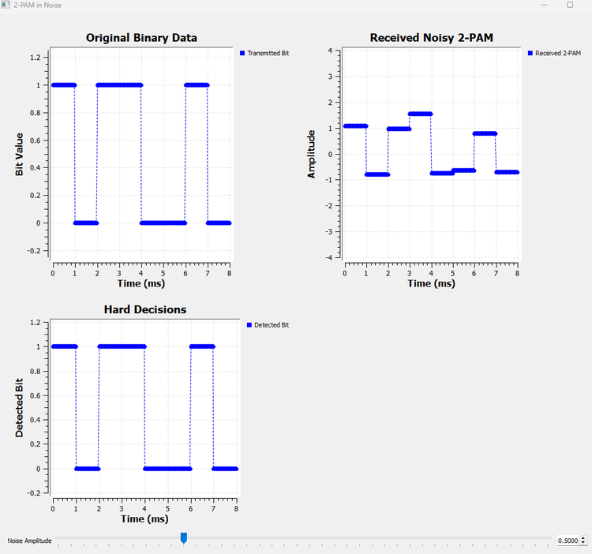

This result is important because it shows that a distorted-looking amplitude does not automatically mean a bit error.

Suppose `+1` was transmitted but the receiver observes

$$
r=+0.42
$$

The value is not ideal, but it is still positive. Therefore the hard decision is still `1`.

Likewise, a transmitted `-1` received as `-0.35` still produces the correct decision `0`.

### Increase the noise until a decision becomes wrong

Now increase the Noise Amplitude.

Eventually one of the received values crosses zero.

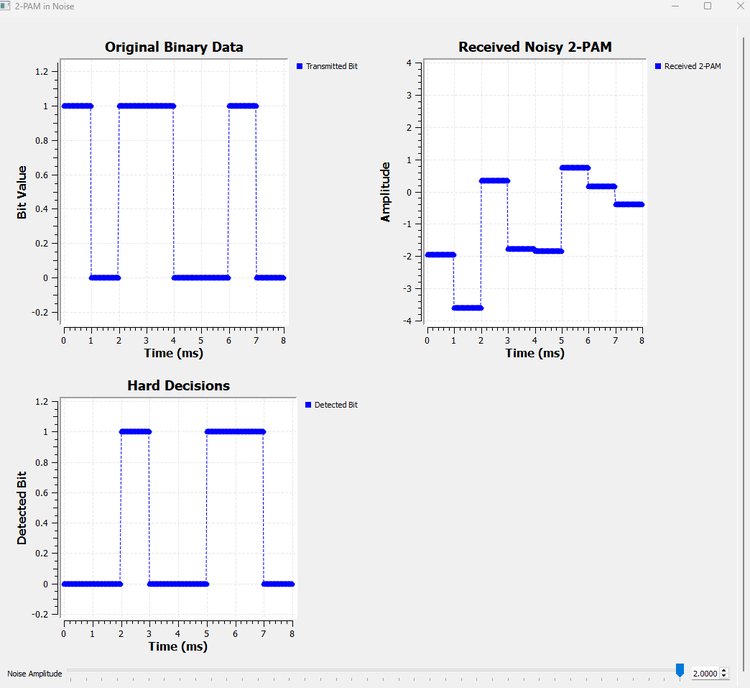

This is the key event.

For example, if `+1` was transmitted but noise produces

$$
r=-0.18
$$

then the receiver sees a negative value and decides `0`.

The receiver does not know that the sample was "supposed" to be positive. It can only apply its decision rule to the value it received.

That is how noise becomes a digital error.

------------------------------------------------------------------------

## GNU Radio Toolbox: Noise Source and QT GUI Range in a Receiver Experiment

We have encountered adjustable parameters and noise elsewhere in the book, but their role here is especially useful.

The **Noise Source** generates random samples. With Gaussian noise selected, its values follow a Gaussian distribution around zero. The `Amplitude` parameter controls the strength of the disturbance.

By setting

```text
Amplitude: noise_amp
```

we connect the Noise Source to the QT GUI Range variable.

The **QT GUI Range** then becomes an experimental control rather than just a fixed parameter. We can begin with a nearly ideal channel and gradually make the receiver's job harder while watching the decisions in real time.

This is a useful pattern for later communication experiments:

```text
start with ideal conditions
        |
        v
introduce one controlled impairment
        |
        v
observe when and why the receiver fails
```

------------------------------------------------------------------------

## Try It Yourself: Predict the First Error

Run Experiment 16.4 with a small noise amplitude.

Before increasing it, choose one transmitted `+1` symbol and one transmitted `-1` symbol and ask:

> In which direction would the noise have to move this symbol to cause an error?

Then slowly increase the Noise Amplitude and watch the received value and hard-decision plots together.

Do not focus only on how far the noisy value moves from `+1` or `-1`. Focus on whether it crosses **zero**.

That boundary, not the ideal level itself, determines the hard decision.

------------------------------------------------------------------------

## 16.6 Returning to 4-PAM

Now that the decision process is clear for two levels, we can return to the four-level signal from the beginning of the chapter.

Our 4-PAM alphabet is

$$
\{-3,\;-1,\;+1,\;+3\}
$$

and the mapping is:

| Symbol index | 4-PAM amplitude |
|---:|---:|
| 0 | -3 |
| 1 | -1 |
| 2 | +1 |
| 3 | +3 |

With 2-PAM, one threshold at zero was enough.

With four levels, one threshold cannot distinguish all four possibilities.

We need boundaries halfway between adjacent ideal levels.

Between `-3` and `-1`, the midpoint is `-2`.

Between `-1` and `+1`, the midpoint is `0`.

Between `+1` and `+3`, the midpoint is `+2`.

So the one-dimensional decision space becomes:

```text
             -2             0             +2
              |             |              |
      -3      |     -1      |      +1      |      +3
-------o------|------o------|-------o------|-------o------>
              |             |              |
     index 0  |   index 1   |    index 2   |   index 3
```

The receiver therefore uses four decision regions:

| Received value | Detected symbol index |
|---|---:|
| $r<-2$ | 0 |
| $-2\leq r<0$ | 1 |
| $0\leq r<2$ | 2 |
| $r\geq2$ | 3 |

The central idea has not changed from 2-PAM.

The receiver still asks:

> Which valid symbol region contains the received observation?

There are simply more regions now.

------------------------------------------------------------------------

# Experiment 16.5: Hard Decisions in 4-PAM

This experiment makes the three decision thresholds visible in GNU Radio.

We again use:

| Parameter | Value |
|---|---:|
| Sample rate | `32k` samples/s |
| Bit rate | `1k` bit/s |
| Bits per symbol | `2` |
| Symbol rate | `500` symbols/s |
| Samples per symbol | `64` |
| 4-PAM symbol table | `[-3, -1, 1, 3]` |

The transmitted bit stream is repacked into two-bit symbols, giving indices `0`, `1`, `2`, and `3`. Chunks to Symbols then maps those indices to `-3`, `-1`, `+1`, and `+3`.

The interesting part is the receiver.

### Building three thresholds from Binary Slicers

Binary Slicer naturally makes a decision around zero.

But our required thresholds are

$$
-2,\;0,\;+2
$$

We can turn each non-zero threshold into a zero-threshold problem by shifting the input.

To test whether

$$
r>-2
$$

we can instead test whether

$$
r+2>0
$$

Similarly, to test whether

$$
r>+2
$$

we can test whether

$$
r-2>0
$$

This gives three parallel decisions:

```text
                    +2
r ----------------> Add Const ---> Binary Slicer ----+
 |                                                    |
 +-------------------------------> Binary Slicer -----+--> Add
 |                                                    |
 +----------------> Add Const ---> Binary Slicer ----+
                    -2
```

The three slicer outputs have a useful pattern:

| PAM level | $r>-2$ | $r>0$ | $r>2$ | Sum |
|---:|---:|---:|---:|---:|
| -3 | 0 | 0 | 0 | **0** |
| -1 | 1 | 0 | 0 | **1** |
| +1 | 1 | 1 | 0 | **2** |
| +3 | 1 | 1 | 1 | **3** |

The sum is exactly the symbol index we want to recover.

This is a useful example of building a multi-level detector from simple binary decisions.

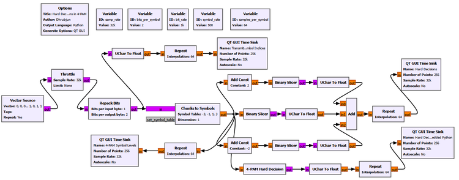

The flowgraph deliberately contains **two receiver implementations**.

The first uses ordinary GNU Radio blocks so that we can see how the thresholds work physically in the flowgraph.

The second uses an Embedded Python Block to implement the same decision rule more compactly.

The result verifies that both approaches recover the same symbol indices.

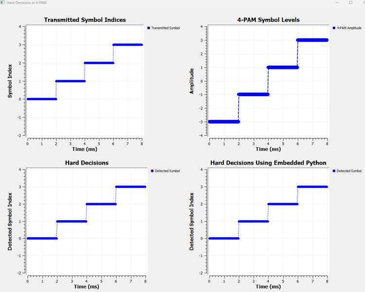

This is a useful point to separate two goals.

If our goal is **learning**, the block-based implementation is excellent because every threshold is visible.

If our goal is **building a compact flowgraph**, the Python implementation is much cleaner.

The underlying receiver logic is identical.

------------------------------------------------------------------------

## GNU Radio Toolbox: Add Const

**Add Const** adds a fixed constant to every input sample.

By itself, that sounds like a very small operation. In this experiment, however, it gives us a useful way to move an arbitrary decision threshold to zero.

For example:

```text
original test:       r > -2

shift the input:     r + 2

new test:            r + 2 > 0
```

Now an ordinary Binary Slicer can perform the decision.

This is a good example of a general DSP habit: sometimes it is easier to transform a problem into the form expected by an existing block than to search for a special-purpose block.

------------------------------------------------------------------------

## GNU Radio Toolbox: Embedded Python Block

The **Embedded Python Block** lets us write custom processing logic in Python and use it as a normal GNU Radio block.

For our 4-PAM detector, the underlying decision rule is the same one we already developed using the three thresholds:

```text
r < -2          -> symbol 0
-2 <= r < 0     -> symbol 1
0 <= r < 2      -> symbol 2
r >= 2          -> symbol 3
```

The Python version does not introduce a different detection method. It simply expresses the same decision regions more compactly.

The complete Embedded Python Block used in our experiment is:

```python
import numpy as np
from gnuradio import gr


class blk(gr.sync_block):

    def __init__(self):
        gr.sync_block.__init__(
            self,
            name='4-PAM Hard Decision',
            in_sig=[np.float32],
            out_sig=[np.uint8]
        )

    def work(self, input_items, output_items):
        x = input_items[0]
        y = output_items[0]

        n = min(len(x), len(y))

        for i in range(n):
            if x[i] < -2:
                y[i] = 0
            elif x[i] < 0:
                y[i] = 1
            elif x[i] < 2:
                y[i] = 2
            else:
                y[i] = 3

        return n
```

The input signature

```python
in_sig=[np.float32]
```

tells GNU Radio that the block expects floating-point received amplitudes.

The output signature

```python
out_sig=[np.uint8]
```

tells GNU Radio that the block produces unsigned integer symbol indices.

Inside `work()`, `input_items[0]` contains the incoming 4-PAM observations and `output_items[0]` is where the detected symbol indices are written.

The variable `n` ensures that the block processes only the number of items available in both the input and output buffers. The loop then applies the three decision boundaries `-2`, `0`, and `+2` to every received symbol observation.

We do not need to explore GNU Radio block programming in depth here. The important lesson is that once a receiver rule is understood, custom logic can be packaged into a compact reusable block when an equivalent ordinary flowgraph becomes large.

In Experiment 16.5, we keep both implementations so that we can verify that they agree. In Experiment 16.6, we keep only the Embedded Python detector to save flowgraph space and focus on the effect of noise.

------------------------------------------------------------------------

## 16.7 Why 4-PAM Is More Sensitive to Where the Observation Lands

In 2-PAM, there are only two regions separated by zero.

In 4-PAM, the receiver must distinguish among four regions.

For example, if `+1` was transmitted, a received value of `+0.6` is still in the region between `0` and `+2`, so the detector returns symbol index 2.

But if noise moves the observation above `+2`, the receiver will decide that the transmitted level was `+3` instead.

Likewise, if the observation moves below zero, it enters the region associated with `-1`.

So the important quantity is again the distance to the nearest **decision boundary**.

This is a more useful way to think than asking whether the received point is exactly equal to an ideal amplitude. In a noisy system, exact equality is not what the receiver expects.

------------------------------------------------------------------------

# Experiment 16.6: 4-PAM with Noise and Wrong Symbol Decisions

For the final experiment, we add Gaussian noise to the 4-PAM signal and use the Embedded Python detector from Experiment 16.5.

The transmitter and mapping are unchanged.

The new signal path is:

```text
bits
  |
  v
symbol indices
  |
  v
Chunks to Symbols
  |
  v
clean 4-PAM amplitudes
  |
  v
 Add <--- Gaussian Noise
  |
  +--------------------> received noisy 4-PAM display
  |
  v
4-PAM Hard Decision
Embedded Python Block
  |
  v
detected symbol indices
```

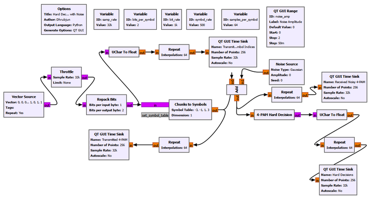

The rate settings remain the same as Experiment 16.5.

The Noise Source again uses:

```text
Noise Type: Gaussian
Amplitude: noise_amp
Seed: 0
```

and the QT GUI Range controls `noise_amp` from 0 to 2.

As in Experiment 16.4, we are deliberately working with a symbol-level noise observation so that the decision process remains easy to see.

### Moderate noise

At a moderate noise amplitude, the received 4-PAM values move away from their ideal levels.

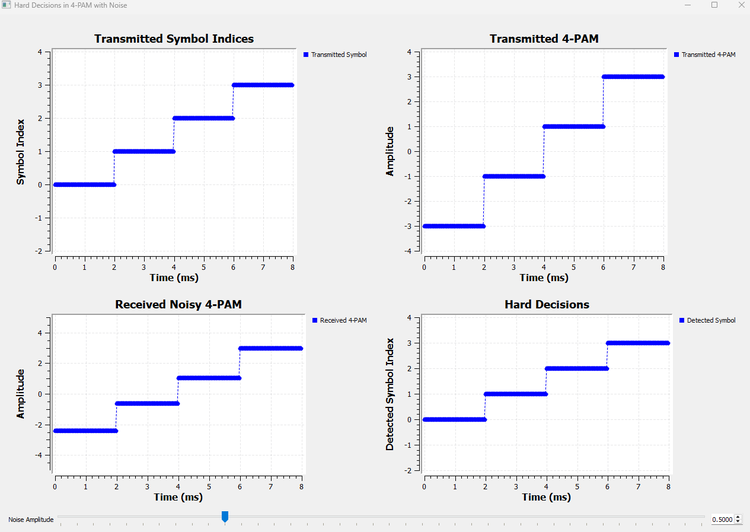

The received values are visibly different from `-3`, `-1`, `+1`, and `+3`, but the detector still recovers the correct symbol indices.

This is the same lesson we learned with 2-PAM:

> A symbol does not need to arrive at its exact ideal amplitude. It only needs to remain inside the correct decision region.

### Stronger noise

Now increase the noise further.

Eventually some observations cross `-2`, `0`, or `+2`.

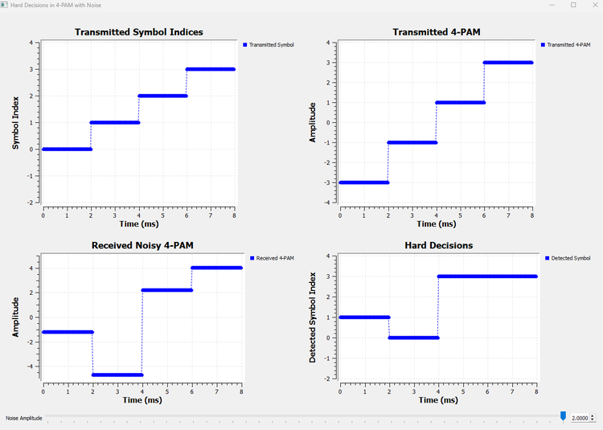

Now the detected symbol sequence differs from the transmitted sequence.

The receiver is still behaving correctly according to its rules. The problem is that the noisy observation has entered the wrong decision region.

This gives us a complete picture of a symbol error:

```text
transmitted symbol index
        |
        v
ideal PAM amplitude
        |
        v
noise moves the observation
        |
        v
observation crosses a threshold
        |
        v
receiver chooses another region
        |
        v
wrong detected symbol index
```

That chain will remain important throughout digital communications.

------------------------------------------------------------------------

## Try It Yourself: Which Threshold Will Fail First?

Run Experiment 16.6 with a low Noise Amplitude.

Choose one of the inner symbols, `-1` or `+1`, and predict which threshold crossings could cause an error.

For example, if `+1` is transmitted, ask:

```text
What happens if the observation falls below 0?
What happens if it rises above +2?
```

Then increase the noise slowly and compare your prediction with the detected symbol plot.

This exercise is more useful than simply asking, "How much noise can I add?" The real receiver question is, "Did the observation leave its decision region?"

------------------------------------------------------------------------

## 16.8 Symbol Energy

So far, we have talked mainly about the positions of the amplitude levels. Those amplitudes also determine how much energy the symbols carry.

For a rectangular symbol with amplitude $A$ and duration $T_s$, the symbol energy is

$$
E_s=A^2T_s
$$

The sign does not matter because the amplitude is squared.

For our 2-PAM alphabet,

$$
A\in\{-1,+1\}
$$

both symbols therefore have the same energy:

$$
E_s=T_s
$$

For our 4-PAM alphabet,

$$
A\in\{-3,-1,+1,+3\}
$$

the squared amplitudes are

$$
9,\;1,\;1,\;9
$$

If all four symbols are equally likely, the average symbol energy is

$$
\overline{E_s}=\frac{9+1+1+9}{4}T_s=5T_s
$$

This raises an important comparison issue.

If we compare two modulation schemes using arbitrary amplitude values, we may accidentally give one of them more average transmitted energy than the other. A fair performance comparison often normalizes the constellations to the same average energy.

For example, dividing the 4-PAM amplitudes by $\sqrt{5}$ gives

$$
\left\{-\frac{3}{\sqrt{5}},-\frac{1}{\sqrt{5}},+\frac{1}{\sqrt{5}},+\frac{3}{\sqrt{5}}\right\}
$$

which has unit average squared amplitude.

We did **not** use these normalized levels in our experiments because `-3`, `-1`, `+1`, and `+3` make the mapping and thresholds much easier to see.

We should therefore not use our screenshots to claim that 2-PAM or 4-PAM is inherently more noise-resistant. A rigorous comparison would need controlled average energy and a statistical error measurement over many symbols.

For this chapter, our goal is more fundamental: understand how amplitude levels represent symbols and how decision boundaries turn noisy observations back into digital information.

------------------------------------------------------------------------

## 16.9 Symbol Index, Symbol Level, and Received Observation Are Not the Same Thing

By now we have used several quantities that may look similar on a plot, so it is worth separating them clearly.

Consider symbol index `2` in our 4-PAM system.

```text
symbol index
     2
     |
     | mapping
     v
ideal symbol amplitude
    +1
     |
     | noise/channel
     v
received observation
   +0.63
     |
     | decision thresholds
     v
detected symbol index
     2
```

These four stages play different roles.

### Symbol index

The symbol index is an abstract digital label. In 4-PAM it can be `0`, `1`, `2`, or `3`.

### Symbol level

The symbol level is the signal amplitude assigned to that label. In our mapping, index `2` becomes `+1`.

### Received observation

The received observation is what the receiver actually measures. Because of noise, it may be `+0.63`, `+1.2`, or some other value rather than exactly `+1`.

### Detected symbol index

The detector uses the decision regions to turn the observation back into a discrete symbol index.

This sequence is the heart of the chapter:

```text
information label
      |
      v
signal representation
      |
      v
imperfect observation
      |
      v
decision
```

Once this idea is clear in one dimension, much of digital modulation becomes easier to understand.

------------------------------------------------------------------------

## 16.10 PAM in a Practical Communication System

Our experiments have intentionally isolated one part of a larger receiver.

A practical digital link contains more stages than the simplified flowgraphs used here.

A more complete picture looks like:

```text
bits
  |
  v
symbol mapping
  |
  v
pulse shaping
  |
  v
transmission channel
  |
  v
receiver filtering
  |
  v
sampling at symbol instants
  |
  v
symbol decisions
  |
  v
recovered bits
```

In this chapter we concentrated on the mapping and decision parts.

That was deliberate.

If we had introduced pulse shaping, matched filtering, timing recovery, carrier effects, and decision logic all at once, it would have been difficult to see what each stage was doing.

The simplified experiments let us answer one clean question:

> Given a measured symbol value, how does the receiver decide which transmitted amplitude it represents?

Later chapters will fill in the missing stages.

------------------------------------------------------------------------

## 16.11 One Dimension Is Enough for PAM

There is another useful way to visualize everything we have done.

Our 4-PAM symbols all lie on one amplitude axis:

```text
          -3        -1        +1        +3
-----------o---------o---------o---------o----------> amplitude
                 
             decision boundaries
                -2   0   +2
```

Each valid symbol is a point on a **line**.

Noise moves the received observation along that line. The receiver divides the line into decision regions and selects the symbol associated with the region containing the observation.

This one-dimensional picture is more important than it may first appear.

In the next chapter, we will allow symbols to occupy two dimensions instead of one.

The ideas of mapping, ideal symbol locations, noise, distance, and decision regions will remain. Only the geometry will become richer.

------------------------------------------------------------------------

## What We Learned

In this chapter, we completed the step that Chapter 15 deliberately left unfinished.

We started with abstract symbol indices and mapped them to actual signal amplitudes.

The complete chain now looks like:

```text
bits
  |
  v
groups of bits
  |
  v
symbol indices
  |
  v
symbol mapping
  |
  v
PAM amplitudes
  |
  v
waveform
```

The main ideas are:

- A **symbol index** is an abstract label, not necessarily the value transmitted by the signal.
- **Chunks to Symbols** can map symbol indices to chosen signal levels.
- In **2-PAM**, one bit selects one of two amplitudes, such as `-1` and `+1`.
- In **4-PAM**, two-bit symbols can select four amplitudes, such as `-3`, `-1`, `+1`, and `+3`.
- Holding each amplitude over a symbol interval creates a simple rectangular PAM waveform.
- PAM is a form of **linear modulation** in which information controls the coefficient multiplying a pulse shape.
- The PAM signals studied here are **baseband** symbol waveforms. We have not yet placed them on an RF carrier.
- A receiver does not normally observe the exact ideal symbol amplitude.
- A **hard decision** converts a measured value into one definite symbol or bit.
- For symmetric 2-PAM, zero is the natural decision threshold.
- For the 4-PAM levels `-3`, `-1`, `+1`, and `+3`, the decision thresholds are `-2`, `0`, and `+2`.
- Noise does not cause an error merely because it changes the amplitude.
- A symbol error occurs when the received observation crosses a decision boundary and enters the wrong region.
- Multi-level decision logic can be built from ordinary GNU Radio blocks or implemented compactly with an Embedded Python Block.
- Symbol amplitudes also determine symbol energy, so fair comparisons between modulation schemes require attention to energy normalization.

Most importantly, we have changed the way we think about digital reception.

The receiver is not asking:

> Did I receive exactly the amplitude that was transmitted?

It is asking:

> Which valid symbol is this received observation most consistent with?

That question is much closer to how real digital receivers work.

------------------------------------------------------------------------

## Connecting to the Next Chapter

PAM gave us several possible symbols, but every symbol still lived on a single line:

```text
-3        -1        +1        +3
 o---------o---------o---------o
```

What if we are not limited to one dimension?

Earlier in the book, we learned that a complex baseband signal can be written in terms of in-phase and quadrature components:

$$
x[n]=I[n]+jQ[n]
$$

That gives us two independent axes instead of one.

Rather than choosing only an amplitude on a line, a digital symbol can choose a point in the I/Q plane.

```text
                 Q
                 ^

           o           o

----------------+----------------> I

           o           o
```

The ideas from this chapter will not disappear.

A symbol index will still map to a signal representation. Noise will still move the received symbol away from its ideal location. The receiver will still need decision regions.

But instead of asking which level on a line was transmitted, we will ask which point in a plane was transmitted.

That takes us to **Chapter 17: BPSK, QPSK and QAM**.
