# Chapter 17: BPSK, QPSK and QAM

## How Can I and Q Carry Digital Information?

In Chapter 16, we learned how to turn abstract digital symbols into actual signal amplitudes. A 2-PAM symbol could be represented by one of two levels,

$$
-1,\quad +1
$$

and 4-PAM extended the same idea to four levels,

$$
-3,\quad -1,\quad +1,\quad +3
$$

All of those symbols lived on one amplitude axis.

That leaves an obvious question. Earlier in the book, we spent considerable time developing complex signals and the I/Q representation,

$$
x[n]=I[n]+jQ[n]
$$

If a digital symbol can choose an amplitude on the I axis, can it also choose an amplitude on the Q axis?

The answer is yes, and that simple step opens the door to most of the constellations used in modern digital communication.

In this chapter, we will build that idea experimentally. We will begin with BPSK, where only one dimension is needed. Then we will let both I and Q carry information and watch QPSK appear naturally. Finally, we will reuse the 4-PAM levels from Chapter 16 on both axes and construct 16-QAM ourselves.

We will deliberately avoid beginning with ready-made modulation blocks. The goal is to understand what the symbols actually are before allowing GNU Radio to hide the mapping inside a convenient higher-level tool.

---

## From One Amplitude Axis to the I/Q Plane

A PAM symbol can be pictured as a point on a line. For 2-PAM,

```text
              amplitude
                  →

        -1                  +1
         ●-------------------●
```

A complex symbol gives us a second dimension:

```text
                         Q
                         ↑
                         |
                         |
-------------------------+-------------------------→ I
                         |
                         |
```

A constellation point is simply a particular pair of coordinates in this plane.

For example,

$$
s=1+j
$$

means

$$
I=1,\quad Q=1
$$

so the symbol is plotted at the point $(1,1)$.

This is the central idea of the chapter:

> A digital constellation is a set of allowed I/Q coordinate pairs. Each allowed point represents one information symbol.

We will now build those points rather than merely drawing them.

---

# Experiment 17.1: From 2-PAM to BPSK

## Why Start with PAM Again?

At first glance, BPSK may seem unrelated to the PAM signals from Chapter 16. BPSK stands for **Binary Phase Shift Keying**, while PAM represented information using amplitude.

But at complex baseband, the connection is surprisingly direct.

Take the same two levels used for 2-PAM:

$$
-1,\quad +1
$$

and place them on the I axis while keeping Q equal to zero:

$$
s\in\{-1+j0,\,+1+j0\}
$$

The resulting constellation is

```text
                         Q
                         ↑
                         |
             ●-----------+-----------●
          (-1,0)         |         (+1,0)
                         |
-------------------------+-------------------------→ I
```

This is the complex-baseband representation of BPSK.

The experiment therefore begins with something already familiar: map binary symbol indices onto $-1$ and $+1$, just as we did for 2-PAM. The only new step is to interpret those values as the real part of a complex signal.

## Flowgraph

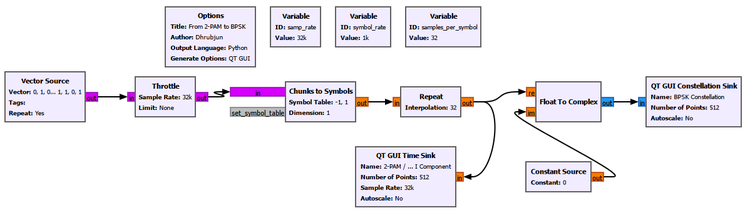

The symbol mapping remains

```text
0 → -1
1 → +1
```

The mapped values are repeated for visualization and used as the I input of **Float to Complex**. The Q input is held at zero.

Important settings are:

```text
Chunks to Symbols
Output Type: Float
Symbol Table: [-1, 1]
Dimension: 1

Float to Complex
Real input: mapped ±1 symbols
Imaginary input: 0
```

The Constellation Sink then displays the complex output.

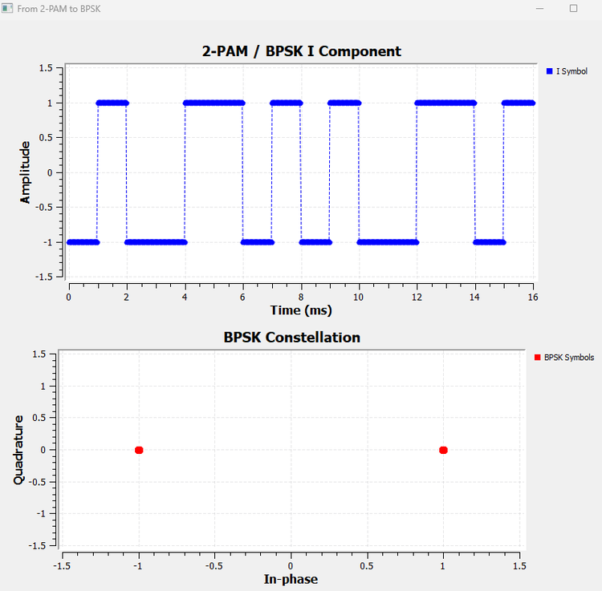

The result contains only two points:

$$
(-1,0)\quad\text{and}\quad(+1,0)
$$

So at complex baseband, BPSK looks exactly like 2-PAM placed on the I axis.

That immediately creates a reasonable doubt:

> If the symbols are just $-1$ and $+1$, why is this called phase shift keying rather than amplitude modulation?

To answer that, we need to look at what those signs do to a carrier.

---

# Experiment 17.2: Why BPSK Is Phase Shift Keying

## From a Baseband Sign to a Carrier Phase

Let the BPSK symbol be

$$
a(t)\in\{-1,+1\}
$$

and multiply it by a cosine carrier:

$$
x(t)=a(t)\cos(2\pi f_ct)
$$

When the symbol is $+1$,

$$
x(t)=\cos(2\pi f_ct)
$$

The transmitted carrier has the same phase as the reference carrier.

When the symbol is $-1$,

$$
x(t)=-\cos(2\pi f_ct)
$$

But

$$
-\cos(\theta)=\cos(\theta+\pi)
$$

so the carrier has been shifted by $180^\circ$.

The two baseband signs therefore select two carrier phases.

## Flowgraph

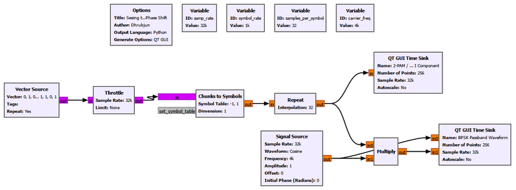

The important parameters are:

| Parameter | Value |
|---|---:|
| Sample rate | 32 kS/s |
| Symbol rate | 1 ksymbol/s |
| Carrier frequency | 4 kHz |
| BPSK levels | -1, +1 |

The two GUI displays are titled:

```text
BPSK I Component
BPSK Passband Waveform
```

The passband Time Sink contains two traces:

```text
Reference Carrier
BPSK Carrier
```

We deliberately chose a 4 kHz carrier and a 1 ksymbol/s symbol rate, giving four carrier cycles per symbol. This makes the phase relationship particularly easy to see.

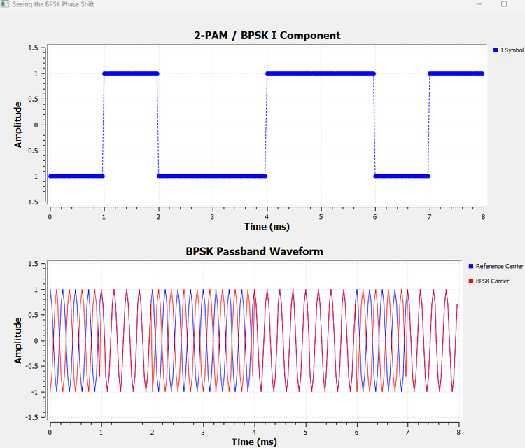

Read the two plots together. When the lower plot is at $+1$, the BPSK carrier overlaps the reference carrier. When it is at $-1$, the two carriers are opposite in polarity.

The carrier amplitude has not been switched between a large value and a small value. Its magnitude remains the same. What changes is its phase:

```text
symbol +1 → 0° carrier phase
symbol -1 → 180° carrier phase
```

This is the missing link between 2-PAM and BPSK.

## Looking Closely at a Phase Transition

The zoomed result makes an individual symbol transition easier to inspect.

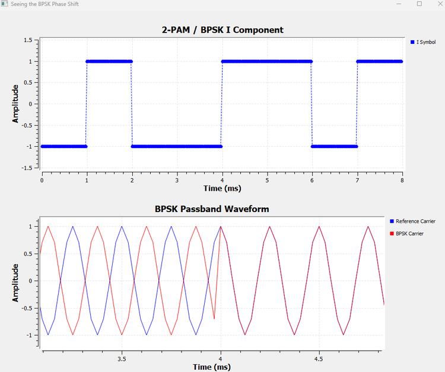

Before the transition, the BPSK carrier is opposite to the reference. After the symbol changes sign, the BPSK carrier becomes aligned with it.

Notice also that the passband waveform can change abruptly at a symbol boundary. Our symbol waveform is rectangular, so the multiplier changes from $-1$ to $+1$ instantaneously. If the carrier is not zero at that instant, the output can contain a visible discontinuity.

That is not a mistake in the experiment. It is a consequence of the deliberately simple symbol waveform we are using.

We will return to the consequences of abrupt symbol transitions in Chapter 18, where pulse shaping becomes the main subject.

### Try It Yourself

Change the carrier frequency while keeping the symbol rate unchanged. Before running the flowgraph, predict whether every symbol transition will still occur at the same point in a carrier cycle.

The BPSK principle does not depend on having exactly four carrier cycles per symbol. That choice merely made the phase reversal easier to visualize.

---

# Experiment 17.3: BPSK Decision Regions and Noise

Chapter 16 showed that a noisy PAM receiver does not require the received amplitude to land exactly on an ideal level. It only needs to decide which valid symbol is most likely.

For BPSK, the two ideal points are

$$
-1+j0\quad\text{and}\quad+1+j0
$$

The midpoint between them is

$$
I=0
$$

In one-dimensional PAM, this was a decision threshold. In the I/Q plane, it becomes a vertical **decision boundary**:

```text
                         Q
                         ↑
                         |
        decide -1       |       decide +1
                         |
             ●           |           ●
                         |
-------------------------+-------------------------→ I
                         0
```

The receiver's ideal hard decision is simply

$$
I<0\Rightarrow -1
$$

$$
I>0\Rightarrow +1
$$

## Adding Complex Gaussian Noise

We extend the clean BPSK signal with a complex Gaussian Noise Source and an Add block:

```text
BPSK Symbols ───────────┐
                       ├── Add ──→ Noisy BPSK
Complex Gaussian Noise ─┘
```

The noise amplitude is controlled with a QT GUI Range:

```text
ID: noise_amp
Default: 0.2
Start: 0
Stop: 1.5
Step: 0.05
```

The Constellation Sink is titled:

```text
BPSK with Gaussian Noise
```

and compares:

```text
Ideal BPSK
Noisy BPSK
```

Because the noise is complex, received samples move in both I and Q even though the transmitted BPSK symbols themselves have $Q=0$.

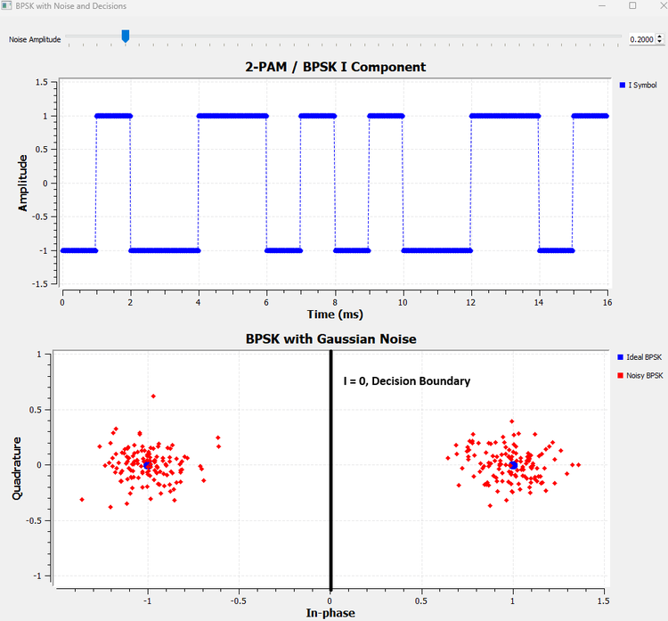

At a noise amplitude of 0.2, the two ideal points have become compact clouds. Many samples have nonzero Q components, but the two clouds remain comfortably separated by the $I=0$ boundary.

This reveals something important. For ideal BPSK detection, a vertical displacement does not by itself change the decision. A received point such as

$$
r=0.8+j0.7
$$

still has positive I and therefore remains in the $+1$ decision region.

What matters is whether the point crosses the boundary.

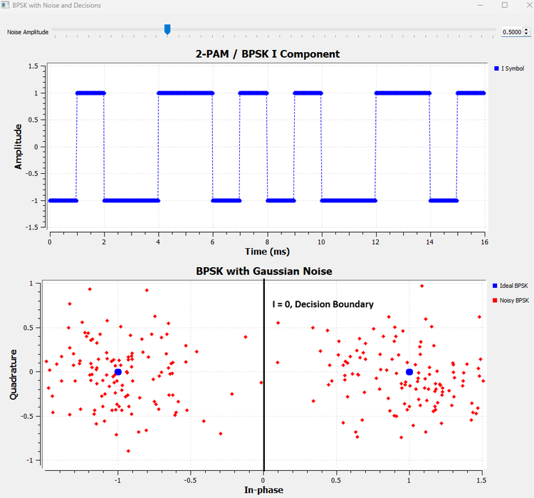

At a noise amplitude of 0.5, the clouds spread far enough that samples can enter the opposite decision region.

For example, if $+1+j0$ was transmitted but the received point becomes

$$
r=-0.1+j0.2
$$

then the receiver sees $I<0$ and decides $-1$.

The important lesson is not simply that "more noise causes more errors." The geometry is more useful:

> A hard-decision error becomes possible when noise pushes a received symbol across a decision boundary.

This geometric way of thinking will become even more valuable when both I and Q carry information.

---

# Experiment 17.4: Building QPSK from I and Q

BPSK uses the I/Q plane, but only one dimension actually carries information:

$$
I\in\{-1,+1\},\qquad Q=0
$$

The Q dimension is unused.

So let us use it.

Suppose both coordinates can independently take the values $-1$ and $+1$:

$$
I\in\{-1,+1\}
$$

$$
Q\in\{-1,+1\}
$$

There are now

$$
2\times2=4
$$

possible coordinate pairs:

| Bit pair | I | Q | Complex symbol |
|---|---:|---:|---|
| 00 | -1 | -1 | $-1-j$ |
| 01 | -1 | +1 | $-1+j$ |
| 10 | +1 | -1 | $+1-j$ |
| 11 | +1 | +1 | $+1+j$ |

For this first construction, the first bit selects I, the second selects Q, and each bit uses the familiar mapping

```text
0 → -1
1 → +1
```

## Constructing the Two Dimensions Explicitly

We deliberately use controlled sequences so that every combination appears:

```text
I bits: 0, 0, 1, 1
Q bits: 0, 1, 0, 1
```

After mapping,

```text
I: -1, -1, +1, +1
Q: -1, +1, -1, +1
```

At each symbol interval, one I value and one Q value are taken together.

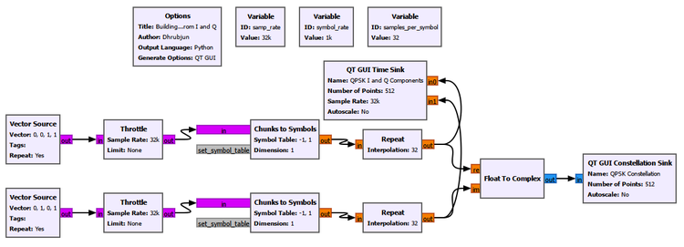

The important settings are:

```text
I Vector Source
Output Type: Byte
Vector: [0, 0, 1, 1]
Repeat: Yes

Q Vector Source
Output Type: Byte
Vector: [0, 1, 0, 1]
Repeat: Yes

I Chunks to Symbols
Symbol Table: [-1, 1]
Output Type: Float

Q Chunks to Symbols
Symbol Table: [-1, 1]
Output Type: Float

Float to Complex
Real input: I symbols
Imaginary input: Q symbols
```

The Time Sink is titled

```text
QPSK I and Q Components
```

with traces

```text
I Symbol
Q Symbol
```

and the Constellation Sink is titled

```text
QPSK Constellation
```

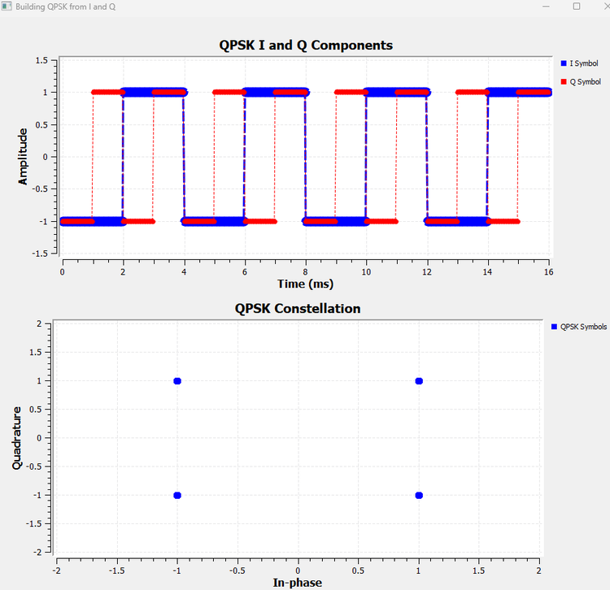

This figure answers the main question of the chapter directly.

Both I and Q independently carry a binary coordinate. GNU Radio combines the simultaneous values as

$$
s=I+jQ
$$

and each pair becomes one constellation point.

We did not ask a ready-made QPSK modulator to create these points. QPSK emerged simply by combining two binary dimensions.

## One Symbol, Not Two Separate Transmissions

It is easy to look at the two Time Sink traces and think that I and Q are two unrelated signals being transmitted separately. That is not the right interpretation.

At each symbol interval, the pair $(I,Q)$ defines **one complex symbol**.

For example,

$$
I=-1,\qquad Q=+1
$$

means

$$
s=-1+j
$$

and the Constellation Sink plots one point at $(-1,+1)$.

I and Q are two orthogonal signal dimensions of the same complex representation.

## Why QPSK Carries Two Bits per Symbol

There are four possible constellation points, so

$$
k=\log_2(4)=2
$$

bits can select one symbol.

This reconnects naturally with the bit-rate and symbol-rate relationship from Chapter 15:

$$
R_b=kR_s
$$

For QPSK,

$$
R_b=2R_s
$$

A 1 ksymbol/s QPSK stream can therefore represent 2 kbit/s before considering coding or other overhead.

## Why These Four Points Are Called QPSK

All four points have the same magnitude:

$$
|s|=\sqrt{I^2+Q^2}=\sqrt{2}
$$

but they point in four different directions.

Their phases are:

| I | Q | Phase |
|---:|---:|---:|
| +1 | +1 | $45^\circ$ |
| -1 | +1 | $135^\circ$ |
| -1 | -1 | $225^\circ$ or $-135^\circ$ |
| +1 | -1 | $315^\circ$ or $-45^\circ$ |

So the four symbols have equal magnitude and four possible phases separated by $90^\circ$.

That is Quadrature Phase Shift Keying.

---

## I/Q and Amplitude/Phase Are Two Views of the Same Symbol

This distinction is worth making explicit before going further.

A complex symbol can be written in Cartesian form as

$$
s=I+jQ
$$

or in polar form as

$$
s=Ae^{j\phi}
$$

where

$$
A=\sqrt{I^2+Q^2}
$$

and

$$
\phi=\operatorname{atan2}(Q,I)
$$

These are not two different signals. They are two descriptions of the same complex point.

For example, consider

$$
s=3+j
$$

Its I/Q coordinates are

$$
I=3,\qquad Q=1
$$

while its magnitude and phase are

$$
A=\sqrt{10}
$$

$$
\phi\approx18.4^\circ
$$

So we can describe the same symbol either by its I and Q coordinates or by its amplitude and phase.

This helps separate two ideas that are often confused:

- **I/Q is a representation** of a complex signal.
- **PSK and QAM are modulation schemes** that choose particular sets of allowed complex points.

For ideal PSK, the constellation points lie on a circle: their magnitudes are the same and their phases differ.

Rectangular QAM is usually constructed by choosing amplitude levels independently on I and Q. The resulting symbols generally have **both different magnitudes and different phases**.

At passband, using the quadrature convention adopted here, the corresponding signal can be written as

$$
x(t)=I\cos(2\pi f_ct)-Q\sin(2\pi f_ct)
$$

The cosine and sine carriers are $90^\circ$ apart. I controls the amplitude of one quadrature component and Q controls the amplitude of the other. When those components combine, the resulting carrier has the amplitude and phase represented by the complex symbol.

This is why QAM is closely connected to both I/Q and amplitude/phase. The descriptions are not competing explanations; they are different views of the same signal.

---

# Experiment 17.5: QPSK Decision Regions and Noise

BPSK needed one decision boundary because only I carried information.

QPSK uses both coordinates, so the receiver must decide the sign of both I and Q.

The boundaries are

$$
I=0
$$

and

$$
Q=0
$$

which divide the plane into four regions:

```text
                         Q
                         ↑
                         |
          I<0,Q>0       |       I>0,Q>0
                         |
             ●           |           ●
                         |
-------------------------+-------------------------→ I
                         |
             ●           |           ●
                         |
          I<0,Q<0       |       I>0,Q<0
                         |
```

A QPSK hard detector can therefore be understood as two simultaneous binary decisions:

```text
sign of I → I decision
sign of Q → Q decision
```

## Adding Noise

We extend Experiment 17.4 by adding complex Gaussian noise to the complex QPSK stream. The clean and noisy symbols are displayed together.

The noise control remains:

```text
ID: noise_amp
Default: 0.2
Start: 0
Stop: 1.5
Step: 0.05
```

The Constellation Sink is titled

```text
QPSK with Gaussian Noise
```

with traces

```text
Ideal QPSK
Noisy QPSK
```

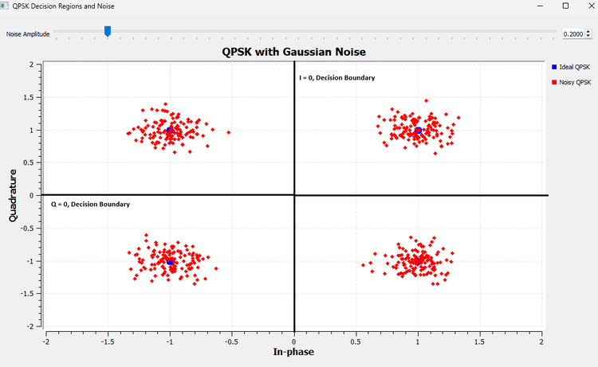

At 0.2, the four clouds remain compact and stay inside their respective decision regions.

Now increase the noise.

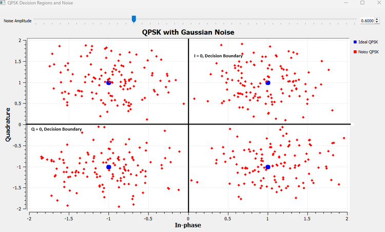

At 0.6, samples spread across the boundaries.

A point can cross $I=0$ while keeping the same Q sign, cross $Q=0$ while keeping the same I sign, or, with a sufficiently large disturbance, cross both.

For example, if

$$
s=1+j
$$

was transmitted but the received point becomes

$$
r=-0.2+j0.8
$$

then the I decision changes while the Q decision remains positive.

If instead

$$
r=0.7-j0.1
$$

then the Q decision changes.

If the point reaches

$$
r=-0.2-j0.3
$$

both coordinate decisions have changed.

The same threshold-crossing idea from Chapter 16 is now operating in two dimensions.

---

# Experiment 17.6: Breaking the QPSK Constellation

Noise is only one way a received constellation can differ from the ideal one.

Some impairments affect individual samples randomly. Others distort the whole constellation in a systematic way.

This experiment compares two simple cases:

```text
uniform amplitude scaling
phase rotation
```

The distinction is extremely useful when looking at real SDR constellations.

## Part A: Uniform Amplitude Scaling

Multiply every QPSK symbol by a positive real gain $A$:

$$
r=As
$$

The implementation adds a complex **Multiply Const** block controlled by a QT GUI Range:

```text
ID: amp_gain
Default: 1.0
Start: 0.2
Stop: 2.0
Step: 0.1

Multiply Const
Constant: amp_gain
```

The Constellation Sink compares

```text
Ideal QPSK
Scaled QPSK
```

and is titled

```text
QPSK Amplitude Scaling
```

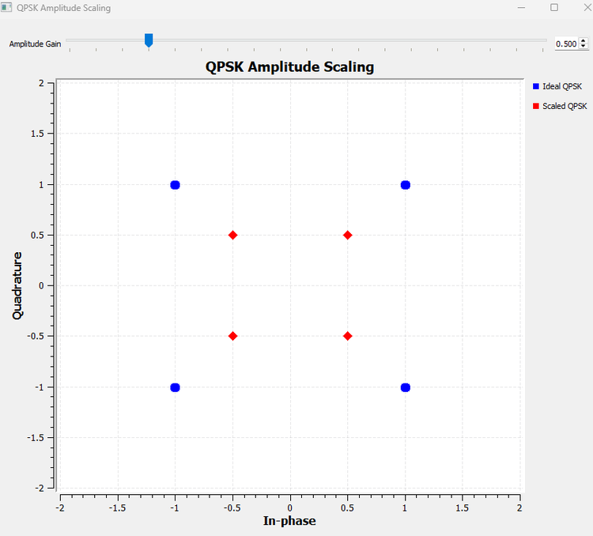

At $A=0.5$,

$$
(\pm1,\pm1)\rightarrow(\pm0.5,\pm0.5)
$$

so the constellation contracts toward the origin.

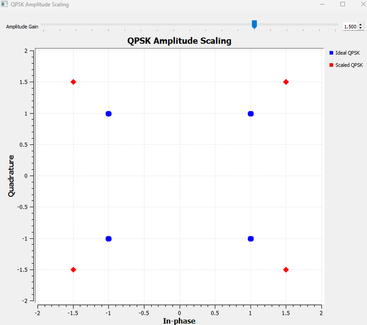

At $A=1.5$, the constellation expands outward.

The square does not rotate. Each point simply moves along the radial line connecting it to the origin.

For positive uniform gain, the signs of I and Q do not change, so the points remain in the same ideal QPSK decision regions. Uniform scaling changes the constellation size, but it does not necessarily cause hard-decision errors by itself.

This experiment uses the same gain on both I and Q. More general amplitude distortions can alter the shape as well, but we do not need them here.

## Part B: Phase Rotation

Now multiply the complex symbol by a unit-magnitude phasor:

$$
r=se^{j\theta}
$$

The magnitude remains unchanged, but every point rotates by the same angle.

In GNU Radio, a complex Signal Source at zero frequency provides the stationary phasor. Its phase is controlled by a QT GUI Range:

```text
phase_deg
Default: 0
Start: -90
Stop: 90
Step: 5

Complex Signal Source
Frequency: 0
Amplitude: 1
Initial Phase: phase_deg * math.pi / 180
```

The clean QPSK stream and the phasor are multiplied, and the sink compares

```text
Ideal QPSK
Rotated QPSK
```

under the title

```text
QPSK Phase Rotation
```

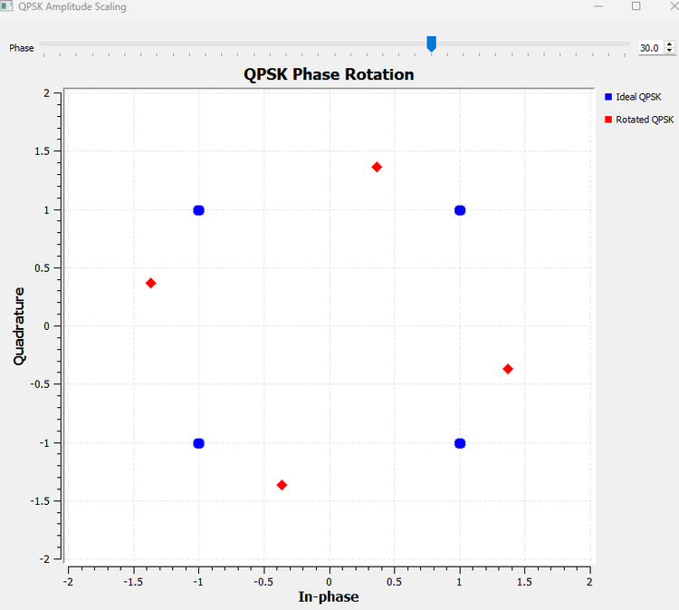

At $30^\circ$, the entire square rotates rigidly around the origin. The points remain sharp rather than becoming clouds, and their distance from the origin is unchanged.

This looks completely different from Gaussian noise.

Now increase the rotation to $45^\circ$.

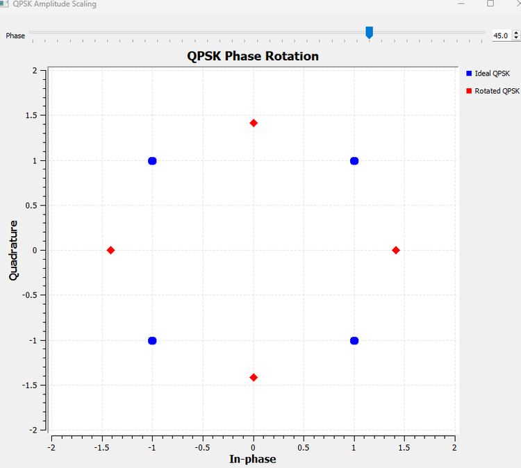

The original QPSK phases were

$$
45^\circ,\quad135^\circ,\quad225^\circ,\quad315^\circ
$$

Adding $45^\circ$ gives

$$
90^\circ,\quad180^\circ,\quad270^\circ,\quad360^\circ
$$

so the rotated points land directly on the original I or Q axes. Those axes are also the receiver's decision boundaries.

This leads to an important practical lesson:

> A constellation can be perfectly clean and still be difficult to detect if it is rotated relative to the receiver's assumed decision regions.

A small amount of additional noise around the $45^\circ$ case can easily push a sample to either side of a boundary.

### A Useful Visual Diagnosis

The experiments now give us three distinct patterns:

| Impairment | Constellation appearance |
|---|---|
| Gaussian noise | Individual points scatter into clouds |
| Uniform amplitude scaling | Whole constellation expands or contracts |
| Phase rotation | Whole constellation rotates |

These visual signatures are one reason constellation displays are so useful in practical SDR work.

### Try It Yourself

Set the phase rotation slightly above $45^\circ$, for example $50^\circ$. Before running the flowgraph, predict which neighboring decision region each ideal QPSK point will enter.

Then return the rotation to zero and change only the amplitude gain. Notice how different the two impairments look even though both modify the complex symbols.

---

## From QPSK to M-PSK

BPSK and QPSK suggest a broader idea.

BPSK uses two phase states. QPSK uses four. We can continue placing more allowed points around the same circle.

For M-PSK, a convenient ideal description is

$$
s_k=Ae^{j2\pi k/M},\qquad k=0,1,\ldots,M-1
$$

The geometric idea matters more than memorizing the equation:

```text
BPSK      → 2 allowed phases
QPSK      → 4 allowed phases
8-PSK     → 8 allowed phases
M-PSK     → M allowed phases
```

For ideal conventional M-PSK, all points have the same magnitude and differ in phase.

The number of bits represented by one symbol is

$$
k=\log_2 M
$$

for the power-of-two constellations considered here.

| Modulation | Number of points | Bits per symbol |
|---|---:|---:|
| BPSK | 2 | 1 |
| QPSK | 4 | 2 |
| 8-PSK | 8 | 3 |
| 16-PSK | 16 | 4 |

Adding more points increases the number of bits represented by each symbol, but it also packs the allowed states more closely in angle for a fixed radius. Distinguishing neighboring symbols therefore becomes more demanding in the presence of noise and phase error.

We will not build a separate 8-PSK experiment here. BPSK and QPSK have already established the underlying geometry.

---

# Experiment 17.7: Building 16-QAM from Two 4-PAM Axes

QPSK gave both I and Q two allowed values:

$$
I,Q\in\{-1,+1\}
$$

What if we give each dimension four values instead?

Chapter 16 already provided exactly the levels we need:

$$
-3,\quad-1,\quad+1,\quad+3
$$

Use them on I and Q:

$$
I\in\{-3,-1,+1,+3\}
$$

$$
Q\in\{-3,-1,+1,+3\}
$$

Now there are

$$
4\times4=16
$$

possible coordinate pairs.

That is rectangular 16-QAM.

The important conceptual bridge is

```text
Chapter 16:
4-PAM on one amplitude axis

              ↓

Chapter 17:
4-PAM on I × 4-PAM on Q

              ↓

           16-QAM
```

## Visiting All 16 Points Deliberately

We again use controlled symbol-index sequences.

For I:

```text
[0,0,0,0,1,1,1,1,2,2,2,2,3,3,3,3]
```

For Q:

```text
[0,1,2,3,0,1,2,3,0,1,2,3,0,1,2,3]
```

Both branches use the mapping

```text
0 → -3
1 → -1
2 → +1
3 → +3
```

so while I remains at one level, Q cycles through all four levels. I then moves to the next level and the process repeats.

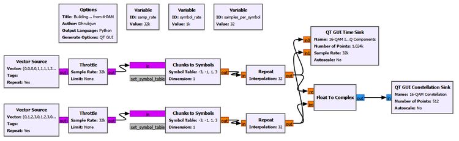

The important settings are:

```text
I Chunks to Symbols
Output Type: Float
Symbol Table: [-3, -1, 1, 3]

Q Chunks to Symbols
Output Type: Float
Symbol Table: [-3, -1, 1, 3]

Float to Complex
Real input: I 4-PAM levels
Imaginary input: Q 4-PAM levels
```

The Time Sink is titled

```text
16-QAM I and Q Components
```

with traces

```text
I Level
Q Level
```

and the Constellation Sink is titled

```text
16-QAM Constellation
```

with trace

```text
16-QAM Symbols
```

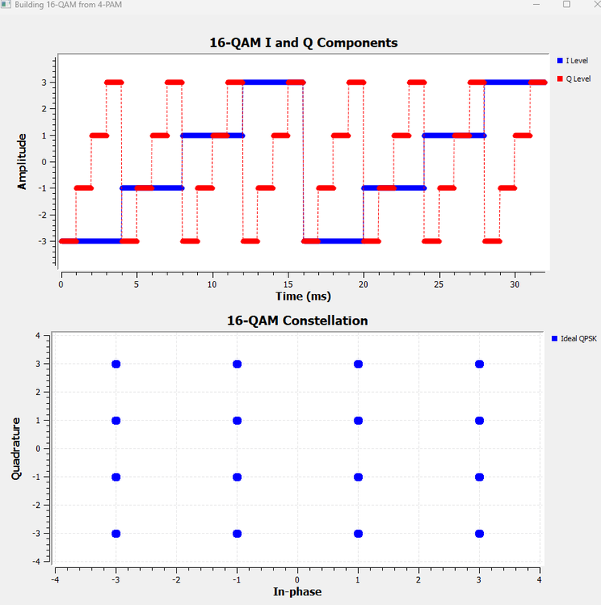

The upper plot shows that both dimensions now use four amplitudes. The lower plot shows every possible pair.

The constellation is therefore not a mysterious predefined pattern. It is simply

$$
4\text{-PAM on I}\times4\text{-PAM on Q}
$$

## Four Bits per Symbol

Sixteen possible symbols require four bits to identify:

$$
k=\log_2(16)=4
$$

One intuitive interpretation is

```text
2 bits choose one of 4 I levels
2 bits choose one of 4 Q levels

              ↓

        4 bits per symbol
```

## Why QAM Is Not Just "Amplitude Without Phase"

The 16-QAM points do not all have the same magnitude.

For example,

$$
|1+j|=\sqrt{2}
$$

while

$$
|3+3j|=3\sqrt{2}
$$

and

$$
|3+j|=\sqrt{10}
$$

Their phases also differ.

So rectangular QAM uses I/Q amplitude combinations that generally produce **both different magnitudes and different phases**.

The name Quadrature Amplitude Modulation refers to controlling the amplitudes of the two quadrature components, I and Q. Once those components are combined, the resulting complex symbol naturally has an overall amplitude and phase.

---

# Experiment 17.8: 16-QAM Decision Regions and Noise

The receiver now has 16 possible symbols to distinguish. Fortunately, Chapter 16 already gave us the solution.

Each axis is simply 4-PAM.

For the levels

$$
-3,\quad-1,\quad+1,\quad+3
$$

the decision thresholds are

$$
-2,\quad0,\quad+2
$$

Apply those thresholds independently to I and Q.

For I:

| Received I | Decided I |
|---|---:|
| $I<-2$ | -3 |
| $-2<I<0$ | -1 |
| $0<I<2$ | +1 |
| $I>2$ | +3 |

The same four regions apply to Q.

Three vertical boundaries and three horizontal boundaries divide the plane into 16 decision regions:

```text
                 I=-2      I=0       I=+2
                   |         |         |
          ●        | ●       | ●       | ●
                   |         |         |
Q=+2  -------------+---------+---------+-------------
          ●        | ●       | ●       | ●
                   |         |         |
Q=0   -------------+---------+---------+-------------
          ●        | ●       | ●       | ●
                   |         |         |
Q=-2  -------------+---------+---------+-------------
          ●        | ●       | ●       | ●
                   |         |         |
```

This gives a very useful receiver interpretation:

> A rectangular 16-QAM hard detector can be understood as one 4-PAM detector operating on I and another 4-PAM detector operating on Q.

## Adding Complex Gaussian Noise

We extend Experiment 17.7 by adding complex Gaussian noise before the Constellation Sink. The ideal points and noisy received samples are displayed together with the six decision boundaries.

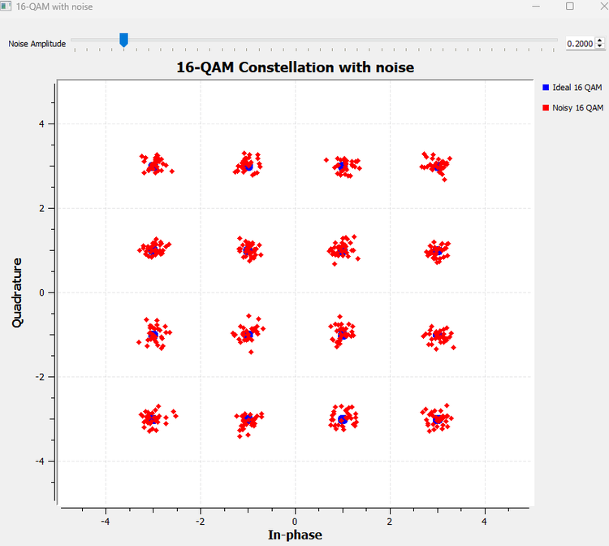

At a noise amplitude of 0.2, the 16 clusters remain compact and clearly separated.

A received point does not have to land exactly on its ideal symbol. It only has to remain in the correct decision region.

For example, suppose the receiver observes

$$
r=2.7+j0.8
$$

The I coordinate lies above $+2$, so the I detector chooses $+3$. The Q coordinate lies between $0$ and $+2$, so the Q detector chooses $+1$.

The detected symbol is therefore

$$
\hat{s}=3+j
$$

Now increase the noise.

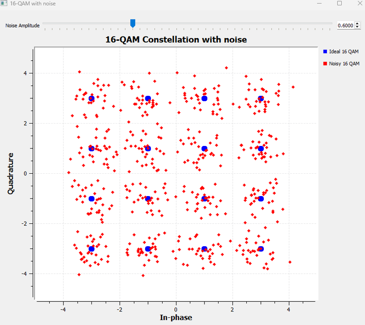

At 0.6, the clouds spread across the decision boundaries.

If $3+j$ was transmitted and the received I value falls from above $+2$ to below $+2$, the I detector may choose $+1$ instead of $+3$. The received symbol has crossed into a neighboring region.

Again, the important question is not "How far did the point move?" but

> Which decision region contains the received point?

The progression from Chapter 16 is now complete:

```text
4-PAM
3 thresholds on one axis

        ↓

16-QAM
3 thresholds on I
+
3 thresholds on Q

        ↓

16 decision regions
```

---

## Why Gray Coding Helps

The 16-QAM noise experiment gives us one more question.

Each point represents four bits, but **which four-bit pattern should be attached to each point?**

The geometry does not decide this for us. Symbol labeling is a design choice.

Start with one 4-PAM axis. A straightforward binary assignment could be

| Amplitude | Binary label |
|---:|:---:|
| -3 | 00 |
| -1 | 01 |
| +1 | 10 |
| +3 | 11 |

The problem appears between the two middle levels:

```text
-1 → +1
01 → 10
```

Two bits change.

If noise causes a nearest-neighbor symbol error across the threshold at zero, that one amplitude decision error could therefore produce two bit errors on the axis.

A Gray-coded ordering instead uses

| Amplitude | Gray label |
|---:|:---:|
| -3 | 00 |
| -1 | 01 |
| +1 | 11 |
| +3 | 10 |

Now every neighboring pair differs by only one bit:

```text
00 → 01 → 11 → 10
```

For rectangular 16-QAM, we can use two Gray-coded bits to select I and another two to select Q.

One valid convention is therefore:

```text
I level:      -3      -1      +1      +3
I bits:       00      01      11      10

Q level:      -3      -1      +1      +3
Q bits:       00      01      11      10
```

If we write the I bits first and Q bits second, one possible labeling of the constellation is

```text
                              Q
                              ↑

Q=+3 → 10      0010      0110      1110      1010
                  ●         ●         ●         ●

Q=+1 → 11      0011      0111      1111      1011
                  ●         ●         ●         ●

Q=-1 → 01      0001      0101      1101      1001
                  ●         ●         ●         ●

Q=-3 → 00      0000      0100      1100      1000
                  ●         ●         ●         ●

I bits:          00        01        11        10
I level:         -3        -1        +1        +3       → I
```

The exact labeling convention can vary between systems. The important idea is the nearest-neighbor property.

Suppose the symbol labeled `1111` is mistaken for its horizontal neighbor `1011`. Only one bit differs.

Gray coding does **not** reduce the physical noise, move the constellation points, or prevent symbol errors. It reduces the number of bit errors that commonly result when a symbol is mistaken for a nearest neighbor.

A sufficiently large disturbance can still jump across multiple boundaries, so Gray coding does not guarantee that every symbol error produces only one bit error.

---

## Constellation Size, Energy, and Normalization

The amplitudes used in this chapter were chosen to make the geometry easy to see.

Our QPSK construction used

$$
I,Q\in\{-1,+1\}
$$

so every symbol has energy proportional to

$$
|s|^2=I^2+Q^2=2
$$

The 16-QAM construction used

$$
I,Q\in\{-3,-1,+1,+3\}
$$

so different symbols have different energies and the average constellation energy is not the same as in our QPSK example.

That is perfectly acceptable for these visualization experiments.

In practical communication-system comparisons, constellations are often normalized to a specified average power or average symbol energy. Otherwise, comparing error performance between two modulation schemes could accidentally compare different transmitted powers as well.

For example, QPSK is often normalized by using coordinates

$$
I,Q\in\left\{-\frac{1}{\sqrt{2}},+\frac{1}{\sqrt{2}}\right\}
$$

so each ideal symbol has unit magnitude.

We do not need normalization to understand the geometry developed in this chapter, but it becomes important when making fair quantitative performance comparisons.

---

## GNU Radio Toolbox

### Float to Complex

**Float to Complex** combines two real-valued streams into one complex stream.

If its real input is $I[n]$ and its imaginary input is $Q[n]$, the output is

$$
x[n]=I[n]+jQ[n]
$$

We used it first with $Q=0$ to place BPSK on the I axis, then with independently varying I and Q streams to construct QPSK and 16-QAM.

This block is especially useful pedagogically because it exposes the two coordinates explicitly rather than hiding them inside a modulation block.

### Complex Gaussian Noise Source

The Noise Source was used with complex output so that noise could disturb both I and Q.

This turns ideal constellation points into clouds and lets us observe decision-boundary crossings directly.

The important settings used in this chapter were:

```text
Output Type: Complex
Noise Type: Gaussian
Amplitude: noise_amp
```

### Multiply Const

**Multiply Const** multiplies every input sample by a fixed or variable constant.

For the QPSK amplitude-scaling experiment we used a positive real constant:

$$
r=As
$$

This changed the size of the constellation without rotating it.

### Complex Signal Source as a Stationary Phasor

A complex Signal Source with zero frequency can act as a constant complex phasor.

With amplitude 1 and phase $\theta$, its output is

$$
e^{j\theta}
$$

Multiplying a constellation by this phasor rotates every symbol by the same angle without changing its magnitude.

The zero-frequency setting is important. A nonzero frequency would make the phasor rotate continuously with time, producing a different impairment associated with frequency offset rather than a fixed phase rotation.

### Higher-Level Constellation and Modulation Tools

GNU Radio also provides higher-level constellation objects and digital modulation facilities that can perform symbol mapping more directly.

We deliberately did not begin with them in this chapter. By manually constructing BPSK, QPSK, and 16-QAM, we can now understand what those convenient tools are packaging for us:

```text
symbol information
      ↓
constellation mapping
      ↓
complex I/Q symbol
```

Higher-level tools save implementation effort. They do not change the underlying meaning of the constellation points we have built here.

---

## Comparing BPSK, QPSK, and 16-QAM

We can now place the three main constellations from this chapter side by side conceptually.

| Modulation | I levels | Q levels | Constellation points | Bits/symbol | Ideal magnitude |
|---|---|---|---:|---:|---|
| BPSK | -1, +1 | 0 | 2 | 1 | Constant |
| QPSK | -1, +1 | -1, +1 | 4 | 2 | Constant |
| 16-QAM | -3, -1, +1, +3 | -3, -1, +1, +3 | 16 | 4 | Multiple values |

The progression is not just a list of modulation names.

BPSK uses two points on one dimension.

QPSK activates the second dimension and creates four equal-magnitude points.

16-QAM increases the number of allowed amplitudes on both dimensions and creates a 4-by-4 grid.

More constellation points allow more bits to be represented by each symbol, but the receiver must distinguish among more possible states. Noise, phase error, gain error, and other channel impairments therefore become increasingly important as we move toward denser constellations.

---

## What We Learned

In this chapter, we moved from the one-dimensional PAM view of Chapter 16 into the two-dimensional I/Q plane.

The main ideas are:

- A complex digital symbol can be written as $s=I+jQ$.
- A constellation point is simply one allowed combination of I and Q.
- BPSK can be represented at complex baseband by the two points $-1+j0$ and $+1+j0$.
- Multiplying a carrier by the BPSK values $+1$ and $-1$ produces carrier phases separated by $180^\circ$.
- A BPSK receiver divides the I/Q plane with the decision boundary $I=0$.
- Complex Gaussian noise moves received symbols in both I and Q, and decision errors become possible when samples cross decision boundaries.
- QPSK is obtained by allowing both I and Q to take the binary values $-1$ and $+1$.
- The simultaneous I and Q values define one complex symbol; they are not two unrelated transmissions.
- Four QPSK points represent two bits per symbol.
- QPSK uses the boundaries $I=0$ and $Q=0$, producing four decision regions.
- Uniform amplitude scaling expands or contracts a constellation, while a fixed phase error rotates it.
- BPSK and QPSK are examples of the broader M-PSK idea, where ideal symbols occupy different phases on a constant-radius circle.
- I/Q and amplitude/phase are two coordinate descriptions of the same complex symbol: $I+jQ=Ae^{j\phi}$.
- QAM is naturally constructed by choosing amplitude levels independently on the I and Q dimensions.
- Rectangular 16-QAM can be built directly from 4-PAM on I and 4-PAM on Q.
- Sixteen constellation points represent four bits per symbol.
- A rectangular 16-QAM hard detector can be understood as two 4-PAM detectors, one operating on I and one on Q.
- Gray coding labels neighboring constellation points so that common nearest-neighbor symbol errors tend to produce fewer bit errors.
- Practical constellations are often normalized when power or error-performance comparisons need to be fair.

Most importantly, I/Q is no longer just an abstract way of writing a complex signal. We have now used the two dimensions to carry digital information directly.

---

## Connecting to the Next Chapter

We now know **where** the digital symbols should be in the I/Q plane.

For BPSK, QPSK, or 16-QAM, we can generate a sequence of complex constellation points and decide which point was most likely received.

But there is still a major practical question.

In our experiments, we often repeated each symbol as a rectangular level so that it was easy to visualize. That creates abrupt transitions when one symbol changes to the next. We even saw those abrupt changes directly in the zoomed BPSK passband waveform.

Can we simply transmit such rectangular symbol waveforms over the air?

What happens to their bandwidth?

Can we shape the transitions without destroying the receiver's ability to distinguish neighboring symbols?

And if we shape the transmitted pulses, what should the receiver do with them?

Those questions lead directly to **Chapter 18: Pulse Shaping and Matched Filtering**.