# Chapter 18: Pulse Shaping and Matched Filtering

## Main Question

**Why can't we simply transmit abrupt rectangular symbols over the air?**

In Chapter 17, we learned where digital symbols live.

For BPSK, the ideal symbols lie at $-1$ and $+1$ on the I axis. For QPSK, the symbols occupy four points in the I/Q plane. For 16-QAM, the constellation expands into a two-dimensional grid.

That gave us the geometry of digital modulation.

But a constellation diagram does not tell us what happens **between** one symbol and the next.

A radio does not transmit isolated dots on an I/Q plane. It transmits a waveform that changes continuously with time.

So the question now becomes:

```text
Chapter 17
Where are the symbols in the I/Q plane?
        |
        v
Chapter 18
How should those symbols evolve with time?
```

The simplest answer seems obvious. If a BPSK symbol is $+1$, hold the waveform at $+1$ for one symbol period. If the next symbol is $-1$, jump immediately to $-1$.

That produces rectangular symbol pulses.

It is simple, easy to generate, and easy to understand.

It also creates a problem.

The abrupt edges of rectangular pulses produce substantial spectral sidelobes. If we smooth those edges, the spectrum improves, but the pulse begins to spread into neighbouring symbol intervals. That creates the possibility of **intersymbol interference**, or ISI.

This chapter develops the solution experimentally.

We will move through the following chain:

```text
Rectangular symbols
        |
        v
Abrupt edges and spectral sidelobes
        |
        v
Smooth the transitions
        |
        v
Pulses spread in time
        |
        v
Intersymbol interference
        |
        v
Nyquist zero-ISI idea
        |
        v
Raised-cosine and root-raised-cosine shaping
        |
        v
Matched filtering
        |
        v
Symbol sampling and eye diagrams
```

By the end of the chapter, pulse shaping will no longer look like an extra filter that communication engineers add by convention. We will see why it is needed, what problem it solves, and what the receiver gains by using a matched filter.

------------------------------------------------------------------------

## 18.1 From Constellation Points to Symbol Waveforms

Suppose a BPSK mapper produces the sequence

$$
a[k]\in\{-1,+1\}.
$$

These are symbol values. They tell us what the transmitted signal should represent at each symbol time.

But they do not yet define the complete continuous waveform.

To create a waveform, each symbol must be associated with a pulse shape. A useful general model is

$$
x(t)=\sum_k a[k]p(t-kT_s),
$$

where $p(t)$ is the pulse shape and $T_s$ is the symbol period.

Do not let the equation hide the simple idea.

Each symbol creates a shifted copy of the same basic pulse. The symbol value scales that pulse, and all the shifted pulses add together.

If $p(t)$ is rectangular, we obtain rectangular symbols. If $p(t)$ is a raised-cosine-family pulse, we obtain a smoother waveform with very different spectral behaviour.

So the choice of pulse shape determines much more than how the waveform looks.

It affects:

- occupied bandwidth,
- spectral sidelobes,
- how far one symbol extends into neighbouring symbol intervals,
- how the receiver should filter the signal,
- and how reliably the receiver can sample the symbols.

We will begin with the simplest possible pulse.

------------------------------------------------------------------------

# Experiment 18.1: Rectangular Symbols and Bandwidth

Our first question is:

> **What is wrong with simply holding each BPSK symbol constant for one symbol period?**

We already used rectangular symbol waveforms while developing digital modulation in earlier chapters, so there is no need to rediscover the basic staircase waveform. Here we focus on the part that matters for pulse shaping: its **spectrum**.

The experiment maps a symbol stream to $-1$ and $+1$, repeats each symbol for a fixed number of samples, and observes the resulting time waveform and spectrum.

A convenient starting point is

| Parameter | Value |
|---|---:|
| Sample rate | `32000` samples/s |
| Samples per symbol | `32` |
| Symbol rate | `1000` symbols/s |
| BPSK levels | `[-1, +1]` |

The relationship between sample rate, symbol rate, and samples per symbol is

$$
sps=\frac{f_s}{R_s}.
$$

Equivalently,

$$
R_s=\frac{f_s}{sps}.
$$

With $f_s=32000$ samples/s and $sps=32$,

$$
R_s=1000\text{ symbols/s}.
$$

The flowgraph is deliberately simple.

```text
Symbol Source
      |
      v
Chunks to Symbols
      |
      v
Repeat by sps
      |
      +-----------------> QT GUI Time Sink
      |
      +-----------------> QT GUI Frequency Sink
```


The Repeat block creates the rectangular pulse shape. Each mapped symbol is held for `sps` output samples before the next symbol appears.

### Why do abrupt edges create spectral sidelobes?

This is the central observation of the experiment.

A rectangular symbol can change from $+1$ to $-1$ almost instantaneously at a symbol boundary. That sharp edge is a very rapid change in time.

A slowly varying waveform can be represented mostly by low-frequency components. A waveform with very rapid changes needs higher-frequency Fourier components as well.

An ideal discontinuity is the extreme case. Reproducing a perfectly vertical edge requires frequency components extending indefinitely.

That is why a rectangular pulse is not spectrally compact.

For a rectangular pulse of duration $T_s$, its Fourier transform has a sinc-shaped form. Ignoring an unimportant time shift,

$$
P(f)=T_s\,\operatorname{sinc}(fT_s),
$$

where we use

$$
\operatorname{sinc}(x)=\frac{\sin(\pi x)}{\pi x}.
$$

The important feature is not merely the main lobe. The sinc function also contains sidelobes that extend far away from the centre frequency and decay relatively slowly.

So the chain of reasoning is

```text
Abrupt edge in time
        |
        v
Very rapid waveform change
        |
        v
High-frequency Fourier components are required
        |
        v
Slowly decaying spectral sidelobes
        |
        v
Poor spectral containment
```

These sidelobes are not an artifact of the GNU Radio FFT display. They are a fundamental consequence of the rectangular pulse shape.

### Changing the symbol rate

We repeated the observation for three symbol rates:

```text
500 symbols/s
1000 symbols/s
2000 symbols/s
```

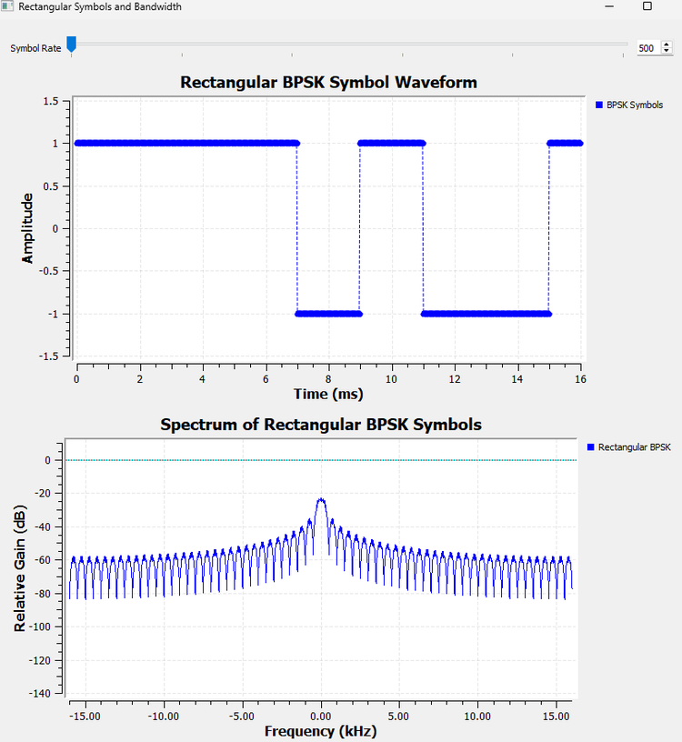

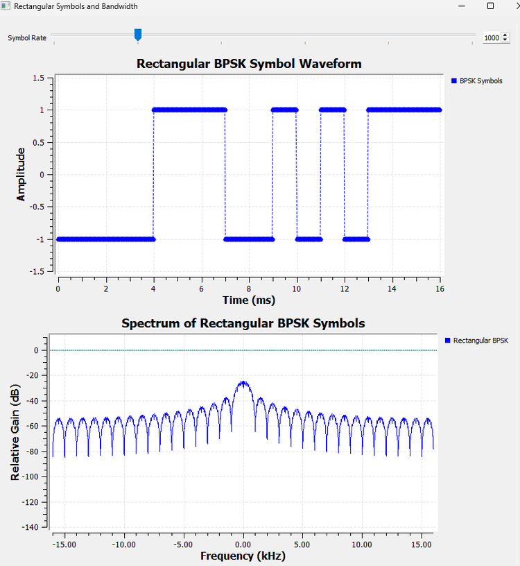

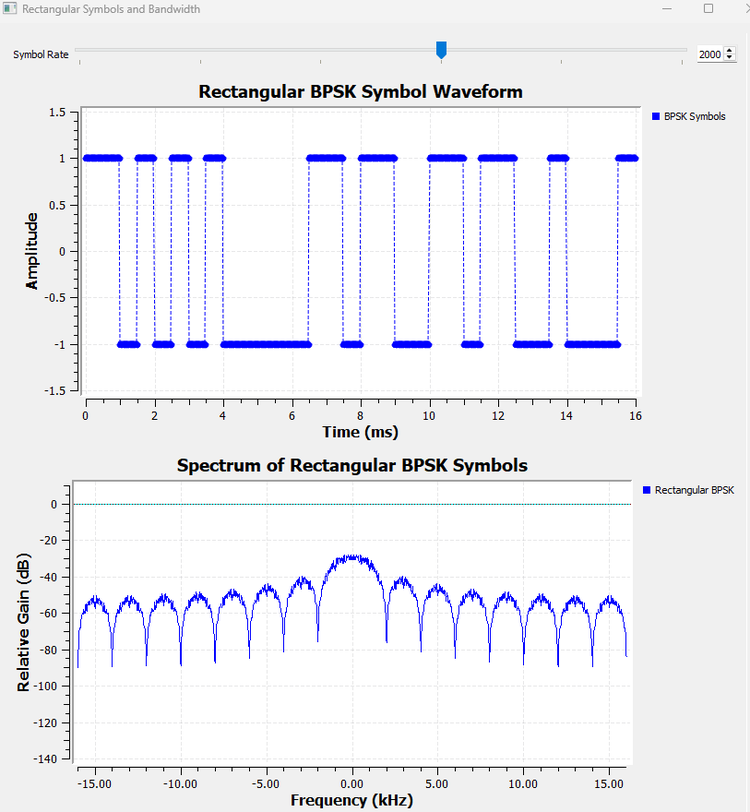

As the symbol rate increases, the waveform changes more rapidly and the spectral structure spreads outward.

This gives us our first practical lesson:

> **Symbol rate and pulse shape both influence the bandwidth of a digital signal.**

The constellation alone cannot tell us this. BPSK still has the same two constellation points in all three cases, but the transmitted waveform occupies different spectral widths.

### Try It Yourself

Before changing the flowgraph, predict what should happen if the symbol duration is doubled.

Will the main spectral structure become wider or narrower?

Then reduce the symbol rate and compare the prediction with the Frequency Sink.

------------------------------------------------------------------------

# Experiment 18.2: Smoothing the Rectangular Waveform

If abrupt edges create unwanted high-frequency content, a natural idea is:

> **Why not simply smooth the edges?**

That is exactly what we try next.

We take the rectangular symbol waveform from Experiment 18.1 and pass it through an ordinary low-pass FIR filter.

```text
Rectangular BPSK
      |
      +---------------------------> Time/Frequency Sinks
      |
      v
Low-Pass FIR Filter
      |
      +---------------------------> Time/Frequency Sinks
```

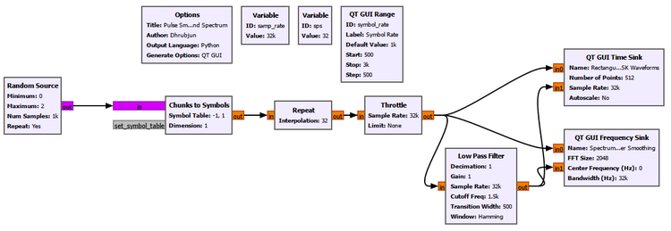

The exact purpose of the low-pass filter here is not to build the final communication system. It is to expose the basic time-frequency tradeoff.

The filter suppresses high-frequency components, so the abrupt transitions become rounded.

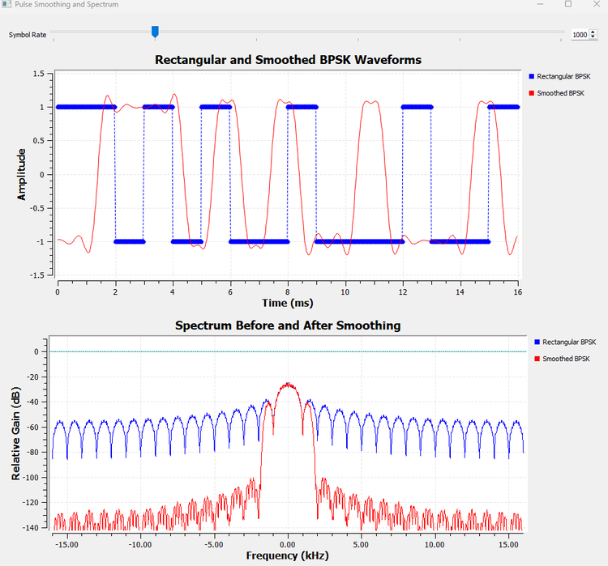

The result is encouraging at first.

In the time domain, the transitions are smoother.

In the frequency domain, the sidelobes are reduced.

That matches our reasoning from Experiment 18.1:

```text
Less abrupt transition
        |
        v
Less high-frequency content
        |
        v
Better spectral containment
```

But the time-domain result contains another clue.

The filter does not simply round each edge while leaving every symbol perfectly confined to its original interval. The waveform begins to respond before and after the centre of each symbol transition.

To understand that effect properly, a long symbol stream is not the best view.

We need to isolate one pulse.

------------------------------------------------------------------------

# Experiment 18.3: What Happens to One Pulse?

Instead of feeding a long sequence of changing symbols into the filter, we now look at one isolated rectangular pulse.

The question is:

> **When a filter smooths one rectangular pulse, where does that pulse go in time?**

The result is much easier to interpret than a long symbol stream.

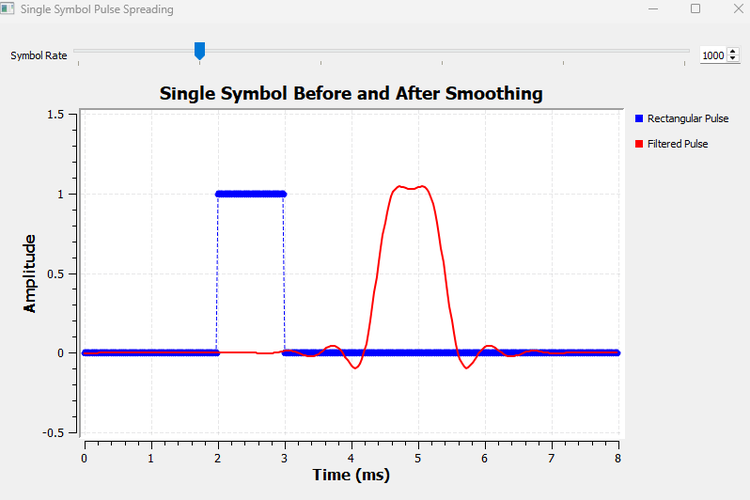

Before filtering, the pulse is confined to a clear interval.

After filtering, the pulse is smoother, but its influence extends beyond the original rectangular interval.

This is the price of smoothing.

A filter that removes high-frequency content cannot preserve an infinitely sharp start and stop. The pulse becomes less compact in time.

That gives us a broader principle:

> **Improving spectral containment generally requires giving up some time localization.**

### Why is the filtered pulse shifted?

The filtered pulse also appears later in time.

That shift is not ISI.

A causal FIR filter needs samples before it can build its full response. For a linear-phase FIR filter with $N$ taps, the group delay is approximately

$$
D=\frac{N-1}{2}
$$

samples.

In seconds,

$$
\tau_g=\frac{N-1}{2f_s}.
$$

So a filtered waveform may be delayed even when the filtering itself is working perfectly.

This distinction will matter throughout the chapter:

> **Filter delay moves the waveform in time. ISI changes how neighbouring symbols influence a decision. They are not the same thing.**

Now we have discovered the real problem with simply smoothing rectangular symbols.

If one pulse spreads beyond its own symbol interval, then in a stream of symbols it can overlap the pulses on either side.

What happens when those neighbours are different?

------------------------------------------------------------------------

# Experiment 18.4: Building ISI Intuition

It is tempting to define intersymbol interference immediately with an equation.

A more useful first question is:

> **Can the waveform associated with one symbol depend on the symbols around it?**

To make that visible, we keep the symbol of interest the same while changing its neighbours.

The ordinary smoothing filter is unchanged. Only the surrounding symbol pattern changes.

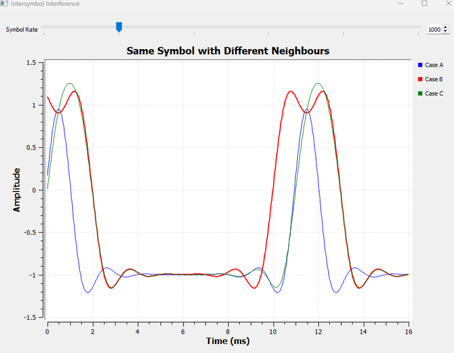

The central symbol has the same intended value in each case, but the filtered waveform around it is not identical.

Why?

Because the filter has spread the neighbouring pulses in time. Their tails reach into the interval occupied by the symbol we are examining.

The received waveform at a particular time is therefore not determined only by the current symbol. It contains contributions from surrounding symbols as well.

That is the intuition behind **intersymbol interference**:

> **ISI occurs when the contribution from one symbol affects the observation used to decide another symbol.**

The word *overlap* is important, but it is not the complete definition.

In fact, the next experiment will show something surprising:

> Pulses can overlap strongly and still produce zero ISI at the correct decision instants.

That is the key idea that makes practical pulse shaping possible.

------------------------------------------------------------------------

## 18.2 The Nyquist Idea We Need Here

We have already used the name **Nyquist** earlier in this book.

In Chapter 3, the question was:

> **How fast must we sample a signal to avoid aliasing?**

That is the Nyquist sampling criterion.

The Nyquist idea we need now answers a different question:

> **How can transmitted pulses be shaped so that neighbouring symbols do not interfere at the correct sampling instants?**

These are different problems.

| Nyquist idea | Question |
|---|---|
| Sampling criterion | How fast must a waveform be sampled to avoid aliasing? |
| Zero-ISI pulse criterion | How should symbol pulses behave at neighbouring decision instants? |

The shared name can be confusing, so keep the two ideas separate.

------------------------------------------------------------------------

# Experiment 18.5: Overlap Without ISI

Suppose the receiver plans to make one decision every symbol period $T_s$.

We would like the pulse associated with the current symbol to have its full value at its own sampling instant, while every shifted neighbouring pulse contributes zero there.

For a normalized pulse $p(t)$, the ideal condition is

$$
p(0)=1
$$

and

$$
p(nT_s)=0,\qquad n=\pm1,\pm2,\pm3,\ldots
$$

This is the heart of the Nyquist zero-ISI idea.

A sinc pulse gives us the cleanest visual demonstration.

The sinc extends far beyond one symbol interval. Shifted sinc pulses therefore overlap heavily.

But their zero crossings occur at integer multiples of the symbol period.

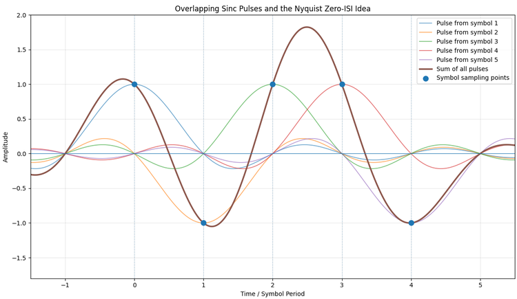

Look carefully at the sampling instants.

At the centre of one pulse, that pulse contributes its symbol value.

At the same instant, all the neighbouring shifted sinc pulses cross zero.

So the pulses may look highly entangled between decisions, yet at the exact decision instants their unwanted contributions disappear.

This is an important correction to our first ISI intuition:

> **Pulse overlap does not automatically mean intersymbol interference. What matters is the total contribution from neighbouring symbols at the decision instant.**

For a symbol sequence $a[k]$, the received pulse-shaped waveform can be written as

$$
x(t)=\sum_k a[k]p(t-kT_s).
$$

At a sampling instant $t=mT_s$,

$$
x(mT_s)=\sum_k a[k]p((m-k)T_s).
$$

If the pulse satisfies the zero-ISI condition, every term with $k\neq m$ vanishes, leaving

$$
x(mT_s)=a[m].
$$

Now the mathematics simply formalizes what the figure already showed.

### How the figure was generated

For this idealized illustration we used a short Python script rather than forcing GNU Radio to draw several mathematically shifted sinc functions.

The complete script is stored with the chapter experiments as:

```text
ch18_exp5_sinc_zero_isi.py
```

Its purpose is visualization. The communication-system experiments before and after it remain in GNU Radio.

### Why not transmit an ideal sinc?

The sinc gives exactly the intuition we want, but it creates a practical problem.

An ideal sinc extends from $-\infty$ to $+\infty$.

A real transmitter cannot implement an infinite-duration pulse or an infinite-length filter.

Truncating it is possible, but the ideal mathematical pulse is not a convenient final implementation.

We therefore want a practical family of pulses that preserves the zero-ISI idea while allowing us to trade some extra bandwidth for better time-domain behaviour.

That leads us to the **raised-cosine family**.

------------------------------------------------------------------------

## 18.3 Raised Cosine and the Roll-Off Factor

A raised-cosine pulse is designed so that its overall response satisfies the Nyquist zero-ISI condition.

Its frequency response does not end with an infinitely sharp rectangular edge. Instead, it contains a smooth transition band.

The parameter controlling that transition is the **roll-off factor**, usually written as $\alpha$.

Its range is

$$
0\leq\alpha\leq1.
$$

For symbol rate $R_s$, the one-sided baseband bandwidth of the raised-cosine response is

$$
B=\frac{R_s}{2}(1+\alpha).
$$

When $\alpha=0$,

$$
B=\frac{R_s}{2}.
$$

This is the minimum Nyquist baseband bandwidth for this idealized case.

When $\alpha$ increases, the transition region becomes wider and the required bandwidth increases.

Why would we ever choose a larger $\alpha$?

Because bandwidth is not the only thing we care about.

A very sharp frequency-domain transition corresponds to a pulse with long oscillatory tails in time. Allowing a wider frequency transition produces a pulse that is better localized in time.

So $\alpha$ controls a useful engineering tradeoff:

```text
Small alpha
    |
    +--> narrower bandwidth
    |
    +--> longer time-domain tails

Large alpha
    |
    +--> wider transition bandwidth
    |
    +--> better time localization
```

Before looking at that tradeoff experimentally, we need one practical detail.

Real communication systems usually do not place the entire raised-cosine response at the transmitter.

They split it between transmitter and receiver.

------------------------------------------------------------------------

## 18.4 Why Root Raised Cosine?

Suppose we used the complete raised-cosine filter at the transmitter.

That could provide the desired overall pulse shape, but it would leave no corresponding half of the filtering operation for the receiver.

A common practical solution is to split the raised-cosine frequency response into two matching parts.

The transmitter uses a **root-raised-cosine**, or RRC, filter.

The receiver uses another RRC filter.

Their cascade produces the overall raised-cosine response.

In magnitude-response terms,

$$
|H_{\mathrm{RRC}}(f)|^2=H_{\mathrm{RC}}(f).
$$

Conceptually,

```text
Symbols
   |
   v
TX RRC
   |
   v
Channel
   |
   v
RX RRC
   |
   v
Overall raised-cosine response
```

The word **root** now has a physical meaning. Each RRC filter contributes one square-root part of the desired raised-cosine frequency response.

A single RRC pulse by itself is therefore not the complete raised-cosine Nyquist pulse.

This becomes visible in the next two experiments.

------------------------------------------------------------------------

# Experiment 18.6: Exploring the RRC Roll-Off Factor

We now generate isolated RRC pulses with different roll-off factors and compare them in both time and frequency.

The main parameters are

| Parameter | Value |
|---|---:|
| Sample rate | `32000` samples/s |
| Symbol rate | `1000` symbols/s |
| Samples per symbol | `32` |
| Filter span | `8` symbols |
| Number of taps | `span*sps + 1 = 257` |
| Roll-off values | `0.10`, `0.25`, `0.50`, `1.00` |

The pulse-shaping filter uses GNU Radio's RRC tap generator:

```python
firdes.root_raised_cosine(
    sps,
    samp_rate,
    symbol_rate,
    alpha,
    ntaps
)
```

The Interpolating FIR Filter uses

```text
Interpolation: sps
```

so the symbol-rate sequence is converted into a waveform containing `sps` samples per symbol while the RRC filter shapes the pulse.

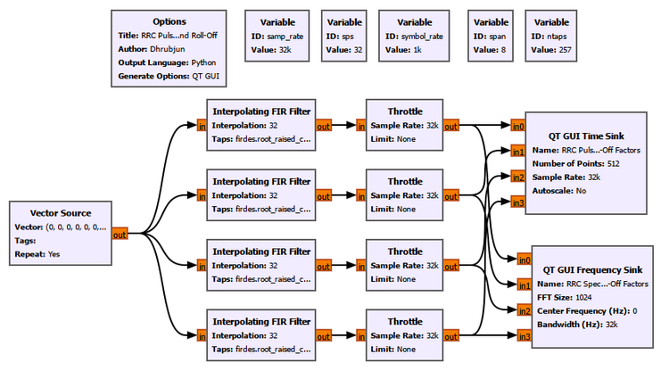

### GNU Radio Toolbox: Interpolating FIR Filter

The **Interpolating FIR Filter** performs filtering while increasing the sample rate by an integer factor.

Here its interpolation factor is `sps`.

Conceptually,

```text
One symbol value
      |
      v
Interpolation by sps
      |
      v
sps-rate pulse samples
      |
      v
RRC-shaped waveform
```

In an efficient polyphase implementation, GNU Radio does not need to construct a large stream of explicit zeros and then filter it as separate conceptual steps. But that zero-insertion picture is still a useful way to understand interpolation.

The important point is that the output sample rate is now the waveform sample rate `samp_rate`, not the symbol rate.

### Time-domain result

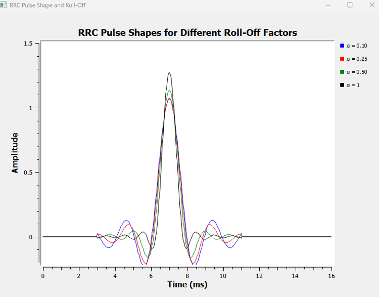

The effect of $\alpha$ is clear.

With a small roll-off such as $\alpha=0.10$, the pulse has longer and more pronounced tails.

As $\alpha$ increases, the pulse becomes more concentrated around its main lobe and the tails decay more quickly.

The peak amplitudes do not need to be identical in this comparison. We are interested in the pulse shape and tail behaviour, not in individually normalizing every curve to hide the gain produced by the chosen finite FIR implementations.

### Frequency-domain result


The frequency-domain result shows the other half of the tradeoff.

A small $\alpha$ gives the narrowest transition region.

A larger $\alpha$ allows the spectrum to roll off over a wider frequency interval.

Putting both observations together:

| Roll-off | Time-domain behaviour | Frequency-domain behaviour |
|---|---|---|
| Small $\alpha$ | Longer tails, more ringing | Narrower transition bandwidth |
| Large $\alpha$ | Faster-decaying tails | Wider transition bandwidth |

This is not a defect of RRC filtering. It is the design tradeoff that $\alpha$ is meant to control.

### Try It Yourself

Choose one roll-off value, then double the filter span while keeping the other parameters unchanged.

Before running the flowgraph, predict what should happen to the finite-length approximation of the pulse tails.

------------------------------------------------------------------------

# Experiment 18.7: TX RRC + RX RRC

Experiment 18.6 showed the response of a single RRC filter.

Now we ask:

> **What happens when the receiver applies the matching RRC filter?**

We use one isolated symbol again because it makes the overall impulse response easy to see.

For this experiment,

```text
samp_rate   = 32000
symbol_rate = 1000
sps         = 32
span        = 8
ntaps       = 257
alpha       = 0.35
```

The transmitter RRC is implemented with an Interpolating FIR Filter.

The receiver uses a Decimating FIR Filter with decimation set to `1`.

```text
Symbol impulse
      |
      v
TX RRC Interpolating FIR
      |
      +-------------------------> Time Sink
      |
      v
RX RRC FIR
      |
      +-------------------------> Time Sink
```

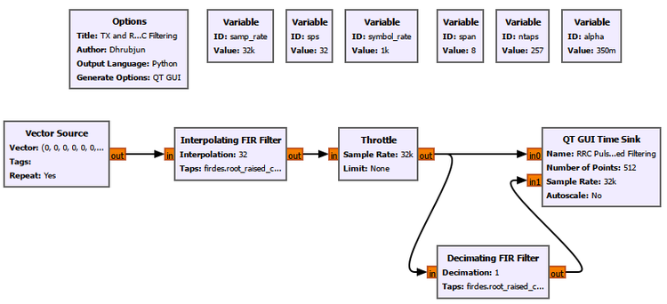

For the receiver taps we use the same RRC shape but with gain `1`:

```python
firdes.root_raised_cosine(
    1,
    samp_rate,
    symbol_rate,
    alpha,
    ntaps
)
```

The decimation factor is

```text
Decimation: 1
```

so we are not reducing the sample rate yet.

### GNU Radio Toolbox: Decimating FIR Filter as a receiver filter

The name **Decimating FIR Filter** can be slightly misleading in this experiment because we set the decimation factor to `1`.

With decimation equal to one, the block behaves as an ordinary FIR filter: every input sample produces an output sample after filtering.

We use this familiar block because it accepts the RRC taps directly and gives us the receive-side FIR response we need.

Later receiver designs may combine filtering and actual decimation, but that is not our goal here.

### What do we observe?

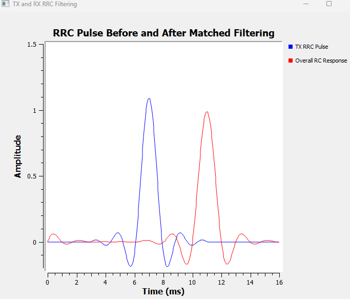

The TX RRC pulse and the output after the second RRC do not have the same shape.

The combined response behaves like a raised-cosine pulse.

More importantly, around the main peak, the combined response approaches zero at symbol-spaced intervals:

$$
\pm T_s,\ \pm2T_s,\ \pm3T_s,\ldots
$$

For our symbol rate,

$$
T_s=\frac{1}{1000}=1\text{ ms}.
$$

This is the practical version of the zero-ISI behaviour we first saw with shifted sinc pulses.

The second response is also shifted farther to the right.

That is expected.

The TX branch has passed through one FIR filter. The RX branch has passed through two. Each filter contributes group delay.

Once again:

> **The horizontal shift is filter delay, not a failure of the zero-ISI property.**

At this point, the receiver RRC has done more than complete the raised-cosine response.

It is also acting as a **matched filter**.

------------------------------------------------------------------------

## 18.5 Why Is the Receiver RRC a Matched Filter?

We first met matched filtering in Chapter 11 while asking how a receiver can detect a known waveform in noise.

The same idea appears again here, but now the known waveform is the transmitted symbol pulse.

In general, if the expected pulse is $p(t)$, the matched-filter impulse response has the form

$$
h_{\mathrm{MF}}(t)=p^*(T-t).
$$

For the real, symmetric RRC pulse used in this chapter, the matching receive filter has the same RRC shape apart from the required alignment and scaling.

The receiver is therefore not applying an arbitrary low-pass filter.

It knows the pulse shape created by the transmitter and filters the received signal with the corresponding matched response.

Why is that useful?

In additive white Gaussian noise, the matched filter maximizes the signal-to-noise ratio at the chosen decision instant.

The phrase **at the decision instant** matters.

A matched filter does not magically erase all noise from the waveform. Noise remains at its output.

What it does is shape the signal and noise so that the known pulse is represented as favourably as possible when the receiver needs to make the symbol decision.

We can now observe that experimentally.

------------------------------------------------------------------------

# Experiment 18.8: Matched Filtering in Noise

We return from the isolated pulse to a stream of BPSK symbols.

The transmitter applies RRC pulse shaping. Gaussian noise is then added between transmitter and receiver. We observe the received waveform before and after the RX RRC matched filter.

```text
BPSK symbols
      |
      v
TX RRC
      |
      v
      + <---- Gaussian noise
      |
      +-------------------------> Before matched filter
      |
      v
RX RRC matched filter
      |
      +-------------------------> After matched filter
```

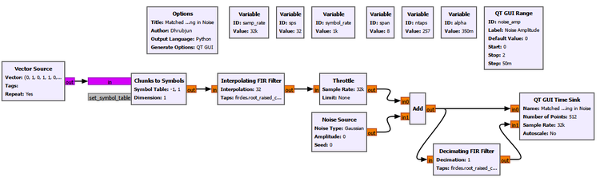

The RRC parameters remain the same as in Experiment 18.7.

A QT GUI Range controls the Gaussian-noise amplitude.

```text
ID: noise_amp
Default: 0
Start: 0
Stop: 2
Step: 0.05
```

During development we examined several values, including `0.2`, `0.5`, and `1.0`.

A noise amplitude of `0.5` gives a particularly useful comparison: the input to the matched filter is visibly noisy, while the structure at the matched-filter output remains easy to recognize.

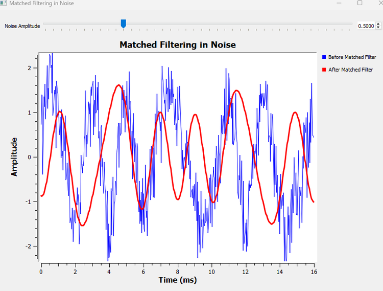

The correct interpretation is not

> The matched filter removed the noise.

It did not.

The receive RRC has filtered both the desired signal and the noise.

The useful conclusion is:

> **Because the receive filter is matched to the transmitted pulse, it improves the conditions for symbol detection and maximizes the output SNR at the correct decision instant in AWGN.**

Looking only at the continuous waveform still leaves one question unanswered.

Where exactly should the receiver sample?

That question is easier to answer with a different visualization.

------------------------------------------------------------------------

# Experiment 18.9: Opening the Eye

An **eye diagram** is one of the most useful visual tools in digital communications.

It is important to understand what it is before looking at the figure.

An eye diagram is **not a new signal**.

It is the same received waveform displayed in a different way.

Imagine taking the matched-filter output and cutting it into short sections, each spanning two symbol periods:

```text
Continuous matched-filter output

----|-------- 2Ts --------|-------- 2Ts --------|-------- 2Ts --------|----

                     cut into windows
                            |
                            v

                    |---- 2Ts ----|
                    |---- 2Ts ----|
                    |---- 2Ts ----|
                    |---- 2Ts ----|

                            |
                            v

                    superimpose them
                            |
                            v

                       eye diagram
```

Different symbol transitions are now drawn on the same time axis.

For BPSK, the overlay includes trajectories such as

```text
+1 -> +1
+1 -> -1
-1 -> +1
-1 -> -1
```

The empty region between those trajectories resembles an eye.

### Generating the data in GNU Radio

The communication signal itself is still generated entirely in GNU Radio.

```text
Random Source
      |
      v
Chunks to Symbols
      |
      v
TX RRC
      |
      v
Gaussian Noise
      |
      v
RX RRC matched filter
      |
      v
File Sink
```

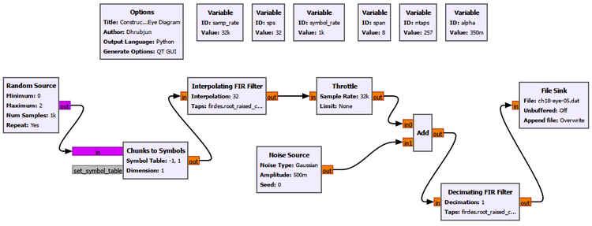

The File Sink records the matched-filter output as Float32 samples.

Two captures are used:

```text
ch18-eye-clean.dat    noise_amp = 0
ch18-eye-05.dat       noise_amp = 0.5
```

### GNU Radio Toolbox: File Sink

The **File Sink** writes a GNU Radio stream directly to a file.

For this experiment:

```text
Input Type: Float
Vector Length: 1
Unbuffered: Off
Append File: Overwrite
```

The output is a raw binary Float32 file, not a text file.

The File Sink does not change the signal. It simply records the stream so that the same samples can be inspected or plotted later.

This is common in SDR work. A GNU Radio flowgraph may perform the signal processing while Python, MATLAB, or another analysis tool is used afterward for specialized visualization.

### Constructing the eye in Python

Python is used here **only for visualization**.

It does not perform the BPSK mapping, RRC pulse shaping, channel noise, or matched filtering. Those operations have already happened in GNU Radio.

With

$$
R_s=1000\text{ symbols/s},
$$

the symbol period is

$$
T_s=1\text{ ms}.
$$

Since

$$
sps=32,
$$

two symbol periods contain

$$
2sps=64\text{ samples}.
$$

The script reads the GNU Radio Float32 samples, discards the initial filter transient, takes successive 64-sample windows beginning one symbol apart, and overlays them.

The complete script is stored as

```text
ch18_exp9_eye_diagram.py
```

A compact version of the essential plotting method is:

```python
import numpy as np
import matplotlib.pyplot as plt

samp_rate = 32000
sps = 32
eye_len = 2 * sps
skip = 20 * sps
n_traces = 120

def plot_eye(input_file, output_file, title):
    samples = np.fromfile(input_file, dtype=np.float32)
    x = samples[skip:]

    windows = []

    for k in range(n_traces):
        start = k * sps
        end = start + eye_len

        if end <= len(x):
            windows.append(x[start:end])

    windows = np.asarray(windows)
    t_ms = np.arange(eye_len) / samp_rate * 1000

    plt.figure(figsize=(10, 6))

    for window in windows:
        plt.plot(t_ms, window, linewidth=0.8, alpha=0.22)

    plt.axvline(1.0, linestyle="--", linewidth=1.2)
    plt.title(title)
    plt.xlabel("Time (ms)")
    plt.ylabel("Amplitude")
    plt.xlim(0, 2)
    plt.ylim(-2, 2)
    plt.grid(True, alpha=0.3)
    plt.tight_layout()
    plt.savefig(output_file, dpi=220, bbox_inches="tight")
    plt.close()

plot_eye(
    "ch18-eye-clean.dat",
    "../../figures/ch18/ch18-exp9-eye-no-noise.png",
    "BPSK Eye Diagram After RRC Matched Filtering"
)

plot_eye(
    "ch18-eye-05.dat",
    "../../figures/ch18/ch18-exp9-eye-noise-05.png",
    "BPSK Eye Diagram with Noise After RRC Matched Filtering"
)
```

The exact relative output path can be adjusted to match the location of the experiment folder, but the signal-processing idea does not change.

### The clean eye

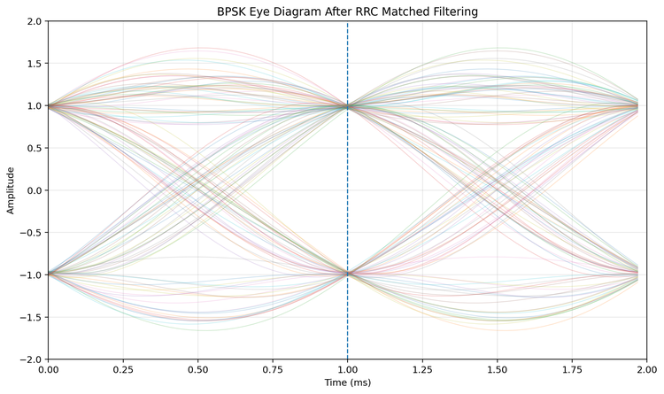

The dashed line at $1$ ms marks the symbol sampling instant in the two-symbol display.

At this time, the trajectories cluster tightly around the two BPSK levels:

$$
+1
$$

and

$$
-1.
$$

This is exactly what we want.

The receiver does not need the waveform to be separated everywhere. It needs a reliable observation at the time when it makes the decision.

For BPSK, the decision threshold lies around zero. A large vertical gap between the upper and lower trajectories around the sampling instant gives a comfortable decision margin.

The eye also tells us something about timing.

If the receiver samples near the centre of the open region, the two symbol levels are well separated.

If it samples too early or too late, closer to the transition region, the separation becomes smaller and the decision becomes more sensitive to timing error, noise, and ISI.

We do not need another experiment to see the principle. The horizontal opening of the eye already shows the available **timing margin**.

### Adding noise

Now we use the second GNU Radio capture with

```text
noise_amp = 0.5
```

and apply exactly the same eye-diagram visualization.

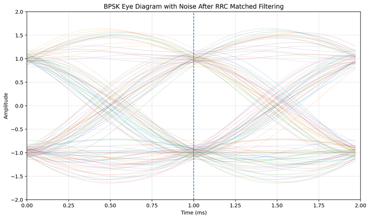

The difference is immediately visible.

The trajectories are thicker and more spread out.

At the correct sampling instant, however, the samples still form two clearly separated groups around $+1$ and $-1$.

This gives us a useful way to read an eye diagram:

- **vertical eye opening** indicates amplitude/noise margin,
- **horizontal eye opening** indicates timing margin,
- **trajectory thickness** reflects noise and other variations,
- **the best sampling region** is where the symbol possibilities are most clearly separated.

As noise increases, the eye becomes less open.

If channel distortion, timing error, severe ISI, or other impairments are added, the eye can close further.

This is why eye diagrams are so common in practical digital communication systems. They compress a large amount of receiver information into one picture.

------------------------------------------------------------------------

## 18.6 Putting the Pieces Together

We began this chapter with an apparently simple question:

> Why not just transmit rectangular symbols?

We can now answer it step by step.

### Rectangular symbols are easy, but spectrally expensive

Holding a symbol constant and changing abruptly at the boundary produces a rectangular pulse.

The abrupt edges require substantial high-frequency Fourier content, giving the signal a sinc-like spectrum with sidelobes extending far beyond the main lobe.

### Smoothing improves the spectrum, but spreads the pulse

An ordinary low-pass filter reduces the abruptness of the transitions and suppresses sidelobes.

But the pulse is no longer confined to one symbol interval.

Its tails extend into neighbouring intervals.

### Pulse spreading creates the possibility of ISI

Once neighbouring pulses overlap, the observation for one symbol may contain contributions from surrounding symbols.

Our same-symbol/different-neighbours experiment made that dependence visible.

### Overlap itself is not the enemy

The sinc experiment changed the way we think about ISI.

Pulses may overlap strongly between sampling instants and still contribute zero at the correct symbol decision times.

That is the Nyquist zero-ISI idea.

### Raised cosine makes the idea practical

An ideal sinc is infinitely long.

Raised-cosine pulse shaping gives us a practical family in which the roll-off factor controls the tradeoff between bandwidth and time-domain localization.

### RRC splits the job between transmitter and receiver

Instead of placing the complete raised-cosine response at one side, practical systems commonly use an RRC filter at the transmitter and a matching RRC filter at the receiver.

Their cascade gives the overall raised-cosine response.

### The receiver filter also performs matched filtering

The receive RRC is matched to the transmitted pulse shape.

In AWGN, this maximizes the SNR at the appropriate decision instant.

The filter does not remove all noise. It improves the conditions under which the receiver makes its decision.

### The eye diagram shows whether the receiver has a good place to sample

Finally, the eye diagram takes the same matched-filtered waveform and overlays many symbol intervals.

A wide-open eye tells us that the receiver has a useful timing region and good separation between possible symbol values.

The entire chapter can therefore be summarized as

```text
Choose constellation points
        |
        v
Choose how symbols evolve in time
        |
        v
Control the transmitted spectrum
        |
        v
Preserve clean decision instants
        |
        v
Match the receiver to the pulse
        |
        v
Sample where the eye is open
```

------------------------------------------------------------------------

## 18.7 A Few Things That Can Go Wrong

We deliberately kept the experiments focused rather than building a separate flowgraph for every possible failure.

But the results let us predict several important problems.

### Sampling at the wrong time

The clean eye is widest near the correct decision instant.

Moving the sampling time toward a transition reduces the vertical separation between the symbol possibilities.

A practical receiver therefore needs **symbol timing synchronization**. Knowing that there are `32` samples per symbol is not enough by itself. The receiver must also determine *which* of those sample positions corresponds to the best decision time.

### Using the wrong pulse-shaping parameters

The transmitter and receiver filters are designed as a pair.

If their pulse shapes or roll-off factors do not correspond properly, the combined response will no longer be the intended raised-cosine response.

The zero-ISI behaviour can degrade.

### Removing the matched filter

Without the receive matched filter, we lose both the intended combined pulse response and the matched-filter SNR advantage at the decision instant.

Experiment 18.8 already showed why this matters in noise.

### Choosing roll-off without considering bandwidth

A small roll-off may look attractive because it saves bandwidth, but it produces longer time-domain tails and places greater demands on the practical filter implementation.

A large roll-off improves time localization but occupies more spectrum.

There is no universally correct $\alpha$. It is a system-design choice.

------------------------------------------------------------------------

## What We Learned

In this chapter, we moved from constellation geometry to the actual time waveform used to carry digital symbols.

The main ideas are:

- A digital constellation specifies possible symbol values, but a **pulse shape** determines how those values evolve with time.
- Rectangular symbols contain abrupt edges.
- Abrupt time-domain transitions require high-frequency Fourier components.
- A rectangular pulse therefore has a sinc-shaped spectrum with substantial, slowly decaying sidelobes.
- Increasing symbol rate broadens the spectral structure.
- Smoothing abrupt transitions improves spectral containment.
- Filtering also spreads a pulse in time.
- FIR filtering introduces **group delay**, which must not be confused with ISI.
- Intersymbol interference occurs when neighbouring symbols affect the observation used to decide the current symbol.
- Pulse overlap does **not** automatically mean ISI.
- The Nyquist zero-ISI criterion requires neighbouring pulses to contribute zero at the correct symbol sampling instants.
- The Nyquist zero-ISI criterion is different from the Nyquist sampling criterion used to avoid aliasing.
- An ideal sinc demonstrates zero-ISI behaviour clearly but is infinitely long and cannot be implemented exactly.
- Raised-cosine pulse shaping provides a practical bandwidth/time-domain tradeoff.
- The roll-off factor $\alpha$ controls the excess bandwidth and the time-domain tail behaviour.
- Root-raised-cosine filtering splits the desired raised-cosine response between transmitter and receiver.
- A TX RRC followed by a matching RX RRC produces the overall raised-cosine response.
- The receiver RRC also acts as a matched filter for the transmitted pulse.
- In AWGN, matched filtering maximizes SNR at the appropriate decision instant.
- A matched filter does not simply remove noise.
- An eye diagram is a visualization of repeated short sections of the same received waveform, not a new signal.
- The vertical eye opening indicates decision/noise margin.
- The horizontal eye opening indicates timing margin.
- The receiver should sample where the eye is most open.

The most important change in perspective is this:

> **A good digital waveform does not need neighbouring pulses to stay separate everywhere. It needs them to combine correctly at the moments when the receiver makes its decisions.**

------------------------------------------------------------------------

## Connecting to the Next Chapter

So far, the path between transmitter and receiver has been deliberately controlled.

We added Gaussian noise when we wanted it, and otherwise assumed that the pulse-shaped waveform arrived without the complicated effects of real radio propagation.

Over the air, that assumption does not hold.

A signal becomes weaker with distance. It may arrive through several reflected paths. Different copies can arrive with different delays and amplitudes. Their combination can strengthen some frequencies and weaken others. Motion can introduce Doppler effects. Oscillators can introduce frequency offsets.

In other words, the receiver rarely sees exactly what the transmitter produced.

That leads to the next question:

> **What actually happens to a signal while it travels through a wireless channel?**

In Chapter 19, we will begin with a clean digital signal and progressively expose it to attenuation, noise, frequency offset, delay, multipath, and fading.

That will take us from pulse shaping at the transmitter and matched filtering at the receiver into the behaviour of the wireless channel itself.
