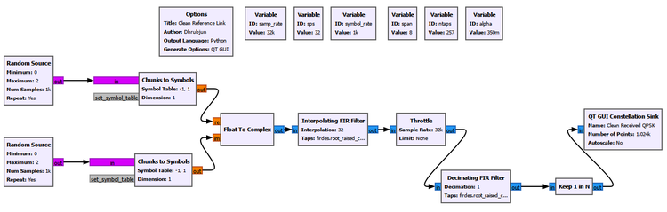
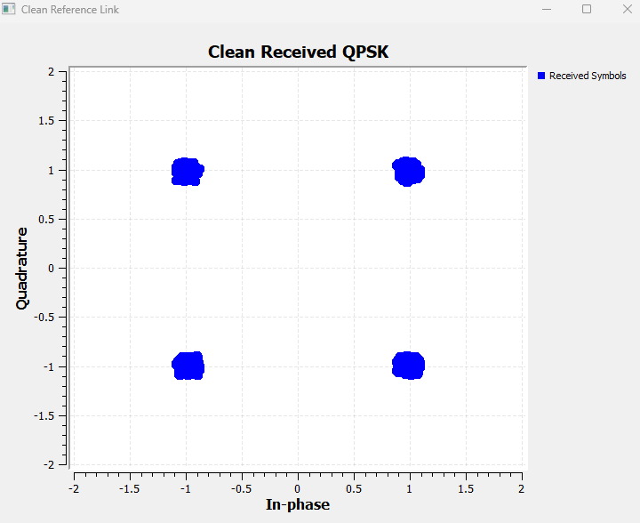
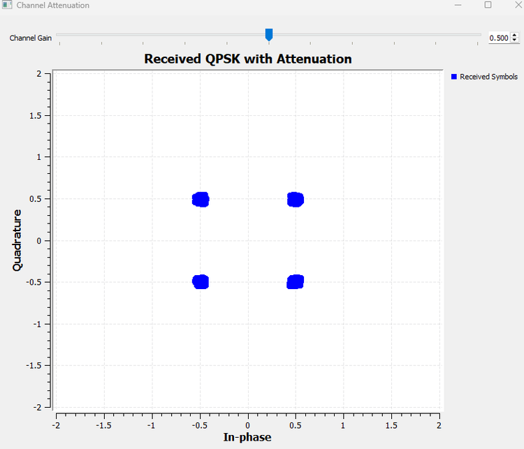
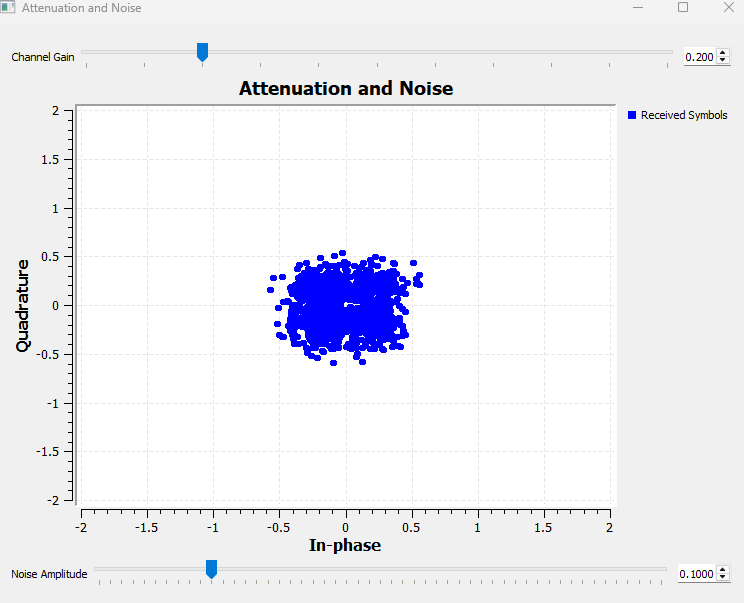
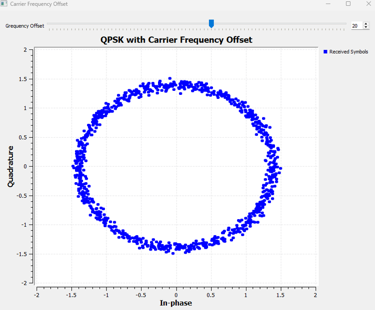
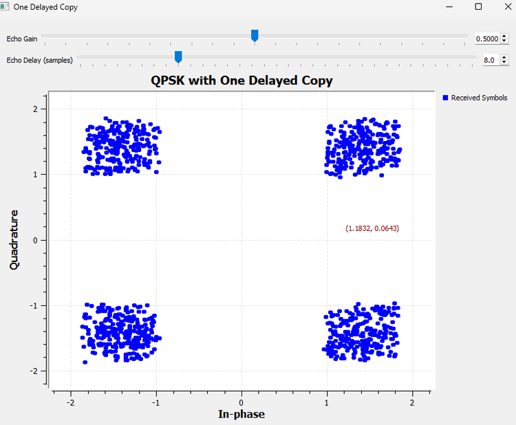
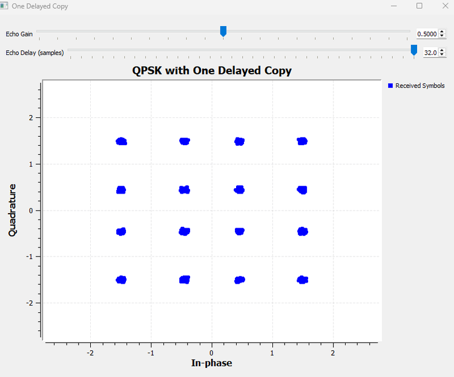
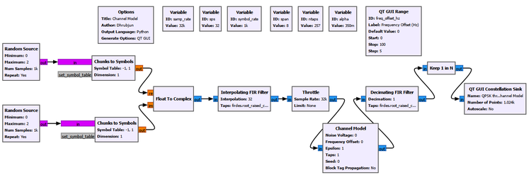
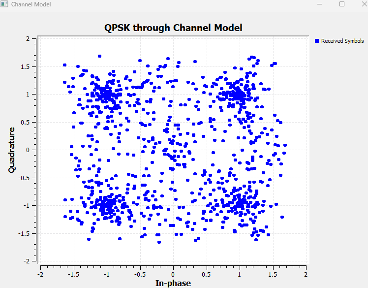

# Chapter 19: The Wireless Channel

## Main Question

**Why does the receiver never see exactly what the transmitter sent?**

Chapter 18 ended with a clean pulse-shaped digital link.

We generated QPSK symbols, shaped them with a root-raised-cosine (RRC) filter, passed them to a matched RRC filter at the receiver, and sampled at the correct symbol instants. Under those ideal conditions, the received constellation formed four compact clusters.

That experiment quietly assumed something very important:

> **The path between the transmitter and receiver did nothing to the signal.**

A real wireless channel is not a transparent wire.

The transmitted electromagnetic wave must propagate through space and through an environment containing distance, obstacles, reflections, noise, and independent transmitter and receiver oscillators. By the time the waveform reaches the receiver, it may be weaker, noisy, frequency shifted, mixed with delayed copies of itself, or sampled with a clock that does not quite agree with the transmitter clock.

The signal chain now becomes

```text
bits
  |
  v
symbols
  |
  v
RRC pulse shaping
  |
  v
WIRELESS CHANNEL
  |
  v
matched RRC filtering
  |
  v
symbol sampling
  |
  v
received constellation
```

This chapter deliberately focuses on the **impairments**, not on correcting them.

We will begin with the clean link from Chapter 18 and then disturb one assumption at a time. For every change, we will ask what it means physically, why it could occur in a real radio link, what it does to the signal, and what problem it creates for the receiver.

------------------------------------------------------------------------

# Experiment 19.1: A Clean Reference Link

Our first experiment asks:

> **What does the receiver see when the channel is ideal?**

We reuse the pulse-shaped QPSK system developed in Chapter 18.

| Parameter | Value |
|---|---:|
| Sample rate | `32000` samples/s |
| Symbol rate | `1000` symbols/s |
| Samples per symbol | `32` |
| RRC span | `8` symbols |
| Number of RRC taps | `257` |
| RRC roll-off factor | `0.35` |
| QPSK I values | `[-1, +1]` |
| QPSK Q values | `[-1, +1]` |



Conceptually,

```text
QPSK symbols
      |
      v
TX RRC
      |
      v
Ideal channel
      |
      v
RX matched RRC
      |
      v
Keep 1 in N
      |
      v
Constellation
```

For an ideal channel,

$$
r(t)=s(t).
$$

The channel does not attenuate, rotate, delay, distort, or add noise to the waveform.



The four clusters remain close to

$$
(\pm1,\pm1).
$$

This is our reference. Every later experiment changes the same link and asks what physical channel effect caused the constellation to change.

------------------------------------------------------------------------

## 19.1 The Simplest Channel Effect: Attenuation

Imagine moving a transmitter farther from a receiver.

The radio wave spreads as it propagates. Buildings, terrain, walls, antenna orientation, absorption, and other propagation effects can further reduce the signal reaching the receiving antenna.

A simple first model is

$$
r(t)=A\,s(t),
$$

where $A$ is a channel amplitude gain. If $0<A<1$, the signal is attenuated.

------------------------------------------------------------------------

# Experiment 19.2: Channel Attenuation

We extend the clean link by scaling the transmitted complex signal before the matched filter.

```text
ID:            channel_gain
Label:         Channel Gain
Default Value: 1.0
```

For the retained result,

```text
Channel Gain: 0.5
```

If the original QPSK points are near $(\pm1,\pm1)$, multiplying the signal by 0.5 should move them toward $(\pm0.5,\pm0.5)$.



That is exactly what happens.

### What does changing the gain mean physically?

This slider is not merely changing the size of dots on the screen. A lower `channel_gain` models a smaller electromagnetic signal reaching the receiver.

If amplitude is multiplied by $A$, signal power scales as

$$
P_r=A^2P_t.
$$

For $A=0.5$,

$$
A^2=0.25.
$$

So halving the amplitude corresponds to one quarter of the signal power.

Yet the four clusters are still distinguishable. That raises a more important question:

> **If attenuation only makes the signal smaller, why is a weak received signal actually a problem?**

The answer appears when the desired signal is no longer alone.

------------------------------------------------------------------------

## 19.2 A Weak Signal Must Compete with Noise

Every practical receiver contains unwanted random contributions from thermal processes, receiver electronics, and the surrounding electromagnetic environment.

A useful model is

$$
r(t)=A\,s(t)+n(t).
$$

If the desired signal becomes weaker while the receiver noise does not fall by the same proportion, the signal becomes harder to distinguish from the noise. This is the physical meaning behind a falling signal-to-noise ratio.

------------------------------------------------------------------------

# Experiment 19.3: Attenuation and Noise

We combine attenuation with Gaussian noise.

The useful controls are

```text
Channel Gain
Noise Amplitude
```

For the retained comparison,

```text
Noise Amplitude: 0.1
```

is held fixed while the channel gain is changed.

At high received signal level, the four noisy clusters remain well separated.


Now reduce the desired signal strength while leaving the noise unchanged.



The physical chain is

```text
Propagation weakens desired signal
              |
              v
Receiver noise remains
              |
              v
SNR falls
              |
              v
Constellation clouds overlap
              |
              v
Symbol decisions become unreliable
```

Attenuation contracts the constellation. Additive noise randomly spreads samples around the ideal locations. They are different physical mechanisms.

### Try It Yourself

Keep the noise amplitude fixed and predict what will happen as `channel_gain` is reduced. Then keep `channel_gain` fixed and increase the noise amplitude.

------------------------------------------------------------------------

## 19.3 When the Transmitter and Receiver Disagree About Frequency

Real radios use independent oscillators. Two oscillators are never mathematically identical.

If their residual carrier-frequency difference is $\Delta f$, the complex-baseband signal can be represented as

$$
r(t)=s(t)e^{j2\pi\Delta f t}.
$$

The phase error is

$$
\phi(t)=2\pi\Delta f t.
$$

A frequency error therefore does not create one fixed phase rotation. The phase error keeps accumulating.

------------------------------------------------------------------------

# Experiment 19.4: Carrier Frequency Offset

We introduce a carrier-frequency mismatch into the clean link.

The retained result uses

```text
Frequency Offset: 20 Hz
```



Instead of four stationary clusters, the accumulated samples trace a ring.

### Why does a frequency offset produce a ring?

At any one instant, QPSK still has four states separated by $90^\circ$. The modulation has not become a continuous ring modulation.

The Constellation Sink displays a history of samples while their common phase keeps rotating:

```text
Four QPSK points
      |
      v
Common phase rotates continuously
      |
      v
Four points sweep around the origin
      |
      v
Constellation history appears ring-like
```

Attenuation changes radius. A carrier-frequency offset continuously changes angle.

Physically, the effect comes from disagreement between transmitter and receiver carrier references. Oscillator tolerance, temperature drift, hardware reference differences, and Doppler can all contribute.

We deliberately do not correct the offset here. Carrier synchronization is a receiver solution, not a channel impairment.

------------------------------------------------------------------------

## 19.4 The Channel Can Deliver More Than One Copy

A radio wave may reach the receiver through several paths. One may be direct, while another reflects from a wall, building, vehicle, or terrain feature.

The reflected path is longer, so its copy arrives later. It is also usually weaker and may have a different phase.

Why is the reflected copy usually weaker? The signal on that path has generally travelled farther, and the reflecting surface does not return all of the incident electromagnetic energy toward the receiver. Some energy may be absorbed, scattered, or reflected in other directions. The antenna therefore receives a smaller contribution from that path, which is what `echo_gain` represents in our experiment. Reducing `echo_gain` means that the reflected path contributes less strongly to the total received signal.

The reflected copy can also arrive with a different phase. Part of this phase difference comes simply from the additional distance travelled: a longer path corresponds to additional propagation time and therefore additional phase accumulation at the carrier frequency. The reflection itself can also introduce a phase change depending on the material, geometry, and electromagnetic properties of the reflecting surface. As a result, a multipath component is generally characterized not only by its **delay**, but also by its **amplitude and phase**. Two arriving copies may therefore reinforce each other when their phases align, partially cancel when they do not, or in some conditions produce a deep reduction in received signal strength.

Our simplest multipath model is

$$
r(t)=s(t)+a\,s(t-\tau),
$$

where $a$ is the echo gain and $\tau$ is its relative delay.

------------------------------------------------------------------------

# Experiment 19.5: One Delayed Copy

Before hiding multipath inside a channel block, we build it explicitly.

```text
                         direct path
                    +--------------------+
                    |                    |
TX RRC ---> Throttle+                    +---> Add ---> RX RRC
                    |                    |
                    +-> Delay -> Gain ---+
                         echo path
```

The controls are

```text
ID:            echo_delay
Label:         Echo Delay (samples)
Default Value: 8
Start:         0
Stop:          32
Step:          1
```

and

```text
ID:            echo_gain
Label:         Echo Gain
Default Value: 0
Start:         0
Stop:          1
Step:          0.05
```

> ### GNU Radio Toolbox: Delay
>
> The **Delay** block shifts a stream by a specified number of samples. Here it represents the additional propagation time of a reflected signal path.
>
> It does not create new information. It creates a later copy of the same complex baseband waveform.

### What does changing the delay mean physically?

If a reflected path is longer by an excess distance $\Delta d$, its relative delay is approximately

$$
\tau=\frac{\Delta d}{c}.
$$

In the discrete-time simulation,

$$
\tau=\frac{D}{f_s},
$$

where $D$ is the delay in samples.

With `sps = 32`,

```text
8 samples  = 0.25 symbol period
16 samples = 0.50 symbol period
32 samples = 1.00 symbol period
```

Increasing `echo_delay` therefore represents a greater excess propagation path relative to the symbol duration.

### A second path does not automatically create ISI

With

```text
Echo Gain:  0.5
Echo Delay: 0 samples
```

we obtain

$$
r(t)=s(t)+0.5s(t)=1.5s(t).
$$

The copies are aligned and add constructively. Multipath can create ISI when relative delays make delayed symbol energy interfere with other symbol decisions.

### Quarter-symbol delayed echo

Now use

```text
Echo Gain:  0.5
Echo Delay: 8 samples
```

so that

$$
\tau=0.25T_s.
$$



The spreading is structured rather than Gaussian because the echo is not random noise. It is a delayed version of our own pulse-shaped data waveform.

This is one way the channel can disturb the zero-ISI behaviour created in Chapter 18.

### One-symbol delayed echo

Now set

```text
Echo Gain:  0.5
Echo Delay: 32 samples
```

At the symbol sampling instants,

$$
r_k=s_k+0.5s_{k-1}.
$$

The current received sample contains the current symbol plus half of the previous symbol. The channel now has memory.



For example, if

$$
s_k=1+j,
$$

then

$$
s_{k-1}\in\{1+j,\;1-j,\;-1+j,\;-1-j\}.
$$

Therefore

$$
0.5s_{k-1}\in\{0.5+j0.5,\;0.5-j0.5,\;-0.5+j0.5,\;-0.5-j0.5\}.
$$

The resulting coordinates are drawn from

$$
I,Q\in\{-1.5,-0.5,+0.5,+1.5\}.
$$

That creates approximately sixteen received locations.

### This is not 16-QAM

The transmitter is still sending QPSK. The sixteen locations arise because each received sample can depend on two QPSK symbols.

This is ISI in a very literal sense: one symbol contributes to the observation used to decide another.

### Connection back to Chapter 18

Proper Nyquist pulse shaping allows pulses to overlap while unwanted neighbouring contributions vanish at the correct decision instants.

Multipath inserts a shifted copy of the waveform. Those carefully arranged zero-crossing relationships no longer necessarily line up.

So the channel can reintroduce ISI even when the transmitter and receiver pulse-shaping filters are correctly designed.

### Try It Yourself

Keep `Echo Gain = 0.5` and predict the result before trying delays of 0, 8, 16, and 32 samples. Then change the echo gain and observe how strongly the delayed path influences the received symbols.

------------------------------------------------------------------------

## 19.5 Multipath and Fading

Our two-path experiment used a positive real echo gain. A real reflected path can also have a phase shift.

Multiple paths may therefore reinforce or cancel one another. If the transmitter, receiver, or environment moves, those path relationships can change, causing the received strength to rise and fall. This is the beginning of the idea of **fading**.

```text
Path loss
    |
    v
overall reduction in received strength

Multipath
    |
    v
several copies with different delays,
amplitudes, and phases

Fading
    |
    v
received strength changes as those
contributions reinforce or cancel
```

We do not develop Rayleigh or Rician fading statistics here. Our purpose is to establish the physical idea behind multipath before moving to receiver compensation.

------------------------------------------------------------------------

# Experiment 19.6: GNU Radio Channel Model

Until now we built impairments separately so that their physical meanings remained visible.

GNU Radio provides a **Channel Model** block that packages several common effects into one simulation component.



> ### GNU Radio Toolbox: Channel Model
>
> The **Channel Model** block combines several common communication-channel impairments.
>
> | Parameter | Physical interpretation |
> |---|---|
> | `Noise Voltage` | additive random noise |
> | `Frequency Offset` | carrier-frequency mismatch |
> | `Epsilon` | relative sample-rate mismatch |
> | `Taps` | channel impulse response / multipath structure |
> | `Seed` | selects the random-noise realization |
>
> The block is most useful after these effects have been understood individually. It is a convenient simulator, not a substitute for the underlying physics.

The neutral settings are

```text
Noise Voltage:     0
Frequency Offset:  0
Epsilon:           1
Taps:              [1.0]
Seed:              0
```

With these values, the clean QPSK link is preserved.

Increasing `Noise Voltage` spreads the constellation, as expected from Experiment 19.3.

The frequency offset is normalized to the sample rate:

$$
f_{\text{norm}}=\frac{\Delta f}{f_s}.
$$

For 20 Hz at 32 kHz,

$$
f_{\text{norm}}=\frac{20}{32000}=0.000625.
$$

We therefore used a physically meaningful GUI control

```text
ID:            freq_offset_hz
Label:         Frequency Offset (Hz)
Default Value: 0
Start:         0
Stop:          100
Step:          5
```

and supplied

```text
freq_offset_hz / samp_rate
```

to the Channel Model.

The `Taps` parameter represents the channel impulse response. Conceptually,

$$
r[n]=\sum_{\ell}h[\ell]s[n-\ell].
$$

Tap delay represents propagation delay, tap magnitude represents path strength, and tap phase represents path phase shift.

Our explicit Delay + Gain + Add construction remains the clearest physical demonstration of a delayed path. The Channel Model packages the general channel-response idea into one block.

`Seed` is different from the other parameters. It is a simulation control that selects a pseudorandom noise realization; it is not another physical propagation impairment.

One parameter remains unexplored: `Epsilon`.

------------------------------------------------------------------------

## 19.6 When the Sampling Clocks Disagree

A digital receiver assumes not only a carrier reference but also a sampling clock.

If the transmitter and receiver sampling clocks run at slightly different rates, the timing error accumulates.

```text
Fixed timing offset

Ideal:       |        |        |        |
Actual:        |        |        |        |

The displacement stays approximately fixed.


Sample-rate mismatch

TX:          |        |        |        |
RX:          |         |         |         |

The relative position gradually changes.
```

Chapter 18 showed why correct symbol-sampling instants matter. A drifting sampling clock eventually moves those instants away from the desired symbol centres.

------------------------------------------------------------------------

# Experiment 19.7: Sample-Rate Mismatch

We reuse the Channel Model with

```text
Noise Voltage:     0
Frequency Offset:  0
Taps:              [1.0]
```

and change `Epsilon`.

The ideal value is

```text
Epsilon: 1.0
```

The retained result uses

```text
Epsilon: 1.001
```

so

$$
\epsilon-1=0.001,
$$

which is a 0.1% mismatch.



The mismatch sounds small, but a rate error accumulates with time. Our fixed `Keep 1 in N` sampler does not contain a timing-recovery algorithm that follows the drift.

Sometimes it samples near the correct symbol centre. At other times it samples during transitions, where neighbouring pulses contribute strongly.

The transmitted QPSK constellation itself has not changed. The receiver is progressively looking at the waveform at the wrong times.

| Impairment | What drifts? | Typical constellation effect |
|---|---|---|
| Carrier-frequency offset | phase | constellation rotates |
| Sample-rate mismatch | sampling position | constellation spreads and distorts |

Larger exploratory values such as `1.01` and `1.1` made the effect even more obvious, but `1.001` is more instructive because it shows why a small persistent mismatch cannot simply be ignored.

Timing recovery is deliberately not added here. It is a receiver correction, not the impairment itself.

### Try It Yourself

Start at `Epsilon = 1.0`. Predict what should happen before changing it to `1.001` and `1.01`. Watch the constellation over time. The key observation is that a small rate error accumulates.

------------------------------------------------------------------------

## 19.7 Reading Channel Impairments from the Constellation

The same QPSK link now has several very different visual signatures.

| Impairment | Physical cause | Main constellation signature |
|---|---|---|
| Attenuation | weaker received propagation path | constellation contracts toward origin |
| Additive noise | unwanted random contributions | random clouds around symbol locations |
| Frequency offset | TX/RX carrier mismatch | continuous constellation rotation |
| Delayed copy | multipath propagation | structured distortion or splitting |
| Sample-rate mismatch | TX/RX sampling-clock mismatch | drifting sampling phase and widespread distortion |

These are useful intuition, not perfect diagnostic rules. A real link can contain several impairments simultaneously.

------------------------------------------------------------------------

## 19.8 Channel Impairment Is Not Receiver Correction

This distinction is central to the chapter.

```text
Channel impairment          Receiver response

attenuation                 gain control
carrier-frequency offset    carrier synchronization
timing drift                timing recovery
multipath-induced ISI       equalization
unknown channel             channel estimation
```

The two sides are related, but they are not the same thing.

This chapter asks what happens to the waveform before correction. Later receiver chapters can ask how to estimate and compensate for those effects.

------------------------------------------------------------------------

## What We Learned

- The wireless channel is not a transparent wire.
- Attenuation scales received amplitude, and power scales with the square of amplitude.
- Attenuation becomes especially important when receiver noise does not decrease with the desired signal.
- Additive Gaussian noise produces random constellation spreading.
- Carrier-frequency mismatch creates phase error that accumulates with time, causing continuous constellation rotation.
- A ring in the Constellation Sink is the time history of rotating QPSK states, not a new ring modulation.
- Multipath means the receiver can observe delayed, scaled, and phase-shifted copies of its own transmitted waveform.
- A second path with zero relative delay does not automatically create ISI.
- Fractional-symbol echoes create structured, data-dependent distortion.
- A one-symbol echo makes the current received sample depend on the previous symbol.
- The sixteen locations in our one-symbol-delay result are not 16-QAM; the transmitter remains QPSK.
- Multipath can disturb the zero-ISI sampling relationships created by pulse shaping and matched filtering.
- Multipath components can reinforce or cancel, leading naturally to fading.
- GNU Radio's Channel Model packages common channel effects after their physical meanings are understood.
- The Channel Model frequency offset is normalized to the sample rate.
- Channel taps represent a discrete-time channel impulse response.
- `Epsilon = 1` represents matched sampling rates; `Epsilon != 1` introduces sample-rate mismatch.
- Sample-rate mismatch differs from fixed timing offset because the timing error accumulates.
- Even a small persistent clock mismatch can make a fixed symbol sampler lose the correct decision instants.
- Channel impairments and receiver corrections should be kept conceptually separate.

Most importantly, every simulation control now has a physical meaning.

A smaller gain represents a weaker received electromagnetic signal. Added noise represents unwanted random receiver contributions. Frequency offset represents disagreement between carrier references. A delayed copy represents another propagation route. Echo delay represents excess path length. Echo gain represents path strength. Epsilon represents sampling clocks that do not run at exactly the same rate.

Once those meanings are clear, the changing constellation is no longer just a GUI effect. It becomes a picture of what the communication link is doing to the waveform.

------------------------------------------------------------------------

## Connecting to the Next Chapter

At the end of Chapter 18, our receiver seemed almost complete. It had pulse shaping, a matched filter, correct sampling, and a clean constellation.

Chapter 19 showed why that receiver was complete only for an ideal channel.

A real receiver may face

```text
rotating phase
drifting symbol timing
multipath-induced ISI
unknown channel gain
noise
```

We deliberately did not repair those problems here.

That leaves the next natural question:

> **How can a receiver recover the correct carrier, timing, and symbol decisions when the channel has disturbed them?**

The channel has now broken several assumptions of our simple receiver. The next stage of the book can begin building the synchronization and compensation mechanisms that make a practical digital receiver work.
