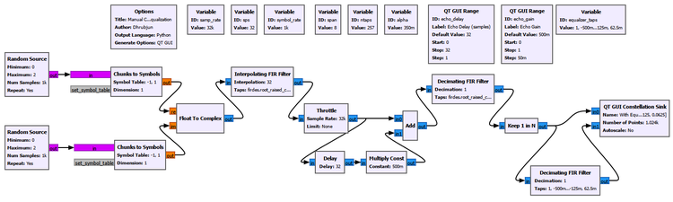
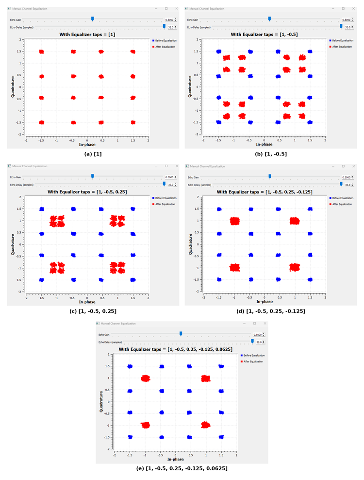
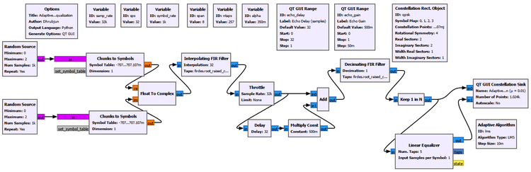
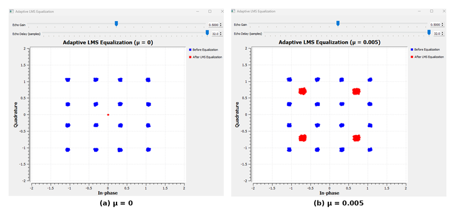
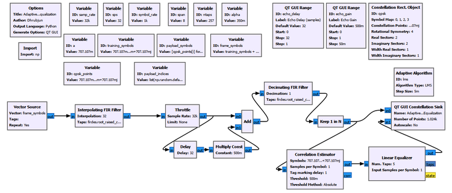
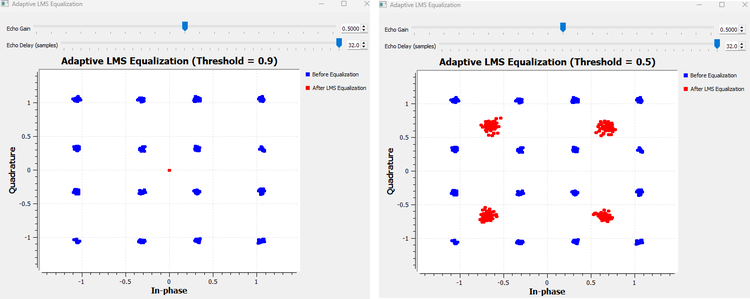
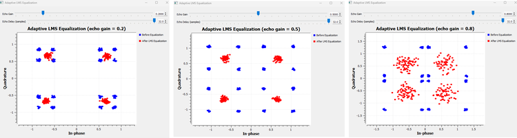
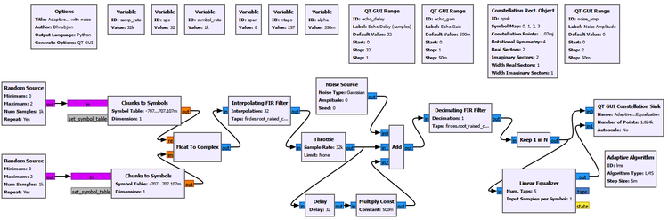
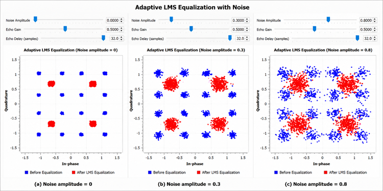

# Chapter 20: Channel Equalization

## Main Question

**If the wireless channel has distorted the received symbols, how can the receiver compensate for that distortion?**

In Chapter 18, we learned how pulse shaping and matched filtering can produce a clean sampled digital link when the timing and channel are ideal.

In Chapter 19, we deliberately broke that ideal link.

We attenuated the signal, added noise, introduced carrier-frequency offset, created delayed multipath copies, and changed the receiver sample-rate relationship. One of the most important observations was that a delayed copy of the transmitted waveform can make the current receiver decision depend on previous symbols.

For the one-symbol echo used in Chapter 19,

$$
r[k]=s[k]+0.5s[k-1].
$$

We already know what this means physically. The current received sample contains the desired current symbol plus part of the previous symbol. That is channel-induced intersymbol interference, or ISI.

So this chapter does **not** begin by teaching ISI again.

The new question is:

> **Now that we can see the channel distortion, what can the receiver do about it?**

The answer is **equalization**.

An equalizer is a receiver filter whose job is to compensate for predictable distortion introduced by the channel. It does not recreate information that has disappeared, and it does not remove every impairment in a radio receiver. Instead, it tries to make the combined effect of the channel and receiver correction closer to the response we actually wanted.

This chapter will build that idea in stages.

We will first assume that the channel is known exactly and construct a correction manually. Then we will remove that unrealistic assumption and let an adaptive equalizer learn its coefficients. After that, we will introduce known training symbols, ask how the receiver finds them, and finally test what happens when multipath becomes stronger and when random noise is added.

The progression is:

```text
Known multipath channel
        |
        v
Manual inverse-filter intuition
        |
        v
Adaptive equalization
        |
        v
Training-assisted adaptation
        |
        v
Stronger multipath and noise
        |
        v
What equalization can and cannot fix
```

------------------------------------------------------------------------

## 20.1 From Channel Memory to Receiver Correction

There is a useful connection back to Chapter 10.

There, an LTI system was described by its impulse response. The output was produced by convolving the input with that impulse response.

In Chapter 19, multipath gave that idea a physical wireless meaning.

A direct path plus one delayed path can be described by a short channel impulse response. At the symbol rate, our simplest example is

$$
h=[1,0.5].
$$

The first coefficient represents the direct path. The second coefficient represents an echo delayed by one symbol and arriving with half the direct-path amplitude.

So the channel performs something like

```text
current symbol -------- x 1.0 -----+
                                   |
previous symbol ------- x 0.5 -----+--> received symbol
```

The receiver now asks a natural question:

> If the channel behaves like a filter, can we place another filter after it that approximately undoes the channel?

That second filter is the equalizer.

Conceptually,

```text
Transmitted symbols
        |
        v
Channel h
        |
        v
Distorted symbols
        |
        v
Equalizer g
        |
        v
Recovered symbols
```

If the channel impulse response is $h$ and the equalizer impulse response is $g$, then the combined response is their convolution:

$$
h*g.
$$

Ideally, we would like the combination to behave like an impulse:

$$
h*g\approx\delta.
$$

Why an impulse?

Because convolution with an impulse leaves the signal unchanged.

This is the basic intuition behind channel inversion and zero-forcing equalization.

------------------------------------------------------------------------

# Experiment 20.1: Manually Undoing a Known Channel

Our first experiment deliberately makes the receiver's job easier than it would be in a real radio.

We create the channel ourselves, so we know exactly what it is.

The main parameters are:

| Parameter | Value |
|---|---:|
| Sample rate | `32000` samples/s |
| Symbol rate | `1000` symbols/s |
| Samples per symbol | `32` |
| RRC span | `8` symbols |
| RRC taps | `257` |
| RRC roll-off factor | `0.35` |
| Echo delay | `32` samples = 1 symbol |
| Echo gain | `0.5` |

The channel is built manually from a direct path and one delayed copy, exactly as in Chapter 19.



After matched filtering and correct symbol-rate sampling, the channel is approximately

$$
r[k]=s[k]+0.5s[k-1].
$$

At the symbol rate, this corresponds to

$$
h=[1,0.5].
$$

### How did the receiver know the channel was `[1, 0.5]`?

It did not discover it.

**We created that channel ourselves.**

The direct path was given gain 1. The delayed path was given gain 0.5 and delayed by exactly one symbol. Therefore, as experiment designers, we know the channel model in advance.

That is an intentionally unrealistic assumption.

A real wireless receiver is not normally handed a message saying:

```text
Your channel is [1, 0.5].
```

It does not initially know how many reflected paths exist, their gains, phases, delays, or whether those values are changing.

For now, however, knowing the channel lets us isolate one question:

> If the channel were known perfectly, what kind of receiver filter would undo it?

### Channel taps are not equalizer taps

This distinction is important.

The channel taps

```text
[1, 0.5]
```

describe the distortion introduced before the receiver.

The equalizer taps

```text
[1, -0.5, 0.25, -0.125, ...]
```

describe the receiver filter trying to compensate for that distortion.

They have different roles.

------------------------------------------------------------------------

## 20.2 Building the Inverse One Tap at a Time

We could immediately write down an inverse filter, but that would hide the most useful intuition.

Instead, let us construct the equalizer progressively.

Start with no useful correction:

$$
g=[1].
$$

Then

$$
[1,0.5]*[1]=[1,0.5].
$$

Nothing has changed. The one-symbol echo remains.

Now try

$$
g=[1,-0.5].
$$

The combined response is

$$
[1,0.5]*[1,-0.5]=[1,0,-0.25].
$$

The original one-symbol contribution has disappeared, but a smaller two-symbol-delayed residual remains.

At the equalizer output,

$$
y[k]=s[k]-0.25s[k-2].
$$

So the equalizer has improved the channel, but it has not made it perfect.

Add another tap:

$$
g=[1,-0.5,0.25].
$$

Now

$$
[1,0.5]*[1,-0.5,0.25]=[1,0,0,0.125].
$$

Therefore,

$$
y[k]=s[k]+0.125s[k-3].
$$

Add one more:

$$
[1,0.5]*[1,-0.5,0.25,-0.125]=[1,0,0,0,-0.0625].
$$

And with five equalizer taps,

$$
[1,0.5]*[1,-0.5,0.25,-0.125,0.0625]=[1,0,0,0,0,0.03125].
$$

The remaining interference has therefore followed the progression

$$
0.5\rightarrow0.25\rightarrow0.125\rightarrow0.0625\rightarrow0.03125.
$$

For this particular channel, every added term halves the magnitude of the remaining contribution and changes its sign.

That pattern is **not universal**. It occurs because the echo coefficient in our channel is exactly 0.5.

The GNU Radio result makes the progression visible.



With only `[1]`, the equalized result sits on top of the unequalized result because no correction is being applied.

With `[1, -0.5]`, the structured constellation moves inward because the strongest one-symbol echo has been cancelled, although a weaker residual remains.

As more taps are added, the residual channel memory becomes smaller and the red constellation progressively contracts toward four QPSK clusters.

The five-tap result does not become a set of mathematically perfect points. That is expected. We have truncated an inverse that, in this example, continues indefinitely.

### Why does the inverse continue forever?

The channel transfer function is

$$
H(z)=1+0.5z^{-1}.
$$

The ideal inverse is

$$
G(z)=\frac{1}{1+0.5z^{-1}}.
$$

Expanding it gives

$$
G(z)=1-0.5z^{-1}+0.25z^{-2}-0.125z^{-3}+0.0625z^{-4}-\cdots.
$$

So the exact inverse is not a five-tap FIR filter. We used a finite approximation.

Five taps were therefore a **design choice**, not a magic number.

A longer equalizer can approximate the inverse more closely, but more taps also mean more computations, more coefficients to determine, and potentially more difficult adaptation later.

### Zero-forcing intuition

This experiment gives us a simple form of zero-forcing intuition.

We are trying to choose an equalizer that forces unwanted channel-memory terms toward zero.

But a practical zero-forcing equalizer has an important limitation. If the channel strongly suppresses some frequency components, trying to invert those deep reductions can require very large equalizer gain in those regions. That can also amplify noise.

We will see the broader limitation of equalization when noise is added later in the chapter.

------------------------------------------------------------------------

> ### GNU Radio Toolbox: Linear Equalization Begins with an FIR Filter
>
> Experiment 20.1 does not yet use GNU Radio's adaptive Linear Equalizer block.
>
> We deliberately use an ordinary **Decimating FIR Filter** with `Decimation = 1` after symbol-rate sampling.
>
> The block itself is familiar from earlier chapters. What is new is its role: its taps are now chosen to compensate for the channel rather than to perform pulse shaping or matched filtering.
>
> This manual construction lets us understand what an equalizer is trying to do before we ask GNU Radio to adapt the coefficients automatically.

------------------------------------------------------------------------

### Try It Yourself

Keep the channel fixed at

```text
Echo Gain:  0.5
Echo Delay: 32 samples
```

and predict what will happen if the equalizer is shortened back to two taps. Then deliberately use one wrong coefficient, such as replacing `-0.5` with `-0.3`.

The purpose is not to find a better-looking graph by trial and error. It is to see that equalization depends on matching the receiver correction to the channel distortion.

------------------------------------------------------------------------

## 20.3 The Real Problem: The Receiver Does Not Know the Correct Taps

Experiment 20.1 succeeded because we already knew the answer.

We created

$$
h=[1,0.5],
$$

and then calculated a useful inverse approximation ourselves.

A practical receiver does not normally have that luxury.

So the next question is more realistic:

> **Can the equalizer adjust its own coefficients automatically?**

This is the purpose of an **adaptive equalizer**.

Instead of choosing the taps once and keeping them fixed, the receiver observes an error and repeatedly changes the taps in a direction that should reduce that error.

A simple conceptual loop is

```text
Received symbols
      |
      v
Equalizer
      |
      v
Output y[k]
      |
      v
Compare with desired/decided symbol d[k]
      |
      v
Error e[k]
      |
      v
Update equalizer taps
      |
      +---------------------> repeat
```

The error is

$$
e[k]=d[k]-y[k].
$$

The important question is where $d[k]$ comes from.

For now, the receiver does not know the transmitted symbol sequence. It does, however, know which constellation points are valid QPSK symbols. That allows **decision-directed adaptation**.

The receiver can look at the equalizer output, decide which valid QPSK point is closest, and use that decision as an approximate reference.

------------------------------------------------------------------------

# Experiment 20.2: Adaptive LMS Equalization

We keep the same one-symbol echo channel but replace the manually designed FIR equalizer with GNU Radio's **Linear Equalizer** controlled by an **LMS Adaptive Algorithm**.

The final experiment uses normalized QPSK symbols.

Let

$$
a=\frac{1}{\sqrt{2}}\approx0.70710678.
$$

The four QPSK points are then

$$
(a,-a),\;(-a,a),\;(-a,-a),\;(a,a).
$$

Equivalently, in complex notation,

$$
\left\{a-ja,\;-a+ja,\;-a-ja,\;a+ja\right\}.
$$

The important settings are:

| Parameter | Value |
|---|---:|
| Echo gain | `0.5` |
| Echo delay | `32` samples |
| Linear Equalizer taps | `5` |
| Input samples per symbol | `1` |
| Adaptive algorithm | LMS |
| Training sequence | none |
| QPSK constellation magnitude | 1 |



------------------------------------------------------------------------

> ### GNU Radio Toolbox: Linear Equalizer
>
> The **Linear Equalizer** is an FIR equalizer whose coefficients can be adapted while the flowgraph runs.
>
> Its input is the received symbol stream. Its output is the equalized symbol stream.
>
> The important settings in this experiment are:
>
> ```text
> Num. Taps:                 5
> Input Samples per Symbol:  1
> Adaptive Algorithm Object: lms
> Training Sequence:         []
> Adapt After Training:      True
> ```
>
> With an empty training sequence, the equalizer operates without an explicit known-symbol training interval.
>
> The **Linear Equalizer is the filter**. It is not itself the learning rule. The learning rule is supplied separately through the Adaptive Algorithm object.

------------------------------------------------------------------------

> ### GNU Radio Toolbox: Adaptive Algorithm (LMS)
>
> The **Adaptive Algorithm** object tells the Linear Equalizer how its coefficients should change.
>
> In this chapter we use **LMS**, the least-mean-squares adaptation rule.
>
> The important idea is not the full derivation. LMS repeatedly uses the current error to make a small change to the equalizer coefficients.
>
> The **Step Size** $\mu$ controls how strongly each error observation changes the taps.
>
> ```text
> μ = 0        -> no adaptation
> small μ      -> cautious, slower adaptation
> larger μ     -> more aggressive, faster adaptation
> ```
>
> An excessively large value can theoretically produce larger residual error or instability, although that behaviour was not observed within the final range used in this experiment.

------------------------------------------------------------------------

## 20.4 What Does the QPSK Constellation Object Actually Do?

The LMS algorithm needs more than a stream of complex samples. In decision-directed operation, it also needs to know what legitimate decisions look like.

GNU Radio's **Constellation Rect. Object** provides that information.

The object used in the experiment contains

```text
Symbol Map:
[0, 1, 2, 3]

Constellation Points:
[ 0.707-0.707j,
 -0.707+0.707j,
 -0.707-0.707j,
  0.707+0.707j ]

Rotational Symmetry: 4
Real Sectors:        2
Imaginary Sectors:   2
```

The most important field is the constellation-point list.

It tells the adaptive algorithm that valid QPSK decisions lie near

$$
(\pm0.707,\pm0.707).
$$

The receiver can therefore do something conceptually like

```text
Equalizer output
      |
      v
Which valid QPSK point is nearest?
      |
      v
Use that decision as d[k]
      |
      v
Compute error
      |
      v
Update taps
```

The constellation object is therefore **not merely a plotting aid**.

It supplies decision information to the adaptive algorithm.

### Why use 0.707 instead of 1?

Both

$$
(\pm1,\pm1)
$$

and

$$
(\pm0.707,\pm0.707)
$$

have the same QPSK geometry and the same four phases.

The difference is normalization.

For the point $1+j$,

$$
|1+j|^2=2.
$$

For the normalized point

$$
\frac{1}{\sqrt{2}}+j\frac{1}{\sqrt{2}},
$$

we obtain

$$
\left|\frac{1}{\sqrt{2}}+j\frac{1}{\sqrt{2}}\right|^2=1.
$$

So GNU Radio's chosen points have unit symbol energy.

For the final adaptive experiments, the transmitter is normalized to the same constellation used by the Adaptive Algorithm. This keeps the transmitted alphabet and the decision reference consistent.

------------------------------------------------------------------------

> ### GNU Radio Toolbox: Constellation Rect. Object
>
> **Constellation Rect. Object** defines a rectangular complex-symbol constellation for GNU Radio digital-processing blocks.
>
> In this experiment it defines the four normalized QPSK decision points used by LMS.
>
> The **Symbol Map** associates symbol indices with constellation entries. The **Constellation Points** define the actual complex values. The sector settings describe how the complex plane is divided for decisions.
>
> A common misunderstanding is to treat this object as a display configuration. Here it is part of the receiver algorithm because it tells the adaptive system what valid QPSK symbols look like.

------------------------------------------------------------------------

## 20.5 What Does the LMS Step Size Mean Physically?

The LMS step size is usually written as

$$
\mu.
$$

It scales the coefficient update.

A simplified LMS update can be written as

$$
w_i[k+1]=w_i[k]+\mu e[k]x^*[k-i].
$$

The exact implementation details are not the main point here. The important physical interpretation is:

> **How much is the equalizer allowed to change its coefficient after observing an error?**

If

$$
\mu=0,
$$

then

$$
w_i[k+1]=w_i[k].
$$

The equalizer cannot learn.

That is exactly what the experiment shows.



With $\mu=0$, the adaptive output remains at the equalizer's initial zero-output state.

With $\mu=0.005$, adaptation is enabled and the received 16-state multipath structure collapses toward the four normalized QPSK points.

We also tested several nonzero step sizes. Within the final tested range, the equalizer converged to essentially the same steady-state QPSK constellation. The main observable difference was **convergence speed**: smaller values adapted more slowly, while larger values converged more quickly.

We should not over-interpret that result. It does not mean arbitrarily large $\mu$ is always safe. Adaptive-filter theory predicts a stability and residual-error trade-off. Our final experiment simply did not reach a value that visibly produced instability.

### A practical GNU Radio note

A QT GUI Range was initially considered for changing $\mu$ while the flowgraph was running. In this GNU Radio setup, the Adaptive Algorithm object's step size did not update reliably through that runtime control.

Therefore, the tested $\mu$ values were changed manually between runs while the rest of the flowgraph remained unchanged.

This is a useful distinction between an algorithm parameter that exists mathematically and whether a particular GNU Radio object exposes that parameter for live reconfiguration.

------------------------------------------------------------------------

## 20.6 Decision-Directed Adaptation Has a Chicken-and-Egg Problem

Experiment 20.2 worked under our controlled conditions, but decision-directed adaptation contains an obvious weakness.

The equalizer is not yet correct when adaptation begins.

Therefore, its initial output may be distorted.

If the receiver makes a wrong QPSK decision, then the reference used to calculate the LMS error is also wrong.

Conceptually,

```text
Equalizer not yet converged
        |
        v
Symbol decision may be wrong
        |
        v
Wrong desired symbol d[k]
        |
        v
Misleading adaptation error
        |
        v
Tap update may move in a poor direction
```

How can a receiver avoid relying entirely on its own uncertain decisions during acquisition?

One common answer is a **training sequence**.

------------------------------------------------------------------------

# Experiment 20.3: Training-Assisted Equalization

A training sequence is a short, predetermined sequence of symbols known to both transmitter and receiver.

The receiver does not know the payload data in advance, but it does know what the training symbols were supposed to be.

During training, the LMS error can therefore use a known desired symbol rather than a guessed one.

The transmitted frame in our experiment is

```text
| 8 known training symbols | 256 payload symbols |
| 8 known training symbols | 256 payload symbols |
| 8 known training symbols | 256 payload symbols |
                 ...
```

The frame repeats because the Vector Source uses `Repeat = Yes`.

This repeated structure is convenient for a controlled experiment. In a real packet system, training may appear at the beginning of every packet, once during acquisition, periodically during a long transmission, or as pilot symbols distributed through the data.

There is no universal rule that training is transmitted exactly once.

### Constructing the frame

Let

$$
a=0.70710678.
$$

The eight-symbol training sequence used in the experiment is

```python
training_symbols = [
    a+1j*a,
    a-1j*a,
    -a+1j*a,
    -a-1j*a,
    a-1j*a,
    -a-1j*a,
    a+1j*a,
    -a+1j*a
]
```

This exact pattern was **chosen**, not derived from the channel.

Its purpose is simply to provide a fixed known QPSK sequence containing all four constellation states.

Real communication standards often use carefully designed preambles or training sequences with good correlation properties. Designing such sequences is a separate subject and is not the goal of this chapter.

The payload is a deterministic pseudo-random 256-symbol QPSK sequence. NumPy is used only to create the repeatable symbol list:

```python
import numpy as np

a = 0.70710678
qpsk_points = [a-1j*a, -a+1j*a, -a-1j*a, a+1j*a]
payload_indices = list(np.random.default_rng(20).integers(0, 4, 256))
payload_symbols = [qpsk_points[i] for i in payload_indices]
frame_symbols = training_symbols + payload_symbols
```

The seed `20` has no communications significance. It simply makes the experiment reproducible.

The receiver is given `training_symbols`, but it is **not** given `payload_symbols` as known data.

The transmitter is implemented with a Complex Vector Source so that the exact frame structure is under our control.



The important receiver chain is

```text
RX matched RRC
      |
      v
Keep 1 in N
      |
      v
Correlation Estimator
      |
      v
Linear Equalizer
      |
      v
Equalized constellation
```

------------------------------------------------------------------------

## 20.7 Why Does the Receiver Need a Correlation Estimator?

Knowing the training pattern is not enough.

The receiver also needs to know **where that pattern begins** in the received stream.

That is a separate receiver problem.

The Correlation Estimator answers:

> Where does this known sequence appear?

The Linear Equalizer then answers:

> Now that I know which received symbols correspond to the known sequence, how should I update my taps?

The two roles are different:

```text
Correlation Estimator
"Where is the known sequence?"
        |
        v
training-start information
        |
        v
Linear Equalizer
"Use these known symbols to adapt."
```

This connects directly back to Chapter 11, where correlation was introduced as a way to find a known waveform inside a received signal.

------------------------------------------------------------------------

> ### GNU Radio Toolbox: Correlation Estimator
>
> **Correlation Estimator** searches the incoming stream for a known complex-symbol sequence.
>
> In this experiment it receives `training_symbols` as the reference sequence.
>
> Important settings are:
>
> ```text
> Symbols:             training_symbols
> Samples per Symbol:  1
> Tag marking delay:   1
> Threshold:           0.5
> Threshold Method:    Absolute
> ```
>
> The block produces correlation-related tags that downstream processing can use. The Linear Equalizer uses the `corr_est` tag to identify the training interval.
>
> The Correlation Estimator does not equalize the channel. It only helps locate the known training sequence.

------------------------------------------------------------------------

## 20.8 The Meaning of the Correlation Threshold

The Correlation Estimator continuously asks how strongly the incoming sequence resembles the known training pattern.

The threshold answers:

> **How strong must that similarity be before the receiver declares that the training sequence has been found?**

A high threshold is conservative. It demands a very strong match.

A low threshold is more permissive.

But both extremes have consequences.

```text
Threshold too high
        |
        v
real training sequence may be missed

Threshold too low
        |
        v
ordinary payload/noise may be falsely declared as training
```

We first tested

```text
Threshold = 0.9
```

with the multipath-distorted training sequence.

The equalizer output remained essentially at the origin because the receiver did not obtain a useful training trigger.

Reducing the threshold to

```text
Threshold = 0.5
```

allowed the training process to begin and the equalizer recovered four QPSK regions.



The conclusion is not that `0.5` is the correct threshold for QPSK.

It is correct only to say that `0.5` worked better for **this training sequence and this channel condition**.

### How is a threshold chosen in a real receiver?

Engineers do not normally choose it by staring at a constellation and moving a slider until the result looks good.

A practical design studies the correlation statistic when the training sequence is absent and when it is present.

The two cases produce different statistical distributions.

The threshold is then chosen according to system requirements such as acceptable false-alarm probability and desired detection probability.

This is the same basic trade-off we met in Chapter 11:

- a lower threshold tends to increase sensitivity but can increase false detections,
- a higher threshold reduces false detections but can increase missed detections.

Our manual sweep is an educational experiment that lets us see what the parameter controls.

------------------------------------------------------------------------

## 20.9 Detection Is Not the Same as Alignment

Even if the correlation detector has found the correct sequence, the downstream equalizer still needs the tag to line up with the correct training-symbol position.

This is the purpose of the **Tag marking delay**.

In our experiment we tested small integer values including 0, 1, 2, and 3.

Values 1 and 2 gave much better equalizer behaviour than 0 or 3, and we retained

```text
Tag marking delay = 1
```

for the final configuration.

The important lesson is not the number 1.

The important lesson is:

> **Detection and alignment are separate requirements.**

A practical tag offset depends on the receiver architecture, filter delays, correlation convention, sample-rate relationship, and block implementation.

A production receiver would determine the intended alignment from the system design and then verify it through simulation and measurement. Our small parameter sweep was used to make the effect visible.

------------------------------------------------------------------------

## 20.10 What Happens After Training Ends?

The Linear Equalizer uses

```text
Adapt After Training: True
```

This setting has an important physical meaning.

During the training interval, the equalizer can compare its output with symbols that are known to be correct.

After training finishes, the payload is no longer known in advance.

The receiver therefore switches to decision-directed adaptation and continues adjusting the equalizer from its own symbol decisions.

Conceptually,

```text
Training interval
      |
      v
Known desired symbols
      |
      v
Reliable initial adaptation
      |
      v
Payload begins
      |
      v
Decision-directed tracking
```

This leads to two useful terms.

**Acquisition** is the process of obtaining a useful initial equalizer state.

**Tracking** is the continued adjustment used to follow changes after acquisition.

This is also why training cannot necessarily be sent once and forgotten forever. If the physical propagation environment changes, previously learned equalizer coefficients may become less appropriate.

------------------------------------------------------------------------

## 20.11 What If the Training Sequence Is Corrupted by Noise?

It will be.

A real training sequence travels through the same physical channel as the payload.

The receiver knows what was transmitted, but it does **not** receive a pristine copy.

For example, the transmitter may send a known symbol

$$
d[k]=0.707+j0.707,
$$

while the receiver observes a distorted and noisy value.

That difference is exactly what makes training useful. The receiver knows what should have arrived and can use the difference to adapt.

Noise still creates a limitation. The equalizer ideally wants to learn the repeatable channel distortion, not the random noise realization. Multiple training symbols provide more observations, helping the adaptive process distinguish systematic behaviour from random variation.

But sufficiently strong noise can make training less reliable, and it can even make detection of the training sequence itself difficult.

Training is therefore useful evidence, not perfect information.

------------------------------------------------------------------------

## 20.12 How Long Should the Training Sequence Be?

We initially used 8 training symbols and 256 payload symbols.

The training overhead is therefore

$$
\frac{8}{8+256}\approx3.0\%.
$$

We also tested 32 training symbols with the same 256-symbol payload.

The overhead then becomes

$$
\frac{32}{32+256}\approx11.1\%.
$$

Longer training gives the equalizer more known-symbol updates during acquisition, but those symbols do not carry new payload information.

So there is a trade-off:

```text
Longer training
      |
      +--> more reliable acquisition opportunity
      |
      +--> greater transmission overhead
```

In our experiment, increasing the training interval from 8 to 32 symbols did **not** produce a dramatic improvement in the observed steady-state constellation.

That is an important result.

Longer training can improve acquisition, but it does not guarantee that the final steady-state constellation will become progressively tighter. With `Adapt After Training = True`, most of the long payload interval is still processed in decision-directed mode.

We therefore retained the shorter 8-symbol training sequence for the final experiment.

------------------------------------------------------------------------

## 20.13 Stronger Echoes Make Equalization Harder

Training improves the quality of the initial reference information, but it does not make the physical channel disappear.

To see this, we keep the equalizer configuration fixed and change only the echo gain.

The one-symbol channel is

$$
r[k]=s[k]+a\,s[k-1],
$$

where $a$ is the echo gain.

We test

$$
a=0.2,\;0.5,\;0.8.
$$



At `echo_gain = 0.2`, the delayed path is weak. The equalizer has an easier task and produces compact QPSK regions.

At `echo_gain = 0.5`, the previous symbol contributes half the direct-path amplitude. The unequalized 16-state structure is clear, but the adaptive equalizer still provides useful compensation.

At `echo_gain = 0.8`, the delayed symbol contributes almost as strongly as the direct path. The equalized constellation still forms four recognizable regions, but the residual spread is much larger.

This is not increased noise. The stronger echo is a stronger delayed copy of the **same transmitted signal**.

The experiment shows that equalization does not make channel severity irrelevant.

------------------------------------------------------------------------

## 20.14 How Are Receiver Parameters Chosen in Practice?

Several parameters in this chapter were changed manually:

- LMS step size,
- equalizer length,
- correlation threshold,
- tag marking delay,
- training length.

A real receiver is not normally operated by an engineer watching a graph and tuning every value by eye.

Instead, practical parameter selection combines several sources of information:

```text
System requirements
        |
        v
Expected channel conditions
        |
        v
Analytical design
        |
        v
Simulation
        |
        v
Lab measurements
        |
        v
Field testing
        |
        v
Refinement or automatic adaptation
```

Some parameters are largely determined by architecture. For example, tag alignment depends on where a detected event should be marked relative to filter and correlator delays.

Other parameters are statistical. A correlation threshold may be selected from false-alarm and missed-detection requirements.

Adaptive-filter parameters such as $\mu$ and equalizer length depend on convergence, tracking, residual error, computational complexity, and the expected amount of channel memory.

The purpose of manually changing these parameters in this book is to make their physical meaning visible before we later encounter receivers that determine or adapt such quantities automatically.

------------------------------------------------------------------------

# Experiment 20.4: Equalization in the Presence of Noise

So far, our equalizer has been compensating for structured multipath distortion.

Now we add something fundamentally different: random Gaussian noise.

The approximate symbol-rate model becomes

$$
r[k]=s[k]+0.5s[k-1]+w[k].
$$

The first unwanted term,

$$
0.5s[k-1],
$$

has predictable structure. It is caused by channel memory.

The second unwanted term,

$$
w[k],
$$

is random.

The equalizer can learn to compensate for the repeatable channel structure. It cannot know the particular random noise sample that was added to every symbol.

The final flowgraph adds a complex Gaussian Noise Source to the same direct-plus-delayed channel used earlier.



The important settings are:

| Parameter | Value |
|---|---:|
| Echo gain | `0.5` |
| Echo delay | `32` samples |
| Linear Equalizer taps | `5` |
| Input samples per symbol | `1` |
| LMS step size | `0.01` |
| Noise amplitudes tested | `0`, `0.3`, `0.8` |

The Noise Source amplitude is a controlled relative amplitude parameter. It is **not** directly an SNR value in dB.

Before running the experiment, we predict:

```text
No noise
    |
    v
structured multipath only
    |
    v
equalizer can learn useful compensation

Moderate noise
    |
    v
multipath is still compensable
but random spread remains

Strong noise
    |
    v
noisy decisions and noisy adaptation
    |
    v
broader recovered clusters
```

The results are shown below.



With `Noise Amplitude = 0`, the blue received constellation shows the familiar structured multipath pattern, and LMS reduces it to four QPSK regions.

At `Noise Amplitude = 0.3`, the blue states remain recognizable but become fuzzy. The equalizer still removes much of the structured channel memory, yet the red QPSK regions remain spread because the random noise cannot simply be inverted.

At `Noise Amplitude = 0.8`, both the unequalized and equalized constellations are much more dispersed. Four red decision regions are still visible, but the receiver is clearly operating under a much more difficult condition.

Noise also affects the adaptation process itself. LMS forms its coefficient updates from noisy observations, and decision-directed operation can become less reliable when noise pushes samples toward the wrong decision region.

The most important conclusion is:

> **Equalization is not a general-purpose signal cleaner. It compensates predictable channel structure. It cannot simply remove independent random noise.**

------------------------------------------------------------------------

### Try It Yourself

Before changing the flowgraph, predict what will happen if the echo gain is reduced to zero while the noise amplitude remains at `0.8`.

Then try the opposite experiment: set noise back to zero and restore the one-symbol echo.

The two cases help separate random noise from deterministic channel memory.

------------------------------------------------------------------------

# 20.15 What Equalization Can and Cannot Fix

By this point, it is useful to separate receiver problems that can look similar on a constellation display.

Equalization is mainly addressing **channel memory and waveform distortion caused by multipath**.

It is not automatically solving every impairment introduced in Chapter 19.

```text
Multipath / channel memory
        |
        v
Equalization

Carrier-frequency offset
        |
        v
Carrier synchronization

Carrier-phase offset
        |
        v
Carrier / phase recovery

Wrong symbol-sampling instant
        |
        v
Timing recovery

Independent random noise
        |
        v
Cannot simply be inverted
```

This distinction is important because practical receivers contain several correction loops and processing stages. Each one exists because it solves a different physical problem.

A receiver can be well equalized and still have a rotating constellation because of carrier-frequency offset.

It can have correct carrier phase but still sample at the wrong instant.

It can have correct timing and equalization but still make errors because the noise is too strong.

So a successful equalizer is one part of receiver recovery, not the entire receiver.

------------------------------------------------------------------------

# 20.16 Equalization Without Explicit Channel Estimation

Experiment 20.1 raises an obvious question:

> How does the receiver know the channel?

There are two broad possibilities.

One approach is to estimate the channel explicitly and then design a correction from that estimate.

Another approach is to adapt the equalizer directly from an error signal without first producing a separate explicit channel estimate.

Experiments 20.2 and 20.3 follow the second route.

LMS does not need us to hand it

```text
h = [1, 0.5]
```

and ask it to calculate the exact inverse. Instead, it changes the equalizer coefficients according to the observed symbol error.

Training symbols improve the quality of that error during acquisition.

This distinction is worth keeping clear:

> **Channel estimation asks what the channel is. Adaptive equalization asks what correction reduces the resulting error.**

The two ideas are related, but they are not identical.

A full treatment of explicit channel estimation can therefore wait until we actually need it.

------------------------------------------------------------------------

# 20.17 Putting the Whole Equalization Story Together

We began with a one-symbol echo that had already been studied in Chapter 19:

$$
r[k]=s[k]+0.5s[k-1].
$$

Instead of asking again why this creates ISI, we asked what the receiver could do about it.

First, we assumed the channel was known exactly.

That let us construct an approximate inverse manually:

```text
Known channel
[1, 0.5]
      |
      v
Choose equalizer taps
[1, -0.5, 0.25, -0.125, ...]
      |
      v
Residual channel memory becomes smaller
```

Then we removed the manually chosen inverse and introduced adaptive equalization.

```text
Received symbols
      |
      v
Linear Equalizer
      |
      v
Decision error
      |
      v
LMS Adaptive Algorithm
      |
      v
Update taps
```

Decision-directed LMS worked because the receiver knew the valid QPSK constellation, even though it did not know the transmitted payload sequence.

That led to the next problem: initial decisions may be unreliable before the equalizer has converged.

Training solves this by providing a known reference during acquisition.

But training introduces another receiver task: the receiver must first find and align the known sequence. That is why the Correlation Estimator, threshold, and training-start tag appeared.

Finally, we increased the echo strength and added noise.

Those experiments showed the limits of the idea. Training helps the equalizer learn, but it does not make a severe channel easy. Equalization can compensate for systematic channel memory, but it cannot predict independent random noise.

The complete learning path is therefore

```text
Channel creates memory
        |
        v
Receiver needs compensation
        |
        v
Known channel -> manual equalizer
        |
        v
Unknown taps -> adaptive equalizer
        |
        v
Unreliable initial decisions -> training
        |
        v
Training must be detected and aligned
        |
        v
Stronger multipath and noise reveal limitations
```

------------------------------------------------------------------------

# 20.18 What We Learned

By developing the receiver experimentally, we discovered several important ideas.

- Equalization is a receiver correction for predictable channel distortion, especially channel memory and ISI caused by multipath.
- Chapter 20 does not need to reteach ISI from the beginning. Chapters 18 and 19 already established what ISI is and how multipath can reintroduce it.
- A simple one-symbol channel can be represented at the symbol rate as $h=[1,0.5]$.
- In Experiment 20.1, the receiver did not discover that channel. We knew it because we created it ourselves.
- Channel taps and equalizer taps describe different systems.
- If the channel is known, an equalizer can be designed so that the combined channel-plus-equalizer response approaches an impulse.
- For our channel, progressive inverse taps reduced the residual contribution from 0.5 to 0.25, 0.125, 0.0625, and 0.03125.
- The exact inverse of the example channel is infinite, so a finite FIR equalizer is an approximation.
- The Linear Equalizer is the filter whose taps are changing. LMS is the adaptive rule that tells those taps how to change.
- LMS uses an error signal rather than requiring us to manually calculate the inverse-channel coefficients.
- The step size $\mu$ controls how strongly the equalizer coefficients change after an observed error.
- With $\mu=0$, the equalizer does not learn.
- Within the final nonzero range tested, different $\mu$ values mainly changed convergence speed rather than the final constellation.
- The Constellation Rect. Object supplies the adaptive algorithm with the valid QPSK decision alphabet. It is not merely a display object.
- Normalized QPSK uses coordinates near $(\pm0.707,\pm0.707)$ so that each symbol has unit energy.
- Decision-directed adaptation knows the modulation alphabet but does not know the actual payload symbol sequence in advance.
- A training sequence gives the equalizer known correct symbols during acquisition.
- Training can be sent once, once per frame, periodically, or in other system-specific patterns. More training also means more overhead.
- The receiver still has to find the training sequence. Correlation performs that detection task.
- The correlation threshold trades missed detections against false detections. The value `0.5` was useful for our experiment but is not universal.
- Detecting a training sequence and aligning the training-start position are different tasks.
- Tag marking delay depends on the receiver architecture and should not be treated as a universal constant.
- Increasing the training length from 8 to 32 symbols did not dramatically improve our steady-state result, illustrating that longer training is not automatically better.
- Increasing the echo gain made the equalizer's task progressively harder because the delayed previous symbol contributed more strongly.
- Gaussian noise is fundamentally different from a deterministic delayed copy. Equalization can learn structured channel distortion but cannot simply invert independent random noise.
- GNU Radio Noise Source amplitude is not itself an SNR value in dB.
- Equalization does not replace carrier recovery, timing recovery, or other receiver synchronization functions.

Most importantly, an equalizer should no longer look like a mysterious block that somehow "cleans" a constellation.

It is a filter attempting to compensate for a physical channel, and its success depends on what the receiver knows, what it can learn, how difficult the channel is, and how much random uncertainty remains.

------------------------------------------------------------------------

# 20.19 Connecting to the Next Chapter

Chapter 19 deliberately separated **channel impairments** from **receiver corrections**.

This chapter solved one of those receiver problems: channel memory caused by multipath.

But one of the most obvious impairments from Chapter 19 is still untouched.

A carrier-frequency offset caused the QPSK constellation to rotate continuously because the transmitter and receiver oscillators did not agree.

An equalizer does not solve that problem.

So the next question is:

> **How can a receiver lock its own oscillator to the carrier reference hidden inside the received signal?**

That leads naturally to **Chapter 21: PLL and Carrier Synchronization**, where we will develop phase error, feedback, phase-locked loops, carrier recovery, acquisition, tracking, and the Costas Loop experimentally.
