# Chapter 21: PLL and Carrier Synchronization

## Main Question

**If the transmitter and receiver do not share exactly the same carrier reference, how can the receiver recover the correct carrier phase and frequency?**

In the previous chapters, we progressively made the communication link more realistic.

We pulse-shaped QPSK, passed it through a non-ideal channel, observed attenuation, noise, carrier-frequency offset, multipath, sample-rate mismatch, and intersymbol interference, and then introduced equalization to compensate for structured channel distortion.

Equalization solves an important receiver problem, but it does not solve every receiver problem.

A receiver may still have the wrong carrier phase. Its oscillator may run at a slightly different frequency from the transmitter. Even after those errors are corrected, the receiver may still be sampling the waveform at the wrong instant.

These are different synchronization problems.

| Receiver problem | Physical effect | Main correction |
|---|---|---|
| Carrier phase offset | Constellation has a fixed rotation | Phase estimation, PLL, Costas Loop |
| Carrier frequency offset | Phase keeps changing with time | CFO estimation, FLL |
| Symbol timing offset | Receiver samples at the wrong instant | Timing recovery in the next chapter |

This chapter concentrates on the first two: **carrier phase synchronization** and **carrier frequency synchronization**.

We will again follow the same rule that has guided the receiver chapters so far:

> **First observe the impairment. Then understand what it means. Only then introduce the receiver correction.**

We will begin with a fixed phase error, discover how a conjugate product measures relative phase, use QPSK symmetry to remove unknown data, and then introduce feedback through the PLL and Costas Loop. After that, we will return to carrier-frequency offset, estimate it in both time and frequency, and finally recover it automatically with GNU Radio's FLL Band-Edge block.

---

# Part I: Carrier Phase Synchronization

## 21.1 A Fixed Carrier Phase Error

Suppose the transmitter and receiver oscillators have the same frequency, but they do not begin with the same phase.

At complex baseband, a fixed carrier phase error rotates every received symbol by the same angle.

If the transmitted symbol is $s$ and the carrier phase error is $\phi$, then the received symbol is

$$
r=s e^{j\phi}
$$

The important word here is **fixed**.

A 30° carrier phase offset does not make the constellation continuously spin. It rotates the complete constellation by 30° and leaves it there.

For QPSK, this means the four constellation points remain four constellation points. Their geometry is preserved, but their orientation is wrong.

That sounds simple, but it creates a serious receiver problem. The receiver's decision regions were designed for the expected constellation orientation. If the constellation rotates far enough, the received symbols can cross those decision boundaries.

---

# Experiment 21.1: Observing Carrier Phase Offset

We begin with a controlled QPSK signal and deliberately rotate it by a known phase.

The experiment is intentionally simple. We are not trying to correct anything yet.

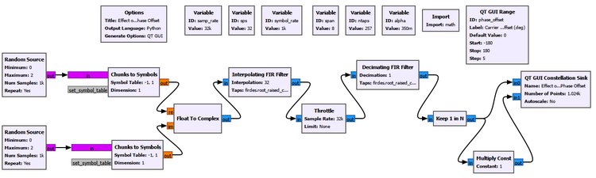

We vary the carrier phase offset while leaving the QPSK symbols themselves unchanged.

The result is shown below.

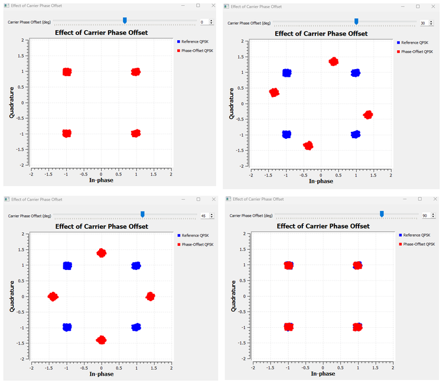

At 0°, the constellation appears at its normal positions around $(\pm1,\pm1)$. As the phase offset increases, the complete constellation rotates around the origin.

### A numerical example

Take the QPSK symbol

$$
s=1+j
$$

Its magnitude is $\sqrt{2}$ and its phase is 45°, so we can write

$$
s=\sqrt{2}e^{j45^\circ}
$$

Now apply a 30° carrier phase offset.

The new phase becomes

$$
45^\circ+30^\circ=75^\circ
$$

Therefore,

$$
r=\sqrt{2}e^{j75^\circ}
$$

Its new I and Q coordinates are approximately

$$
I=\sqrt{2}\cos75^\circ\approx0.366
$$

$$
Q=\sqrt{2}\sin75^\circ\approx1.366
$$

So the point $(1,1)$ moves to approximately $(0.366,1.366)$.

Nothing happened to the information symbol itself. The receiver's carrier reference was simply rotated.

This distinction will become important later when we compare a **phase offset** with a **frequency offset**.

### Try It Yourself

Before changing the flowgraph, predict what a 90° carrier phase offset should do to the point $(1,1)$. Then set the phase offset to 90° and compare the prediction with the Constellation Sink.

---

## 21.2 Measuring Relative Phase

We can see that the constellation is rotated, but a receiver needs more than a picture.

It needs some way to measure the phase difference.

Suppose, for the moment, that the receiver knows what symbol was transmitted. If the transmitted reference is $s$ and the received symbol is

$$
r=s e^{j\phi},
$$

we would like an operation that removes the known symbol phase and leaves only $\phi$.

This is exactly what a **conjugate product** can do.

Multiply the received symbol by the complex conjugate of the known reference:

$$
rs^*=s e^{j\phi}s^*=|s|^2e^{j\phi}
$$

The phase of $s$ disappears.

What remains is a positive magnitude term, $|s|^2$, and the relative phase $\phi$.

Therefore,

$$
\angle(rs^*)=\phi
$$

This is one of the most useful small operations in complex signal processing.

### Why multiply by the conjugate?

For two complex numbers $a$ and $b$, ordinary multiplication adds their phases:

$$
\angle(ab)=\angle a+\angle b
$$

But conjugating $b$ reverses its phase. Therefore,

$$
\angle(ab^*)=\angle a-\angle b
$$

So the conjugate product naturally measures a **phase difference**.

---

# Experiment 21.2: Conjugate-Product Phase Estimation

We now use GNU Radio to compare a phase-rotated QPSK symbol with its known reference.

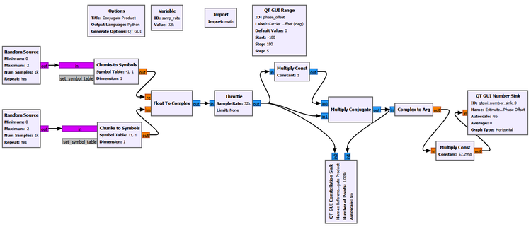

The important processing chain is conceptually

```text
Known reference s ───────────────┐
                                 ↓
Received r = s·exp(jφ) ─→ Multiply Conjugate
                                 ↓
                           Complex to Arg
                                 ↓
                         Phase estimate
```

For our QPSK constellation, the symbols have coordinates $(\pm1,\pm1)$, so

$$
|s|^2=1^2+1^2=2
$$

At a 30° phase offset, the conjugate product should therefore be

$$
rs^*=2e^{j30^\circ}
$$

Its coordinates should be

$$
I=2\cos30^\circ\approx1.732
$$

$$
Q=2\sin30^\circ=1
$$

The experiment produces the expected point and phase estimate.

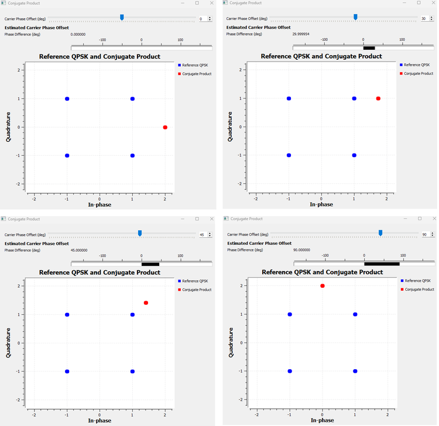

The important lesson is not merely that the Number Sink displays the correct angle.

It is that a complex multiplication has converted a geometric phase difference into something the receiver can measure directly.

### The limitation

There is an obvious problem.

This experiment assumes that the receiver knows the transmitted reference symbol $s$.

That can happen during a known training sequence or preamble, but ordinary payload symbols are not known in advance. If the receiver already knew them, there would be little reason to demodulate them.

So the next question is:

> **Can we remove the unknown QPSK data phase without knowing which QPSK symbol was transmitted?**

---

> ### GNU Radio Toolbox: Multiply Conjugate
>
> **Multiply Conjugate** multiplies one complex input by the complex conjugate of the other.
>
> Its most important phase property is
>
> $$
> \angle(ab^*)=\angle a-\angle b
> $$
>
> This makes it useful whenever the receiver wants a relative phase rather than the sum of two phases.
>
> We will reuse the same idea later to measure the phase advance between adjacent samples and turn that phase advance into a carrier-frequency estimate.

---

> ### GNU Radio Toolbox: Complex to Arg
>
> **Complex to Arg** converts each complex sample into its phase angle.
>
> If
>
> $$
> z=I+jQ,
> $$
>
> the block produces the principal phase of $z$, normally in the interval from $-\pi$ to $+\pi$.
>
> That principal-value wrapping becomes important in the next experiment.

---

## 21.3 Using QPSK Symmetry Instead of a Known Symbol

QPSK has four possible symbol phases separated by 90°.

For the constellation used in this book, the phases are

$$
45^\circ,\;135^\circ,\;225^\circ,\;315^\circ
$$

Now imagine multiplying every phase by four.

| QPSK phase | After multiplying by 4 | Equivalent phase |
|---:|---:|---:|
| 45° | 180° | 180° |
| 135° | 540° | 180° |
| 225° | 900° | 180° |
| 315° | 1260° | 180° |

All four possible data phases collapse to the same direction.

In complex notation, raising the QPSK symbol to the fourth power performs exactly that phase multiplication.

For example,

$$
(1+j)^4=-4
$$

The same result occurs for all four QPSK symbols in our mapping.

This gives us a powerful idea:

> **The fourth power can remove the unknown QPSK data phase because QPSK has fourfold rotational symmetry.**

If the received symbol contains an additional carrier phase error $\phi$,

$$
r=s e^{j\phi},
$$

then

$$
r^4=s^4e^{j4\phi}=-4e^{j4\phi}
$$

The data dependence has disappeared. The carrier phase remains, multiplied by four.

There is also a useful magnitude observation. Since

$$
|s|=\sqrt{2},
$$

we get

$$
|s^4|=(\sqrt{2})^4=4
$$

That is why the fourth-power result appears at radius 4 rather than radius $\sqrt{2}$.

---

# Experiment 21.3: M-th Power Phase Recovery

For QPSK, $M=4$, so we raise the received signal to the fourth power.

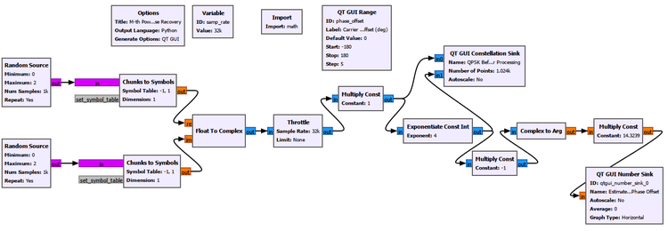

The fourth-power QPSK symbols naturally collapse toward $-4$, which has a phase of 180°. We remove that known orientation before extracting the phase, then divide the remaining phase by four.

Conceptually,

```text
QPSK with carrier phase offset
            ↓
        Fourth power
            ↓
  QPSK data phase disappears
            ↓
       Multiply by -1
            ↓
       Complex to Arg
            ↓
        Divide by 4
            ↓
  Estimated carrier phase
```

The phase estimate can be written as

$$
\hat{\phi}=\frac{1}{4}\angle(-r^4)
$$

The order of operations matters. We rotate the complex phasor first and then ask for its principal phase. Subtracting 180° after a wrapped phase measurement is not always equivalent because `Complex to Arg` has already forced the angle into its principal interval.

The experimental comparison is shown below.

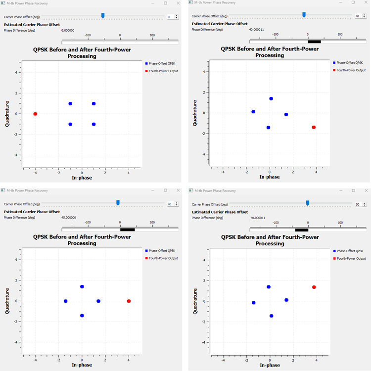

The method works well while the multiplied phase remains inside the unambiguous principal-angle region.

| Applied carrier phase | M-th power result | Interpretation |
|---:|---:|---|
| 0° | ≈ 0° | Correct |
| 40° | ≈ 40° | Correct |
| 45° | Boundary | Ambiguous boundary |
| 50° | ≈ -40° | Wrapped equivalent |

The 50° case is especially useful.

Multiplying by four gives

$$
4(50^\circ)=200^\circ
$$

But a principal phase representation wraps 200° to -160°:

$$
200^\circ\equiv-160^\circ
$$

Dividing by four gives

$$
-160^\circ/4=-40^\circ
$$

That is exactly what the experiment shows.

### The price of removing the data

The M-th power method solved one problem and revealed another.

QPSK repeats after a 90° rotation. Therefore the carrier phase can only be recovered modulo 90° by this symmetry-based operation.

The same fourfold symmetry that removes the QPSK data also creates the ambiguity.

This is not a GNU Radio limitation. It comes from the modulation itself.

Practical systems may resolve such ambiguity using known preambles, pilots, differential encoding, or other higher-level information.

---

> ### GNU Radio Toolbox: Exponentiate Const Int
>
> **Exponentiate Const Int** raises each input sample to a fixed integer power.
>
> In this chapter we use an exponent of `4` because QPSK has fourfold rotational symmetry.
>
> The block is not a general-purpose magic carrier-recovery block. Its usefulness here comes directly from the structure of QPSK.

---

## 21.4 Why a One-Time Estimate Is Not Always Enough

The previous experiments were feedforward measurements.

We observed a signal, calculated an estimate, and obtained a phase value.

But a real receiver oscillator does not necessarily remain perfectly fixed. Temperature, oscillator instability, motion, Doppler, and residual frequency mismatch can make the phase error change with time.

A receiver therefore often needs a mechanism that repeatedly asks:

```text
Am I ahead or behind in phase?
            ↓
How should I correct my local oscillator?
            ↓
Measure again
            ↓
Correct again
            ↓
Repeat continuously
```

That is the basic idea behind a **phase-locked loop**, or PLL.

---

## 21.5 PLL Intuition: Measure, Correct, Repeat

A PLL is a feedback system.

At a conceptual level, it contains three ideas:

```text
Received carrier
      ↓
Phase detector
      ↓
Phase error
      ↓
Loop filter
      ↓
Local oscillator / NCO
      └──────────────↺
```

The phase detector asks whether the local reference is ahead or behind the received carrier. The loop filter controls how strongly the receiver reacts. The local oscillator or numerically controlled oscillator changes its phase or frequency in response.

This repeated correction creates several useful terms.

**Acquisition** is the process of moving from an initially incorrect state toward lock.

**Lock** means the loop has converged closely enough that the local reference follows the received carrier.

**Tracking** is what happens after lock: the loop follows smaller ongoing changes rather than starting from a large initial error.

We will first study the PLL with a clean complex carrier rather than QPSK. That removes the modulation from the problem and lets us see the feedback behavior itself.

---

# Experiment 21.4: PLL Acquisition and Lock

For the controlled carrier experiment, we use

| Parameter | Value |
|---|---:|
| Sample rate | `32000` samples/s |
| Carrier frequency | `1000` Hz |
| Initial carrier phase offset | `60°` |
| Minimum PLL frequency | `800` Hz equivalent |
| Maximum PLL frequency | `1200` Hz equivalent |

The choice of a 1 kHz carrier at 32 ksample/s is convenient because one carrier cycle occupies

$$
32000/1000=32
$$

samples.

Therefore the carrier phase advances by

$$
360^\circ/32=11.25^\circ
$$

per sample.

In normalized angular frequency,

$$
\omega_0=2\pi\frac{1000}{32000}\approx0.19635\text{ rad/sample}
$$

The PLL frequency limits were chosen to place the actual 1 kHz carrier comfortably inside the allowed range:

$$
\omega_{\min}=2\pi\frac{800}{32000}\approx0.15708\text{ rad/sample}
$$

$$
\omega_{\max}=2\pi\frac{1200}{32000}\approx0.23562\text{ rad/sample}
$$

These are experimental choices, not universal PLL settings.

### Observing the locked carrier

For the locked-state display we use GNU Radio's **PLL Carrier Regeneration** block because we want to observe the regenerated local carrier itself.

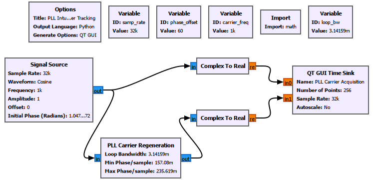

After acquisition, the regenerated carrier follows the input carrier closely.

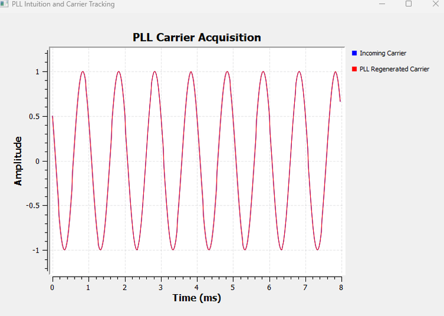

The steady-state picture is useful, but it hides the most interesting part of a feedback loop: how it got there.

### Capturing acquisition

To observe startup, we use a second version of the flowgraph and measure the relative phase between the received carrier and the regenerated PLL carrier with the same conjugate-product idea introduced earlier.

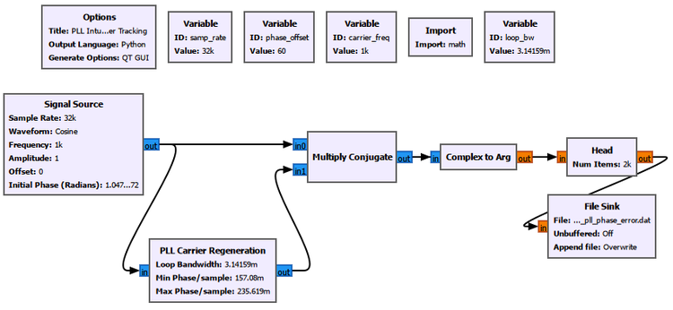

The phase-error measurement is

$$
e_\phi[n]=\angle\{x[n]y_{\text{PLL}}^*[n]\}
$$

The processing chain is

```text
Received carrier ───────────────┐
                                ↓
PLL regenerated carrier ─→ Multiply Conjugate
                                ↓
                          Complex to Arg
                                ↓
                              Head
                                ↓
                           File Sink
```

We capture 2000 samples.

At 32 ksample/s, that corresponds to

$$
2000/32000=0.0625\text{ s}=62.5\text{ ms}
$$

The measured acquisition transient is shown below.

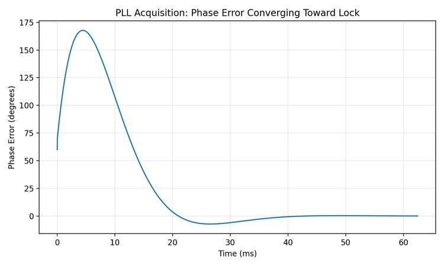

The first phase-error sample is close to the imposed 60° offset, but the error does not simply fall smoothly from 60° to zero.

It initially grows, reaches roughly 168°, reverses direction, crosses toward zero, overshoots slightly, and then settles. By the end of the captured record, the phase error is approximately 0.024°.

This is a valuable observation.

> **PLL acquisition is a dynamic feedback process, not a simple monotonic subtraction of the initial phase error.**

The loop contains memory and feedback. Depending on its parameters and initial condition, it can overshoot and oscillate before settling.

### About the Python plot

GNU Radio performs the PLL processing and generates the phase-error samples. A small Python script only reads the recorded `float32` data, converts radians to degrees, constructs the time axis, and plots the measured transient.

It does not simulate the PLL and does not smooth or alter the measured data.

The plotting script and captured data are provided in the Chapter 21 experiments folder.

---

> ### GNU Radio Toolbox: PLL Carrier Regeneration
>
> **PLL Carrier Regeneration** is useful when we want the loop to generate a carrier reference that follows an incoming carrier.
>
> Important parameters include the loop bandwidth and the allowed minimum and maximum angular frequencies.
>
> The frequency limits should contain the carrier the loop is expected to acquire. They are not arbitrary normalized numbers and should be related to the actual sample rate and carrier frequency.

---

> ### GNU Radio Toolbox: Head and File Sink for Measured Transients
>
> **Head** limits a continuous GNU Radio stream to a chosen number of items. **File Sink** records those items for later analysis.
>
> In this experiment, GNU Radio generates the PLL phase-error stream, `Head` keeps a controlled acquisition interval, and `File Sink` records it.
>
> This is useful when a short transient is easier to study from a fixed data record than from a continuously refreshing GUI.

---

## 21.6 Loop Bandwidth: How Aggressively Should the PLL React?

Once we saw the acquisition transient, a natural question appeared:

> **What controls how quickly the PLL reacts?**

One of the most important parameters is **loop bandwidth**.

The intuitive meaning is more important than the exact control-system derivation at this stage.

A wider loop bandwidth lets the PLL react more aggressively to phase and frequency error. That usually helps it acquire and track faster.

A narrower loop bandwidth makes the loop more cautious. Acquisition becomes slower, but the loop also reacts less strongly to rapid fluctuations and noise.

So loop bandwidth creates a trade-off:

```text
Narrow loop bandwidth
→ slower response
→ less reaction to rapid fluctuations

Wide loop bandwidth
→ faster response
→ more reaction to noise and fluctuations
```

---

# Experiment 21.5: Effect of PLL Loop Bandwidth

We reuse the acquisition flowgraph from Experiment 21.4. Nothing else is changed except the loop bandwidth.

The three values are

$$
B_{\text{narrow}}=\pi/3000
$$

$$
B_{\text{baseline}}=\pi/1000
$$

$$
B_{\text{wide}}=\pi/300
$$

For this comparison, `Head` records 6000 samples. At 32 ksample/s,

$$
6000/32000=0.1875\text{ s}=187.5\text{ ms}
$$

The measured responses are shown below.

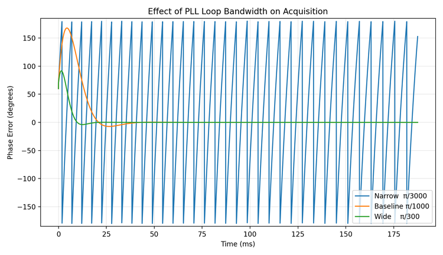

The difference is substantial.

| Loop bandwidth | Observed behavior | Approximate measured settling |
|---|---|---|
| $\pi/3000$ | Very slow acquisition | Did not settle during the 187.5 ms record |
| $\pi/1000$ | Moderate acquisition | Within about ±1° after 38.9 ms |
| $\pi/300$ | Fast acquisition | Within about ±1° after 17.8 ms |

For the baseline case, the error remained within about ±5° after 31.6 ms and within about ±1° after 38.9 ms.

For the wide-loop case, the corresponding times were about 8.8 ms and 17.8 ms.

The narrow-loop curve also reaches the ±180° principal-phase boundary. The apparent jump is phase wrapping, not a physical discontinuity in the oscillator.

This experiment gives loop bandwidth a physical meaning:

> **Loop bandwidth controls how aggressively the feedback loop responds to error.**

The wider setting acquired much faster in this clean experiment. Later, when noise is present, the same aggressive response can also make the loop more sensitive to noisy phase measurements.

As in Experiment 21.4, the plotting script and the measured `.dat` files are available in the Chapter 21 experiments folder.

### Try It Yourself

Before changing the flowgraph, predict what should happen if the loop bandwidth is made even narrower than $\pi/3000$. Will the final locked phase necessarily be wrong, or will acquisition simply take longer than the observation window?

---

## 21.7 Why an Ordinary PLL Is Not Enough for Random QPSK

The clean-carrier PLL taught us feedback, acquisition, lock, and loop bandwidth.

Now we return to QPSK.

A simple carrier PLL expects its phase detector to see a phase error associated with the carrier. Random QPSK creates a new difficulty because the signal phase also changes when the data symbol changes.

The observed phase can be thought of as

$$
\theta_{\text{observed}}=\theta_{\text{data}}+\theta_{\text{carrier}}
$$

For a clean unmodulated carrier, $\theta_{\text{data}}$ is absent.

For random QPSK, it jumps among the legitimate QPSK symbol phases.

A simple carrier phase detector can therefore mistake modulation-dependent phase changes for carrier error.

---

# Experiment 21.6: Applying an Ordinary PLL to QPSK

We feed random QPSK directly into the ordinary PLL carrier-regeneration approach.

The result is shown for two imposed phase offsets.

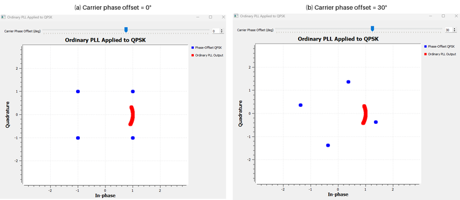

Changing the carrier phase rotates the QPSK constellation as expected, but the ordinary PLL output does not become a clean QPSK carrier reference. It forms a similar arc-like response even as the imposed phase offset changes.

That is not a reason to keep tuning the phase-offset control.

It is the lesson of the experiment.

> **A simple carrier PLL is not directly suited to random suppressed-carrier QPSK because the phase detector must somehow separate carrier error from legitimate data phase changes.**

This does not mean that PLL ideas are useless for QPSK. It means that the phase detector must understand the modulation structure.

That leads to the **Costas Loop**.

---

## 21.8 The Costas Loop: A Modulation-Aware Carrier Loop

A Costas Loop is still a feedback carrier-recovery loop, but its error detector is designed for modulated signals such as PSK.

For our QPSK experiment, the important settings are

```text
Order:          4
Loop Bandwidth: pi/100
Use SNR:        No
```

`Order = 4` tells the block that the signal has QPSK-like fourfold phase structure. It does **not** mean that we are building a fourth-order PLL.

`Loop Bandwidth = pi/100` controls the feedback response in the same broad sense we explored with the ordinary PLL.

`Use SNR = No` is appropriate for our first controlled experiment because we initially want to understand carrier recovery without adding noise.

---

> ### GNU Radio Toolbox: Costas Loop
>
> **Costas Loop** is a feedback carrier-recovery block designed for suitable phase-modulated signals.
>
> Unlike the simple clean-carrier PLL experiment, its phase-error detector accounts for the symmetry of the modulation.
>
> Important settings include the modulation order and loop bandwidth. The loop can also expose diagnostic outputs such as frequency, phase, and error, but those outputs are most informative when the transient behavior is captured deliberately. A steady-state display after lock may appear nearly flat because the loop has already done its work.

---

# Experiment 21.7: QPSK Carrier Recovery with a Costas Loop

We now apply a controlled phase rotation to QPSK and place a Costas Loop in the receiver.

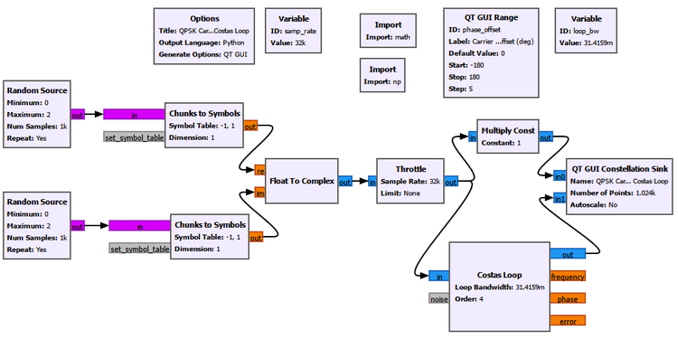

At a 30° phase offset, the original QPSK point $(1,1)$ has a phase of 45°. After the carrier rotation,

$$
45^\circ+30^\circ=75^\circ
$$

so the expected coordinates are approximately

$$
(\sqrt{2}\cos75^\circ,\sqrt{2}\sin75^\circ)\approx(0.366,1.366)
$$

That is what we see before recovery.

After the Costas Loop, the constellation returns close to the normal QPSK geometry around $(\pm1,\pm1)$.

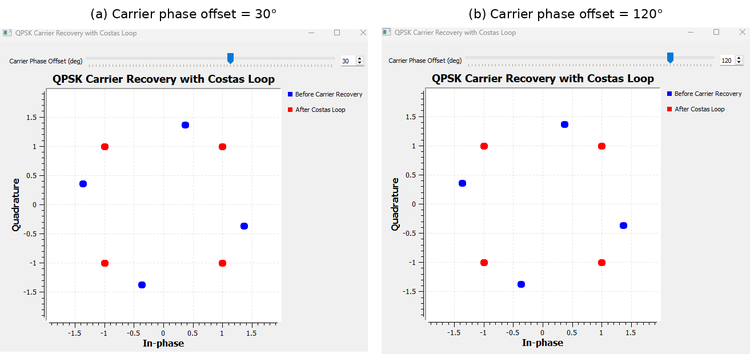

We also tested a much larger phase rotation such as 120°. The recovered constellation again looks geometrically correct.

That result needs an important qualification.

### A correct-looking constellation can still be ambiguous

QPSK is unchanged geometrically by rotations of 90°.

Therefore a Costas Loop can recover a stable QPSK constellation while still leaving an integer multiple of 90° ambiguity:

$$
\phi_{\text{ambiguity}}=k\frac{\pi}{2},\qquad k=0,1,2,3
$$

The constellation may look perfect, but the original symbol-to-bit labels can still be rotated.

This is the same underlying symmetry we met in the M-th power experiment.

So there are two different questions:

1. Has the receiver recovered a stable QPSK geometry?
2. Has it also recovered the original absolute symbol labeling?

Those are not always the same thing.

Practical systems use known information, differential encoding, pilots, or framing structure to resolve the remaining ambiguity when necessary.

---

# Experiment 21.8: Costas Loop in Noise

So far, the Costas Loop has seen a clean phase-rotated QPSK signal.

Now we keep the 30° carrier phase offset and add noise.

We compare two noise amplitudes:

$$
A_n=0.1
$$

and

$$
A_n=0.5
$$

The result is shown below.

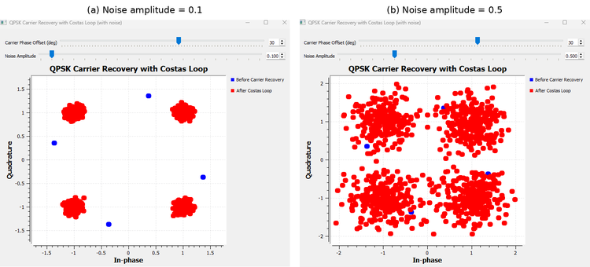

At noise amplitude 0.1, the recovered constellation still forms relatively compact clusters around the expected QPSK points.

At noise amplitude 0.5, the clusters become much broader.

It is tempting to call all of that spreading **phase jitter**, but that would be too simple.

Noise affects the display in at least two ways.

First, additive complex noise directly perturbs the I and Q samples, spreading the constellation even if the carrier estimate were perfect.

Second, noisy samples also perturb the Costas Loop's phase-error detector, which can create additional tracking variation.

So a noisy recovered constellation contains both **sample noise** and **carrier-tracking effects**.

This distinction matters in practical receivers because not every cloud around a constellation point should be blamed on the synchronization loop.

---

# Part II: Carrier Frequency Synchronization

## 21.9 Phase Offset and Frequency Offset Are Not the Same Problem

We are now ready to return to the carrier-frequency offset first observed in the wireless-channel chapter.

A fixed carrier phase offset is

$$
\phi(t)=\phi_0
$$

A carrier-frequency offset makes the phase change continuously:

$$
\phi(t)=2\pi\Delta f t+\phi_0
$$

where $\Delta f$ is the difference between the transmitter and receiver carrier frequencies.

This distinction is fundamental.

| Property | Carrier phase offset | Carrier frequency offset |
|---|---|---|
| Phase error | Constant | Changes continuously with time |
| Constellation | Fixed rotation | Continuous rotation |
| Static constellation display | Rotated clusters | Arcs or ring |
| Receiver task | Correct phase | Estimate and correct frequency mismatch |

A frequency error therefore becomes a **phase slope**.

Even a small frequency mismatch eventually accumulates a large phase error if we wait long enough.

---

# Experiment 21.9: Observing Carrier Frequency Offset

We return to the pulse-shaped QPSK signal and apply a controlled carrier-frequency offset before the receiver processing.

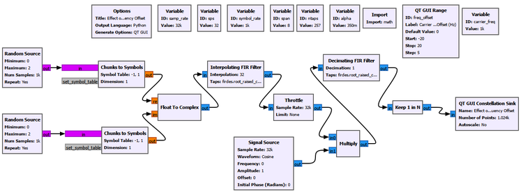

At zero frequency offset, the QPSK clusters remain stationary.

At 5 Hz, the constellation continuously rotates.

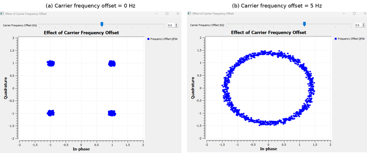

For

$$
\Delta f=5\text{ Hz},
$$

one complete phase revolution takes

$$
T_{\text{rotation}}=\frac{1}{5}=0.2\text{ s}
$$

The Constellation Sink retains samples from different times. Those samples therefore contain different accumulated carrier phases. When many rotations are displayed together, the four moving QPSK points fill a ring.

This gives us a useful visual distinction:

```text
Fixed phase offset
→ four clusters rotated by a fixed angle

Carrier frequency offset
→ phase keeps accumulating
→ constellation keeps rotating
→ many displayed samples form a ring
```

A static ring, however, does not tell us the direction of rotation. A clockwise and counterclockwise trajectory can produce essentially the same ring when many samples are overlaid.

To determine the sign of the CFO, we need a measurement that retains the direction of phase change.

---

## 21.10 Frequency Is Phase Change per Unit Time

The previous experiment suggests the next idea naturally.

If frequency offset makes phase change continuously, perhaps we can estimate frequency by measuring **how much the phase changes between two known times**.

For a complex sinusoid,

$$
x[n]=Ae^{j(2\pi\Delta f n/f_s+\phi_0)}
$$

one sample later the phase has advanced by

$$
\Delta\phi=2\pi\frac{\Delta f}{f_s}
$$

Therefore,

$$
\Delta f=\frac{f_s}{2\pi}\Delta\phi
$$

This is the discrete-time version of a familiar physical idea:

> **Frequency tells us how quickly phase changes.**

But raw QPSK has another source of phase change: the data symbols themselves.

Fortunately, we already know how to remove the four QPSK data phases.

We can reuse the fourth-power operation.

---

# Experiment 21.10: M-th Power CFO Estimation in Time and Frequency

This experiment combines two different views of the same carrier-frequency offset.

We first raise the CFO-impaired QPSK signal to the fourth power. The QPSK data phase collapses, while the carrier phase is multiplied by four.

The same fourth-power signal is then examined in two ways:

```text
                         Fourth-power signal
                                |
               +----------------+----------------+
               |                                 |
               v                                 v
        Adjacent samples                        DFT
               |                                 |
               v                                 v
      Phase increment Δφ                  Spectral location
               |                                 |
               v                                 v
     Time-domain CFO estimate          Frequency-domain CFO view
```

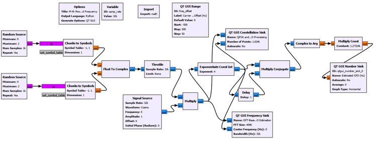

### Time-domain phase-increment estimator

Let the fourth-power output be $y[n]$.

We compare adjacent samples with a conjugate product:

$$
z[n]=y[n]y^*[n-1]
$$

Because the QPSK data phase has been removed, the remaining phase advance is caused by the carrier-frequency offset.

The fourth power multiplies the carrier phase by four, so the adjacent-sample phase increment becomes

$$
\angle z[n]=\frac{8\pi\Delta f}{f_s}
$$

Therefore,

$$
\hat{\Delta f}=\angle z[n]\frac{f_s}{8\pi}
$$

The GNU Radio chain is

```text
Fourth-power output
        |
        +---------------------> Multiply Conjugate
        |                              ^
        +-> Delay: 1 sample -----------+
                                       |
                                       v
                                Complex to Arg
                                       |
                                       v
                          Multiply Const: fs/(8*pi)
                                       |
                                       v
                              Estimated CFO (Hz)
```

The one-sample delay has a clear physical meaning. We are asking how much phase advanced during exactly one sample interval, $1/f_s$.

With $f_s=32000$ samples/s and an applied CFO of +100 Hz, the experiment reports approximately

$$
\hat{\Delta f}=99.999794\text{ Hz}
$$

For -100 Hz, it reports approximately

$$
\hat{\Delta f}=-100.000084\text{ Hz}
$$

The sign therefore tells us the direction of phase rotation, something the static constellation ring could not reveal.

### The DFT view

The same fourth-power signal can also be understood in frequency.

If the original CFO is $\Delta f$, the fourth-power operation multiplies that frequency by four:

$$
f_{\text{peak}}=4\Delta f
$$

Therefore,

$$
\hat{\Delta f}=\frac{f_{\text{peak}}}{4}
$$

For an applied CFO of +100 Hz, we expect the relevant carrier-like component near

$$
4(100)=400\text{ Hz}
$$

For -100 Hz, it should move to approximately -400 Hz.

The Frequency Sink uses an FFT size of 4096. At 32 ksample/s, the nominal bin spacing is

$$
\Delta f_{\text{bin}}=\frac{32000}{4096}=7.8125\text{ Hz}
$$

The combined result is shown below.

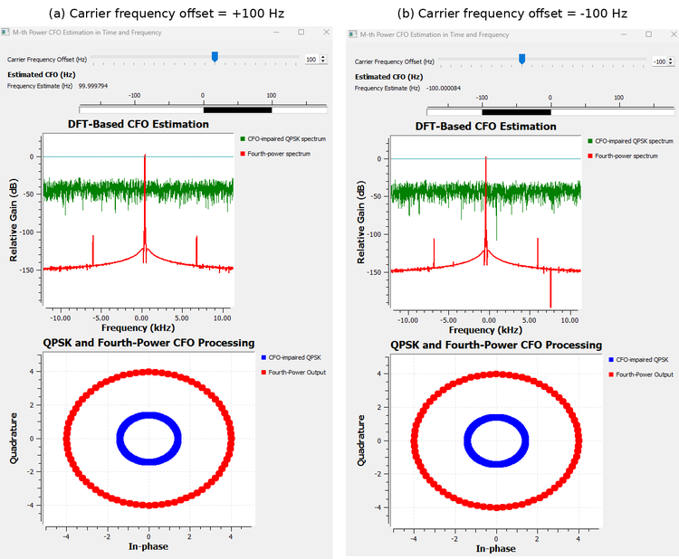

### Why does the green QPSK spectrum look broad?

The green trace is the **CFO-impaired QPSK spectrum before the fourth-power operation**.

The random QPSK data is still present. The signal is not a single sinusoid, so its energy is spread over frequency. CFO shifts that modulated spectrum, but it does not magically create one isolated carrier line.

The fourth-power operation removes the QPSK data phase. That exposes a carrier-like frequency component whose displacement follows $4\Delta f$.

This is why the DFT becomes much easier to interpret after modulation removal.

The fourth-power spectrum can contain other components as well. We should not assume that every visible red peak is the CFO. The relevant carrier-like feature is the one whose displacement follows the expected $4\Delta f$ relationship.

### Two estimators, one physical quantity

This experiment connects time and frequency beautifully.

The time-domain method says:

> Measure the phase advance between adjacent samples.

The frequency-domain method says:

> Find where the carrier-like component appears in the DFT.

Both are measuring the same underlying CFO.

---

> ### GNU Radio Toolbox: Delay Revisited
>
> We first used **Delay** to shift signals in earlier correlation and channel experiments.
>
> Here a one-sample delay has a different role. It creates a previous-sample reference so that the conjugate product can measure the phase increment from $n-1$ to $n$.
>
> The block is simple, but the interpretation is important: a known time separation turns phase difference into frequency information.

---

## 21.11 Estimation Versus Tracking

Experiment 21.10 gave us a CFO estimate.

That is useful, but a receiver may need to follow frequency changes continuously. Oscillator drift or Doppler can change during reception.

This brings us to another feedback loop: the **frequency-locked loop**, or FLL.

At a conceptual level,

```text
Frequency-error detector
        ↓
Loop filter
        ↓
NCO / frequency correction
        └──────────────↺
```

This looks similar to the PLL because both are feedback systems.

The difference is the error being driven toward zero.

A PLL is fundamentally concerned with **phase error**.

An FLL is fundamentally concerned with **frequency error**.

There are different ways to construct a frequency-error detector. In our GNU Radio experiment, we use a **band-edge** detector.

So the terms should not be confused:

```text
FLL
= general feedback architecture for frequency tracking

Band-edge detector
= one way to generate a frequency-error signal

FLL Band-Edge
= GNU Radio block combining these ideas
```

---

## 21.12 Band-Edge Frequency Detection

Our pulse-shaped QPSK signal has structured spectral edges determined partly by the RRC roll-off factor.

Imagine measuring energy around the lower and upper edges of that spectrum.

When the signal is correctly centered, those measurements should be approximately balanced:

$$
E_{\text{lower}}\approx E_{\text{upper}}
$$

If the spectrum shifts because of CFO, the balance changes:

$$
E_{\text{lower}}\neq E_{\text{upper}}
$$

The direction and magnitude of that imbalance provide a frequency-error signal for the feedback loop.

Conceptually,

```text
Correctly centered spectrum
lower-edge energy ≈ upper-edge energy
             ↓
       frequency error ≈ 0

Shifted spectrum
lower-edge energy ≠ upper-edge energy
             ↓
       frequency-error signal
             ↓
          feedback correction
```

This is why the FLL Band-Edge block needs to know properties of the pulse-shaped waveform itself.

---

> ### GNU Radio Toolbox: FLL Band-Edge
>
> **FLL Band-Edge** performs feedback carrier-frequency recovery using information near the spectral edges of a pulse-shaped signal.
>
> Its important parameters describe both the waveform and the loop:
>
> - samples per symbol,
> - filter roll-off factor,
> - prototype filter size,
> - loop bandwidth.
>
> The first two are not arbitrary tuning values. They must describe the signal entering the block. The loop bandwidth controls how aggressively the frequency-tracking feedback responds.

---

# Experiment 21.11: Carrier Frequency Recovery with FLL Band-Edge

For the final frequency-recovery experiment, we observe the signal directly in the frequency domain.

That is the most natural place to judge whether an FLL is doing its job.


The two Frequency Sink traces are

```text
Before FLL
After FLL
```

The important FLL settings are

| Parameter | Value | Why it matters |
|---|---:|---|
| Samples per Symbol | `32` | Matches the actual oversampling of the pulse-shaped waveform |
| Filter Rolloff Factor | `0.35` | Matches the RRC excess bandwidth used by the signal |
| Prototype Filter Size | `45` | Sets the internal band-edge filter length/resolution |
| Loop Bandwidth | `2*pi/1000` | Controls the feedback responsiveness |

The loop bandwidth is therefore

$$
2\pi/1000\approx0.006283
$$

### Why must SPS and roll-off match the waveform?

The FLL is trying to measure the signal's band edges.

If we tell it the wrong samples-per-symbol value, it has the wrong relationship between sample rate, symbol rate, and spectral structure.

If we tell it the wrong roll-off factor, it has the wrong description of the excess-bandwidth region it is using for the error measurement.

These parameters therefore describe the signal rather than merely controlling the GUI or loop speed.

### Positive and negative CFO

We test both signs with

$$
\Delta f=+2\text{ kHz}
$$

and

$$
\Delta f=-2\text{ kHz}
$$

The result is shown below.

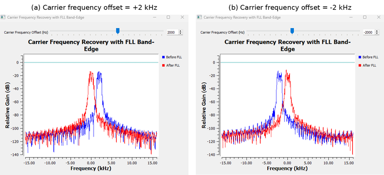

For +2 kHz CFO, the spectrum before the FLL is shifted to approximately +2 kHz. The FLL output moves back close to 0 Hz.

For -2 kHz CFO, the spectrum shifts in the opposite direction, and the FLL again moves it back close to 0 Hz.

The loop therefore responds to both the magnitude and sign of the frequency error.

The before- and after-FLL spectral shapes are not perfectly identical. That is not the main criterion here. The FLL contains internal filtering as part of its band-edge processing.

The important observation is that the **center-frequency error is driven back toward zero**.

---

## 21.13 Acquisition Is Not Unlimited

A synchronization loop cannot necessarily acquire an arbitrarily large initial error.

To see this, we kept the same Experiment 21.11 waveform and FLL settings and increased only the initial carrier-frequency offset.

At ±2 kHz, the loop successfully brought the spectrum close to zero.

At larger offsets such as +4 kHz, +6 kHz, and +8 kHz, the loop still responded in the correct direction but did not completely remove the CFO.

The selected +8 kHz result is shown below.

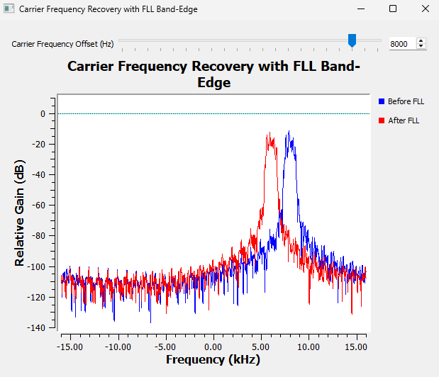

This figure should not be interpreted as saying that every FLL Band-Edge has a universal 2 kHz capture range.

The acquisition behavior depends on the waveform and the complete loop configuration, including sample rate, symbol rate, roll-off, internal filtering, loop parameters, and the size of the initial error.

The correct conclusion from our experiment is narrower and more useful:

> **With this particular signal and FLL configuration, ±2 kHz offsets were successfully recovered. At substantially larger initial offsets, the loop responded in the correct direction but did not fully remove the CFO.**

This gives us a practical distinction between **acquisition** and **tracking**.

| Term | Meaning |
|---|---|
| Acquisition | Bringing a receiver from a substantially incorrect initial carrier state toward lock |
| Tracking | Following smaller changes after the receiver is already near or in lock |

A real receiver may therefore use more than one synchronization stage.

For example,

```text
Large initial carrier uncertainty
        ↓
Coarse frequency estimation / acquisition
        ↓
Frequency tracking
        ↓
Fine carrier-phase tracking
        ↓
Carrier synchronized
```

The exact architecture depends on the communication system. The important lesson is that **estimation, acquisition, and tracking are related but not identical tasks**.

### Try It Yourself

Reuse Experiment 21.11 and change only the initial CFO. Before running the flowgraph, predict whether the FLL will fully acquire at +4 kHz, +6 kHz, or +8 kHz. Keep the FLL settings unchanged so that the effect of the initial frequency error is isolated.

---

## 21.14 Putting Carrier Synchronization Together

We began this chapter with a simple rotated constellation.

That led to a sequence of increasingly realistic receiver questions.

First, if the transmitted reference is known, a conjugate product can measure relative phase directly.

Then QPSK symmetry allowed us to remove unknown data with the fourth-power method, but that symmetry also introduced a 90° ambiguity.

A PLL showed us how feedback turns phase measurement into continuous tracking. Loop bandwidth then showed how strongly the loop responds.

Random QPSK revealed why a simple carrier PLL needs a modulation-aware phase detector, which led naturally to the Costas Loop.

When we moved from phase offset to frequency offset, the central idea changed from **phase itself** to **phase change with time**. The same fourth-power operation then supported two CFO views: adjacent-sample phase increment in time and spectral displacement in the DFT.

Finally, the FLL Band-Edge converted frequency-error measurements into continuous feedback correction.

The main methods can be summarized as follows.

| Method | Feedforward or feedback | Main purpose | Important limitation or condition |
|---|---|---|---|
| Conjugate product | Feedforward measurement | Relative phase with a known reference | Requires a suitable reference |
| M-th power phase estimator | Feedforward | Remove QPSK data phase and estimate carrier phase | QPSK 90° ambiguity |
| PLL | Feedback | Acquire and track a clean carrier reference | Simple phase detector is not directly modulation-aware |
| Costas Loop | Feedback | Carrier recovery for QPSK | Can retain rotational ambiguity |
| M-th power phase-increment CFO estimator | Feedforward | Estimate signed CFO from phase change | Depends on modulation-removal assumptions and unambiguous phase increment |
| DFT view after M-th power | Feedforward | Observe CFO as a spectral displacement | Frequency resolution depends on the observation/FFT |
| FLL Band-Edge | Feedback | Continuous carrier-frequency recovery | Acquisition capability is finite and configuration-dependent |

One way to visualize the complete carrier-synchronization problem is

```text
Received complex signal
        |
        +--> Large frequency uncertainty?
        |          |
        |          v
        |    Coarse CFO estimation
        |          |
        |          v
        |    Frequency acquisition / FLL
        |          |
        +----------+
                   |
                   v
          Residual carrier phase
                   |
                   v
           PLL / Costas Loop
                   |
                   v
          Carrier synchronized
```

This diagram is intentionally general. Not every radio uses exactly this sequence, and some algorithms combine roles that we separated for teaching.

But the separation helps us understand what each stage is trying to correct.

---

## 21.15 Practical SDR Interpretation

Carrier synchronization is not an abstract problem created by GNU Radio.

Two independent oscillators are never perfectly identical.

A transmitter may generate a nominal carrier at one frequency while the receiver's local oscillator differs slightly because of component tolerance, temperature, aging, or clock-reference error. Relative motion can add Doppler. Even after coarse tuning, a residual phase and frequency mismatch can remain in complex baseband.

The receiver therefore does not merely need to know **which channel** to tune to.

It also needs a sufficiently accurate internal reference for interpreting the phase trajectory of the received symbols.

That is why carrier synchronization appears in so many coherent communication receivers.

The constellation is especially useful because it turns these oscillator errors into visible geometry:

```text
Fixed carrier phase error
→ fixed constellation rotation

Carrier frequency error
→ continuous constellation rotation

Noise
→ constellation spreading

Successful carrier recovery
→ stable constellation geometry
```

But the chapter also showed why we should not rely on the constellation alone.

A static ring cannot reveal CFO direction. A correct-looking QPSK constellation may still have a 90° labeling ambiguity. A noisy cloud contains both additive sample noise and possible tracking variation.

A good receiver designer therefore combines visual intuition with quantitative measurements.

---

## 21.16 What We Learned

By developing the synchronization problem experimentally, we discovered several important ideas.

- A fixed carrier phase offset rotates the complete constellation by a fixed angle.
- A carrier-frequency offset is different: it causes phase to accumulate continuously with time.
- Multiplying by a complex conjugate turns phase addition into phase subtraction and is therefore a natural way to measure relative phase.
- With a known reference $s$, the phase of $rs^*$ reveals the carrier phase difference.
- Raising QPSK to the fourth power removes the four possible QPSK data phases because of the modulation's fourfold rotational symmetry.
- The same fourth-power symmetry creates a 90° phase ambiguity.
- Principal-angle wrapping explains why a true phase such as +50° can appear as the equivalent estimate -40° after fourth-power recovery.
- A PLL is a feedback system that repeatedly measures error and corrects a local reference.
- PLL acquisition can overshoot and oscillate before reaching lock; it does not have to converge monotonically.
- Loop bandwidth controls how aggressively a PLL responds. Wider bandwidth gave faster acquisition in our clean experiment, while narrower bandwidth responded much more slowly.
- A simple clean-carrier PLL is not directly appropriate for random suppressed-carrier QPSK because the data itself changes the observed phase.
- A Costas Loop uses modulation-aware phase detection and can recover stable QPSK carrier phase.
- A stable-looking QPSK constellation can still retain a 90° rotational ambiguity in its symbol labeling.
- In noise, constellation spreading comes from both direct additive I/Q noise and possible loop-tracking variation.
- Frequency can be estimated from phase advance over a known time interval.
- After fourth-power QPSK processing, an adjacent-sample conjugate product gives a signed CFO estimate through $f_s/(8\pi)$ scaling.
- The same CFO can be viewed in frequency: the fourth-power carrier-like component appears at approximately four times the original CFO.
- Raw random QPSK does not generally produce one simple carrier line in the spectrum; removing the data modulation makes the carrier-frequency information easier to observe.
- An FLL is a feedback architecture for frequency tracking, while band-edge detection is one possible way to generate its frequency-error signal.
- GNU Radio's FLL Band-Edge successfully recovered the ±2 kHz offsets used in our experiment.
- Acquisition capability is finite and depends on the signal and loop configuration. A larger initial CFO can produce only partial correction.
- Acquisition, lock, and tracking describe different stages of synchronization and should not be treated as interchangeable terms.

Most importantly, carrier synchronization is not one single correction.

It is a family of related receiver tasks built around one central idea:

> **Measure how the received carrier differs from the receiver's reference, then use that information to bring the two into alignment.**

---

## 21.17 Connecting to the Next Chapter

We have now corrected two major reference errors.

The receiver can estimate and track carrier frequency, and it can recover carrier phase for QPSK.

But one synchronization problem is still unresolved.

Our digital waveform contains several samples per symbol.

Even with perfect carrier phase and frequency, the receiver still has to answer:

> **Which sample corresponds to the best instant for making each symbol decision?**

If it samples too early or too late, the decision point can move away from the center of the eye. With clock mismatch, that sampling instant can also drift continuously through the symbol period.

That is not a carrier problem.

It is a **timing synchronization** problem.

In the next chapter, we will move from recovering the carrier reference to recovering the receiver's symbol clock.

We will ask how a receiver can determine the correct sampling instant automatically, how timing error appears in an oversampled waveform, and how GNU Radio can track that timing as the signal changes.

That leads to **Chapter 22: Clock and Symbol Timing Synchronization**.
