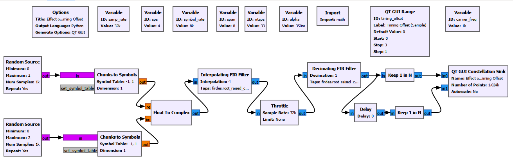
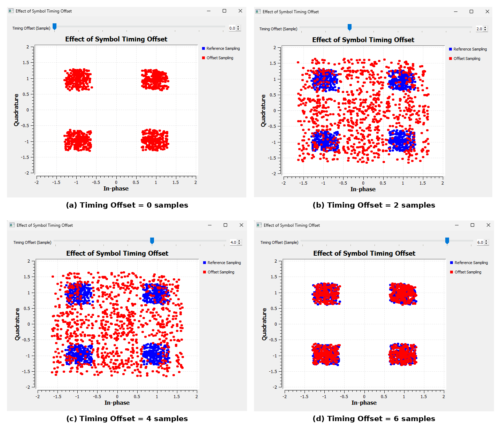
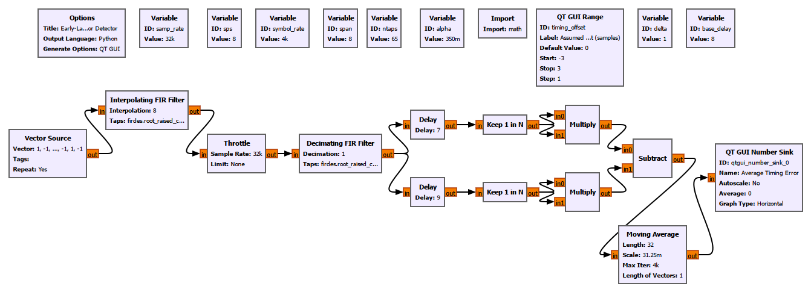
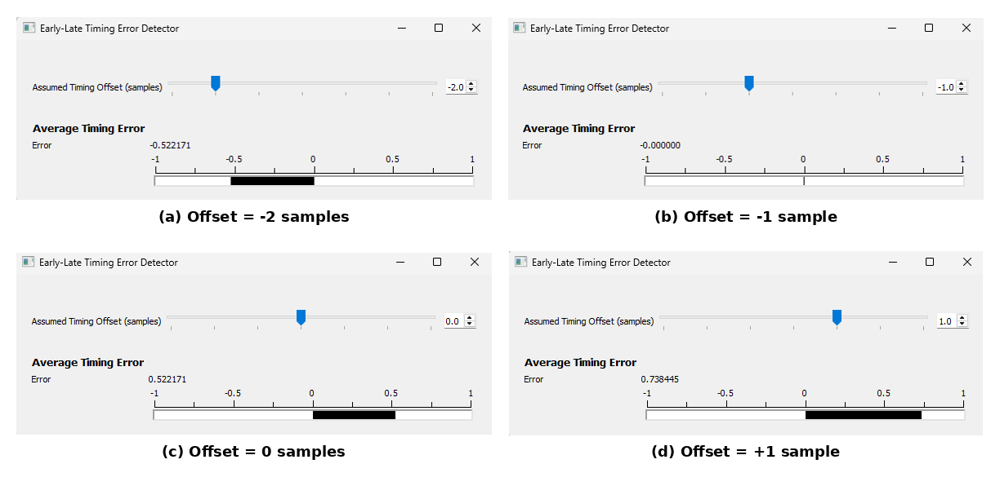
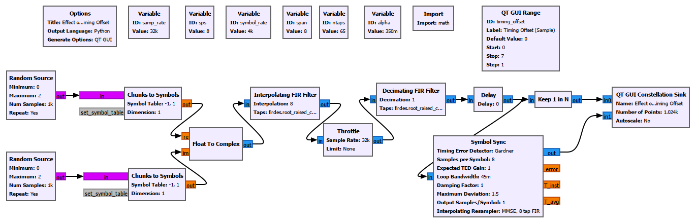
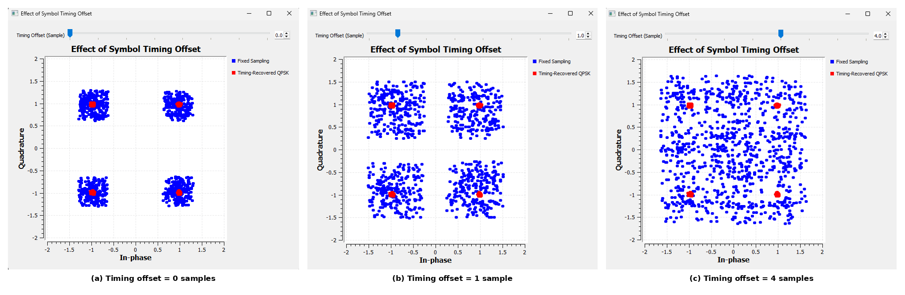
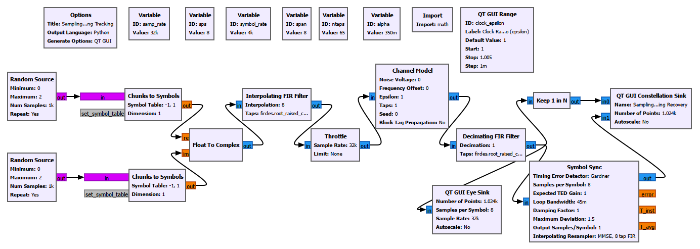
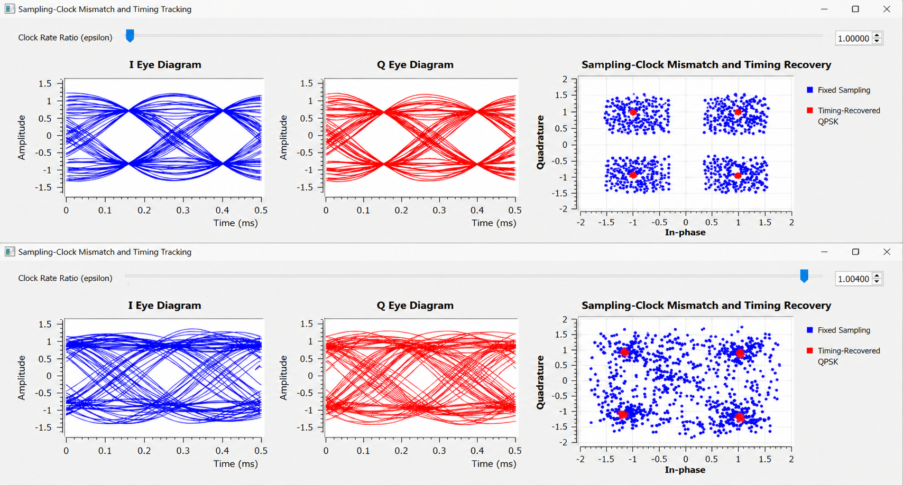
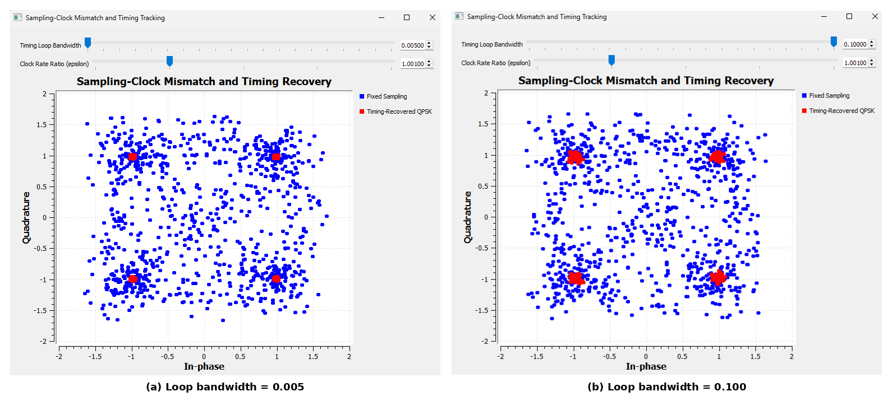

# Chapter 22: Symbol Timing Synchronization

In the previous chapter, we recovered the carrier. A Costas loop, PLL, FLL, or another carrier-recovery method can correct frequency and phase errors, but that still does not tell the receiver **when to measure each symbol**.

That is the problem of **symbol timing synchronization**.

A digital receiver does not receive one isolated number for every transmitted symbol. It receives a continuous-time waveform that has been sampled by an ADC. After pulse shaping and matched filtering, several digital samples may represent one symbol interval. Somewhere among those samples is the best instant at which to make the symbol decision.

If the receiver samples at the wrong instant, the constellation spreads even when the carrier is perfectly synchronized. If the transmitter and receiver sampling clocks run at slightly different rates, the correct instant does not even remain fixed: it slowly moves with time.

This chapter develops the receiver mechanisms that solve these problems.

We will begin by deliberately sampling QPSK at the wrong instant. Then we will build a simple timing-error detector so that the receiver can determine whether it is early or late. After that, GNU Radio's **Symbol Sync** block will close the loop automatically. Finally, we will introduce a sampling-clock mismatch and observe the receiver continuously tracking it.

The central idea is simple:

> Carrier synchronization determines the correct rotation of the constellation. Timing synchronization determines the correct instant at which the constellation should be observed.

---

## 22.1 From Pulse Shaping to Timing Recovery

Chapter 18 introduced pulse shaping and matched filtering. We learned that a Nyquist pulse can be designed so that, at the correct symbol instants, neighboring symbols do not interfere with the symbol being measured.

If the symbol period is \(T\), the desired receiver samples occur at times such as

$$
t=kT+\tau
$$

where \(k\) is the symbol index and \(\tau\) represents the receiver's timing phase.

The important phrase is **at the correct symbol instants**.

The matched filter does not automatically tell the receiver where those instants are. It produces a waveform containing many samples, and the receiver must determine where in each symbol interval it should sample.

For our experiments,

$$
f_s=32000\ \text{samples/s}
$$

and

$$
R_s=4000\ \text{symbols/s}
$$

so

$$
\text{sps}=\frac{f_s}{R_s}=8
$$

There are therefore eight digital samples per symbol.

A simplified picture is

```text
one symbol interval
<---------------------->

o   o   o   o   o   o   o   o
0   1   2   3   4   5   6   7
                ^
        useful sampling region
```

The receiver must determine where that useful region is.

This is not a carrier problem. A receiver can have perfect carrier phase and frequency recovery and still make poor decisions because it samples at the wrong time.

---

## 22.2 Experiment 22.1: Effect of Symbol Timing Offset

Before trying to recover timing, we first need to see what incorrect timing actually does.

We generate pulse-shaped QPSK, pass it through a receive matched filter, and then deliberately choose different samples from each eight-sample symbol interval.

The main parameters are:

| Parameter | Value |
|---|---:|
| Sample rate | 32 kS/s |
| Symbol rate | 4 ksymbol/s |
| Samples per symbol | 8 |
| RRC roll-off, \(\alpha\) | 0.35 |
| RRC taps | 65 |
| Timing-offset range | 0 to 7 samples |



The important point is that the transmitted data and pulse shape are not being changed. Only the **sampling position** is changed.

The eight possible integer positions represent one complete symbol interval. After eight samples, the pattern repeats into the next symbol.

### What We Observe

We selected offsets 0, 2, 4, and 6 for the final comparison because they show the movement through the symbol interval without requiring eight nearly redundant plots.



At a favorable sampling position, the points form four compact QPSK clusters. At poor positions, many samples are taken while the pulse-shaped waveform is moving between symbols. The constellation therefore spreads through the space between the ideal QPSK points.

This explains an important observation:

> A smeared constellation does not automatically mean noise, multipath, or failed carrier recovery.

Incorrect symbol timing can also spread the constellation.

### Physical Meaning

Imagine that every transmitted symbol is a small pulse with a best measurement point near its center. The receiver does not know where that center lies relative to its own sampling clock.

Sampling near the best point gives a reliable estimate of the symbol. Sampling near a transition mixes the influence of adjacent symbols and gives a poor estimate.

The receiver therefore needs more than a fixed `Keep 1 in N` operation. It needs a way to determine whether its current sampling position is too early or too late.

That leads to the timing-error detector.

---

## 22.3 Timing Error: How Can a Receiver Know It Is Early or Late?

Suppose the receiver is currently examining a candidate symbol time.

It can ask a remarkably useful question:

> Does the waveform look more appropriate slightly before this instant or slightly after it?

Conceptually, take three measurements:

```text
              candidate symbol time
                       |
                       v
---------o-------------o-------------o---------
       early          on-time        late
```

If the receiver is correctly centered, the early and late observations should balance in the way expected by the timing detector.

If they do not balance, their difference produces a **timing error**.

The sign tells the loop which direction to move.

This is analogous to carrier synchronization. A PLL needs a phase-error detector before it can correct phase. A timing loop needs a timing-error detector before it can correct sampling time.

---

## 22.4 Experiment 22.2: Timing-Error Detection

To expose this mechanism directly, we construct a simple Early-Late-style timing-error detector rather than immediately hiding the process inside Symbol Sync.

A controlled alternating sequence is useful because it produces regular transitions:

```text
+1, -1, +1, -1, +1, -1, ...
```

After interpolation and matched filtering, two nearby sampling branches represent early and late observations. Their energies are compared and averaged.



For this experiment the assumed timing offset is swept over a small neighborhood:

```text
Timing offset:
Start: -3
Stop:   3
Step:   1
```

This range is intentionally different from Experiment 22.1.

Experiment 22.1 explored **one complete eight-sample symbol interval**, so offsets 0 through 7 were natural. Here we are no longer asking, "What happens at every possible sample position?" We are asking, "If I am near a candidate timing point, am I early or late?"

That is a local error-detection problem, so a signed range around the operating point is more useful.

### Why Compare Squared Values?

A simple energy-style Early-Late error can be written conceptually as

$$
e[k]=|r_E[k]|^2-|r_L[k]|^2
$$

where \(r_E[k]\) and \(r_L[k]\) are the early and late measurements.

The exact sign convention can be reversed depending on how the detector is constructed. What matters is that opposite timing directions produce opposite error signs.

Why square the samples?

Suppose one PAM symbol is positive and the next is negative. If we directly compare signed amplitudes, the sign of the transmitted data can dominate the comparison. Squaring removes that data sign:

$$
(+a)^2=(-a)^2=a^2
$$

The detector can therefore compare **signal magnitude or energy** rather than confusing symbol polarity with timing direction.

### Why Squaring Is Important in Timing Synchronization

There is a deeper reason that squaring repeatedly appears in timing-recovery theory.

The transmitted data itself may look random, so the symbol clock is not necessarily visible as an obvious sinusoid. Pulse shaping, however, creates a waveform whose statistical structure repeats every symbol period. A nonlinear operation such as squaring can convert some of that hidden periodic structure into a component related to the symbol rate.

For an alternating pulse-shaped sequence, this is especially easy to visualize. The waveform changes sign from symbol to symbol, but after squaring, positive and negative excursions both become positive. The repeated symbol-period structure becomes much easier to detect.

This gives two related but distinct roles for squaring:

1. **In our Early-Late detector**, it removes symbol polarity and lets us compare early and late energies.
2. **In classical clock extraction**, squaring can reveal periodic timing information that was hidden by the data modulation.

Squaring is therefore a fundamental timing-extraction idea, but it is **not a mandatory operation inside every timing-error detector**. Gardner, Mueller and Müller, and other TEDs obtain timing information using different relationships among received samples.

### What We Observe

The final comparison uses offsets \(-2\), \(-1\), \(0\), and \(+1\).



Our experimental detector produced approximately:

| Assumed offset | Average timing error |
|---:|---:|
| -3 | -0.738 |
| -2 | -0.522 |
| -1 | approximately 0 |
| 0 | +0.522 |
| +1 | +0.738 |
| +2 | +0.522 |
| +3 | approximately 0 |

At first, it may seem surprising that offset 0 does **not** produce zero error.

The important lesson is that the number written in the GUI is not automatically the physical zero of the TED.

The detector contains filter delay, branch delays, and the particular early/late sample geometry we constructed. In this implementation, the TED's balance point occurs near an assumed offset of \(-1\), not at the GUI value 0.

So:

> A timing detector's zero-error point is defined by its complete signal path, not by the label we happen to assign to one delay variable.

This is a useful practical lesson. In a real synchronization loop, the receiver does not care whether the internal variable is numerically called 0, \(-1\), or 0.37. It cares about finding the point where the timing error balances.

### Why Transitions Matter

Timing information is strongest when the waveform changes.

If the received signal remained at the same level for a long time, an early sample and a late sample could look almost identical. The receiver would have little evidence telling it which direction to move.

Transitions create slope, and slope creates timing information.

This is why timing-recovery algorithms are closely connected to the pulse shape, transition density, and excess bandwidth of the signal.

---

## 22.5 From a Timing Error to a Timing Loop

A timing-error detector alone does not synchronize anything.

It only says something like:

```text
too early
too late
approximately correct
```

The receiver still needs to use that information to change where it samples.

The complete structure is a **timing-locked loop**:

```text
oversampled received waveform
            |
            v
   +--------------------+
   | Timing Error       |
   | Detector (TED)     |
   +--------------------+
            |
         error
            |
            v
   +--------------------+
   | Loop Filter /      |
   | Loop Controller    |
   +--------------------+
            |
     timing correction
            |
            v
   +--------------------+
   | Interpolator       |
   +--------------------+
            |
            v
   recovered symbol samples
            |
            +---------- feedback ----------+
```

The analogy with the carrier-recovery loops of Chapter 21 is strong.

| Carrier synchronization | Timing synchronization |
|---|---|
| Phase/frequency error detector | Timing-error detector |
| Loop filter | Loop filter |
| Correcting oscillator | Interpolator timing control |
| Correct carrier phase/frequency | Correct symbol-sampling time |

The quantity being corrected is different, but the feedback idea is the same.

---

## 22.6 Why an Interpolator Is Necessary

This is one of the most important ideas in practical timing recovery.

With eight samples per symbol, it may be tempting to think that the receiver only needs to choose sample 0, 1, 2, ..., or 7.

Real timing is not restricted to integer sample positions.

The optimum point might lie here:

```text
ADC samples:

o-------o-------o-------o-------o
                ^
                |
          not necessarily
          exactly on a sample
```

For example, the best symbol time could correspond to sample position 3.42.

There is no ADC sample exactly at 3.42.

But a properly sampled bandlimited waveform contains enough information to estimate the signal between the existing samples. An **interpolator** constructs that estimate.

Conceptually,

$$
y(kT+\hat{\tau})=\text{interpolated value of the received waveform}
$$

where \(\hat{\tau}\) is the receiver's current timing estimate.

This is why a synchronization block is fundamentally more capable than `Keep 1 in N`.

`Keep 1 in N` says:

> Give me one of the samples that already exists.

A timing-recovery interpolator says:

> Estimate the waveform at the time where I actually need the symbol measurement.

---

## GNU Radio Toolbox: Symbol Sync

GNU Radio's **Symbol Sync** block combines the major pieces required for feedback timing recovery.

It can:

- evaluate a timing-error detector,
- filter the timing error,
- update the timing estimate,
- control an interpolating resampler,
- and produce synchronized symbol-rate output.

For our main experiment we use the **Gardner** timing-error detector.

Important settings are:

```text
I/O Type: Complex
Timing Error Detector: Gardner
Samples per Symbol: 8
Expected TED Gain: 1.0
Loop Bandwidth: 0.045
Damping Factor: 1.0
Maximum Deviation: 1.5
Output Samples/Symbol: 1
Interpolating Resampler: MMSE, 8 tap FIR
```

### Why Gardner?

The Gardner TED is widely useful because it can derive timing information from an oversampled waveform without first requiring correct symbol decisions.

Its intuition can be expressed using three samples around a symbol interval:

```text
previous symbol       midpoint       current symbol
      o------------------o------------------o
                         ^
                  transition information
```

A common real-valued form is

$$
e[k]=(x[k]-x[k-1])x[k-\tfrac{1}{2}]
$$

For complex signals, the I and Q contributions can be combined. GNU Radio handles the implementation internally.

We do not need to derive the full loop mathematics to understand the physical meaning: the detector looks at how the waveform behaves around symbol transitions and generates an error indicating how the sampling phase should move.

---

## 22.7 Experiment 22.3: Automatic Timing Recovery with Symbol Sync

We now return to pulse-shaped QPSK and replace manual timing selection with a real synchronization loop.

One branch uses fixed sampling as a reference. The second branch passes the matched-filter output into Symbol Sync.



The principal signal settings remain the same:

| Parameter | Value |
|---|---:|
| Sample rate | 32 kS/s |
| Symbol rate | 4 ksymbol/s |
| Samples per symbol | 8 |
| RRC roll-off | 0.35 |
| Symbol Sync TED | Gardner |
| Symbol Sync loop bandwidth | 0.045 |
| Output samples/symbol | 1 |

### What We Observe



When the fixed sampling position is poor, its constellation spreads. The Symbol Sync output remains concentrated around the QPSK decision points because the timing loop estimates the correct phase and uses interpolation to obtain the symbol values at the appropriate times.

This experiment changes the receiver from a **fixed sampler** into an **adaptive sampler**.

### Acquisition and Tracking

Two terms introduced for carrier synchronization are equally useful here.

**Acquisition** is the process of finding a useful timing phase after the receiver starts.

**Tracking** is the process of continuing to follow the correct timing after acquisition.

A fixed timing offset mainly tests acquisition. Once the loop finds the correct position, that position may remain approximately constant.

But real transmitter and receiver clocks are independent. Their rates will not be exactly equal.

That creates a harder problem.

---

## 22.8 Timing Offset Is Not the Same as Sampling-Clock Mismatch

This distinction is essential.

### Fixed Timing Offset

Suppose the receiver is always two samples late.

```text
Tx:  |----symbol----|----symbol----|----symbol----|
Rx:    ^              ^              ^
       same relative error every symbol
```

The timing phase is wrong, but the error does not necessarily grow.

### Sampling-Clock Mismatch

Now suppose the transmitter and receiver clocks run at slightly different rates.

```text
Tx:  |----symbol----|----symbol----|----symbol----|
Rx:   ^              ^               ^                ^
      small error     larger error    still larger error
```

The relative timing continuously drifts.

If the receiver samples slightly too fast, it gradually moves through the transmitted symbol waveform in one direction. If it samples slightly too slowly, it drifts in the other direction.

This is exactly the impairment we first introduced with the Channel Model's `Epsilon` parameter in Chapter 19. There we deliberately observed the problem without correcting it. Now we are ready to correct it.

If

$$
\epsilon=\frac{f_{s,\text{out}}}{f_{s,\text{in}}}
$$

then

$$
\epsilon=1
$$

represents matched sampling rates.

A value such as

$$
\epsilon=1.004
$$

represents a small but continuous sampling-rate mismatch.

The exact convention should always be interpreted according to the block being used, but the practical meaning is what matters here: when epsilon differs from 1, the receiver's sample timing progressively slips relative to the transmitted symbols.

---

## 22.9 Experiment 22.4: Sampling-Clock Mismatch and Timing Tracking

This experiment extends the previous QPSK receiver by introducing a controlled clock-rate mismatch through the Channel Model.

The receiver contains two paths:

```text
Matched-filter output
        |
        +----> Keep 1 in N ----> Fixed Sampling
        |
        +----> Symbol Sync ----> Timing-Recovered QPSK
```

The first path cannot adapt. The second can.



The main parameters are:

| Parameter | Value |
|---|---:|
| Sample rate | 32 kS/s |
| Symbol rate | 4 ksymbol/s |
| Samples per symbol | 8 |
| RRC roll-off | 0.35 |
| Channel noise voltage | 0 |
| Channel frequency offset | 0 |
| Symbol Sync TED | Gardner |
| Symbol Sync loop bandwidth | 0.045 |

We compare two clock ratios:

```text
Matched clocks:
epsilon = 1.000

Exaggerated clock mismatch:
epsilon = 1.004
```

The value 1.004 is intentionally large enough to make the effect easy to see. It is a teaching value, not a claim that every practical radio has a 0.4% clock error.

### Eye Diagram and Constellation Together



At \(\epsilon=1.000\), the transmitter and receiver sampling rates agree. The I and Q eye diagrams show a stable timing structure.

At \(\epsilon=1.004\), the receiver's sample grid continuously moves relative to the waveform. Over time, traces appear at different timing phases, so the eye becomes horizontally smeared.

The fixed-sampling constellation suffers badly because the receiver keeps taking one predetermined sample position even though the correct position is moving.

The red timing-recovered QPSK points remain concentrated near the four symbol locations because Symbol Sync continuously changes its interpolation phase.

### A Subtle Point About the Eye Diagram

The Eye Sink is connected **before Symbol Sync**.

Therefore, it displays the clock-impaired matched-filter waveform as seen on the receiver's current sample grid. It does not show a magically repaired analog waveform after synchronization.

Symbol Sync acts later. It estimates where the symbol measurements should occur and interpolates those values.

That is why these two observations can occur simultaneously:

```text
Input eye:
smeared because the receiver clock is mismatched

Recovered constellation:
clean because Symbol Sync tracks the correct symbol times
```

This is not a contradiction. It is evidence that the timing-recovery loop is doing its job.

### Physical Meaning

Imagine two watches that are set to the same time but one runs slightly faster.

Initially, their readings agree. After a while they differ by a little. Later they differ by more.

A sampling-clock mismatch behaves the same way.

A one-time delay cannot solve this problem because the required correction keeps changing. The receiver must **track** the timing continuously.

That is why practical symbol synchronization is a feedback process rather than merely choosing the best sample once.

---

## 22.10 The Role of Excess Bandwidth

Our experiments repeatedly use an RRC roll-off factor

$$
\alpha=0.35
$$

Earlier, \(\alpha\) was mainly discussed in terms of pulse shape and occupied bandwidth. It also matters for timing recovery.

Timing detectors obtain information from how the waveform changes between symbol centers. If the signal were constrained in such a way that there were very little useful transition structure between symbols, some TEDs would have less information available.

Excess bandwidth therefore influences the timing information present in the received waveform.

This does not mean "more roll-off is always better." Increasing excess bandwidth costs spectrum. It means that pulse shaping, spectral efficiency, and synchronization are connected design choices rather than completely independent topics.

This becomes particularly important when comparing different timing-error detectors.

---

## 22.11 Gardner and Mueller and Müller

GNU Radio's Symbol Sync block offers several TEDs, including:

- Mueller and Müller,
- Modified Mueller and Müller,
- Zero Crossing,
- Gardner,
- Early-Late,
- and maximum-likelihood-related detectors.

We used Gardner for our main synchronization experiments.

Another important detector is **Mueller and Müller (M&M)**.

The two algorithms should not be thought of as "good" and "bad" versions of the same thing. They obtain timing information differently and are useful in different receiver structures.

### Gardner

Gardner is naturally associated with an oversampled waveform. It uses samples around symbol transitions and does not require correct symbol decisions before it can begin producing timing information.

This makes it attractive for acquisition.

### Mueller and Müller

M&M is more symbol-centric and is commonly associated with decision-directed timing recovery. It uses relationships between received samples and estimated symbol values to generate the timing error.

Its behavior also depends on the pulse shape and excess bandwidth.

During our development we tested M&M in the same receiver and obtained essentially the same practical recovery for this clean QPSK example. A second full experiment would therefore add little to the chapter.

The useful lesson is broader:

> There is no single universal timing-error detector for every waveform and receiver architecture.

The TED is chosen according to factors such as modulation, samples per symbol, transition information, acquisition requirements, decision availability, pulse shape, and expected operating conditions.

---

## 22.12 Experiment 22.5: Effect of Timing-Loop Bandwidth

A synchronization loop must decide how aggressively to react to its timing-error signal.

That behavior is controlled in part by the **loop bandwidth**.

For this experiment, we retain the sampling-clock mismatch

$$
\epsilon=1.001
$$

and compare:

```text
Narrow timing loop:
Loop Bandwidth = 0.005

Wide timing loop:
Loop Bandwidth = 0.100
```

All other important receiver settings remain unchanged.



### What We Observe

Both settings can recover timing in this controlled experiment, but their recovered clusters do not have identical quality.

With the narrower loop bandwidth, the recovered QPSK points are more tightly concentrated.

With the larger value of 0.100, the recovered constellation becomes more degraded and jittery.

This is an important correction to a tempting assumption:

> A larger synchronization-loop bandwidth does not automatically mean better synchronization.

A wide loop reacts quickly, but it also reacts more strongly to rapid variations in the timing-error estimate.

A narrow loop responds more slowly but smooths those variations more strongly.

The practical trade-off is:

| Narrow loop bandwidth | Wide loop bandwidth |
|---|---|
| Slower response | Faster response |
| Better smoothing | Follows rapid changes more readily |
| Less timing jitter in steady conditions | More sensitive to noisy/rapid TED variations |
| May struggle with rapid clock variation | Can track faster timing changes |

The best loop bandwidth therefore depends on the receiver environment.

### Do We Need to Wait After Pressing Play?

Yes, briefly.

A feedback synchronization loop generally has an **acquisition transient**. Immediately after the flowgraph starts, its internal timing estimate may not yet have settled.

The required settling time depends on the loop bandwidth, initial timing error, signal conditions, and implementation. A narrower loop usually takes longer to settle than a wider one.

When visually comparing synchronization settings, it is therefore good practice to allow the receiver to reach steady behavior before judging the constellation.

This is not unique to timing recovery. We saw the same acquisition-versus-tracking idea with carrier loops in Chapter 21.

---

## 22.13 What Is Actually Being Recovered?

It is useful to state precisely what Symbol Sync does **not** do.

It does not recover the transmitted carrier frequency.

It does not correct an arbitrary carrier phase rotation.

It does not equalize a multipath channel.

It does not remove random noise.

It recovers the **symbol timing**.

A practical receiver may therefore contain several different correction stages:

```text
received samples
      |
      v
matched filtering
      |
      v
carrier-frequency / phase recovery
      |
      v
symbol timing recovery
      |
      v
equalization / symbol decisions
      |
      v
decoded information
```

The exact ordering can vary between real receiver architectures, and synchronization loops may interact, but the conceptual responsibilities remain distinct.

This separation has been one of the central ideas of the last several chapters:

- the channel creates impairments,
- equalization addresses structured channel distortion,
- carrier synchronization addresses oscillator frequency and phase,
- timing synchronization addresses the receiver's sampling instants.

A constellation plot can reveal that something is wrong, but diagnosing **which synchronization mechanism is wrong** requires understanding these different physical effects.

---

## 22.14 Fixed Timing Error Versus Timing Drift

The experiments in this chapter reveal two timing problems that are easy to confuse.

| Problem | What happens? | Required receiver behavior |
|---|---|---|
| Timing phase offset | Sampling position is displaced | Acquire the correct phase |
| Sampling-clock mismatch | Sampling position progressively drifts | Continuously track timing |

This distinction explains why Experiment 22.1 and Experiment 22.4 look related but are not the same experiment.

In Experiment 22.1, we manually choose a different position within the eight-sample symbol.

In Experiment 22.4, the correct position itself moves because the two clocks disagree.

A real receiver must generally be able to handle both.

---

## 22.15 The Big Picture: How Timing Recovery Works

We can now summarize the complete mechanism without hiding behind a GNU Radio block.

### Step 1: Oversample the waveform

The ADC and signal-processing chain provide multiple samples per symbol.

### Step 2: Observe timing-sensitive structure

Transitions and pulse-shape information tell the receiver something about whether it is sampling early or late.

### Step 3: Generate a timing error

A TED such as Gardner, Early-Late, or M&M converts that structure into a signed error.

### Step 4: Filter the error

The timing loop determines how rapidly the receiver should react.

### Step 5: Adjust the sampling phase

An interpolator estimates the waveform at the desired fractional-sample time.

### Step 6: Repeat

The process continues so that clock drift can be tracked.

In compact form:

```text
waveform
   |
   v
[ TED ] ---> timing error
   ^              |
   |              v
   |        [ loop filter ]
   |              |
   |              v
   +------ [ interpolator control ]
                  |
                  v
          corrected symbol sample
```

The receiver is continually answering:

> "Given what I just observed, where should I sample the next symbol?"

That is symbol timing synchronization.

---

## 22.16 Other Timing-Recovery Approaches

The experiments in this chapter focus on feedback timing recovery because it gives the clearest path from timing error to practical GNU Radio synchronization.

Timing recovery is a broader subject.

Receivers can use:

- feedforward timing estimators,
- Early-Late detectors,
- derivative-based detectors,
- zero-crossing detectors,
- Gardner detectors,
- Mueller and Müller detectors,
- maximum-likelihood approaches,
- band-edge timing methods,
- polyphase filter-bank synchronization,
- and other specialized techniques.

Some methods estimate timing from a block of received data and then apply the correction. Others continuously update timing in a feedback loop.

Some rely on known training symbols or decisions. Others can operate without them.

The common objective remains unchanged:

$$
\text{estimate the correct symbol times and sample the waveform there}
$$

The detailed algorithm depends on the signal and receiver architecture.

---

## 22.17 Practical SDR Interpretation

In a real SDR, the transmitter's DAC clock and receiver's ADC clock are produced by different oscillators.

Even if both devices nominally claim the same sample rate, their physical oscillators have finite accuracy.

For example, both radios may be configured for the same nominal rate:

```text
Transmitter: 1.000000 MS/s
Receiver:    1.000000 MS/s
```

but their actual clocks may differ slightly.

The resulting error may be tiny over one symbol. Over thousands or millions of symbols, however, the accumulated timing drift becomes significant.

This is why simply knowing the configured sample rate is not enough.

A practical receiver must estimate timing from the received waveform itself and continually compensate for clock differences.

The same idea applies far beyond GNU Radio:

- wireless communication receivers,
- cable modems,
- satellite links,
- telemetry systems,
- acoustic modems,
- optical communication,
- and many other digital links.

Whenever independently clocked transmitter and receiver hardware exchange symbols, timing synchronization becomes necessary.

---

## Try It Yourself

### Change the Initial Timing Offset

Return to Experiment 22.3.

Before running the flowgraph, predict what will happen if the initial fixed sampling position is moved farther from the best point.

Then compare:

```text
Fixed-sampling branch
Symbol Sync branch
```

Does Symbol Sync acquire the correct timing from each starting position?

### Increase the Sampling-Clock Mismatch

In Experiment 22.4, begin with

```text
epsilon = 1.000
```

and slowly increase it toward

```text
epsilon = 1.004
```

Before moving the control, predict which will degrade first:

1. the fixed-sampling constellation,
2. the timing-recovered constellation,
3. or both equally.

Watch the eye diagram at the same time.

The important observation is not merely that the constellation spreads. Look for the **progressive loss of a fixed timing phase** in the eye.

### Explore Timing-Loop Bandwidth

With

```text
epsilon = 1.001
```

compare a narrow and wide loop again.

Predict the trade-off before changing the value:

```text
0.005
0.100
```

Allow the loop to settle after each change.

Look for both acquisition speed and steady-state constellation quality.

---

## 22.18 What We Learned

In this chapter, we completed the receiver synchronization picture by adding symbol timing recovery.

We learned that:

- a matched filter produces the waveform needed for good symbol decisions, but the receiver must still determine **when** to sample it;
- with eight samples per symbol, different sample positions can produce dramatically different constellation quality;
- incorrect timing can smear a constellation even when noise, carrier offset, and multipath are absent;
- a timing-error detector determines whether the receiver is sampling early or late;
- Early-Late-style detection can compare the energy on opposite sides of a candidate sampling point;
- squaring removes symbol polarity in energy comparisons and can also reveal hidden symbol-rate periodicity in classical timing extraction;
- the zero of a timing-error detector is determined by the complete detector geometry and delays, not by an arbitrary GUI value called zero;
- symbol transitions contain valuable timing information;
- a timing-error detector must be placed inside a feedback structure to create a timing-locked loop;
- interpolation is essential because the optimum symbol time generally lies between existing ADC samples;
- GNU Radio's Symbol Sync combines timing-error detection, loop control, and interpolation;
- the Gardner TED is well suited to our oversampled QPSK experiments and does not require initial correct symbol decisions;
- timing **acquisition** finds a useful sampling phase, while timing **tracking** follows that phase as it changes;
- a fixed timing offset and a sampling-clock mismatch are different impairments;
- a clock-rate mismatch causes timing error to accumulate continuously;
- the eye diagram provides a direct view of timing stability and timing drift;
- Symbol Sync can recover clean QPSK decisions even while the pre-synchronization eye shows the effect of clock mismatch;
- Gardner and Mueller and Müller are different TED approaches rather than competing versions of the same algorithm;
- pulse-shaping excess bandwidth affects the timing information available to synchronization algorithms;
- timing-loop bandwidth creates a trade-off between response speed and steady-state timing jitter;
- synchronization loops require some acquisition time after startup;
- and timing synchronization corrects sampling time, not carrier phase, multipath, or random noise.

The receiver has now learned not only **what constellation orientation to use**, but also **when to observe each symbol**.

---

## 22.19 Connecting to the Next Chapter

The last few chapters have progressively repaired the received signal.

The wireless channel introduced attenuation, noise, carrier offset, multipath, and sampling-rate mismatch. Equalization addressed structured channel distortion. Carrier synchronization corrected frequency and phase uncertainty. This chapter recovered the symbol timing.

We can now obtain stable symbol samples at the correct instants.

But recovering individual symbols is still not the same as recovering a complete transmitted message.

A practical receiver must also determine where a packet or frame begins, identify known synchronization structures, establish boundaries in the incoming symbol stream, and organize recovered symbols into meaningful units.

That takes us from **waveform synchronization** toward **packet and frame synchronization**, the next step in building a complete digital receiver.
