# Chapter 23: Frame Synchronization and Packet Detection

In the previous chapter, we developed **timing synchronization**. The receiver learned how to determine the correct sampling instants so that the transmitted symbols could be recovered reliably.

But recovering symbols creates another question.

Suppose the receiver produces a continuous stream of symbols or bits:

```text
... 1 0 1 1 0 0 1 0 0 1 1 0 0 1 0 1 1 0 1 1 0 0 1 0 ...
```

Where does one message begin?

Which bits belong to the preamble?

Which bits belong to the payload?

A receiver may know **when to sample** and still have no idea **where a frame begins**.

That is the problem of **frame synchronization**.

In this chapter, we will build this idea experimentally. We will create repeated QPSK frames, insert a known preamble, detect it using correlation, investigate the effects of noise and detection threshold, compare different preamble sequences and lengths, and finally use GNU Radio stream tags to mark detected frame boundaries.

By the end of the chapter, the receiver will no longer see only a continuous stream of recovered symbols. It will begin to recognize the structure of the transmitted data.

---

## 23.1 The Main Question

> **How does a receiver determine where a frame or packet begins in a continuous received stream?**

Carrier synchronization asks:

> How do we correct carrier-frequency and phase errors?

Timing synchronization asks:

> When should we sample the received waveform?

Frame synchronization asks:

> Which recovered symbol or bit marks the beginning of the structured message?

```text
Received waveform
       |
       v
Carrier synchronization
       |
       v
Timing synchronization
       |
       v
Recovered symbols
       |
       v
Symbol / bit decisions
       |
       v
Frame synchronization
       |
       v
Structured data
```

Practical receivers do not always implement every operation in exactly this order, but this is a useful conceptual progression.

---

## 23.2 From a Continuous Stream to a Frame

A practical digital communication system usually organizes information into **frames** or **packets**.

A simple frame can be represented as:

```text
+----------+------------------+
| Preamble |     Payload      |
+----------+------------------+
```

The **payload** contains the information we actually want to communicate. The **preamble** is a known sequence deliberately inserted by the transmitter.

Why transmit something the receiver already knows?

Because the known sequence gives the receiver a recognizable landmark. If every frame begins with the same preamble, the receiver can search the incoming stream for that pattern.

More elaborate systems may use:

```text
+----------+----------+------------------+------+
| Preamble |  Header  |     Payload      | CRC  |
+----------+----------+------------------+------+
```

We do not need all of that structure yet. The important idea is:

> **A known preamble can help the receiver locate an otherwise unknown frame boundary.**

---

## Experiment 23.1: Creating a Repeated QPSK Frame

### What Are We Trying to Discover?

Before detecting a frame, we first need to create one.

Conceptually, the transmitted stream has the form:

```text
Preamble | Payload | Preamble | Payload | Preamble | Payload | ...
```

### GNU Radio Flowgraph

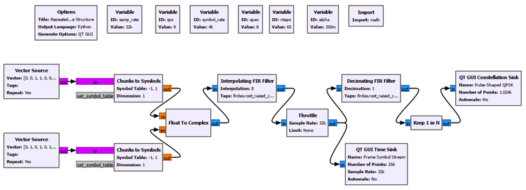

The flowgraph uses the QPSK construction developed earlier in the book. The important change is not the modulation itself. It is the **data structure** being transmitted.

### Important Setup

| Parameter | Value |
|---|---:|
| Sample rate | 32 kS/s |
| Symbol rate | 4 ksym/s |
| Samples per symbol | 8 |
| RRC roll-off factor | 0.35 |
| RRC span | 8 symbols |
| Number of RRC taps | 65 |

### What Do We Expect?

Because the transmitted data repeats, the resulting QPSK symbol pattern should also repeat. At this stage, however, the receiver is not performing frame detection.

### What Do We See?

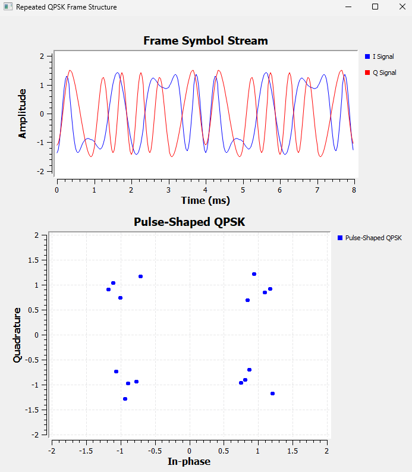

The repeated transmission gives us a known sequence that occurs periodically inside a continuous signal.

The preamble does not primarily carry new user information. Its physical purpose is to make the frame **recognizable**.

---

## 23.3 Searching for the Preamble with Correlation

We already have the DSP operation we need: **correlation**.

In Chapter 12, correlation answered:

> How similar are two signals?

Now it becomes a practical receiver tool.

```text
Poor match        -> small correlation

Partial match     -> intermediate correlation

Preamble match    -> large correlation peak
```

Let the known preamble contain \(N\) complex symbols. One form of sliding correlation is:

$$
C[k]=\sum_{n=0}^{N-1}r[k+n]p^*[n]
$$

The receiver can examine:

$$
|C[k]|
$$

When the received samples align with the known preamble, the terms reinforce one another and a correlation peak appears.

The key idea is:

> **Correlation combines evidence from the entire known sequence instead of making a decision from only one received sample.**

---

## Experiment 23.2: Detecting the Preamble with Correlation

### What Are We Trying to Discover?

Can correlation reveal the positions of the repeated preamble?

### GNU Radio Flowgraph

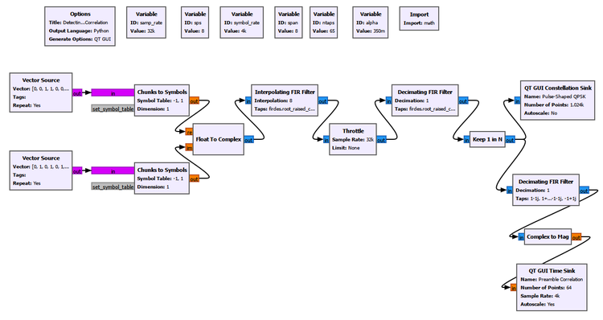

### What Do We Expect?

Because the same preamble occurs once per frame, we expect strong correlation peaks at regular intervals.

### What Do We See?

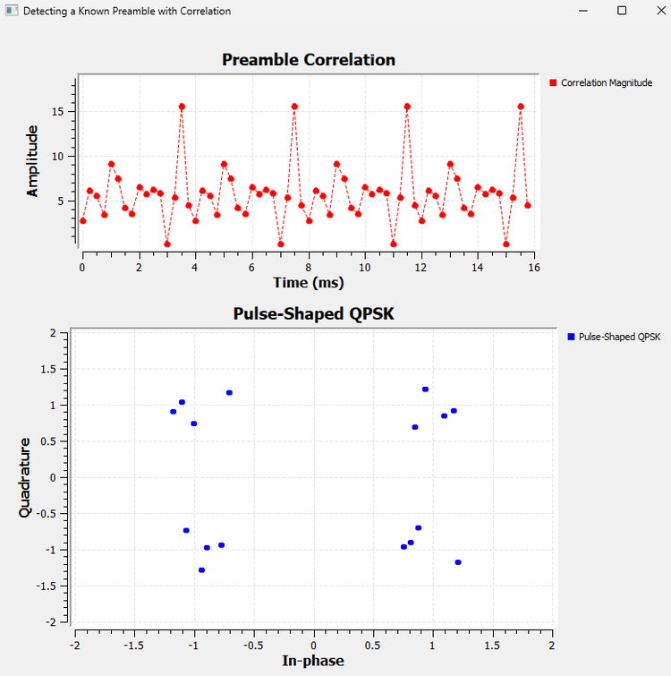

Strong peaks appear periodically. The receiver does not need to know the payload. It only needs to recognize the known sequence.

Correlation has now changed from an abstract similarity measure into a practical synchronization mechanism.

---

## 23.4 Correlation in Noise

A simple noisy received signal is:

$$
r[n]=s[n]+w[n]
$$

Noise changes individual samples, but correlation combines information from several known symbols. Random noise does not normally reinforce itself in the same structured way as the correctly aligned preamble.

This does not make correlation immune to noise. Sufficiently strong noise eventually makes detection unreliable.

---

## Experiment 23.3: Preamble Detection in Noise

### What Are We Trying to Discover?

We observe both how the recovered QPSK symbols degrade and whether the preamble correlation peaks remain recognizable.

Only the **Noise Voltage** in the Channel Model is changed.

### What Do We Expect?

As noise increases, the QPSK constellation should spread, correlation values should fluctuate, and preamble detection should eventually become more difficult.

### What Do We See?

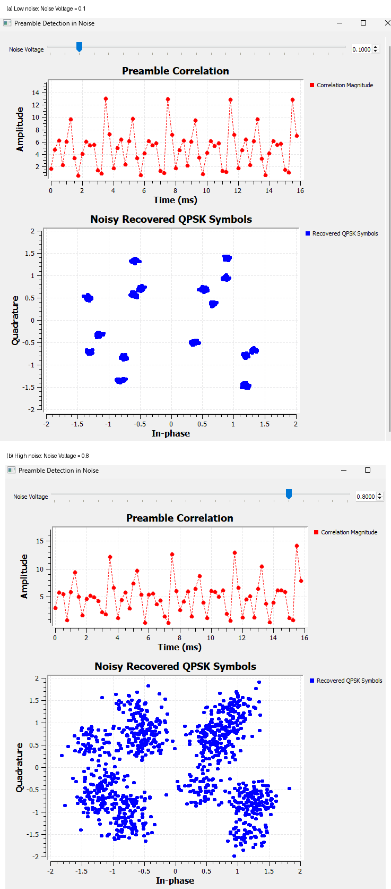

As noise increases, the QPSK points spread and the correlation response becomes more variable. Nevertheless, useful preamble peaks remain recognizable over a range of noise levels.

A human can visually identify a peak, but a receiver needs a numerical decision rule.

That motivates the **detection threshold**.

---

## 23.5 Turning a Correlation Peak into a Detection

Suppose a preamble is declared whenever:

$$
|C[k]|>T
$$

where \(T\) is the detection threshold.

A low threshold makes the detector sensitive, but payload patterns or noise fluctuations may also cross it. This can produce **false detections**.

A high threshold makes the detector selective, but a genuine corrupted preamble may fail to cross it. This produces a **missed detection**.

```text
Low threshold
      |
      v
More sensitive
      |
      +--> more genuine detections
      |
      +--> more false detections possible

High threshold
      |
      v
More selective
      |
      +--> fewer accidental detections
      |
      +--> more missed detections possible
```

There is no universal best threshold.

---

## GNU Radio Toolbox: Threshold

The **Threshold** block converts a continuous-valued input into a state determined by its Low and High levels.

Important parameters are:

```text
Low
High
Initial State
```

In this experiment it helps turn the continuous correlation information into a detection output.

The GUI also displays a separate detection-threshold reference so that the selected decision level can be compared directly with the correlation magnitude.

---

## Experiment 23.4: Effect of Detection Threshold

### What Are We Trying to Discover?

We compare thresholds that are low, useful for the current signal, and too high.

| Detection threshold | Observation |
|---:|---|
| 7 | Sensitive; more values qualify |
| 11 | Useful separation in this experiment |
| 14 | Above the genuine observed peaks |

### What Do We See?

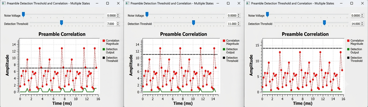

A threshold of 7 makes the detector respond readily. Around 11, the strongest preamble peaks are separated more clearly from the lower correlation values. At 14, genuine peaks do not reach the decision level and are missed.

For this experiment, **11** was a useful choice. It is not a universal value. The correct threshold depends on signal scaling, preamble length and sequence, noise, channel conditions, and the desired false-alarm versus missed-detection trade-off.

The physical meaning is simple:

> **The threshold represents how much evidence the receiver demands before accepting that the preamble has been found.**

### Try It Yourself

Predict what will happen as the threshold is moved gradually from 7 toward 14. Then add noise and repeat the test. Does the same threshold remain equally useful?

---

## Experiment 23.5: Effect of Preamble Sequence and Length

### What Are We Trying to Discover?

We compare:

1. the correct 8-symbol preamble,
2. a wrong 8-symbol preamble,
3. a shorter 4-symbol preamble.

For the final comparison, the detection threshold is **7**.

### What Do We See?

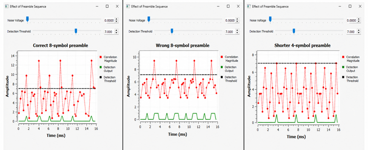

The **correct 8-symbol preamble** produces strong, clearly separated peaks.

For the wrong 8-symbol comparison, we used:

```text
[1+1j, 1-1j, -1-1j, -1+1j, 1+1j, 1-1j, -1-1j, -1+1j]
```

Its correlation response is weaker and less distinctive than the correct sequence.

The **shorter 4-symbol preamble** still produces periodic detections, but the peak magnitude is lower because fewer known symbols contribute to the correlation sum.

This gives two lessons.

First, sequence choice matters. A useful preamble should produce a distinctive correlation response.

Second, preamble length is a trade-off:

```text
Longer preamble
      |
      v
More correlation evidence
      |
      v
Potentially more reliable detection
      |
      v
More overhead
```

A shorter preamble reduces overhead but gives the receiver less evidence.

Longer is not automatically better. The sequence's correlation properties also matter.

We do not need a constellation plot for this experiment because the question concerns **preamble correlation**, not modulation quality.

---

## 23.6 From Correlation Peaks to Receiver Events

A practical receiver needs more than a plot. It needs to communicate:

> "I found the access code here."

GNU Radio can attach metadata to a particular stream position using a **stream tag**.

```text
Stream items:
... 0 1 1 0 0 1 0 1 1 0 1 1 0 0 1 0 ...
                    ^
                    |
              frame_start tag
```

The tag does not replace the stream item. It adds information about that position.

---

## GNU Radio Toolbox: Correlate Access Code - Tag

The **Correlate Access Code - Tag** block searches a bit stream for a specified binary access code and inserts a tag when it is detected.

Our important settings are:

```text
Access Code: 10110010
Threshold: 0
Tag Name: frame_start
```

Here the meaning of **Threshold** is different from the earlier correlation-magnitude threshold.

For this block:

> **Threshold is the number of access-code bit errors that may be tolerated.**

Therefore:

```text
Threshold = 0
```

requires an exact match, while:

```text
Threshold = 1
```

allows one bit mismatch.

---

## GNU Radio Toolbox: Tag Debug

The **Tag Debug** block displays stream tags in the GNU Radio console.

We use:

```text
Name: Access Code Detection
Key Filter: frame_start
Display: On
```

A typical result contains:

```text
Offset: 24
Key: frame_start
Value: 0
```

The offset identifies the stream position, the key identifies the tag, and the value can provide additional detector information.

---

## Experiment 23.6: Detecting an Access Code and Creating Frame Tags

### What Are We Trying to Discover?

We want GNU Radio to search a bit stream for a known access code and attach `frame_start` tags at the detections.

The repeated frame is:

```text
10110010 01100101
^^^^^^^^ ^^^^^^^^
access    payload
code
```

The frame length is:

$$
N_{	ext{frame}}=8+8=16	ext{ bits}
$$

### Important Settings

```text
Correlate Access Code - Tag
Access Code: 10110010
Threshold: 0
Tag Name: frame_start

Tag Debug
Name: Access Code Detection
Key Filter: frame_start
Display: On
```

### What Do We See?

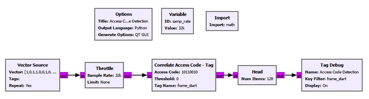

The Tag Debug output contains offsets such as:

```text
8
24
40
56
72
88
104
120
```

The spacing is:

$$
24-8=16
$$

which exactly matches the 16-bit repeated frame.

### Where Is the Tag Placed?

The detector must first receive the complete 8-bit access code before it knows that the sequence matched. In this experiment the tag therefore appears immediately **after** the access code, at the first payload bit.

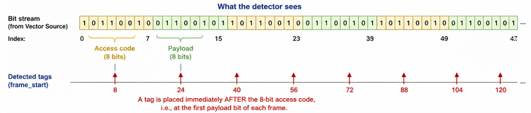

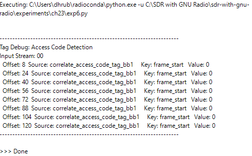

This turns frame synchronization into something concrete. GNU Radio has attached metadata to the stream indicating where the known frame landmark was detected.

---

## 23.7 Two Different Meanings of Threshold

The two thresholds used in this chapter must not be confused.

| Threshold | Meaning |
|---|---|
| Correlation detection threshold | Minimum correlation evidence required for detection |
| Correlate Access Code - Tag threshold | Maximum tolerated access-code bit errors |

A correlation threshold of 11 and an access-code threshold of 1 describe completely different quantities.

---

## Experiment 23.7: Access-Code Error Tolerance

### What Are We Trying to Discover?

What happens when one access-code bit is corrupted?

With:

```text
Threshold = 0
```

the detector requires an exact match. The one-bit-corrupted access code produces no detection output.

We then change only:

```text
Threshold = 1
```

so that one mismatch is allowed.

### What Do We See?

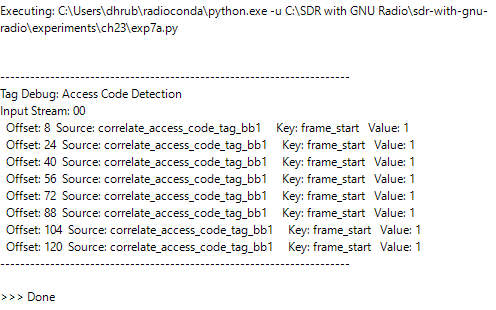

The detector now produces `frame_start` tags and reports:

```text
Value: 1
```

for the accepted one-bit mismatch.

This introduces another trade-off:

```text
Strict matching
      |
      +--> fewer accidental matches
      |
      +--> corrupted access codes may be missed

Error-tolerant matching
      |
      +--> survives some access-code errors
      |
      +--> more unintended sequences may qualify
```

### Try It Yourself

Predict what will happen before increasing the access-code threshold beyond 1. At what point does the detector become too willing to accept unintended patterns?

---

## 23.8 Putting Frame Detection into the QPSK Receiver

The direct bit-stream experiment isolated the access-code detector. We now integrate it into the communication chain.

```text
QPSK frame
    |
    v
Pulse shaping
    |
    v
Channel
    |
    v
Matched filtering
    |
    v
Symbol synchronization
    |
    v
Recovered QPSK symbols
    |
    v
Bit decisions
    |
    v
Access-code detection
    |
    v
frame_start tags
```

---

## GNU Radio Toolbox: Binary Slicer

The **Binary Slicer** converts a real-valued input into binary decisions.

Conceptually:

```text
negative value  -> 0
positive value  -> 1
```

The synchronized QPSK symbols are separated into I and Q components, and a Binary Slicer makes a bit decision on each component.

---

## GNU Radio Toolbox: Interleave

The **Interleave** block combines input streams by taking items from them in turn.

```text
Input 0:  a0  a1  a2  a3 ...
Input 1:  b0  b1  b2  b3 ...

Output:   a0  b0  a1  b1  a2  b2  a3  b3 ...
```

Here it reconstructs the serial bit sequence from the I and Q decisions.

---

## GNU Radio Toolbox: Head

The **Head** block passes only a specified number of items and then stops the flowgraph.

For the final experiment:

```text
Num Items: 128
```

This prevents the repeating source and Tag Debug block from producing an endless console output. Head does not perform synchronization; it only gives us a finite observation interval.

---

## Experiment 23.8: QPSK Frame Detection

### What Are We Trying to Discover?

Can we recover QPSK symbols, convert them back into bits, and detect the repeated frame boundary in the complete receiver?

### GNU Radio Flowgraph

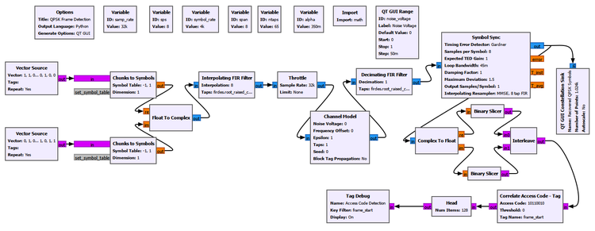

### Important Setup

| Parameter | Value |
|---|---:|
| Sample rate | 32 kS/s |
| Symbol rate | 4 ksym/s |
| Samples per symbol | 8 |
| RRC roll-off factor | 0.35 |
| RRC span | 8 symbols |
| RRC taps | 65 |
| Access code | `10110010` |
| Access-code threshold | 0 |
| Tag name | `frame_start` |
| Head | 128 items |

The Symbol Sync settings established in Chapter 22 are retained:

```text
Timing Error Detector: Gardner
Samples per Symbol: 8
Expected TED Gain: 1
Loop Bandwidth: 0.045
Damping Factor: 1
Maximum Deviation: 1.5
Output Samples/Symbol: 1
Interpolating Resampler: MMSE, 8 tap FIR
```

Frame synchronization does **not** replace timing synchronization.

Timing synchronization answers:

> Where should I sample each symbol?

Frame synchronization answers:

> Which recovered symbol or bit belongs to the beginning of the frame?

### What Do We See?

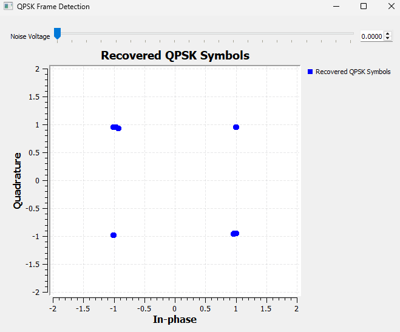

The recovered constellation forms four compact QPSK clusters.

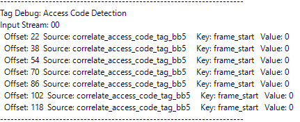

The Tag Debug output contains detections at:

```text
22
38
54
70
86
102
118
```

Again:

$$
38-22=16
$$

The spacing agrees with the 16-bit frame length.

But the first tag is now at offset 22 rather than 8.

### Why Did the Absolute Tag Offset Change?

The complete receiver contains filtering and synchronization stages that were absent from the direct-bit experiment. These stages introduce processing delay and transient behavior.

Therefore the absolute offset changes.

The important observation is:

$$
n_{k+1}-n_k=16
$$

Receiver processing can change the absolute stream position at which a detection appears while the spacing between repeated detections still reveals the correct frame structure.

---

## Experiment 23.8 Continued: Frame Detection in Noise

### What Are We Trying to Discover?

We now observe both symbol quality and frame-detection output while increasing the Channel Model noise voltage.

We compare:

```text
Noise Voltage = 0
Noise Voltage = 1.5
Noise Voltage = 2
```

The access-code detector settings remain unchanged.

### What Do We See?

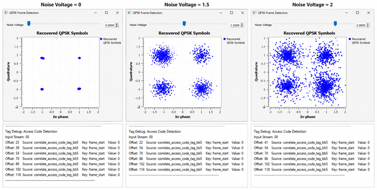

### Noise Voltage = 0

The constellation contains four compact clusters and the tags occur at:

```text
22
38
54
70
86
102
118
```

Frame synchronization works correctly.

### Noise Voltage = 1.5

The constellation spreads significantly. The detected tags are:

```text
22
54
70
86
102
118
```

The expected tag at 38 is missing.

This is a **missed detection**.

The constellation is still recognizably QPSK, yet packet-level synchronization has already begun to fail.

### Noise Voltage = 2

The constellation is much more severely dispersed. The detected offsets include:

```text
41
54
70
86
102
118
```

The normal sequence is disrupted and an unexpected detection appears at 41.

At this noise level, bit errors can destroy genuine access-code matches and can also create unintended patterns that resemble the access code.

The exact erroneous positions are not universal because the noise realization is random. The important conclusion is:

> **As bit decisions become unreliable, frame detection can suffer both missed detections and false detections.**

---

## 23.9 Why Not Simply Increase the Error Threshold?

After seeing missed detections in noise, it is natural to ask why we do not simply allow more access-code errors.

That can help genuine frames survive access-code corruption, but Experiment 23.7 showed the cost.

```text
More error tolerance
        |
        +--> fewer missed detections from corrupted preambles
        |
        +--> greater chance of accidental matches
```

There is no free correction. Access-code length, sequence, and tolerated errors must be chosen according to expected channel conditions and acceptable false-detection behavior.

---

## 23.10 Preamble, Access Code, and `frame_start`

These related terms should remain distinct.

A **preamble** is a known sequence transmitted to help the receiver with detection or synchronization.

An **access code** is the known binary pattern searched for by the GNU Radio access-code detector. In our experiments:

```text
10110010
```

was the access code.

`frame_start` is not transmitted over the channel. It is a **GNU Radio stream-tag key created inside the receiver** after detection.

```text
Transmitter:

Access code | Payload
10110010    | 01100101


Receiver:

Recovered bits
      |
      v
Find 10110010
      |
      v
Attach metadata:
frame_start
```

The transmitter sends the preamble or access code. The receiver creates the `frame_start` tag.

---

## 23.11 Physical Meaning of Frame Synchronization

Imagine a receiver continuously listening to a radio channel.

Samples keep arriving. After carrier and timing recovery, symbols keep arriving. After decisions, bits keep arriving.

But the receiver still needs to know which bits belong together.

The preamble provides a landmark. Correlation searches for that landmark. The detection rule decides whether the evidence is strong enough. A stream tag can then record the detected position for later receiver stages.

```text
Known sequence inserted by transmitter
               |
               v
Signal travels through the channel
               |
               v
Receiver recovers symbols / bits
               |
               v
Receiver searches for known sequence
               |
               v
Known sequence detected
               |
               v
Frame position identified
               |
               v
Payload interpreted relative to that position
```

Frame synchronization converts a continuous received stream into structured communication.

---

## 23.12 Frame Synchronization Does Not Guarantee Correct Data

A detected frame boundary tells us **where the frame is**.

It does not prove that every payload bit is correct.

For example:

```text
Transmitted payload: 01100101
Received payload:    01101101
                         ^
                         error
```

Frame synchronization asks:

> Where is the frame?

Error detection asks:

> Was the frame received correctly?

Error correction asks:

> Can some errors be repaired?

These are different receiver functions.

---

## 23.13 Putting It All Together

The chapter developed frame synchronization progressively:

```text
Continuous symbol stream
          |
          v
Create repeated frames
          |
          v
Insert a known preamble
          |
          v
Search using correlation
          |
          v
Observe correlation peaks
          |
          v
Introduce a detection threshold
          |
          v
Study false and missed detections
          |
          v
Compare preamble sequences and lengths
          |
          v
Detect a binary access code
          |
          v
Create frame_start stream tags
          |
          v
Allow controlled access-code errors
          |
          v
Integrate detection into a QPSK receiver
          |
          v
Observe frame-detection failure in noise
```

Correlation, first introduced as a general DSP tool, has become a synchronization mechanism.

Timing synchronization determines useful symbol sampling instants. Symbol decisions recover bits. Frame synchronization then organizes those bits around recognizable boundaries.

The receiver is becoming progressively more complete.

---

## 23.14 Practical SDR Perspective

Real radio systems often use carefully designed synchronization sequences rather than arbitrary preambles.

Their design may consider:

- autocorrelation properties,
- cross-correlation properties,
- preamble length,
- false-alarm probability,
- detection probability,
- channel distortion,
- carrier offset,
- timing uncertainty,
- multipath,
- computational complexity.

Sequences such as Barker sequences, Gold codes, and Zadoff-Chu sequences appear in different communication and ranging systems because sequence design can strongly affect synchronization performance.

We will not develop those sequence families here. The fundamental principle established by our experiments is:

> **A receiver can detect structure in an unknown stream by searching for a known transmitted pattern.**

---

## 23.15 Try It Yourself: Design Your Own Frame Detector

Start from Experiment 23.8 and predict each result before changing the flowgraph.

1. Change the 8-bit access code while leaving the transmitted frame unchanged.
2. Restore the correct code and increase the allowed access-code error threshold.
3. Increase the noise until detections become unreliable.
4. Change the payload and observe whether accidental access-code-like patterns appear.
5. Increase the Head length and observe many more frames.

A detector that succeeds once is not necessarily a reliable detector. Practical synchronization must work repeatedly under changing channel conditions.

---

## 23.16 What We Learned

In this chapter, we learned that:

- timing synchronization and frame synchronization solve different problems;
- timing synchronization determines **when to sample**, while frame synchronization determines **where structured data begins**;
- a known preamble gives the receiver a recognizable landmark;
- correlation can search the received stream for that known sequence;
- a correctly aligned preamble produces a strong correlation response;
- correlation can remain useful in noise because it combines evidence across multiple known symbols;
- a correlation detection threshold trades sensitivity against false and missed detections;
- the useful threshold depends on the actual signal and channel conditions;
- preamble sequence choice and preamble length affect the correlation response;
- shorter preambles reduce overhead but provide less correlation evidence in our experiment;
- GNU Radio stream tags attach metadata to positions in a stream;
- `Correlate Access Code - Tag` can detect a known binary access code and create a `frame_start` tag;
- the access-code threshold represents tolerated bit mismatches, not correlation magnitude;
- with threshold 0, a one-bit-corrupted access code was rejected;
- with threshold 1, the one-bit-corrupted access code was accepted;
- our direct 16-bit repeated frame produced tags separated by 16 items;
- the access-code tag appears after the detected code in the direct-bit experiment;
- receiver filtering and synchronization can change absolute tag offsets;
- the spacing between repeated tags can still reveal the correct frame length;
- a complete QPSK receiver can recover symbols, make bit decisions, detect an access code, and mark frame boundaries;
- increasing noise can cause missed frame detections;
- sufficiently severe noise can also produce unintended detections;
- frame synchronization identifies the frame boundary but does not guarantee that the payload bits are correct.

The receiver now knows more than how to recover a waveform or symbol. It has begun to understand the **structure of the transmitted information**.

---

## 23.17 Connecting to the Next Chapter

Our receiver can now detect a known access code and identify repeated frame boundaries.

But noise can still corrupt payload bits.

Suppose the transmitter sends:

```text
01100101
```

and the receiver decides:

```text
01101101
```

How does the receiver know that an error occurred?

And if it knows an error occurred, can it do anything about it?

These questions lead naturally to **error detection and forward error correction**.

In the next chapter, we will investigate why communication systems deliberately transmit redundant bits, how those bits can reveal transmission errors, and how carefully designed coding can sometimes allow the receiver to correct errors without retransmitting the data.
