# Chapter 24: Building a Complete Single-Carrier Digital Receiver

In the previous chapters, we developed the major functions of a digital receiver one at a time.

We learned how pulse shaping and matched filtering control the waveform, how a wireless channel introduces attenuation, noise, carrier-frequency offset, timing mismatch, and multipath, how an equalizer can reduce inter-symbol interference, how carrier synchronization removes carrier-frequency and phase errors, how symbol timing synchronization finds the correct sampling instants, and how frame synchronization locates meaningful data inside a recovered bit stream.

Each of those ideas was easier to understand when studied separately.

A real receiver, however, cannot solve these problems one at a time in separate experiments. The same received waveform passes through several receiver stages, and those stages must work together.

That raises the central question of this chapter:

> **What happens when all of the receiver functions developed in the previous chapters are combined into one digital communication system?**

This chapter answers that question experimentally.

We will begin with an ideal end-to-end QPSK link, integrate timing and carrier recovery, introduce multipath and equalization, recover a known message rather than merely observing a constellation, and finally deliberately remove important receiver functions to see how the complete system fails.

The goal is not simply to build a larger GNU Radio flowgraph. The goal is to understand the hierarchy of a receiver:

```text
Signal recovery
      ↓
Symbol recovery
      ↓
Information recovery
```

A receiver may succeed at one level and still fail at the next. One of the most important lessons of this chapter will therefore be that a clean eye diagram or a clean constellation is not, by itself, proof that the transmitted information has been recovered correctly.

---

## 24.1 From Separate Receiver Functions to a Complete Receiver

A useful conceptual view of the receiver developed across the previous chapters is

```text
Received IQ
    ↓
Matched Filtering
    ↓
Timing Recovery
    ↓
Carrier Recovery
    ↓
Channel Equalization, when required
    ↓
Symbol Decisions
    ↓
Bit Recovery
    ↓
Frame Detection
    ↓
Payload Recovery
```

This diagram is a useful guide, but it should not be interpreted as a universal law specifying the only possible order of every receiver algorithm. Practical receiver architectures depend on the modulation, synchronization algorithms, acquisition strategy, sample rate, channel conditions, and implementation.

That point becomes important in this chapter because we will experimentally discover that two individually working synchronization blocks do not necessarily work equally well in every ordering.

We also do not add blocks merely because they appear in a textbook receiver diagram. For example, practical radios often include automatic gain control and additional channel-select filtering. Those functions are important when their corresponding problems are present, but they are not required to answer the questions investigated here. Our flowgraphs therefore contain only the functions needed for the impairments we deliberately introduce.

---

## 24.2 Experiment 24.1: Establishing the Ideal End-to-End Digital Link

Before combining synchronization loops and channel impairments, we need a reference case.

If the ideal system does not work, any later failure becomes ambiguous. We would not know whether the problem came from the channel impairment, the synchronization algorithm, the receiver ordering, or simply an incorrect baseline implementation.

### 24.2.1 Building the Baseline

The first experiment uses QPSK with root-raised-cosine pulse shaping and matched filtering.

The main parameters are

| Parameter | Value |
|---|---:|
| Sample rate | 32 kHz |
| Symbol rate | 1 ksymbol/s |
| Samples per symbol | 32 |
| RRC roll-off factor | 0.35 |
| Filter span | 8 symbols |
| Number of RRC taps | 257 |

Two independent random binary sources generate the in-phase and quadrature data. Each bit is mapped to either `-1` or `+1`, and the two real streams are combined into a complex QPSK signal. The transmitter RRC filter interpolates by 32, while the receiver RRC filter performs matched filtering.

For this ideal experiment, a fixed `Keep 1 in N` sampler selects one sample from every 32 matched-filter output samples.

The resulting flowgraph is shown below.

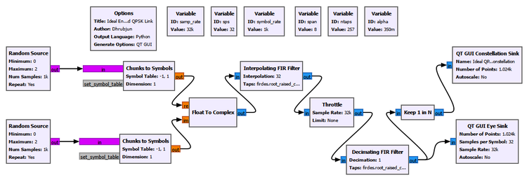

Random data are deliberately used here rather than a very short repeating pattern. A short deterministic pattern contains only a limited set of symbol transitions and can therefore produce an incomplete-looking eye diagram. Random data exercise many more transitions and provide a better baseline view of the pulse-shaped waveform.

### 24.2.2 What Should We Expect?

With no noise, carrier offset, timing mismatch, or multipath, the matched-filter output should contain well-defined symbol intervals.

The I- and Q-channel eye diagrams should therefore have clear openings, and the samples selected at the correct symbol instants should form four compact QPSK clusters.

The experimental result is shown below.

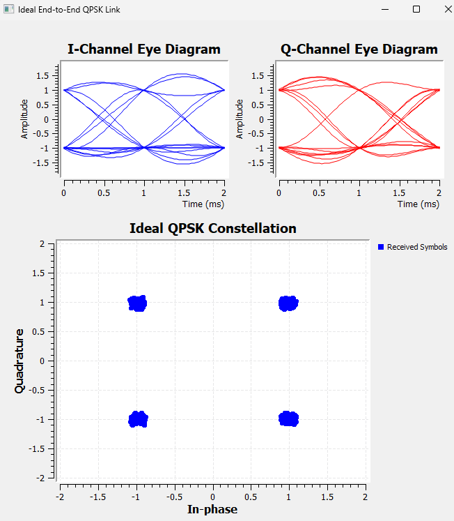

The eyes are open and the constellation contains four tight clusters near the expected QPSK points.

This establishes the ideal baseline.

### 24.2.3 An Eye Diagram and a Constellation Are Not the Same Measurement

It is tempting to treat an open eye and a clean constellation as two ways of showing the same thing. They are not.

The eye diagram overlays portions of the **oversampled waveform**. It tells us about possible sampling instants, timing margin, waveform transitions, and inter-symbol interference.

The constellation displays the **complex samples actually presented at particular sampling instants**. It therefore tells us about symbol locations and can reveal carrier phase or frequency errors, noise, residual ISI, and incorrect sampling.

This distinction becomes essential later in the chapter.

A receiver can have an eye that still contains useful timing information while its I and Q components appear badly smeared because of carrier rotation. Conversely, four recognizable constellation regions do not automatically prove that the original bits or frame have been recovered correctly.

The location of a diagnostic sink in the receiver chain therefore matters just as much as the appearance of its plot.

---

## 24.3 Experiment 24.2: Integrating Carrier and Timing Recovery

Carrier synchronization and symbol timing synchronization were studied separately in Chapters 21 and 22. We now ask a different question:

> **Can the two synchronization systems operate successfully as parts of the same receiver?**

This is an integration experiment rather than a repetition of those chapters.

The signal parameters are changed to the values used in our later synchronization experiments:

| Parameter | Value |
|---|---:|
| Sample rate | 32 kHz |
| Symbol rate | 4 ksymbol/s |
| Samples per symbol | 8 |
| RRC roll-off factor | 0.35 |
| Filter span | 8 symbols |
| Number of RRC taps | 65 |

The transmitter still generates random QPSK data and uses RRC pulse shaping.

A GNU Radio Channel Model is now placed between transmitter and receiver so that carrier-frequency offset, sample-rate mismatch, and noise can be controlled independently.

### 24.3.1 Carrier-Frequency Offset in the Channel Model

The Channel Model expresses frequency offset as a fraction of the sample rate.

If the physical carrier-frequency offset is $\Delta f$ and the sample rate is $F_s$, the normalized frequency offset is

$$f_{\mathrm{norm}}=\frac{\Delta f}{F_s}$$

For a 200 Hz offset at a 32 kHz sample rate,

$$f_{\mathrm{norm}}=\frac{200}{32000}=0.00625$$

Therefore, the Channel Model setting

```text
Frequency Offset: 0.00625
```

represents a 200 Hz carrier-frequency offset in this experiment.

The Channel Model parameter `Epsilon` controls the relative sample-rate mismatch. An important detail is

```text
No sample-rate mismatch: Epsilon = 1.0
```

not zero.

Values slightly different from one model a transmitter and receiver whose sampling clocks do not run at exactly the same rate.

### 24.3.2 Integrating the Synchronization Loops

The receiver uses the matched filter developed earlier, followed by GNU Radio's Symbol Sync and Costas Loop.

The Symbol Sync settings are

```text
Timing Error Detector: Gardner
Samples per Symbol: 8
Expected TED Gain: 1
Loop Bandwidth: 0.045
Damping Factor: 1
Maximum Deviation: 1.5
Output Samples/Symbol: 1
Interpolating Resampler: MMSE, 8-tap FIR
```

The Costas Loop uses

```text
Loop Bandwidth: 0.0314159
Order: 4
Use SNR: No
```

An important integration lesson appeared while developing this receiver.

Our first arrangement was

```text
Matched Filter
      ↓
Costas Loop
      ↓
Symbol Sync
```

Even with an ideal channel, this arrangement produced a ring-like constellation rather than four stable QPSK clusters.

We therefore tested the stages individually. Symbol Sync alone produced the expected four clusters. The Costas Loop was also capable of recovering QPSK when used with a suitable symbol-rate input. Reversing the integrated order to

```text
Matched Filter
      ↓
Symbol Sync
      ↓
Costas Loop
```

produced a stable constellation.

This does **not** establish a universal rule that timing recovery must always precede carrier recovery. Receiver ordering depends on the algorithms and signal conditions. What the experiment demonstrates is more general:

> **Receiver blocks that work correctly in isolation can interact when they are combined. Integration must therefore be tested, not merely assumed.**

In our implementation, Symbol Sync first selects useful symbol-rate samples from the oversampled pulse-shaped waveform. The Costas Loop then operates on those recovered QPSK symbol samples.

The final integrated flowgraph is shown below.

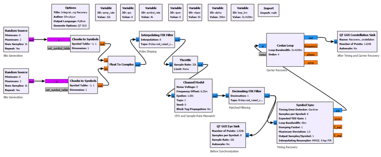

The Eye Sink is connected after the matched filter but **before** synchronization. The Constellation Sink is connected after Symbol Sync and the Costas Loop.

That placement is deliberate. It allows us to compare what arrives at the synchronization system with what emerges after correction.

### 24.3.3 Ideal Integrated Receiver

We first remove all impairments:

```text
Noise Voltage: 0
Frequency Offset: 0
Epsilon: 1.0
Taps: 1
```

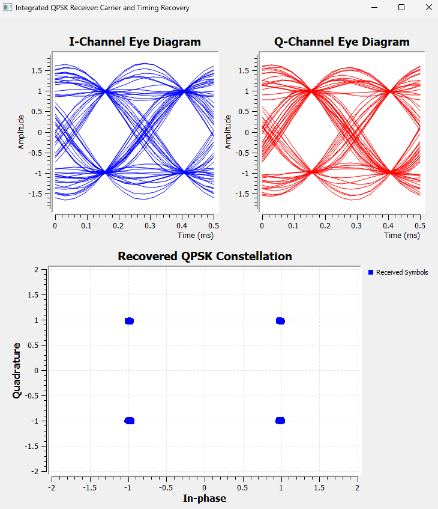

The pre-synchronization eye diagrams are open, and the final constellation contains four compact clusters. The two synchronization blocks therefore operate correctly together under ideal conditions.

### 24.3.4 Timing Mismatch

We next change only the sample-rate mismatch.

```text
Frequency Offset: 0
Epsilon: 1.001
Noise Voltage: 0
Taps: 1
```

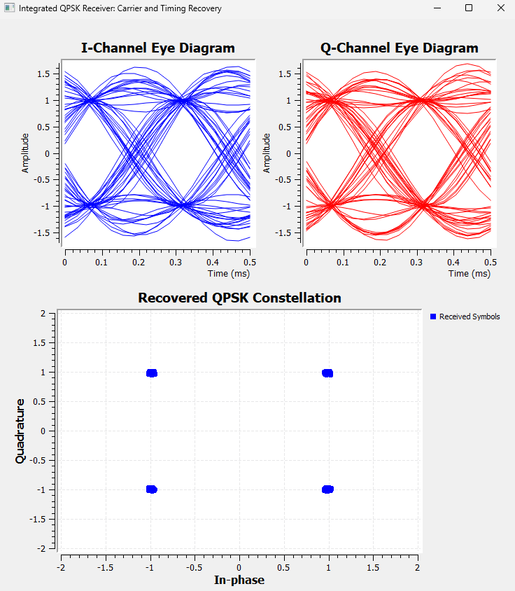

The eye diagram is measured before Symbol Sync, so it reveals the incoming timing drift. The final constellation, however, remains well organized because Symbol Sync continuously adjusts the effective sampling instant.

This is an important distinction between a fixed timing offset and a clock mismatch. A fixed offset can be corrected once. A sample-rate mismatch continually accumulates, so the receiver must **track** it.

### 24.3.5 Carrier-Frequency Offset

We now restore `Epsilon = 1.0` and introduce a 200 Hz CFO.

```text
Frequency Offset: 0.00625
Epsilon: 1.0
Noise Voltage: 0
Taps: 1
```

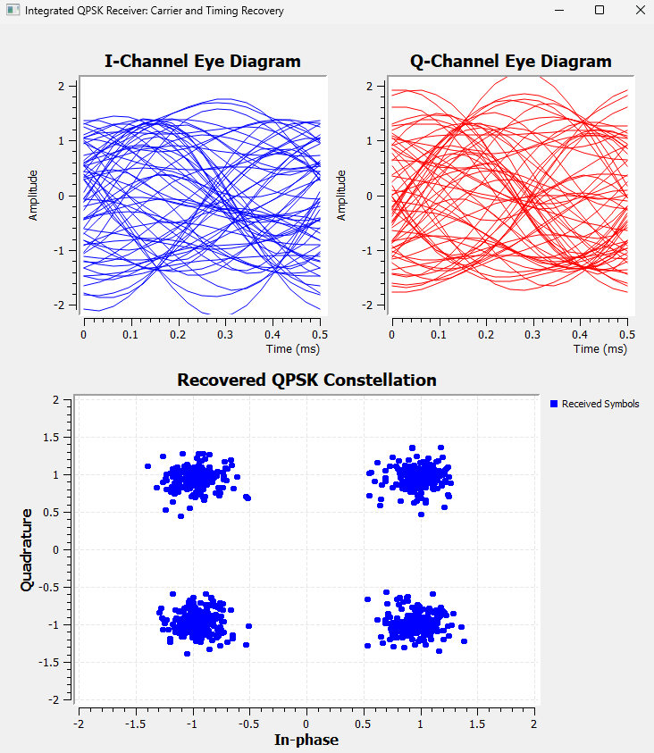

The I- and Q-channel eye diagrams now look dramatically worse, even though the final constellation still contains four recognizable QPSK clusters.

Why?

A carrier-frequency offset continuously rotates the complex baseband signal:

$$r(t)=s(t)e^{j2\pi\Delta f t}$$

If the original complex signal is

$$s(t)=I(t)+jQ(t)$$

the rotating carrier reference mixes the two components:

$$I'(t)=I(t)\cos(2\pi\Delta f t)-Q(t)\sin(2\pi\Delta f t)$$

$$Q'(t)=I(t)\sin(2\pi\Delta f t)+Q(t)\cos(2\pi\Delta f t)$$

The Eye Sink is observing fixed I and Q axes **before carrier recovery**. Because the constellation is rotating relative to those axes, many different projections are overlaid in the eye display.

Therefore, a smeared I/Q eye in this case does **not** mean that timing recovery has failed.

The Costas Loop later removes the carrier rotation, allowing the final constellation to settle into recognizable QPSK regions.

### 24.3.6 CFO and Timing Mismatch Together

The next test combines the two deterministic impairments:

```text
Frequency Offset: 0.00625
Epsilon: 1.001
Noise Voltage: 0
Taps: 1
```

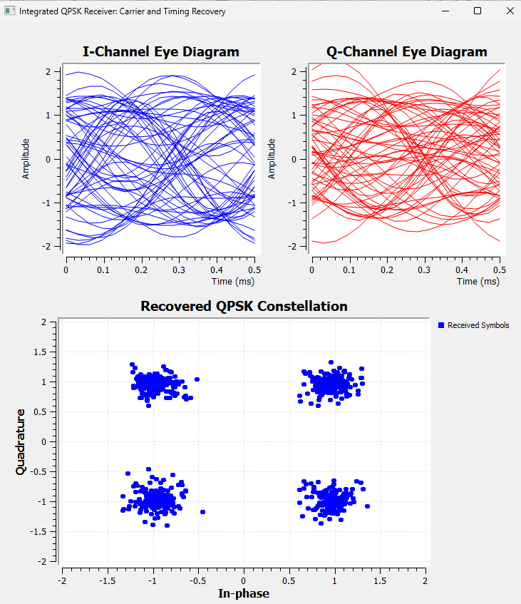

The pre-synchronization eyes remain heavily smeared. The final constellation, however, retains four separated regions.

In this particular test, the dramatic appearance of the pre-synchronization eye is dominated by the carrier rotation, while Symbol Sync is still able to track the relatively small sample-rate mismatch.

The result demonstrates why receiver plots must be interpreted according to both the impairment and the point at which the measurement is taken.

### 24.3.7 Adding Noise

We next isolate additive noise.

For moderate noise,

```text
Noise Voltage: 0.5
Frequency Offset: 0
Epsilon: 1.0
Taps: 1
```

the result is

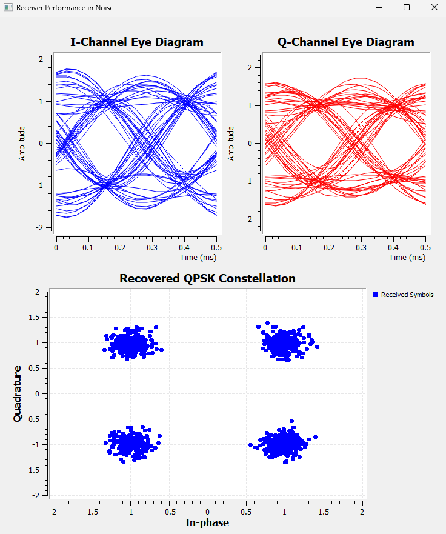

The eyes remain recognizable but their traces become thicker. The constellation still contains four clear clusters, but each ideal point has become a cloud.

Increasing the noise to

```text
Noise Voltage: 1.0
```

gives

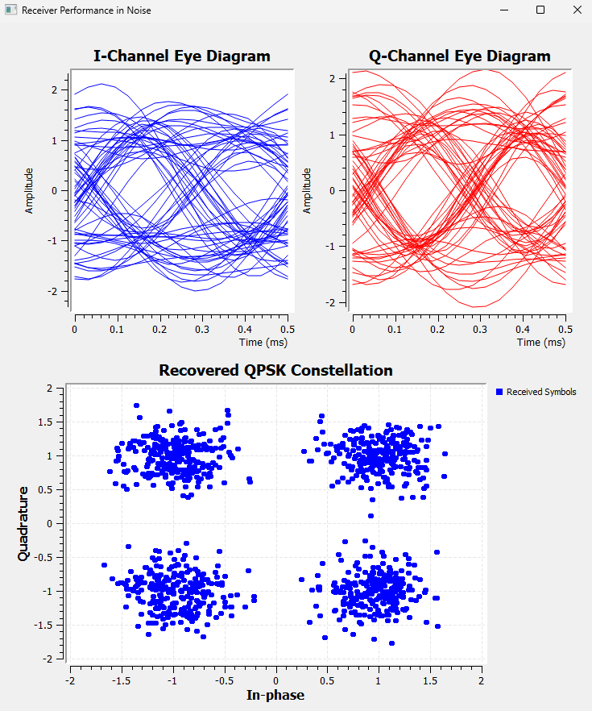

The eye becomes much fuzzier and the constellation clouds spread farther from their ideal locations.

This behavior is fundamentally different from synchronization errors.

A deterministic carrier-frequency offset can be estimated and tracked. A systematic timing mismatch can also be tracked. Random noise cannot simply be "undone" by a synchronization loop. As the noise becomes stronger, some received samples eventually cross decision boundaries and produce incorrect symbols.

### Try It Yourself

Before changing the flowgraph, predict what will happen if `Epsilon` is changed from `1.001` to `1.01` while the CFO and noise remain zero.

Then run the experiment.

Does the pre-synchronization eye show stronger timing drift? Does Symbol Sync still produce recognizable QPSK clusters? This is a useful way to explore the difference between the appearance of the incoming waveform and the performance of the timing-recovery loop.

---

## 24.4 Experiment 24.3: Adding Multipath and Equalization

Noise, CFO, and timing mismatch do not all damage a signal in the same way.

Carrier-frequency offset rotates the complex signal.

Sample-rate mismatch changes the relationship between the received waveform and the receiver's sampling instants.

Noise adds random perturbations.

Multipath introduces something different: **channel memory**.

A delayed copy of one symbol can overlap later symbols, producing inter-symbol interference.

### 24.4.1 Constructing a Controlled Multipath Channel

Instead of using a general channel model, we construct a simple echo manually so that the physical meaning remains visible.

The transmitted signal is split into two paths:

```text
                ┌───────────────────────────────┐
Transmitted ────┤                               ├──→ Add
signal           └→ Delay 8 → Gain 0.5 ─────────┘
```

At 8 samples per symbol, a delay of 8 samples is exactly one symbol period.

The channel therefore contains

- one direct path, and
- one delayed path arriving one symbol later with half the amplitude.

This is intentionally simple, but it captures the central mechanism of multipath-induced ISI.

### 24.4.2 Receiver Without Equalization

The first version uses matched filtering, timing recovery, and carrier recovery but no equalizer.

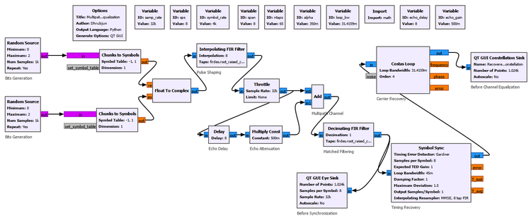

The resulting constellation is not merely a random cloud. The delayed symbol combines with the current symbol in a structured way, producing arcs and multiple trajectories.

That distinction matters.

Noise produces random spreading around the ideal points. Multipath produces structured distortion because the current received sample depends on both the current and previous transmitted symbols.

### 24.4.3 Adding the Adaptive Equalizer

We now add the adaptive equalizer developed in Chapter 20 after the synchronization stages.

The important settings are

```text
Linear Equalizer
    Num Taps: 5
    Input Samples per Symbol: 1

Adaptive Algorithm LMS
    Step Size: 0.005
```

The QPSK reference constellation is

```text
[1+1j, -1+1j, -1-1j, 1-1j]
```

This detail is important. The reference constellation used by the decision-directed equalizer must match the scale and locations of the actual transmitted symbols. A normalized constellation at approximately `±0.707 ± j0.707` would not match a transmitter using `±1 ± j`.

The equalized receiver is shown below.

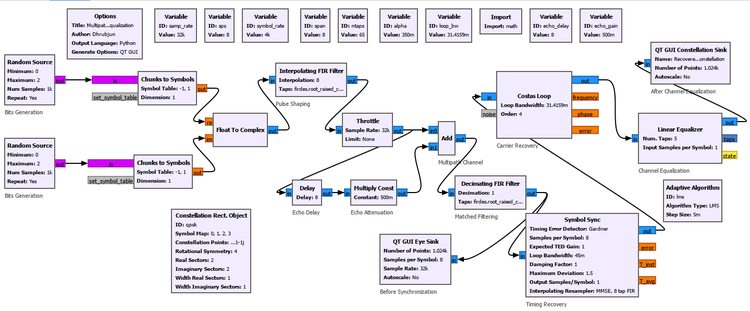

For this implementation, the stable ordering was

```text
Matched Filter
      ↓
Symbol Sync
      ↓
Costas Loop
      ↓
Linear Equalizer
      ↓
Constellation
```

Again, this is an experimentally successful architecture for our system rather than a claim that all receivers must use this exact ordering.

### 24.4.4 Before and After Equalization

The comparison below shows the effect clearly.

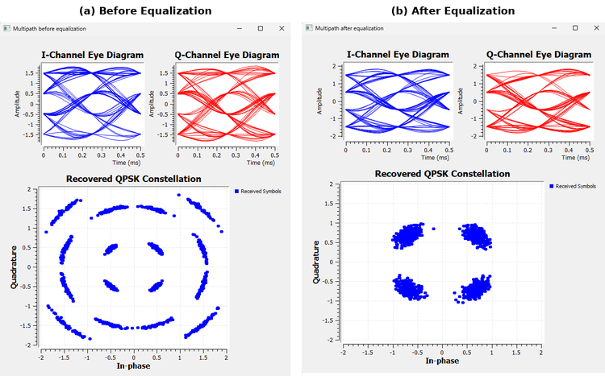

Before equalization, the constellation contains strong structured ISI. After equalization, the four QPSK regions become much tighter.

The Eye Sink in this experiment remains connected after the matched filter and before the equalizer. Therefore, the displayed eye does not suddenly become clean merely because the final constellation improves.

This is another example of the diagnostic-location principle:

> **A downstream correction cannot change a plot measured upstream of that correction.**

The equalizer improves the samples presented to the symbol decision process. It does not retroactively alter the matched-filter waveform being displayed by an earlier Eye Sink.

---

## 24.5 Experiment 24.4: Recovering an Actual Message

So far, much of our definition of success has been visual.

An open eye is good.

Four clean QPSK clusters are good.

But a communication receiver ultimately has a more demanding job:

> **It must recover the information that was transmitted.**

This experiment therefore replaces the random data with a known frame and follows the receiver all the way from the transmitted bits to a recovered text message.

### 24.5.1 Building a Known Frame

We use a 40-bit frame consisting of a 16-bit preamble and a 24-bit payload.

The preamble is

```text
1101001110010110
```

The payload is the ASCII text

```text
SDR
```

whose binary representation is

```text
S = 01010011
D = 01000100
R = 01010010
```

The complete frame is therefore

```text
1101001110010110 | 01010011 01000100 01010010
      preamble   |    S        D        R
```

or

```text
1101001110010110010100110100010001010010
```

The frame contains 40 bits, corresponding to 20 QPSK symbols.

A repeating Vector Source generates

```text
[1,1,0,1,0,0,1,1,1,0,0,1,0,1,1,0,
 0,1,0,1,0,0,1,1,
 0,1,0,0,0,1,0,0,
 0,1,0,1,0,0,1,0]
```

A `Repack Bits` block converts the one-bit input items into two-bit QPSK symbol indices.

The transmitter settings are

```text
Repack Bits
    Bits per input byte: 1
    Bits per output byte: 2
    Endianness: LSB
```

With LSB-first packing, an input pair $(b_0,b_1)$ produces the two-bit value

$$k=b_0+2b_1$$

so the bit pairs are packed as

| Input bits | Packed index |
|---|---:|
| `00` | 0 |
| `01` | 2 |
| `10` | 1 |
| `11` | 3 |

The QPSK symbol table is

```text
[1+1j, -1+1j, -1-1j, 1-1j]
```

### 24.5.2 The Complete Receiver

The complete flowgraph is shown below.

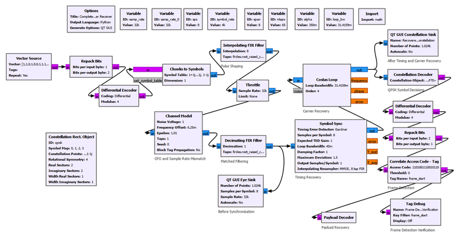

The receiver performs

```text
Matched Filtering
      ↓
Timing Recovery
      ↓
Carrier Recovery
      ↓
QPSK Symbol Decisions
      ↓
Differential Decoding
      ↓
Bit Recovery
      ↓
Frame Detection
      ↓
Payload Recovery
```

The receiver `Repack Bits` block performs the inverse conversion:

```text
Bits per input byte: 2
Bits per output byte: 1
Endianness: LSB
```

The frame synchronizer uses

```text
Correlate Access Code - Tag
    Access Code: 1101001110010110
    Threshold: 0
    Tag Name: frame_start
```

With the ideal channel, repeated `frame_start` tags appeared 40 bits apart, exactly matching the 40-bit transmitted frame length.

### GNU Radio Toolbox: Differential Encoder and Differential Decoder

When the complete receiver was first tested with carrier-frequency offset, an important practical issue appeared.

The Costas Loop could remove the continuous rotation caused by CFO and still leave the QPSK constellation with an absolute phase ambiguity.

For QPSK, rotations separated by 90 degrees produce geometrically valid QPSK constellations. A Costas Loop can therefore lock to one of several equivalent phase states.

The constellation may look perfectly clean while the absolute symbol labels are different.

That means

> **A clean QPSK constellation does not necessarily imply that the original bits are correct.**

This matters only when we move from symbol recovery to actual information recovery.

To make the information insensitive to this constant phase ambiguity, we add GNU Radio's Differential Encoder and Differential Decoder.

Both use

```text
Coding: Differential
Modulus: 4
```

The modulus is four because QPSK has four symbol states.

The transmitter becomes

```text
Known bits
    ↓
Repack 1 → 2
    ↓
Differential Encoder
    ↓
QPSK Mapping
```

and the receiver contains

```text
QPSK Symbol Decisions
    ↓
Differential Decoder
    ↓
Repack 2 → 1
```

The central idea is simple: differential coding represents information through the **change between successive symbol states** rather than relying only on the absolute QPSK orientation.

A constant 90-degree ambiguity can change the absolute symbol labels, but it does not destroy the relative symbol changes in the same way.

Differential coding does **not** replace carrier recovery. If the carrier is continuously rotating because CFO has not been corrected, stable symbol decisions are still lost. We will demonstrate this distinction in Experiment 24.5.

### 24.5.3 Ideal Information Recovery

We first use an ideal channel:

```text
Noise Voltage: 0
Frequency Offset: 0
Epsilon: 1.0
Taps: 1
```

The eye diagrams and constellation are shown below.

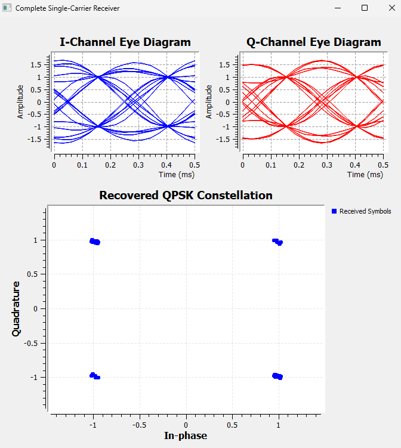

Because the known 40-bit frame repeats, the eye diagram contains fewer distinct trajectories than the random-data eye in Experiment 24.1. This is expected. A short deterministic frame contains fewer transition combinations than a long random sequence.

The constellation nevertheless contains four very tight QPSK clusters.

More importantly, the receiver now proves success at the information level:

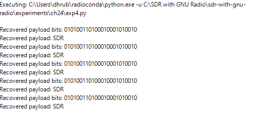

The recovered bits are

```text
010100110100010001010010
```

which decode to

```text
SDR
```

For the first time in this chapter, success is no longer defined only by the appearance of a signal-processing plot. The receiver has recovered the intended message.

### 24.5.4 Recovering the Payload with Carrier-Frequency Offset

We now introduce the same 200 Hz CFO used earlier:

```text
Frequency Offset: 0.00625
```

With differential encoding and decoding enabled, the receiver can recover the payload even though the Costas Loop may settle with a QPSK phase ambiguity.

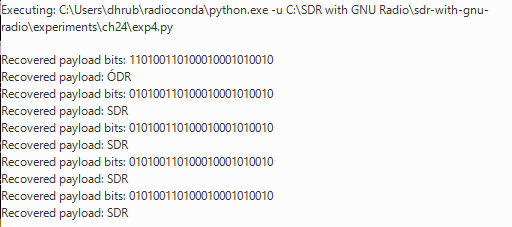

In one run, the first detected payload contained a single incorrect bit, while the following frames repeatedly recovered `SDR`.

This is a useful practical observation.

Synchronization loops generally require an **acquisition interval** after the receiver starts. During acquisition, the internal timing and carrier estimates are still converging. Once the loops settle, the receiver enters **tracking**, where it follows the remaining changes around the locked state.

We should not interpret the particular first-frame error as a fixed property of every run. The important observation is that after acquisition the receiver repeatedly recovered the correct payload.

### 24.5.5 Multiple Impairments Together

We next combine several impairments:

```text
Frequency Offset: 0.00625
Epsilon: 1.01
Noise Voltage: 0.5
Taps: 1
```

This corresponds to

- 200 Hz CFO,
- a 1% sample-rate mismatch, and
- moderate additive noise.

The receiver continued to recover the `SDR` payload repeatedly.

This is an important integration result. Carrier recovery, timing recovery, differential decoding, bit recovery, and frame synchronization are no longer being tested separately. They are operating together on the same impaired waveform.

### 24.5.6 When Noise Becomes Too Strong

We then keep the CFO and timing mismatch unchanged and compare two noise levels.

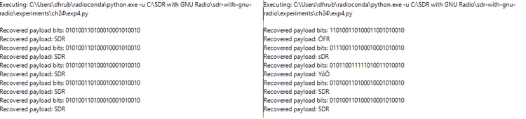

At

```text
Noise Voltage: 0.5
```

all five observed payloads were recovered correctly as `SDR`.

At

```text
Noise Voltage: 1.0
```

several observed payloads contained incorrect characters, although some complete `SDR` frames were still recovered.

This is the information-level consequence of the constellation spreading observed earlier.

Synchronization algorithms can compensate for structured impairments within their operating range, but they cannot remove arbitrary random noise. Once enough received symbols cross decision boundaries, incorrect bits enter the frame and the payload becomes corrupted.

The value `1.0` should not be interpreted as a universal threshold. It is simply the observed behavior of this particular experiment with its chosen signal scaling and receiver settings.

### 24.5.7 Payload Decoder Implementation

The final Payload Decoder is implemented with a small Embedded Python Block.

Its job is intentionally limited. It watches for the `frame_start` tag generated by the GNU Radio frame synchronizer, collects the following 24 payload bits, groups them into three 8-bit bytes, converts those bytes to ASCII, and prints the recovered text.

The script does **not** perform carrier recovery, timing recovery, symbol decisions, differential decoding, or frame detection. Those functions are already completed by the GNU Radio receiver before the payload reaches the script.

The reference implementation is provided with the experiment files as

```text
experiments/ch24/ch24_exp04_payload_decoder.py
```

Keeping the application-level payload extraction separate helps preserve an important architectural distinction: the DSP receiver recovers and synchronizes the communication stream, while the small script simply interprets the already recovered payload.

---

## 24.6 Experiment 24.5: Diagnosing Receiver Failures

We now have something we did not have at the beginning of the chapter: a receiver that we know can recover the transmitted information.

That allows us to ask a powerful diagnostic question:

> **What happens if one required receiver function is deliberately removed?**

Rather than adding another algorithm, we now break the receiver one stage at a time.

### 24.6.1 Removing Carrier Recovery

For the first failure test, the channel contains a 200 Hz CFO:

```text
Noise Voltage: 0
Frequency Offset: 0.00625
Epsilon: 1.0
Taps: 1
```

Timing recovery remains enabled, but the Costas Loop is bypassed.

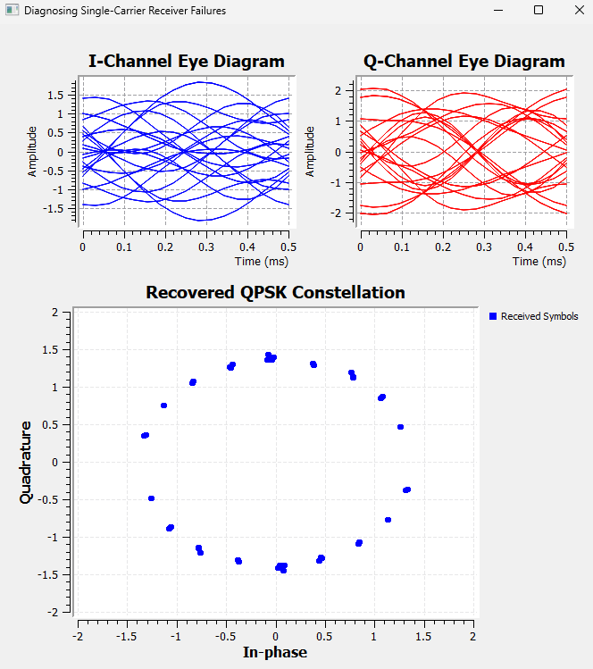

Instead of four stationary QPSK clusters, the constellation forms points distributed around a ring.

This is exactly what a continuously rotating QPSK constellation should produce. The CFO causes the phase to advance continuously because no carrier-recovery loop is now removing it.

The terminal produces no recovered payload.

The failure chain is

```text
200 Hz CFO
      +
Costas Loop disabled
      ↓
Continuous carrier rotation remains
      ↓
No stationary QPSK clusters
      ↓
Stable symbol decisions are lost
      ↓
Frame detection fails
      ↓
No payload
```

This result also clarifies the role of differential coding.

Differential coding solved a **constant QPSK phase ambiguity after carrier recovery**. It does not replace the Costas Loop when the phase is continuously changing because of uncompensated CFO.

### 24.6.2 Removing Timing Recovery

We next restore carrier recovery and remove Symbol Sync.

The channel is configured as

```text
Noise Voltage: 0
Frequency Offset: 0
Epsilon: 1.01
Taps: 1
```

Because the matched-filter output still contains 8 samples per symbol, a fixed `Keep 1 in N` sampler with

```text
N: 8
```

is used in place of Symbol Sync.

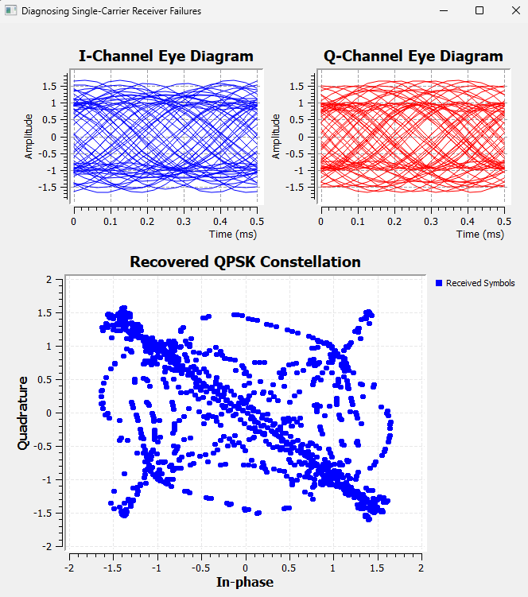

The result is dramatically different from the no-carrier-recovery ring.

The fixed sampler takes one sample and skips seven, but it has no mechanism for changing the sampling phase as the transmitter and receiver clocks drift relative to one another.

With `Epsilon = 1.01`, the correct symbol instant therefore moves continuously relative to the fixed sampler.

The constellation develops structured trajectories through and between the QPSK decision regions, and reliable information recovery is lost.

The failure chain is

```text
Sample-rate mismatch
      +
Symbol Sync disabled
      ↓
Sampling phase continuously drifts
      ↓
Samples move away from symbol centers
      ↓
Constellation becomes strongly distorted
      ↓
Symbol decisions become unreliable
      ↓
Payload recovery fails
```

### 24.6.3 Breaking Frame Synchronization

The final failure is conceptually different.

We restore a working physical-layer receiver so that the eye and constellation are good, but replace the correct access code

```text
1101001110010110
```

with an incorrect pattern.

The receiver still recovers the waveform.

It still recovers QPSK symbols.

It can still produce the corresponding bit stream.

But the frame synchronizer never finds the expected preamble, so it does not generate the required `frame_start` tag.

The Payload Decoder therefore produces no output.

This case does not need another figure because the clean eye and constellation would simply repeat results already shown. The important observation is the absence of information recovery despite successful earlier receiver stages.

It demonstrates a fundamental hierarchy:

> **Correct waveform recovery and correct symbol recovery are not sufficient if the receiver does not know where the meaningful frame begins.**

### Try It Yourself

Restore the correct access code and verify that the payload immediately returns.

Then change only one or two bits of the access code while keeping the correlation threshold at zero.

Before running the flowgraph, predict whether any `frame_start` tags will be generated.

This simple test reinforces the distinction between recovering a bit stream and locating meaningful information within that stream.

---

## 24.7 Reading Receiver Diagnostics Correctly

Across the experiments in this chapter, different impairments produced different visual signatures.

These signatures are useful diagnostic clues, but they should never be treated as absolute rules without considering where the plot was measured and what other impairments are present.

The following table summarizes the main observations.

| Impairment or failure | Eye-diagram signature | Constellation signature | Information-level consequence |
|---|---|---|---|
| Additive noise | Traces become thicker and increasingly fuzzy | Four clusters spread randomly | Increasing symbol and bit errors; sufficiently strong noise corrupts the payload |
| Multipath | Eye opening degrades because of ISI | Structured spreading, arcs, or multiple clusters | Symbol errors increase unless the channel is equalized |
| CFO without carrier recovery | I and Q become heavily smeared because the constellation continuously rotates | Ring or rotating constellation | Stable symbol decisions are lost; frame and payload recovery fail |
| Sample-rate mismatch without timing recovery | Sampling position drifts through the eye | Structured trajectories appear between symbol locations | Symbol decisions become unreliable and payload recovery fails |
| QPSK phase ambiguity | Eye may remain usable | Four clean clusters may still appear with ambiguous absolute orientation | Bit mapping may be wrong despite a clean constellation; differential coding removes the ambiguity |
| Frame-synchronization failure | Eye can remain open | Constellation can remain clean | Correct symbols and bits may exist, but the receiver cannot locate the payload |

Two principles are especially important.

First:

> **Never interpret an eye diagram or constellation without knowing where in the receiver chain it was measured.**

An eye measured before carrier recovery can look badly smeared because I and Q are rotating, even though timing information still exists and the downstream receiver ultimately recovers the symbols.

An eye measured before an equalizer cannot show the improvement produced later by that equalizer.

Second:

> **A clean constellation is evidence of successful symbol recovery, not necessarily successful information recovery.**

The QPSK phase-ambiguity experiment demonstrated this directly. Four clean clusters can exist with an incorrect absolute symbol labeling.

The frame-synchronization failure goes one step further. Even correct bits are insufficient if the receiver cannot identify their frame boundary.

---

## 24.8 The Complete Receiver as a Hierarchy

It is now useful to step away from individual GNU Radio blocks and look at what the complete receiver is actually doing.

```text
Received waveform
       ↓
Matched filtering
       ↓
Carrier and timing synchronization
       ↓
Reliable symbol-rate samples
       ↓
Equalization when channel memory requires it
       ↓
Symbol decisions
       ↓
Differential decoding
       ↓
Recovered bits
       ↓
Frame synchronization
       ↓
Payload extraction
       ↓
Recovered information
```

This can be understood at three levels.

### Signal Recovery

At the first level, the receiver attempts to produce a usable signal representation.

Matched filtering improves the signal for symbol detection. Timing synchronization finds useful sampling instants. Carrier synchronization establishes a stable complex reference. Equalization compensates for channel memory when multipath creates ISI.

### Symbol Recovery

Once suitable samples are available, the receiver determines which constellation symbols were most likely transmitted.

For QPSK, this means deciding among four possible symbol states.

A clean constellation is strong evidence that this level is working.

### Information Recovery

Finally, the symbol decisions must be converted into the original information.

Differential decoding resolves the way information was represented across successive QPSK states. Symbol indices are repacked into bits. Frame synchronization locates the known preamble. The payload is then extracted and interpreted.

Only at this final level can we say that the communication system has accomplished its actual purpose.

In Experiment 24.4, that final proof was simple:

```text
Recovered payload: SDR
```

---

## 24.9 Practical Lessons from Building the Complete Receiver

The complete receiver reveals several lessons that are difficult to appreciate when each algorithm is studied separately.

Receiver stages interact. A synchronization block cannot be assumed to behave identically when its input sample rate, waveform, or preceding processing stage changes.

Receiver ordering matters, but there is no single ordering that should be memorized without context. The correct architecture depends on the algorithms and signal conditions.

Acquisition and tracking are different operating phases. A synchronization loop may produce transient errors while it is converging and then operate reliably after lock.

Different impairments leave different signatures. Noise produces random spreading, multipath produces structured ISI, uncompensated CFO produces rotation, and timing mismatch produces sampling-related distortion.

A correction stage solves a particular class of problem. Equalization does not remove CFO. Carrier synchronization does not remove random noise. Differential decoding does not replace carrier recovery. Frame synchronization does not improve the constellation.

Most importantly, intermediate plots are diagnostic tools rather than the final definition of success.

The ultimate question is not

> Does the constellation look good?

It is

> **Did the receiver recover the intended information?**

---

## 24.10 What We Learned

In this chapter, we combined the major receiver functions developed throughout the preceding chapters into progressively more complete single-carrier communication systems.

We first established an ideal pulse-shaped QPSK baseline and used it to distinguish the information provided by an eye diagram from that provided by a constellation.

We then integrated timing and carrier recovery. The experiment showed that individually working receiver blocks can interact when combined and that the ordering that worked for our Symbol Sync and Costas Loop implementation had to be established experimentally.

Controlled channel impairments showed how the receiver responds to timing mismatch, carrier-frequency offset, and additive noise. In particular, we saw that CFO can heavily smear pre-carrier-recovery I/Q eye diagrams even when the downstream receiver successfully recovers the QPSK constellation.

We then introduced a controlled multipath echo and observed genuine inter-symbol interference. Unlike random noise, the multipath distortion produced structured constellation trajectories. An adaptive LMS equalizer significantly tightened the recovered constellation.

Next, we moved beyond visual symbol recovery and transmitted a known frame containing the text `SDR`. This exposed an important QPSK phase-ambiguity problem: a Costas Loop can produce a clean constellation while the absolute symbol labeling remains ambiguous. Differential encoding and decoding made the information insensitive to this constant quadrant ambiguity.

The complete receiver then recovered the payload under carrier-frequency offset, sample-rate mismatch, and moderate noise simultaneously. Increasing the noise eventually produced actual payload errors, demonstrating the direct connection between constellation spreading and information corruption.

Finally, we deliberately removed receiver functions. Without carrier recovery, CFO produced a rotating ring and no payload. Without timing recovery, sample-rate mismatch caused the sampling instants to drift and the constellation became strongly distorted. With an incorrect frame access code, the waveform and symbols could still be recovered, but the receiver could not locate the payload.

The complete receiver can therefore be understood as a hierarchy:

```text
Signal recovery
      ↓
Symbol recovery
      ↓
Information recovery
```

Successful digital communication requires all three.

---

## 24.11 Connecting to the Next Chapter

We have now built a complete single-carrier digital receiver.

It can recover timing, track carrier-frequency error, compensate for channel distortion, make symbol decisions, reconstruct bits, locate frames, and recover an actual payload.

That is a significant achievement.

But Experiment 24.3 also reminds us of a fundamental difficulty.

Multipath creates delayed copies of the transmitted waveform. When the symbol period is long compared with the channel delay spread, the overlap between neighboring symbols may be manageable. As the symbol rate increases, however, the symbol period becomes shorter. The same physical multipath delay then occupies a larger fraction of a symbol interval.

Inter-symbol interference becomes increasingly severe.

An equalizer can compensate for this distortion, but a strongly frequency-selective channel can require an increasingly capable equalizer.

This leads to a different question.

> **Instead of transmitting one high-rate symbol stream through a difficult frequency-selective channel, what if we divided the information among many slower symbol streams?**

That idea leads naturally to multicarrier communication and, in particular, **Orthogonal Frequency Division Multiplexing (OFDM)**.

In the next chapter, we will begin by asking why OFDM is useful and how multiple closely spaced carriers can coexist without interfering with one another.
