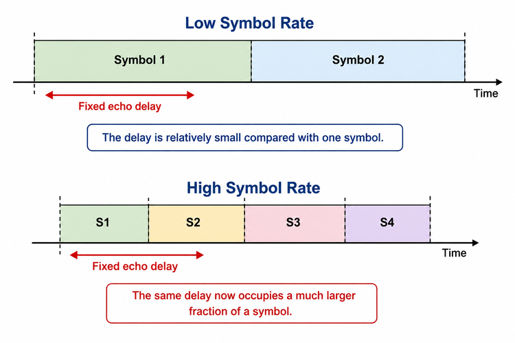
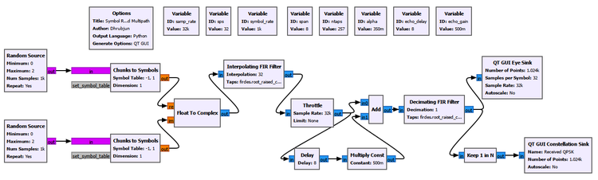
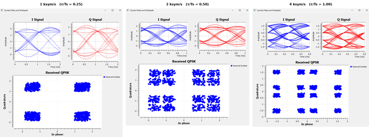
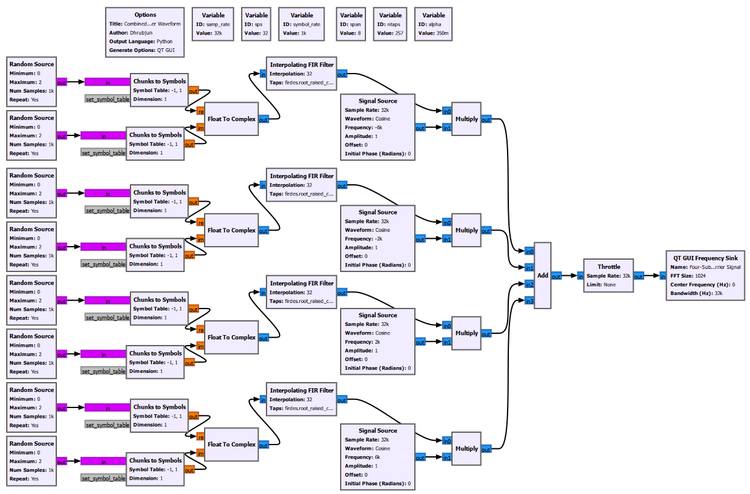
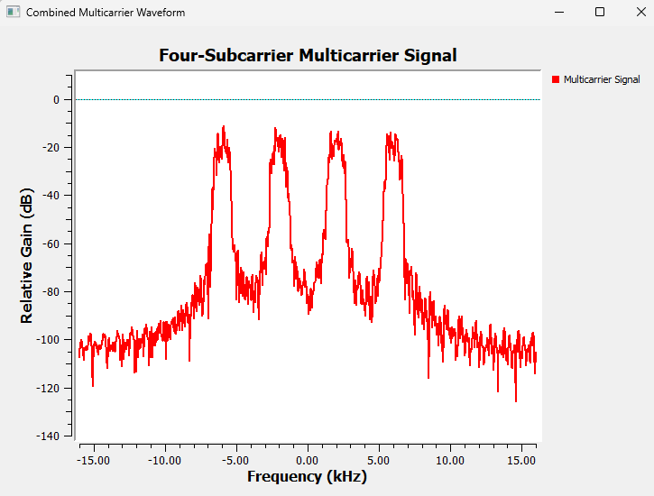
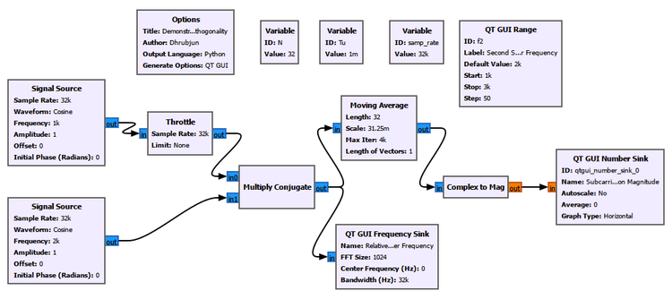
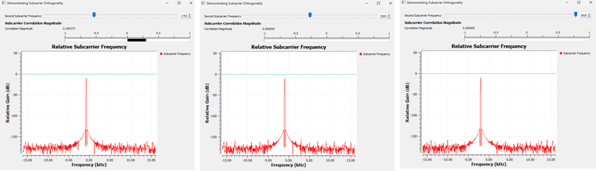
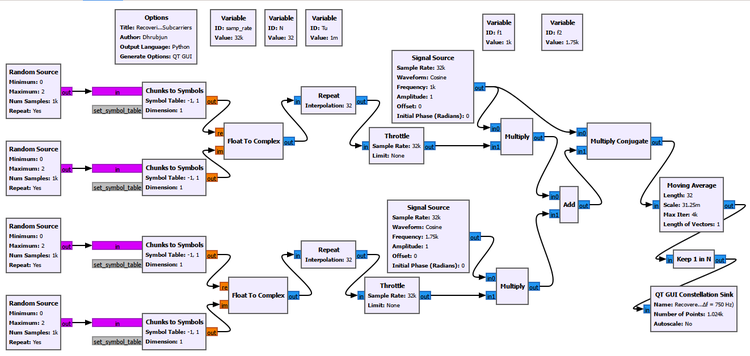
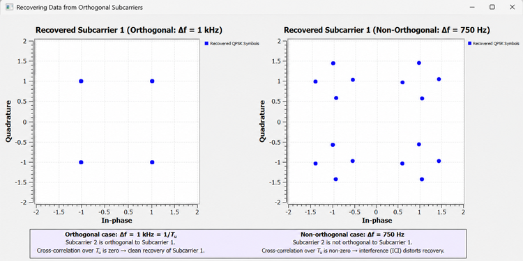
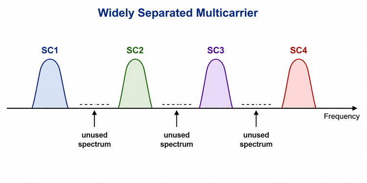

# Chapter 25: Why OFDM?

In the previous chapters, we progressively built a practical digital receiver. We learned how a wireless channel can distort a signal, how equalization can reduce intersymbol interference, how carrier synchronization corrects frequency and phase errors, how timing synchronization determines the correct symbol-sampling instants, and how frame synchronization identifies where a packet begins.

Those techniques prepare us to ask a different question.

What happens when we want to transmit data at a much higher rate?

One obvious answer is to transmit symbols faster. If a single carrier carries more symbols every second, the data rate can increase. But a higher symbol rate also means a shorter symbol duration. In a multipath channel, that can become a serious problem because delayed copies of one symbol can extend into neighboring symbols.

A different approach is to divide the high-rate stream into several slower parallel streams and transmit those streams on different subcarriers.

That is the starting idea behind multicarrier communication.

However, simply adding more carriers creates another problem. If the carriers are separated widely enough to avoid interfering with each other, a large amount of spectrum can be wasted. If they are moved closer together without any special design, they begin to interfere.

Orthogonal Frequency Division Multiplexing, or **OFDM**, solves this problem in a particularly elegant way. It uses many closely spaced subcarriers whose spectra can overlap, but the subcarriers are chosen so that they remain mathematically separable over the useful symbol interval.

This chapter develops that idea experimentally. We will not begin with the IFFT or with GNU Radio's ready-made OFDM blocks. Instead, we will first understand **why OFDM is useful**, what orthogonality actually means, and why zero cross-correlation between different subcarriers matters to a real data receiver.

By the end of the chapter, the motivation for OFDM should feel natural rather than mysterious.

---

## 25.1 The Problem with One Very Fast Carrier

Suppose a communication system uses a single QPSK carrier.

If the symbol rate is

$$R_s$$

then the symbol duration is

$$T_s=\frac{1}{R_s}$$

Increasing the symbol rate therefore decreases the time occupied by each symbol.

At first, this sounds entirely beneficial. More symbols per second can mean more information per second. The difficulty appears when the signal passes through a multipath channel.

A reflected copy of the signal may arrive some fixed amount of time after the direct path. That physical delay does not automatically become smaller just because we transmit faster.

Consider a fixed echo delay. At a low symbol rate, that delay may occupy only a small fraction of one symbol. At a higher symbol rate, the same delay can occupy a much larger fraction of the symbol duration.

Conceptually,



This is the first motivation for multicarrier transmission.

---

## Experiment 25.1: Symbol Rate and Multipath in Single-Carrier Transmission

### Goal

The purpose of this experiment is to observe how a fixed multipath delay becomes increasingly troublesome as the symbol rate of a single-carrier QPSK signal increases.

We use the same physical echo delay while changing the number of samples per symbol. The constellation and eye diagram allow us to see how the received signal changes.

### Main setup

The experiment uses a sample rate of

$$F_s=32000\text{ samples/s}$$

and begins with

$$\text{sps}=32$$

which gives

$$R_s=\frac{F_s}{\text{sps}}=\frac{32000}{32}=1000\text{ symbols/s}$$

The QPSK signal is generated from independent in-phase and quadrature bit streams. Each branch maps binary values to $-1$ and $+1$, after which the two branches are combined into a complex signal.

A root-raised-cosine pulse-shaping filter is used, followed by a simple multipath channel consisting of a direct path and a delayed, attenuated copy.

The important starting parameters are:

| Parameter | Value |
|---|---:|
| Sample rate | 32 ksample/s |
| Samples per symbol | 32 initially |
| Symbol rate | 1 ksymbol/s initially |
| RRC roll-off factor | 0.35 |
| Filter span | 8 symbols |
| Number of taps | 257 |
| Echo delay | 8 samples |
| Echo gain | 0.5 |



The echo is deliberately kept fixed while the symbol rate is changed. This is important. We are not trying to make the channel worse between runs. We are asking how the **same channel delay** affects signals with different symbol durations.

### What we observe

At the lower symbol rate, the received constellation and eye diagram remain comparatively well behaved. As the symbol rate increases, the fixed echo delay becomes a larger fraction of the symbol interval.

The eye begins to close and the constellation becomes increasingly distorted.



The important point is not that a high symbol rate is inherently bad. The important point is the **relationship between the channel delay spread and the symbol duration**.

A useful way to think about it is

```text
Higher symbol rate
        ↓
Shorter symbol duration
        ↓
Fixed multipath delay becomes larger
relative to one symbol
        ↓
Greater risk of neighboring-symbol overlap
        ↓
More difficult equalization and detection
```

This suggests a different strategy.

Instead of forcing one carrier to transmit one very fast stream, perhaps we can divide the information into several slower parallel streams.

---

## 25.2 From One Fast Stream to Several Slower Streams

Imagine that a high-rate stream is divided into four lower-rate streams.

Instead of

```text
High-rate data
     ↓
One fast carrier
```

we can use

```text
                 ┌──> Slow stream 1 --> Subcarrier 1
                 │
High-rate data --+──> Slow stream 2 --> Subcarrier 2
                 │
                 +──> Slow stream 3 --> Subcarrier 3
                 │
                 └──> Slow stream 4 --> Subcarrier 4
```

If the total information rate is distributed among several subcarriers, each individual subcarrier can operate at a lower symbol rate.

That means a longer symbol duration on each subcarrier.

A longer symbol duration is attractive in a multipath environment because a fixed physical delay occupies a smaller fraction of the symbol interval.

This is the basic **multicarrier** idea.

---

## Experiment 25.2: Building a Multicarrier Signal

### Goal

The goal of this experiment is to build a simple multicarrier waveform manually and observe several independently modulated subcarriers in the frequency domain.

We intentionally build the system from ordinary GNU Radio blocks rather than using an OFDM Transmitter block. At this stage, seeing how the individual branches combine is more valuable than hiding the process inside a high-level block.

### Building the branches

Each branch generates QPSK symbols and pulse shapes them at a lower symbol rate. The complex baseband signal is then shifted to a different subcarrier frequency by multiplying it by a complex sinusoid.

The branches are finally added together.

Conceptually,

```text
QPSK stream 1 --> pulse shaping --> frequency shift 1 --\
QPSK stream 2 --> pulse shaping --> frequency shift 2 ---+
QPSK stream 3 --> pulse shaping --> frequency shift 3 ---+--> Add
QPSK stream 4 --> pulse shaping --> frequency shift 4 --/
```

In our experiment, each branch operates at approximately 1 ksymbol/s, while the subcarriers are initially placed at approximately

```text
-6 kHz
-2 kHz
+2 kHz
+6 kHz
```

This gives a spacing of about 4 kHz.



### Observing the combined spectrum

The QT GUI Frequency Sink shows four distinct pulse-shaped spectral regions.



This demonstrates the multicarrier principle clearly. Instead of transmitting everything through one fast QPSK stream, the information can be distributed among several slower streams occupying different frequency regions.

But the spectrum also reveals a weakness in this simple arrangement.

The carriers are widely separated.

There is considerable frequency space between them.

If a practical system required hundreds of subcarriers, leaving large gaps between every pair would use spectrum very inefficiently.

We therefore want to move the subcarriers closer together.

That creates the next question:

> If the spectra of neighboring subcarriers overlap, how can the receiver distinguish them?

The answer is **orthogonality**.

---

## 25.3 What Does Orthogonal Mean?

The word *orthogonal* can sound more complicated than the underlying idea.

A familiar example comes from vectors.

Consider two unit vectors

$$\mathbf{x}=[1,0]$$

and

$$\mathbf{y}=[0,1]$$

A vector compared with itself gives

$$\mathbf{x}\cdot\mathbf{x}=1$$

but the dot product between the two different vectors is

$$\mathbf{x}\cdot\mathbf{y}=0$$

The two vectors are therefore orthogonal.

Signals can have an analogous relationship. Instead of taking a dot product between two short vectors, we compare two waveforms over a specified time interval.

This distinction is important:

> A normalized signal correlated with itself gives 1. Two different normalized orthogonal signals have zero cross-correlation.

That is why a correlation value of zero, rather than one, is the result we seek when testing **two different subcarriers** for orthogonality.

---

## Experiment 25.3: Demonstrating Subcarrier Orthogonality

### Goal

This experiment asks a very specific question:

> How can two nearby carriers have zero cross-correlation over a chosen observation interval?

We use two simple complex carriers without data modulation so that the orthogonality itself is easy to see.

The main parameters are:

| Parameter | Value |
|---|---:|
| Sample rate, $F_s$ | 32 ksample/s |
| Number of samples, $N$ | 32 |
| Useful observation interval, $T_u$ | 1 ms |
| First carrier, $f_1$ | 1 kHz |
| Second carrier, $f_2$ | Variable |

Because

$$T_u=\frac{N}{F_s}=\frac{32}{32000}=0.001\text{ s}=1\text{ ms}$$

the reciprocal of the useful interval is

$$\frac{1}{T_u}=1000\text{ Hz}$$

### GNU Radio Toolbox: Moving Average as a Correlation Window

The **Moving Average** block has appeared before, but here it has an especially useful interpretation.

After multiplying one carrier by the conjugate of the other, we average the result over exactly $N=32$ samples. Because those 32 samples correspond to $T_u=1$ ms, the block is effectively measuring the average relationship between the two carriers over the useful interval.

The important settings are:

```text
Length: N
Scale: 1.0/N
```

For this experiment,

```text
Length: 32
Scale: 0.03125
```

The **Complex to Mag** block converts the resulting complex correlation into a magnitude that can be displayed by a QT GUI Number Sink.



### Thinking of the carriers as rotating arrows

A simple way to understand this experiment is to imagine each complex carrier as a rotating arrow.

The first carrier rotates at

$$f_1=1000\text{ Hz}$$

Suppose the second carrier rotates at

$$f_2=2000\text{ Hz}$$

The two arrows rotate at different rates. We are interested in how one rotates **relative to the other**.

The Multiply Conjugate block reveals this relative rotation.

The frequency difference is

$$\Delta f=f_2-f_1=1000\text{ Hz}$$

A 1 kHz relative rotation takes

$$\frac{1}{1000}=1\text{ ms}$$

to complete one full cycle.

That is exactly our chosen interval $T_u$.

So during the 1 ms averaging interval, the relative complex vector makes one complete rotation.

Conceptually,

```text
Start       Quarter turn       Half turn       Three quarters       End

  -->             ↑               <--                ↓              -->
   0°            90°              180°              270°            360°
```

When all of these directions are averaged over the complete cycle, they cancel.

```text
--> + ↑ + <-- + ↓ + ... ≈ 0
```

The Number Sink therefore approaches

```text
Correlation magnitude ≈ 0
```

The carriers are orthogonal over this interval.

### The non-orthogonal 750 Hz case

Now keep

$$f_1=1000\text{ Hz}$$

but change the second carrier to

$$f_2=1750\text{ Hz}$$

The spacing becomes

$$\Delta f=750\text{ Hz}$$

During $T_u=1$ ms, the relative carrier completes only

$$\Delta fT_u=750(0.001)=0.75$$

of a cycle.

It does not complete an integer number of rotations before the averaging interval ends.

Therefore, the different directions do not cancel perfectly.

The experiment measured a correlation magnitude of approximately

$$|C|\approx0.300377$$

This is a nonzero result, so the carriers are not orthogonal over the chosen interval.

### Why did 2 kHz spacing also give zero?

We also tested

$$f_2=3000\text{ Hz}$$

with $f_1=1000$ Hz.

The spacing is then

$$\Delta f=2000\text{ Hz}$$

During 1 ms, the relative carrier completes exactly two full rotations.

Two complete rotations also average to zero.

This gives the broader result:

```text
Δf = 750 Hz
0.75 rotation in Tu
correlation ≠ 0
not orthogonal

Δf = 1 kHz
1 complete rotation in Tu
correlation = 0
orthogonal

Δf = 2 kHz
2 complete rotations in Tu
correlation = 0
orthogonal
```



The general orthogonality condition is

$$\Delta f=\frac{k}{T_u},\qquad k=1,2,3,\ldots$$

Equivalently,

$$\Delta fT_u=k$$

where $k$ is a nonzero integer.

### Why does OFDM normally choose $1/T_u$?

If $2/T_u$, $3/T_u$, and other integer multiples can also be orthogonal, why is the familiar OFDM spacing

$$\Delta f=\frac{1}{T_u}$$

so important?

Because it is the **smallest nonzero orthogonal spacing**.

For our $T_u=1$ ms experiment:

| Spacing | $\Delta fT_u$ | Orthogonal? | Interpretation |
|---:|---:|---|---|
| 750 Hz | 0.75 | No | Nonzero cross-correlation |
| 1 kHz | 1 | Yes | Closest orthogonal spacing |
| 2 kHz | 2 | Yes | Orthogonal, but more widely separated |
| 3 kHz | 3 | Yes | Orthogonal, but wastes still more spacing |

OFDM wants to pack subcarriers efficiently. Therefore, adjacent subcarriers normally use the smallest spacing that preserves orthogonality:

$$\boxed{\Delta f=\frac{1}{T_u}}$$

### What did the two GUI displays actually tell us?

It is useful not to confuse the roles of the displays in this experiment.

The QT GUI Frequency Sink after Multiply Conjugate showed the **relative or difference-frequency component**. For example, with $f_1=1$ kHz and $f_2=2$ kHz, the relative frequency appears at approximately $-1$ kHz because of the multiplication order used by Multiply Conjugate.

That frequency display does not by itself prove orthogonality.

The crucial evidence is the **correlation magnitude** produced after averaging over $T_u$.

A zero result means that the two different carriers have zero cross-correlation over the chosen interval.

---

## 25.4 Why Is Orthogonality Useful?

We have now shown that two different carriers can have zero cross-correlation.

But why should a communication receiver care?

This is the practical heart of OFDM.

Suppose two subcarriers carry independent data symbols. If the receiver is trying to detect Subcarrier 1, we want Subcarrier 1 to survive the detection process while Subcarrier 2 contributes nothing.

For normalized carriers, we want

$$C_{11}=1$$

for the desired carrier correlated with itself, but

$$C_{12}=0$$

for the cross-correlation between different orthogonal carriers.

This means the receiver can distinguish the desired subcarrier even though another subcarrier is simultaneously present.

Experiment 25.4 demonstrates this using actual QPSK data.

---

## Experiment 25.4: Recovering Data from Orthogonal Subcarriers

### Goal

The purpose of this experiment is to show the practical communication meaning of orthogonality.

We transmit independent QPSK symbols on two subcarriers and attempt to recover Subcarrier 1.

We then compare:

1. an orthogonal spacing of 1 kHz, and
2. a non-orthogonal spacing of 750 Hz.

### Generating the QPSK streams

Each QPSK stream is constructed from independent in-phase and quadrature binary streams.

The Chunks to Symbols blocks map the binary values to

```text
-1
+1
```

and Float to Complex combines the I and Q branches.

Unlike Experiment 24.2, we do **not** use an RRC pulse-shaping filter here.

Instead, every QPSK symbol is deliberately held constant for exactly $N=32$ samples using a Repeat block.

With

$$F_s=32000\text{ samples/s}$$

and

$$N=32$$

each QPSK symbol therefore occupies

$$T_u=\frac{32}{32000}=1\text{ ms}$$

This rectangular, finite-duration symbol interval is intentional. It gives us exactly the common interval over which the subcarrier orthogonality from Experiment 24.3 was defined.

The transmitter can be understood as

```text
QPSK stream 1 --> Repeat N --> × carrier f1 --\
                                                +--> Add
QPSK stream 2 --> Repeat N --> × carrier f2 --/
```

The main variables are:

| Parameter | Value |
|---|---:|
| Sample rate | 32 ksample/s |
| $N$ | 32 samples |
| $T_u$ | 1 ms |
| $f_1$ | 1 kHz |
| $f_2$ | 2 kHz for orthogonal case |
| $f_2$ | 1.75 kHz for non-orthogonal case |

### Recovering Subcarrier 1

The receiver uses a clean reference at $f_1=1$ kHz.

The combined signal is multiplied by the conjugate of that reference. The result is then averaged over exactly $N=32$ samples.

Conceptually,

```text
Combined two-subcarrier signal
              ↓
Multiply by conjugate of f1
              ↓
Average over Tu = 32 samples
              ↓
Keep one value per symbol interval
              ↓
Recovered Subcarrier 1
              ↓
Constellation Sink
```

The Moving Average uses

```text
Length: N
Scale: 1.0/N
```

and Keep 1 in N reduces the stream to one recovered complex value per 32-sample interval.



### Orthogonal case: $\Delta f=1$ kHz

For the first case,

$$f_1=1000\text{ Hz}$$

and

$$f_2=2000\text{ Hz}$$

so

$$\Delta f=1000\text{ Hz}=\frac{1}{T_u}$$

Suppose the two transmitted QPSK symbols during one useful interval are $A_1$ and $A_2$.

The received signal can be represented conceptually as

$$x(t)=A_1s_1(t)+A_2s_2(t)$$

The receiver correlates this combined signal with Subcarrier 1.

The desired carrier correlates with itself:

$$C_{11}=1$$

The second, orthogonal carrier has

$$C_{21}=0$$

Therefore, the receiver obtains

$$A_1C_{11}+A_2C_{21}=A_1(1)+A_2(0)=A_1$$

This equation expresses the practical benefit of orthogonality very clearly.

The desired QPSK symbol survives.

The contribution from the other orthogonal subcarrier cancels.

The recovered constellation therefore contains the four expected QPSK points.

### Non-orthogonal case: $\Delta f=750$ Hz

Next, we change only the second carrier to

$$f_2=1750\text{ Hz}$$

The spacing is now

$$\Delta f=750\text{ Hz}$$

From Experiment 25.3, we already know that the cross-correlation over $T_u$ is no longer zero. Its magnitude was approximately 0.300377.

Therefore, the receiver no longer obtains only $A_1$.

Instead, the detected symbol contains a contribution from the second subcarrier:

$$\hat{A}_1=A_1+C_{21}A_2$$

In simple terms,

```text
Wanted QPSK symbol
        +
part of Subcarrier 2
        ↓
distorted recovered symbol
```

Because $A_2$ is itself changing among QPSK values, the interference shifts the desired constellation point to several possible locations.

That is exactly what the experiment shows.



The orthogonal case produces four clean constellation points.

The non-orthogonal case produces multiple displaced points because Subcarrier 2 leaks into the detection of Subcarrier 1.

This unwanted interaction between subcarriers is called **inter-carrier interference**, or **ICI**.

A non-orthogonal carrier is not necessarily impossible to decode under every possible receiver design. The important conclusion from this experiment is more precise:

> Orthogonal subcarriers can ideally be separated without mutual interference by the corresponding correlation operation, while loss of orthogonality introduces inter-carrier interference and makes detection more difficult.

---

## 25.5 The Advantage of Orthogonality

We can now answer one of the most important questions in the chapter:

> What is the advantage of making the subcarriers orthogonal?

The answer is that **orthogonality allows the subcarriers to be packed closely in frequency while remaining separable at the receiver under ideal conditions**.

Without this property, a simple multicarrier system might need substantial spacing or guard bands between neighboring carriers. Although this makes the subcarriers easier to separate, the unused frequency regions between them reduce spectral efficiency.



OFDM takes a more efficient approach.

The individual subcarrier spectra are allowed to overlap. The frequencies are chosen so that each subcarrier is orthogonal to the others over the useful OFDM symbol interval.

Therefore, spectral overlap does not automatically imply that the receiver cannot separate the subcarriers.

This is the key distinction:

> **Spectral overlap and interference are not the same thing when the waveforms are orthogonal and the receiver observes them over the correct interval.**

This allows OFDM to combine two valuable properties:

- each individual subcarrier can carry a relatively slow symbol stream, and
- the subcarriers can still be packed efficiently in frequency.

That combination is the central reason OFDM is so useful.

---

## 25.6 Why OFDM Helps with Multipath

We should now connect the orthogonality discussion back to the problem that started the chapter.

Experiment 25.1 showed that increasing the symbol rate on a single carrier shortens the symbol duration.

A fixed multipath delay then occupies a larger fraction of each symbol.

Multicarrier transmission takes the opposite approach.

Instead of one fast stream,

```text
High-rate data
      ↓
one very fast symbol stream
      ↓
short symbols
```

we divide the data among several parallel streams:

```text
High-rate data
      ↓
many slower parallel streams
      ↓
longer symbols on each subcarrier
```

Longer symbols make a given physical multipath delay smaller relative to the useful symbol duration.

This does not mean that OFDM magically eliminates multipath. Multipath still affects the signal, and later we will need a guard interval, a cyclic prefix, channel estimation, and equalization.

The important point here is more fundamental:

> Dividing a high-rate stream among many slower subcarriers creates longer symbol intervals, which makes the channel's delay spread easier to manage.

Orthogonality then allows those many subcarriers to be packed efficiently.

So the reasoning developed in this chapter is

```text
Need a high data rate
        ↓
One very fast carrier
        ↓
Short symbol duration
        ↓
Fixed multipath delay becomes significant
        ↓
Divide data into slower parallel streams
        ↓
Use multiple subcarriers
        ↓
Longer symbol duration on each subcarrier
        ↓
But widely separated carriers waste bandwidth
        ↓
Move the carriers closer together
        ↓
Choose orthogonal spacing
        ↓
Spectra can overlap while subcarriers
remain ideally separable
        ↓
OFDM
```

---

## 25.7 How Do We Decide the Orthogonal Frequencies?

In a practical OFDM design, we do not choose subcarrier frequencies by visually inspecting the spectrum.

We begin with the useful OFDM symbol duration $T_u$.

The minimum adjacent orthogonal spacing is

$$\Delta f=\frac{1}{T_u}$$

The subcarrier frequencies can then be written as

$$f_k=f_0+\frac{k}{T_u}$$

where $k$ is an integer.

The absolute starting frequency $f_0$ can shift the whole set of subcarriers. What matters for orthogonality is the spacing between them over the common useful interval.

For example, with

$$T_u=1\text{ ms}$$

we obtain

$$\Delta f=1\text{ kHz}$$

A possible baseband set is therefore

```text
...  -2 kHz  -1 kHz   0   +1 kHz  +2 kHz  ...
```

The same principle will become even more important in the next chapter.

Suppose an OFDM symbol contains $N$ useful time-domain samples at sample rate $F_s$.

Then

$$T_u=\frac{N}{F_s}$$

and therefore

$$\Delta f=\frac{1}{T_u}=\frac{F_s}{N}$$

But $F_s/N$ is exactly the spacing between FFT frequency bins.

This is not a coincidence.

It is the bridge between the orthogonality we developed manually in this chapter and the FFT/IFFT implementation of OFDM.

---

## Try It Yourself

Return to Experiment 25.3 and keep

```text
f1 = 1 kHz
Tu = 1 ms
```

Before running the flowgraph, predict what should happen for each of these values:

```text
f2 = 1.5 kHz
f2 = 2.0 kHz
f2 = 2.5 kHz
f2 = 3.0 kHz
f2 = 4.0 kHz
```

For each case, calculate

$$\Delta fT_u$$

before looking at the Number Sink.

Ask yourself:

- Does the relative carrier complete an integer number of rotations during $T_u$?
- Should the cross-correlation approach zero?
- If the carriers are orthogonal, is the chosen spacing the most spectrally efficient one?

Then return to Experiment 24.4 and try one of the non-integer spacings. Predict whether the recovered Subcarrier 1 constellation will remain clean before running the flowgraph.

The purpose is not to memorize particular frequencies. It is to recognize the condition

$$\Delta fT_u=k$$

and understand what it means physically.

---

## 25.8 From Manual Multicarrier to OFDM

Our experiments deliberately used individual Signal Source and Multiply blocks.

For a few subcarriers, that is useful because we can see exactly what is happening.

But imagine a practical system with

```text
64 subcarriers
256 subcarriers
1024 subcarriers
2048 subcarriers
```

Manually creating a separate oscillator and multiplier for every subcarrier would be cumbersome and computationally inefficient.

We need a better method.

Earlier in the book, the Fourier transform was mainly used as an analysis tool. We had a time-domain signal and used the FFT to ask:

> What frequency components are present?

OFDM leads us to the reverse question:

> If we choose the complex values that we want on a set of frequency bins, can we efficiently construct the corresponding time-domain waveform?

The answer is yes.

That is exactly what the **inverse fast Fourier transform**, or **IFFT**, allows us to do.

Instead of manually building

```text
Symbol 1 --> × Subcarrier 1 --\
Symbol 2 --> × Subcarrier 2 ---+
Symbol 3 --> × Subcarrier 3 ---+--> Add
            ...                |
Symbol N --> × Subcarrier N --/
```

we can place the desired complex symbols into frequency-domain bins and use an IFFT to generate the complete time-domain multicarrier signal at once.

This is the computational idea that turns our manual experiments into a practical OFDM transmitter.

---

## What We Learned

In this chapter, we developed the motivation for OFDM from the communication problem rather than starting with an OFDM block.

We first observed that increasing the symbol rate of a single-carrier signal shortens the symbol duration. A fixed multipath delay therefore becomes increasingly significant relative to each symbol.

This motivated dividing a high-rate stream among several slower parallel streams.

We then built a simple four-subcarrier multicarrier waveform. Each subcarrier could operate at a lower symbol rate, but widely separating the carriers used spectrum inefficiently.

This led to the idea of orthogonality.

We learned that for normalized signals:

$$C_{ii}=1$$

when a carrier is correlated with itself, while two different orthogonal carriers satisfy

$$C_{ij}=0,\qquad i\neq j$$

over the chosen useful interval.

Experiment 24.3 showed this directly. With $T_u=1$ ms, a spacing of 1 kHz produced one complete relative rotation and zero cross-correlation. A spacing of 750 Hz produced only 0.75 of a rotation and a nonzero correlation magnitude of approximately 0.300377. A spacing of 2 kHz produced two complete rotations and again gave zero correlation.

The general condition is

$$\Delta f=\frac{k}{T_u}$$

for nonzero integer $k$.

OFDM normally chooses

$$\Delta f=\frac{1}{T_u}$$

because this is the closest nonzero orthogonal spacing and therefore uses the spectrum efficiently.

Experiment 24.4 then demonstrated why zero cross-correlation matters to actual communication. When two QPSK streams were transmitted on orthogonal subcarriers, the receiver recovered Subcarrier 1 as

$$A_1(1)+A_2(0)=A_1$$

and the constellation remained clean.

When the spacing was changed to the non-orthogonal value of 750 Hz, the second subcarrier no longer cancelled. Its data leaked into the detection of the first subcarrier, producing inter-carrier interference and a distorted constellation.

The central idea of the chapter can therefore be summarized as:

> **OFDM divides a high-rate data stream among many slower subcarriers and chooses those subcarriers to be orthogonal, allowing them to be packed closely and even overlap spectrally while remaining ideally separable at the receiver.**

---

## Connecting to the Next Chapter

We now understand **why** we want many orthogonal subcarriers.

But our manual construction creates an obvious practical problem.

If an OFDM system uses hundreds or thousands of subcarriers, do we really need hundreds or thousands of oscillators, multipliers, and adders?

Fortunately, no.

The orthogonal spacing developed in this chapter has a direct relationship with the frequency bins of the discrete Fourier transform:

$$\Delta f=\frac{F_s}{N}=\frac{1}{T_u}$$

This means that the FFT and IFFT provide a natural and efficient way to work with a complete set of orthogonal subcarriers.

In the next chapter, **Building an OFDM Signal with the IFFT**, we will stop constructing every subcarrier manually. Instead, we will place data symbols into frequency-domain bins and use the IFFT to generate the complete OFDM waveform.

That is where the multicarrier idea developed here becomes a practical OFDM transmitter.
