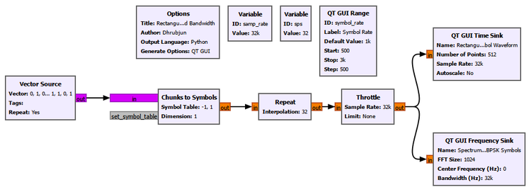
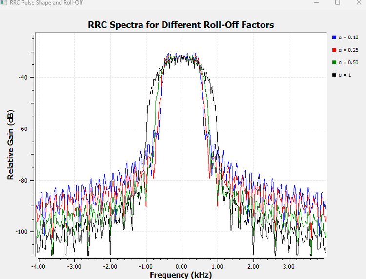
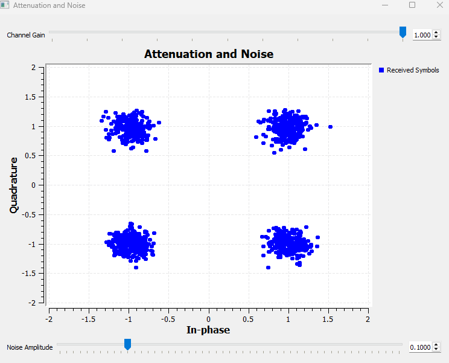

# Learn Software Defined Radio by Building, Observing, and Experimenting

**SDR with GNU Radio** is an experiment-driven introduction to Software Defined Radio, digital signal processing, and communication systems.

The book develops the ideas progressively through intuition, GNU Radio experiments, visual observation, and supporting mathematics. The goal is not only to learn how GNU Radio works, but to understand why real communication systems behave the way they do.

:::: {.columns}

::: {.column width="33%"}

### BUILD



Build signals and communication systems in GNU Radio.

:::

::: {.column width="33%"}

### EXPLORE



Explore signals in the frequency domain and observe how their spectra change.

:::

::: {.column width="34%"}

### ANALYZE



Analyze received signals using constellation diagrams and other visual tools.

:::

::::

## About the Book

This book follows a practical learning path from basic signals to complete communication systems.

Rather than introducing every concept through mathematics first, most chapters begin with an engineering question, build a GNU Radio experiment, observe what happens, and then explain the theory behind the result.

## How This Book Is Taught

Most topics follow the same learning pattern:

```text
Idea
  ↓
Prediction
  ↓
GNU Radio Experiment
  ↓
Observation
  ↓
Explanation
  ↓
Mathematics
  ↓
Engineering Interpretation
```

This makes the experiments part of the explanation rather than just demonstrations added after the theory.

## What You Will Learn

The book progresses from signals, sampling, IQ representation, FFTs, filtering, and modulation to wireless-channel effects, equalization, synchronization, complete digital receivers, OFDM, and practical SDR hardware.

## About the Author

**Dhrubjun Nath Saikia** is the author of *SDR with GNU Radio*. The book is developed as a practical, experiment-driven guide to Software Defined Radio, digital signal processing, and communication systems.

## Source Code and Experiments

The GNU Radio flowgraphs, supporting scripts, figures, and Markdown source are available in the project repository.

[View the project on GitHub](https://github.com/dhrubjun/sdr-with-gnu-radio)